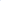

# RABot: Reinforcement-Guided Graph Augmentation for Imbalanced and Noisy Social Bot Detection

<!-- Page 1 -->

RABot: Reinforcement-Guided Graph Augmentation for

Imbalanced and Noisy Social Bot Detection

Longlong Zhang1,2, Xi Wang3, Haotong Du4, Yangyi Xu1, Zhuo Liu1, Yang Liu1,2*

1School of Artificial Intelligence, Optics and Electronics (iOPEN), Northwestern Polytechnical University 2Shenzhen Research Institute, Northwestern Polytechnical University 3School of Automation Science and Engineering, Xi’an Jiaotong University 4School of Computer Science, Northwestern Polytechnical University {zhanglonglong, duhaotong, xu yangyi, zhuoliu02}@mail.nwpu.edu.cn, vancywangxi@ust.hk, yangliuyh@gmail.com

## Abstract

Social bot detection is pivotal for safeguarding the integrity of online information ecosystems. Although recent graph neural network (GNN) solutions achieve strong results, they remain hindered by two practical challenges: (i) severe class imbalance arising from the high cost of generating bots, and (ii) topological noise introduced by bots that skillfully mimic human behavior and forge deceptive links. We propose the Reinforcement-guided graph Augmentation social Bot detector (RABot), a multi-granularity graph-augmentation framework that addresses both issues in a unified manner. RABot employs a neighborhood-aware oversampling strategy that linearly interpolates minority-class embeddings within local subgraphs, thereby stabilizing the decision boundary under low-resource regimes. Concurrently, a reinforcementlearning-driven edge-filtering module combines similaritybased edge features with adaptive threshold optimization to excise spurious interactions during message passing, yielding a cleaner topology. Extensive experiments on three realworld benchmarks and four GNN backbones demonstrate that RABot consistently surpasses state-of-the-art baselines. In addition, since its augmentation and filtering modules are orthogonal to the underlying architecture, RABot can be seamlessly integrated into existing GNN pipelines to boost performance with minimal overhead.

## Introduction

With social media now serving as the primary platform for public discourse, the infiltration of social bots has become a growing academic and practical concern (Cresci 2020). Social bots are software agents that imitate human users and can participate in large-scale interactions across online platforms (Ferrara et al. 2016). Empirical studies have linked them to a range of harmful behaviors, including dissemination of disinformation (Shao et al. 2018), interference in elections (Rossi et al. 2020), manipulation of public opinion (Cheng, Luo, and Yu 2020), and the spread of extremist ideologies (Fernandez and Alani 2021; Liu et al. 2025a). Effective bot-detection techniques are therefore vital for reducing these threats and maintaining trust in online information ecosystems (Orabi et al. 2020).

*Corresponding author. Copyright © 2026, Association for the Advancement of Artificial Intelligence (www.aaai.org). All rights reserved.

Current social bot detection schemes mainly fall into two categories: feature-based approaches and graph-based approaches (Alothali et al. 2018). Feature-based methods examine either user metadata (Yang et al. 2020) or textual content (Hayawi et al. 2022). Metadata encompasses numerical attributes and categorical attributes; classifiers differentiate bots from legitimate accounts by contrasting these values (Patil and Deshpande 2022). Text-oriented models employ word-vector encoders or pretrained language models to process tweets and profile descriptions, thereby extracting latent semantic cues indicative of automated behavior (Wu, Ye, and Man 2023). Although informative, such shallow features often fail to unveil camouflaged bots (Cresci et al. 2017). Adversaries can replicate large portions of genuine user information and inject only minimal malicious content, effectively narrowing the observable gap between bots and real accounts (Yan et al. 2021).

To address these limitations, recent work has shifted toward graph-based methods that leverage advances in graph neural networks (GNNs) (Feng et al. 2022; Liu et al. 2023; Wu et al. 2025). These models build on the empirical observation that genuine users form cohesive communities, whereas bots connect in a more random fashion, creating distinctive topological signatures (Yang, Harkreader, and Gu 2013). By explicitly modelling the underlying socialnetwork structure, graph-based detectors can generally surpass feature-based ones (Li et al. 2024). Nevertheless, two key challenges persist. (i) Class imbalance. Social graphs contain far fewer bot nodes than human nodes. This skew biases graph-based models toward the majority class and leads to systematic misclassification of bots (Liu et al. 2022). Mitigating this extreme imbalance is therefore essential for reliable bot detection. (ii) Noisy or spurious edges. Social graphs often include numerous unreliable interactions, for example, as illustrated in Figure 1, edges linking a human account to a bot (Cresci 2020; Feng et al. 2021b). During message aggregation, these edges introduce bot-generated features into otherwise benign neighborhoods; deeper GNN layers propagate and amplify this noise, ultimately degrading the detection performance.

To tackle the foregoing challenges, we present the Reinforcement-guided graph Augmentation social Bot detector (RABot), a graph-enhanced detection framework that

The Fortieth AAAI Conference on Artificial Intelligence (AAAI-26)

<!-- Page 2 -->

**Figure 1.** Unreliable aggregation in social networks (left). Performance variation after removing all unreliable edges on Twibot-20 (right).

addresses class imbalance and topological noise in a unified manner. RABot first augments the minority class through a neighborhood-aware oversampling module that interpolates new samples along local feature manifolds. It then refines the social graph by estimating edge reliability with a reinforcement-learning agent and pruning low-confidence ties, allowing the subsequent GNN to propagate information over trustworthy neighborhood only. In such a manner, RABot can effectively mitigate the impact of class imbalance and topological noise, thereby significantly improving detection accuracy and robustness. Our main contributions are as follows: • Neighborhood-aware oversampling. We introduce a dynamic oversampling scheme that exploits local feature distributions to synthesize minority-class nodes, thus preserving decision boundaries under severe class imbalance. • Reinforcement-guided edge filtering. We propose an adaptive edge-pruning mechanism that combines similarity metrics with reinforcement learning to detect and remove spurious or camouflaged connections during GNN aggregation, substantially reducing topological noise. • Comprehensive evaluation. RABot is validated on three widely used social bot datasets, where it consistently surpasses the state-of-the-art detectors. Ablation studies also confirm the individual contributions of the oversampling and edge-filtering modules.

## Related Work

Social Bot Detection Social bot detection aims to identify automated bot accounts on social networking platforms. Early social bot detection models primarily depended on manually designed and extracted features, leveraging user metadata (Alothali, Hayawi, and Alashwal 2021) and tweets (Mazza et al. 2019) in conjunction with traditional classifiers for bot detection. With the rapid advancement of deep learning, neural networkbased methods have increasingly been applied to social bot detection tasks, such as LSTM (Alkahtani and Aldhyani 2021), GAN (Stanton and A. Irissappane 2019) and various pre-trained language models (Kumar et al. 2021) to capture semantic inconsistencies in user information. However, with the advancement of bot anthropomorphism technology, methods that rely solely on user data or tweet information are gradually losing effectiveness. To overcome this limitation, researchers have proposed various methods that integrate user profile information with tweet data (Feng et al.

2021a) to enhance bot detection. With the development of GNNs, researchers have gradually incorporated the topological structure of social networks into bot detection tasks (Cai et al. 2024; Wei et al. 2025). Since then, researchers have focused on the heterogeneity of social networks (Feng et al. 2022; Liu et al. 2025b), leading to significant improvements in detection performance. Subsequent studies introduce multi-view contrastive learning, enhancing detection by maximizing inter-view mutual information and incorporating multi-task objectives (Yang et al. 2024). Recent studies achieve state-of-the-art results by dynamically modeling social networks and capturing the evolution of user behavior (He et al. 2024). However, existing methods often overlook class imbalance and unreliable connections in social networks, which can lead to biased learning and degraded detection performance.

Graph Augmentation Graph augmentation generally refers to optimizing the quality of graph data by modifying the distribution of node features or reconstructing graph structure. Early graph augmentation methods enhance the generalization and robustness of neural networks by optimizing the feature distribution of graph nodes (Velickovic et al. 2019). For example, some studies (Park, Song, and Yang 2021) construct an embedding space to encode node similarities, ensuring the authenticity of synthesized samples. Subsequently, graph augmentation methods focusing on optimizing graph structures (Zhao et al. 2022; Liu et al. 2024) have been proposed. Among them, contrastive learning methods have become an important paradigm: through topological perturbations (Hou et al. 2022), subgraph comparisons (More´n and G¨ohringer 2022) and heterogeneous relationship mining (Yu et al. 2022), structural robustness enhancement is achieved under selfsupervised conditions. In recent years, dynamic adaptationbased graph augmentation methods, such as learnable edge weight (Shen et al. 2023), implicit relationship reasoning (Wei et al. 2024), and multi-scale fusion (Duan et al. 2023), have gained increasing attention. These methods enhance model adaptability to noisy and sparse data through taskoriented structural optimization.

Problem Definition A social network can be represented as a graph G = (V, E), where V = {v1,..., vn} denotes the set of users (nodes) and E ⊆V ×V denotes the set of social interactions (edges), with n = |V | the number of nodes in G. Each node vi is associated with a κ-dimension feature vector ui ∈Rκ that encodes metadata, textual, and topological cues. Social bot detection is formulated as a node-level binary classification task. We seek an encoder f: Rκ →[0, 1] such that, for every user vi, the predicted score ˆyi = f(ui) is close to the ground-truth label yi ∈{0, 1}. The objective is to maximize classification accuracy over all nodes in V:

max f

1 |V |

|V | X i=1

1(˜yi = yi), (1)

where 1(·) is the indicator function and ˜yi = 1ˆyi≥0.5.

AI-readable visual equivalent, added: Figure extracted from the paper PDF and converted to an SVG wrapper asset. Use the surrounding page text and caption for interpretation.

AI-readable visual equivalent, added: Figure extracted from the paper PDF and converted to an SVG wrapper asset. Use the surrounding page text and caption for interpretation.

<!-- Page 3 -->

**Figure 2.** Overall structure of RABot model, which consists of four modules: user information representation module, feature augmentation module, reinforcement edge filtering module and GNN classification module.

## Methodology

The overall architecture of RABot is illustrated in Figure 2. Our approach adopts a multi-granularity graph enhancement framework that improves representation learning on social networks through a dual collaborative mechanism. First, a feature-augmentation module based on neighborhood propagation synthesizes compensatory samples for the minority class within local subgraph spaces. Next, an edge filtering module that combines similarity metrics with reinforcement learning dynamically prunes noisy connections and reconstructs the graph topology during message passing, guided by edge weight confidence scores. Finally, the refined multimodal features and purified graph structure are fed into a GNN classifier, yielding accurate bot detection.

User Information Representation User information in social networks can be divided into profile attributes and textual content. The former contains numerical and Boolean fields, whereas the latter comprises the free-form profile description and the sequence of tweets published by the user. We extract four corresponding feature vectors with a multilayer perceptron (MLP) and a pretrained language model (LM) (Liu et al. 2019) as:

uv i = viWv, ub i = biWb, ud i = LM(di)Wd, ut i =

AvePool{LM(t1 i),..., LM(tm i)}

Wt,

(2)

where uv i and ub i encode the numerical and Boolean attributes of i-th user, ud i encodes the profile description di, and ut i encodes the m tweets {t1 i,..., tm i }. The matrices Wv, Wb, Wd, and Wt are learnable parameters.

To fuse the heterogeneous features while alleviating semantic mismatch among modalities, we apply a multi-head self attention mechanism (Vaswani et al. 2017):

U = {u1,..., un | ui = Concat(uv i, ub i, ud i, ut i)W}, Qc = UWc,q, Kc = UWc,k, Vc = UWc,v,

ˆU =

C

∥ c=1

Softmax

QcK⊤ c √dk

Vc,

(3) where U is the initial user-level embedding, dk = κ/C is the dimension of each head, and (Qc, Kc, Vc) are the query, key, and value matrices of the c-th head obtained through the trainable weights Wc,q, Wc,k, and Wc,v, respectively. The operator ∥concatenates the outputs of the C heads, yielding the final representation ˆU.

Feature Augmentation

Conventional GNN oversampling methods synthesize nodes in the original feature space (Duan et al. 2022). Since these artificial nodes have no natural edges, a post-hoc linking step is required, which often introduces noise. Motivated by the approach (Zhao, Zhang, and Wang 2021), we instead generate minority-class embeddings directly in the latent space, simultaneously balancing the class distribution and avoiding noisy edge construction.

Let V = (V1, V2) denote the user set, where V1 and V2 are minority and majority instances, respectively. For minority node vi ∈V1, we identify its k nearest neighbors as:

Γ(vi) = Top-k

{vj ∈V1 | vj̸ = vi}, L(ui, uj)

, (4)

where L(ui, uj) = ∥ui −uj∥2 is the Euclidean distance between the latent features of vi and vj.

We then select a random neighbor vx ∈Γ(vi) and create

AI-readable visual equivalent, added: Figure extracted from the paper PDF and converted to an SVG wrapper asset. Use the surrounding page text and caption for interpretation.

<!-- Page 4 -->

a synthetic node vk by linear interpolation:

uk = (1 −δ) ui + δ ux, δ ∼U(0, 1), (5)

where uk is the feature vector of the generated node vk. The generated node vk inherits the minority label. Such sampling process is repeated until the class sizes are balanced, yielding a set of labelled virtual nodes that equalizes the training distribution.

Reinforcement Edge Filtering This module is motivated by two practical needs: (i) to suppress edges that obscure the true class structure of the graph, and (ii) to adjust the filtering strength as training proceeds. The workflow therefore proceeds in three stages: computing similarity scores, filtering edges under a learnable threshold, and updating that threshold through reinforcement learning.

Node-level similarity. A pair of nodes with similar features is likely to share the same class label and to form a reliable edge, whereas a large feature gap suggests the opposite. However, advanced camouflage enables many bots to imitate human behavior, so na¨ıve embedding distances no longer suffice. To obtain a more discriminative measure, we pass each node through a two-layer MLP label predictor and compute the ℓ1 distance between central node vi and its corresponding neighbor vj as:

D r,(l)

i,j = σ

MLP(l)(h r,(l−1)

i)

−σ

MLP(l)(h r,(l−1)

j)

1, (6) followed by a similarity probability as:

p r,(l)

i,j = 1 −D r,(l)

i,j, (7)

where σ(·) is the Sigmoid function and the superscript (l−1) denotes features from the previous GNN layer.

Edge filtering. To control filtering strength we introduce a trainable threshold τ ∈(0, 1), initialized at 0.5. For each edge (v r i, v r j) ∈Er, m r,(l)

i,j =

(

1, p r,(l)

i,j ≥τ,

0, p r,(l)

i,j < τ,

(8)

where m r,(l)

i,j = 1 retains the edge and 0 removes it. We supervise this binary decision with a Binary Cross-Entropy (BCE) loss that rewards correct retention of homogeneous edges and removal of heterogeneous ones obeying

L(l)

edge = E h R X r=1

X i,j: yi=yj

−log p r,(l)

i,j +

X i,j: yi̸=yj

−log(1−p r,(l)

i,j)

i

.

(9)

Adaptive threshold. The optimal value of τ can differ across datasets and even across training epochs. To capture this dynamic we update τ every T epochs with a lightweight reinforcement signal. • State. s = [µ(u), σ(u), ∆acc, ∆L] ∈R4, where µ and σ are the mean and standard deviation of node features, and ∆acc and ∆L measure recent changes in accuracy and loss, respectively.

• Policy. A small MLP with parameters θ maps the state s to an action a = σ

MLPθ(s)

∈(0, 1). • Action. Based on the current action a, we apply an update on τ obeying τ ←τ + (2a −1)λ, (10) where λ is a step size and (2a −1) ∈(−1, 1) determines both direction and magnitude.

GNN Classification Having obtained an augmented feature set and a denoised topology, we refine node embeddings with a generic GNN layer. The framework is architecture-agnostic, so any message-passing variant (e.g. GCN) can be substituted. For relation r at layer l+1, the aggregation and update steps are:

a r,(l+1)

i = Aggregate(l+1)

{v r,(l)

j | j ∈Nr(i)}, v r,(l)

i

, v (l+1)

i = Update(l+1)

v r,(l)

i, a r,(l+1)

i

R r=1,

(11) where Nr(i) is the neighbor set of vi under relation r, a r,(l+1)

i is the aggregated message, and v (l+1)

i is the updated representation.

A linear output layer followed by Softmax produces the class probabilities:

ˆyi = Softmax

Wvvi + bv

, (12)

where Wv and bv are learnable parameters and ˆyi represents the user category predicted by the model. The model is optimized with binary cross-entropy:

Lgnn = − n X i=1 h yi log ˆyi + (1 −yi) log(1 −ˆyi)

i

, (13)

where yi ∈{0, 1} is the ground-truth label.

Learning and Optimization To stabilize training and balance competing objectives, we adopt a multi-objective optimization scheme that jointly minimizes classification and edge-quality losses. The overall loss is defined as:

L = λs L′ gnn + (1 −λs) Lgnn + λe Ledge, (14)

where L′ gnn and Lgnn are the cross-entropy losses computed on the augmented nodes and the original nodes, respectively. The former mitigates class imbalance, whereas the latter preserves baseline discrimination. The edge component Ledge = (1/L)

XL l=1L(l)

edge is the average layer-wise BCE loss that guides edge filtering, with L denoting the number of GNN layers. Hyperparameters λs ∈[0, 1] and λe > 0 control the contribution of each term.

## Experiments

## Experimental Setup

Datasets and Evaluation. We benchmark our approach on three widely used social bot detection corpora: Cresci-15 (Cresci et al. 2015), Twibot-20 (Feng et al. 2021b), and

<!-- Page 5 -->

## Methods

Dataset Cresci-15 Twibot-20 MGTAB

Metrics Accuracy F1-score Accuracy F1-score Accuracy F1-score

Feature-based

Wei et al. 96.10±0.75 81.68±0.68 70.23±0.17 53.37±0.16 - - Varol et al. 93.25±0.24 94.82±0.10 78.73±0.37 81.26±0.42 - - SATAR 93.14±0.51 94.87±0.32 84.50±0.67 86.54±0.68 - - SGBot 77.40±0.82 78.15±0.13 81.63±0.55 84.91±0.34 - -

Graph-based

GCN 96.49±0.37 96.32±0.20 77.62±0.85 80.36±0.49 83.61±1.47 78.16±1.65 GAT 96.34±0.38 96.05±0.39 80.15±1.19 80.79±1.18 86.68±1.31 82.68±1.77 RGT 97.13±0.33 97.74±0.32 86.55±0.23 87.67±0.31 89.58±0.80 86.43±1.12 BotRGCN 96.58±0.68 97.34±0.50 84.69±0.40 85.47±0.43 89.27±1.06 86.07±1.49 BECE 98.73±0.62 98.57±0.54 87.24±0.59 88.01±0.73 90.31±0.64 88.10±0.52 LMBot 98.69±0.31 98.41±0.56 86.63±0.43 87.25±0.59 88.78±0.49 86.12±0.66 BotDGT 98.62±0.45 98.32±0.19 87.12±0.41 87.82±0.54 - - SEBot 98.67±0.44 98.54±0.61 87.26±0.36 88.06±0.45 90.28±0.47 84.98±0.36

Ours

RABot (GCN) 98.18±0.14 98.07±0.28 82.08±0.17 81.81±0.23 86.42±0.05 82.89±0.21 GCN (+) +1.69 +1.75 +4.46 +1.45 +2.81 +4.73 RABot (GAT) 98.46±0.22 98.28±0.26 83.98±0.17 83.41±0.21 89.94±0.49 86.61±0.43 GAT (+) +2.12 +2.23 +2.83 +1.62 +3.26 +3.93 RABot (RGT) 99.14±0.21 98.94±0.34 87.92±0.12 88.40±0.28 90.74±0.15 88.76±0.16 RGT (+) +2.01 +1.20 +1.37 +0.73 +1.16 +2.33 RABot (RGCN) 98.76±0.42 98.72±0.47 87.36±0.28 87.12±0.19 91.16±0.31 89.03±0.28 BotRGCN (+) +2.18 +1.38 +2.67 +1.65 +1.89 +2.96

**Table 1.** Performance comparison of varied detection methods on the Cresci-15, Twibot-20, and MGTAB datasets. Each method is executed five times, and we report the mean and standard deviation (mean ± std%). “GNN (+) ” denotes the absolute improvement of RABot (GNN) over its backbone GNN, whereas “–” indicates that the method cannot be applied to MGTAB. The best and second-best scores are highlighted with bold and underline, respectively.

MGTAB (Shi et al. 2023). For Cresci-15 and Twibot-20 we adopt the user-profile and textual features employed in ref. (Qiao et al. 2024), whereas for MGTAB we follow the extraction protocol of ref. (Yang et al. 2024). Users are modeled as nodes and their follower/friend links as edges of the social graph. Following (Qiao et al. 2024), each dataset is divided into 70% training, 20% validation, and 10% test splits. We report Accuracy and F1-score as our primary metrics.

Baselines. We compare RABot against both feature-based and graph-based baselines. The feature-based counterparts include Wei et al. (Wei and Nguyen 2019), Varol et al. (Varol et al. 2017), SATAR (Feng et al. 2021a), and SGBot (Yang et al. 2020). The graph-based competitors comprise GCN (Kipf and Welling 2016), GAT (Brody, Alon, and Yahav 2021), RGT (Feng et al. 2022), BotRGCN (Feng et al. 2021c), BECE (Qiao et al. 2024), LMBot (Cai et al. 2024), BotDGT (He et al. 2024), and SEBot (Yang et al. 2024).

Implementation Details. We implement the proposed model RABot in PyTorch with Geometric. The GNN classifier can plug in any mainstream GNN backbone; unless stated otherwise, we employ the default architecture described in Section 4. Optimization is performed with Adam (Kingma and Ba 2014) for 300 epochs and a learning rate of 0.001. All experiments run on a server with two NVIDIA RTX A800 GPUs (80 GB each), a 16-core CPU, and 503 GB RAM. Training completes in roughly 2, 5, and 10 minutes on Cresci-15, Twibot-20, and MGTAB datasets, respectively.

Main Results

**Table 1.** presents the averages (± std) of five independent runs of the proposed method and the compared baselines.

Below we highlight four key observations.

Overall superiority. RABot establishes a new state of the art on all three benchmarks. On Cresci-15, RABot (RGT) attains 99.14±0.21% accuracy and 98.94±0.34% F1-score, exceeding the runner-up BECE by 0.41 and 0.37 points, respectively. On Twibot-20, the same backbone yields 87.92±0.12% accuracy and 88.40±0.28% F1-score, surpassing the strongest baseline (SEBot) by 0.66 and 0.34 points. On the large-scale MGTAB corpus, RABot (RGCN) achieves 91.16±0.31% accuracy and 89.03±0.28% F1score, yielding absolute gains of 0.85 and 0.93 points over the best prior model.

Backbone-agnostic gains. Irrespective of the underlying GNN, RABot delivers consistent improvements: on average across the three datasets it boosts GCN by +2.99/ +2.64, GAT by +2.74/ +2.59, RGT by +1.51/ +1.42, and RGCN by +2.25/ +2.00 percentage points in accuracy and F1-score, respectively. This backbone-agnostic behavior confirms that our class-balancing and RL-based edge-filtering modules are complementary to existing message-passing schemes.

Scalability to noisy, large graphs. Performance gains are most pronounced on MGTAB, whose 1.7M edges exacerbate class imbalance and topological noise. Here RABot (GCN) registers the largest jump, indicating that our method is particularly beneficial when the base architecture is relatively weak and the graph is both large and noisy.

Improved stability. Besides higher means, RABot reduces run-to-run variance. For instance, on MGTAB the standard deviation of F1-score of RGT drops from 1.12% to

<!-- Page 6 -->

**Figure 3.** Performance of RABot with a RGCN backbone versus random edge removal of different drop rates on the Cresci-15, Twibot-20, and MGTAB datasets.

0.16% after integrating RABot, suggesting a smoother optimization trajectory and better convergence.

In short, these findings verify that RABot not only pushes raw accuracy/F1-score forward but also provides a robust, plug-and-play enhancement for diverse GNN backbones under varied scenarios.

**Figure 4.** Data-efficiency study. The model is trained on random subsamples of the original training data (10%-100%) from Twibot-20 and MGTAB, and evaluates on the full test sets.

Ablation Study

To quantify the impact of each design choice, we systematically disable or replace individual components of RABot and re-evaluate the model on two relatively large-scale benchmarks. The ablated variants include (i) w/o MA: removing the multi-head attention (MA) in the node encoder; (ii) w/o FA: removing the feature-augmentation (FA) module; (iii) w/o EF: omitting the enhanced edge-filtering (EF) mechanism; and (iv) w/o GC: discarding the GNN classification (GC) module in the propagation stage. Results for both the RGT and RGCN backbones are summarized in Table 2. Full model performs best. Across all datasets and backbones, the complete RABot achieves the highest accuracy and F1-score, confirming the synergistic effect of its components. Multi-head attention matters. Removing MA causes noticeable yet moderate drops (e.g., −0.52% of accuracy on Twibot-20 and −0.32% of F1-score on MGTAB with the RGT backbone), indicating that attention better captures heterogeneous user signals than a linear projection.

Ablation

Twibot-20 MGTAB Accuracy F1-score Accuracy F1-score

RGT backbone

RABot 87.92±0.12 88.40±0.28 90.74±0.15 88.76±0.16 w/o MA 87.40±0.27 88.08±0.17 90.42±0.31 88.41±0.29 w/o FA 87.31±0.16 87.96±0.31 89.90±0.19 86.88±0.23 w/o EF 86.96±0.12 87.74±0.34 89.63±0.18 86.96±0.37 w/o GC 85.18±0.19 86.83±0.22 87.23±0.24 85.93±0.38

RGCN backbone

RABot 87.36±0.28 87.12±0.19 91.16±0.31 89.03±0.28 w/o MA 86.89±0.52 86.75±0.38 90.91±0.43 88.90±0.44 w/o FA 86.81±0.47 86.62±0.26 89.88±0.45 87.28±0.47 w/o EF 86.03±0.27 86.14±0.43 89.73±0.39 87.31±0.40 w/o GC 85.46±0.24 85.68±0.16 87.04±0.58 86.46±0.47

**Table 2.** Ablation study on the Twibot-20 and MGTAB datasets. “w/o” indicates that the specified component is removed. MA, FA, EF, and GC denote the multi-head attention, feature-augmentation, enhanced edge-filtering, and GNN classification modules, respectively.

Feature augmentation aids class balance. Eliminating FA consistently harms performance, particularly on MGTAB where long-tailed class distribution is severe (accuracy decreases from 90.74% to 89.90% for RGT and from 91.16% to 89.88% for RGCN). This underscores the role of FA in mitigating imbalance and enriching minority representations. Edge filtering is critical. Removing EF yields the largest single-component degradation aside from GC, with average accuracy/F1-score losses of 1.21/1.29 points across datasets. The decline is most evident on MGTAB (−1.43 on accuracy, RGCN), demonstrating that denoising spurious edges is essential when social graphs contain deceptive connections. GNN classification drives the biggest gains. Excluding GC results in the steepest drop, up to −3.51% regarding accuracy and −2.83% of F1-score on MGTAB (RGT), highlighting its importance for refining node features during message passing.

Discussions Edge-filtering efficacy. To validate the proposed edgefiltering strategy, we compare RABot with a baseline that randomly removes the same proportion of edges. Figure 3 shows that RABot consistently surpasses random deletion across all datasets. The gains stem from the similarity-aware edge features and the reinforcement-learning filter, which

AI-readable visual equivalent, added: Figure extracted from the paper PDF and converted to an SVG wrapper asset. Use the surrounding page text and caption for interpretation.

AI-readable visual equivalent, added: Figure extracted from the paper PDF and converted to an SVG wrapper asset. Use the surrounding page text and caption for interpretation.

AI-readable visual equivalent, added: Figure extracted from the paper PDF and converted to an SVG wrapper asset. Use the surrounding page text and caption for interpretation.

AI-readable visual equivalent, added: Figure extracted from the paper PDF and converted to an SVG wrapper asset. Use the surrounding page text and caption for interpretation.

AI-readable visual equivalent, added: Figure extracted from the paper PDF and converted to an SVG wrapper asset. Use the surrounding page text and caption for interpretation.

<!-- Page 7 -->

jointly suppress structural noise and strengthen the GNN’s ability to capture salient connectivity patterns.

Thresholds

Twibot-20 MGTAB Accuracy F1-score Accuracy F1-score

0.2 86.16 86.04 89.97 87.33 0.4 86.62 86.48 90.54 88.15 0.6 86.73 86.61 90.32 87.84 0.8 86.06 85.94 89.89 87.10 ours 87.36 87.12 91.16 89.03

**Table 3.** Performance comparison between fixed and dynamic filtering thresholds (ours) on the Twibot-20 and MGTAB datasets.

Performance under limited supervision. Real-world social networks often have sparse and uneven annotations, challenging model generalization. To assess robustness in such settings, we vary the proportion of labelled training data from 10 % to 100 % (test sets remain fixed) and evaluate RABot (RGT) on Twibot-20 and MGTAB. Figure 4 indicates that RABot retains strong performance even with substantially reduced supervision: on Twibot-20 it outperforms most baselines using only 80 % of the training data, and on MGTAB it surpasses the state-of-the-art RGT backbone with just 50 %. When the training ratio exceeds 70 %, gains saturate, implying that RABot already captures the critical patterns in low- and medium-resource regimes.

**Figure 5.** Sensitivity of RABot with a GAT backbone to the loss weights λs and λe on the Twibot-20 and MGTAB.

Hyperparameter sensitivity. We further show the impact of the loss weights λs and λe in Figure 5. Across the entire grid, accuracy variations are all less than 1% on Twibot-20 and MGTAB. Such narrow ranges confirm that RABot remains stable even when the two coefficients deviate considerably from their optimal values. The best results on both datasets appear when λe lies between 0.5 and 0.7. Smaller values (≤0.1) do not provide a strong enough signal for edge cleaning, whereas very large values (1.0) slightly overemphasize the edge term and reduce node-level accuracy.

In addition, a moderate emphasis on synthetic minority nodes is beneficial. For Twibot-20, the highest scores are reached at λs = 0.3 and λs = 0.5, respectively; for MGTAB the optimum shifts to λs = 0.7, which reflects the heavier class imbalance in that dataset. The F1-score follows the same trend as accuracy, indicating a consistent trade-off between precision and recall. Besides, the proposed method is also robust to the number of GNN layers.

Effect of dynamic filtering threshold. To assess the impact of dynamic thresholding, we compare our method with fixed thresholds on Twibot-20 and MGTAB. As shown in Table 3, RABot (RGCN) yields the highest accuracy and F1-score on both datasets, outperforming all fixed settings. Compared to the best fixed threshold, it improves accuracy by 0.63% on Twibot-20 and 0.62% on MGTAB.

## Methods

Epoch Time Epoch Training Time Peak Memory

BECE 8.4s 100 14min 8268M LMBot 4.2s 300 21min 18636M BotDGT 27s 20 9min 5724M SEBot 13.5s 80 18min 14482M

RABot 1.0s 300 5min 2614M

**Table 4.** Comparisons of computational cost on Twibot-20.

Computational efficiency. Efficient training is essential for real-world deployment. As shown in Table 4, RABot (RGT) achieves the shortest training time and lowest peak memory usage among all methods. Despite running for 300 epochs, it is over 4 times faster than LMBot and uses only 14% of its memory. These results highlight RABot’s superior efficiency and scalability.

## Conclusion

We presented the Reinforcement-guided graph Augmentation social Bot detector (RABot), a novel framework for social bot detection that couples an oversamplingbased feature-augmentation strategy with a reinforcementlearning-driven edge-filtering mechanism. By jointly refining node representations and graph topology, RABot adapts to diverse graph structures and achieves superior robustness. Extensive evaluations on multiple benchmarks confirm that RABot consistently outperforms state-of-the-art alternatives. Future work will focus on further improving the efficiency of the edge-filtering module, lowering computational overhead, and extending RABot to domains beyond social media.

## Acknowledgments

This work was supported in part by the National Natural Science Foundation of China under Grant 62572404, Grant 62203363, and Grant 62402458; in part by the Guangdong Basic and Applied Basic Research Foundation under Grant No. 2025A1515011565.

AI-readable visual equivalent, added: Figure extracted from the paper PDF and converted to an SVG wrapper asset. Use the surrounding page text and caption for interpretation.

AI-readable visual equivalent, added: Figure extracted from the paper PDF and converted to an SVG wrapper asset. Use the surrounding page text and caption for interpretation.

AI-readable visual equivalent, added: Figure extracted from the paper PDF and converted to an SVG wrapper asset. Use the surrounding page text and caption for interpretation.

AI-readable visual equivalent, added: Figure extracted from the paper PDF and converted to an SVG wrapper asset. Use the surrounding page text and caption for interpretation.

<!-- Page 8 -->

## References

Alkahtani, H.; and Aldhyani, T. H. 2021. Botnet attack detection by using CNN-LSTM model for Internet of things applications. Security and Communication Networks, 2021(1): 3806459. Alothali, E.; Hayawi, K.; and Alashwal, H. 2021. Hybrid feature selection approach to identify optimal features of profile metadata to detect social bots in Twitter. Social Network Analysis and Mining, 11(1): 84. Alothali, E.; Zaki, N.; Mohamed, E. A.; and Alashwal, H. 2018. Detecting Social Bots on Twitter: A Literature Review. In 2018 International Conference on Innovations in Information Technology, 175–180. Brody, S.; Alon, U.; and Yahav, E. 2021. How attentive are graph attention networks? arXiv preprint arXiv:2105.14491. Cai, Z.; Tan, Z.; Lei, Z.; Zhu, Z.; Wang, H.; Zheng, Q.; and Luo, M. 2024. LMbot: distilling graph knowledge into language model for graph-less deployment in twitter bot detection. In Proceedings of the 17th ACM International Conference on Web Search and Data Mining, 57–66. Cheng, C.; Luo, Y.; and Yu, C. 2020. Dynamic mechanism of social bots interfering with public opinion in network. Physica A: Statistical Mechanics and its Applications, 551. Cresci, S. 2020. A decade of social bot detection. Communications of the ACM, 63(10): 72–83. Cresci, S.; Di Pietro, R.; Petrocchi, M.; Spognardi, A.; and Tesconi, M. 2015. Fame for sale: Efficient detection of fake Twitter followers. Decision Support Systems, 80: 56–71. Cresci, S.; Di Pietro, R.; Petrocchi, M.; Spognardi, A.; and Tesconi, M. 2017. The paradigm-shift of social spambots: Evidence, theories, and tools for the arms race. In Proceedings of the 26th International Conference on World Wide Web Companion, 963–972. Duan, J.; Wang, S.; Zhang, P.; Zhu, E.; Hu, J.; Jin, H.; Liu, Y.; and Dong, Z. 2023. Graph anomaly detection via multiscale contrastive learning networks with augmented view. In Proceedings of the AAAI Conference on Artificial Intelligence, 7459–7467. Duan, Y.; Liu, X.; Jatowt, A.; Yu, H.-t.; Lynden, S.; Kim, K.-S.; and Matono, A. 2022. Anonymity can help minority: A novel synthetic data over-sampling strategy on multi-label graphs. In Joint European Conference on Machine Learning and Knowledge Discovery in Databases, 20–36. Springer. Feng, S.; Tan, Z.; Li, R.; and Luo, M. 2022. Heterogeneityaware twitter bot detection with relational graph transformers. In Proceedings of the AAAI Conference on Artificial Intelligence, 3977–3985. Feng, S.; Wan, H.; Wang, N.; Li, J.; and Luo, M. 2021a. Satar: A self-supervised approach to twitter account representation learning and its application in bot detection. In Proceedings of the 30th ACM International Conference on Information & Knowledge Management, 3808–3817. Feng, S.; Wan, H.; Wang, N.; Li, J.; and Luo, M. 2021b. Twibot-20: A comprehensive twitter bot detection benchmark. In Proceedings of the 30th ACM International Conference on Information & Knowledge Management, 4485– 4494.

Feng, S.; Wan, H.; Wang, N.; and Luo, M. 2021c. BotRGCN: Twitter bot detection with relational graph convolutional networks. In Proceedings of the 2021 IEEE/ACM International Conference on Advances in Social Networks Analysis and Mining, 236–239. Fernandez, M.; and Alani, H. 2021. Artificial intelligence and online extremism: Challenges and opportunities. Predictive Policing and Artificial Intelligence, 132–162. Ferrara, E.; Varol, O.; Davis, C.; Menczer, F.; and Flammini, A. 2016. The rise of social bots. Communications of the ACM, 59(7): 96–104. Hayawi, K.; Mathew, S.; Venugopal, N.; Masud, M. M.; and Ho, P.-H. 2022. DeeProBot: a hybrid deep neural network model for social bot detection based on user profile data. Social Network Analysis and Mining, 12(1): 43. He, B.; Yang, Y.; Wu, Q.; Liu, H.; Yang, R.; Peng, H.; Wang, X.; Liao, Y.; and Zhou, P. 2024. Dynamicity-aware social bot detection with dynamic graph transformers. In Proceedings of the Thirty-Third International Joint Conference on Artificial Intelligence. Hou, Z.; Liu, X.; Cen, Y.; Dong, Y.; Yang, H.; Wang, C.; and Tang, J. 2022. Graphmae: Self-supervised masked graph autoencoders. In Proceedings of the 28th ACM SIGKDD Conference on knowledge Discovery and Data Mining, 594– 604. Kingma, D. P.; and Ba, J. 2014. Adam: A method for stochastic optimization. arXiv preprint arXiv:1412.6980. Kipf, T. N.; and Welling, M. 2016. Semi-supervised classification with graph convolutional networks. arXiv preprint arXiv:1609.02907. Kumar, S.; Garg, S.; Vats, Y.; and Parihar, A. S. 2021. Content Based Bot Detection using Bot Language Model and BERT Embeddings. In 5th International Conference on Computer, Communication and Signal Processing, 285–289. Li, Y.; Li, Z.; Gong, D.; Hu, Q.; and Lu, H. 2024. BotCL: a social bot detection model based on graph contrastive learning. Knowledge and Information Systems, 66: 5185–5202. Liu, F.; Ma, X.; Wu, J.; Yang, J.; Xue, S.; Beheshti, A.; Zhou, C.; Peng, H.; Sheng, Q. Z.; and Aggarwal, C. C. 2022. Dagad: Data augmentation for graph anomaly detection. In 2022 IEEE International Conference on Data Mining, 259– 268. Liu, Y.; Liang, G.; Wang, X.; Zhu, P.; and Wang, Z. 2024. Diffusion Containment in Complex Networks Through Collective Influence of Connections. IEEE Transactions on Information Forensics and Security, 19: 1510–1524. Liu, Y.; Ott, M.; Goyal, N.; Du, J.; Joshi, M.; Chen, D.; Levy, O.; Lewis, M.; Zettlemoyer, L.; and Stoyanov, V. 2019. Roberta: A robustly optimized bert pretraining approach. arXiv preprint arXiv:1907.11692. Liu, Y.; Tan, Z.; Wang, H.; Feng, S.; Zheng, Q.; and Luo, M. 2023. Botmoe: Twitter bot detection with community-aware mixtures of modal-specific experts. In Proceedings of the 46th International ACM SIGIR Conference on Research and Development in Information Retrieval, 485–495.

<!-- Page 9 -->

Liu, Y.; Wang, X.; Su, Z.; Xiao, Y.; and Wang, Z. 2025a. Efficient Edge Immunization Strategies for Diffusion Containment in Social Networks. IEEE Transactions on Dependable and Secure Computing, 1: 1–17. Liu, Y.; Wang, X.; Wang, X.; Wang, Z.; and Kurths, J. 2025b. Diffusion Source Inference for Large-Scale Complex Networks Based on Network Percolation. IEEE Transactions on Neural Networks and Learning Systems, 36(1): 1453–1466. Mazza, M.; Cresci, S.; Avvenuti, M.; Quattrociocchi, W.; and Tesconi, M. 2019. Rtbust: Exploiting temporal patterns for botnet detection on twitter. In Proceedings of the 10th ACM Conference on Web Science, 183–192. More´n, K.; and G¨ohringer, D. 2022. Graphcl: A framework for execution of data-flow graphs on multi-device platforms. In 2022 30th Euromicro International Conference on Parallel, Distributed and Network-based Processing, 116–121. Orabi, M.; Mouheb, D.; Al Aghbari, Z.; and Kamel, I. 2020. Detection of bots in social media: a systematic review. Information Processing & Management, 57(4): 102250. Park, J.; Song, J.; and Yang, E. 2021. Graphens: Neighboraware ego network synthesis for class-imbalanced node classification. In International Conference on Learning Representations. Patil, A. J.; and Deshpande, A. 2022. A comprehensive review on social botnet detection techniques. In 2022 International Conference on Augmented Intelligence and Sustainable Systems, 950–957. Qiao, B.; Zhou, W.; Li, K.; Li, S.; and Hu, S. 2024. Dispelling the fake: Social bot detection based on edge confidence evaluation. IEEE Transactions on Neural Networks and Learning Systems. Rossi, S.; Rossi, M.; Upreti, B. R.; and Liu, Y. 2020. Detecting political bots on Twitter during the 2019 Finnish parliamentary election. In Annual Hawaii International Conference on System Sciences, 2430–2439. Shao, C.; Ciampaglia, G. L.; Varol, O.; Yang, K.; Flammini, A.; and Menczer, F. 2018. The spread of low-credibility content by social bots. Nature Communications, 9: 4787. Shen, X.; Sun, D.; Pan, S.; Zhou, X.; and Yang, L. T. 2023. Neighbor contrastive learning on learnable graph augmentation. In Proceedings of the AAAI Conference on Artificial Intelligence, 9782–9791. Shi, S.; Qiao, K.; Chen, J.; Yang, S.; Yang, J.; Song, B.; Wang, L.; and Yan, B. 2023. Mgtab: A multi-relational graph-based twitter account detection benchmark. arXiv preprint arXiv:2301.01123. Stanton, G.; and A. Irissappane, A. 2019. GANs for Semi- Supervised Opinion Spam Detection. In Proceedings of the Twenty-Eighth International Joint Conference on Artificial Intelligence, 5204–5210. Varol, O.; Ferrara, E.; Davis, C.; Menczer, F.; and Flammini, A. 2017. Online human-bot interactions: Detection, estimation, and characterization. In Proceedings of the International AAAI Conference on Web and Social Media, 280–289.

Vaswani, A.; Shazeer, N.; Parmar, N.; Uszkoreit, J.; Jones, L.; Gomez, A. N.; Kaiser, Ł.; and Polosukhin, I. 2017. Attention is all you need. Advances in Neural Information Processing Systems, 30. Velickovic, P.; Fedus, W.; Hamilton, W. L.; Li`o, P.; Bengio, Y.; and Hjelm, R. D. 2019. Deep graph infomax. International Conference on Learning Representations, 2(3): 4. Wei, F.; and Nguyen, U. T. 2019. Twitter bot detection using bidirectional long short-term memory neural networks and word embeddings. In 2019 First IEEE International Conference on Trust, Privacy and Security in Intelligent Systems and Applications, 101–109. Wei, K.; Teng, M.; Du, H.; Wang, S.; Zhao, J.; and Gao, C. 2025. CAGCL: A Community-Aware Graph Contrastive Learning Model for Social Bot Detection. In Proceedings of the 34th ACM International Conference on Information and Knowledge Management, 3282–3291. Wei, W.; Ren, X.; Tang, J.; Wang, Q.; Su, L.; Cheng, S.; Wang, J.; Yin, D.; and Huang, C. 2024. Llmrec: Large language models with graph augmentation for recommendation. In Proceedings of the 17th ACM International Conference on Web Search and Data Mining, 806–815. Wu, J.; Du, H.; Xu, H.; Li, X.; Gao, C.; and Wang, Z. 2025. Search to integrate multi-level heuristics with graph neural networks for multi-relational link prediction. Neurocomputing, 130776. Wu, J.; Ye, X.; and Man, Y. 2023. Bottrinet: A unified and efficient embedding for social bots detection via metric learning. In 2023 11th International Symposium on Digital Forensics and Security, 1–6. Yan, H. Y.; Yang, K.-C.; Menczer, F.; and Shanahan, J. 2021. Asymmetrical perceptions of partisan political bots. New Media & Society, 23(10): 3016–3037. Yang, C.; Harkreader, R.; and Gu, G. 2013. Empirical Evaluation and New Design for Fighting Evolving Twitter Spammers. IEEE Transactions on Information Forensics and Security, 8(8): 1280–1293. Yang, K.-C.; Varol, O.; Hui, P.-M.; and Menczer, F. 2020. Scalable and generalizable social bot detection through data selection. In Proceedings of the AAAI Conference on Artificial Intelligence, 1096–1103. Yang, Y.; Wu, Q.; He, B.; Peng, H.; Yang, R.; Hao, Z.; and Liao, Y. 2024. Sebot: Structural entropy guided multi-view contrastive learning for social bot detection. In Proceedings of the 30th ACM SIGKDD Conference on Knowledge Discovery and Data Mining, 3841–3852. Yu, L.; Sun, L.; Du, B.; Liu, C.; Lv, W.; and Xiong, H. 2022. Heterogeneous graph representation learning with relation awareness. IEEE Transactions on Knowledge and Data Engineering, 35(6): 5935–5947. Zhao, T.; Liu, G.; Wang, D.; Yu, W.; and Jiang, M. 2022. Learning from counterfactual links for link prediction. In International Conference on Machine Learning, 26911. Zhao, T.; Zhang, X.; and Wang, S. 2021. Graphsmote: Imbalanced node classification on graphs with graph neural networks. In Proceedings of the 14th ACM International Conference on Web Search and Data Mining, 833–841.
