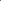
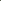
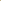
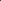
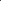
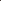
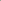
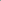
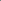
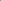

# RAW-Flow: Advancing RGB-to-RAW Image Reconstruction with Deterministic Latent Flow Matching

<!-- Page 1 -->

RAW-Flow: Advancing RGB-to-RAW Image Reconstruction with Deterministic

Latent Flow Matching

Zhen Liu1,*, Diedong Feng1,*, Hai Jiang2, Liaoyuan Zeng1,†, Hao Wang3, Chaoyu Feng3, Lei Lei3, Bing Zeng1, Shuaicheng Liu1,†

1University of Electronic Science and Technology of China 2Sichuan University 3Independent Researcher {liuzhen03@std., fengdiedong@std., lyzeng@, eezeng@, liushuaicheng@}uestc.edu.cn, jianghai@stu.scu.edu.cn

## Abstract

RGB-to-RAW reconstruction, or the reverse modeling of a camera Image Signal Processing (ISP) pipeline, aims to recover high-fidelity RAW data from RGB images. Despite notable progress, existing learning-based methods typically treat this task as a direct regression objective and struggle with detail inconsistency and color deviation, due to the illposed nature of inverse ISP and the inherent information loss in quantized RGB images. To address these limitations, we pioneer a generative perspective by reformulating RGB-to- RAW reconstruction as a deterministic latent transport problem and introduce a novel framework named RAW-Flow, which leverages flow matching to learn a deterministic vector field in latent space, to effectively bridge the gap between RGB and RAW representations and enable accurate reconstruction of structural details and color information. To further enhance latent transport, we introduce a cross-scale context guidance module that injects hierarchical RGB features into the flow estimation process. Moreover, we design a dual-domain latent autoencoder with a feature alignment constraint to support the proposed latent transport framework, which jointly encodes RGB and RAW inputs while promoting stable training and high-fidelity reconstruction. Extensive experiments demonstrate that RAW-Flow outperforms stateof-the-art approaches both quantitatively and visually.

Code — https://github.com/liuzhen03/RAW-Flow

## Introduction

Compared to compressed sRGB images that have undergone in-camera Image Signal Processing (ISP), RAW images, which retain the original linear irradiance measurements captured by the camera sensor, typically offer higher bit-depth and richer scene information, thereby being more amenable to accurate modeling by learning-based networks. A growing body of research has demonstrated the advantages of RAW data across various computer vision tasks, including object detection (Xu et al. 2023), low-light image

*These authors contributed equally. †Corresponding authors Copyright © 2026, Association for the Advancement of Artificial Intelligence (www.aaai.org). All rights reserved.

**Figure 1.** Visual comparisons with previous state-of-theart methods. The proposed RAW-Flow reconstructs higherfidelity local details, global luminance, and color information. Differences are best observed in the error maps.

enhancement (Dagli 2023; Jiang et al. 2025), image superresolution (Jiang, Xu, and Wang 2024), and image denoising (Zhang et al. 2021). However, collecting and annotating large-scale sensor-specific RAW datasets is prohibitively costly, and the large spatial dimension of RAW files places enormous strain on data storage and transmission. To mitigate these limitations, researchers have actively explored reconstructing RAW images from readily available RGB inputs, commonly known as RGB-to-RAW reconstruction.

Existing learning-based RGB-to-RAW reconstruction approaches can be broadly grouped into two categories. The first class (Li et al. 2024; Conde et al. 2022) incorporates additional priors or metadata (e.g., exposure, white balance) to approximate individual components of the ISP pipeline. While physically grounded, such methods are prone to cumulative reconstruction errors due to stage-wise modeling and often depend on metadata that is unavailable in realworld scenarios. The second category of methods (Xing, Qian, and Chen 2021; Berdan et al. 2025) learns a direct, camera-specific mapping from RGB to RAW using neural networks, thus attracting increased attention. Although these models bypass explicit priors dependency, the inversion of ISP remains inherently ill-posed, especially when attempting to reconstruct high-fidelity RAW signals from quantized, clipped RGB images. Nevertheless, despite employing

The Fortieth AAAI Conference on Artificial Intelligence (AAAI-26)

AI-readable visual equivalent, added: Figure extracted from the paper PDF and converted to an SVG wrapper asset. Use the surrounding page text and caption for interpretation.

AI-readable visual equivalent, added: Figure extracted from the paper PDF and converted to an SVG wrapper asset. Use the surrounding page text and caption for interpretation.

AI-readable visual equivalent, added: Figure extracted from the paper PDF and converted to an SVG wrapper asset. Use the surrounding page text and caption for interpretation.

AI-readable visual equivalent, added: Figure extracted from the paper PDF and converted to an SVG wrapper asset. Use the surrounding page text and caption for interpretation.

AI-readable visual equivalent, added: Figure extracted from the paper PDF and converted to an SVG wrapper asset. Use the surrounding page text and caption for interpretation.

AI-readable visual equivalent, added: Figure extracted from the paper PDF and converted to an SVG wrapper asset. Use the surrounding page text and caption for interpretation.

AI-readable visual equivalent, added: Figure extracted from the paper PDF and converted to an SVG wrapper asset. Use the surrounding page text and caption for interpretation.

AI-readable visual equivalent, added: Figure extracted from the paper PDF and converted to an SVG wrapper asset. Use the surrounding page text and caption for interpretation.

AI-readable visual equivalent, added: Figure extracted from the paper PDF and converted to an SVG wrapper asset. Use the surrounding page text and caption for interpretation.

AI-readable visual equivalent, added: Figure extracted from the paper PDF and converted to an SVG wrapper asset. Use the surrounding page text and caption for interpretation.

<!-- Page 2 -->

increasingly complex architectures and training objectives, these methods still struggle with generalization, color ambiguity, and incomplete detail recovery. As shown in Fig. 1, previous methods such as UPI (Brooks et al. 2019) and CycleR2R (Li et al. 2024) exhibit color shifts and blurred textures, resulting in degraded reconstruction quality.

Recently, generative models, particularly diffusion models (Ho, Jain, and Abbeel 2020; Song, Meng, and Ermon 2021), have achieved impressive success in image synthesis and restoration tasks (Rombach et al. 2022; Kawar et al. 2022; Wang et al. 2024), owing to their strong expressiveness and capacity to model complex data distributions. However, applying diffusion models directly to RGB-to-RAW reconstruction poses unique challenges. Specifically, learning a deterministic and semantically aligned mapping through noisy intermediate states is difficult due to the inherently ill-posed nature of ISP. This ambiguity often forces the model to over-rely on degraded or semantically mismatched RGB guidance, thereby compromising reconstruction fidelity. As shown in Fig.1, the recently published diffusionbased RAW-Diff(Reinders et al. 2025), which uses encoded RGB features for guidance, generates RAW images with noticeable structural distortions. Moreover, diffusion models are notoriously computationally expensive, often requiring hundreds of iterative denoising steps to converge, which limits their practical applicability in RAW reconstruction tasks.

In this paper, we address the aforementioned challenges by leveraging flow matching (Lipman et al. 2022), an alternative generative paradigm that learns time-dependent vector fields under direct supervision. Compared to diffusion models, flow matching enables more efficient and stable training by avoiding stochastic denoising. More specifically, we introduce RAW-Flow, a novel deterministic latent flow matching framework for high-fidelity RGB-to-RAW reconstruction. Unlike prior works that operate in pixel space, our approach formulates reconstruction as a latent-space transport problem, where a deterministic vector field is learned to move interpolated latent representations from the RGB domain to the RAW domain. To enhance the accuracy of latent transport, we propose a cross-scale context guidance module that injects hierarchical RGB features into the flow estimation process, promoting improved structural fidelity and chromatic consistency. To support the latent framework, we further design a Dual-domain Latent Autoencoder (DLAE) that jointly encodes RGB and RAW images into their respective latent spaces while ensuring high-quality reconstruction in both domains. A dual-domain feature alignment loss is introduced to stabilize training by encouraging earlylayer features in the RAW encoder to align with those from the RGB encoder. As shown in Fig. 1, the proposed RAW- Flow framework enables faithful reconstruction of sensorlevel RAW signals from RGB inputs. In summary, the main contributions of this work are as follows:

• We propose a novel deterministic latent flow matching framework, termed RAW-Flow, for RGB-to-RAW reconstruction, which models latent transport via a supervised vector field and incorporates a cross-scale context guidance module to improve luminance and detail fidelity.

• We introduce a Dual-domain Latent Autoencoder (DLAE) to jointly encode and reconstruct RGB and RAW images. A dual-domain feature alignment constraint is employed to stabilize RAW learning by aligning shallow features with their RGB counterparts. • Extensive experiments demonstrate that our method outperforms existing state-of-the-art approaches and is capable of reconstructing high-fidelity RAW images.

## Related Work

RGB-to-RAW Reconstruction Reconstructing RAW data from RGB images has been a long-standing challenge in low-level vision. Traditional approaches (Chakrabarti, Scharstein, and Zickler 2009; Debevec and Malik 2023; Chakrabarti et al. 2014; Grossberg and Nayar 2003; Lin and Zhang 2005; Mitsunaga and Nayar 1999) typically address this problem by calibrating the radiometric response function of cameras through controlled multi-exposure. For example, Mitsunaga et al. (Mitsunaga and Nayar 1999) fit a polynomial model to the response curve and iteratively refine it, thereby avoiding the need for precise exposure values. Debevec et al. (Debevec and Malik 2023) use a set of images with varying exposures and a smoothness prior to predict a non-parametric inverse response function. However, these methods require careful per-camera calibration and controlled image capture, limiting their applicability to real-world scenes.

Recently, deep learning-based approaches have substantially advanced RGB-to-RAW reconstruction, which can be broadly divided into two categories. The first line of works (Brooks et al. 2019; Zamir et al. 2020; Conde et al. 2022; Li et al. 2024) seek to explicitly invert individual or grouped components of the ISP pipeline. For instance, UPI (Brooks et al. 2019) decomposes the forward ISP into modular steps and inverts them using camera-specific priors to synthesize realistic RAW data. However, these methods often rely on ISP priors that are rarely available, and their decoupled modeling can lead to cumulative reconstruction errors. The second class (Xing, Qian, and Chen 2021; Berdan et al. 2025; Reinders et al. 2025) bypasses explicit ISP decomposition and instead learns an end-to-end RGB-to-RAW mapping. InvISP (Xing, Qian, and Chen 2021) leverages normalizing flows to model the ISP as an invertible neural operator. ReRAW et al. (Berdan et al. 2025) employ a multihead ensemble to generate multiple RAW hypotheses, capturing diverse sensor characteristics. RAW-Diff et al. (Reinders et al. 2025) further explores diffusion-based generative modeling to reconstruct RAW images from RGB conditions.

Flow Matching Flow Matching (FM) (Lipman et al. 2022) is a recently emerging family of generative models inspired by optimal transport theory (Mozaffari et al. 2016). It learns a vector field that defines an ordinary differential equation (ODE), whose solution maps samples from a prior distribution to the target distribution. Compared to diffusion models such as DDPM (Ho, Jain, and Abbeel 2020) and DDIM (Song,

<!-- Page 3 -->

GT RAW

Input RGB

ℰ!"#

ℰ!$%

ℒ!"#$

=∥$𝑣&(𝑧', 𝑡) – 𝑣𝑧', 𝑡∥( 𝑧&

Cross-scale Context Guidance Recon. RAW

Training

Inference 𝑧)*$ (𝑧+)

𝑧),- (𝑧.)̂ 𝑧)*$

𝒟!"#

$𝑣&(𝑧', 𝑡) 𝑧/0+ = 𝑧/ + Δ𝑡⋅$𝑣&(𝑧/, 𝑡/)

**Figure 2.** The overall pipeline of our proposed RAW-Flow framework. Given an input RGB image, the RGB encoder Ergb extracts the initial latent zrgb (z0), while the RAW encoder Eraw provides the target latent zraw (z1) during training. A deterministic vector field ˆvθ(zt, t) is learned to model the latent flow between z0 and z1, with cross-scale context guidance injected to enhance the flow estimation. During inference, the predicted flow guides the transport of RGB latent features toward the RAW domain. The resulting latent ˆzraw is then decoded by Draw to reconstruct the RAW image.

Meng, and Ermon 2021), FM allows direct supervision of the vector field and avoids the cumbersome forward and reverse sampling process, resulting in simpler and more numerically stable training. Owing to its lower computational overhead and stronger capacity, FM has been applied across various domains and has demonstrated strong performance, including in image generation (Esser et al. 2024), image restoration (Martin et al. 2025), depth estimation (Gui et al. 2025), and robotics (Hu et al. 2024; Zhang et al. 2025). In this work, we formulate the RGB-to-RAW reconstruction task as a latent-space transport problem, where we construct a deterministic vector field that maps interpolated latent features from RGB to RAW representations.

## Method

Overview The overall pipeline of our proposed RAW-Flow is illustrated in Fig. 2. Given an input RGB image Irgb, we first encode it into a latent representation zrgb using an RGB encoder Ergb. The proposed deterministic latent flow matching module then learns a transport path that maps the RGB latent distribution toward the RAW latent distribution. The resulting raw latent ˆzraw is subsequently decoded by a RAW decoder Draw to reconstruct the corresponding RAW image

ˆIraw. In the following subsections, we first introduce the proposed Dual-domain Latent Autoencoder, which learns to encode RGB and RAW images into their respective latent representations while enabling high-fidelity reconstruction in both domains. We then describe the deterministic latent flow matching that bridges the RGB and RAW latent spaces. Finally, we detail the training strategy that ensures stable and effective optimization of the entire framework.

Dual-domain Latent Autoencoder To enable latent-space modeling of the RGB-to-RAW mapping, we first construct high-quality autoencoders for both the RGB and RAW domains. Each autoencoder learns to

ℰrgb

Input RGB

Input RAW

ℒfea

Recon. RGB

Recon. RAW

ℒrec rgb

ℒrec raw

𝒟raw

𝒟rgb

ℰraw

RGB Latent

RAW Latent 𝑓𝑙 raw 𝑓𝑙 rgb

**Figure 3.** Overview of the Dual-domain Latent Autoencoder (DLAE), which jointly encodes RGB and RAW inputs to enable latent-space alignment and high-fidelity reconstruction.

encode an input image into a compact latent representation from which a high-fidelity reconstruction can be obtained. However, we observe that training an autoencoder in the RAW domain is significantly less stable than in the RGB domain, where directly minimizing pixel-wise reconstruction loss often fails to yield perceptually accurate RAW outputs.

To this end, we propose the Dual-domain Latent Autoencoder (DLAE), which is designed to jointly achieve stable training and high-quality reconstruction for both RGB and RAW images. As illustrated in Fig. 3, the RGB and RAW autoencoders are jointly optimized, where both branches are optimized by a reconstruction loss that combines pixel-wise L2 distance and perceptual similarity. To further stabilize the RAW encoder, we introduce a dual-domain feature alignment loss that encourages the shallow features of the RAW

AI-readable visual equivalent, added: Figure extracted from the paper PDF and converted to an SVG wrapper asset. Use the surrounding page text and caption for interpretation.

AI-readable visual equivalent, added: Figure extracted from the paper PDF and converted to an SVG wrapper asset. Use the surrounding page text and caption for interpretation.

AI-readable visual equivalent, added: Figure extracted from the paper PDF and converted to an SVG wrapper asset. Use the surrounding page text and caption for interpretation.

AI-readable visual equivalent, added: Figure extracted from the paper PDF and converted to an SVG wrapper asset. Use the surrounding page text and caption for interpretation.

AI-readable visual equivalent, added: Figure extracted from the paper PDF and converted to an SVG wrapper asset. Use the surrounding page text and caption for interpretation.

AI-readable visual equivalent, added: Figure extracted from the paper PDF and converted to an SVG wrapper asset. Use the surrounding page text and caption for interpretation.

AI-readable visual equivalent, added: Figure extracted from the paper PDF and converted to an SVG wrapper asset. Use the surrounding page text and caption for interpretation.

AI-readable visual equivalent, added: Figure extracted from the paper PDF and converted to an SVG wrapper asset. Use the surrounding page text and caption for interpretation.

AI-readable visual equivalent, added: Figure extracted from the paper PDF and converted to an SVG wrapper asset. Use the surrounding page text and caption for interpretation.

AI-readable visual equivalent, added: Figure extracted from the paper PDF and converted to an SVG wrapper asset. Use the surrounding page text and caption for interpretation.

AI-readable visual equivalent, added: Figure extracted from the paper PDF and converted to an SVG wrapper asset. Use the surrounding page text and caption for interpretation.

<!-- Page 4 -->

encoder to align with those of the RGB encoder, which serves as a more stable and semantically coherent reference:

Lfea =

X l∈S

||f raw l −f rgb l ||2

2, (1)

where f raw l and f rgb l denote features from layer l in the RAW and RGB encoders, respectively, and S denotes the set of shallow layers selected for alignment. In addition, the shallow features from the RGB encoder are injected into the corresponding layers of the RAW decoder, where they serve as cross-domain guidance that reinforces both structural detail and color consistency during decoding.

While the RGB and RAW branches are trained alternately, the dual-domain alignment mechanism enables the RAW encoder to benefit from the semantically rich and robust representations learned by the RGB encoder. Although RGB and RAW images differ in format and statistical distribution, they capture the same underlying scene content, motivating the alignment of their low-level feature representations. Meanwhile, deeper latent features are allowed to preserve domain-specific characteristics, as they encode modalitydependent information. Consequently, the proposed DLAE promotes stable optimization and enables high-fidelity reconstruction from RAW latent representations.

Deterministic Latent Flow Matching After obtaining latent representations from the RGB and RAW autoencoders, we introduce the Deterministic Latent Flow Matching (DLFM) module to approximate the optimal transport from the source RGB latent distribution z0 = Ergb(Irgb) to the target RAW latent distribution z1 = Eraw(Iraw), where Irgb and Iraw denote the paired RGB and RAW images sampled from the dataset, respectively.

The stochastic variants of flow matching typically adopt a training paradigm in which the initial state is sampled from a standard Gaussian distribution, and the intermediate samples are constructed as follows:

zt = t · z1 + (1 −t) · ϵ, t ∈[0, 1], (2)

where t denotes the continuous time variable and ϵ ∼ N(0, I). The model then learns a time-dependent vector field ˆvθ(zt, t) that guides the flow from noise to data. While effective for unconditional generative modeling, such stochastic sampling introduces unnecessary uncertainty when learning deterministic transformations.

In contrast to the stochastic formulation, we propose a fully deterministic variant tailored for RGB-to-RAW reconstruction, where the mapping between domains is inherently one-to-one under a fixed camera and scene. Instead of sampling noisy initial states, our approach directly models a latent transport path between the RGB and RAW representations, resulting in more stable training and precise latent reconstruction. Specifically, the intermediate latent representation in our DLFM is defined as:

zt = t · z1 + (1 −t) · z0, t ∈[0, 1], (3)

where a neural network is optimized to predict a timedependent velocity field ˆvθ(zt, t) that matches the target ve- locity vector v(zt, t) = z1−z0 to represent a constant direction from RGB to RAW latent features. The training objective minimizes the mean squared error between the predicted and ground-truth velocities:

Lflow = Et∼U(0,1) ∥ˆvθ(zt, t) −v(zt, t)∥2. (4)

This deterministic formulation avoids the uncertainty introduced by noise and better aligns with the structural determinism of the RGB-to-RAW task, enabling robust and efficient latent-space transport.

During inference, we recover the RAW latent representation by integrating the learned velocity field starting from the RGB latent z0 = zrgb. Specifically, we uniformly sample K time steps {tk}K−1 k=0 over [0, 1], and iteratively update the latent representation using Euler integration:

zk+1 = zk + ∆t · ˆvθ(zk, tk), with z0 = zrgb, (5)

where ∆t = 1 K is the step size. After K steps, the final transported latent is denoted as ˆzraw = zK. The corresponding RAW image is then reconstructed via the RAW decoder

ˆIraw = Draw(ˆzraw). This integration-based inference aligns with the deterministic training objective and allows stable, efficient reconstruction of high-fidelity RAW outputs without the need for stochastic sampling or iterative denoising. Cross-scale Context Guidance. Although the DLFM provides a stable path between RGB and RAW latent representations, relying solely on latent embeddings may result in limited awareness of global luminance, color consistency, and fine-grained local structures. To address this limitation, we introduce a cross-scale context guidance module that injects multi-scale context information from the input RGB image into the flow estimation process.

Concretely, we first extract features of the input RGB image through several residual blocks, followed by a U-Net encoder that captures hierarchical representations {f rgb i }L i=1 across multiple spatial scales. These hierarchical multi-scale features are subsequently fed into the corresponding layers of the flow matching U-Net, where each scale-specific feature f rgb i provides spatially aligned guidance to its respective matching layer in the flow estimator. Under this design, the time-dependent velocity field becomes conditioned not only on the interpolated latent zt and time t, but also on the multiscale context features extracted from the RGB input:

ˆvθ(zt, t | {f rgb i }L i=1). (6)

Compared to single-scale or shallow feature injection, our cross-scale guidance enriches the flow estimation with both global semantics and local textures, enabling more precise alignment between RGB and RAW latent spaces.

Training Strategy

Our RAW-Flow framework is optimized in two stages to ensure stable convergence and effective representation learning. In the first stage, we train the proposed Dual-domain Latent Autoencoder (DLAE) using paired RGB and RAW images. The training objective of the RGB autoencoder is

<!-- Page 5 -->

## Method

Reference FiveK-Nikon FiveK-Canon PASCALRAW

PSNRraw SSIMraw PSNRrgb SSIMrgb PSNRraw SSIMraw PSNRrgb SSIMrgb PSNRraw SSIMraw PSNRrgb SSIMrgb UNet MICCAI’15 25.65 0.8535 25.94 0.8583 29.20 0.9221 29.69 0.9277 33.87 0.9645 34.43 0.9700 UPI CVPR’19 25.55 0.8416 25.79 0.8479 27.24 0.8846 27.46 0.8892 26.26 0.8828 26.50 0.8884 CycleISP CVPR’20 26.41 0.8574 26.64 0.8610 29.96 0.9389 30.42 0.9426 34.89 0.9735 35.59 0.9794 InvISP CVPR’21 26.94 0.8268 27.34 0.8319 28.32 0.8648 28.74 0.8680 28.47 0.8631 28.80 0.8602 CycleR2R TPAMI’24 25.43 0.8272 25.52 0.8260 26.33 0.8579 26.55 0.8588 26.19 0.8349 26.25 0.8311 ReRAW-R CVPR’25 27.90 0.8447 28.29 0.8495 30.98 0.9230 31.34 0.9259 35.96 0.9834 36.17 0.9837 ReRAW-S CVPR’25 28.04 0.8377 28.28 0.8413 31.76 0.9328 32.10 0.9355 37.29 0.9854 37.47 0.9857

DDPM NeurIPS’20 25.82 0.8392 26.27 0.8435 28.70 0.8485 29.53 0.8681 32.24 0.9574 32.87 0.9632 RAW-Diff WACV’25 26.96 0.8608 27.46 0.8653 31.84 0.9571 32.41 0.9613 29.54 0.9340 30.11 0.9395

Ours - 30.79 0.8772 31.28 0.8816 32.55 0.9445 33.30 0.9508 37.62 0.9831 38.69 0.9892

**Table 1.** Quantitative comparisons on the FiveK-Nikon, FiveK-Canon, and PASCALRAW test sets. We report PSNR and SSIM for both the reconstructed RAW images and their corresponding converted RGB outputs. The best results are highlighted in bold, and the second-best are underlined.

to minimize a reconstruction loss that combines pixel-wise fidelity and perceptual similarity:

Lrgb rec = ||˜Irgb −Irgb||2

2 + λ1 · ||ϕ(˜Irgb) −ϕ(Irgb)||2 2, (7)

where ˜Irgb denotes the reconstructed RGB image from the autoencoder, and Irgb is the corresponding ground truth. ϕ(·) represents features extracted from a pretrained VGG network. Similarly, the RAW reconstruction loss Lraw rec adopts the same formulation as Lrgb rec but is applied to the RAW domain (using Iraw and its reconstruction ˜Iraw). For the RAW autoencoder, we adopt the proposed Lfea (i.e., Eq.(1)) to stabilize training, resulting in the objective as follows:

Lraw = Lraw rec + λ2 · Lfea. (8)

In the second stage, we freeze the parameters of the DLAE and train the DLFM module to model the latent transport from RGB to RAW. The training is supervised using the flow loss Lflow defined in Eq. 4, which minimizes the discrepancy between predicted and target velocity vectors across interpolated latent trajectories. Inspired by prior work (Leng et al. 2025), which shows that jointly optimizing autoencoders and latent generative models can alleviate representation mismatches and lead to performance gains, we further fine-tune the entire RAW-Flow framework in an endto-end manner. This allows the autoencoders and DLFM module to co-adapt and better align in the latent space. The objective is defined as:

L = ||ˆIraw −Iraw||1 + λ3 · ||ϕ(ˆIraw) −ϕ(Iraw)||2

2, (9)

where ˆIraw and Iraw denote the predicted and ground-truth RAW images, respectively. In our experiments, we empirically set λ1 = 0.01, λ2 = 0.1, and λ3 = 0.01.

## Experiments

Experimental Setting Datasets. To evaluate our RGB-to-RAW reconstruction framework, we conduct experiments on three benchmark RAW datasets captured using various DSLR cameras. From the MIT-Adobe FiveK collection (Bychkovsky et al. 2011), we construct two subsets: FiveK-Nikon and FiveK-Canon, containing 590 and 777 RAW images captured by the Nikon D700 and Canon EOS 5D cameras, respectively. Additionally, we construct a subset from the PASCALRAW dataset (Omid-Zohoor, Ta, and Murmann 2015), which was collected using a Nikon D3200 camera. We randomly split the selected data into 85% for training and 15% for testing. All RAW images are processed using the RawPy library to generate their corresponding RGB counterparts, resulting in full-resolution RGB-RAW pairs for training and evaluation. Evaluation Metrics. Following prior works, we adopt Peak Signal-to-Noise Ratio (PSNR) and Structural Similarity Index (SSIM) to evaluate the quality of the reconstructed RAW images. All metrics are computed at full resolution, and we report the average values over the test split of each dataset. Implementation Details. Our framework is implemented using PyTorch and trained with the Adam (Kingma and Ba 2014) optimizer, with β1 = 0.9, β2 = 0.999, and ϵ = 1e−8. The initial learning rate for both the DLAE and DLFM is set to 1e−4, and is decayed by a Reduce-on-Plateau scheduler. The time step K of the DLFM is set to 20. We train the DLAE for 200 epochs and the DLFM for 100 epochs. All experiments are conducted with NVIDIA RTX 4090 GPUs.

Comparison with Existing Methods

Comparison Methods. To comprehensively evaluate the performance of the proposed RAW-Flow, we compare it against two categories of state-of-the-art methods: 1) regression-based approaches including UNet (Ronneberger, Fischer, and Brox 2015), UPI (Brooks et al. 2019), CycleISP (Zamir et al. 2020), InvISP (Xing, Qian, and Chen 2021), CycleR2R (Li et al. 2024), and ReRAW (Berdan et al. 2025), and 2) diffusion-based models including DDPM (Ho, Jain, and Abbeel 2020) and RAW-Diff (Reinders et al. 2025). For fair comparisons, all competing methods are implemented using their official codes and default settings, and are evaluated under the same hardware environment. Quantitative Comparison. The quantitative results are summarized in Table 1. It can be observed that the proposed RAW-Flow consistently achieves the best performance across all benchmarks, outperforming both regression-based

<!-- Page 6 -->

(a) Fivek-Nikon (b) Fivek-Canon (c) PASCALRAW

**Figure 4.** Qualitative comparisons with state-of-the-art RGB-to-RAW reconstruction methods on the FiveK-Nikon, FiveK- Canon, and PASCALRAW datasets. For each method, we show the reconstructed RAW image and the corresponding error map, which visualizes the pixel-wise difference from the ground-truth RAW image (darker regions indicate smaller errors).

and diffusion-based methods. Taking FiveK-Nikon as an example, RAW-Flow surpasses the second-best ReRAW by 2.75 dB in RAW-domain PSNR and 3 dB in RGBdomain PSNR. On the other hand, while existing diffusionbased methods generally underperform compared to the best regression-based approach, our flow matching based framework outperforms both groups, demonstrating its effectiveness in learning high-fidelity RAW reconstructions.

Qualitative Comparison. Fig. 4 presents qualitative comparisons on three representative scenes from the FiveK- Nikon, FiveK-Canon, and PASCALRAW datasets. For better visualization, we include error maps in the top-left corner of each method’s result, showing pixel-wise differences from the ground-truth RAW images (darker regions indicate smaller errors). As observed, prior methods often exhibit global luminance or color inconsistencies and struggle to re-

Modules Autoencoder RAW Reconstructed RAW zraw frgb Lfea PSNR ↑ SSIM ↑ PSNR ↑ SSIM ↑

✓ 20.08 0.7808 29.19 0.8605 ✓ ✓ 25.36 0.8579 28.48 0.8428 ✓ ✓ ✓ 32.94 0.9895 30.79 0.8772

**Table 2.** Ablation results of the dual-domain autoencoder (DLAE) design. We analyze the impact of injected RGB features frgb and the feature alignment loss Lfea on the RAW autoencoder and the final RAW reconstruction quality.

cover fine-grained details, particularly in regions with complex lighting variations and intricate textures. In contrast, the proposed RAW-Flow achieves more faithful reconstructions with enhanced detail preservation and color fidelity.

AI-readable visual equivalent, added: Figure extracted from the paper PDF and converted to an SVG wrapper asset. Use the surrounding page text and caption for interpretation.

AI-readable visual equivalent, added: Figure extracted from the paper PDF and converted to an SVG wrapper asset. Use the surrounding page text and caption for interpretation.

AI-readable visual equivalent, added: Figure extracted from the paper PDF and converted to an SVG wrapper asset. Use the surrounding page text and caption for interpretation.

AI-readable visual equivalent, added: Figure extracted from the paper PDF and converted to an SVG wrapper asset. Use the surrounding page text and caption for interpretation.

AI-readable visual equivalent, added: Figure extracted from the paper PDF and converted to an SVG wrapper asset. Use the surrounding page text and caption for interpretation.

AI-readable visual equivalent, added: Figure extracted from the paper PDF and converted to an SVG wrapper asset. Use the surrounding page text and caption for interpretation.

AI-readable visual equivalent, added: Figure extracted from the paper PDF and converted to an SVG wrapper asset. Use the surrounding page text and caption for interpretation.

AI-readable visual equivalent, added: Figure extracted from the paper PDF and converted to an SVG wrapper asset. Use the surrounding page text and caption for interpretation.

AI-readable visual equivalent, added: Figure extracted from the paper PDF and converted to an SVG wrapper asset. Use the surrounding page text and caption for interpretation.

AI-readable visual equivalent, added: Figure extracted from the paper PDF and converted to an SVG wrapper asset. Use the surrounding page text and caption for interpretation.

AI-readable visual equivalent, added: Figure extracted from the paper PDF and converted to an SVG wrapper asset. Use the surrounding page text and caption for interpretation.

AI-readable visual equivalent, added: Figure extracted from the paper PDF and converted to an SVG wrapper asset. Use the surrounding page text and caption for interpretation.

AI-readable visual equivalent, added: Figure extracted from the paper PDF and converted to an SVG wrapper asset. Use the surrounding page text and caption for interpretation.

AI-readable visual equivalent, added: Figure extracted from the paper PDF and converted to an SVG wrapper asset. Use the surrounding page text and caption for interpretation.

AI-readable visual equivalent, added: Figure extracted from the paper PDF and converted to an SVG wrapper asset. Use the surrounding page text and caption for interpretation.

AI-readable visual equivalent, added: Figure extracted from the paper PDF and converted to an SVG wrapper asset. Use the surrounding page text and caption for interpretation.

AI-readable visual equivalent, added: Figure extracted from the paper PDF and converted to an SVG wrapper asset. Use the surrounding page text and caption for interpretation.

AI-readable visual equivalent, added: Figure extracted from the paper PDF and converted to an SVG wrapper asset. Use the surrounding page text and caption for interpretation.

AI-readable visual equivalent, added: Figure extracted from the paper PDF and converted to an SVG wrapper asset. Use the surrounding page text and caption for interpretation.

AI-readable visual equivalent, added: Figure extracted from the paper PDF and converted to an SVG wrapper asset. Use the surrounding page text and caption for interpretation.

AI-readable visual equivalent, added: Figure extracted from the paper PDF and converted to an SVG wrapper asset. Use the surrounding page text and caption for interpretation.

AI-readable visual equivalent, added: Figure extracted from the paper PDF and converted to an SVG wrapper asset. Use the surrounding page text and caption for interpretation.

AI-readable visual equivalent, added: Figure extracted from the paper PDF and converted to an SVG wrapper asset. Use the surrounding page text and caption for interpretation.

AI-readable visual equivalent, added: Figure extracted from the paper PDF and converted to an SVG wrapper asset. Use the surrounding page text and caption for interpretation.

AI-readable visual equivalent, added: Figure extracted from the paper PDF and converted to an SVG wrapper asset. Use the surrounding page text and caption for interpretation.

AI-readable visual equivalent, added: Figure extracted from the paper PDF and converted to an SVG wrapper asset. Use the surrounding page text and caption for interpretation.

AI-readable visual equivalent, added: Figure extracted from the paper PDF and converted to an SVG wrapper asset. Use the surrounding page text and caption for interpretation.

AI-readable visual equivalent, added: Figure extracted from the paper PDF and converted to an SVG wrapper asset. Use the surrounding page text and caption for interpretation.

AI-readable visual equivalent, added: Figure extracted from the paper PDF and converted to an SVG wrapper asset. Use the surrounding page text and caption for interpretation.

AI-readable visual equivalent, added: Figure extracted from the paper PDF and converted to an SVG wrapper asset. Use the surrounding page text and caption for interpretation.

AI-readable visual equivalent, added: Figure extracted from the paper PDF and converted to an SVG wrapper asset. Use the surrounding page text and caption for interpretation.

AI-readable visual equivalent, added: Figure extracted from the paper PDF and converted to an SVG wrapper asset. Use the surrounding page text and caption for interpretation.

AI-readable visual equivalent, added: Figure extracted from the paper PDF and converted to an SVG wrapper asset. Use the surrounding page text and caption for interpretation.

AI-readable visual equivalent, added: Figure extracted from the paper PDF and converted to an SVG wrapper asset. Use the surrounding page text and caption for interpretation.

AI-readable visual equivalent, added: Figure extracted from the paper PDF and converted to an SVG wrapper asset. Use the surrounding page text and caption for interpretation.

AI-readable visual equivalent, added: Figure extracted from the paper PDF and converted to an SVG wrapper asset. Use the surrounding page text and caption for interpretation.

AI-readable visual equivalent, added: Figure extracted from the paper PDF and converted to an SVG wrapper asset. Use the surrounding page text and caption for interpretation.

AI-readable visual equivalent, added: Figure extracted from the paper PDF and converted to an SVG wrapper asset. Use the surrounding page text and caption for interpretation.

AI-readable visual equivalent, added: Figure extracted from the paper PDF and converted to an SVG wrapper asset. Use the surrounding page text and caption for interpretation.

AI-readable visual equivalent, added: Figure extracted from the paper PDF and converted to an SVG wrapper asset. Use the surrounding page text and caption for interpretation.

AI-readable visual equivalent, added: Figure extracted from the paper PDF and converted to an SVG wrapper asset. Use the surrounding page text and caption for interpretation.

AI-readable visual equivalent, added: Figure extracted from the paper PDF and converted to an SVG wrapper asset. Use the surrounding page text and caption for interpretation.

AI-readable visual equivalent, added: Figure extracted from the paper PDF and converted to an SVG wrapper asset. Use the surrounding page text and caption for interpretation.

AI-readable visual equivalent, added: Figure extracted from the paper PDF and converted to an SVG wrapper asset. Use the surrounding page text and caption for interpretation.

AI-readable visual equivalent, added: Figure extracted from the paper PDF and converted to an SVG wrapper asset. Use the surrounding page text and caption for interpretation.

AI-readable visual equivalent, added: Figure extracted from the paper PDF and converted to an SVG wrapper asset. Use the surrounding page text and caption for interpretation.

AI-readable visual equivalent, added: Figure extracted from the paper PDF and converted to an SVG wrapper asset. Use the surrounding page text and caption for interpretation.

AI-readable visual equivalent, added: Figure extracted from the paper PDF and converted to an SVG wrapper asset. Use the surrounding page text and caption for interpretation.

AI-readable visual equivalent, added: Figure extracted from the paper PDF and converted to an SVG wrapper asset. Use the surrounding page text and caption for interpretation.

AI-readable visual equivalent, added: Figure extracted from the paper PDF and converted to an SVG wrapper asset. Use the surrounding page text and caption for interpretation.

AI-readable visual equivalent, added: Figure extracted from the paper PDF and converted to an SVG wrapper asset. Use the surrounding page text and caption for interpretation.

AI-readable visual equivalent, added: Figure extracted from the paper PDF and converted to an SVG wrapper asset. Use the surrounding page text and caption for interpretation.

AI-readable visual equivalent, added: Figure extracted from the paper PDF and converted to an SVG wrapper asset. Use the surrounding page text and caption for interpretation.

AI-readable visual equivalent, added: Figure extracted from the paper PDF and converted to an SVG wrapper asset. Use the surrounding page text and caption for interpretation.

<!-- Page 7 -->

Variant FiveK-Nikon FiveK-Canon

PSNR ↑ SSIM ↑ PSNR ↑ SSIM ↑

Diffusion 28.30 0.8235 28.79 0.8638 Stochastic FM 27.32 0.8696 22.74 0.6783 DLFM (Ours) 30.79 0.8772 32.55 0.9445

**Table 3.** Quantitative results of ablation studies on the proposed Deterministic Latent Flow Matching (DLFM). We conduct comparisons against a diffusion-based variant and a stochastic flow matching (Stochastic FM) variant.

Guidance FiveK-Nikon FiveK-Canon

PSNR ↑ SSIM ↑ PSNR ↑ SSIM ↑

Single-scale Context 29.04 0.8464 28.43 0.8587 RGB Latent 28.50 0.8712 28.37 0.9037 Cross-scale Context 30.79 0.8772 32.55 0.9445

**Table 4.** Quantitative results of ablation studies on the proposed Cross-scale Context Guidance. The cross-scale design yields significantly better performance than using only the RGB latent or single-scale context as guidance.

Ablation Studies

In this section, we conduct ablation studies to evaluate the contribution of each core component of RAW-Flow. Dual-domain Latent Autoencoder. We first analyze the Dual-domain Latent Autoencoder (DLAE), focusing on the effects of the injected RGB features frgb and the feature alignment loss Lfea. As shown in Table 2, incorporating RGB features into the RAW autoencoder yields noticeable improvements in PSNR and SSIM over using the RAW latent zraw alone. Nonetheless, directly relying on RGB features for RAW reconstruction remains suboptimal due to the domain gap between RGB and RAW representations. Introducing the feature alignment constraint mitigates this gap by enforcing consistency between the shallow features of the RGB and RAW encoders, while still preserving domainspecific characteristics in the latent space. This leads to further gains in RAW reconstruction fidelity. Visual comparisons in Fig. 5 corroborate these findings, demonstrating that DLAE enables high-quality reconstruction in both domains. Deterministic Latent Flow Matching. To evaluate the effectiveness of the Deterministic Latent Flow Matching (DLFM), we compare it against two representative alternatives: (1) a standard diffusion model, and (2) a stochastic flow matching variant in which the initial latent representation z0 is sampled from Gaussian noise. As summarized in Table 3, DLFM outperforms both baselines by a significant margin, affirming its strength in capturing a deterministic and semantically consistent latent transport path. Visual comparisons in the first row of Fig. 6 further demonstrate that DLFM yields more accurate and structurally consistent RAW reconstructions, whereas diffusion-based and stochastic counterparts suffer from detail degradation and regionwise inconsistencies due to sampling-induced randomness.

RGB RAW

GT 𝒛!"# +𝑓!$% +𝑓!$% + ℒ&'"

**Figure 5.** Visual comparisons of our ablation study about the injected feature frgb and the feature alignment loss Lfea of the proposed dual-domain autoencoder (DLAE).

**Figure 6.** Visual results of our ablation studies on the proposed deterministic latent flow matching (first row) and the cross-scale context guidance mechanism (second row).

Cross-scale Context Guidance. We further investigate the contribution of the proposed Cross-scale Context Guidance by replacing it with two alternative forms of guidance: (1) RGB latent features, and (2) single-scale global context extracted by a residual network with comparable parameters. As reported in Table 4, both variants lead to noticeable performance degradation. Qualitative comparisons in the second row of Fig. 6 reveal that relying solely on RGB latent features introduces global luminance shifts. Although single-scale context guidance offers slight improvements in luminance consistency, it still falls short in preserving fine-grained details, particularly in complex image regions. In contrast, the proposed multi-scale guidance enables better luminance consistency and detail fidelity, yielding more faithful and perceptually coherent RAW reconstructions.

## Conclusion

In this work, we have presented RAW-Flow, a novel generative framework for RGB-to-RAW image reconstruction that reformulates the task as a deterministic latent transport problem. Unlike prior regression-based methods, RAW-Flow directly learns a vector field in the latent space via flow matching, effectively bridging the domain gap between RGB and RAW representations. To support this formulation, we design a Dual-domain Latent Autoencoder (DLAE) with a feature alignment constraint to jointly encode RGB and RAW inputs, ensuring stable training and reconstruction fidelity. A cross-scale context guidance module further injects hierarchical RGB information to guide flow estimation. Extensive experiments on multiple benchmarks demonstrate that the proposed RAW-Flow outperforms state-of-the-art approaches both quantitatively and qualitatively.

AI-readable visual equivalent, added: Figure extracted from the paper PDF and converted to an SVG wrapper asset. Use the surrounding page text and caption for interpretation.

AI-readable visual equivalent, added: Figure extracted from the paper PDF and converted to an SVG wrapper asset. Use the surrounding page text and caption for interpretation.

AI-readable visual equivalent, added: Figure extracted from the paper PDF and converted to an SVG wrapper asset. Use the surrounding page text and caption for interpretation.

AI-readable visual equivalent, added: Figure extracted from the paper PDF and converted to an SVG wrapper asset. Use the surrounding page text and caption for interpretation.

AI-readable visual equivalent, added: Figure extracted from the paper PDF and converted to an SVG wrapper asset. Use the surrounding page text and caption for interpretation.

AI-readable visual equivalent, added: Figure extracted from the paper PDF and converted to an SVG wrapper asset. Use the surrounding page text and caption for interpretation.

AI-readable visual equivalent, added: Figure extracted from the paper PDF and converted to an SVG wrapper asset. Use the surrounding page text and caption for interpretation.

AI-readable visual equivalent, added: Figure extracted from the paper PDF and converted to an SVG wrapper asset. Use the surrounding page text and caption for interpretation.

AI-readable visual equivalent, added: Figure extracted from the paper PDF and converted to an SVG wrapper asset. Use the surrounding page text and caption for interpretation.

AI-readable visual equivalent, added: Figure extracted from the paper PDF and converted to an SVG wrapper asset. Use the surrounding page text and caption for interpretation.

AI-readable visual equivalent, added: Figure extracted from the paper PDF and converted to an SVG wrapper asset. Use the surrounding page text and caption for interpretation.

AI-readable visual equivalent, added: Figure extracted from the paper PDF and converted to an SVG wrapper asset. Use the surrounding page text and caption for interpretation.

AI-readable visual equivalent, added: Figure extracted from the paper PDF and converted to an SVG wrapper asset. Use the surrounding page text and caption for interpretation.

AI-readable visual equivalent, added: Figure extracted from the paper PDF and converted to an SVG wrapper asset. Use the surrounding page text and caption for interpretation.

AI-readable visual equivalent, added: Figure extracted from the paper PDF and converted to an SVG wrapper asset. Use the surrounding page text and caption for interpretation.

AI-readable visual equivalent, added: Figure extracted from the paper PDF and converted to an SVG wrapper asset. Use the surrounding page text and caption for interpretation.

AI-readable visual equivalent, added: Figure extracted from the paper PDF and converted to an SVG wrapper asset. Use the surrounding page text and caption for interpretation.

AI-readable visual equivalent, added: Figure extracted from the paper PDF and converted to an SVG wrapper asset. Use the surrounding page text and caption for interpretation.

AI-readable visual equivalent, added: Figure extracted from the paper PDF and converted to an SVG wrapper asset. Use the surrounding page text and caption for interpretation.

AI-readable visual equivalent, added: Figure extracted from the paper PDF and converted to an SVG wrapper asset. Use the surrounding page text and caption for interpretation.

AI-readable visual equivalent, added: Figure extracted from the paper PDF and converted to an SVG wrapper asset. Use the surrounding page text and caption for interpretation.

AI-readable visual equivalent, added: Figure extracted from the paper PDF and converted to an SVG wrapper asset. Use the surrounding page text and caption for interpretation.

AI-readable visual equivalent, added: Figure extracted from the paper PDF and converted to an SVG wrapper asset. Use the surrounding page text and caption for interpretation.

AI-readable visual equivalent, added: Figure extracted from the paper PDF and converted to an SVG wrapper asset. Use the surrounding page text and caption for interpretation.

AI-readable visual equivalent, added: Figure extracted from the paper PDF and converted to an SVG wrapper asset. Use the surrounding page text and caption for interpretation.

AI-readable visual equivalent, added: Figure extracted from the paper PDF and converted to an SVG wrapper asset. Use the surrounding page text and caption for interpretation.

AI-readable visual equivalent, added: Figure extracted from the paper PDF and converted to an SVG wrapper asset. Use the surrounding page text and caption for interpretation.

AI-readable visual equivalent, added: Figure extracted from the paper PDF and converted to an SVG wrapper asset. Use the surrounding page text and caption for interpretation.

AI-readable visual equivalent, added: Figure extracted from the paper PDF and converted to an SVG wrapper asset. Use the surrounding page text and caption for interpretation.

AI-readable visual equivalent, added: Figure extracted from the paper PDF and converted to an SVG wrapper asset. Use the surrounding page text and caption for interpretation.

<!-- Page 8 -->

## Acknowledgments

This work was supported in part by National Natural Science Foundation of China under grant No.62372091 and in part by Hainan Province Science and Technology SpecialFund under grant No. ZDYF2024(LALH)001

## References

Berdan, R.; Besbinar, B.; Reinders, C.; Otsuka, J.; and Iso, D. 2025. Reraw: Rgb-to-raw image reconstruction via stratified sampling for efficient object detection on the edge. In Proc. CVPR, 11833–11843. Brooks, T.; Mildenhall, B.; Xue, T.; Chen, J.; Sharlet, D.; and Barron, J. T. 2019. Unprocessing images for learned raw denoising. In Proc. CVPR, 11036–11045. Bychkovsky, V.; Paris, S.; Chan, E.; and Durand, F. 2011. Learning photographic global tonal adjustment with a database of input/output image pairs. In Proc. CVPR, 97– 104. Chakrabarti, A.; Scharstein, D.; and Zickler, T. E. 2009. An Empirical Camera Model for Internet Color Vision. In BMVC, 4. Chakrabarti, A.; Xiong, Y.; Sun, B.; Darrell, T.; Scharstein, D.; Zickler, T.; and Saenko, K. 2014. Modeling radiometric uncertainty for vision with tone-mapped color images. IEEE Trans. on Pattern Analysis and Machine Intelligence, 36(11): 2185–2198. Conde, M. V.; McDonagh, S.; Maggioni, M.; Leonardis, A.; and P´erez-Pellitero, E. 2022. Model-based image signal processors via learnable dictionaries. In Proc. AAAI, 481–489. Dagli, R. 2023. Diffuseraw: End-to-end generative raw image processing for low-light images. arXiv preprint arXiv:2402.18575. Debevec, P. E.; and Malik, J. 2023. Recovering high dynamic range radiance maps from photographs. In Seminal Graphics Papers: Pushing the Boundaries, Volume 2, 643– 652. Esser, P.; Kulal, S.; Blattmann, A.; Entezari, R.; M¨uller, J.; Saini, H.; Levi, Y.; Lorenz, D.; Sauer, A.; Boesel, F.; et al. 2024. Scaling rectified flow transformers for high-resolution image synthesis. In Proc. ICML. Grossberg, M. D.; and Nayar, S. K. 2003. Determining the camera response from images: What is knowable? IEEE Trans. on Pattern Analysis and Machine Intelligence, 25(11): 1455–1467. Gui, M.; Schusterbauer, J.; Prestel, U.; Ma, P.; Kotovenko, D.; Grebenkova, O.; Baumann, S. A.; Hu, V. T.; and Ommer, B. 2025. DepthFM: Fast Generative Monocular Depth Estimation with Flow Matching. In Proc. AAAI, 3203–3211. Ho, J.; Jain, A.; and Abbeel, P. 2020. Denoising diffusion probabilistic models. Proc. NeurIPS, 33: 6840–6851. Hu, X.; Liu, Q.; Liu, X.; and Liu, B. 2024. Adaflow: Imitation learning with variance-adaptive flow-based policies. Proc. NeurIPS, 37: 138836–138858. Jiang, H.; Guan, B.; Liu, Z.; Liu, X.; Yu, J.; Liu, Z.; Han, S.; and Liu, S. 2025. Learning to See in the Extremely Dark. In Proc. ICCV.

Jiang, S.; Xu, S.; and Wang, X. 2024. Rbsformer: Enhanced transformer network for raw image super-resolution. In Proc. CVPR, 6479–6488. Kawar, B.; Elad, M.; Ermon, S.; and Song, J. 2022. Denoising Diffusion Restoration Models. In Proc. NeurIPS, volume 35, 23593–23606. Kingma, D. P.; and Ba, J. 2014. Adam: A method for stochastic optimization. arXiv preprint arXiv:1412.6980. Leng, X.; Singh, J.; Hou, Y.; Xing, Z.; Xie, S.; and Zheng, L. 2025. REPA-E: Unlocking VAE for End-to-End Tuning with Latent Diffusion Transformers. arXiv preprint arXiv:2504.10483. Li, Z.; Lu, M.; Zhang, X.; Feng, X.; Asif, M. S.; and Ma, Z. 2024. Efficient visual computing with camera raw snapshots. IEEE Trans. on Pattern Analysis and Machine Intelligence, 46(7): 4684–4701. Lin, S.; and Zhang, L. 2005. Determining the radiometric response function from a single grayscale image. In Proc. CVPR, volume 2, 66–73. IEEE. Lipman, Y.; Chen, R. T.; Ben-Hamu, H.; Nickel, M.; and Le, M. 2022. Flow matching for generative modeling. arXiv preprint arXiv:2210.02747. Martin, S.; Gagneux, A.; Hagemann, P.; and Steidl, G. 2025. PnP-Flow: Plug-and-play image restoration with flow matching. In Proc. ICLR. Mitsunaga, T.; and Nayar, S. K. 1999. Radiometric self calibration. In Proc. CVPR, volume 1, 374–380. IEEE. Mozaffari, M.; Saad, W.; Bennis, M.; and Debbah, M. 2016. Optimal transport theory for power-efficient deployment of unmanned aerial vehicles. In Proc. ICC, 1–6. IEEE. Omid-Zohoor, A.; Ta, D.; and Murmann, B. 2015. Pascal- RAW: RAW Image Database for Object Detection. Stanford Digital Repository. Available at http://purl.stanford. edu/hq050zr7488. Reinders, C.; Berdan, R.; Besbinar, B.; Otsuka, J.; and Iso, D. 2025. RAW-Diffusion: RGB-Guided Diffusion Models for High-Fidelity RAW Image Generation. In Proc. WACV. Rombach, R.; Blattmann, A.; Lorenz, D.; Esser, P.; and Ommer, B. 2022. High-resolution image synthesis with latent diffusion models. In Proc. CVPR, 10684–10695. Ronneberger, O.; Fischer, P.; and Brox, T. 2015. U-net: Convolutional networks for biomedical image segmentation. In Proc. MICCAI, 234–241. Springer. Song, J.; Meng, C.; and Ermon, S. 2021. Denoising Diffusion Implicit Models. In Proc. ICLR. Wang, J.; Yue, Z.; Zhou, S.; Chan, K. C.; and Loy, C. C. 2024. Exploiting diffusion prior for real-world image super-resolution. International Journal of Computer Vision, 132(12): 5929–5949. Xing, Y.; Qian, Z.; and Chen, Q. 2021. Invertible image signal processing. In Proc. CVPR, 6287–6296. Xu, R.; Chen, C.; Peng, J.; Li, C.; Huang, Y.; Song, F.; Yan, Y.; and Xiong, Z. 2023. Toward raw object detection: A new benchmark and a new model. In Proc. CVPR, 13384–13393.

<!-- Page 9 -->

Zamir, S. W.; Arora, A.; Khan, S.; Hayat, M.; Khan, F. S.; Yang, M.-H.; and Shao, L. 2020. Cycleisp: Real image restoration via improved data synthesis. In Proc. CVPR, 2696–2705. Zhang, Q.; Liu, Z.; Fan, H.; Liu, G.; Zeng, B.; and Liu, S. 2025. Flowpolicy: Enabling fast and robust 3d flow-based policy via consistency flow matching for robot manipulation. In Proc. AAAI, 14754–14762. Zhang, Y.; Qin, H.; Wang, X.; and Li, H. 2021. Rethinking noise synthesis and modeling in raw denoising. In Proc. ICCV, 4593–4601.
