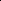
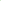

# RCMoE: A Communication-Efficient Random Compression Framework for Resource-Constrained Mixture-of-Experts Training

<!-- Page 1 -->

RCMoE: a Communication-Efficient Random Compression Framework for

Resource-Constrained Mixture-of-Experts Training

Donglei Wu1,2,3, Xiao Cai1,2,3, Jinglei Tan1,2,3,6, Jinda Jia7, Guangming Tan5, Dingwen Tao5, Wen

Xia4, Zhihong Tian1,2,3*

1Cyberspace Institute of Advanced Technology, Guangzhou University, Guangzhou, China 2Guangdong Key Laboratory of Industrial Control System Security, Guangzhou, China 3Huangpu Research School of Guangzhou University, Guangzhou, China 4School of Computer Science and Technology, Harbin Institute of Technology, Shenzhen, China 5Institute of Computing Technology, Chinese Academy of Sciences, Beijing, China 6Information Engineering University, Zhengzhou, China 7Luddy School of Informatics, Computing, and Engineering, Indiana University, Bloomington, IN, USA

## Abstract

Mixture-of-Experts (MoE) architecture with experts parallelism scales LLMs efficiently by activating only a subset of experts per input, avoiding proportional training costs. However, the intensive and heterogeneous communication substantially hinders the efficiency and scalability of MoE training in the resource-constrained scenario. Existing communication compression techniques fall short in MoE training due to: (i) Intensive training amplifies compression overhead, compromising training efficiency; (ii) Accumulated compression errors propagate through the network, degrading training quality. In this paper, we propose RCMoE, a communicationefficient Random Compression framework for MoE training with two core modules: (1) Local-Stochastic Quantization compresses the all-to-all communication by stochastically quantizing each row of the expert’s intermediate computing results in parallel, effectively improving the compression efficiency and reducing compression error; (2) Probabilistic Thresholding Sparsification compresses the all-reduce communication by probabilistically sampling large gradients at high probability, thereby reducing the computational complexity and maintaining the convergence efficiency. Experiments on four typical MoE training tasks prove that RC- MoE achieves higher 5.9x-8.1x total communication compression ratios and 1.3x-10.1x training speedup compared with the state-of-the-art compression techniques while maintaining the MoE training accuracy.

## Introduction

The success of deep learning is attributed to leveraging both large-scale training data and expansive model sizes. For example, in domains like language generation, machine translation, and computer vision, augmenting model capacity significantly boosts model performance when datasets are suitably large (Gong et al. 2024; Zhang et al. 2024a,b; He et al. 2024a). However, the dense nature of deep networks, where each example is processed by every parameter, leads to escalated training expenses. This includes increased demands on

*Zhihong Tian is the corresponding author. Copyright © 2026, Association for the Advancement of Artificial Intelligence (www.aaai.org). All rights reserved.

Time costs (s)

(a) GW2

Communication Compression FF&BP

(b) VT200

Time costs (s)

2.7x

3.3x

1.3x 1.5x 1.6x

2.1x

Communication Compression FF&BP

4GPUs 8GPUs 12GPUs16GPUs 4GPUs 8GPUs 12GPUs16GPUs 0

0.5

1.0

1.5

2.0

2.5

0 0.25 0.50 0.75 1.00 1.25 1.50 1.75 2.00

3.1x 2.0x

**Figure 1.** The runtime breakdown of naive no-compression MoE training (left bar) and RCMoE training (right bar).

memory and computing power, proportionate to the growth in both model and dataset scales (Tian and et al. 2024).

Mixture-of-Experts (MoE), a form of conditional computation architecture, has recently proven effective in expanding model capacity with sub-linear cost (Shazeer et al. 2017). Different from directly scaling small models to a large dense model, the MoE layer consists of many small feed-forward networks, named experts. Training samples are dynamically and sparsely activated by a trainable gate network and fed to different experts. Due to the sparse activation pattern saves much computation, MoE notably boosts the number of samples trained within the same time, enhancing model accuracy with lower computational FLOPs (floating point operations) compared to conventional dense models (Nie et al. 2024; Dai et al. 2024; Huang et al. 2024).

Communication Bottleneck in MoE: Although the flexible MoE structure makes it more feasible to train a giant model beyond a trillion scale, its training process is still extremely costly. A 600 billion MoE model takes 2048 TPUs 4 days to train (Lepikhin et al. 2021). To improve training efficiency, expert parallelism is introduced to train MoE models by partitioning experts into different computing nodes, with each node processing various training batches in parallel. In MoE layers, intermediate computing results are exchanged to the desired expert nodes via ’all-to-all’ collective communication. In non-MoE layers, weight gradients are synchronized using the ’all-reduce’ collective communication. These transmitted data have different types and structures

The Fortieth AAAI Conference on Artificial Intelligence (AAAI-26)

26876

AI-readable visual equivalent, added: Figure extracted from the paper PDF and converted to an SVG wrapper asset. Use the surrounding page text and caption for interpretation.

AI-readable visual equivalent, added: Figure extracted from the paper PDF and converted to an SVG wrapper asset. Use the surrounding page text and caption for interpretation.

<!-- Page 2 -->

Top-0.5 Sparsification 6-bit Linear Quantization 8-bit Linear Quantization No Compression

(a) Time breakdown with compression

Training epoch

Validation accuracy

Time costs (s)

2.67 1.97 1.77

8.42

10.63 8.63

5.35 3.85 3.95

2.98 2.88 2.38

(b) MoE training quality on VC100

Communicate

FF&BP Compresse

0 4 6 8 10 12

GW2

GW103

VC100

VT200

5 10 15 20 30 25 0 0

0.2

0.4

0.6

0.8

**Figure 2.** Challenges of MoE communication compression. (a) Time breakdown of the naive no-compression MoE training (1st bar), Top-0.1 sparsification (2nd bar), and 8-bit linear quantization (3rd bar). (b) The MoE accuracy impact of Top-k sparsification and linear quantization under various compression ratios.

referred to as Heterogeneous Data in this paper.

Due to the heterogeneous data that needs to be intensively transferred in every iteration, communication overheads become a significant bottleneck during MoE training, particularly in the bandwidth-constrained devices. To closely examine the communication bottleneck, we conduct four typical MoE training tasks on a commonly used cloud computing platform (detailed in Section). The left bars of Figure 1 indicate that the communication times not only dominate about 45.2%-54.8% of the average runtime, but also escalate rapidly as the number of experts increases.

Issues of Existing Solution: To improve MoE training efficiency, several studies have focused on modifying the MoE model architecture (He et al. 2022; Xue et al. 2022; Shi et al. 2024) or optimizing the training workflow and resource scheduling (Li et al. 2023; Zhai et al. 2023; Shi et al. 2023). However, the communications cannot be effectively overlapped with ongoing computations because the computation of the expert network relies on the outcomes of communications. Moreover, these works inevitably intrude on the MoE training workflow, restricting general applicability. Given that these heterogeneous communications become increasingly expensive as MoE models scale up, further compressing the communication cost in MoE training is an urgent necessity and a promising complement to prior studies.

Recently, communication compression techniques, such as sparsification and quantization, have been successfully employed to compress the gradient in popular data-parallel distributed learning because of their notable compression ratios and scalability (Tang and et al. 2024; Hu and et al. 2024; Huang and et al. 2024; He et al. 2024b). However, our preliminary evaluation reveals two specific issues when applying existing compression techniques to the intensive and heterogeneous communication during MoE training: (1) Overhead Amplification issue: The frequent forward and backward propagation leads to intensive communication, which in turn raises the cost of compressing such communication, particularly in resource-constrained devices. Figure 2 (a) shows that communication compression accounts for up to 89.6% of the total execution time. (2) Error Propagation issue: Communication compression of intermediate comput- ing results spans the entire network, causing compression errors to propagate and accumulate layer-by-layer. Figure 2 (b) shows the information distortion degrades 18.9%-66.7% MoE accuracy. Due to the lack of consideration for data heterogeneity, existing compression techniques struggle to effectively address both issues, making it difficult to achieve tangible compression gains during MoE training.

Therefore, the challenge of designing a solid MoE communication compression approach is to consider both the computing efficiency and model accuracy in different communication stages with heterogeneous data. In this paper, we propose RCMoE, a lightweight Random Compression framework for MoE training tailored for different communication stages. RCMoE solves the above issues based on several observations and techniques as follows.

All-to-all Communication Stage: By studying the data structure and statistical properties of the expert’s intermediate computing results matrix, we observed that the special token similarity incurs a more dispersed distribution and distinct ranges along rows compared to columns. Using this feature, we propose a Local Stochastic Quantization (LSQ) to compress all-to-all communication while solving the above issues as follows: 1 ⃝LSQ constructs an unbiased and fine-grained mapping between floating-point values and integers, effectively eliminating systematic bias and reducing variance, thereby mitigating error propagation. 2 ⃝LSQ employs the lightweight stochastic operation to each row in parallel, effectively reducing the complexity and improving the efficiency, thereby lowering the quantization overhead.

All-reduce Communication Stage: By analyzing the weight update process in the non-MoE layer, we noticed a layer-wise local data parallelism pattern during gradient synchronization. This pattern motivates us to introduce a lightweight Probabilistic Thresholding Sparsification (PTS) to compress all-reduce communication and solve the above issues as follows: 1 ⃝PTS only samples a subset of large gradients with higher probabilities, exploiting the lightweight advantage of random processes to achieve fast gradient sparsification with O(N) complexity. 2 ⃝PTS preserves expectation invariance for sampled sparse weight gradients and supports flexible sparsity control, effectively eliminating systematic bias and bounding variance.

We implement RCMoE to speed up MoE training by integrating LSQ and PTS within the integer MoE training system. We also provide a theoretical analysis to demonstrate the convergence efficiency of RCMoE. To the best of our knowledge, RCMoE is the first compression framework tailored for MoE training, capable of efficiently handling heterogeneous data across different communication stages while preserving training quality. Figure 1 (b) suggests that RCMoE efficiently reduces communication times 2.7×-7.3× at low overheads, making MoE training accessible in platforms with limited computing and communication resources. Our contributions can be summarized as follows:

• We identify two special challenges when applying existing communication compression techniques in resourceconstrained MoE training: (i) The intensive communications of MoE training significantly amplify the computational overhead of compression; (ii) The compression

26877

AI-readable visual equivalent, added: Figure extracted from the paper PDF and converted to an SVG wrapper asset. Use the surrounding page text and caption for interpretation.

<!-- Page 3 -->

(b) Value range of different rows (a) Evaluation of pairwise similarity row to row col. to col.

0.0

0.2

0.4

0.6

0.8

(b) epoch 10 (c) epoch 15 (a) epoch 5

(d) epoch 5 (e) epoch 10 (f) epoch 15

Value range

1.0

2

1

0

-1

-2

-3

Index of row 0 1 2 3 4 5 6 7 8 9 10 11

**Figure 3.** The distribution property of the intermediate computing results. (a) Pairwise similarities. (b) Value ranges.

error of intermediate computing results propagates layerby-layer, inevitably degrading the MoE training quality. • We propose RCMoE, a random compression framework for MoE training with two key modules: (i) Local Stochastic Quantization (LSQ) randomly quantizes each row of intermediate computing results in parallel, efficiently compressing all-to-all communication while reducing the information distortion; (ii) Probabilistic Thresholding Sparsification (PTS) randomly samples large gradients while preserving expectation invariance, efficiently compressing all-reduce communication while maintaining convergence efficiency. • We conduct comprehensive evaluations across mainstream MoE training tasks, involving multiple model structures and datasets with different scales. Experimental results demonstrate that RCMoE achieves 5.9×-8.1× compression ratios and 1.3×-10.1× training speedup while maintaining MoE training quality.

## Background

and Related Work

MoE architecture: The most common use of MoE is to extend the MLP layer of the state-of-the-art sequence Transformer (Vaswani et al. 2017; Dosovitskiy et al. 2021; Brown et al. 2020) by a large number of feed-forward networks (i.e., experts) (Shazeer et al. 2017; Lepikhin et al. 2021). For each training iteration, samples are fed into a few experts, dynamically selected by a trainable gate network. Given that different small models are experts in different domains, and can only be activated when the data in their domain is input. The MoE architecture not only increases model capacity and improves performance, but also reduces computational cost by activating only a sparse subset of experts per input.

Data Flow: The MoE layer’s experts are distributed across devices (e.g., GPU), while all other non-MoE layers are replicated. In the Feed-Forward (FF) propagation, the feature activation of tokens is processed by the gating network to select the appropriate expert, after which it is routed to the designated experts via all-to-all communication. Once the designated experts complete their computation, the results are returned to the original device for further processing through an additional all-to-all communication. In the Back-Propagation (BP) propagation, two reverse all-to-all are used to transfer the feature gradient of the corresponding feature activation along the reverse trace. Additionally, one all-reduce communication is used to synchronize the weights

GW2 GW103 VC100 VT200

-14 2

-13 2

-12 2

-11 2

-10 2

-9 2

-8 2

-7 2

MoE tasks

Global-Flatten Row-Wise Column-Wise No Compression

Training epoch

Validation accuracy

(b) Runtimes of various methods (a) Validation accuracy of various methods

Time cost (s)

5 10 15 20 30 25 0 0

0.2

0.4

0.6

0.8

**Figure 4.** Evaluations of (a) validation accuracy and (b) runtime of different quantization methods.

gradient of the shared parameters in other non-MoE layers. As introduced in Section, these intensive and heterogeneous communications dominate the overall runtime of MoE training, significantly degrading its efficiency.

Observation and Motivation

As shown in Figure 2, increasing the bit-width from 6 to 8 bits for quantizing intermediate results mitigates accuracy degradation, but at the cost of a lower compression ratio due to increased communication traffic for fidelity preservation. This motivates us to achieve higher compression accuracy under limited bit-widths, striking a better balance between communication overhead and model performance.

To this end, we first study the distinctive data structure of the MoE layer. We observed that the input of each expert is a 2-D intermediate computing result matrix of the preceding non-MoE layers. Each row represents the semantic vector of each token, and each column corresponds to the activation value of a specific dimension on all tokens. Then we explore the distribution property of the matrix by randomly selecting 200 rows/columns and calculating their pairwise similarities. The lighter color in the upper three images of Figure 3 (a) indicates that rows exhibit higher intersimilarity than columns. Intuitively, this similarity property can be explained as: (1) Zipfian token distributions in realworld data lead to data-induced similarity(Zhang et al. 2025; Wang et al. 2024; Cho et al. 2024); (2) Transformer attention promotes token similarity by integrating contextual semantics(Wolfe and Caliskan 2022; Devlin et al. 2019). Furthermore, Figure 3 (b) shows that the value ranges vary greatly across rows, indicating that while rows exhibit similarity, their dynamic ranges differ significantly. Given these properties, we expect a row-wise parallel quantization strategy to offer two key advantages: (1) improved compression precision through finer-grained representation; (2) lower compression overhead due to enhanced computation efficiency.

To verify our conjecture, we further explore the time costs and model training quality of 8-bit quantization with various implementations as below: Figure 4 (a) shows that the rowwise quantization strategy achieves a higher MoE training quality than the column-wise quantization and global quantization. This result suggests that mapping each row with a more dispersed distribution allows for more effective utilization of the quantization intervals, obtaining a more accurate representation and lower quantization error. Figure 4 (b)

26878

AI-readable visual equivalent, added: Figure extracted from the paper PDF and converted to an SVG wrapper asset. Use the surrounding page text and caption for interpretation.

AI-readable visual equivalent, added: Figure extracted from the paper PDF and converted to an SVG wrapper asset. Use the surrounding page text and caption for interpretation.

AI-readable visual equivalent, added: Figure extracted from the paper PDF and converted to an SVG wrapper asset. Use the surrounding page text and caption for interpretation.

AI-readable visual equivalent, added: Figure extracted from the paper PDF and converted to an SVG wrapper asset. Use the surrounding page text and caption for interpretation.

AI-readable visual equivalent, added: Figure extracted from the paper PDF and converted to an SVG wrapper asset. Use the surrounding page text and caption for interpretation.

AI-readable visual equivalent, added: Figure extracted from the paper PDF and converted to an SVG wrapper asset. Use the surrounding page text and caption for interpretation.

AI-readable visual equivalent, added: Figure extracted from the paper PDF and converted to an SVG wrapper asset. Use the surrounding page text and caption for interpretation.

AI-readable visual equivalent, added: Figure extracted from the paper PDF and converted to an SVG wrapper asset. Use the surrounding page text and caption for interpretation.

AI-readable visual equivalent, added: Figure extracted from the paper PDF and converted to an SVG wrapper asset. Use the surrounding page text and caption for interpretation.

AI-readable visual equivalent, added: Figure extracted from the paper PDF and converted to an SVG wrapper asset. Use the surrounding page text and caption for interpretation.

<!-- Page 4 -->

All-Reduce

Comm.

W1

W2

W3

W1 W2 W3

W1 W2 W3

W1 W2 W3

Non-MoE Layer

MoE Layer i-th MoE Block

……

…

(i-1)-th MoE Block

(i+1)-th MoE Block

……

Node 1

Node 2

Node 3

Node N RCMoE Framework

0 1 0 0 1 0 1 0 1 mask

PTS module intermediate computing results exchange

D1 D2 D3 D1

D2

D3

D1

D2

D3

D1

D2

D3

D1 D2 D3

D1 D2 D3

Compress

LSQ module weight gradient synchronization

All2All Comm.

distribution 2 3 4 5

3.7 3 p=0.3 p=0.7

Compress

**Figure 5.** The workflow of our proposed RCMoE.

shows that the runtime of row-wise quantization is significantly lower than the global quantization at different scales. This is because the linearity of matrix multiplication enables efficient CUDA parallelism, thereby achieving a faster compression speed. Therefore, the above observations and motivations provide strong support for the design of our Local Stochastic quantization, which enables efficient compression with low overhead and error (detailed in Section).

Design and Implementation Overview Figure 5 shows the workflow of our proposed RCMoE, which consists of two key compression modules: 1. Local-Stochastic Quantization (LSQ): Randomly quantizing each row of intermediate computing results of MoE layers in parallel during all-to-all communication. 2. Probabilistic Thresholding Sparsification (PTS): Randomly sampling the large weight gradients of non-MoE layers during all-reduce communication. In the next subsection, the detailed design and implementation of LSQ and PTS are introduced.

Local Stochastic Quantization (LSQ) In the MoE layer, the intermediate computing results of experts (i.e., activations and gradients of features) are exchanged through intensive all-to-all communication with huge communication costs. We introduce a Local Stochastic Quantization (LSQ) algorithm to achieve fast communication compression while maintaining the low quantization error. As illustrated in Figure 6, the key insight of LSQ is to parallelly map each row of the original floating-point matrix to the nearest quantization endpoint with higher probability.

Row-wise Unbiased Quantization: Given xi ∈RN is the i-th row of the original floating-point intermediate computing result matrix X ∈RM×N and the assigned bit-width B. The range of quantization levels is [1,..., l, l + 1,...L] with L = 2B. LSQ quantizes the i-th elements xij ∈R of xi to ˆxij as below: 1⃝Calculating the scaled floating points as fij = |xij| si, with si = ||xi||∞. fij is used to reflect the proportion of xij within the entire range of xi; 2⃝Locating the bucket [l, l+1] for xij according to fij, where l = ⌊fij⌋×L is the left endpoint of the bucket and l + 1 is the right endpoint. 3⃝Calculating the distance from fij to each endpoint as dl = fij ×L−l and dl+1 = l+1−fij ×L, where dl and

… … …

Row-Wise Split

…

Compressing in Parallel

Compressing in Parallel

+

+

S1

S2

S3

+

+

+ +

Compressing in Parallel

1.2 1.8 2.5 2.1

…

…

…

…

… si =1 / ||x||∞ original data scaled data quantize bucket 3 2 1

…

…

5 2 1 6 7

3.7 3 p=0.3 p=0.7

3 probabilistic quantization

3.7

**Figure 6.** The workflow of LSQ module of RCMoE.

dl+1 are located in [0, 1] while summing to 1. 4⃝Given that the closer fij is to l, the more likely it is to quantize xij to l. We establish a negative correlation between distance and the probability of xij to the endpoint by defining the probability pij of mapping xij to l + 1 and l as below:

qij = l/L, with pij = dl+1 (l + 1)/L, with pij = dl (1)

Doing so, xij can be mapped to the closer endpoint (e.g., l or l +1) at a larger probability. 5⃝Assigning xij to the specific bucket endpoint (e.g., l or l+1) as the quantized value ˆxij by comparing the probability with a random number generated from the uniform distribution (i.e., Probabilistic Thresholding (Prob. THR) method) at low O(N) time complexity.

Quantization of Scalars: For each row xi, since LSQ produces an individual scaling factor si = ||xi||∞for normalization, the resulting additional communication overhead becomes substantial at large batch sizes. Therefore, these floating-point scalars should also be further compressed. Considering that all si constitute a floating-point number set s = [s1,..., si,..., sM], we compress each si to a Kbit ˜si while maintaining the computation and convergence efficiency by applying the above stochastic quantization algorithm again. Empirical evaluations suggest that 3-4 bits of quantization are enough to maintain MoE training quality.

Unbiased Recovery: After the above LSQ compression, the sender node needs to transfer (i) the signed quantized integer Q ∈RM×N of the original intermediate computing results; (ii) the signed quantized integer scalars qs ∈RM; (iii) one floating-point scalar of the quantized scalars set s, to the target expert node. The trainable floating-point counterpart of xij can be unbiasedly recovered as ˜ xij = ˜si ×sgn(xij)× qij with E[(qij)] = xij, where sgn(·) returns the signs of the input vector. Formally, the variance of quantization error is given by σ2

LSQ ≤N ·

M 4K+B·36 + 1 4B·6 PM i=1 s2 i + M 4K·6

(see Appendix A.1 for the detailed derivations).

Compared to unified global quantization, LSQ leverages unbiased row-wise representations to achieve unbiasedness and bound the variance of the original data, thereby maintaining MoE training quality. Meanwhile, its lowcomplexity randomization process and CUDA-friendly matrix operations significantly enhance compression efficiency.

Probabilistic Threshold Sparsification (PTS) In the non-MoE layer, the all-reduce communication of weight gradients synchronization in non-MoE layers also introduces substantial communication overhead in many

26879

AI-readable visual equivalent, added: Figure extracted from the paper PDF and converted to an SVG wrapper asset. Use the surrounding page text and caption for interpretation.

AI-readable visual equivalent, added: Figure extracted from the paper PDF and converted to an SVG wrapper asset. Use the surrounding page text and caption for interpretation.

AI-readable visual equivalent, added: Figure extracted from the paper PDF and converted to an SVG wrapper asset. Use the surrounding page text and caption for interpretation.

<!-- Page 5 -->

Original weight gradient of non-MoE layer 1.2 -0.2 1.1 -0.6

1 0 0

… …

0.08 0.50 0.91 0.17 Sampling probability of gradients …

Original gradient Scaled gradient pi=σ×|gi| / ||G||∞ Probability Represent

0

…

Mask of sparse gradient … …

Stochastic Sampling

U(0,1)

0.5

0.5

1

0 0 1 Probability Compare

**Figure 7.** The workflow of PTS module of RCMoE.

large-scale MoE architectures, highlighting the need for compression of these weight gradients. Motivated by (i) large gradients are more important to model learning; (ii) unbiasedness helps to maintain training convergence, we introduce a Probabilistic Thresholding Sparsification (PTS) algorithm to reduce the non-MoE layer’s communication costs. As illustrated in Figure 7, the key insight of PTS is to sample the gradient items with larger magnitudes at a higher probability while flexibly balancing the compression ratio and convergence efficiency.

Randomly unbiased Sampling: Assuming that the set of weight gradients in a non-MoE layer is g = {g1, g2,..., gk}, the sampled sparse gradients are eg. We first construct the sampling probability for the gradient item gi as pi = σ×|gi|

||g||∞, which is positively associated with its magnitude. Noting that σ > 0 is a scalar used to achieve a more flexible balance over the convergence rate and communication costs according to user preference. For example, we can improve the sampling probability using a large σ, leading to a lower compression ratio and a faster convergence rate. According to the sampling probability pi, we can obtain the i-th component egi of eg as:

egi = gi pi

× bi with

P(bi = 1|gi) = pi P(bi = 0|gi) = 1 −pi (2)

where bi ∈{0, 1} indicates whether gi will be set to 1. Equation 2 compresses the original dense gradients to sparse gradients. Similarly, this random sampling process could be efficiently implemented using the Probabilistic Thresholding method at a low O(N) computational complexity.

Unbiased Recovery: After the above random sampling, weight gradients of non-MoE layer are compressed to (i) the signs (±1) of the non-zero elements in egi, each element of 1bit; (ii) the corresponding indexes of these elements; (iii) one floating-point factor ||g||∞ σ shared in each weight gradients. The receiver can recover the unbiased weight gradients as egi = ||g||∞ σ sgn(gi) with E[egi] = gi. Formally, the variance bound of sparsification error is given by σ2

PTS ≤∥g∥1∥g∥∞ σ, with σ governing the trade-off between sparsity and convergence (see the proof in Appendix A.2).

Therefore, PTS ensures that no systematic bias is introduced into MoE training and effectively bounds the variance of the compressed gradient. Furthermore, the lightweight random sampling process incurs low compression overhead.

Convergence Analysis From the view of bias–variance decomposition, both LSQ and PTS of RCMoE are unbiased and exhibit bounded compression error variance. Assuming that the loss function L(θ) is L-smooth and bounded by the optimal L(θ∗). Formally, the averaged gradient norm of RCMoE satisfies:

1 T

T X t=1

E[∥∇L(θt)∥2] ≤2L(L(θ1) −L∗) √

T

+ σ2

LSQ + σ2

PTS √

T

.

(3) where learning rate η = 1/(L

√

T) and σ2

LSQ ≤N ·

M 4K+B·36 + 1 4B·6 PM i=1 s2 i + M 4K·6 and σ2

PTS ≤∥g∥1∥g∥∞ σ (the derivations are detailed in Appendix A.3).

Therefore, RCMoE can effectively maintain the O(1/

√

T) convergence rate of SGD, with compression errors appearing as additive constants in the bound. The total variance σ2 explicitly quantifies the trade-offs between quantization bits (B, K), sparsity level (σ).

## Experiments

## Experimental Setup

## Evaluation

environment: We conduct experimental evaluation on a cloud platform with a typical cluster topology, consisting of 4 nodes, each equipped with 4 NVIDIA Tesla V100-SXM2-16GB GPUs (16 GPUs in total). Intra-node connections use 400 Gbps NVLink, and inter-node communication is over 25 Gbps Ethernet. The modest bandwidth and compute resources are consistent with our resourceconstrained training scenario. Different compression techniques are implemented using the Pytorch v.2.2.1 package in Python 3.8.13. The all-to-all and all-reduce communication is built on the collective communication of torch.distributed (Paszke et al. 2019) package, utilizing the NCCL v.2.19.3 backend. Tasks, Models, and Datasets: To fairly evaluate compression effectiveness, four typical MoE training tasks at different moderate scales are selected to align with our resourceconstrained training environments. GW2: GPT-based MoE with 0.13B parameters trained on WikiText2 (Merity et al. 2017); GW103: GPT-based MoE with 1.6B parameters trained on WikiText103 (Merity et al. 2017); VC100: ViT-based MoE with 0.21B parameters trained on CI- FAR100 (Krizhevsky and Hinton 2009); VT200: ViTbased MoE with 0.96B parameters trained on TinyImageNet (Krizhevsky, Sutskever, and Hinton 2012). The optimizer is Adam with 1e-3 learning rate. Baseline and Compared Methods: Considering that RC- MoE applies different modules, LSQ and PTS, to compress various communication stages, we select six state-ofthe-art communication compression techniques for comparison under two evaluation strategies to validate our advantages: 1⃝Individual Module Evaluation: Compressing allto-all communications using quantization-based techniques ShapeShifter (Lascorz et al. 2019), PWLQ (Fang et al. 2020), QSGD (Alistarh et al. 2017), and LSQ. Compressing all-reduce communications using sparsification-based techniques MSTop-k Sparsification (MSTop-K) (Shi et al. 2021),

26880

<!-- Page 6 -->

Validation perplex epoch (c) VC100 with 5-bit quantization

Validation Accuracy

0%

40%

30%

20%

10%

50% 70%

40% 30%

50% 60% epoch (d) VT200with 3-bit quantization

Validation Accuracy

(a) GW2 with 4-bit quantization epoch (b) GW103 with 6-bit quantization

104

103

2 4 8 10 epoch

2 4 8 1 3 5 7

5 15 25 35 0 10 20 30 2 4 8 10 12 14

104

103

20% 10% 0%

Validation perplex

LSQ QSGD PWLQ ShapeShifter Naive

LSQ QSGD PWLQ ShapeShifter Naive

LSQ QSGD PWLQ ShapeShifter Naive

LSQ QSGD PWLQ ShapeShifter Naive

**Figure 8.** RCMoE’s LSQ module obtains better model training quality in compressing the all-to-all communication under the same bit-width.

Rand-K Sparsification (Rand-K) (Stich and et al. 2018), DGC (Lin et al. 2018), and PTS. Comparing their isolated impact on MoE training quality under the same compression level. 2⃝Comprehensive System Evaluation: We simultaneously compress both all-to-all and all-reduce communications in the integrated MoE training system by leveraging a combination of distinct compression techniques. Comparing their comprehensive performance under the best practice.

Individual Module Evaluation The most critical prerequisite for communication compression is that it must not significantly degrade the MoE training quality, such as convergence rate and model accuracy. Thus, we first separately evaluate the performance of LSQ and PTS in maintaining MoE training quality.

All-to-All compression: Figure 8 shows that under the same bit-width, LSQ achieves the best MoE training quality similar to the native no-compression solution, as its rowwise unbiased quantization effectively constrains the bias and variance of quantization error. In contrast, ShapeShifter, which adopts global and biased linear quantization, fails to maintain convergence stability in the VC100 task. Although the popular stochastic rounding QSGD employs unbiased gradient quantization based on the L2-norm under data parallelism context, it is ineffective for compressing intermediate results and often leads to training divergence. PWLQ reduces the variance of quantization error through a piecewise linear quantization strategy, but it fails to eliminate the systematic bias introduced during training, leading to unstable convergence in the VT200 task.

All-reduce compression: Figure 9 shows that under the same sparsity, PTS achieves the best MoE training quality, which has a similar performance to the native nocompression solution. This is since the unbiased representation of PTS preserves the expected gradient optimization direction, and the hyperparameter σ controls the variance of compression error. In contrast, MSTop-K introduces bias and Rand-K suffers from high variance, both of which hinder stable convergence across various tasks. Although DGC

60%

40%

30%

20%

10%

50% 70%

40%

30%

50%

60%

3x102

1x103

6x102

4x102

2 4 8 1 3 5 7

5 15 25 35 0 10 20 30 2 4 8 10 12 14

3x102

1x103

6x102

4x102

2 4 8 10

Validation perplex epoch (c) VC100 with 0.25 sparsity epoch (d) VT200with 0.004 sparsity

Validation Accuracy

(a) GW2 with 0.007 sparsity epoch (b) GW103 with 0.002 sparsity epoch

Validation perplex

Validation Accuracy

PTS MSTop-K Rand-K DGC Naitve

PTS MSTop-K Rand-K DGC Naitve

PTS MSTop-K Rand-K DGC Naitve

PTS MSTop-K Rand-K DGC Naitve

**Figure 9.** RCMoE’s PTS module obtains better model training quality in compressing the all-reduce communication under the same sparsity.

Accuracy↑or Perplexity↓GW2↓GW103↓VC100↑VT200↑ Naive(no compress) 311.1 291.5 0.7284 0.5324 PWLQ+Rand-K 474.2 551.1 0.7196 0.2514 PWLQ+DGC 310.9 336.6 0.7208 0.5168 PWLQ+MSTopk 305.3 1869.0 0.6585 0.2702 QSGD+Rand-K 351.2 753.9 0.7045 0.2852 QSGD+DGC 309.3 325.9 0.7116 0.5048 QSGD+MSTopk 310.7 301.3 0.6416 0.2797 ShapeShifter+Rand-K 405.8 492.7 0.7192 0.5545 ShapeShifter+DGC 306.1 320.9 0.7194 0.5248 ShapeShifter+MSTopk 310.2 304.2 0.6536 0.2797 RCMoE(ours) 304.5 301.9 0.7235 0.5861

**Table 1.** The comprehensive MoE training quality evaluations of various compression methods. Bold and underlined numbers are the best and the second-best performances.

achieves a similar convergence quality to PTS in the GPTbased language tasks, the incurred bias significantly degrades the MoE training quality in ViT-based vision tasks.

Comprehensive System Evaluation To evaluate the comprehensive performance of RCMoE in the integral MoE training system, we simultaneously employ LSQ and PTS in distinct MoE communication stages and compare the performance with the combinations of other quantization and sparsification techniques under their best practice. The best practice indicates that within the same MoE communication rounds, training to the nearuncompressed MoE training quality, the maximum compression ratio of a particular approach (e.g., we gradually increase the bit-width of QSGD until it just meets the target accuracy on the VC100 Task).

**Table 1.** demonstrates that RCMoE outperforms the combinations of other compared methods in the MoE training quality across most tasks. Specifically, the experimental results show the converged MoE validation accuracy or perplexity of different technique combinations on four tasks. We observe that although most techniques do not compro-

26881

AI-readable visual equivalent, added: Figure extracted from the paper PDF and converted to an SVG wrapper asset. Use the surrounding page text and caption for interpretation.

AI-readable visual equivalent, added: Figure extracted from the paper PDF and converted to an SVG wrapper asset. Use the surrounding page text and caption for interpretation.

AI-readable visual equivalent, added: Figure extracted from the paper PDF and converted to an SVG wrapper asset. Use the surrounding page text and caption for interpretation.

AI-readable visual equivalent, added: Figure extracted from the paper PDF and converted to an SVG wrapper asset. Use the surrounding page text and caption for interpretation.

AI-readable visual equivalent, added: Figure extracted from the paper PDF and converted to an SVG wrapper asset. Use the surrounding page text and caption for interpretation.

AI-readable visual equivalent, added: Figure extracted from the paper PDF and converted to an SVG wrapper asset. Use the surrounding page text and caption for interpretation.

AI-readable visual equivalent, added: Figure extracted from the paper PDF and converted to an SVG wrapper asset. Use the surrounding page text and caption for interpretation.

AI-readable visual equivalent, added: Figure extracted from the paper PDF and converted to an SVG wrapper asset. Use the surrounding page text and caption for interpretation.

<!-- Page 7 -->

(a) Evaluation of compression ratio GW2 GW103 VC100 VT200

GW2 GW103 VC100 VT200 (b) Evaluation of compression throughput

QSGD+MSTop-K

QSGD+DGC QSGD+Rand-K

QSGD+MSTop-K QSGD+DGC QSGD+Rand-K

PWLQ+MSTop-K PWLQ+DGC PWLQ+Rand-K

RCMoE

0 1 2 3 4 5 6 8

Compression Ratio Throughput (Gbps)

0 250 500 750

**Figure 10.** The evaluation of communication compression ratio and compression throughput (Gbps) of different technique combinations across various tasks.

mise the MoE training quality under their best practice, their combination may result in degraded MoE training quality. In contrast, RCMoE consistently maintains performance comparable to the naive no-compression baseline and achieves the best MoE training quality in most tasks. This is because the LSQ and PTS modules of RCMoE are mutually compatible, jointly preserving unbiasedness and controlling the variance across different compression stages, thereby effectively maintaining the MoE convergence during the training.

**Figure 10.** (a) presents the communication compression ratio of different techniques, computed as the ratio between the original and compressed communication costs. Experimental results show that RCMoE achieves higher 5.9×- 8.1× overall compression ratios in most tasks. This is because LSQ and PTS modules achieve near-uncompressed MoE accuracy via less bit-width and higher sparsity in allto-all and all-reduce communication stages, thereby can reduce more communication costs. The superior compression ratio of RCMoE makes it well-suited for MoE training in the bandwidth-constrained platform.

To evaluate the computational efficiency of compression, we further evaluate the compression throughput of different approaches, defined as the volume of compressed data divided by the compression runtime. Figure 10 (b) shows that RCMoE achieves a higher throughput of 1004.3-1743.9 Gbps in most tasks due to the higher compression ratio, higher efficiency, and lower time complexity of LSQ and PTS. RCMoE’s lightweight advantage benefits MoE training in compute-constrained devices.

Scalability and Time Breakdown Evaluation The essential purpose of communication compression is to speed up MoE training at different scales of nodes. To further demonstrate the scalability of RCMoE, we evaluate the average per-iteration time breakdown across 4, 8, 12, and 16 GPUs. Figure 11 shows the runtime breakdown of feedforward and backward propagation (FF&BP), communication, and compression. Red numbers are the speedup rate to the native no-compression baseline. QSGD, Rand-K, and MSTop-K are excluded from the evaluation due to their significant impact on MoE training quality in most tasks.

(a) GW2 Time costs (s)

1.35x

3.32x

2.70x

0.97x

0.76x 1.47x

0.90x

2.75x

1.99x

1.85x 3.08x

1.01x

Communication Compression FF&BP

4GPUs 8GPUs 12GPUs 16GPUs

(b) GW103 Time costs (s)

3.01x

8.75x

6.84x

2.84x

2.21x 3.01

9.30x

2.00x

1.90x 3.05x

7.26x

10.09x

4GPUs 8GPUs 12GPUs 16GPUs

(d) VT200 Time costs (s)

1.31x

2.05x

1.59x

0.81x

0.77x 1.14x

1.08x

0.80x

0.95x 1.63x

1.50x

1.31x Communication Compression FF&BP

4GPUs 8GPUs

12GPUs 16GPUs

Communication Compression

FF&BP

(c) VC100 Time costs (s)

3.81x

4.69x

4.13x

1.45x 3.05x

1.62x

1.61x 3.90x

3.31x 0.70x 1.49x 1.81x

4GPUs 8GPUs

12GPUs 16GPUs

Communication Compression FF&BP

**Figure 11.** The average time breakdowns per iteration on 4, 8, 12, and 16 GPU nodes. Bars from bottom to up are naive no-compression, PWLQ+DGC, ShapeShifter+DGC, and our proposed RCMoE.

Experimental results suggest that (i) the moderate compression ratio and limited compression throughput of PWLQ/ShapeShifter+DGC limit their training speedup and even prolong the training time (e.g., VT200). (ii) RCMoE achieves higher compression ratios across different tasks at lower computational costs, obtaining the highest 1.3×- 10.1× MoE training speedup. (iii) RCMoE achieves higher speedup with more GPUs in most tasks, as more communication is reduced in parallel without incurring noticeable overhead. In summary, RCMoE efficiently reduces communication costs and improves the efficiency of MoE training at different scales. Therefore, the scalability of RCMoE not only facilitates the deployment of MoE models on resourceconstrained platforms but also enables efficient scaling in large-scale MoE training environments.

## Conclusion

In this paper, we propose a lightweight and scalable communication compression framework called RCMoE, which utilizes Local Stochastic quantization and probabilistic threshold sparsification to compress the heterogeneous data in different MoE communication stages with a theoretical convergence guarantee. Experimental results on the mainstream MoE training tasks demonstrate that RCMoE achieves higher 5.9×-8.1× communication compression ratios and 1.3×-10.1× training speedup than state-of-the-art methods while maintaining the MoE training quality. In the future, we aim to optimize the efficiency of RCMoE with CUDA and implement it into the collaborative communication library.

## Acknowledgments

This work was supported in part by the Guangdong S&T Program under Grant 2024B0101010002, in part by the National Natural Science Foundation of China (Nos. U2436208, 62372129, 62472127, 62032023, 62402129, 62502103, and T2125013), in part by the Project of Guangdong Key Laboratory of Industrial Control System Security

26882

AI-readable visual equivalent, added: Figure extracted from the paper PDF and converted to an SVG wrapper asset. Use the surrounding page text and caption for interpretation.

AI-readable visual equivalent, added: Figure extracted from the paper PDF and converted to an SVG wrapper asset. Use the surrounding page text and caption for interpretation.

AI-readable visual equivalent, added: Figure extracted from the paper PDF and converted to an SVG wrapper asset. Use the surrounding page text and caption for interpretation.

AI-readable visual equivalent, added: Figure extracted from the paper PDF and converted to an SVG wrapper asset. Use the surrounding page text and caption for interpretation.

AI-readable visual equivalent, added: Figure extracted from the paper PDF and converted to an SVG wrapper asset. Use the surrounding page text and caption for interpretation.

AI-readable visual equivalent, added: Figure extracted from the paper PDF and converted to an SVG wrapper asset. Use the surrounding page text and caption for interpretation.

<!-- Page 8 -->

under Grant No. 2024B1212020010, in part by the China National Postdoctoral Program for Innovative Talents under Grant No. BX20240095, in part by the China Postdoctoral Science Foundation (Nos. 2024M750616, 2025M771548, 2025M771561, GZC20252179), in part by the National Key Research and Development Program of China under Grant 2025YFB30037002, in part by the Innovation Funding of ICT, CAS under Grant No. E461050. (Corresponding author: Zhihong Tian).

## References

Alistarh, D.; Grubic, D.; Li, J.; and et al. 2017. QSGD: Communication-Efficient SGD via Gradient Quantization and Encoding. In Proc. NIPS’17. Brown, T. B.; Mann, B.; Ryder, N.; and et al. 2020. Language Models are Few-Shot Learners. In Proc. NIPS’20. Cho, H.; Kim, D.; Hwang, S.; and et al. 2024. SpARC: Token Similarity-Aware Sparse Attention Transformer Accelerator via Row-wise Clustering. In Proceedings of the 61st ACM/IEEE Design Automation Conference, DAC 2024, San Francisco, CA, USA, June 23-27, 2024, 181:1–181:6. ACM. Dai, D.; Deng, C.; Zhao, C.; Xu, R. X.; Gao, H.; Chen, D.; Li, J.; Zeng, W.; Yu, X.; Wu, Y.; Xie, Z.; Li, Y. K.; Huang, P.; Luo, F.; Ruan, C.; Sui, Z.; and Liang, W. 2024. DeepSeekMoE: Towards Ultimate Expert Specialization in Mixture-of-Experts Language Models. In Proceedings of the 62nd Annual Meeting of the Association for Computational Linguistics (Volume 1: Long Papers), ACL 2024, Bangkok, Thailand, August 11-16, 2024, 1280–1297. Devlin, J.; Chang, M.; Lee, K.; and Toutanova, K. 2019. BERT: Pre-training of Deep Bidirectional Transformers for Language Understanding. In Proc. NAACL-HLT’19, 4171– 4186. Dosovitskiy, A.; Beyer, L.; Kolesnikov, A.; and et al. 2021. An Image is Worth 16x16 Words: Transformers for Image Recognition at Scale. In Proc. ICLR’21. Fang, J.; Shafiee, A.; Abdel-Aziz, H.; and et al. 2020. Posttraining Piecewise Linear Quantization for Deep Neural Networks. In Computer Vision - ECCV 2020 - 16th European Conference, Glasgow, UK, August 23-28, 2020, Proceedings, Part II, volume 12347 of Lecture Notes in Computer Science, 69–86. Springer. Gong, J.; Chen, Z.; Ma, C.; Xiao, Z.; Wang, H.; Tang, G.; Liu, L.; Xu, S.; Long, B.; and Jiang, Y. 2024. Attention Weighted Mixture of Experts with Contrastive Learning for Personalized Ranking in E-commerce. In 39th IEEE International Conference on Data Engineering, ICDE 2023, Anaheim, CA, USA, April 3-7, 2023, 3222–3234. He, J.; Zhai, J.; Antunes, T.; and et al. 2022. FasterMoE: modeling and optimizing training of large-scale dynamic pre-trained models. In Proc. PPoPP ’22. He, X.; Yan, K.; Li, R.; Xie, C.; Zhang, J.; and Zhou, M. 2024a. Frequency-Adaptive Pan-Sharpening with Mixture of Experts. In Thirty-Eighth AAAI Conference on Artificial Intelligence, AAAI 2024, Thirty-Sixth Conference on Innovative Applications of Artificial Intelligence, IAAI 2024,

Fourteenth Symposium on Educational Advances in Artificial Intelligence, EAAI 2014, February 20-27, 2024, Vancouver, Canada, 2121–2129. He, Y.; Hu, J.; Huang, X.; and et al. 2024b. Distributed Bilevel Optimization with Communication Compression. In Forty-first International Conference on Machine Learning, ICML 2024, Vienna, Austria, July 21-27, 2024. Hu, S.; and et al. 2024. Practical Hybrid Gradient Compression for Federated Learning Systems. In Proceedings of the Thirty-Third International Joint Conference on Artificial Intelligence, IJCAI 2024, Jeju, South Korea, August 3-9, 2024, 4147–4155. Huang, Q.; An, Z.; Zhuang, N.; Tao, M.; Zhang, C.; Jin, Y.; Xu, K.; Chen, L.; Huang, S.; and Feng, Y. 2024. Harder Task Needs More Experts: Dynamic Routing in MoE Models. In Proceedings of the 62nd Annual Meeting of the Association for Computational Linguistics (Volume 1: Long Papers), ACL 2024, Bangkok, Thailand, August 11-16, 2024, 12883–12895. Huang, X.; and et al. 2024. Stochastic Controlled Averaging for Federated Learning with Communication Compression. In The Twelfth International Conference on Learning Representations, ICLR 2024, Vienna, Austria, May 7-11, 2024. OpenReview.net. Krizhevsky, A.; and Hinton, G. 2009. Learning multiple layers of features from tiny images. Technical report. Krizhevsky, A.; Sutskever, I.; and Hinton, G. E. 2012. ImageNet Classification with Deep Convolutional Neural Networks. In Proc. NIPS’12, 1106–1114. Lascorz, A. D.; Sharify, S.; Vivancos, I. E.; and et al. 2019. ShapeShifter: Enabling Fine-Grain Data Width Adaptation in Deep Learning. In Proceedings of the 52nd Annual IEEE/ACM International Symposium on Microarchitecture, MICRO 2019, Columbus, OH, USA, October 12-16, 2019, 28–41. ACM. Lepikhin, D.; Lee, H.; Xu, Y.; and et al. 2021. GShard: Scaling Giant Models with Conditional Computation and Automatic Sharding. In Proc. ICLR 2021. Li, J.; Jiang, Y.; Zhu, Y.; and et al. 2023. Accelerating Distributed MoE Training and Inference with Lina. In Proc. USENIX ATC 2023. Lin, Y.; Han, S.; Mao, H.; and et al. 2018. Deep Gradient Compression: Reducing the Communication Bandwidth for Distributed Training. In Proc. ICLR’18. Merity, S.; Xiong, C.; Bradbury, J.; and Socher, R. 2017. Pointer Sentinel Mixture Models. In Proc. ICLR’17. Nie, X.; Liu, Q.; Fu, F.; and et al. 2024. LSH- MoE: Communication-efficient MoE Training via Locality- Sensitive Hashing. In Advances in Neural Information Processing Systems 38: Annual Conference on Neural Information Processing Systems. Paszke, A.; Gross, S.; Massa, F.; and et al. 2019. PyTorch: An Imperative Style, High-Performance Deep Learning Library. In Proc. NIPS’19. Shazeer, N.; Mirhoseini, A.; Maziarz, K.; and et al. 2017. Outrageously Large Neural Networks: The Sparsely-Gated Mixture-of-Experts Layer. In Proc. ICLR 2017.

26883

<!-- Page 9 -->

Shi, S.; Pan, X.; Chu, X.; and Li, B. 2023. PipeMoE: Accelerating Mixture-of-Experts through Adaptive Pipelining. In IEEE INFOCOM 2023 - IEEE Conference on Computer Communications, New York City, NY, USA, May 17-20, 2023, 1–10. IEEE. Shi, S.; Pan, X.; Wang, Q.; and et al. 2024. ScheMoE: An Extensible Mixture-of-Experts Distributed Training System with Tasks Scheduling. In Proceedings of the Nineteenth European Conference on Computer Systems, EuroSys 2024, Athens, Greece, April 22-25, 2024, 236–249. Shi, S.; Zhou, X.; Song, S.; and et al. 2021. Towards Scalable Distributed Training of Deep Learning on Public Cloud Clusters. In Proc. MLSys’21. Stich, S. U.; and et al. 2018. Sparsified SGD with Memory. In Proc. NIPS’18, 4452–4463. Tang, Z.; and et al. 2024. z-SignFedAvg: A Unified Stochastic Sign-Based Compression for Federated Learning. In Thirty-Eighth AAAI Conference on Artificial Intelligence, AAAI 2024, Thirty-Sixth Conference on Innovative Applications of Artificial Intelligence, IAAI 2024, Fourteenth Symposium on Educational Advances in Artificial Intelligence, EAAI 2014, February 20-27, 2024, Vancouver, Canada, 15301–15309. Tian, Y.; and et al. 2024. Dialogue Summarization with Mixture of Experts based on Large Language Models. In Proceedings of the 62nd Annual Meeting of the Association for Computational Linguistics (Volume 1: Long Papers), ACL 2024, Bangkok, Thailand, August 11-16, 2024, 7143–7155. Vaswani, A.; Shazeer, N.; Parmar, N.; and et al. 2017. Attention is All you Need. In Proc. NIPS’17, 5998–6008. Wang, H.; Liu, D.; Kang, Y.; and et al. 2024. Attention- Driven Training-Free Efficiency Enhancement of Diffusion Models. In IEEE/CVF Conference on Computer Vision and Pattern Recognition, CVPR 2024, Seattle, WA, USA, June 16-22, 2024, 16080–16089. IEEE. Wolfe, R.; and Caliskan, A. 2022. VAST: The Valence- Assessing Semantics Test for Contextualizing Language Models. In Thirty-Sixth AAAI Conference on Artificial Intelligence, AAAI 2022, Thirty-Fourth Conference on Innovative Applications of Artificial Intelligence, IAAI 2022, The Twelveth Symposium on Educational Advances in Artificial Intelligence, EAAI 2022 Virtual Event, February 22 - March 1, 2022, 11477–11485. AAAI Press. Xue, F.; Shi, Z.; Wei, F.; and et al. 2022. Go Wider Instead of Deeper. In proc. AAAI’22, 8779–8787. Zhai, M.; He, J.; Ma, Z.; and et al. 2023. SmartMoE: Efficiently Training Sparsely-Activated Models through Combining Offline and Online Parallelization. In Proc. USENIX ATC 2023. Zhang, E.; Tang, J.; Ning, X.; and et al. 2025. Training-Free and Hardware-Friendly Acceleration for Diffusion Models via Similarity-based Token Pruning. In AAAI-25, Sponsored by the Association for the Advancement of Artificial Intelligence, February 25 - March 4, 2025, Philadelphia, PA, USA, 9878–9886. AAAI Press. Zhang, R.; Luo, Y.; Liu, J.; Yang, H.; Dong, Z.; Gudovskiy, D. A.; Okuno, T.; Nakata, Y.; Keutzer, K.; Du, Y.; and

Zhang, S. 2024a. Efficient Deweahter Mixture-of-Experts with Uncertainty-Aware Feature-Wise Linear Modulation. In Thirty-Eighth AAAI Conference on Artificial Intelligence, AAAI 2024, Thirty-Sixth Conference on Innovative Applications of Artificial Intelligence, IAAI 2024, Fourteenth Symposium on Educational Advances in Artificial Intelligence, EAAI 2014, February 20-27, 2024, Vancouver, Canada, 16812–16820. Zhang, Z.; Liu, S.; Yu, J.; Cai, Q.; Zhao, X.; Zhang, C.; Liu, Z.; Liu, Q.; Zhao, H.; Hu, L.; Jiang, P.; and Gai, K. 2024b. M3oE: Multi-Domain Multi-Task Mixture-of Experts Recommendation Framework. In Proceedings of the 47th International ACM SIGIR Conference on Research and Development in Information Retrieval, SIGIR 2024, Washington DC, USA, July 14-18, 2024, 893–902.

26884
