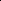

# Reasoning About the Unsaid: Misinformation Detection with Omission-Aware Graph Inference

<!-- Page 1 -->

Reasoning About the Unsaid: Misinformation Detection with Omission-Aware Graph Inference

Zhengjia Wang1,2, Danding Wang1, Qiang Sheng1, Jiaying Wu3, Juan Cao1,2*

1Institute of Computing Technology, Chinese Academy of Sciences 2University of Chinese Academy of Sciences 3National University of Singapore {wangzhengjia21b, wangdanding, shengqiang18z}@ict.ac.cn, jiayingwu@u.nus.edu, caojuan@ict.ac.cn

## Abstract

This paper investigates the detection of misinformation, which deceives readers by explicitly fabricating misleading content or implicitly omitting important information necessary for informed judgment. While the former has been extensively studied, omission-based deception remains largely overlooked, even though it can subtly guide readers toward false conclusions under the illusion of completeness. To pioneer in this direction, this paper presents OMIGRAPH, the first omission-aware framework for misinformation detection. Specifically, OMIGRAPH constructs an omission-aware graph for the target news by utilizing a contextual environment that captures complementary perspectives of the same event, thereby surfacing potentially omitted contents. Based on this graph, omission-oriented relation modeling is then proposed to identify the internal contextual dependencies, as well as the dynamic omission intents, formulating a comprehensive omission relation representation. Finally, to extract omission patterns for detection, OMIGRAPH introduces omission-aware message-passing and aggregation that establishes holistic deception perception by integrating the omission contents and relations. Experiments show that, by considering the omission perspective, our approach attains remarkable performance, achieving average improvements of +5.4% F1 and +5.3% ACC on two large-scale benchmarks.

## Introduction

The proliferation of misinformation poses severe societal consequences, from exacerbating conflicts to accelerating truth decay (Hu et al. 2025). Therefore, developing effective automated detection methods has become a critical research objective (Wang et al. 2025b; Wu, Guo, and Hooi 2024).

Misinformation is deceptive news strategically crafted to deceive readers (Wang et al. 2025c; Wu et al. 2025b; Zhou and Zafarani 2020). Such deception manifests in two primary forms: (i) the explicit fabrication of specific narratives (Greifeneder et al. 2020), and (ii) the implicit omission of critical information that is essential for comprehending the full context of an event and making informed judgments (Chisholm and Feehan 1977; Levine 2022). Prior research has predominantly focused on the former, detecting misinformation from “what is said”, i.e., how information

*Corresponding author. Copyright © 2026, Association for the Advancement of Artificial Intelligence (www.aaai.org). All rights reserved.

First scene! Clash turns bloody as police crack down on unarmed protesters … local hospitals struggle with the wounded …

Misinformation

OmiGraph (ours) Existing

… two police officers on duty, guarding the facility …

Omitted Information

… protesters try to storm government buildings … omitted causal relation

Fake Omitted Information Presented Information Real omitted background

Omission-aware

Modeling

**Figure 1.** Concept comparison between existing methods and our OMIGRAPH. In contrast to solely focusing on the presented information, OMIGRAPH extracts more complete deception features via omission-aware modeling, capturing omitted key information such as the background and causal relation, and thus enhancing the existing detectors.

is presented, structured, and linguistically stylized to appear convincing or truthful. For example, state-of-the-art misinformation detection methods leverage explicit cues such as stylistic or emotional signals (Zhang et al. 2021; Xiao et al. 2024), commonsense conflicts (Wang et al. 2025a), or inconsistencies with external information (Zheng et al. 2024; Yue et al. 2024) to identify deception.

However, omission-based deception remains largely underexplored despite its damaging role. Omissions are pervasive and often more insidious than explicit fabrications (Karlova and Fisher 2013; Van Swol and Braun 2014). Psychological studies (Turner, Edgley, and Olmstead 1975) also show that people are more likely to be deceived when information is selectively presented (Pittarello, Rubaltelli, and Motro 2016; Appling, Briscoe, and Hutto 2015). As illustrated in Figure 1, an misinformation example concerning protests from (Sheng et al. 2022) demonstrates how creators intentionally omit background information and causal relations to heighten perceived conflict between protesters and police, thereby facilitating deception. Unfortunately, existing detection methods show limits in identifying such deceptive news, as they rely on explicit cues and fall short in capturing omission patterns that operate through what is deliberately left “unsaid” rather than what is explicitly stated.

Although detecting omission-based deception is essential for understanding the full spectrum of news deception, it

The Fortieth AAAI Conference on Artificial Intelligence (AAAI-26)

AI-readable visual equivalent, added: Figure extracted from the paper PDF and converted to an SVG wrapper asset. Use the surrounding page text and caption for interpretation.

AI-readable visual equivalent, added: Figure extracted from the paper PDF and converted to an SVG wrapper asset. Use the surrounding page text and caption for interpretation.

AI-readable visual equivalent, added: Figure extracted from the paper PDF and converted to an SVG wrapper asset. Use the surrounding page text and caption for interpretation.

<!-- Page 2 -->

presents three unique challenges: (i) Implicit signal recovery: Omitted information is, by definition, absent from the target article and cannot be directly observed, making it hard to fill in the missing pieces. (ii) Dynamic omission relation: The relation between what is stated and what is omitted varies widely based on the specific context, ranging from benign summarization to malicious manipulation such as obfuscating causality or distorting blame. Therefore, omission relation requires dynamic analysis, rather than predefining all such relation types. (iii) Omission pattern modeling: Extracting omission patterns of deception is challenging, as it involves not only effectively integrating omitted information with its corresponding relations, but also establishing holistic deception perception for misinformation detection.

To address these challenges, we propose OMIGRAPH, a pioneering omission-aware framework for misinformation detection. First, drawing on the insight that news articles describing the same event often convey diverse yet complementary perspectives (Wang et al. 2018; Sheng et al. 2022), we establish an omission-aware graph for the target news, which utilizes a contextual environment that leverages semantic similarity to help recover what might be left out. Then, the contents from both sources (i.e., the target news and its contextual environment) are disassembled into finegrained segment representations, serving as the graph nodes during initialization.

Second, based on the established graph, OMIGRAPH further proposes omission-oriented relation modeling, consisting of intra- and inter-source relation inferences, to formulate comprehensive representations of omission relations among graph nodes. Specifically, intra-source relation focuses on identifying the contextual dependencies among segments within the same source, which reveal how internal segments interact to maintain narrative coherence or facilitate deception. Besides, to capture dynamic omission intents among segments across different sources, inter-source relation modeling leverages large language models’ (LLMs) superior capabilities in capturing implicit cues and contextual subtleties (Yerukola et al. 2024; Wang et al. 2025c), instead of predefining all relation types. Together with contextual dependencies, the resulting omission intents are transformed into edge attributes within the omission-aware graph, helping distinguish between legitimate editorial choices and potentially deceptive omissions.

Finally, to extract omission patterns for detection, OMI- GRAPH presents an omission-guided message passing and aggregation mechanism, which facilitates the utilization of omitted information for holistic deception perception. Concretely, it includes a local attention-based message passing that utilizes omission relations encoded in edge attributes to guide the propagation of omitted information among neighbor nodes, as well as a global aggregation that introduces a super root node to ensure a holistic understanding of omission patterns of deception across the entire narrative.

We evaluate OMIGRAPH on two large-scale English and Chinese datasets. Notably, we achieve consistent performance gains over strong baselines, improving macro F1 scores by 2.91–17.03% in English and 2.97–13.44% in Chinese, respectively. Our results highlight the importance of reasoning about the unsaid for misinformation detection, and we hope our findings will facilitate more omissionaware investigation in this field.

To sum up, our main contribution includes: • Omission-aware detection framework: We propose the first omission-aware framework for misinformation detection that explicitly models omission-based deception. • Dynamic omission relation modeling: We develop a novel approach that enables dynamic inference of omission relations, together with omission-guided message passing and aggregation for holistic deception perception. • In-depth investigation: We validate the effectiveness across bilingual datasets, analyze omission patterns, and examine our approach’s broader applicability.

Related Works

Existing misinformation detection methods can be categorized into three main categories based on the types of information requirements. (i) Intrinsic information within the news itself. Early content-based approaches leverage linguistic and stylistic features, using handcrafted features such as syntax, sentiment, or lexical signals (Feng, Banerjee, and Choi 2012). Deep learning methods further advance this direction by utilizing sentence-level or document-level embeddings and diverse features for improved performance (Wu and Hooi 2022; Hu et al. 2023; Wang et al. 2025b). For example, Wang et al. (2025b) consider the intent conveyed in news pieces, incorporating intent signals for misinformation detection. (ii) Collective wisdom from social context. These methods utilize user profiles (Shu et al. 2019; Sitaula et al. 2020), user comments (Shu et al. 2020; Nan et al. 2024), and propagation structures (Sun et al. 2023) for misinformation detection (e.g., a reply comment saying “This is a known lie” would be an important signal to make a prediction). For instance, Zhao et al. (2025) gather the propagation structure of a news claim across various social media platforms, analyze the characteristics of multi-platform news propagation, and explore how these differentiated propagation features aid in detecting misinformation. (iii) External information for conflict verification. This group of methods relies on external evidence (Zheng et al. 2024; Yue et al. 2024; Wu et al. 2025a) or commonsense (Wang et al. 2025a; Hu et al. 2024) to identify the inconsistencies of what is said and ground facts. For example, Yue et al. (2024) utilize LLMs to form contrastive arguments conditioned on the evidence from varying perspectives, then incorporates nuanced information for LLM-based verification. Wang et al. (2025a) design a commonsense conflict detection framework, utilize an external commonsense tool to help detect the inconsistencies, providing signals for misinformation detection.

However, these approaches focus on the commission patterns of presented news content, i.e., “what is said”, while overlooking the more subtle omission patterns of deception through strategic exclusion of crucial information (Carson 2010; Van Swol et al. 2022). In contrast, our proposed OMI- GRAPH introduces the first omission-aware framework that explicitly models the omitted information and intent, effectively enhancing existing misinformation detectors.

<!-- Page 3 -->

Fusion & Classification

... loses nearly $3 billion...

... two police officers remained on duty...

𝑬𝟏 Candidate News 𝑬𝟐

... try to storm... 𝑬𝟑

Target News α!"𝒎!" 𝑣#$$%

News 1

𝑬𝟏

News 2

𝑬𝟐

Target News

Fake Real

(a) Omission-Aware Graph Construction (b) Omission-Oriented Relation Modeling

News within similar time window

Conventional Misinformation

Detector

First scene! … ① Clash turns bloody as police crack down on unarmed protesters, local hospitals struggle with the wounded … ② showed horrific situation, with blood everywhere … ③ the wounded was rushed to the hospital … first-hand information.

(c) Omission-Guided Message Passing and Aggregation

Intra-source Inter-source

Graph initialization

[system prompt] [input] {

[begin target news segment] … [begin candidate segment] …

[end] [end] }

to obscure … to...

𝒉#$$%

(

News 3

𝑬𝟑

0.12

0.42

0.34

LLM reasoning over context

Semantic similarity

Large Language Model

…

...

𝒉"

*+, 𝒆'-

!" 𝑠! 𝑠" Weighted

Update 𝒉"

*

Local attention-based message passing

() = 𝒆./%#0

!"

Global aggregation 𝒉!

(*) = 𝝍𝒉#$$%

* + 𝒉$

(&)

𝑠! 𝑠"

𝑬𝟏

𝑬𝟑

?

??

?

Target News Omission-Aware Graph 𝒆'-

!" = MLP(𝒉- ||𝒆-

!"), 𝑡∈{inter, intra}

𝒆'-

!" 𝑠! 𝑠!

𝑠"

**Figure 2.** Overview of OMIGRAPH. Given a news piece, OMIGRAPH constructs an omission-aware graph based on the contextual environment (a). Then, omission-oriented relation modeling reasons over the graph nodes, identifying intra-source contextual dependencies and inter-source omission intents (b). Finally, an omission-guided message passing mechanism extracts omission-oriented deception features (c) to enhance conventional misinformation detectors.

Proposed Method: OMIGRAPH To capture omission patterns of deception, we propose the first omission-aware misinformation detection framework, OMIGRAPH. As illustrated in Figure 2, OMIGRAPH consists of three key components: omission-aware graph construction, omission-oriented relation modeling, and omissionguided message passing and aggregation. Through these proposed modules, OMIGRAPH is able to extract omission patterns of deception, thus significantly enhancing conventional misinformation detection methods.

Omission-aware Graph Construction To effectively leverage the omitted information for misinformation detection, OMIGRAPH establishes an omissionaware graph architecture, utilizing a contextual environment that serves as the resource for recovering information omitted from the target news. Contextual environment construction. Motivated by the observation that contemporary news articles covering related topics naturally offer diverse perspectives for each other (Wang et al. 2018; Sheng et al. 2022), OMIGRAPH constructs a corresponding contextual environment to assist in recovering the omitted information. Specifically, we leverage the semantic similarity to select potential contextual news with similar time and relevant topics. Given a target news item ntgt published at time Ttgt, a candidate news pool P containing articles published T days (e.g., T = 3) before ntgt is constructed:

P = {np | Tp ∈[Ttgt −T, Ttgt)}. (1)

Then, to identify news articles sharing a relevant topic, a pretrained language model (e.g., BERT) is employed for semantic similarity computation. For each candidate item nu in P, we leverage BERT to obtain its coarse semantic representations, denoted as hu, and rank all candidates in P by their cosine similarity to the ones of the target news htgt. Finally, the top-K similar items are selected as the corresponding contextual environment Cctx, as follows:

Cctx = {nu | nu ∈TopK (cos(htgt, hu), nu ∈P)}, (2)

where cosine similarity cos(·) is calculated as cos(a, b) = a·b ||a||2·||b||2, and a, b are feature vectors. In this way, OMI- GRAPH can utilize the constructed contextual environment as a valuable resource for subsequently recovering the content part of omitted information. Omission-aware graph initialization. Rather than directly adopting the entire news representations (i.e., hu and htgt) as the graph nodes, to enable the fine-grained omission analysis, OMIGRAPH further disassembles the entire target news and its contextual environment into sentence-level atomic segments, thus facilitating the precise identification of omission boundaries. Concretely, the omission-aware graph can be formalized in G = {V, E} with content segment representations as nodes V, and different relations among them as edges E, as follows:

V = hi u | nu ∈{ntgt} ∪Cctx

,

E = {Eintra, Einter}, (3)

where hi u represents the encoded i-th segments of news nu. The graph edges consist of intra-source edges (Eintra) connecting nodes within the same source, as well as inter-source edges (Einter) across the target news ntgt and its contextual environment Cctx, which contains a total of k segments. This design enables OMIGRAPH to explicitly model both finegrained content representations and specific relations.

Omission-oriented Relation Modeling Based on the initialized nodes V, OMIGRAPH further presents omission-oriented relation modeling to effectively

AI-readable visual equivalent, added: Figure extracted from the paper PDF and converted to an SVG wrapper asset. Use the surrounding page text and caption for interpretation.

AI-readable visual equivalent, added: Figure extracted from the paper PDF and converted to an SVG wrapper asset. Use the surrounding page text and caption for interpretation.

AI-readable visual equivalent, added: Figure extracted from the paper PDF and converted to an SVG wrapper asset. Use the surrounding page text and caption for interpretation.

AI-readable visual equivalent, added: Figure extracted from the paper PDF and converted to an SVG wrapper asset. Use the surrounding page text and caption for interpretation.

<!-- Page 4 -->

extract the comprehensive relations among them, consisting of intra-source relations for internal contextual dependencies and inter-source relations for dynamic omission intents. Intra-source relation. To identify the contextual dependencies among segments within the same news article, we introduce intra-source relations for modeling semantic consistency patterns. This captures how segments interact to maintain narrative coherence or facilitate deception.

Specifically, for each news item in the constructed graph G, we introduce learnable edge embeddings that act as semantic bridges between its internal segments, modeling both individual segment characteristics and their interaction patterns through intra-source edges:

eij intra = MLP (hi ∥hj ∥diff(hi −hj)), (4) where hi and hj represent the encoded embeddings of the two segments within the same news item, respectively. Here, MLP(·) is a multi-layer perceptron, ∥denotes the vector concatenation, and diff(·) computes the element-wise absolute difference.

These learnable edge embeddings constitute the attributes of intra-source edges that establish adaptive semantic bridges within individual news articles, enabling the discovery of subtle contextual patterns:

Eintra = {eij intra | hi, hj ∈V}. (5) Inter-source relation. To capture dynamic omission intents among segments across different sources, instead of attempting to predefine all possible relation types, a more flexible strategy is proposed for inter-source relation inference. Beyond binary relation detection (i.e., whether omission relation exists), omission intent reasoning is performed between target and contextual news segments to understand motivations and potential deceptive impact of such omissions.

Concretely, considering that identifying omission intents inherently requires understanding nuanced context and implicit intent—capabilities where LLMs excel (Yerukola et al. 2024; Wang et al. 2025c)—we employ LLM assistance to reason about underlying omission intents, such as benign summarization or malicious manipulation. Given the omission-aware graph G, we elicit reasoning from an LLM M to analyze pairs of target and contextual news segments, inferring whether an omission relation exists and if so, why information from contextual news segments is intentionally omitted:

eij inter = PLM

M(si tgt, sj ctx)

,

Einter = {eij inter | si tgt ∈ntgt, sj ctx ∈nctx ∈Cctx},

(6)

where si tgt and sj ctx represent the i-th segment text of target news and j-th segment of contextual news within the environment, respectively. In practice, M(·) returns omission intents between pairs of inter-source news segments through free-text descriptions (e.g., “to downplay the political motivations behind actions”), which are then encoded into edge attributes using a pre-trained language model PLM(·).

Through the above process, we can transform dynamic omission intents into interpretable text-attributed edge representations accessible to subsequent graph learning, enhancing both relational expressiveness and interpretability.

Omission-guided Message Passing and Aggregation

To model omission patterns of deception, OMIGRAPH introduces omission-guided message passing and aggregation, including local attention-based message passing that leverages omission relations to guide omitted information propagation and a global aggregation that enables a holistic deception representation for misinformation detection. Local attention-based message passing. Based on the constructed G, local attention-based message passing leverages the valuable omission-oriented relation encoded in both intra- and inter-source edges to guide the transmission of omitted information within the omission-aware graph.

To distinguish relation types and their semantic roles in the omission-aware graph, we enhance edge representations by incorporating learnable type-specific embeddings. Concretely, for the edge between different nodes, its enhanced attributes are calculated as:

ˆeij t = MLP ht ∥eij t

, t ∈{intra, inter}, (7)

where ht is a learnable type-specific embedding, representing the type (i.e., intra-source or inter-source) of the current edge, and eij t is the original edge attribute derived from the corresponding relation modeling process.

Finally, the local message passing operation employs an attention mechanism to selectively aggregate neighborhood information. Concretely, given any one node hi ∈V, its representation at layer l is updated from the previous layer:

h(l)

i =MLP h(l−1)

i +

X hj∈N (hi)

αij · mij

, mij = MLP h(l−1)

j ∥ˆeij t

,

(8)

where hj ∈N(hi) represents the neighbor nodes of current hi, and mij incorporates both neighbor node information and edge information. And the attention weight αij is computed as follows:

αij = softmax

(h(l−1)

i + ˆeij t) · (h(l−1)

j + ˆeij t)

. (9)

This attention-based message passing mechanism enables OMIGRAPH to leverage edge-encoded omission relations for selective information propagation, facilitating the recovery and integration of omitted information across the graph. Global aggregation. Purely adopting local information message passing is limited by its inability to model global coherence, which is crucial for understanding holistic deceptive patterns. Although stacking multi-layer local message passing can achieve a larger receptive field, it may result in over-smoothing (Oono and Suzuki 2020) and oversquashing (Alon and Yahav 2021) that dilute critical omission signals. Therefore, to obtain a holistic understanding of omission-based deception across the entire narrative, a global aggregation strategy is incorporated by introducing a super root node that serves as a central aggregator for global omission-aware information.

Concretely, the super root node is implemented as a learnable embedding hroot which is randomly initialized and op-

<!-- Page 5 -->

timized during training. At layer l, the super root node aggregates weighted information from all graph nodes:

h(l)

root = h(l−1)

root +

X i softmax(Wh(l−1)

i +b)·h(l−1)

i, (10)

where h(l−1)

i represents the embedding of any one node hi ∈V at the (l −1)-th layer, and W and b are learnable parameters that determine each node’s contribution to the global narrative understanding. The updated global information is then integrated back into individual node representations through residual fusion:

h(l)

i ←ψ(h(l)

root) + h(l)

i, (11)

where ψ(·) is a non-linear transformation. This global-local integration ensures that segment-level omission patterns are contextualized within the overall narrative structure, enabling the model to distinguish between localized information gaps and systematic omission-based deception.

## Model

Prediction and Optimization To perform misinformation detection, we aggregate features from G by applying mean pooling over the node embeddings of the target news. The pooled representation homi is then fused with conventional commission-based misinformation detection signals to generate the final prediction ˆy ∈[0, 1]:

ˆy = fuse(homi ∥hcom), (12)

where hcom represents features from commission-based detectors or general text encoders (e.g., BERT), and fuse(·) represents the fusion mechanism.

Finally, the binary cross-entropy loss is utilized to optimize the model parameters:

Lcls = −y log(ˆy) −(1 −y) log(1 −ˆy), (13)

where y ∈{0, 1} is ground-truth label.

## Experiments

In this section, we present empirical results to demonstrate the effectiveness of our proposed method OMIGRAPH.

## Experimental Setup

Datasets We evaluate the proposed OMIGRAPH on two public datasets from (Sheng et al. 2022), which enables cross-lingual evaluation. The English dataset comprises verified posts from Twitter (now X) and fact-checking websites. The Chinese dataset consists of posts collected from Weibo, China’s major social media platform. Both datasets are coupled with contemporary media coverage to establish comprehensive contextual news corpora, including 1,003,646 and 583,208 contemporaneous news articles for the English and Chinese datasets, respectively. Detailed information can be found in the Appendix.

Baselines Technically, our OMIGRAPH could coordinate with any misinformation detectors. Specifically, we include two groups of existing methods for comparison. The first group includes content-only detection methods:

• BERT (Devlin et al. 2019), a pre-trained language model widely used as the text encoder for misinformation detection (Zhu et al. 2022; Xiao et al. 2024), with the last layer finetuned conventionally. • DualEmo (Zhang et al. 2021), considering the emotions conveyed in news pieces for misinformation detection. • MSynFD (Xiao et al. 2024), a structure-aware model that builds a multi-hop syntactic dependency graph to model syntax information and sequentially aware semantic information for misinformation detection. • LLM, to validate the performance of LLM in the misinformation detection task, we prompt an LLM to make veracity judgments based on the provided news content. • PCoT (Modzelewski et al. 2025), models misinformation from persuasion, integrating persuasion knowledge into the reasoning of LLMs for misinformation detection. The second group includes conflict-aware methods based on external information: • NEP (Sheng et al. 2022), leverages concurrent mainstream media news to model uniqueness and popularity features of target news for misinformation detection. • MD-PCC (Wang et al. 2025a), utilizes an external commonsense tool to detect commonsense conflicts within news content, providing inconsistency signals. • RAV (Zheng et al. 2024), an end-to-end enhanced evidence selection-based news verification method. • RAFTS (Yue et al. 2024), employs LLMs to construct contrastive arguments based on evidence, enabling nuanced reasoning for verification. To ensure fairness, all LLM-based methods employ the same model. Evidence-based methods are implemented following (Sheng et al. 2022), considering the verification results as the misinformation detection results. Implementation details are provided in the Appendix due to space constraints.

Overall Performance Comparison

The average results over three runs are shown in Table??. Experimental results show that: (i) Consistent improvements across baselines. OMIGRAPH enhances various methods by 2.91–17.03% on English and 2.97–13.44% on Chinese in macro F1 scores, demonstrating that our omission-aware framework captures previously overlooked deceptive patterns and provides benefits to existing mechanisms. (ii) Effectiveness against LLM-based methods. OMIGRAPH delivers substantial gains even over advanced language models, showing our framework provides value beyond their inherent understanding of textual patterns. (iii) Complementary benefits to external information-aware methods. OMI- GRAPH enhances the performance of methods that already utilize external information sources, including verificationbased approaches, by identifying information completeness gaps rather than factual contradictions.

Effectiveness of OMIGRAPH’s Design

To investigate the contribution of each key component in OMIGRAPH, we conduct the following studies:

<!-- Page 6 -->

## Method

Dataset: English Dataset: Chinese macF1 Acc F1real F1fake macF1 Acc F1real F1fake

Content-only

BERT 0.7111±.0032 0.7135±.0021 0.7367±.0035 0.7025±.0097 0.7851±.0014 0.7921±.0016 0.8240±.0018 0.7461±.0012 + Ours 0.7530±.0017* 0.7532±.0016* 0.7541±.0077* 0.7519±.0109* 0.8407±.0036* 0.8426±.0040* 0.8561±.0098* 0.8230±.0018* DualEmo 0.7194±.0024 0.7200±.0021 0.7322±.0013 0.7065±.0048 0.7958±.0033 0.8003±.0029 0.8262±.0024 0.7655±.0056 + Ours 0.7557±.0003* 0.7563±.0006* 0.7650±.0000* 0.7456±.0000* 0.8417±.0019* 0.8433±.0029* 0.8584±.0054* 0.8236±.0007* MSynFD 0.7317±.0018 0.7319±.0017 0.7324±.0103 0.7309±.0083 0.8054±.0052 0.8089±.0048 0.8315±.0034 0.7793±.0074 + Ours 0.7608±.0007* 0.7647±.0011* 0.7586±.0111* 0.7528±.0093* 0.8496±.0061* 0.8507±.0055* 0.8668±.0046* 0.8361±.0103* LLM 0.5556±.0002 0.5779±.0000 0.4561±.0002 0.6552±.0013 0.6992±.0001 0.7110±.0001 0.6397±.0001 0.7588±.0001 + Ours 0.7259±.0001* 0.7305±.0001* 0.7610±.0001* 0.6908±.0002* 0.8336±.0001* 0.8367±.0002* 0.8563±.0002* 0.8109±.0001* PCoT 0.6508±.0011 0.6509±.0001 0.6434±.0000 0.6481±.0003 0.8020±.0001 0.8041±.0002 0.7812±.0001 0.8227±.0001 + Ours 0.7062±.0003* 0.7196±.0001* 0.7649±.0000* 0.6563±.0001* 0.8383±.0001* 0.8414±.0002* 0.8607±.0001* 0.8158±.0002*

External information-aware

NEP 0.7274±.0004 0.7278±.0005 0.7383±.0011 0.7165±.0005 0.8288±.0010 0.8311±.0010 0.8486±.0012 0.8090±.0017 + Ours 0.7596±.0014* 0.7647±.0011* 0.7586±.0111* 0.7528±.0093* 0.8585±.0072* 0.8596±.0065* 0.8711±.0077* 0.8460±.0061* MD-PCC 0.7227±.0028 0.7243±.0031 0.7434±.0048 0.7021±.0017 0.8168±.0022 0.8205±.0026 0.8427±.0033 0.7909±.0019 + Ours 0.7572±.0027* 0.7593±.0055* 0.7650±.0030* 0.7456±.0076* 0.8564±.0081* 0.8577±.0075* 0.8700±.0086* 0.8427±.0098* RAV 0.7189±.0020 0.7197±.0019 0.7336±.0037 0.7041±.0050 0.7930±.0018 0.7980±.0011 0.8252±.0016 0.7608±.0047 + Ours 0.7433±.0056* 0.7435±.0056* 0.7486±.0076* 0.7381±.0067* 0.8354±.0049* 0.8367±.0041* 0.8555±.0036* 0.8184±.0063* RAFTS 0.6016±.0005 0.6049±.0006 0.6019±.0010 0.6208±.0009 0.7427±.0003 0.7580±.0002 0.8055±.0007 0.6800±.0004 + Ours 0.6771±.0013* 0.6907±.0008* 0.7381±.0004* 0.6401±.0022* 0.7870±.0010* 0.7928±.0007* 0.8222±.0004* 0.7517±.0005*

**Table 1.** Performance comparison of base models with and without our OMIGRAPH. The better results in each group using the same base model are bolded. The ± values denote the standard deviation, * indicates 0.005 significance level from a paired t-test comparing OMIGRAPH with its base model.

Macro F1 Accuracy

Performance

0.753 0.753

0.741 0.742

0.733 0.734

0.745 0.745 0.742 0.741

0.711 0.714

Macro F1 Accuracy

0.841 0.843

0.828 0.830 0.825 0.827 0.829 0.831

0.817 0.822

0.785 0.792

OmiGraph w/o Seg w/o Textual w/o Intra w/o GlobalAgg Base Model

**Figure 3.** Performance comparison of OMIGRAPH and its variants using BERT as the base detector on the English (left) and Chinese (right) datasets.

• OMIGRAPH (w/o Seg), which skips the decomposition of news into fine-grained information segments and instead treats each news item as a single node. • OMIGRAPH (w/o Textual), which replaces omission intent textual edges with uniform structural connections between environmental and target news segments. • OMIGRAPH (w/o Intra), which removes intra-source connections, retaining only inter-source connections that represent omitted information. • OMIGRAPH (w/o GlobalAgg), which removes the globallevel aggregation module, and performs only local message passing in the graph learning phase. For clean comparison, we use BERT as the base misinformation detector across all variants. As shown in Figure 3, the results reveal that: (i) Fine-grained segment-level representation (w/o Seg) enables more precise alignment for omitted information modeling; removing it results in coarse representations that hinder reasoning. (ii) Omission-oriented rea- soning through LLM-generated textual edges (w/o Textual) plays a crucial role in capturing implicit omission relations beyond structural or semantic proximity; its removal results in limited detection of subtle omission patterns. (iii) Intrasource relation (w/o Intra) enhances the model’s ability to infer omissions by capturing contextual dependencies and providing enriched contextual cues. Their removal leads to weakened modeling. (iv) Global aggregation (w/o Global- Agg) facilitates the modeling of systematic omission patterns of deception; without it, the learning process is less aware of the overall narrative structure.

Further Analysis To provide deeper insights into the omission-aware detection mechanism, we conduct further analyses from three perspectives: (i) examining omission type distributions to understand prevalent deception patterns, (ii) exploring LLMbased simulation strategies for scenarios without external news corpora, and (iii) presenting representative cases demonstrating omission-based deception identification.

Omission Type Analysis To understand the prevalent types of news omission, we analyze the omission information and intents identified by our model on real-world news data to summarize common omission types. Specifically, an LLM is prompted to categorize the identified omissions from our model’s outputs into distinct types based on their working mechanisms. We randomly sampled 500 news articles from each of the English and Chinese datasets. Through iterative summarization and consolidation, eight primary omission types are identified: Contextual Omission (omitting background information), Complexity Omission (sim-

<!-- Page 7 -->

Contextual

Complexity

Comparative

Impact

Accountability

Severity

Stakeholder

Political Motive

Misinfo. Real News

Contextual

Complexity

Comparative

Impact

Accountability

Severity

Stakeholder

Political Motive

Misinfo. Real News

**Figure 4.** Omission type distribution standardized using Zscores in English (left) and Chinese (right) dataset.

plifying complex issues), Comparative Omission (excluding comparative data), Impact Omission (omitting potential consequences), Accountability Omission (ignoring responsibility issues), Severity Omission (minimizing perceived risks), Stakeholder Omission (excluding diverse viewpoints), and Political Context Omission (downplaying political motivations.) The full prompt used, complete type definitions and representative examples can be found in the Appendix.

We conducted LLM-assisted classification of the sampled news articles according to these omission types, with the distribution results shown in Figure 4. The data was standardized using Z-scores to ensure uniform representation across all omission types. The statistical analysis reveals distinct distributional patterns between real news and misinformation: misinformation exhibits higher rates of Comparative Omission and Stakeholder Omission, reflecting their tendency to manipulate statistical significance and suppress dissenting voices to support predetermined narratives. Conversely, real news shows a higher prevalence of Complexity Omission. Interestingly, misinformation shows lower rates of Accountability Omission and Severity Omission, which conversely indicates that blame attribution and sensationalized severity descriptions are essential elements of many misinformation narratives.

## Method

macF1 Acc F1fake Ctoken Cnormed

LLM 0.5556 0.5779 0.6552 103.2 0.07 PCoT 0.6508 0.6509 0.6481 1488.5 1.00 RAFTS 0.6016 0.6049 0.6208 1221.3 0.82

OMIGRAPH 0.7530 0.7532 0.7519 951.9 0.64 w/ Sim-Zero 0.7341 0.7323 0.7396 391.1 0.26 w/ Sim-Rule 0.7416 0.7427 0.7418 570.6 0.38

**Table 2.** Performance of OMIGRAPH variants (with BERT as base detector) under simulation setting, compared with other LLM-based baselines. Ctoken and Cnormed are token cost and normalized cost, respectively.

LLM-based News Environment Simulation To demonstrate broader applicability when external news environments are unavailable, we explore using LLMs to simulate omitted information through two strategies: (i) w/ Sim-Zero with direct prompting, and (ii) w/ Sim-Rule using summarized omission types as guidance (detailed in Appendix). For controlled comparison, we use BERT as the base misinformation detector across all variants. We also evaluate efficiency by comparing token consumption with LLM-based

Target news: Chicago city officials have adopted an official policy of protecting criminal aliens who prey on their residents.” Veracity label: Misinformation Source: English

Top K contextual news: ①Over threats to withhold public safety grant money, Chicago city officials have stated... ②Chicago To Sue Trump Administration Over Sanctuary City Funding Threat “Chicago will not let our police... ③When The Police Are Criminals, Mexicans Have No One To Turn To “The government doesn’t listen.” ④Truth is our National safety and economic is at risk...

Omitted information captured by OMIGRAPH: Chicago To Sue Trump Administration Over Sanctuary City Funding Threat “Chicago will not let our police officers become political pawns in a debate,” Mayor Rahm Emanuel said.

Omission intent captured by OMIGRAPH: To obscure the context of the city’s stance on immigration and law enforcement, which includes a defense of police autonomy.

**Table 3.** Case study illustrating the omitted information and omission intent extracted by OMIGRAPH.

baselines, reporting average token cost (Ctoken) and normalized cost (Cnormed) scaled to the highest cost.

As shown in Table 2, our approach (i) demonstrates superior performance across diverse scenarios, validating the broader applicability of omission-aware detection beyond scenarios with external news corpora. (ii) OMIGRAPH and its variants achieve superior performance with lower resource consumption, demonstrating that considering what is deliberately left unsaid is a new and cost-effective direction for misinformation detection.

Case Analysis We present a representative case to demonstrate how OMIGRAPH works, showing how it facilitates misinformation detection through modeling omission-based deception. As shown in Table 3, contextual news reveals important background information about Chicago’s official stance on city policies and police autonomy, while this crucial information is deliberately omitted from the target news. Our method successfully detects this omission and infers the underlying intent, which reveals the deceptive strategy of obscuring the city’s actual policy context to support the deceptive narrative. This omission-aware modeling effectively facilitates the detection of this misinformation case.

## Conclusion

This paper introduces OMIGRAPH, the first omission-aware misinformation detection framework. By recognizing that deception operates not only through what is explicitly stated but also through what is deliberately omitted, OMIGRAPH addresses a critical yet underexplored dimension of news deception. Extensive experiments across bilingual datasets demonstrate the effectiveness and extensibility of our approach. Our analysis reveals common omission types and validates the value of omission-aware modeling for comprehensive deception understanding.

<!-- Page 8 -->

## Acknowledgments

Supported by the Strategic Priority Research Program of the Chinese Academy of Sciences under Grant No. XDB0680202, the Innovation Funding of ICT, CAS under Grant No. E561160, the National Natural Science Foundation of China under Grant No. 62406310, the Postdoctoral Fellowship Program of CPSF under Grant No. GZC20232738, and the China Postdoctoral Science Foundation under Grant No. 2024M763336.

## References

Alon, U.; and Yahav, E. 2021. On the Bottleneck of Graph Neural Networks and its Practical Implications. In International Conference on Learning Representations. Appling, D. S.; Briscoe, E. J.; and Hutto, C. J. 2015. Discriminative models for predicting deception strategies. In Proceedings of the 24th International Conference on World Wide Web, 947–952. Carson, T. L. 2010. Lying and deception: Theory and practice. Oxford University Press. Chisholm, R. M.; and Feehan, T. D. 1977. The intent to deceive. The journal of Philosophy, 74(3): 143–159. Devlin, J.; Chang, M.-W.; Lee, K.; and Toutanova, K. 2019. BERT: Pre-training of Deep Bidirectional Transformers for Language Understanding. In Proceedings of the 2019 Conference of the North American Chapter of the Association for Computational Linguistics: Human Language Technologies, Volume 1 (Long and Short Papers), 4171–4186. Association for Computational Linguistics. Feng, S.; Banerjee, R.; and Choi, Y. 2012. Syntactic stylometry for deception detection. In Proceedings of the 50th Annual Meeting of the Association for Computational Linguistics (Volume 2: Short Papers), 171–175. Greifeneder, R.; Jaffe, M.; Newman, E.; and Schwarz, N. 2020. The Psychology of Fake News: Accepting, Sharing, and Correcting Misinformation. Routledge. Hu, B.; Sheng, Q.; Cao, J.; Li, Y.; and Wang, D. 2025. Llmgenerated fake news induces truth decay in news ecosystem: A case study on neural news recommendation. In Proceedings of the 48th International ACM SIGIR Conference on Research and Development in Information Retrieval, 435– 445. Hu, B.; Sheng, Q.; Cao, J.; Shi, Y.; Li, Y.; Wang, D.; and Qi, P. 2024. Bad actor, good advisor: Exploring the role of large language models in fake news detection. In Proceedings of the AAAI Conference on Artificial Intelligence, volume 38, 22105–22113. Hu, B.; Sheng, Q.; Cao, J.; Zhu, Y.; Wang, D.; Wang, Z.; and Jin, Z. 2023. Learn over Past, Evolve for Future: Forecasting Temporal Trends for Fake News Detection. In Proceedings of the 61st Annual Meeting of the Association for Computational Linguistics (Volume 5: Industry Track), 116–125. Karlova, N. A.; and Fisher, K. E. 2013. A social diffusion model of misinformation and disinformation for understanding human information behaviour. Information Research, 18(1).

Levine, T. R. 2022. Truth-default theory and the psychology of lying and deception detection. Current Opinion in Psychology, 47: 101380. Modzelewski, A.; Sosnowski, W.; Labruna, T.; Wierzbicki, A.; and Da San Martino, G. 2025. PCoT: Persuasion- Augmented Chain of Thought for Detecting Fake News and Social Media Disinformation. In Proceedings of the 63rd Annual Meeting of the Association for Computational Linguistics (Volume 1: Long Papers), 24959–24983. Association for Computational Linguistics. Nan, Q.; Sheng, Q.; Cao, J.; Hu, B.; Wang, D.; and Li, J. 2024. Let silence speak: Enhancing fake news detection with generated comments from large language models. In Proceedings of the 33rd ACM International Conference on Information and Knowledge Management, 1732–1742. Oono, K.; and Suzuki, T. 2020. Graph Neural Networks Exponentially Lose Expressive Power for Node Classification. In International Conference on Learning Representations. Pittarello, A.; Rubaltelli, E.; and Motro, D. 2016. Legitimate lies: The relationship between omission, commission, and cheating. European Journal of Social Psychology, 46(4): 481–491. Sheng, Q.; Cao, J.; Zhang, X.; Li, R.; Wang, D.; and Zhu, Y. 2022. Zoom Out and Observe: News Environment Perception for Fake News Detection. In Proceedings of the 60th Annual Meeting of the Association for Computational Linguistics (Volume 1: Long Papers), 4543–4556. Shu, K.; Zheng, G.; Li, Y.; Mukherjee, S.; Awadallah, A. H.; Ruston, S.; and Liu, H. 2020. Leveraging multi-source weak social supervision for early detection of fake news. arXiv preprint arXiv:2004.01732. Shu, K.; Zhou, X.; Wang, S.; Zafarani, R.; and Liu, H. 2019. The role of user profiles for fake news detection. In Proceedings of the 2019 IEEE/ACM International Conference on Advances in Social Networks Analysis and Mining, 436– 439. Sitaula, N.; Mohan, C. K.; Grygiel, J.; Zhou, X.; and Zafarani, R. 2020. Credibility-based fake news detection. Disinformation, misinformation, and fake news in social media: Emerging research challenges and Opportunities, 163–182. Sun, L.; Rao, Y.; Wu, L.; Zhang, X.; Lan, Y.; and Nazir, A. 2023. Fighting false information from propagation process: A survey. ACM Computing Surveys, 55(10): 1–38. Turner, R. E.; Edgley, C.; and Olmstead, G. 1975. Information control in conversations: Honesty is not always the best policy. Kansas Journal of Sociology, 69–89. Van Swol, L. M.; and Braun, M. T. 2014. Communicating deception: Differences in language use, justifications, and questions for lies, omissions, and truths. Group Decision and Negotiation, 23(6): 1343–1367. Van Swol, L. M.; Polman, E.; Paik, J. E.; and Chang, C.-T. 2022. Effects of gain/loss frames on telling lies of omission and commission. Cognition and Emotion, 36(7): 1287– 1298. Wang, B.; Li, X.; Li, C.; Zhao, B.; Fu, B.; Guan, R.; and Wang, S. 2025a. Robust Misinformation Detection by

<!-- Page 9 -->

Visiting Potential Commonsense Conflict. arXiv preprint arXiv:2504.21604. Wang, Y.; Ma, F.; Jin, Z.; Yuan, Y.; Xun, G.; Jha, K.; Su, L.; and Gao, J. 2018. EANN: Event Adversarial Neural Networks for Multi-Modal Fake News Detection. In Proceedings of the 24th ACM SIGKDD International Conference on Knowledge Discovery & Data Mining, 849–857. Association for Computing Machinery. Wang, Z.; Sheng, Q.; Wang, D.; Hu, B.; and Cao, J. 2025b. Bridging Thoughts and Words: Graph-Based Intent- Semantic Joint Learning for Fake News Detection. In Proceedings of the 34th ACM International Conference on Information and Knowledge Management, 3250–3260. Wang, Z.; Wang, D.; Sheng, Q.; Cao, J.; Ma, S.; and Cheng, H. 2025c. Exploring news intent and its application: A theory-driven approach. Information Processing & Management, 62(6): 104229. Wu, J.; Fu, Z.; Wang, H.; Li, F.; and Kan, M.-Y. 2025a. Beyond the Crowd: LLM-Augmented Community Notes for Governing Health Misinformation. arXiv preprint arXiv:2510.11423. Wu, J.; Guo, J.; and Hooi, B. 2024. Fake News in Sheep’s Clothing: Robust Fake News Detection Against LLM-Empowered Style Attacks. In Proceedings of the 30th ACM SIGKDD Conference on Knowledge Discovery and Data Mining, 3367–3378. Wu, J.; and Hooi, B. 2022. Probing spurious correlations in popular event-based rumor detection benchmarks. In Joint European Conference on Machine Learning and Knowledge Discovery in Databases, 274–290. Springer. Wu, J.; Li, F.; Kan, M.-Y.; and Hooi, B. 2025b. Seeing Through Deception: Uncovering Misleading Creator Intent in Multimodal News with Vision-Language Models. arXiv preprint arXiv:2505.15489. Xiao, L.; Zhang, Q.; Shi, C.; Wang, S.; Naseem, U.; and Hu, L. 2024. MSynFD: Multi-hop Syntax aware Fake News Detection. In Proceedings of the ACM Web Conference 2024, 4128–4137. Yerukola, A.; Vaduguru, S.; Fried, D.; and Sap, M. 2024. Is the Pope Catholic? Yes, the Pope is Catholic. Generative Evaluation of Non-Literal Intent Resolution in LLMs. In Proceedings of the 62nd Annual Meeting of the Association for Computational Linguistics (Volume 2: Short Papers), 265–275. Yue, Z.; Zeng, H.; Shang, L.; Liu, Y.; Zhang, Y.; and Wang, D. 2024. Retrieval Augmented Fact Verification by Synthesizing Contrastive Arguments. In Proceedings of the 62nd Annual Meeting of the Association for Computational Linguistics (Volume 1: Long Papers), 10331–10343. Association for Computational Linguistics. Zhang, X.; Cao, J.; Li, X.; Sheng, Q.; Zhong, L.; and Shu, K. 2021. Mining dual emotion for fake news detection. In Proceedings of the Web Conference 2021, 3465–3476. Zhao, C.; Wei, L.; Qin, Z.; Zhou, W.; Song, Y.; and Hu, S. 2025. MPPFND: A Dataset and Analysis of Detecting Fake News with Multi-Platform Propagation. In Proceedings of the Annual Meeting of the Cognitive Science Society, volume 47, 3852–3860. Zheng, L.; Li, C.; Zhang, X.; Shang, Y.-M.; Huang, F.; and Jia, H. 2024. Evidence retrieval is almost all you need for fact verification. In Findings of the Association for Computational Linguistics ACL 2024, 9274–9281. Zhou, X.; and Zafarani, R. 2020. A survey of fake news: Fundamental theories, detection methods, and opportunities. ACM Computing Surveys, 53(5): 1–40. Zhu, Y.; Sheng, Q.; Cao, J.; Li, S.; Wang, D.; and Zhuang, F. 2022. Generalizing to the future: Mitigating entity bias in fake news detection. In Proceedings of the 45th International ACM SIGIR Conference on Research and Development in Information Retrieval, 2120–2125.
