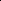

# Rethinking Crystal Symmetry Prediction: A Decoupled Perspective

<!-- Page 1 -->

Rethinking Crystal Symmetry Prediction:

A Decoupled Perspective

Liheng Yu1, Zhe Zhao1,3, Xucong Wang1, Di Wu1*, Pengkun Wang1,2*

## 1 University of Science and Technology of China, Hefei 230236, China 2 Suzhou Institute for Advanced Research,

University of Science and Technology of China, Suzhou 215123, China 3City University of Hong Kong, Hong Kong {yuliheng, zz4543, xuco, wdcxy}@mail.ustc.edu.cn, pengkun@ustc.edu.cn,

## Abstract

Efficiently and accurately determining the symmetry is a crucial step in the structural analysis of crystalline materials. Existing methods usually mindlessly apply deep learning models while ignoring the underlying chemical rules. More importantly, experiments show that they face a serious sub-property confusion (SPC) problem. To address the above challenges, from a decoupled perspective, we introduce the XRDecoupler framework, a problem-solving arsenal specifically designed to tackle the SPC problem. Imitating the thinking process of chemists, we innovatively incorporate multidimensional crystal symmetry information as superclass guidance to ensure that the model’s prediction process aligns with chemical intuition. We further design a hierarchical PXRD pattern learning model and a multi-objective optimization approach to achieve high-quality representation and balanced optimization. Comprehensive evaluations on three mainstream databases (e.g., CCDC, CoREMOF, and InorganicData) demonstrate that XRDecoupler excels in performance, interpretability, and generalization.

Code — https://github.com/baigeiguai/XRDecoupler Extended version — https://arxiv.org/abs/2511.06976

## Introduction

Symmetry determination is a crucial step in powder X-ray diffraction (PXRD) based crystal structure prediction (Altomare et al. 2004; Spence and Zuo 1992). The space group (Koster 1957) defines the symmetry characteristics of the crystal, including rotation, reflection, and inversion operations. These symmetries are fundamental to understanding the crystal structure and its properties (O’Keeffe and Hyde 2020; Bhagavantam and Suryanarayana 1949). Once the space group is established, scientists can build and optimize crystal structure models based on that symmetry (Han et al. 2025; Evans 2011). Incorrect selection of space groups can lead to inaccurate or unreasonable structural models. Therefore, efficiently and accurately identifying space group types remains a significant challenge.

As an early typical approach, many researchers attempted to apply a simple neural network for symmetry recognition

*Corresponding author. Copyright © 2026, Association for the Advancement of Artificial Intelligence (www.aaai.org). All rights reserved.

𝑰𝟒

𝑰#𝟒

𝑷"𝟒

𝑷𝟒

XRDMamba: XRDecoupler:

PELQUU (I4)

XRDMamba: XRDecoupler:

TUTBUG01 (P4)

XRDMamba: XRDecoupler:

OVOSOJ (I#𝟒)

XRDMamba: XRDecoupler:

YIWTIK (P#𝟒)

**Figure 1.** The SPC problem in the space group identification. Different colored blocks represent various symmetry classification systems, such as lattice types and point group types. We illustrate four space groups that current methods often confuse: I4, I4, P4, and P4. These space groups are intertwined and may belong to a coarser classification. We also present four representative crystal samples, i.e., PELQUU, OVOSOJ, TUTBUG01, and YIWTIK, demonstrating the capability of our method to decouple these confusions.

within specific ranges, advancing the application of machine learning in this task (Park et al. 2017; Ziletti et al. 2018; Oviedo et al. 2019; Vecsei et al. 2019; Dong et al. 2021). However, these methods often remain limited to a single space group or a small subset of space groups, or specific material categories, which restricts their applicability and prevents broader generalization across different materials or space groups. More importantly, simply imposing deep learning models on this task does not align with chemical intuition. Although the latest methods attempt to enhance model architectures from a theoretical perspective of pattern (Yu et al. 2024), they still face a challenging dilemma: models tend to mistake two crystalline materials with common sub-properties (such as lattice types) for belonging to the same space group (as shown in Figure 1), i.e., the subproperty confusion (SPC) problem.

To clarify the essence of SPC, we systematically rethought existing methods and found that the causes of SPC are multifaceted: ❶Previous methods directly process PXRD patterns in a conventional sequential manner, lack-

The Fortieth AAAI Conference on Artificial Intelligence (AAAI-26)

16208

AI-readable visual equivalent, added: Figure extracted from the paper PDF and converted to an SVG wrapper asset. Use the surrounding page text and caption for interpretation.

AI-readable visual equivalent, added: Figure extracted from the paper PDF and converted to an SVG wrapper asset. Use the surrounding page text and caption for interpretation.

AI-readable visual equivalent, added: Figure extracted from the paper PDF and converted to an SVG wrapper asset. Use the surrounding page text and caption for interpretation.

AI-readable visual equivalent, added: Figure extracted from the paper PDF and converted to an SVG wrapper asset. Use the surrounding page text and caption for interpretation.

AI-readable visual equivalent, added: Figure extracted from the paper PDF and converted to an SVG wrapper asset. Use the surrounding page text and caption for interpretation.

AI-readable visual equivalent, added: Figure extracted from the paper PDF and converted to an SVG wrapper asset. Use the surrounding page text and caption for interpretation.

AI-readable visual equivalent, added: Figure extracted from the paper PDF and converted to an SVG wrapper asset. Use the surrounding page text and caption for interpretation.

AI-readable visual equivalent, added: Figure extracted from the paper PDF and converted to an SVG wrapper asset. Use the surrounding page text and caption for interpretation.

AI-readable visual equivalent, added: Figure extracted from the paper PDF and converted to an SVG wrapper asset. Use the surrounding page text and caption for interpretation.

AI-readable visual equivalent, added: Figure extracted from the paper PDF and converted to an SVG wrapper asset. Use the surrounding page text and caption for interpretation.

AI-readable visual equivalent, added: Figure extracted from the paper PDF and converted to an SVG wrapper asset. Use the surrounding page text and caption for interpretation.

AI-readable visual equivalent, added: Figure extracted from the paper PDF and converted to an SVG wrapper asset. Use the surrounding page text and caption for interpretation.

<!-- Page 2 -->

ing the necessary chemical knowledge to guide the process. ❷The optimization direction of these models often tends to favor latent sub-properties. ❸The information overlap among sub-properties makes it difficult for the model to distinguish between closely related structures. To illustrate the SPC problem faced in space group prediction tasks more intuitively, we provide a clear diagram, as shown in Figure 1. Based on crystallography, the space groups I4, I4, P4, and P4 are categorized into two lattice types: I (body-centered) and P (primitive). They are also divided into two point group types: 4 (fourfold rotation axis) and 4 (fourfold rotoinversion axis). As a result, these four space groups share common sub-properties, making them particularly prone to confusion during classification. We also present the recognition results of different methods on these easily confused samples. The SOTA model (XRDMamba (Yu et al. 2024)) appears to be hindered by the SPC, while our method successfully predicts the space group types for each crystal.

Our method, XRDecoupler, is a problem-solving arsenal specifically designed to tackle the SPC problem in space group prediction. We rethink SPC faced in previous research according to the thinking process of chemists and innovatively incorporate crystal systems, Bravais lattice types, and point groups as superclasses guidance, ensuring that the model’s predictions align with chemical rules and enhancing its ability to distinguish between easily confused samples (▶solving Cause ❶). Additionally, different superclasses may focus on different aspects of the PXRD pattern. To address this, we propose a hierarchical PXRD pattern learning model that captures both local and global pattern information inherent in PXRD patterns, enabling efficient multi-superclass learning (▶solving Cause ❸). Furthermore, we utilize a multi-objective optimization approach to ensure that the model does not favor specific superclass tasks at the expense of others, guiding it toward an optimal training path (▶solving Cause ❷). To validate the effectiveness of XRDecoupler, we conducted comprehensive experimental evaluations on the well-known Cambridge Crystallographic Data Centre (CCDC) database (Allen et al. 1979), CoREMOF (Chung et al. 2019), and InorganicData (Salgado et al. 2023). The results indicate that XRDecoupler significantly outperforms other state-of-the-art baselines.

Our contributions are summarized as follows:

❶Crucial Problem and Fresh Perspective: For the first time, we rethink existing methods and analyze the SPC problem faced in space group prediction tasks. From a decoupled perspective, we introduce the XRDecoupler framework to decouple it. ❷Novel Mechanism: Imitating the thinking process of chemists, we innovatively incorporate multidimensional crystal symmetry information as superclasses guidance, ensuring predictions align with chemical intuition. ❸Reasonable Pattern Learner: We proposed a hierarchi- cal PXRD Pattern learning model that explicitly models the local and global pattern information in PXRD. ❹Brilliant Performance: Evaluations on well-known databases demonstrated the superior performance, interpretability, and generalization of XRDecoupler.

Related Works

▶Crystalline Space Group Prediction. Identifying crystal space groups is vital for structure prediction. While early work relied on computational methods (Werner, Eriksson, and Westdahl 1985), recent efforts have focused on deep learning. Initial convolutional neural networks showed promise but were often trained or tested on limited datasets (Park et al. 2017; Ziletti et al. 2018; Oviedo et al. 2019; Vecsei et al. 2019; Dong et al. 2021). Subsequent models like NPCNN (Salgado et al. 2023) utilized more comprehensive data but struggled with accuracy. In response, RCNet (Chen et al. 2024) improved performance by customizing categories and using residual structures, while XRDMamba (Yu et al. 2024) pioneered the integration of chemical knowledge and the Mamba architecture (Gu and Dao 2023; Gu 2023). However, these methods often neglect relevant chemical principles and suffer from high confusion between similar space groups. Our approach addresses this by designing a hierarchical framework and introducing multidimensional superclass knowledge to guide model optimization, thereby mitigating confusion and enhancing generalization.

▶Superclass Learning. Superclass learning improves model performance by incorporating high-level class groupings as intermediate supervision. This technique has proven effective across diverse domains, such as improving feature differentiation in image classification (Dehkordi et al. 2022; Wang et al. 2022), mitigating data imbalance (Zhou, Hu, and Wang 2018; Zhao et al. 2025; Wang et al. 2024; Zhao et al. 2024), and learning high-level relationships in graph neural networks (Du et al. 2023). The benefits of this approach are well-documented. Given the inherent hierarchical classification of space groups, we introduce superclass learning to this task for the first time. This guides our model to learn more detailed structural knowledge about crystals, significantly enhancing its recognition performance. A more comprehensive review is provided in Supplement H.

Motivation

▶Space Group Prediction Task. The PXRD data can be viewed as two vectors, A and I, both of length L, representing the diffraction angles and diffraction intensities on the PXRD pattern, respectively. In crystallography, the space group is a description of the symmetry of crystals, with a total of 230 theoretically existing space groups. We define D = {Xi, Yi}i∈[n] as a crystal dataset, where Xi = (Ai, Ii) represents the PXRD pattern data of a crystal, and Yi ∈ {0, 1,..., 229} denotes the space group label of that crystal. We represent the process of space group prediction as a mapping relationship: f(Xi) →Yi. We provide definitions about space groups in Supplement A.1 for understanding.

▶Multidimensional Symmetry as Superclasses. The superclass refers to a more general class in a hierarchical classification structure that contains other subclasses. For crystal structures, aside from space groups, there are many coarse-grained partition rules (Nespolo, Aroyo, and Souvignier 2018). As shown in Figure 1 in Supplement A, based on the symmetry of geometric morphology, crystals can be

16209

<!-- Page 3 -->

divided into 7 crystal systems (O’Keeffe and Hyde 2020); based on primitive point symmetry, they can be classified into 32 point groups (Bradley and Cracknell 2009); according to the point symmetry of Bravais lattices, there are 7 lattice systems; based on the spatial symmetry of Bravais lattices, there are 14 types of Bravais lattices (Pitteri and Zanzotto 1996); and based on combinations of point symmetry and translational symmetry, they can be classified into 73 algebraic crystal classes (Wilson 1990), among others (Hahn, Shmueli, and Arthur 1983; Prince 2004). The partition rules mentioned above can all be viewed as superclasses of space groups, describing only the symmetric properties of a certain part of the crystal. We also provide an explanation of the superclass mechanism in Supplement A.3.

Rethinking ‘Culprits’ Behind SPC ▶Culprit 1: Lack of Chemical Knowledge. Existing models are typically adapted directly from other deep learning tasks, predominantly utilizing rudimentary convolutional neural networks. Although these models have yielded initial results, they often fall short in enhancing performance further. The current model setup fails to consider chemical knowledge integral to material structure analysis, making it challenging for the model to genuinely comprehend the intricate details of the structural patterns within the data. Confusion often arises when the model only captures the coarse-grained aspects of the data. Hence, a model tailored with integrated chemical knowledge becomes indispensable to enhance the efficacy of space group identification.

▶Culprit 2: Bias in Optimization. Successful space group prediction requires accurately identifying the sample’s sub-symmetry properties (e.g., lattice, point, and translation symmetry). During optimization, supervisory signals for each property must be transmitted to guide learning. When the unique space group label is the sole supervisory signal, it can cause insufficient signals and imbiased gradients across sub-properties, leading the model to learn only some of them effectively. Consequently, the model struggles to distinguish between samples sharing these learned subproperties but belonging to different space groups, causing confusion. For example, Figure 2 shows our analysis of a SOTA method’s misclassifications and per-sub-attribute performance. The model evidently learned lattice types and crystal systems well but performed poorly on point group characteristics. Thus, the model exhibits significant confusion with samples that share the same lattice type and crystal system but differ in their point groups.

▶Culprit 3: Information Overlap Between Labels. The space group category serves as a fine-grained structural classification criterion, encompassing numerous sub-properties of crystal structures. For two distinct categories, they often share certain structural sub-properties, a phenomenon we refer to as information overlaps between labels. In the following, we will analyze how this information overlap can lead to confusion from the perspective of information theory (Ash 2012; Batina et al. 2011). For a given sample X, we denote its true confidence label as Ytruth and any other space group class label as Yother. In lattice type crystal system point group 0.2

0.3

0.4

0.5

0.6

0.7

0.8

Accuracy

Superclass Accuracy on Errors

XRDMamba XRDecoupler

**Figure 2.** Accuracy statistics of samples with misidentified space groups on three sub-properties (e.g., lattice type, crystal system, and point group) on the SOTA method (XRD- Mamba (Yu et al. 2024)) and our proposed XRDecoupler.

this context, for sample X, label Yother represents an incorrect label. Assumption 1. For the space group class label Y, it can be uniquely represented by k independent structure subproperties, i.e., Y = (y1, y2,..., yi,..., yk), where yi denotes i-th sub-properties.

Proposition 1. For Ytruth = (ytruth

1, ytruth

2,..., ytruth k) and Yother = (yother

1, yother

2,..., yother k), there are some same structure sub-properties. That is, there exists s,t, such that ytruth pd = yother pd, d = [1, 2,..., s] ytruth qd̸ = yother qd, d = [1, 2,..., t]

s.t. s + t = k, {[pi], [qi]} = {1, 2, 3,..., k}

(1)

For simplicity, let M = {ytruth pd }, d ∈[1, 2,..., s] represent the overlap information between Ytruth and Yother. Let ytruth = {ytruth qd }, d ∈[1, 2,..., t] and yother = {yother qd }, d ∈[1, 2,..., t] denote the non-overlapping information between the two labels. Then, we have Ytruth = (M, ytruth) and Yother = (M, yother). Usually, our aim is to have the model maximize the mutual information I(E; Ytruth) between sample representation and truth label during training, where E denotes the representation obtained from the encoder. Proposition 2. If there is significant overlap information between labels, maximizing the mutual information between sample representation and truth label will results in the mutual information of sample representation and overlap label being maximized as well, specifically:

I(E; Ytruth) ↑⇒I(E; Yother) ↑ s.t. I(M; Ytruth) ≫I(ytruth; Ytruth). (2)

We provide a theoretical analysis in Supplement B.1. Proposition 2 shows, when there is significant overlap in information between labels, simply maximizing the mutual information between the representation and the truth label is insufficient. Thus, we observe the difference between the mutual information, which serves as a reliable indicator of the model’s confusion in executing a classification. Definition 1 (Difference Diff in mutual information). The difference Diff in mutual information between two labels

16210

<!-- Page 4 -->

Intensity

Angle sin

Concatenate

ConvBlocks

Hierarchical PXRD Spectrum Learning Superclass-Guided Optimization PXRD Spectra

…Projection

Conv1D

BatchNorm1D

Conv1D

BatchNorm1D σ σ

Relu

Relu

1×1 Conv

Patching

…

Local Pattern Module

Global Pattern Module

𝐸!"#$!

ConvBlock Embedding

Learnable Embedding

Sequencing

Generate

Mask Bit

…

Attention Block Attention Block

Attention Block

Global Pooling

𝐸%!"&$!

Intensity Feature Angle Feature

Patch Position Feature Patch Mask Bit

Space Group

Point Group

Crystal System

Bravais Lattice System

Concatenate

MGDA-UB

𝐸

**Figure 3.** Overview of XRDecoupler.

is equal to the mutual information of their non-overlapping parts.

Diff = I(E; Ytruth) −I(E; Yother)

= I(E; ytruth) −I(E; yother) (3)

We provide the corresponding proof in Supplement B.2.

XRDecoupler is A ‘Nemesis’ of SPC Here, we propose a novel method for determining space groups from PXRD, called XRDecoupler. This method includes a superclass-guided optimization framework (for Culprit 2 & 3) and a hierarchical PXRD pattern learning model (for Culprit 1), effectively addressing the significant SPC issues associated with previous methods. An overview of XRDecoupler is illustrated in Figure 3.

Superclass-Guided Optimization (▶Culprit 2 & 3) ▶Mitigating Information Overlap. Considering significant information overlap between space group labels, we expect that the model focuses more on label-specific features and devotes less attention to overlapping information during the classification. Thus, we also aim to maximize Diff. Proposition 3. The process of maximizing Diff can be interpreted as maximizing the mutual information between the sample and each structured sub-property.

Diff = I(E; ytruth) −I(E; yother)

= t X i=1

[I(E; ytruth i) −I(E; yother i)] (4)

We provide the corresponding proof in Supplement B.3. From this proposition, we can optimize the model’s ability to learn each sub-property to alleviate the confusion phenomenon. Let’s discuss how to optimize them.

▶Superclass Guidance. Superclasses of space groups describe a broad property of crystal structures, which aligns with the idea of structured sub-property mentioned earlier. Therefore, it is logical to introduce various superclasses of space groups to represent the sub-properties above, and optimize the sub-properties in the same way as optimizing the superclasses. Through the oversight of these superclasses, the model’s focus on overlapping information can be minimized, thereby enhancing the efficacy of space group identification. Specifically, we focus on the T types of superclasses of space groups. We use C to represent the space group category, CSup i to denote the i-th type of superclass category of space groups, yi to indicate the space group category corresponding to the i-th sample, and ySupj i to represent the category of the j-th superclass corresponding to the i-th sample. We define Yi = {yi} ∪{ySupj i }j∈[T ] to represent the set of all categories to which the i-th sample belongs. Then, we assume that the classifier for space group classification is Cls, and the classifiers for the various superclasses are denoted as {ClsSupt}t∈[T ]. Our optimization objective is given by:

min −I(E; y) −β

X t∈[T ]

I(E; ySupt)

⇔min E(X,Y)−log p(y|E) −

X t∈[T ]

log p(ySupt|E)

⇔min Lsp(Cls(f(X)), y) + β

X t∈[T ]

Lt(ClsSupt(f(X)), ySupt)

(5) where Lsp(·) and Lt(·) are the cross-entropy loss, f is an encoder satisfying E = f(X), and β is a hyperparameter.

16211

AI-readable visual equivalent, added: Figure extracted from the paper PDF and converted to an SVG wrapper asset. Use the surrounding page text and caption for interpretation.

AI-readable visual equivalent, added: Figure extracted from the paper PDF and converted to an SVG wrapper asset. Use the surrounding page text and caption for interpretation.

AI-readable visual equivalent, added: Figure extracted from the paper PDF and converted to an SVG wrapper asset. Use the surrounding page text and caption for interpretation.

AI-readable visual equivalent, added: Figure extracted from the paper PDF and converted to an SVG wrapper asset. Use the surrounding page text and caption for interpretation.

AI-readable visual equivalent, added: Figure extracted from the paper PDF and converted to an SVG wrapper asset. Use the surrounding page text and caption for interpretation.

AI-readable visual equivalent, added: Figure extracted from the paper PDF and converted to an SVG wrapper asset. Use the surrounding page text and caption for interpretation.

AI-readable visual equivalent, added: Figure extracted from the paper PDF and converted to an SVG wrapper asset. Use the surrounding page text and caption for interpretation.

AI-readable visual equivalent, added: Figure extracted from the paper PDF and converted to an SVG wrapper asset. Use the surrounding page text and caption for interpretation.

AI-readable visual equivalent, added: Figure extracted from the paper PDF and converted to an SVG wrapper asset. Use the surrounding page text and caption for interpretation.

AI-readable visual equivalent, added: Figure extracted from the paper PDF and converted to an SVG wrapper asset. Use the surrounding page text and caption for interpretation.

AI-readable visual equivalent, added: Figure extracted from the paper PDF and converted to an SVG wrapper asset. Use the surrounding page text and caption for interpretation.

AI-readable visual equivalent, added: Figure extracted from the paper PDF and converted to an SVG wrapper asset. Use the surrounding page text and caption for interpretation.

AI-readable visual equivalent, added: Figure extracted from the paper PDF and converted to an SVG wrapper asset. Use the surrounding page text and caption for interpretation.

AI-readable visual equivalent, added: Figure extracted from the paper PDF and converted to an SVG wrapper asset. Use the surrounding page text and caption for interpretation.

AI-readable visual equivalent, added: Figure extracted from the paper PDF and converted to an SVG wrapper asset. Use the surrounding page text and caption for interpretation.

AI-readable visual equivalent, added: Figure extracted from the paper PDF and converted to an SVG wrapper asset. Use the surrounding page text and caption for interpretation.

AI-readable visual equivalent, added: Figure extracted from the paper PDF and converted to an SVG wrapper asset. Use the surrounding page text and caption for interpretation.

AI-readable visual equivalent, added: Figure extracted from the paper PDF and converted to an SVG wrapper asset. Use the surrounding page text and caption for interpretation.

AI-readable visual equivalent, added: Figure extracted from the paper PDF and converted to an SVG wrapper asset. Use the surrounding page text and caption for interpretation.

AI-readable visual equivalent, added: Figure extracted from the paper PDF and converted to an SVG wrapper asset. Use the surrounding page text and caption for interpretation.

AI-readable visual equivalent, added: Figure extracted from the paper PDF and converted to an SVG wrapper asset. Use the surrounding page text and caption for interpretation.

AI-readable visual equivalent, added: Figure extracted from the paper PDF and converted to an SVG wrapper asset. Use the surrounding page text and caption for interpretation.

AI-readable visual equivalent, added: Figure extracted from the paper PDF and converted to an SVG wrapper asset. Use the surrounding page text and caption for interpretation.

AI-readable visual equivalent, added: Figure extracted from the paper PDF and converted to an SVG wrapper asset. Use the surrounding page text and caption for interpretation.

AI-readable visual equivalent, added: Figure extracted from the paper PDF and converted to an SVG wrapper asset. Use the surrounding page text and caption for interpretation.

AI-readable visual equivalent, added: Figure extracted from the paper PDF and converted to an SVG wrapper asset. Use the surrounding page text and caption for interpretation.

AI-readable visual equivalent, added: Figure extracted from the paper PDF and converted to an SVG wrapper asset. Use the surrounding page text and caption for interpretation.

AI-readable visual equivalent, added: Figure extracted from the paper PDF and converted to an SVG wrapper asset. Use the surrounding page text and caption for interpretation.

AI-readable visual equivalent, added: Figure extracted from the paper PDF and converted to an SVG wrapper asset. Use the surrounding page text and caption for interpretation.

<!-- Page 5 -->

▶Example. In the confusion cases illustrated in Figure 1, we clarify the representations of samples from the I4 & P4 categories, as well as I4 & P4, by introducing the Bravais lattice type superclass as supervision. Additionally, we use the point group type superclass to differentiate between I4 & I4, and P4 & P4 samples, thereby enhancing the discriminative capability of these four space groups.

▶Optimization Process. Following the introduction of superclasses, each one provides a multitude of detailed supervision signals for the model’s optimization process. Nevertheless, as illustrated in Figure 4(left), Culprit 2 remains unresolved, with a persistent skew in the optimization process. In this process, the model’s loss on certain superclasses initially decreases, only to be followed by the gradual optimization of the remaining superclasses once these have been refined. This skewed optimization process is detrimental to enhancing the model’s generalization performance and also impacts the benefits derived from the superclasses. Therefore, we have transformed the optimization process into a multi-objective optimization process. We consider the space group and the T superclasses as T + 1 independent classification objectives, thereby optimizing the model’s learning as a multi-objective optimization, i.e., min

W

ˆL(W Enc, W Sup

1,..., W Sup

T +1)

= min

W (L1(W Enc, W Sup

1),..., LT +1(W Enc, W Sup

T +1))

(6)

where W Enc represents the parameters of the encoder, W Sup t represents the parameters of the classifier for each class and W = {W Enc} S{W Sup t }t∈[T +1] represents all parameters. The goal of multi-objective optimization is achieving Pareto optimality.

Definition 2 (Solution W). A solution W dominates a solution W if ˆL(W Enc, W Sup t) ≤ ˆL(W

Enc, W

Sup t) for all objectives t ∈ [T + 1] and ˆL(W Enc, W Sup

1, W Sup

2,..., W Sup

T +1)̸ = ˆL(W

Enc, W

Sup 1, W

Sup 2,..., W

Sup T +1).

Definition 3 (Solution W ∗). A solution W ∗is Pareto optimal if there exists no solution W that dominates W ∗.

Therefore, the optimization process of space group and superclass is transformed into finding a Pareto optimal solution W ∗= (W Enc∗, W Sup∗

1,..., W Sup∗ t). Inspired by MGDA-UB(Sener and Koltun 2018), we further transform the optimization problem into solving a set of weights {αi}:

min α1,α2,...,αT +1 ||

T +1 X t=1 αt∇W EncLt(W Enc, W Sup t)||2

2, s.t.

T +1 X t=1 αt = 1, αt >= 0 ∀t.

(7)

where αt denotes the weight of the t-th objective.

Then, we use the FRANK-WOLFESOLVER algorithm (FW) to obtain a gradient direction that improves all T + 1 classification tasks. The optimization process is as follows.

(1)W Sup t = W Sup t −η∇W Sup t L(W Enc, W Sup t)∀t ∈[T + 1]

(2)α1,..., αt = FW(W Enc, {W Sup t }t∈[T +1])

(3)W Enc = W Enc −η

T +1 X t=1 αt∇W EncLt(W Enc, W Sup t)

(8) where η represents the learning rate.

Hierarchical PXRD Pattern Learning (▶Culprit 1) The introduction of superclasses brings a wealth of structural knowledge to the model, including point symmetry, crystal structure periodicity, lattice structures, and other rich information. This encompasses global and local information about the crystal structure, raising the bar for the encoder to learn more refined knowledge. As Culprit 3 mentioned, the original models struggle to capture such fine-grained knowledge and are unable to learn detailed representations that incorporate these specific insights.

Therefore, we propose a new hierarchical Pattern learning model tailored to the characteristics of space groups. This model consists of two main components: (i) Local Pattern module (LP), which captures local information between adjacent peaks in the PXRD pattern, outputting a klocal-dimensional representation Elocal; (ii) Global Pattern module (GP), which captures global information from the PXRD pattern, outputting a kglobal-dimensional representation Eglobal. We combine these two representations to obtain the final output representation of the model:

E = Concat(Eglobal, Elocal) (9)

This representation is used for the subsequent superclassguided optimization process.

▶Local Pattern Module. The input vectors of the local pattern module are A and I, which represent the diffraction angles and intensities on the PXRD pattern, respectively. According to Bragg’s law(Pope 1997), 2d sin(θ) = nλ, the interplanar spacing is inversely related to sin(θ). Thus, we replace A with sin(A) and concatenate it with the peak intensity I to form an input sequence with channel = 2.

Next, we employ several residual 1D convolution blocks (a kernel size of 3 and a stride of 1) to capture the correlations between adjacent peaks in the PXRD pattern. After the convolution process, we flatten the features and project them to obtain the local pattern representation Elocal. Therefore, the representation process of the local pattern module can be formalized as:

Elocal = Projection (Flatten (ConvBlocks(sin(A) ⊕I))) (10)

where Projection refers to a linear projection, Flatten denotes the flattening operation, and ConvBlock is a submodule composed of convolutional layers, while ⊕represents the concatenation operation.

▶Global Pattern Module. The global pattern module first segments the peak intensity data I into Lp consecutive patches of length p. Each patch Ip is then processed by

16212

<!-- Page 6 -->

## Method

Accuracy (%) on MOF F1 Score (%) Recall (%) Top-1 Top-2 Top-5

MLP 9.10 (−29.90) 15.10 (−41.30) 30.10 (−47.48) 6.43 (−16.17) 5.24 (−16.26) CNN 39.00 (+0.00) 56.40 (+0.00) 77.58 (+0.00) 22.60 (+0.00) 21.50 (+0.00)

NoPoolCNN 38.20 (−0.80) 51.80 (−4.60) 71.12 (−6.46) 34.47 (+11.87) 31.84 (+10.34) RCNet 59.00 (+20.00) 73.70 (+17.30) 88.37 (+10.79) 41.29 (+18.69) 40.38 (+18.80) XRDMamba 72.20 (+33.20) 85.20 (+28.80) 93.42 (+15.84) 47.59 (+24.99) 46.00 (+24.50)

XRDecoupler 80.09 (+41.09) 90.11 (+33.71) 96.26 (+18.68) 56.72 (+34.12) 55.18 (+33.68)

Accuracy (%) on MOF-Balanced

Top-1 Top-2 Top-5

4.10 (−18.8) 5.40 (−27.00) 8.21 (−38.79) 22.90 (+0.00) 32.40 (+0.00) 47.00 (+0.00)

33.80 (+10.90) 40.70 (+8.30) 50.97 (+3.97) 44.50 (+21.60) 55.50 (+23.10) 69.12 (+22.12) 48.70 (+25.80) 61.70 (+29.3) 74.83 (+27.83)

58.87 (+35.97) 72.42 (+40.02) 85.22 (+38.22)

**Table 1.** Evaluation on MOF subset (left) and MOF-Balanced subset (right) of CCDC dataset with SOTA methods. Bold indicates the best performance while underline indicates the second best. (+) and (−) indicate the the relative gain with CNN.

convolution blocks to capture local peak correlations, yielding a peak intensity representation, eintensity ∈Rkintensity. Next, we assign a learnable feature elearnable ∈Rklearnable for each patch, allowing the model to adaptively learn representations that characterize the patch. After setting the positional encoding eposition for each patch, we concatenate the peak intensity features and the learnable features, and then add eposition to form the final representation of the patch. Subsequently, we use several attention modules to learn these features, enabling the model to capture the correlations between any two patches and providing more global information. After that, we apply a global pooling layer to obtain the final global representation Eglobal.

However, we experimentally found that some patches obtained from the PXRD pattern have peak intensities that are entirely zero. These patches hold no value for the model during the learning process and may even have a negative effect on other patches. Therefore, during the calculation of attention, we apply a masking process to these patches, defined as:

emask = (max(Ip) == 0). (11) This ensures that patches with all zero intensities do not contribute to the attention calculations.

Therefore, the representation process of the global pattern module can be formalized as:

Eglobal = GlobalPooling(AttentionBlocks(

(eintensity ⊕elearnable) + epostion, emask)) (12)

Here, eintensity represents the peak intensity features of the patch, elearnable denotes the learnable features for the patch, eposition represents the positional features of the patch, and emask indicates whether each patch is masked.

## Experiments

For more detailed information, please refer to supplementary material in the extended version of our paper.

▶Dataset and Baselines. We use the MOF dataset as our main dataset as (Yu et al. 2024), which consists of over 280,000 metal-organic frameworks (MOFs) (Furukawa et al. 2013; James 2003; Zhou, Long, and Yaghi 2012) from the Cambridge Crystallographic Data Centre (CCDC) (Allen et al. 1979) for our experiments. Furthermore, we were successful in acquiring two additional datasets, CoRE- MOF (Chung et al. 2019) and InorganicData (Salgado et al. 2023), to assist in verifying the effectiveness of our method. We provide the details of datasets and processing in Supplement C. To ensure fairness in the experiments, we selected several SOTA space group prediction models as our baselines, including MLP (Salgado et al. 2023), CNN (Salgado et al. 2023), NoPoolCNN (Salgado et al. 2023), RC- Net (Chen et al. 2024), and XRDMamba (Yu et al. 2024). Detailed descriptions are provided in Supplement D.

▶Benchmark Results. As shown in Table 1, we outperform all baselines on both the MOF (left) and MOF- Balanced (right) test sets, surpassing the previous SOTA (XRDMamba). These results demonstrate our method effectively alleviates SPC and establishes a new SOTA. More results on CoREMOF and InorganicData are provided in Supplement F.1.

▶Effectiveness of Gradient-based Optimization. Figure 4(a) shows the loss descent curves for space group and superclasses when the gradient-based multi-objective optimization method is not employed. We can observe that the model initially optimizes the coarse-grained Bravais lattice types and crystal system types. Only after the losses for these superclasses drop to a low level does the model begin to optimize the space groups and point groups. Figure 4(b) presents the loss descent curves for each superclass and space group after introducing the gradient-based multiobjective optimization method. Here, we can see that the optimization directions for each class become consistent, allowing the model to simultaneously learn structural knowledge across multiple dimensions.

▶T-SNE Visualization Analysis of Confusion Phenomena. Figure 4(right) displays the t-SNE plot of over 3,000 samples randomly sampled from 60 classes in the training set. The figure clearly shows a distinct clustering of features, with noticeable spacing between samples from different space group categories, indicating the superior performance of our model on the training set. We also provide more t-SNE visualization analysis in Supplement F.2.

▶Dependencies between Representations and Superclasses. To validate the roles of global and local representations, we explored their interdependencies with superclass tasks during classification. We analyzed the classifier weights for space groups and each superclass, observing the importance of different representation locations for the classifier’s decision-making by examining the distribution of these weights. The relevant visualizations are shown in Figure 5. Therefore, we can conclude that in XRDecoupler, both the global and local modules play significant roles and

16213

<!-- Page 7 -->

**Figure 4.** Trend of the model’s training loss. (left) The conventional optimization process of the model on the space group and superclass. (middle) The optimization process of the model on the space group and superclass after introducing the gradientbased optimization method. (right) T-SNE Visualization Analysis of XRDecoupler in the training set.

**Figure 5.** Visualization of the impact of global and local representations on the decision of each superclass.

exhibit notable interdependencies across superclass tasks.

▶Focus Tendency of Global & Local Pattern Modules. To explore the roles of the global and local modules, we visualized their attention levels in Figure 6. Specifically, we used Grad-CAM (Selvaraju et al. 2017; Zeiler 2014; Pope et al. 2019) for the local module’s focus and analyzed the self-attention matrix for the global module. Figure 6 shows the local module focuses on local variations between peaks (red dashed box), while the global module attends to patches with high peaks (orange dashed box). Thus, the two modules capture distinct fine-grained information from the PXRD pattern, which is key to XRDecoupler’s ability to learn detailed representations and achieve superior performance.

▶Generalization Analysis. We conducted a generalization test using 8,000 inorganic crystal data obtained from (Salgado et al. 2023), which encompasses 178 space group categories. According to the theoretical logic of symmetry classification, inorganic crystals and MOF crystals are analogous, differing primarily in their building units, types of chemical bonds, topological structures, and pore structures. Therefore, inorganic crystals represent out-of-domain data for us, and the model’s performance on this data serves as a good measure of its generalization capability. As shown in

**Figure 6.** Visualization of the attention of the global and local pattern module to each region in the input PXRD pattern.

## Method

Accuracy (%)

Top-1 Top-2 F1 Score

MLP 15.50 (−14.10) 21.4 (−23.20) 8.5 (+0.8) CNN 29.60 (+0.00) 44.60 (+0.00) 7.70 (+0.00)

NoPoolCNN 30.40 (+0.8) 41.60 (−3.00) 15.90 (+8.2) RCNet 41.70 (+12.10) 52.40 (+7.80) 19.40 (+11.70) XRDMamba 54.50 (+24.90) 64.70 (+20.10) 24.10 (+16.40)

XRDecoupler 60.22 (+30.62) 70.45 (+25.85) 29.09 (+21.39)

**Table 2.** Generalization analysis on the inorganic dataset with SOTA methods. Bold indicates the best performance while (+) and (−) indicate the the relative gain with CNN.

Table 2, our method outperforms the SOTA methods, which indicates that XRDecoupler significantly enhances generalization performance on out-of-domain data.

▶Further analysis. Please see Supplement F to find more analysis, including ablation study, crystal scale adaptability, and case analyses.

## Conclusion

In this paper, we present the XRDecoupler framework, which efficiently determines the symmetry of crystalline materials. This work advances the application of deep learning in crystalline materials analysis, providing a novel methodology for symmetry identification.

16214

AI-readable visual equivalent, added: Figure extracted from the paper PDF and converted to an SVG wrapper asset. Use the surrounding page text and caption for interpretation.

AI-readable visual equivalent, added: Figure extracted from the paper PDF and converted to an SVG wrapper asset. Use the surrounding page text and caption for interpretation.

AI-readable visual equivalent, added: Figure extracted from the paper PDF and converted to an SVG wrapper asset. Use the surrounding page text and caption for interpretation.

AI-readable visual equivalent, added: Figure extracted from the paper PDF and converted to an SVG wrapper asset. Use the surrounding page text and caption for interpretation.

AI-readable visual equivalent, added: Figure extracted from the paper PDF and converted to an SVG wrapper asset. Use the surrounding page text and caption for interpretation.

<!-- Page 8 -->

## Acknowledgements

The authors gratefully acknowledge the support from the National Natural Science Foundation of China (NSFC) under Grant Nos. 62402472, and 12227901. This work was also supported by the Natural Science Foundation of Jiangsu Province (No. BK20240461), the Project of Stable Support for Youth Team in Basic Research Field, CAS (No. YSBR- 005), and the Academic Leaders Cultivation Program at USTC. The AI-driven experiments, simulations and model training were performed on the robotic AI-Scientist platform of Chinese Academy of Sciences.

## References

Allen, F. H.; Bellard, S.; Brice, M.; Cartwright, B. A.; Doubleday, A.; Higgs, H.; Hummelink, T.; Hummelink- Peters, B.; Kennard, O.; Motherwell, W.; et al. 1979. The Cambridge Crystallographic Data Centre: computer-based search, retrieval, analysis and display of information. Acta Crystallographica Section B: Structural Crystallography and Crystal Chemistry, 35(10): 2331–2339. Altomare, A.; Caliandro, R.; Camalli, M.; Cuocci, C.; Silva, I. d.; Giacovazzo, C.; Moliterni, A. G.; and Spagna, R. 2004. Space-group determination from powder diffraction data: a probabilistic approach. Journal of applied crystallography, 37(6): 957–966. Ash, R. B. 2012. Information theory. Courier Corporation. Batina, L.; Gierlichs, B.; Prouff, E.; Rivain, M.; Standaert, F.-X.; and Veyrat-Charvillon, N. 2011. Mutual information analysis: a comprehensive study. Journal of Cryptology, 24(2): 269–291. Bhagavantam, S. t.; and Suryanarayana, D. 1949. Crystal symmetry and physical properties: application of group theory. Acta Crystallographica, 2(1): 21–26. Bradley, C.; and Cracknell, A. 2009. The mathematical theory of symmetry in solids: representation theory for point groups and space groups. Oxford University Press. Chen, L.; Wang, B.; Zhang, W.; Zheng, S.; Chen, Z.; Zhang, M.; Dong, C.; Pan, F.; and Li, S. 2024. Crystal Structure Assignment for Unknown Compounds from X-ray Diffraction Patterns with Deep Learning. Journal of the American Chemical Society, 146(12): 8098–8109. Chung, Y. G.; Haldoupis, E.; Bucior, B. J.; Haranczyk, M.; Lee, S.; Zhang, H.; Vogiatzis, K. D.; Milisavljevic, M.; Ling, S.; Camp, J. S.; et al. 2019. Advances, updates, and analytics for the computation-ready, experimental metal–organic framework database: CoRE MOF 2019. Journal of Chemical & Engineering Data, 64(12): 5985–5998. Dehkordi, H. A.; Nezhad, A. S.; Kashiani, H.; Shokouhi, S. B.; and Ayatollahi, A. 2022. Multi-expert human action recognition with hierarchical super-class learning. Knowledge-Based Systems, 250: 109091. Dong, H.; Butler, K. T.; Matras, D.; Price, S. W.; Odarchenko, Y.; Khatry, R.; Thompson, A.; Middelkoop, V.; Jacques, S. D.; Beale, A. M.; et al. 2021. A deep convolutional neural network for real-time full profile analysis of big powder diffraction data. NPJ Computational Materials, 7(1): 74.

Du, Y.; Shen, J.; Zhen, X.; and Snoek, C. G. 2023. Superdisco: Super-class discovery improves visual recognition for the long-tail. In Proceedings of the IEEE/CVF Conference on Computer Vision and Pattern Recognition, 19944– 19954. Evans, P. R. 2011. An introduction to data reduction: spacegroup determination, scaling and intensity statistics. Biological crystallography, 67(4): 282–292. Furukawa, H.; Cordova, K. E.; O’Keeffe, M.; and Yaghi, O. M. 2013. The chemistry and applications of metalorganic frameworks. Science, 341(6149): 1230444. Gu, A. 2023. Modeling Sequences with Structured State Spaces. Stanford University. Gu, A.; and Dao, T. 2023. Mamba: Linear-time sequence modeling with selective state spaces. arXiv preprint arXiv:2312.00752. Hahn, T.; Shmueli, U.; and Arthur, J. W. 1983. International tables for crystallography, volume 1. Reidel Dordrecht. Han, Y.; Ding, C.; Wang, J.; Gao, H.; Shi, J.; Yu, S.; Jia, Q.; Pan, S.; and Sun, J. 2025. Efficient crystal structure prediction based on the symmetry principle. Nature Computational Science, 1–13. James, S. L. 2003. Metal-organic frameworks. Chemical Society Reviews, 32(5): 276–288. Koster, G. F. 1957. Space groups and their representations. In Solid state physics, volume 5, 173–256. Elsevier. Nespolo, M.; Aroyo, M. I.; and Souvignier, B. 2018. Crystallographic shelves: space-group hierarchy explained. Journal of Applied Crystallography, 51(5): 1481–1491. O’Keeffe, M.; and Hyde, B. G. 2020. Crystal structures. Courier Dover Publications. Oviedo, F.; Ren, Z.; Sun, S.; Settens, C.; Liu, Z.; Hartono, N. T. P.; Ramasamy, S.; DeCost, B. L.; Tian, S. I.; Romano, G.; et al. 2019. Fast and interpretable classification of small X-ray diffraction datasets using data augmentation and deep neural networks. npj Computational Materials, 5(1): 60. Park, W. B.; Chung, J.; Jung, J.; Sohn, K.; Singh, S. P.; Pyo, M.; Shin, N.; and Sohn, K.-S. 2017. Classification of crystal structure using a convolutional neural network. IUCrJ, 4(4): 486–494. Pitteri, M.; and Zanzotto, G. 1996. On the definition and classification of Bravais lattices. Acta Crystallographica Section A: Foundations of Crystallography, 52(6): 830–838. Pope, C. G. 1997. X-ray diffraction and the Bragg equation. Journal of chemical education, 74(1): 129. Pope, P. E.; Kolouri, S.; Rostami, M.; Martin, C. E.; and Hoffmann, H. 2019. Explainability methods for graph convolutional neural networks. In Proceedings of the IEEE/CVF conference on computer vision and pattern recognition, 10772–10781. Prince, E. 2004. International Tables for Crystallography, Volume C: Mathematical, physical and chemical tables. Springer Science & Business Media. Salgado, J. E.; Lerman, S.; Du, Z.; Xu, C.; and Abdolrahim, N. 2023. Automated classification of big X-ray diffraction

16215

<!-- Page 9 -->

data using deep learning models. npj Computational Materials, 9(1): 214. Selvaraju, R. R.; Cogswell, M.; Das, A.; Vedantam, R.; Parikh, D.; and Batra, D. 2017. Grad-cam: Visual explanations from deep networks via gradient-based localization. In Proceedings of the IEEE international conference on computer vision, 618–626. Sener, O.; and Koltun, V. 2018. Multi-task learning as multiobjective optimization. Advances in neural information processing systems, 31. Spence, J.; and Zuo, J. 1992. Symmetry Determination. In Electron Microdiffraction, 145–167. Springer. Vecsei, P. M.; Choo, K.; Chang, J.; and Neupert, T. 2019. Neural network based classification of crystal symmetries from x-ray diffraction patterns. Physical Review B, 99(24): 245120. Wang, B.; Wang, P.; Xu, W.; Wang, X.; Zhang, Y.; Wang, K.; and Wang, Y. 2024. Kill two birds with one stone: Rethinking data augmentation for deep long-tailed learning. In The Twelfth International Conference on Learning Representations. Wang, D.; Song, Y.; Huang, J.; An, D.; and Chen, L. 2022. SAR target classification based on multiscale attention super-class network. IEEE Journal of Selected Topics in Applied Earth Observations and Remote Sensing, 15: 9004– 9019. Werner, P.-E.; Eriksson, L.; and Westdahl, M. 1985. TREOR, a semi-exhaustive trial-and-error powder indexing program for all symmetries. Journal of Applied Crystallography, 18(5): 367–370. Wilson, A. 1990. Space groups rare for organic structures. II. Analysis by arithmetic crystal class. Foundations of Crystallography, 46(9): 742–754. Yu, L.; Wang, P.; Zhao, Z.; Yi, Z.; Nan, S.; Wu, D.; and Wang, Y. 2024. XRDMamba: Large-scale Crystal Material Space Group Identification with Selective State Space Model. In Proceedings of the 33rd ACM International Conference on Information and Knowledge Management, 4233– 4237. Zeiler, M. 2014. Visualizing and Understanding Convolutional Networks. In European conference on computer vision/arXiv, volume 1311. Zhao, Z.; Wen, H.; Wang, P.; Wang, Z.; Zhang, Q.; Wang, Y.; et al. 2025. Balancing Model Efficiency and Performance: Adaptive Pruner for Long-tailed Data. In Forty-second International Conference on Machine Learning. Zhao, Z.; Wen, H.; Wang, Z.; Wang, P.; Wang, F.; Lai, S.; Zhang, Q.; and Wang, Y. 2024. Breaking Long- Tailed Learning Bottlenecks: A Controllable Paradigm with Hypernetwork-Generated Diverse Experts. Advances in Neural Information Processing Systems, 37: 7493–7520. Zhou, H.-C.; Long, J. R.; and Yaghi, O. M. 2012. Introduction to metal–organic frameworks. Zhou, Y.; Hu, Q.; and Wang, Y. 2018. Deep super-class learning for long-tail distributed image classification. Pattern Recognition, 80: 118–128.

Ziletti, A.; Kumar, D.; Scheffler, M.; and Ghiringhelli, L. M. 2018. Insightful classification of crystal structures using deep learning. Nature communications, 9(1): 2775.

16216
