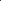

# Rethinking Rainy 3D Scene Reconstruction via Perspective Transforming and Brightness Tuning

<!-- Page 1 -->

Rethinking Rainy 3D Scene Reconstruction via Perspective Transforming and

Brightness Tuning

Qianfeng Yang*1, Xiang Chen*2, Pengpeng Li2, Qiyuan Guan1, Guiyue Jin1†, Jiyu Jin1†

1Dalian Polytechnic University 2Nanjing University of Science and Technology csqianfengyang@163.com, chenxiang@njust.edu.cn, pengpengli@njust.edu.cn, csguanqiyuan@163.com, guiyue.jin@dlpu.edu.cn, jiyu.jin@dlpu.edu.cn

## Abstract

Rain degrades the visual quality of multi-view images, which are essential for 3D scene reconstruction, resulting in inaccurate and incomplete reconstruction results. Existing datasets often overlook two critical characteristics of real rainy 3D scenes: the viewpoint-dependent variation in the appearance of rain streaks caused by their projection onto 2D images, and the reduction in ambient brightness resulting from cloud coverage during rainfall. To improve data realism, we construct a new dataset named OmniRain3D that incorporates perspective heterogeneity and brightness dynamicity, enabling more faithful simulation of rain degradation in 3D scenes. Based on this dataset, we propose an end-to-end reconstruction framework named REVR-GSNet (Rain Elimination and Visibility Recovery for 3D Gaussian Splatting). Specifically, REVR-GSNet integrates recursive brightness enhancement, Gaussian primitive optimization, and GS-guided rain elimination into a unified architecture through joint alternating optimization, achieving high-fidelity reconstruction of clean 3D scenes from rain-degraded inputs. Extensive experiments show the effectiveness of our dataset and method. Our dataset and method provide a foundation for future research on multiview image deraining and rainy 3D scene reconstruction.

Code — https://github.com/ncfjd/REVR-GSNet

## Introduction

Three-dimensional (3D) scene reconstruction recovers the spatial structure of real-world environments from image sequences and plays a critical role in vision-centric applications such as autonomous driving (Lu et al. 2025; Hu et al. 2024) and robotics (Liang 2025). However, adverse weather conditions, particularly rainy scenes, introduce visual degradations such as reduced visibility, which disrupt multi-view consistency and degrade reconstruction. Therefore, developing robust reconstruction techniques specifically designed for rainy scenarios is essential to ensure the reliability and precision of downstream tasks under challenging conditions.

In the real world, rain occurs within a 3D scene, and rain streaks therefore exhibit certain characteristics unique

*These authors contributed equally. †Corresponding author. Copyright © 2026, Association for the Advancement of Artificial Intelligence (www.aaai.org). All rights reserved.

to 3D spatial structure, as illustrated in Figure 1. First, rain in a 3D scene is a volumetric phenomenon with depth, where rain streaks are distributed between the camera and the objects. As the viewpoint changes, the appearance of rain in the image also varies, such as changes in the angle and length of rain streaks (Farber and Rosinski 1978). We refer to this viewpoint-dependent variability as Perspective Heterogeneity. Second, in real-world rainy scenarios, rain clouds often reduce ambient brightness, and there is a correlation between rain and scene brightness (Changbo et al. 2008; Tremblay et al. 2021), a phenomenon we define as Brightness Dynamicity. These coupled effects introduce geometric distortions and texture artifacts, ultimately degrading image quality and affecting reconstruction accuracy. Several prior works have attempted to construct 3D rainy scene datasets to support reconstruction under rainy conditions. HydroViews (Liu et al. 2024) generates rain-degraded images by linearly overlaying 2D rain masks onto background images captured from different viewpoints. However, this approach remains limited to two-dimensional degradation and lacks physical consistency with 3D rain behavior. RainyScape (Lyu, Liu, and Hou 2024) introduces a more realistic degradation by simulating rain effects in 3D space, which improves visual realism. Nevertheless, it neglects the impact of rainfall on ambient brightness, resulting in a significant domain gap from real rainy scenes.

In light of these limitations, we introduce a new data construction pipeline and build a dataset named OmniRain3D to address the challenges of 3D scene reconstruction under rainy conditions, as illustrated in Figure 2. Specifically, we first extract multi-view camera poses from background images using COLMAP. Blender then renders dynamic rain streaks from corresponding viewpoints based on these poses. Finally, we adjust background brightness via an exponential decay model and overlay rain streaks under varying intensities to produce realistic rainy scenes.

Based on this dataset, developing a robust model for highquality 3D reconstruction remains an open and valuable research direction. Existing methods (Li et al. 2024; Liu et al. 2024) for 3D scene reconstruction under rainy conditions typically rely on pre-trained models to remove raininduced degradations. However, this paradigm separates rain removal and 3D reconstruction into two independent stages, which may lead to overfitting to specific rain patterns during

The Fortieth AAAI Conference on Artificial Intelligence (AAAI-26)

11658

<!-- Page 2 -->

(a) Perspective Heterogeneity (b) Brightness Dynamicity

High Brightness 𝑣1 𝑣2 𝑣3 ℎ1 ℎ2 ℎ3 Low Brightness ℎ4

Vertical Shooting Angles

Top-down View

V-shaped Convergence

Horizontal View

Bottom-up View

Parallel Distribution

Λ-shaped Expansion 𝑣1 𝑣2 𝑣3

Real Rainy Scene

Horizontal Shooting Angles x y z x z y z ℎ1 ℎ2 y z x z ℎ3 ℎ4

**Figure 1.** Illustration of key characteristics in real rainy scenes. (a) Perspective Heterogeneity: Rain streaks vary in appearance across both vertical and horizontal directions, as shown in real observations. (b) Brightness Dynamicity: An increase in rainfall is often accompanied by a decrease in ambient brightness, as confirmed by images ranging from sunny to heavy rain conditions.

pre-training and consequently limit the model’s generalization ability in real-world complex rainy scenarios. Furthermore, existing methods lack a brightness adjustment mechanism, making it difficult to adapt to changes in brightness in real-world rainy environments.

These challenges motivate us to develop REVR-GSNet, an end-to-end framework that simultaneously addresses rain degradation and low brightness conditions to achieve highquality 3D scene reconstruction. Specifically, the Recursive Brightness Enhancement (RBE) module progressively refines the brightness enhancement curve through recursive enhancement, gradually improving the brightness of the input images. The Gaussian Primitives Optimization (GPO) module further utilizes the enhanced images along with camera poses to construct and optimize a 3D Gaussian representation. The GS-guided Rain Elimination (GRE) module integrates the rendered images and enhanced views, and employs a residual recurrent network with recurrent refinement to remove rain streaks while simultaneously feeding back to improve the 3D reconstruction. These components collectively form a joint alternating optimization system that enhances image brightness and removes rain streaks, thereby improving the quality of 3D scene reconstruction.

To summarize, our key contributions include:

• We contribute OmniRain3D, a high-quality dataset for rainy 3D scene reconstruction, which simulates physically consistent rain degradation in 3D space and reduces the domain gap to real-world rainy scenes. • We propose REVR-GSNet, an end-to-end framework for high-fidelity 3D scene reconstruction through rain elimination and visibility recovery in 3D Gaussian Splatting. • We demonstrate the effectiveness of our dataset, and show that our proposed method achieves favorable reconstruction performance against state-of-the-art ones.

## Related Work

Image / Video Deraining Image deraining primarily relies on the spatial information of adjacent pixels within a single image, as well as the visual features of rain streaks and background textures. Priorbased deraining methods utilize algorithms such as morphological component analysis (Kang, Lin, and Fu 2011) and layer priors (Li et al. 2016) to separate rain streaks from the clean background through iterative optimization. Techniques such as multi-scale design (Wang et al. 2020; Fu et al. 2019; Wang et al. 2023), attention mechanisms (Chen et al. 2023; Wang et al. 2019; Song et al. 2024a; Jiang et al. 2023), and multi-stage processing (Chen, Pan, and Dong 2024; Zamir et al. 2021; Song et al. 2024b; Guan et al. 2025b; Wang et al. 2024a; Guan et al. 2025a) enhance the performance of single image deraining, driving progress in this field. For video deraining, the primary goal is to separate rain and background from a sequence of frames containing temporal information while ensuring temporal consistency and preventing jitter or artifacts between consecutive frames. The initial attempts primarily rely on the linear space-time correlation (Garg and Nayar 2004, 2007) and physical attributes (Zhang et al. 2006; Liu et al. 2009) of rain streaks. Subsequent studies adopt composite approaches integrating Fourier domain analysis (Barnum, Narasimhan, and Kanade 2010; Li et al. 2025), low-rank modeling (Chen and Hsu 2013), and prior constraints (Brewer and Liu 2008; Bossu, Hautiere, and Tarel 2011). More recently, learning-based methods, such as Gaussian mixture model (Chen and Chau 2013) and deep residual network (Zhang et al. 2022), have improve modeling capabilities and advance the field. Different from this, we use multi-view rainy images with geometric consistency for rainy 3D scene reconstruction.

Rainy 3D Scene Reconstruction

Some studies (Lyu, Liu, and Hou 2024; Liu et al. 2024) have begun exploring rainy 3D scene reconstruction from a dataset perspective. However, most of these datasets adopt a 2D rain degradation synthesis approach by directly and linearly overlaying rain masks onto clean background images. This linear composition fails to capture the physical consistency and dynamic viewpoint variations inherent in realworld rainy scenes, resulting in a significant domain gap.

To reconstruct 3D scenes under rain, DerainNeRF (Li et al. 2024) integrates a pre-trained deraining network (Shao et al. 2021) with NeRF, using hard-coded masks to remove raindrops before reconstruction. Building upon this, DerainGS (Liu et al. 2024) proposes a two-stage pipeline that first applies an pre-trained deraining network for rain removal and then performs 3D scene reconstruction using

11659

AI-readable visual equivalent, added: Figure extracted from the paper PDF and converted to an SVG wrapper asset. Use the surrounding page text and caption for interpretation.

AI-readable visual equivalent, added: Figure extracted from the paper PDF and converted to an SVG wrapper asset. Use the surrounding page text and caption for interpretation.

AI-readable visual equivalent, added: Figure extracted from the paper PDF and converted to an SVG wrapper asset. Use the surrounding page text and caption for interpretation.

AI-readable visual equivalent, added: Figure extracted from the paper PDF and converted to an SVG wrapper asset. Use the surrounding page text and caption for interpretation.

AI-readable visual equivalent, added: Figure extracted from the paper PDF and converted to an SVG wrapper asset. Use the surrounding page text and caption for interpretation.

AI-readable visual equivalent, added: Figure extracted from the paper PDF and converted to an SVG wrapper asset. Use the surrounding page text and caption for interpretation.

AI-readable visual equivalent, added: Figure extracted from the paper PDF and converted to an SVG wrapper asset. Use the surrounding page text and caption for interpretation.

AI-readable visual equivalent, added: Figure extracted from the paper PDF and converted to an SVG wrapper asset. Use the surrounding page text and caption for interpretation.

AI-readable visual equivalent, added: Figure extracted from the paper PDF and converted to an SVG wrapper asset. Use the surrounding page text and caption for interpretation.

AI-readable visual equivalent, added: Figure extracted from the paper PDF and converted to an SVG wrapper asset. Use the surrounding page text and caption for interpretation.

AI-readable visual equivalent, added: Figure extracted from the paper PDF and converted to an SVG wrapper asset. Use the surrounding page text and caption for interpretation.

AI-readable visual equivalent, added: Figure extracted from the paper PDF and converted to an SVG wrapper asset. Use the surrounding page text and caption for interpretation.

<!-- Page 3 -->

Perspective Extraction

Clean 3D

Scene

Adaptive Brightness Tuning

Rain Density

Relative Brightness

3D Rain Modeling

Dynamic

Rain Streak Rendering

Light

Rain

Heavy

Rain

𝐿= 𝐿0𝑒−𝛾𝜔𝑑𝑒𝑛

Τ 𝐿𝐿0 𝜔𝑑𝑒𝑛

Moderate

Rain Rain Density Scene Depth Wind Strength Wind Direction

Rain Quantity

Rain Scale

**Figure 2.** Overview of the data construction pipeline. Camera viewpoint extraction from clean background images. Rain masks are generated by rendering the 3D rain model from the same viewpoint as the background image. The 3D rain model is controlled by parameters such as rain density. A brightness–rain density mapping function adjusts the brightness of background images under different rainfall levels. Finally, brightness-adjusted backgrounds are combined with rain masks to synthesize dynamically rain-degraded images, reducing the domain gap to real rainy scenes.

3D Gaussian Splatting (3DGS), guided by learned occlusion masks. However, these methods typically adopt a multistage processing pipeline, which may lead to overfitting to specific degradation patterns and limit the model’s generalization ability in complex scenes. In this work, we present a dataset modeling perspective heterogeneity and brightness dynamics for realistic rain degradation, and a unified model that removes rain and restores brightness to reconstruct clean, high-quality 3D scenes.

Proposed Dataset Existing rainy 3D reconstruction datasets (Liu et al. 2024) overlay 2D rain streaks onto static backgrounds, ignoring the real appearance and dynamic behavior of rain. In this paper, we develop an effective method to simulate complex dynamic rain in real-world environments, enabling the acquisition of more realistic 3D rainy scenes.

Spatio-temporal Rain Model Prior works (Jiang et al. 2020; Shi et al. 2024; Wang et al. 2024b, 2020; Chen et al. 2025) typically synthesize rainy images using a linear model:

Ot = Bt + Rt, t = 1, 2,..., N, (1)

where Bt, Rt, and Ot are the clean image, rain streak, and rainy image at time t, respectively. The rain streaks Rt are often assumed to be independent and identically distributed, with uncorrelated positions across frames (Liu et al. 2018).

In this work, we rethink the formation of rainy images in 3D scenes, focusing on the perspective heterogeneity of rain streak morphology and the brightness dynamicity of rainy scenes. For perspective heterogeneity, the orientation of rain streaks varies significantly with the camera’s shooting angles, as shown in Figure 1. Specifically, when the camera captures images from varying angles, e.g., bottom-up view, horizontal view, and top-down view, the rain streaks in the resulting pictures exhibit distribution characteristics of Λshaped expansion, parallel distribution, and v-shaped convergence. Furthermore, when the camera’s shooting direction deviates from the rainfall direction, the rain streaks exhibit a distinct tilt angle determined by the relative orientation between the camera’s motion trajectory and the rain’s falling trajectory. During panoramic shooting, the continuous change in camera direction causes the tilt angle of the rain streaks to dynamically adjust, creating a continuously varying visual effect. Regarding brightness dynamicity, cloud coverage caused by rainfall typically leads to a gradual decrease in brightness. Light rain usually causes a slight reduction, while heavy rain leads to a more significant attenuation. This pattern generally holds true in most cases.

Based on these observations, we propose a spatio-tempora rain model for realistic rain imaging in 3D scene that simultaneously incorporates both temporal and spatial dimensions, defined as follows:

Ot(θi, ϕj) = L ⊙(Bt(θi, ϕj) + Rt(θi, ϕj)), (2)

where L represents the ambient brightness under rainy conditions, ⊙denotes the Hadamard product, and θi and ϕj are the elevation and azimuthal angles, respectively.

Data Construction Pipeline We present the data construction pipeline of OmniRain3D in Figure 2. Compared to previous synthesis methods (Zhang, Sindagi, and Patel 2019; Zhang and Patel 2018; Ran et al. 2024), our approach generates rain images that are closer to real-world rainy 3D scenes in terms of visual realism.

Perspective Extraction. To fully account for the characteristics of rainy images in 3D scenes, we first perform perspective extraction from the background. Specifically, we utilize COLMAP (Sch¨onberger and Frahm 2016) to estimate the extrinsic parameters of all cameras in the scene and extract their corresponding elevation and azimuth angles. Each viewpoint is defined by a unique pair of elevation θ and azimuth ϕ angles, representing the vertical and horizontal positioning of the camera relative to the target. We discretize the viewing space into a grid of W elevation angles and U azimuth angles, constructing a viewpoint matrix as:

Z = {(θi, ϕj) | i = 1,..., W; j = 1,..., U}, (3)

where each pair (θi, ϕj) defines a camera pose and corresponds to one view in the 3D multi-view image set.

Dynamic Rain Streak Rendering. To realistically simulate rain appearance across multiple viewpoints, we perform 3D rain modeling with multi-dimensional meteorological features using Blender (Hess 2013):

S = {ωden, ωdep, ωstr, ωdir, ωqty, ωscl}, (4)

where ωden, ωdep, ωstr, ωdir, ωqty, and ωscl represent rain density, scene depth, wind strength, wind direction, rain

11660

AI-readable visual equivalent, added: Figure extracted from the paper PDF and converted to an SVG wrapper asset. Use the surrounding page text and caption for interpretation.

AI-readable visual equivalent, added: Figure extracted from the paper PDF and converted to an SVG wrapper asset. Use the surrounding page text and caption for interpretation.

AI-readable visual equivalent, added: Figure extracted from the paper PDF and converted to an SVG wrapper asset. Use the surrounding page text and caption for interpretation.

<!-- Page 4 -->

quantity, and rain scale, respectively. Subsequently, for each camera pose (θi, ϕj), we perform viewpoint-synchronized rendering of the rain streak model S using the corresponding camera parameters from the viewpoint set Z, thereby ensuring that the morphology and visual effects of rain streaks under different viewpoints are consistent with real-world scenes. The rendering process is defined as follows:

Rt(θi, ϕj) = R(S, (θi, ϕj)), (5)

where Rt(θi, ϕj) represents the result of rain streak rendering under viewpoint (θi, ϕj), R(·) is rendering process.

Adaptive Brightness Tuning. In the real world, an increase in rainfall commonly leads to a decrease in ambient brightness, primarily due to cloud cover and atmospheric scattering effects. Inspired by atmospheric attenuation theory, we model the relationship between rainfall intensity and scene brightness using an exponential decay formulation. Specifically, based on the Beer–Lambert law (Swinehart 1962) and empirical rain attenuation models (Nia and Shokri 2025), the observed brightness L under rain density ωden is given by:

L = L0e−γωden, (6)

where L0 represents the baseline ambient brightness under rain-free conditions, ωden denotes the rain density (a physically-based parameter adjustable in Blender), and γ quantifies the atmospheric attenuation coefficient.

To enhance the diversity and realism of our dataset, we simulate varying rainy conditions by setting three distinct levels of rain density ωden, corresponding to light rain, moderate rain, and heavy rain. For each level, we compute the corresponding ambient brightness using Eq. 6, resulting in three luminance conditions that reflect typical visibility degradation observed in real rainy scenarios. Finally, the rain streaks generated under different densities are spatially aligned and superimposed on backgrounds with their corresponding brightness levels, producing the final rainy scenes with physically consistent degradation.

Proposed Method To reconstruct a rain-free and brightness-corrected 3D Gaussian scene representation V M, we employ the proposed REVR-GSNet to process a set of N multi-view rainy images {It}N t=1, as illustrated in Figure 3. Specifically, our framework adopts a joint alternating optimization strategy. Initially, REVR-GSNet performs joint optimization of the Recursive Brightness Enhancement (RBE) and Gaussian Primitive Optimization (GPO) modules. In each iteration, the rainy inputs It are first processed by RBE for brightness correction. The enhanced images Et are then passed to the GPO module, where differentiable 3D Gaussian splatting is applied to refine the representation of the radiance field V. As the iterations proceed, both the brightness enhancement curves and the 3D Gaussian attributes are progressively optimized, leading to improved brightness and structural fidelity of the scene. Once the brightness information has been effectively embedded into the Gaussian representation, the RBE step is removed from subsequent iterations. At this stage, the framework focuses on the joint optimization

…

𝐴1 𝐴2 𝐴3

𝐴n

Camera Poses

Update

Rendered Images

Recursive Enhancement

3D Gaussian Attributes

Output

Input Images

GS-guided Rain Elimination (GRE)

Recursive Brightness Enhancement (RBE)

Gaussian Primitives Optimization (GPO)

Recurrent Refinement c

𝐶𝑜−1 𝑠

𝐶𝑜𝑠 𝐻𝑜𝑠 𝐹𝑜𝑢𝑡

𝐻𝑜−1 𝑠

𝐹𝑖𝑛

𝐼𝑡𝑡=1

𝑁 Enhanced

Images

𝐹𝜗

𝐵𝐸𝑎−1

𝐵𝐸𝑎

𝐸𝑡𝑡=1

𝑁 𝑉= 𝜇𝑧𝛴𝑧𝜎𝑧ℎ𝑧

𝑅𝑡𝑡=1

𝑁

𝐷𝑡𝑡=1

𝑁

Derain Images c

𝐸𝑡𝑡=1

𝑁

𝑀𝑂

𝑀𝑂−1

Residual Recurrent Block

𝑉𝑀

𝐸𝜙

Rasterizer

Brightness Enhancement

Curve

Conv

Conv

Conv

Relu

Relu

Relu

LSTM

**Figure 3.** Overview of the REVR-GSNet framework. The RBE progressively improves the brightness of multi-view rainy images. The GPO constructs and optimizes a 3D Gaussian representation using enhanced images and camera poses via differentiable rendering. The GRE fuses rendered and enhanced images to remove rain streaks through a residual recursive network, while also feeding back to refine 3D reconstruction. These components employ a joint alternating optimization strategy that enhances brightness, removes rain streaks, and improves 3D scene reconstruction quality.

of GPO and Gaussian-guided Rain Elimination (GRE). The brightness-corrected images Et and the rendered images Rt jointly guide the GRE module, which progressively removes rain artifacts through a recurrent refinement process. The derained outputs Dt are then fed back into GPO as updated inputs, enabling further refinement of the 3D Gaussian attributes and continued improvement in both 3D reconstruction quality and visual clarity. In the final iteration, only the GPO branch is retained to produce the clean and complete radiance field V M. The following sections provide detailed descriptions of each component within REVR-GSNet.

Recursive Brightness Enhancement To correct brightness degradation caused by low-brightness rainy conditions, we propose a recursive brightness enhancement that progressively enhances image brightness via a learnable curve-based mapping. Specifically, we adopt a lightweight CNN-based Curve Parameter Estimation Network (CPEN) composed of seven convolutional layers with symmetric skip connections to estimate brightness adjustment parameters from the input image It:

{Aa}n a=1 = Fϑ(It), (7)

where Aa ∈R1×3 denotes the curve parameter for the a-th recursive step, and Fϑ is the CPEN. Given the predicted parameters Aa, we define a quadratic brightness enhancement curve (BE-curve) (Guo et al. 2020) as:

BE(It, A1) = It + A1It(1 −It), (8)

where BE(It, A1) denotes the enhanced version of It. To improve brightness progressively, the BE-curve is applied

11661

<!-- Page 5 -->

Scene DRSformer* NeRD-Rain* RainyScape DerainGS REVR-GSNet (Ours)

PSNR↑SSIM↑LPIPS↓PSNR↑SSIM↑LPIPS↓PSNR↑SSIM↑LPIPS↓PSNR↑SSIM↑LPIPS↓PSNR↑SSIM↑LPIPS↓ Francis 24.44 0.773 0.330 24.34 0.769 0.332 22.99 0.749 0.362 23.40 0.779 0.354 24.56 0.785 0.336 Lgnatius 18.92 0.543 0.386 18.74 0.528 0.399 18.50 0.505 0.412 18.98 0.567 0.400 19.44 0.560 0.401 Caterpillar 21.16 0.605 0.381 21.07 0.596 0.385 19.90 0.562 0.407 20.26 0.601 0.423 21.48 0.617 0.394 Garden 25.39 0.751 0.230 24.97 0.740 0.241 22.58 0.712 0.241 25.30 0.793 0.200 25.35 0.790 0.184

**Table 1.** Performance comparison of different methods on rain-streak scenes from OmniRain3D dataset. The best and secondbest results are highlighted in bold and underlined, respectively. Methods marked with ∗denote preprocessing.

Scene DRSformer* † NeRD-Rain* † RainyScape † DerainGS † REVR-GSNet (Ours)

PSNR↑SSIM↑LPIPS↓PSNR↑SSIM↑LPIPS↓PSNR↑SSIM↑LPIPS↓PSNR↑SSIM↑LPIPS↓PSNR↑SSIM↑LPIPS↓ Flowers 14.37 0.387 0.475 14.20 0.385 0.483 14.81 0.397 0.499 15.24 0.387 0.476 15.36 0.398 0.490 Stump 17.66 0.417 0.493 17.73 0.415 0.504 18.37 0.432 0.512 18.53 0.475 0.480 18.78 0.418 0.506 Bicycle 18.31 0.473 0.401 18.44 0.477 0.419 18.63 0.548 0.431 18.88 0.497 0.406 19.06 0.554 0.397 Family 17.49 0.644 0.458 17.51 0.641 0.463 16.92 0.645 0.497 17.78 0.633 0.461 17.83 0.657 0.440

**Table 2.** Performance comparison of different methods on rain streak scenes with varying brightness from the OmniRain3D dataset. Methods marked with † indicate the use of low brightness enhancement preprocessing.

recursively using brightness adjustment parameters in each iteration. The recursive enhancement is expressed as:

BEa = BE(BEa−1, Aa), (9)

where BE0 = It, and the final enhanced image Et is obtained after n recursive steps.

Gaussian Primitives Optimization

As the iterative process advances, the brightness of the enhanced images generated by RBE progressively improves. We estimate camera poses from the enhanced image set {Ei t}N t=1 using COLMAP (Sch¨onberger and Frahm 2016). With the estimated poses and the corresponding enhanced images, we aggregate multi-view information to construct a 3D Gaussian scene representation:

V = {µz, Σz, σz, hz}, (10)

where µz represents the spatial location, Σz the covariance matrix, σz the opacity, and hz the spherical harmonic coefficients for appearance modeling. After successfully encoding brightness information into the Gaussian attributes, the RBE step is no longer required in later iterations.

It is worth noting that the enhanced images still contain rain streaks, which could introduce noise during scene aggregation. However, by leveraging cross-view consistency and spatial correlation, the radiance field optimization process can effectively suppress these artifacts, producing higher-fidelity reconstructions than single image alone.

GS-guided Rain Elimination

To further eliminate rain artifacts, we introduce the GSguided rain elimination that leverages the current 3D Gaussian scene representation V to guide the deraining process. For each camera poses, we render the reference image Rt from the Gaussian scene through differentiable rasterization. This rendered image preserves consistent scene content while exhibiting fewer rain artifacts and sharper structures compared to the original enhanced image (Lyu, Liu, and Hou 2024; Choi et al. 2025).

Motivated by this, we adopt a Recurrent Rain Estimation Network (RREN) that estimates a rain streak map Ml from the rendered images and enhanced images, and derives the derained image Dt via residual subtraction. The process is defined as follows:

Dt = Cat(Rt, Et) −Eϕ(Cat(Rt, Et)), (11)

where Eϕ is the RREN and Cat denote concatenation operations. To enable progressive refinement, Eϕ employ a recurrent U-Net architecture integrated with LSTM units (Li, Monno, and Okutomi 2022). At each recurrent step o ∈ [1, l], the decoder generates output Mo based on both the current input Cat(Rt, Et) and previous output Mo−1, forming the recurrence relation:

Mo = RREN(Mo−1, Cat(Rt, Et)). (12)

To enhance spatial-temporal feature modeling, we introduce Residual Recurrent Blocks (RRBs), each embedding a convolutional LSTM within a standard residual block. As shown in Figure 3, each RRB takes three inputs: the previous hidden state Hs o−1, cell state Cs o−1, and the feature map from the previous ReLU layer, where s denotes the scale level. Through gated memory mechanisms, the LSTM units selectively retain rain-relevant information while filtering out irrelevant content, thereby producing updated hidden and cell states Hs o and Cs o for the next recurrent step. Once the updated derained images Dt are obtained, we return to the radiance field construction stage and initiate a new iteration. This process progressively improves both the visual quality of the images and the fidelity of the reconstructed 3D scene.

11662

<!-- Page 6 -->

Input DRSformer* NeRD-Rain* RainyScape DerainGS Ours GT

Input DRSformer* † NeRD-Rain* † RainyScape † DerainGS † Ours GT

**Figure 4.** Qualitative comparison of REVR-GSNet and other baselines on selected rainy scenes from the OmniRain3D dataset.

## Experiments

We first present the experimental settings, then verify the effectiveness of our method and conduct ablation studies.

## Experiments

Settings Datasets and Metrics. To comprehensively evaluate our method, we conduct experiments on three datasets: synthetic raindrop scenes and real rainy scenes from HydroViews (Liu et al. 2024), as well as rain streak scenes from our OmniRain3D, which includes dim scenarios. We evaluate the quality of the images rendered from the reconstructed scenes using PSNR (Huynh-Thu and Ghanbari 2008), SSIM (Wang et al. 2004), and LPIPS (Zhang et al. 2018).

Baselines. For a comprehensive comparison, we first establish two baseline methods by employing the single image deraining method DRSformer (Chen et al. 2023) and NeRD-Rain (Chen, Pan, and Dong 2024) as the preprocessing steps for the input images. Subsequently, we train 3DGS on the preprocessed images and name these two methods DRSformer* and NeRD-Rain*, respectively. In addition, we compare our method with three specialized rainy scene reconstruction approaches: DerainNeRF (Li et al. 2024), RainyScape (Lyu, Liu, and Hou 2024), and DerainGS (Liu et al. 2024). For fair comparison, all methods are trained for 30,000 iterations using their default parameter settings. Furthermore, to ensure consistency under dim brightness conditions, all competing methods are preprocessed with a brightness enhancement module (Guo et al. 2020) prior to training.

Implementation Details. The model is implemented using the PyTorch framework and trains end-to-end on an

NVIDIA GeForce RTX 3090 GPU. For RBE and GRE, the number of recursive step n defaults to 4, while the recurrent step l is set to 6. Adam optimizers are used to train them with an initial learning rate 1e−3. For GPO, we employ the Adam optimizer with learning rates of 1.6e−4, 5e−4, and 2.5e−3 for 3DGS’s means, scaling, and SH features.

Experimental Results

Evaluations under Varying Brightness on Rain Streak Scenes. Table 1 and Table 2 showcase the performance comparison of our proposed method against five baselines on four brightness scenes and four dim brightness scenes. Our method achieves the best performance on the majority of the scenes and metrics. In challenging dim scenarios, such as francis and bicycle, REVR-GSNet benefits from the effective recursive brightness enhancement and GS-guided rain elimination and consistently delivers high-quality reconstructions, as shown in Figure 4.

Evaluations on Raindrop Scenes. For scenes affected by raindrop, Table 3 presents the quantitative comparison of our method with baselines. REVR-GSNet delivers even higher performance in scene reconstruction. Figure 5 visualize selected reconstruction outcomes, demonstrating that our method achieves rendering quality close to clean scenes.

Evaluations on Real-world Rainy Scenes. To assess the generalization performance of our approach, Figure 6 showcases a comprehensive evaluation comparing our method with existing baseline methods on real-world scenarios from the HydroViews benchmark. These selected outdoor scenes exhibit irregular rainfall distributions, presenting challenges

11663

AI-readable visual equivalent, added: Figure extracted from the paper PDF and converted to an SVG wrapper asset. Use the surrounding page text and caption for interpretation.

AI-readable visual equivalent, added: Figure extracted from the paper PDF and converted to an SVG wrapper asset. Use the surrounding page text and caption for interpretation.

AI-readable visual equivalent, added: Figure extracted from the paper PDF and converted to an SVG wrapper asset. Use the surrounding page text and caption for interpretation.

AI-readable visual equivalent, added: Figure extracted from the paper PDF and converted to an SVG wrapper asset. Use the surrounding page text and caption for interpretation.

AI-readable visual equivalent, added: Figure extracted from the paper PDF and converted to an SVG wrapper asset. Use the surrounding page text and caption for interpretation.

AI-readable visual equivalent, added: Figure extracted from the paper PDF and converted to an SVG wrapper asset. Use the surrounding page text and caption for interpretation.

AI-readable visual equivalent, added: Figure extracted from the paper PDF and converted to an SVG wrapper asset. Use the surrounding page text and caption for interpretation.

AI-readable visual equivalent, added: Figure extracted from the paper PDF and converted to an SVG wrapper asset. Use the surrounding page text and caption for interpretation.

AI-readable visual equivalent, added: Figure extracted from the paper PDF and converted to an SVG wrapper asset. Use the surrounding page text and caption for interpretation.

AI-readable visual equivalent, added: Figure extracted from the paper PDF and converted to an SVG wrapper asset. Use the surrounding page text and caption for interpretation.

AI-readable visual equivalent, added: Figure extracted from the paper PDF and converted to an SVG wrapper asset. Use the surrounding page text and caption for interpretation.

AI-readable visual equivalent, added: Figure extracted from the paper PDF and converted to an SVG wrapper asset. Use the surrounding page text and caption for interpretation.

AI-readable visual equivalent, added: Figure extracted from the paper PDF and converted to an SVG wrapper asset. Use the surrounding page text and caption for interpretation.

AI-readable visual equivalent, added: Figure extracted from the paper PDF and converted to an SVG wrapper asset. Use the surrounding page text and caption for interpretation.

AI-readable visual equivalent, added: Figure extracted from the paper PDF and converted to an SVG wrapper asset. Use the surrounding page text and caption for interpretation.

AI-readable visual equivalent, added: Figure extracted from the paper PDF and converted to an SVG wrapper asset. Use the surrounding page text and caption for interpretation.

AI-readable visual equivalent, added: Figure extracted from the paper PDF and converted to an SVG wrapper asset. Use the surrounding page text and caption for interpretation.

AI-readable visual equivalent, added: Figure extracted from the paper PDF and converted to an SVG wrapper asset. Use the surrounding page text and caption for interpretation.

AI-readable visual equivalent, added: Figure extracted from the paper PDF and converted to an SVG wrapper asset. Use the surrounding page text and caption for interpretation.

AI-readable visual equivalent, added: Figure extracted from the paper PDF and converted to an SVG wrapper asset. Use the surrounding page text and caption for interpretation.

AI-readable visual equivalent, added: Figure extracted from the paper PDF and converted to an SVG wrapper asset. Use the surrounding page text and caption for interpretation.

<!-- Page 7 -->

Scene DRSformer* NeRD-Rain* DerainNeRF RainyScape REVR-GSNet (Ours)

PSNR↑SSIM↑LPIPS↓PSNR↑SSIM↑LPIPS↓PSNR↑SSIM↑LPIPS↓PSNR↑SSIM↑LPIPS↓PSNR↑SSIM↑LPIPS↓

Bicycle 14.68 0.516 0.409 14.44 0.493 0.491 12.72 0.367 0.595 15.08 0.510 0.399 16.33 0.553 0.400 Garden 9.23 0.512 0.391 8.40 0.494 0.399 8.52 0.354 0.629 8.49 0.493 0.403 10.01 0.519 0.339 Stump 18.23 0.601 0.303 19.79 0.503 0.336 18.68 0.408 0.596 22.59 0.639 0.284 22.61 0.650 0.258

**Table 3.** Performance comparison of different methods on raindrop scenes from the HydroViews dataset. For each scene, we evaluate all methods across three types of rain effects and report the averaged results.

Input DRSformer*RainyScape Ours GT

**Figure 5.** The visualization compares the rendering quality of REVR-GSNet and baselines on raindrop scenes.

## Methods

Components Metrics

GPO RBE GRE PSNR↑SSIM↑

Oursw/ GPO, w/o RBE, w/o GRE ✓ 19.03 0.514 Oursw/ GPO, w/ RBE, w/o GRE ✓ ✓ 22.71 0.615 Oursw/ GPO, w/o RBE, w/ GRE ✓ ✓ 21.64 0.535 Ours (full) ✓ ✓ ✓ 23.88 0.687

**Table 4.** Ablation study of our method variants on HydroViews dataset. GPO, RBE, and GRE denote Gaussian Primitives Optimization, Recursive Brightness Enhancement, and GS-guided Rain Elimination, respectively.

for 3D reconstruction tasks. Experimental results demonstrate that our REVR-GSNet framework outperforms baseline methods in rain removal effectiveness, particularly in addressing the complex atmospheric distortions that conventional methods struggle to process during scene modeling.

Ablation Study

To validate the effectiveness of our network components, we conduct ablation studies in Table 4. To ensure fairness, we report the average quantitative results after 30,000 iterations. The results demonstrate that the model with all components achieves the best performance by jointly addressing brightness variations and rain streaks in 3D reconstruction.

Discussions with HydroViews Dataset

To better solve the rainy 3D scene reconstruction problem, we propose a new 3D rain model and contribute a high-quality dataset called OmniRain3D. We note that HydroViews introduces a motion blur method for synthesiz-

Input DerainNeRFDRSformer* RainyScape Ours

**Figure 6.** The visualization compares the rendering quality of REVR-GSNet and baselines on real-world rainy scenes.

ing rainy images suitable for 3D scenes. However, their method has inherent limitations that may not accurately reflect real-world rainy scenarios. First, the method fails to maintain multi-view consistency. This is because authentic rain streak should exhibit geometrically corresponding projections across different viewpoints, while a spatial coordination notably absent in HydroViews’s scenes. To address this, we implement perspective-synchronized rendering through physically accurate 3D raindrop modeling in Blender, where rain streak generation and camera parameter alignment with background images ensure cross-view consistency. Second, the conventional linear superposition model inadequately represents environmental brightness attenuation, neglecting the nonlinear inverse relationship between rainfall density and scene brightness. Our solution introduces a density-aware dynamic brightness attenuation model that establishes physical mappings between rainfall characteristics and brightness parameters, thereby enhancing the photorealistic quality of synthesized rainy images.

## Conclusion

In this paper, we construct a new dataset that incorporates perspective heterogeneity and brightness dynamicity to enable more faithful simulation of rain degradation in 3D scenes. Based on this dataset, we develop REVR-GSNet, a reconstruction framework that integrates recursive brightness enhancement, Gaussian primitives optimization, and GS-guided rain elimination into a closed-loop architecture. This unified approach enables high-quality reconstruction of clean 3D scenes from rain-degraded inputs in an end-to-end manner. Extensive experiments demonstrate that our method effectively handles the compound challenges of brightness variation and precipitation artifacts in 3D reconstruction.

11664

AI-readable visual equivalent, added: Figure extracted from the paper PDF and converted to an SVG wrapper asset. Use the surrounding page text and caption for interpretation.

AI-readable visual equivalent, added: Figure extracted from the paper PDF and converted to an SVG wrapper asset. Use the surrounding page text and caption for interpretation.

AI-readable visual equivalent, added: Figure extracted from the paper PDF and converted to an SVG wrapper asset. Use the surrounding page text and caption for interpretation.

AI-readable visual equivalent, added: Figure extracted from the paper PDF and converted to an SVG wrapper asset. Use the surrounding page text and caption for interpretation.

AI-readable visual equivalent, added: Figure extracted from the paper PDF and converted to an SVG wrapper asset. Use the surrounding page text and caption for interpretation.

AI-readable visual equivalent, added: Figure extracted from the paper PDF and converted to an SVG wrapper asset. Use the surrounding page text and caption for interpretation.

AI-readable visual equivalent, added: Figure extracted from the paper PDF and converted to an SVG wrapper asset. Use the surrounding page text and caption for interpretation.

AI-readable visual equivalent, added: Figure extracted from the paper PDF and converted to an SVG wrapper asset. Use the surrounding page text and caption for interpretation.

AI-readable visual equivalent, added: Figure extracted from the paper PDF and converted to an SVG wrapper asset. Use the surrounding page text and caption for interpretation.

AI-readable visual equivalent, added: Figure extracted from the paper PDF and converted to an SVG wrapper asset. Use the surrounding page text and caption for interpretation.

AI-readable visual equivalent, added: Figure extracted from the paper PDF and converted to an SVG wrapper asset. Use the surrounding page text and caption for interpretation.

AI-readable visual equivalent, added: Figure extracted from the paper PDF and converted to an SVG wrapper asset. Use the surrounding page text and caption for interpretation.

AI-readable visual equivalent, added: Figure extracted from the paper PDF and converted to an SVG wrapper asset. Use the surrounding page text and caption for interpretation.

AI-readable visual equivalent, added: Figure extracted from the paper PDF and converted to an SVG wrapper asset. Use the surrounding page text and caption for interpretation.

AI-readable visual equivalent, added: Figure extracted from the paper PDF and converted to an SVG wrapper asset. Use the surrounding page text and caption for interpretation.

AI-readable visual equivalent, added: Figure extracted from the paper PDF and converted to an SVG wrapper asset. Use the surrounding page text and caption for interpretation.

AI-readable visual equivalent, added: Figure extracted from the paper PDF and converted to an SVG wrapper asset. Use the surrounding page text and caption for interpretation.

AI-readable visual equivalent, added: Figure extracted from the paper PDF and converted to an SVG wrapper asset. Use the surrounding page text and caption for interpretation.

AI-readable visual equivalent, added: Figure extracted from the paper PDF and converted to an SVG wrapper asset. Use the surrounding page text and caption for interpretation.

AI-readable visual equivalent, added: Figure extracted from the paper PDF and converted to an SVG wrapper asset. Use the surrounding page text and caption for interpretation.

<!-- Page 8 -->

## Acknowledgments

This work was supported in part by the Scientific Research Project of the Education Department of Liaoning Province (LJ212410152006).

## References

Barnum, P. C.; Narasimhan, S.; and Kanade, T. 2010. Analysis of rain and snow in frequency space. IJCV. Bossu, J.; Hautiere, N.; and Tarel, J.-P. 2011. Rain or snow detection in image sequences through use of a histogram of orientation of streaks. IJCV. Brewer, N.; and Liu, N. 2008. Using the shape characteristics of rain to identify and remove rain from video. In S+SSPR. Changbo, W.; Wang, Z.; Zhang, X.; Huang, L.; Yang, Z.; and Peng, Q. 2008. Real-time modeling and rendering of raining scenes. TVC. Chen, J.; and Chau, L.-P. 2013. A rain pixel recovery algorithm for videos with highly dynamic scenes. IEEE TIP. Chen, X.; Li, H.; Li, M.; and Pan, J. 2023. Learning a sparse transformer network for effective image deraining. In CVPR. Chen, X.; Pan, J.; and Dong, J. 2024. Bidirectional multiscale implicit neural representations for image deraining. In CVPR. Chen, X.; Pan, J.; Dong, J.; and Tang, J. 2025. Towards unified deep image deraining: A survey and a new benchmark. IEEE TPAMI. Chen, Y.-L.; and Hsu, C.-T. 2013. A generalized lowrank appearance model for spatio-temporally correlated rain streaks. In ICCV. Choi, H.; Yang, H.; Han, J.; and Cho, S. 2025. Exploiting Deblurring Networks for Radiance Fields. In CVPR. Farber, J.; and Rosinski, R. R. 1978. Geometric transformations of pictured space. Perception. Fu, X.; Liang, B.; Huang, Y.; Ding, X.; and Paisley, J. 2019. Lightweight pyramid networks for image deraining. IEEE TNNLS. Garg, K.; and Nayar, S. K. 2004. Detection and removal of rain from videos. In CVPR. Garg, K.; and Nayar, S. K. 2007. Vision and rain. IJCV. Guan, Q.; Chen, X.; Jin, G.; Jin, J.; Fan, S.; Song, T.; and Pan, J. 2025a. Rethinking Nighttime Image Deraining via Learnable Color Space Transformation. NeurIPS. Guan, Q.; Yang, Q.; Chen, X.; Song, T.; Jin, G.; and Jin, J. 2025b. Weatherbench: A real-world benchmark dataset for all-in-one adverse weather image restoration. In ACM MM. Guo, C.; Li, C.; Guo, J.; Loy, C. C.; Hou, J.; Kwong, S.; and Cong, R. 2020. Zero-reference deep curve estimation for low-light image enhancement. In CVPR. Hess, R. 2013. Blender foundations: The essential guide to learning blender 2.5. Routledge. Hu, K.; Cao, T.; Li, Y.; Chen, S.; and Kang, Y. 2024. DALDet: Depth-aware learning based object detection for autonomous driving. In AAAI.

Huynh-Thu, Q.; and Ghanbari, M. 2008. Scope of validity of PSNR in image/video quality assessment. Electronics Letters. Jiang, K.; Liu, W.; Wang, Z.; Zhong, X.; Jiang, J.; and Lin, C.-W. 2023. Dawn: Direction-aware attention wavelet network for image deraining. In ACM MM. Jiang, K.; Wang, Z.; Yi, P.; Chen, C.; Huang, B.; Luo, Y.; Ma, J.; and Jiang, J. 2020. Multi-scale progressive fusion network for single image deraining. In CVPR. Kang, L.-W.; Lin, C.-W.; and Fu, Y.-H. 2011. Automatic single-image-based rain streaks removal via image decomposition. IEEE TIP. Li, P.; Shu, X.; Feng, C.-M.; Feng, Y.; Zuo, W.; and Tang, J. 2025. Surgical video workflow analysis via visual-language learning. npj Health Systems. Li, Y.; Monno, Y.; and Okutomi, M. 2022. Single image deraining network with rain embedding consistency and layered LSTM. In WACV. Li, Y.; Tan, R. T.; Guo, X.; Lu, J.; and Brown, M. S. 2016. Rain streak removal using layer priors. In CVPR. Li, Y.; Wu, J.; Zhao, L.; and Liu, P. 2024. DerainNeRF: 3D Scene Estimation with Adhesive Waterdrop Removal. arXiv preprint arXiv:2403.20013. Liang, J. E. 2025. Diffusion Models for Robotics. In AAAI. Liu, J.; Yang, W.; Yang, S.; and Guo, Z. 2018. Erase or fill? deep joint recurrent rain removal and reconstruction in videos. In CVPR. Liu, P.; Xu, J.; Liu, J.; and Tang, X. 2009. Pixel Based Temporal Analysis Using Chromatic Property for Removing Rain from Videos. Comput. Inf. Sci. Liu, S.; Chen, X.; Chen, H.; Xu, Q.; and Li, M. 2024. DeRainGS: Gaussian Splatting for Enhanced Scene Reconstruction in Rainy Environments. arXiv preprint arXiv:2408.11540. Lu, Y.; Zhang, Z.; Bai, R.; Liu, H.; and Wang, W. 2025. Dual-View Interaction-Aware Lane Change Prediction for Autonomous Driving. In AAAI. Lyu, X.; Liu, H.; and Hou, J. 2024. Rainyscape: Unsupervised rainy scene reconstruction using decoupled neural rendering. In ACM MM. Nia, S. E.; and Shokri, A. 2025. Exploring the impact of rainfall intensity on the attenuation-rainfall relationship. JQSRT. Ran, W.; Ma, P.; He, Z.; and Lu, H. 2024. Rainmer: Learning Multi-view Representations for Comprehensive Image Deraining and Beyond. In ACM MM. Sch¨onberger, J. L.; and Frahm, J.-M. 2016. Structure-from- Motion Revisited. In CVPR. Shao, M.; Li, L.; Wang, H.; and Meng, D. 2021. Selective generative adversarial network for raindrop removal from a single image. Neurocomputing. Shi, C.; Fang, L.; Wu, H.; Xian, X.; Shi, Y.; and Lin, L. 2024. NiteDR: Nighttime Image De-Raining with Cross- View Sensor Cooperative Learning for Dynamic Driving Scenes. IEEE TMM.

11665

<!-- Page 9 -->

Song, T.; Fan, S.; Jin, J.; Jin, G.; and Fan, L. 2024a. Exploring an efficient frequency-guidance transformer for single image deraining. SIVP. Song, T.; Li, P.; Fan, S.; Jin, J.; Jin, G.; and Fan, L. 2024b. Exploring a context-gated network for effective image deraining. JVCIR. Swinehart, D. F. 1962. The beer-lambert law. JCE. Tremblay, M.; Halder, S. S.; De Charette, R.; and Lalonde, J.-F. 2021. Rain rendering for evaluating and improving robustness to bad weather. IJCV. Wang, C.; Wang, L.; Mu, J.; Yu, C.; and Wang, W. 2024a. Progressive Local and Non-Local Interactive Networks with Deeply Discriminative Training for Image Deraining. In ACM MM. Wang, C.; Xing, X.; Wu, Y.; Su, Z.; and Chen, J. 2020. Dcsfn: Deep cross-scale fusion network for single image rain removal. In ACM MM. Wang, Q.; Jiang, K.; Wang, Z.; Ren, W.; Zhang, J.; and Lin, C.-W. 2023. Multi-scale fusion and decomposition network for single image deraining. IEEE TIP. Wang, T.; Yang, X.; Xu, K.; Chen, S.; Zhang, Q.; and Lau, R. W. 2019. Spatial attentive single-image deraining with a high quality real rain dataset. In CVPR. Wang, Z.; Bovik, A. C.; Sheikh, H. R.; and Simoncelli, E. P. 2004. Image quality assessment: from error visibility to structural similarity. IEEE TIP. Wang, Z.; Wu, Y.; Wang, Z.; Wei, J.; Li, T.; Wang, G.; Yang, Y.; and Shen, H. 2024b. Cascaded Adversarial Attack: Simultaneously Fooling Rain Removal and Semantic Segmentation Networks. In ACM MM. Zamir, S. W.; Arora, A.; Khan, S.; Hayat, M.; Khan, F. S.; Yang, M.-H.; and Shao, L. 2021. Multi-stage progressive image restoration. In CVPR. Zhang, H.; and Patel, V. M. 2018. Density-aware single image de-raining using a multi-stream dense network. In CVPR. Zhang, H.; Sindagi, V.; and Patel, V. M. 2019. Image deraining using a conditional generative adversarial network. IEEE TCSVT. Zhang, K.; Li, D.; Luo, W.; Ren, W.; and Liu, W. 2022. Enhanced spatio-temporal interaction learning for video deraining: faster and better. IEEE TPAMI. Zhang, R.; Isola, P.; Efros, A. A.; Shechtman, E.; and Wang, O. 2018. The unreasonable effectiveness of deep features as a perceptual metric. In CVPR. Zhang, X.; Li, H.; Qi, Y.; Leow, W. K.; and Ng, T. K. 2006. Rain removal in video by combining temporal and chromatic properties. In ICME.

11666
