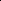

# Revisiting the Canonicalization for Fast and Accurate Crystal Tensor Property Prediction

<!-- Page 1 -->

Revisiting the Canonicalization for Fast and Accurate Crystal Tensor Property

Prediction

Haowei Hua1, Jingwen Yang1, Wanyu Lin1*, Zhou Pan2

1The Hong Kong Polytechnic University 2Singapore Management University haowei.hua@connect.polyu.hk, jingwen.yang@connect.polyu.hk, wan-yu.lin@polyu.edu.hk, panzhou@smu.edu.sg

## Abstract

Predicting the tensor properties of crystalline materials is a fundamental task in materials science. Unlike scalar property prediction, which requires invariance, tensor property prediction requires maintaining O(3) group tensor equivariance. Achieving such equivariance typically demands specialized architectural designs, which substantially increase computational cost. Canonicalization, a classical technique for geometry, has recently been explored for efficient learning with symmetry. In this work, we revisit the problem of crystal tensor property prediction through the lens of canonicalization. Specifically, we demonstrate how polar decomposition, a simple yet efficient algebraic method, can serve as a form of canonicalization and be leveraged to ensure equivariant tensor property prediction. Building upon this insight, we propose a general O(3)-equivariant framework for fast and accurate crystal tensor property prediction, referred to as GoeCTP. By utilizing canonicalization, GoeCTP achieves high efficiency without requiring the explicit incorporation of equivariance constraints into the network architecture. Experimental results indicate that GoeCTP achieves the high prediction accuracy and runs up to 13× faster compared to existing state-of-the-art methods, underscoring its effectiveness and efficiency.

## Introduction

The tensor properties of crystalline materials can capture intricate material responses through high-order tensors, with wide-ranging applications in fields such as physics, electronics, and engineering (Yan et al. 2024b). These tensor properties span various orders, such as dielectric tensor with two orders, piezoelectric tensor with three orders, and elastic tensor with four orders. Accurate prediction of these tensor properties is critical for novel materials discovery and design with targeted characteristics. Thus far, several works have been dedicated to crystal tensor property prediction. One prominent category involves ab initio physical simulation techniques, such as density functional theory (DFT) (Petousis et al. 2016). These classical simulation techniques can provide acceptable error margin for predicting various material properties. However, they necessitate extensive computational resources due to the complexity of

*Corresponding author. Copyright © 2026, Association for the Advancement of Artificial Intelligence (www.aaai.org). All rights reserved.

handling large crystals with a vast number of atoms and electrons (Yan et al. 2024b), hindering their applicability in practice.

Alternatively, machine learning (ML) models have been proposed to facilitate the process of crystalline material property prediction. These methods typically leverage highprecision datasets deriving from ab initio simulations and utilize crystal graph construction techniques along with graph neural networks (GNNs) (Chen et al. 2019; Louis et al. 2020; Choudhary and DeCost 2021; Xie and Grossman 2018) or transformers (Yan et al. 2024a; Taniai et al. 2024; Yan et al. 2022; Lee et al. 2024; Wang et al. 2024a; Ito et al. 2025). Most existing methods are designed for scalar property prediction, focusing on achieving SO(3) invariance of the crystal structures. However, these scalar-property methods could not be adapted to predict tensor properties of crystalline materials, which exhibits significantly higher complexity. This complexity arises from the fact that tensor properties describe how crystals respond to external physical fields, such as electric fields or mechanical stress (Nye 1985; Resta 1994; Yan et al. 2024b); their modeling necessitates preserving consistency with the crystal’s spatial orientation, exhibiting a unique tensor O(3) equivariance (Yan et al. 2024b).

Therefore, a few recent studies attempt to ensure equivariance through specialized designs of network architectures (Mao, Li, and Tan 2024; Lou and Ganose 2024; Heilman, Schlesinger, and Yan 2024; Wen et al. 2024; Pakornchote, Ektarawong, and Chotibut 2023; Yan et al. 2024b; Zhong et al. 2023). These methods generally integrate directional features and spherical harmonics to preserve equivariance. However, achieving this often requires computationally expensive operations such as tensor products, which introduce substantial overhead, especially when dealing with high-order tensor data. Therefore, providing fast and accurate predictions of tensor properties across various materials is challenging.

One approach that has show promising results in efficient learning with symmetry across various fields, including point clouds (Lin et al. 2024), n-body simulation (Kaba et al. 2023), and antibodies generation (Martinkus et al. 2023), is the use of “canonicalization”. Specifically, canonicalization maps a geometric data to an invariant representation (Ma et al. 2024; Dym, Lawrence, and Siegel 2024),

The Fortieth AAAI Conference on Artificial Intelligence (AAAI-26)

417

<!-- Page 2 -->

Crystal Tensor Property Crystal Structures

(,,) = M A F L (,,) pred f = A F L

Q

(,,) = M A F QL (,,) T pred f  = Q A F L Q Rotated Structures Rotated Tensor Property

Rotation Rotation Q

() f  M

() fM

**Figure 1.** The illustration of O(3)-equivariance for crystal tensor prediction. The visualization of the crystal structures on the left was generated using VESTA (Momma and Izumi 2011), while the visualization of the crystal tensor properties on the right follows the method of Yan et al. (2024b) and VELAS (Ran et al. 2023).

referred to as the canonical form, and subsequently reconstructs an equivariant output from the canonical form without imposing any architectural constraints on the backbone network. However, to date, it has not been explored for crystal tensor property prediction.

In this work, we revisit the task of crystal tensor property prediction through the lens of canonicalization and introduce a novel canonicalization strategy tailored for this particular setting. Specifically, rather than embedding equivariance directly into model architecture, we propose a simple yet effective canonicalization module, termed R&R. In particular, our canonicalization is instantiated based on polar decomposition, a continuous mapping technique (Dym, Lawrence, and Siegel 2024) that can provide enhanced robustness. During prediction, the R&R module applies rotations and reflections to transform the input crystal structure into its canonical form. The canonical form is then fed into a property prediction network to obtain the corresponding canonical tensor representation. Simultaneously, the orthogonal matrix derived from the R&R module is utilized to recover the equivariant output via the tensor transformation rule, enabling equivariant tensor property prediction without incurring additional computational overhead. We conducted experiments on dielectric, piezoelectric, and elastic tensor datasets, respectively, showcasing that the proposed method can achieve O(3)-equivariant tensor prediction while maintaining high efficiency. Compared to the previous state-of-the-art work Yan et al. (2024b), the GoeCTP method achieves high prediction accuracy and runs by up to 13× faster.

## Background

## Preliminaries

Crystalline materials consist of a periodic arrangement of atoms in 3D space, characterized by a repeating unit known as the unit cell. A complete crystal can thus be described by the atomic types, atomic coordinates, and lattice parameters of a single unit cell (Yan et al. 2022; Wang et al. 2024b; Jiao et al. 2024; Huang et al. 2025; Hua and Lin 2025). Mathematically, a crystal can be represented as M = (A, X, L), where A = [a1,..., an]⊤∈Rn×da denotes the atomic features of n atoms, X = [x1,..., xn]⊤∈Rn×3 contains their Cartesian coordinates, and L = [l1, l2, l3] ∈R3×3 is the lattice matrix composed of three basis vectors. The entire crystal can then be expressed as (ˆA, ˆX) = {(ˆai, ˆxi)|ˆxi = xi +k1l1 +k2l2 +k3l3, ˆai = ai, k1, k2, k3 ∈Z, i ∈Z, 1 ≤ i ≤n}, which enumerates all atomic positions generated by lattice translations.

Alternatively, using the lattice matrix L as the basis vectors leads to the fractional coordinate representation, where each atom is assigned a fractional coordinate fi = [fi,1, fi,2, fi,3]⊤∈[0, 1)3 and its Cartesian coordinate is given by xi = P j fi,jlj. Accordingly, the crystal can also be represented as M = (A, F, L), where F = [f 1, · · ·, f n]⊤∈[0, 1)n×3 denotes the fractional coordinates of all atoms in the unit cell.

Problem statement Crystal Tensor Prediction. The crystal tensor properties prediction is a classic regression task. Its goal is to estimate the high-order tensor property denoted as Y from the raw crystal data represented as M = (A, F, L). Given that the crystal data M resides within the input space V, and the tensor property Y belongs to the separate output space W, the objective of crystal tensor prediction is to find a function fθ: V →W that accurately maps input crystal data to the desired tensor property. This is achieved by minimizing the discrepancy between the true property Y and the predicted property value Ypred. Therefore, the crystal tensor property prediction task can be mathematically formulated as the following optimization problem:

min θ

N X n=1

||Y(n)

pred −Y(n)||2, Ypred = fθ(A, F, L), (1)

418

AI-readable visual equivalent, added: Figure extracted from the paper PDF and converted to an SVG wrapper asset. Use the surrounding page text and caption for interpretation.

AI-readable visual equivalent, added: Figure extracted from the paper PDF and converted to an SVG wrapper asset. Use the surrounding page text and caption for interpretation.

AI-readable visual equivalent, added: Figure extracted from the paper PDF and converted to an SVG wrapper asset. Use the surrounding page text and caption for interpretation.

AI-readable visual equivalent, added: Figure extracted from the paper PDF and converted to an SVG wrapper asset. Use the surrounding page text and caption for interpretation.

AI-readable visual equivalent, added: Figure extracted from the paper PDF and converted to an SVG wrapper asset. Use the surrounding page text and caption for interpretation.

AI-readable visual equivalent, added: Figure extracted from the paper PDF and converted to an SVG wrapper asset. Use the surrounding page text and caption for interpretation.

AI-readable visual equivalent, added: Figure extracted from the paper PDF and converted to an SVG wrapper asset. Use the surrounding page text and caption for interpretation.

AI-readable visual equivalent, added: Figure extracted from the paper PDF and converted to an SVG wrapper asset. Use the surrounding page text and caption for interpretation.

AI-readable visual equivalent, added: Figure extracted from the paper PDF and converted to an SVG wrapper asset. Use the surrounding page text and caption for interpretation.

AI-readable visual equivalent, added: Figure extracted from the paper PDF and converted to an SVG wrapper asset. Use the surrounding page text and caption for interpretation.

AI-readable visual equivalent, added: Figure extracted from the paper PDF and converted to an SVG wrapper asset. Use the surrounding page text and caption for interpretation.

AI-readable visual equivalent, added: Figure extracted from the paper PDF and converted to an SVG wrapper asset. Use the surrounding page text and caption for interpretation.

AI-readable visual equivalent, added: Figure extracted from the paper PDF and converted to an SVG wrapper asset. Use the surrounding page text and caption for interpretation.

AI-readable visual equivalent, added: Figure extracted from the paper PDF and converted to an SVG wrapper asset. Use the surrounding page text and caption for interpretation.

<!-- Page 3 -->

(1) R&R module

(5) Reverse

R&R module

(2) Crystal graph construction

(3) Node & edge feature embeddings

Node-wise transformer

Node-wise equivariant update

Node-wise transformer

Reverse

R&R module orthogonal matrix Q orthogonal matrix Q

Tensor property canonical form

Equivariant crystal tensor property

Crystal graph preprocessing (4) Prediction module (eComFormer here)

orthogonal matrix Q orthogonal matrix Q

Output Output Input Input

R&R module

Crystal with arbitrary orientations

Crystal canonical form orthogonal matrix Q orthogonal matrix Q

**Figure 2.** The Illustration of GoeCTP. To begin with, (1) the R&R module rotates and reflects the input crystal structure, which may have an arbitrary orientation, to the canonical form of this crystal. Next, (2) Crystal Graph Construction module organizes the adjusted input into a crystal graph, followed by (3) the Node & Edge Feature Embedding module, which encodes the features of the crystal graph. Subsequently, (4) the Prediction module leverages these embedded features to predict the canonical form of tensor properties corresponding to the canonical form of input crystal. Finally, (5) the Reverse R&R module applies the orthogonal matrix Q, obtained from the R&R module, to ensure the equivariance of the output tensor properties.

where fθ(·) represents a tensor prediction model with learnable parameters θ, and the superscript n denotes individual samples in the dataset. In what follows, we will omit superscript n for simplicity. As previously proposed in the literature (Mao, Li, and Tan 2024; Wen et al. 2024; Yan et al. 2024b), our objective is to estimate high-order tensor properties, including 2-order dielectric tensor (i.e., Y

∆= ε ∈ R3×3), 3-order piezoelectric tensor (i.e., Y

∆= e ∈R3×3×3), and 4-order elastic tensor (i.e., Y

∆= C ∈R3×3×3×3), respectively.

O(3) group. The O(3) group is an orthogonal group, consisting of rotations and reflections. The elements g ∈O(3) act on vectors or tensors in V, W through their respective group representations, ρV: O(3) →GL(V) and ρW: O(3) →GL(W), where GL(V) and GL(W) are the space of invertible linear maps V →V and W →W, respectively. Specifically, the action of an element g ∈O(3) on crystal data M is defined as: g · M = ρV(g)M = (A, F, QL). For dielectric tensor property Y, the action of g is given by: g · Y = ρW(g)Y = QYQ⊤, where Q is a 3 × 3 orthogonal matrix (for additional details regarding the transformation of tensor properties, please refer to Appendix A.4).

O(3)-Equivariance for Crystal Tensor Prediction. In the crystal tensor properties prediction task, due to the difference between ρV(g) and ρW(g), the requirements for O(3) equivariance typically differ from the O(3)-equivariance defined in the general molecular studies (Hoogeboom et al. 2022; Xu et al. 2024; Zheng et al. 2024; Song et al. 2024; Aykent and Xia 2025; Cen et al. 2024). Specifically, taking the dielectric tensor as an example where Ylabel

∆= ε ∈ R3×3, for a tensor prediction model fθ(·) in Eq.1, if it is O(3) equivariant, it must satisfy the following equality formulated as:

fθ(A, F, QL) = Qfθ(A, F, L)Q⊤, (2)

where Q ∈ R3×3 is an arbitrary orthogonal matrix (Yan et al. 2024b). For clarity, an illustration of O(3)equivariance for crystal tensor prediction is shown in Fig.1 (for more equivariance details, see Appendix A.4).

## Methodology

In this section, we will first provide the motivation driving our new framework. We then reformulate the O(3) equivariant tensor prediction task from the perspective of canonicalization. Building upon this foundational perspective, we demonstrate how polar decomposition can be employed as a canonicalization strategy and effectively applied to solve tensor prediction tasks with both effectiveness and efficiency.

The Motivation of Our Framework

To enforce O(3) equivariance as defined in Eq. 2, existing crystal tensor prediction approaches typically rely on irreducible representations and Clebsch-Gordan (CG) tensor products. Although these formulations are theoretically rigorous and have shown strong empirical performance, they introduce substantial computational overhead due to the complexity of tensor operations.

Recently, several studies have explored the scalarization trick to exploit high-degree steerable features, thereby eliminating the need for CG tensor products while maintaining both accuracy and efficiency (Aykent and Xia 2025; Cen et al. 2024; Han et al. 2025). Similarly, if O(3) tensor equivariance could be achieved for high-order tensor predictions without relying on tensor product operations, the computational cost could be significantly reduced. Motivated by recent progress in canonicalization-based symmetric learning, we propose a principled framework that leverages canonicalization to realize O(3)-equivariant tensor prediction for crystalline materials.

419

AI-readable visual equivalent, added: Figure extracted from the paper PDF and converted to an SVG wrapper asset. Use the surrounding page text and caption for interpretation.

AI-readable visual equivalent, added: Figure extracted from the paper PDF and converted to an SVG wrapper asset. Use the surrounding page text and caption for interpretation.

AI-readable visual equivalent, added: Figure extracted from the paper PDF and converted to an SVG wrapper asset. Use the surrounding page text and caption for interpretation.

AI-readable visual equivalent, added: Figure extracted from the paper PDF and converted to an SVG wrapper asset. Use the surrounding page text and caption for interpretation.

AI-readable visual equivalent, added: Figure extracted from the paper PDF and converted to an SVG wrapper asset. Use the surrounding page text and caption for interpretation.

AI-readable visual equivalent, added: Figure extracted from the paper PDF and converted to an SVG wrapper asset. Use the surrounding page text and caption for interpretation.

<!-- Page 4 -->

O(3) Equivariant Tensor Prediction from the Perspective of Canonicalization To mathematically describe O(3)-equivariant tensor prediction from the perspective of canonicalization, we first introduce and extend several fundamental concepts derived from canonicalization techniques (Ma et al. 2024; Kaba et al. 2023; Dym, Lawrence, and Siegel 2024).

Definition 1 (Orbit.). The orbit of a crystal M is defined as Orbit(M) = {g · M | g ∈O(3)}.

In the context of crystal tensor prediction, all configurations of a crystal (i.e. a crystal wirh different orientations) in the space fall into the same orbit under the O(3) group transformation. Specifically, for any two crystal configurations denoted as M1 and M2 within the same orbit, there exists a rotation or reflection g ∈O(3) such that M1 = g·M2. Likewise, the tensor properties of the crystal also exhibit an orbit, i.e. Orbit(Y) = {g · Y | g ∈O(3)}. All configurations of a crystal within an orbit could be transformed into one another through group transformations. Consequently, we can select a specific configuration from the orbit to serve as a canonical representative (referred to as the canonical form) that effectively characterizes the entire orbit. The formal process is outlined in the following definition.

Definition 2. (Orbit Canonicalization1) A function CM: V →V is defined as an orbit canonicalization if there exists a canonical form M0 ∈Orbit(M) such that CM(M1) = M0 for all M1 ∈Orbit(M).

Orbit canonicalization enables the transformation of a crystal with arbitrary orientations in the space into one with a specific, well-defined orientation. Since the output of orbit canonicalization can always be mapped to the invariant canonical form, it follows that CM(·) itself is O(3)invariant. Therefore, for any prediction function fθ(·), it holds that fθ(CM(·)) remains O(3)-invariant (See the proof in Appendix A.3).

Although an O(3)-invariant prediction function has been established via orbit canonicalization, the complete process of equivariant prediction requires specific group transformations that map all crystal configurations within the orbit to their canonical form. To address this requirement, we introduce the concept of rigid registration. Rigid registration is a fundamental concept in fields such as computer vision and computational geometry (Tam et al. 2012). It aims to find a transformation that matches the position and orientation of one object with the corresponding position and orientation of another object. This concept can be naturally adapted to the crystal, as follows.

Definition 3. (Rigid Registration.) A function RM: V × V →O(3) is a rigid registration if ∀M1, M2 ∈ Orbit(M), RM(M1, M2) = g, such that M1 = g · M2.

Using Definition 3, we can identify a transformation that matches two configurations of a crystal. Specifically, this allows us to find specific group transformations that map

1For simplicity, we refer to the procedure as canonicalization, though it may more precisely be regarded as a quasicanonicalization that relaxes permutation invariance.

all crystal configurations within the orbit to their canonical form. By leveraging Definition 2 and Definition 3 together, we derive a view for performing O(3)-equivariant tensor prediction through canonicalization, as described below.

Proposition 1. (O(3)-Equivariant Tensor Prediction from the Perspective of Canonicalization.) Given an arbitrary tensor prediction function f(M): V →W, we define a new function h(M) = RM(M, CM(M))·f(CM(M)), such that h(M) is O(3)-equivariant for tensor prediction.

The proof of Proposition 1 is provided in Appendix A.3. Specifically, in this unified view of O(3) equivariant tensor prediction, we leverage rigid registration, as defined in Definition 3, to find specific group transformations that map crystal configurations within the orbit to their canonical form. This canonical form is determined through orbit canonicalization, as described in Definition 2. Subsequently, we can directly apply these transformations to the network’s output, thereby effectively achieving the O(3) equivariance. Under this perspective, our framework introduces no architectural constraints or special design requirements on the backbone network itself, since the O(3) transformations of the crystal are externally determined through canonicalization and applied directly to the outputs. Building upon Proposition 1, the key challenge in achieving O(3)equivariant tensor prediction lies in identifying the appropriate orbit canonicalization and rigid registration functions.

Our Proposed Framework: GoeCTP In what follows, we demonstrate that polar decomposition can effectively serve as both orbit canonicalization and rigid registration functions for crystal tensor prediction. Building on this foundation, we will first introduce the core rotation and reflection (R&R) module of the proposed GoeCTP, which is to obtain the canonical form for a crystal with arbitrary spatial orientations using polar decomposition. Then, we will describe how the input crystal data is processed and introduce the property prediction network of GoeCTP. Finally, we will explain how proposed GoeCTP achieves equivariant tensor predictions. An overview of the GoeCTP framework is illustrated in Fig.2.

Theorem 1. (Polar Decomposition (Hall and Hall 2013; Higham 1986; Jiao et al. 2024).) An invertible matrix L ∈ R3×3 can be uniquely decomposed into L = QH, where Q ∈R3×3 is an orthogonal matrix, H ∈R3×3 is a symmetric positive semi-definite matrix.

In the fractional coordinate system, the O(3) group transformations applied to a crystal affect only the lattice matrix L, while fractional coordinates remain invariant, making it convenient for rotating the crystal configuration to the canonical form. Therefore, throughout this work, we adopt the fractional coordinate system to represent the crystal represented as M = (A, F, L). Then building on Theorem 1, we can define both orbit canonicalization and rigid registration functions for crystal tensor prediction as follows.

Proposition 2. (Orbit Canonicalization and Rigid Registration for Crystal Tensor Prediction.) By performing polar

420

<!-- Page 5 -->

decomposition on the lattice matrix L = QH of a crystal M, we can define functions fp1(M) = (A, F, H) and fp2(M, fp1(M)) = Q, where fp1(·) and fp2(·) correspond to performing polar decomposition on the lattice matrix. In this perspective, fp1(·) serves as the orbit canonicalization function, while fp2(·) serves as the rigid registration function. The crystal configuration M0 = (A, F, H) is thus identified as the canonical form.

The detailed proof of Proposition 2 is provided in Appendix A.3. Specifically, since the polar decomposition of a lattice matrix always exists and it is unique, any orthogonal matrix acting on the lattice matrix can be separated through polar decomposition, yielding a unique H. Thus, H can serve as the canonical form. Moreover, using polar decomposition is a continuous canonicalization, which can provide improved robustness (Dym, Lawrence, and Siegel 2024). For clarity, we provide details on this continuity in Appendix A.9, and further discussions on constructing alternative canonical forms based on polar decomposition in Appendix A.10, respectively. Building upon Proposition 2, we utilize polar decomposition to construct the proposed GoeCTP model.

R&R Module. The primary function of the R&R Module is to rotate the crystal configuration to its canonical form and obtain the corresponding transformation. Therefore, based on Proposition 2, the R&R Module directly applies polar decomposition to the lattice matrix L to construct the rigid registration and the orbit canonicalization. Formally, the R&R Module can be expressed as:

fp1(M) = (A, F, H), fp2(M, fp1(M)) = Q, (3)

where fp1(·) is the orbit canonicalization function, while fp2(·) is the rigid registration function. As shown in Fig. 2, the crystal configuration (A, F, H) derived from orbit canonicalization is passed to the subsequent crystal graph construction module for further processing. The orthogonal matrix Q obtained during this decomposition is passed to the reverse R&R module, ensuring the equivariant transformation of the output tensor properties. Our proposed R&R module based on polar decomposition allows the input crystal data to be transformed into the canonical form that is invariant under O(3) space group transformations. With this particular module, the equivariance can be captured, meaning that the subsequent components of GoeCTP are no longer required to account for equivariance.

Crystal Graph Preprocessing. To enable neural networks to effectively process infinite crystal structures (A, F, H), it is necessary to employ crystal graph construction and node and edge feature embedding techniques that represent atomic interactions within a finite graph representation. In this work, we adopt the crystal graph construction approach introduced by Yan et al. (2024a,b), where atoms are represented as nodes and interatomic interactions as edges. The node and edge features are subsequently embedded into vector representations f i and f e ij to capture atomic and geometric information. A detailed description of the crystal graph construction procedure and the feature embedding scheme is provided in Appendix A.2.

Prediction Module. Since the R&R module is responsible for preserving equivariance, any predictive network can serve as the Prediction module, such as those proposed by Yan et al. (2024a); Taniai et al. (2024); Yan et al. (2022); Lee et al. (2024); Wang et al. (2024a); Ito et al. (2025), among others. In this work, we select eComFormer (Yan et al. 2024a) as the Prediction module to illustrate the overall workflow of our proposed method. A detailed explanation of eComFormer can be found in Appendix A.2. Once processed through the stacked layers of eComFormer, the node features are aggregated to generate the crystal’s global features as follows: Gfinal = 1 n

P

1≤i≤n f final i.

Reverse R&R Module. The primary function of the Reverse R&R module is to generate the equivariant tensor property predictions based on the crystal global features from the Prediction module. First, the Reverse R&R module transforms Gfinal into a tensor output, as follows:

ε = fMLP (Gfinal) (4)

εfinal = frp(ε, Q), (5) where fMLP (·) represents a multilayer perceptron (MLP) and the operation reshaping dimension. Next, frp(·) utilizes the orthogonal matrix Q obtained from the R&R Module to convert the tensor output ε into its final equivariant form denoted as εfinal. This conversion frp(·) for predicting the dielectric tensor can be expressed by:

εfinal = QεQ⊤. (6)

For predicting the higher-order piezoelectric and elastic tensor, the conversion process becomes more complex, see Appendix A.4 for more details.

## Experiments

Experimental setup Datasets. In this work, we evaluate the performance of GoeCTP on three key tensor property prediction tasks: the second-order dielectric tensor, the third-order piezoelectric tensor, and the fourth-order elastic tensor, respectively. The datasets for dielectric tensor and piezoelectric tensor prediction are derived from the data curated by Yan et al. (2024b), which originates from the JARVIS-DFT database. Since nearly half of the crystal samples in the piezoelectric dataset have piezoelectric tensor labels that are entirely zero, training GoeCTP directly on this dataset can lead to severe overfitting. Therefore, we filtered out all crystal samples with zero-valued piezoelectric tensor labels from piezoelectric dataset. For the elastic tensor prediction task, the dataset is also obtained from the JARVIS-DFT database and is publicly accessible as dft 3d through the jarvis-tools

Dataset Sample size Fnorm Mean Fnorm STD Unit

Dielectric 14.7 18.2 Unitless Piezoelectric 0.79 4.03 C/m2 Elastic 25110 306.4 238.4 GPa

**Table 1.** Dataset statistics.

421

<!-- Page 6 -->

package 2. The statistical details of the datasets are presented in Table 1. Further details of the dataset and experimental setup can be found in Appendix A.6.

Baseline Methods. We selected several state-of-the-art approaches in the field of crystal tensor property prediction, including EGTNN (Zhong et al. 2023) and GMTNet (Yan et al. 2024b), as baseline methods. Moreover, since GoeCTP is designed as a flexible framework, we further evaluated its performance when combined with different backbone models. In addition to the eComFormer (Yan et al. 2024a) used in Figure 2, we also incorporated the recently proposed CrystalFramer (Ito et al. 2025).

## Evaluation

Metrics. We followed the evaluation metrics defined by Yan et al. (2024b) to assess the performance of the methods. The following metrics were employed: (1) Frobenius norm (Fnorm) is used to measure the difference between the predicted tensor and the label tensor, which is the square root of the sum of the squares of all elements in a tensor. (2) Error within threshold (EwT) is determined by the ratio of the Fnorm between the predicted tensor and the ground truth tensor to the Fnorm of the ground truth tensor. This ratio can be expressed as ||ypred −ylabel||F /||ylabel||F, where || · ||F is Fnorm, and ylabel and ypred represent the ground truth and predicted values, respectively. For instance, EwT 25% indicates that the proportion of predicted samples with this ratio is below 25%. Higher values of EwT signify better prediction quality. In our experiments, we utilized several thresholds for EwT: EwT 25%, EwT 10%, and EwT 5%.

Experimental Results Predicting Dielectric Tensors. The performance of various models in predicting the dielectric tensor is summarized in Table 2. Since GoeCTP (C. Fra.) employs a more advanced backbone, its performance is notably superior to that of GoeCTP (C. eCom.). Both GoeCTP (eCom.) and GoeCTP (C. Fra.) outperform the baseline methods, demonstrating the effectiveness of the proposed GoeCTP framework. Comprehensive results combining GoeCTP with additional backbone architectures are provided in Appendix A.7. In addition to these experimental results, we further investigate the impact of different canonical forms on tensor property prediction in crystalline materials. Detailed analyses can be found in Appendix A.11.

ETGNN GMTNet GoeCTP (eCom.) GoeCTP (C. Fra.)

Fnorm ↓ 3.40 3.28 3.23 3.05 EwT 25% ↑ 82.6% 83.3% 83.2% 86.4% EwT 10% ↑ 49.1% 56.0% 56.8% 62.6% EwT 5% ↑ 25.3% 30.5% 35.5% 43.5%

**Table 2.** Comparison on the dielectric dataset. Lower Fnorm and higher EwT indicate better performance. GoeCTP (eCom.) denotes GoeCTP using eComFormer as the backbone, while GoeCTP (C. Fra.) refers to GoeCTP with CrystalFramer as the backbone.

2https://pages.nist.gov/jarvis/databases/

Predicting Piezoelectric Tensors. The experimental results for the piezoelectric tensor dataset are shown in Table 3. Compared to the results on the dielectric dataset, predicting the piezoelectric tensor presents a greater challenge. As shown in Table 1, the overall mean Fnorm of the piezoelectric tensor is relatively small, which leads to lower overall EwT values. Consequently, achieving higher EwT requires more accurate predictions from the model. GoeCTP (C. Fra.) achieves relatively high EwT at both 5% and 10%, indicating that it attains high prediction accuracy for a subset of samples. Meanwhile, GMTNet and GoeCTP (eCom.) obtain better Fnorm results, suggesting that their overall prediction errors are comparatively smaller.

ETGNN GMTNet GoeCTP (eCom.) GoeCTP (C. Fra.)

Fnorm ↓ 0.873 0.752 0.778 0.827 EwT 25% ↑ 0% 6.29% 2.59% 3.33% EwT 10% ↑ 0% 1.48% 1.14% 2.59% EwT 5% ↑ 0% 1.11% 0.04% 2.22%

**Table 3.** Comparison on the piezoelectric dataset.

Predicting Elastic Tensors. Experimental results on the elastic tensor dataset are summarized in Table 4. Consistent with the observations on the dielectric dataset, both GoeCTP (eCom.) and GoeCTP (C. Fra.) achieved outstanding performance in predicting higher-order, complex tensors, surpassing all baseline methods across all evaluation metrics. Notably, GoeCTP (C. Fra.) delivered a further improvement over GoeCTP (eCom.). Additional results demonstrating GoeCTP combined with other backbone models are provided in Appendix A.7.

ETGNN GMTNet GoeCTP (eCom.) GoeCTP (C. Fra.)

Fnorm ↓ 123.64 117.62 107.11 95.98 EwT 25% ↑ 32.0% 36.0% 42.5% 49.7% EwT 10% ↑ 3.8% 7.6% 15.3% 20.3% EwT 5% ↑ 0.5% 2.0% 7.2% 9.8%

**Table 4.** Comparison on the elastic dataset.

Verifying the O(3) Equivariance. To evaluate the effectiveness of GoeCTP, we conducted experiments to verify the O(3) equivariance of tensor properties. Specifically, after training GoeCTP (eCom.), we extracted its Prediction module (i.e., eComFormer) for comparative testing on two different test sets (original test set and augmented test set). All crystals in the original test set were adjusted to the canonical form, while the augmented test set was generated by applying arbitrary O(3) group transformations to all crystals in the original test set. The method for generating the corresponding orthogonal matrices is from Heiberger (1978). We then evaluated both the Prediction module (eComFormer) and GoeCTP (eCom.) on these two datasets and compared the performance metrics.

The results on the three tensor datasets are shown in Table 5, GoeCTP performed equally well on the augmented test set as on the original test set in all tensor datasets, indicating that

422

<!-- Page 7 -->

eCom. (ori.) eCom. (aug.) GoeCTP (ori.) GoeCTP (aug.)

Dielectric: Fnorm ↓ 3.23 4.71 3.23 3.23 Dielectric: Test Time (s) ↓ 26.03 26.01 26.23 26.18

Piezoelectric: Fnorm ↓ 0.778 0.957 0.778 0.778 Piezoelectric: Test Time (s) ↓ 5.21 5.40 5.53 6.05

Elastic: Fnorm ↓ 107.11 138.45 107.11 107.11 Elastic: Test Time (s) ↓ 83.26 83.02 90.10 89.60

**Table 5.** Ablation study for verifying the O(3)-equivariance using dielectric, piezoelectric, and elastic datasets. After training GoeCTP (eCom.), we extracted its prediction module (i.e., eComFormer) for comparative testing on two different test sets.

it maintains strong O(3) equivariance for tensor properties. In contrast, the performance of the eComFormer method significantly declined on the augmented test set, demonstrating that it does not meet the O(3) equivariance requirements for tensor properties. Additionally, runtime comparisons between GoeCTP and eComFormer on the test set revealed that GoeCTP did not result in a significant increase in runtime. This demonstrates that when integrated into scalar property prediction networks, GoeCTP incurs almost no additional computational cost, enhancing its practicality while maintaining efficiency.

Dielectric: ETGNN GMTNet GoeCTP (eCom.) GoeCTP (C. Fra.)

Total Time (s) ↓ 616 Time/epoch (s) ↓ 6.625 8.055 3.08 9.88

Piezoelectric: ETGNN GMTNet GoeCTP (eCom.) GoeCTP (C. Fra.)

Total Time (s) ↓ 736 356 Time/epoch (s) ↓ 2.18 35.06 1.78 5.77

Elastic: ETGNN GMTNet GoeCTP (eCom.) GoeCTP (C. Fra.)

Total Time (s) ↓ > 36000 17197 Time/epoch (s) ↓ 22.24 > 180 12.11 34.394

**Table 6.** Efficiency comparison.

Efficiency. Table 6 summarizes the training efficiency of GoeCTP and baseline methods. On the dielectric, piezoelectric, and elastic datasets, GoeCTP (eCom.) required only 38.2%, 5%, and 7% of GMTNet’s training time, respectively. Although GoeCTP (C. Fra.) achieved higher accuracy at the cost of longer training, it still maintained a efficiency advantage over GMTNet, particularly on high-order tensor datasets such as the elastic dataset.

To achieve O(3) equivariance for tensor properties, GMT- Net employs a network architecture based on irreducible representations and tensor operations. Moreover, its final tensor output is obtained through gradient computation, which may significantly reduce computational efficiency. This inefficiency becomes particularly pronounced when computing gradients for high-order tensors such as elastic tensors. Beyond training costs, the gradient computation also may lead to slower inference. For instance, in the elastic tensor task, GMTNet requires more than 0.478 seconds per material, whereas GoeCTP (eCom.) requires only 0.036 seconds per material. In contrast, GoeCTP achieves equivariant tensor predictions without any specialized architectural constraints. It utilizes a simple multilayer perceptron (MLP) at the network output to predict tensor properties of various orders, ensuring high efficiency and scalability across different tensor orders.

## Conclusion

In this work, we revisit crystal tensor property prediction through the lens of canonicalization. Built upon the notion of canonicalization, we proposed a novel O(3)-equivariant framework GoeCTP for fast and accurate crystal tensor prediction. Benefiting from the canonicalization mechanism, GoeCTP serves as a plug-and-play module that can be integrated with any existing scalar property prediction network, enabling it to predict tensor properties with negligible additional computational cost.

Except for the excel performance, our current GoeCTP has some limitations remain: 1. GoeCTP is a plug-and-play O(3)-equivariant framework designed to enhance the backbone network’s capability for equivariant prediction. Consequently, its overall performance inherently depends on the strength of the chosen backbone. For example, GoeCTP (eCom.) demonstrates higher efficiency, while GoeCTP (C. Fra.) achieves greater predictive accuracy. Striking an optimal balance between efficiency and accuracy remains a topic for further investigation. 2. As demonstrated in Higham (1986) and Theorem 1, polar decomposition applied to an invertible matrix L produces a unique canonical form H. For 3D crystal structures, the lattice matrix L is always full rank (i.e., invertible), ensuring the applicability of our approach to 3D crystal systems. However, in special cases such as 2D single-layer crystals (Novoselov et al. 2005; Sherrell et al. 2022), the lattice matrix L may be rank-deficient. In these scenarios, polar decomposition may fail to yield a unique canonical form H, making it impossible to consistently align crystals with different spatial orientations to a common canonical form, thereby hindering O(3)-equivariance. 3. The current framework underutilizes prior knowledge related to space group constraints and does not yet ensure that predicted tensor results strictly adhere to space group symmetry constraints. In future work, we plan to improve model performance by integrating priors concerning the independent tensor components across different crystal systems (see Appendix A.5). Further discussion on incorporating space group symmetry constraints into tensor property prediction is provided in Appendix A.8.

423

<!-- Page 8 -->

## Acknowledgments

This work was partially supported by the Research Grants Counil (RGC) of the Hong Kong (HK) SAR (Grant No. 15208725 and 15208222), the Young Scientists Fund of National Natural Science Foundation of China (NSFC) (Grant No. 62206235), and the Hong Kong Polytechnic University (Grant No. A0046682 and P0057774).

## References

Aykent, S.; and Xia, T. 2025. Gotennet: Rethinking efficient 3d equivariant graph neural networks. In The Thirteenth International Conference on Learning Representations. Cen, J.; Li, A.; Lin, N.; Ren, Y.; Wang, Z.; and Huang, W. 2024. Are high-degree representations really unnecessary in equivariant graph neural networks? Advances in Neural Information Processing Systems, 37: 26238–26266. Chen, C.; Ye, W.; Zuo, Y.; Zheng, C.; and Ong, S. P. 2019. Graph networks as a universal machine learning framework for molecules and crystals. Chemistry of Materials, 31(9): 3564–3572. Choudhary, K.; and DeCost, B. 2021. Atomistic line graph neural network for improved materials property predictions. npj Computational Materials, 7(1): 185. Dym, N.; Lawrence, H.; and Siegel, J. W. 2024. Equivariant frames and the impossibility of continuous canonicalization. In Forty-first International Conference on Machine Learning. Hall, B. C.; and Hall, B. C. 2013. Lie groups, Lie algebras, and representations. Springer. Han, J.; Cen, J.; Wu, L.; Li, Z.; Kong, X.; Jiao, R.; Yu, Z.; Xu, T.; Wu, F.; Wang, Z.; et al. 2025. A survey of geometric graph neural networks: Data structures, models and applications. Frontiers of Computer Science, 19(11): 1911375. Heiberger, R. M. 1978. Algorithm AS 127: Generation of random orthogonal matrices. Applied Statistics, 199–206. Heilman, A.; Schlesinger, C.; and Yan, Q. 2024. Equivariant graph neural networks for prediction of tensor material properties of crystals. arXiv preprint arXiv:2406.03563. Higham, N. J. 1986. Computing the polar decomposition—with applications. SIAM Journal on Scientific and Statistical Computing, 7(4): 1160–1174. Hoogeboom, E.; Satorras, V. G.; Vignac, C.; and Welling, M. 2022. Equivariant diffusion for molecule generation in 3d. In International conference on machine learning, 8867– 8887. PMLR. Hua, H.; and Lin, W. 2025. Local-global associative frames for symmetry-preserving crystal structure modeling. In The Thirty-ninth Annual Conference on Neural Information Processing Systems. Huang, J.; Xing, Q.; Ji, J.; and Yang, B. 2025. Code- Generated graph representations using multiple LLM agents for material properties Prediction. In Forty-second International Conference on Machine Learning. Ito, Y.; Taniai, T.; Igarashi, R.; Ushiku, Y.; and Ono, K. 2025. Rethinking the role of frames for SE (3)-invariant crystal structure modeling. In The Thirteenth International Conference on Learning Representations. Jiao, R.; Huang, W.; Liu, Y.; Zhao, D.; and Liu, Y. 2024. Space group constrained crystal generation. In The Twelfth International Conference on Learning Representations. Kaba, S.-O.; Mondal, A. K.; Zhang, Y.; Bengio, Y.; and Ravanbakhsh, S. 2023. Equivariance with learned canonicalization functions. In International Conference on Machine Learning, 15546–15566. PMLR. Lee, N.; Noh, H.; Kim, S.; Hyun, D.; Na, G. S.; and Park, C. 2024. Density of states prediction of crystalline materials via prompt-guided multi-modal transformer. Advances in Neural Information Processing Systems, 36. Lin, Y.; Helwig, J.; Gui, S.; and Ji, S. 2024. Equivariance via minimal frame averaging for more symmetries and efficiency. In Forty-first International Conference on Machine Learning. Lou, Y.; and Ganose, A. M. 2024. Discovery of highly anisotropic dielectric crystals with equivariant graph neural networks. arXiv preprint arXiv:2405.07915. Louis, S.-Y.; Zhao, Y.; Nasiri, A.; Wang, X.; Song, Y.; Liu, F.; and Hu, J. 2020. Graph convolutional neural networks with global attention for improved materials property prediction. Physical Chemistry Chemical Physics, 22(32): 18141–18148. Ma, G.; Wang, Y.; Lim, D.; Jegelka, S.; and Wang, Y. 2024. A canonicalization perspective on invariant and equivariant learning. In The Thirty-eighth Annual Conference on Neural Information Processing Systems. Mao, Z.; Li, W.; and Tan, J. 2024. Dielectric tensor prediction for inorganic materials using latent information from preferred potential. npj Computational Materials, 10(1): 265. Martinkus, K.; Ludwiczak, J.; Liang, W.-C.; Lafrance- Vanasse, J.; Hotzel, I.; Rajpal, A.; Wu, Y.; Cho, K.; Bonneau, R.; Gligorijevic, V.; et al. 2023. Abdiffuser: full-atom generation of in-vitro functioning antibodies. Advances in Neural Information Processing Systems, 36: 40729–40759. Momma, K.; and Izumi, F. 2011. VESTA 3 for threedimensional visualization of crystal, volumetric and morphology data. Journal of applied crystallography, 44(6): 1272–1276. Novoselov, K. S.; Jiang, D.; Schedin, F.; Booth, T.; Khotkevich, V.; Morozov, S.; and Geim, A. K. 2005. Twodimensional atomic crystals. Proceedings of the National Academy of Sciences, 102(30): 10451–10453. Nye, J. F. 1985. Physical properties of crystals: their representation by tensors and matrices. Oxford university press. Pakornchote, T.; Ektarawong, A.; and Chotibut, T. 2023. StrainTensorNet: Predicting crystal structure elastic properties using SE (3)-equivariant graph neural networks. Physical Review Research, 5(4): 043198. Petousis, I.; Chen, W.; Hautier, G.; Graf, T.; Schladt, T. D.; Persson, K. A.; and Prinz, F. B. 2016. Benchmarking density functional perturbation theory to enable high-throughput screening of materials for dielectric constant and refractive index. Physical Review B, 93(11): 115151.

424

<!-- Page 9 -->

Ran, Z.; Zou, C.; Wei, Z.; and Wang, H. 2023. VELAS: An open-source toolbox for visualization and analysis of elastic anisotropy. Computer Physics Communications, 283: 108540.

Resta, R. 1994. Macroscopic polarization in crystalline dielectrics: the geometric phase approach. Reviews of modern physics, 66(3): 899.

Sherrell, P. C.; Fronzi, M.; Shepelin, N. A.; Corletto, A.; Winkler, D. A.; Ford, M.; Shapter, J. G.; and Ellis, A. V. 2022. A bright future for engineering piezoelectric 2D crystals. Chemical Society Reviews, 51(2): 650–671.

Song, Y.; Gong, J.; Xu, M.; Cao, Z.; Lan, Y.; Ermon, S.; Zhou, H.; and Ma, W.-Y. 2024. Equivariant flow matching with hybrid probability transport for 3d molecule generation. Advances in Neural Information Processing Systems, 36.

Tam, G. K.; Cheng, Z.-Q.; Lai, Y.-K.; Langbein, F. C.; Liu, Y.; Marshall, D.; Martin, R. R.; Sun, X.-F.; and Rosin, P. L. 2012. Registration of 3D point clouds and meshes: A survey from rigid to nonrigid. IEEE transactions on visualization and computer graphics, 19(7): 1199–1217.

Taniai, T.; Igarashi, R.; Suzuki, Y.; Chiba, N.; Saito, K.; Ushiku, Y.; and Ono, K. 2024. Crystalformer: Infinitely connected attention for periodic structure encoding. In The Twelfth International Conference on Learning Representations.

Wang, Y.; Kong, S.; Gregoire, J. M.; and Gomes, C. P. 2024a. Conformal crystal graph transformer with robust encoding of periodic invariance. In Proceedings of the AAAI Conference on Artificial Intelligence, volume 38, 283–291.

Wang, Z.; Hua, H.; Lin, W.; Yang, M.; and Tan, K. C. 2024b. Crystalline material discovery in the era of artificial intelligence. arXiv preprint arXiv:2408.08044.

Wen, M.; Horton, M. K.; Munro, J. M.; Huck, P.; and Persson, K. A. 2024. An equivariant graph neural network for the elasticity tensors of all seven crystal systems. Digital Discovery, 3(5): 869–882.

Xie, T.; and Grossman, J. C. 2018. Crystal graph convolutional neural networks for an accurate and interpretable prediction of material properties. Physical review letters, 120(14): 145301.

Xu, M.; Han, J.; Lou, A.; Kossaifi, J.; Ramanathan, A.; Azizzadenesheli, K.; Leskovec, J.; Ermon, S.; and Anandkumar, A. 2024. Equivariant graph neural operator for modeling 3D dynamics. In Forty-first International Conference on Machine Learning.

Yan, K.; Fu, C.; Qian, X.; Qian, X.; and Ji, S. 2024a. Complete and efficient graph transformers for crystal material property prediction. In The Twelfth International Conference on Learning Representations.

Yan, K.; Liu, Y.; Lin, Y.; and Ji, S. 2022. Periodic graph transformers for crystal material property prediction. Advances in Neural Information Processing Systems, 35: 15066–15080.

Yan, K.; Saxton, A.; Qian, X.; Qian, X.; and Ji, S. 2024b. A space group symmetry informed network for o (3) equivariant crystal tensor prediction. In Forty-first International Conference on Machine Learning. Zheng, Z.; Liu, Y.; Li, J.; Yao, J.; and Rong, Y. 2024. Relaxing continuous constraints of equivariant graph neural networks for broad physical dynamics learning. In Proceedings of the 30th ACM SIGKDD Conference on Knowledge Discovery and Data Mining, 4548–4558. Zhong, Y.; Yu, H.; Gong, X.; and Xiang, H. 2023. A general tensor prediction framework based on graph neural networks. The Journal of Physical Chemistry Letters, 14(28): 6339–6348.

425
