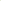
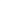

# RFNNS: Robust Fixed Neural Network Steganography with Universal Text-to-Image Models

<!-- Page 1 -->

RFNNS: Robust Fixed Neural Network Steganography with Universal

Text-to-Image Models

Yu Cheng1,2,*, Jiuan Zhou1,*, Jiawei Chen1,3, Zhaoxia Yin1,†, Xinpeng Zhang4*

1East China Normal University, Shanghai, China 2Shanghai Innovation Institute, Shanghai, China 3Zhongguancun Academy, Beijing, China 4Fudan University, Shanghai, China yucheng@sii.edu.cn, 10222140416@stu.ecnu.edu.cn, zxyin@cee.ecnu.edu.cn

## Abstract

With the rapid development of generative AI, image steganography has garnered widespread attention due to its unique concealment. Recent studies have demonstrated the practical advantages of Fixed Neural Network Steganography (FNNS), notably its ability to achieve stable information embedding and extraction without any additional network training. However, the stego images generated by FNNS still exhibit noticeable distortion and limited robustness. These drawbacks compromise the security of the embedded information and restrict the practical applicability of the method. To address these limitations, we propose Robust Fixed Neural Network Steganography (RFNNS). Specifically, a textureaware localization technique selectively embeds perturbations carrying secret information into regions of complex textures, effectively preserving visual quality. Additionally, a robust steganographic perturbation generation (RSPG) strategy is designed to enhance the decoding accuracy, even under common and unknown attacks. These robust perturbations are combined with AI-generated cover images to produce stego images. Experimental results demonstrate that RFNNS significantly improves robustness compared to state-of-theart FNNS methods, achieving an average increase in SSIM of 23% for recovered secret images under common attacks. Furthermore, the LPIPS value of recovered secrets images against previously unknown attacks achieved by RFNNS was reduced to 39% of the SOTA method, underscoring its practical value for covert communication.

Code — https://github.com/edu-yinzhaoxia/RFNNS-

Robust-Fixed-Neural-Network-Steganography-with- Universal-Text-to-Image-Models Appendix — http://arxiv.org/abs/2505.04116

## Introduction

With the rapid development of generative AI, the widespread application of generated content has become increasingly prevalent in daily life, raising significant concerns about data security. Steganography (Lan et al. 2023; Li et al. 2024a; Zhang et al. 2021; Kombrink, Geradts, and Worring 2024;

*Yu Cheng and Jiuan Zhou contributed equally. Corresponding author: Zhaoxia Yin. Copyright © 2026, Association for the Advancement of Artificial Intelligence (www.aaai.org). All rights reserved.

Sender Eavesdropper Receiver

Key

Cover G

Secret Perturbation

Stego

​Lossy Channel

Cover

Recovered Secret Perturbation’FRD

Prompt

Key

Prompt

G: Generative Text-to-Image

Models

FRD: Fixed

Decoding

Network

G

**Figure 1.** The process of sending and extracting in RFNNS.

Meng et al. 2025), a critical information hiding technique (Yang et al. 2023; Xue et al. 2025; Ji et al. 2025), ensures covert communication by embedding secret information in carriers such as images while remaining undetectable to humans and machine eavesdroppers, effectively safeguarding data security.

Traditional steganography employs simple schemes such as least significant bit (LSB) replacement (Van Schyndel, Tirkel, and Osborne 1994). Adaptive steganography selects suitable regions to modify during embedding. Recent advancements in deep neural networks (DNNs) have transformed steganography into a data-driven and learning-based approach (Baluja 2017; Jing et al. 2021; Chen et al. 2022). However, this method faces two significant challenges: (1) it requires substantial data and computational resources to train effective neural networks; (2) the need to transmit trained models between senders and receivers prior to covert communication not only incurs storage overhead but also heightens the risk of detection by eavesdroppers, thereby compromising security.

To avoid training and transmission of steganographic networks, researchers have employed Fixed Neural Networks (FNNs) (Ghamizi et al. 2021; Kishore et al. 2021; Luo et al. 2023; Li et al. 2024b) to embed and extract information. This approach leverages adversarial perturbations to modify the cover image such that the stego image can trigger a fixed-parameter decoding network to output the secret information. Covert communication can be achieved by sharing only the fixed decoding network architecture and the random seed to initialize the weights between the sender and

The Fortieth AAAI Conference on Artificial Intelligence (AAAI-26)

AI-readable visual equivalent, added: Figure extracted from the paper PDF and converted to an SVG wrapper asset. Use the surrounding page text and caption for interpretation.

<!-- Page 2 -->

the receiver. Nevertheless, existing FNNS methods are currently characterized by poor robustness against common image attacks, low stego image quality, and unsatisfactory antisteganalysis performance. These limitations severely restrict the further development of this technology.

In response to the aforementioned challenges, we propose an RFNNS method. Unlike previous FNNS methods (Ghamizi et al. 2021; Kishore et al. 2021; Luo et al. 2023; Li et al. 2024b), the perturbation embedded in our approach is not global but localized within selected regions. We propose a texture-aware localization technique that introduces perturbations carrying secret information into regions with high textural complexity that are less perceptible to the human eye. In addition, we devise a Robust Steganographic Perturbation Generation (RSPG) strategy that synthesizes perturbations resilient to a variety of common image attacks while keeping the distortion introduced into the stego images imperceptibly low. In practical applications, the receiver employs the shared secret key to access the meticulously designed decoding network we have developed, thereby reliably extracting the secret information. The sending and extraction process is shown in the Fig. 1.

To evaluate the effectiveness of RFNNS in terms of visual quality, anti-steganalysis performance, and robustness, comprehensive benchmarking experiments were conducted against state-of-the-art FNNS methods. Experimental results indicate that RFNNS consistently achieves better performance compared with all baseline approaches. In particular, RFNNS demonstrates outstanding robustness generalization, maintaining high-quality recovery of secret images even under previously unknown attack scenarios. Experimental results demonstrate that RFNNS significantly improves robustness compared to state-of-the-art FNNS methods, achieving an average increase in SSIM of 23% for recovered secret images under common attacks. Moreover, under previously unknown attacks, the LPIPS value of recovered secrets achieved by RFNNS was reduced to 39% of the SOTA method, underscoring its significant robustness advantage.

Our main contributions are summarized below:

• A texture-aware localization technique is proposed to embed perturbations carrying secret information into regions of high texture complexity, which are less perceptible to the human eye. This effectively reduces the distortion of the cover image caused by the perturbations.

• A RSPG strategy is designed to actively simulate potential attack scenarios that images may encounter during transmission. This strategy ensures that high quality secret images can still be reliably recovered from the stego image even after it has been subjected to common or previously unknown image attacks.

• Leveraging its meticulously designed fixed decoding network, RFNNS reliably recovers secret images even under common attacks. In addition, it surpasses leading FNNS baselines in visual quality, anti-steganalysis performance, and robustness.

## Related Work

## 2.1 Traditional Image Steganography

Traditional image steganography generally relies on manually designed algorithms to subtly embed secret information into cover images while maintaining their visual quality. Traditional image steganography methods can be broadly classified into spatial domain (Chan and Cheng 2004; Pan, Li, and Yang 2011) and transform domain (Westfeld 2001) approaches. To further enhance the undetectability of stego images, researchers have proposed adaptive image steganography techniques (Holub and Fridrich 2012). Adaptive steganography operates within a distortion coding framework, epitomised by the Syndrome Trellis Codes (STCs) scheme of Filler et al. (Filler, Judas, and Fridrich 2011) and later variants that fine-tune the distortion metric for different covers (Holub and Fridrich 2013; Li et al. 2014). To remain hidden, these methods cap the payload at roughly 0.5 bpp. Robust steganography aims to resist channel degradations (Zeng et al. 2023; Tao et al. 2018; Cheng, Luo, and Yin 2025), yet it still struggles with limited capacity and vulnerability to routine image attacks.

## 2.2 DNN-Based Image Steganography Deep learning image steganography has moved from the pioneering end-to-end autoencoder of

Zhu et al. (Zhu et al. 2018), through the SteganoGAN 6 bpp framework (Zhang et al. 2019), to the recent StegFormer, which embeds multiple secrets in a single cover at up to 96 bpp while preserving high fidelity and robustness (Ke, Wu, and Guo 2024).

However, these methods generally require extensive training data and computational resources, resulting in large network sizes challenging for covert transmission. FNNS emerged to simplify this process, embedding and extracting secret data through adversarial perturbations without additional training. Ghamizi et al. (Ghamizi et al. 2021) utilized multi-label evasion attacks for secret encoding. Kishore et al. (Kishore et al. 2021) increased payload by widening the decoder’s output channels and shaping perturbations via an information loss term. Luo et al. (Luo et al. 2023) added a shared key to align sender and receiver, blocking unauthorized extraction. Li et al. (Li et al. 2024b) combined adversarial perturbations with steganographic search optimization. Nonetheless, FNNS techniques commonly face poor robustness against typical image attacks and significant visual distortions, which limits their practicality.

## 2.3 Universal Generative Text-to-Image Models

In recent years, universal text-to-image models—such as Stable Diffusion XL(SDXL) (Podell et al. 2024), Stable Cascade Model (Pernias et al. 2024), and Latent Diffusion Model (Rombach et al. 2022), have advanced rapidly. Training in large-scale datasets approximates complex data distributions and has been widely used in AIGC, achieving impressive results in computer vision (Ho et al. 2022), natural language processing (Brown et al. 2020), privacy protection (Tang et al. 2024), and biological sciences (Zeng et al. 2022; Lai et al. 2025). AIGC has also been utilized in information hiding. RFNNS lets the sender and receiver regenerate

<!-- Page 3 -->

**Figure 2.** RFNNS framework: (a): Alice (The Sender) employs the proposed texture-aware localization technique to identify embedding regions corresponding to the perturbation. A RSPG strategy is then utilized to incorporate this perturbation into the AI-generated cover image, guided by a shared key, thereby producing the stego image. (b): The eavesdropping and potential image attacks that a stego image may encounter during transmission over a public channel. (c): Bob (The Receiver) first reconstructs the original cover image using the shared key to isolate the perturbation from the stego image. Subsequently, the same decoding network is employed to recover the secret image. (d): Framework of Fixed Random Decoding Network.

an identical AI-generated cover image from a shared key and prompt, then pinpoint high-texture regions and through an RSPG strategy, embed localized perturbations, yielding a stego image that enhances practical covert communication.

The Proposed Method

In this section, we first introduce the overall framework of the proposed method. Subsequently, we detail on the textureaware localization technique and the robust steganographic perturbation generation (RSPG) strategy. Finally, we describe the design of the decoding network.

## 3.1 Framework of the Proposed Scheme

In this study, we propose a novel steganography, called RFNNS. For ease of description, the relevant symbols are shown in Table 1. Let Xc represent an AI-generated cover image, with Hc and Wc denoting its height and width, respectively. The secret image to be transmitted, denoted as S, is also an RGB image with height Hs and width Ws. According to the framework depicted in Fig. 2, on the sender side, we input a secret key kc and a shared prompt into a pre-trained universal text-to-image model G(·) to generate

Notation Description

Xc Cover Image ∈[0, 1]Hc×Wc×3

Xs Stego Image ∈[0, 1]Hc×Wc×3 δ Micro Perturbation ∈[0, 1]Hδ×Wδ×3 δ′ Recoverd Micro Perturbation ∈[0, 1]Hδ×Wδ×3

S Secret Image ∈[0, 1]Hs×Ws×3

S′ Recoverd Secret Image ∈[0, 1]Hs×Ws×3

G(·) Universal Text-to-Image Model De(·) Decoding Network

**Table 1.** Notations

the cover image Xc.

Xc = G(kc, prompt) (1)

A texture-aware localization technique is employed to identify embedding regions within the cover image. Subsequently, the secret image is transformed into subtle perturbations denoted as δ using a RSPG strategy with a fixed decoding network. These perturbations are iteratively updated in response to various potential attacks. The refined robust perturbations are then embedded into predetermined regions of the cover image, ultimately generating the stego image.

AI-readable visual equivalent, added: Figure extracted from the paper PDF and converted to an SVG wrapper asset. Use the surrounding page text and caption for interpretation.

<!-- Page 4 -->

**Figure 3.** The texture-aware localization technique framework of the proposed method.

On the receiver side, the original cover image is reconstructed using a shared secret key kc and a shared prompt. By comparing this retrieved original image with the received stego image, the receiver extracts perturbation information δ′, which has been subjected to attacks, from the predetermined embedded regions. After sharing the key for the initialization weights kw, the receiver obtains an identical decoding network to that of the sender. By feeding the extracted perturbation δ into this network, the secret image can be accurately reconstructed from the perturbation δ′. This process can be formally described as:

De[kw](δ′) = S′ (2)

## 3.2 Texture-aware Localization

Existing FNNS methods typically encode secret information by uniformly embedding perturbations throughout the cover image, neglecting the substantial variations in texture complexity among different regions of the image. This uniform embedding strategy often leads to reduced visual quality and degraded overall performance. Embedding perturbations solely in highly textured regions, where human vision is least sensitive, minimizes overall distortion and thus improves visual quality and anti-steganalysis performance.

As illustrated in Fig. 3, in practice, the cover image is initially partitioned into multiple equal-sized blocks of dimensions bs × bs. Subsequently, the texture complexity O is computed for each block, and perturbations are introduced into the blocks whose complexity O exceeds a predefined threshold T. We employ the Local Binary Pattern (LBP) (Ojala, Pietikainen, and Maenpaa 2002) method to quantify the O of each block (chosen for its computational simplicity and efficiency, and because it outperformed alternatives in our experiments). For every pixel p(i, j) in an image block, the corresponding LBP value is calculated by comparing the grayscale intensity of the central pixel with its eight neighboring pixels. The binary value bk for each neighbor pixel p(i + dy, j + dx) is defined as follows:

bk =

1, p(i + dy, j + dx) ≥p(i, j), 0, p(i + dy, j + dx) < p(i, j) (3)

where (dy, dx) represents the offset of each neighboring pixel relative to the central pixel, and k (k = 0, 1,..., 7) denotes the neighbor index, arranged from left to right and then top to bottom. Following the LBP method described in (Pietik¨ainen 2010), the resulting set of binary values bk is used to construct an LBP histogram H(e). This histogram is subsequently normalized, yielding the probability distribution P(e), from which we calculate the texture complexity O as the entropy:

O = −

255 X l=0

P(e) log2 [P(e) + ϵ] (4)

where ε a very small constant is used to avoid undefined values during the logarithmic calculation.

Once the texture complexity O has been calculated for all image blocks, blocks exhibiting O values that exceed the threshold T are marked for perturbation, as shown in the following equation:

perturbation position = chosen, O ≥T unchosen, O < T (5)

Using this approach allows us to selectively embed subtle perturbations into blocks with higher texture complexity, thus effectively minimizing the overall perturbation scale.

## 3.3 Robust Steganographic Perturbation Generation

In practical steganography, transmitted images traverse complex and variable channel environments, exposing them to malicious attacks or noise interference that degrade secret information extraction accuracy. To address the aforementioned issues, a RSPG strategy is proposed. We aim to reduce embedding distortion and enhance anti-steganalysis performance through this strategy, while also enabling accurate recovery of the secret image from the stego image after it has undergone various image attacks.

Correspondingly, to mitigate the impact of perturbation on the quality of the cover image, the perturbation introduced during the embedding process should be as minimal as possible. We use a loss function as follows:

L1 = MSELoss(wp, wz) (6) wp represents the generated perturbation. Here, wz denotes a zero tensor with the same dimensionality as the perturbation, which guides the perturbation generation process to minimize distortion. Specifically, to constrain the perturbation within the limits, we use µ to bound wp, as shown in the following formula 7.

wp ≤µ (7) In addition to maintaining image quality, robust extraction of secret information is critical. To accurately recover the embedded data, a second loss function is introduced:

L2 = MSELoss(S′, S) (8) Furthermore, by simulating various attacks during the adversarial noise generation process, a loss function is designed:

L3 = MSELoss(attack S′, S) (9)

AI-readable visual equivalent, added: Figure extracted from the paper PDF and converted to an SVG wrapper asset. Use the surrounding page text and caption for interpretation.

<!-- Page 5 -->

attack S′ =

   

  

JPEG Compression(S, QF) Gaussian Noise(S, ρ) Contrast Adjustment(S, η) Other Attack(S, ϕ)

(10)

Where QF, ρ, η, and ϕ denote the hyperparameters for the respective attack types. This loss function actively simulates potential attacks during the perturbation generation process, thereby effectively enhancing the perturbation’s robustness against common image attacks.

During the perturbation optimization process, we incorporate pre-trained steganalyzers into the later iterations to provide gradient feedback for perturbation refinement, thereby enhancing the anti-steganalysis performance of the generated stego images. Consequently, the following loss function is formulated:

L4 = CE Loss(Xs, Label) (11)

CE Loss(Xs,y) = −log exp(Xs,y) exp(Xs,0) + exp(Xs,1)

!

(12)

“CE Loss” stands for “CrossEntropyLoss.” Label denotes the classification result provided by the steganalyzer. y denotes the current index, taking values in {0, 1}. Xs,0 represents the logit corresponding to the classification of the image as stego image, and Xs,1 represents the logit corresponding to the classification of the image as normal.

In practice, we prioritized the visual quality of the stego images by adjusting the weight L1. Empirical observations suggest that when L1 is reduced to a threshold Y, the image distortion introduced to stego images can be almost ignored, thus preserving high visual fidelity. The refined loss function accordingly takes the following form:

L =

Y + β · L2 + (1 −β) · L3 + γ · L4, if L1 < Y α · L1 + β · L2 + (1 −β) · L3 + γ · L4, if L1 ≥Y

(13) where α, β, and γ are hyperparameters that balance the contributions of different loss functions.

The proposed strategy iteratively refines perturbations, preserving the visual quality of both stego and recovered secret images under common and previously unknown attacks. Experimental results demonstrate that the RSPG strategy exhibits remarkable robustness and meets the requirements for covert communication in practical scenarios.

## 3.4 Decoding Network Construction

The architecture of the decoding network significantly impacts decoding performance. Prior research (Kishore et al. 2021; Luo et al. 2023; Li et al. 2024b) has shown that architectural choices directly affect the efficacy of decoding. As illustrated in Fig. 2(d), our proposed network integrates convolutional (Conv) layers, instance normalization (IN), LeakyReLU activations, and a final sigmoid activation. Each Conv layer contains parameters structured as fourdimensional tensors, with fixed kernel sizes of 3. To finely adjust embedding capacity, Conv layers with varied strides are strategically used. Adjusting these strides directly alters the spatial relationship between secret information (δ/S) and the cover image (Xc), allowing precise control over embedding capacities. Once the decoding network D[·] is established using the shared key kw, both the sender and the receiver independently replicate identical networks, greatly reducing the necessary information exchange. This enhances the security and practicality of the steganographic algorithm.

## 4 Experiments

This section presents the experimental setup and results. Section 4.1 describes the setup; Sections 4.2 and 4.3 report security and robustness, respectively. Appendix A provides ablations. Appendices B and D extend robustness to additional attacks and analyze performance across capacities. Appendix E and F covers text-to-image model selection and texture-complexity experiments, and Appendix G summarizes computational efficiency and hyperparameter choices.

## 4.1 Experimental Settings

Datasets. We employ a pre-trained Stable Diffusion model (Rombach et al. 2022) as the text-to-image model G(·) to construct a cover image dataset comprising 3,000 images, each with a resolution of 512 × 512 pixels. Each image is generated using a unique seed kc and a fixed textual prompt ”Campus”. The dataset is evenly split into three 1,000-image subsets, each used to embed secret images randomly drawn from COCO (Lin et al. 2014), CelebA (Liu et al. 2015), and ImageNet (Russakovsky et al. 2015), respectively. The secret images are resized to 256 × 256 and 128 × 128 pixels to accommodate high (6 bpp) and low (1.5 bpp) embedding capacities. For an embedding capacity of 1.5 bpp, the decoding network employs a convolutional kernel size of 84; for 6 bpp, the kernel size is increased to 104.

Hyperparameters. Experiments showed that our method performs best when texture complexity is evaluated on 8×8 blocks; hence, we fix the block size at bs = 8 in all subsequent experiments. To facilitate optimization, the dimensionality of the perturbation is ensured to be no smaller than that of the secret image, allowing for more effective information extraction. Following the approach of Cs-FNNS, the total number of optimization iterations is set to 1,500. The initial learning rate is 1 × 10−1.25, and it is halved every 500 iterations. The perturbation bound µ is fixed at 0.2. After 1,400 iterations, we incorporate pre-trained steganalysis networks, including SRNet (Boroumand, Chen, and Fridrich 2018) and SiaStegNet (You, Zhang, and Zhao 2020), to provide gradient feedback for further perturbation refinement. According to our experiments, when L1 in Equation 13 drops below 0.001, the perturbations generated have negligible impact on the visual quality of the stego image. Therefore, we set the threshold Y = 0.001. In attack-free scenarios, the parameters in Equation 13 are configured as β = 3 and L3 = 0, focusing optimization on information recovery. In contrast, under attack conditions, β is dynamically reduced to 0.5 to balance robustness and recovery. The remaining hyperparameters α and γ are empirically fixed at

<!-- Page 6 -->

**Figure 4.** Anti-steganalysis performance at the low embedding capacity: (a) StegExpose; (b) YeNet; (c) SiaStegNet.

Capacity Attack Factor Kishore et al. Li et al. Ours

PSNR↑ SSIM↑ LPIPS↓ PSNR↑ SSIM↑ LPIPS↓ PSNR↑ SSIM↑ LPIPS↓

1.5 bpp

No Attack 24.22 0.675 0.223 41.17 0.981 0.003 41.48 0.980 0.003

JPEG QF=80 13.96 0.210 1.061 23.00 0.568 0.350 25.43 0.703 0.147

Gaussian Noise ρ=0.07 13.93 0.193 0.890 20.72 0.471 0.323 26.72 0.748 0.124

Contrast Adj. η=0.7 12.97 0.405 0.617 24.87 0.885 0.034 32.60 0.889 0.047

6 bpp

No Attack 18.98 0.577 0.393 41.79 0.981 0.004 42.95 0.984 0.003

JPEG QF=80 11.52 0.195 1.115 21.52 0.507 0.371 21.58 0.565 0.222

Gaussian Noise ρ=0.07 19.13 0.584 0.392 19.88 0.438 0.325 26.19 0.738 0.130

Contrast Adj. η=0.7 13.10 0.421 0.596 22.85 0.758 0.082 28.15 0.784 0.093

**Table 2.** Stego image quality under different embedding capacities and attack conditions (↑higher is better, ↓lower is better).

Kishore Li Ours Kishore Li Ours

Cover Stego |Cover-Stego|×10

**Figure 5.** The image quality of stegos for different methods.

1 and 1 × 10−5, respectively, to ensure stable convergence while preserving secret image integrity. In Equation 5, the threshold T for texture complexity is set to 4.5. We recommend that the receiver use a lightweight post-processing denoising technique described in (Zhang et al. 2017) to enhance the quality of recovered secret images.

## 4.2 Security

In image steganography, security is typically categorized into imperceptibility and anti-steganalysis performance. 4.2.1 Imperceptibility. Image quality is a critical metric for evaluating the imperceptibility. Fig. 5 provides a comparative visualization between the RFNNS and two other methods in terms of the quality of recovered secret images. It is evident that the stego images generated by RFNNS are nearly indistinguishable from their respective cover images, as indicated by the almost invisible residuals magnified by a factor of 10. This result demonstrates that the proposed method preserves high chromatic fidelity while introducing only negligible perceptible artifacts. As shown in Table 2, the stego images generated by RFNNS surpass those produced by other FNNS methods under both attacked and attack-free conditions. In particular, the proposed method achieves superior PSNR values in nearly all test cases. Under a 6 bpp embedding rate and a Gaussian noise condition with a variance of 0.07, the SSIM improvement reaches 68. 5%, while the LPIPS metric is reduced to as low as 40% of the score achieved by the best competing method, highlighting the improved perceptual fidelity of the stego images. 4.2.2 Anti-steganalysis Performance. Following the protocol of Luo et al. (Luo et al. 2023), we fed 3000 cover-stego pairs to StegExpose and plotted the ROC curves in Fig. 4(a). The RFNNS curve coincides with the diagonal ’randomguess’ line, whereas competing methods deviate markedly, indicating that RFNNS offers the lowest detectability.

For CNN-based detectors YeNet,(Ye, Ni, and Yi 2017) and SiaStegNet (You, Zhang, and Zhao 2020), the same 3000 pairs were split into 2000 for training and 1000 for testing, and the training subset was gradually expanded following the scheme of Guan et al. (Guan et al. 2022) and Jing et al. (Jing et al. 2021). Across all training sizes (Fig.4 (b), (c)), RFNNS remains the hardest target: at 1.5 bpp with only 100 training pairs, YeNet reaches no more than 80% detection accuracy and SiaStegNet 92. 95%, both noticeably lower than for the baselines. Due to space limitations, results on anti-steganalysis performance at a high embedding ca-

AI-readable visual equivalent, added: Figure extracted from the paper PDF and converted to an SVG wrapper asset. Use the surrounding page text and caption for interpretation.

AI-readable visual equivalent, added: Figure extracted from the paper PDF and converted to an SVG wrapper asset. Use the surrounding page text and caption for interpretation.

AI-readable visual equivalent, added: Figure extracted from the paper PDF and converted to an SVG wrapper asset. Use the surrounding page text and caption for interpretation.

<!-- Page 7 -->

Capacity Attack Factor Kishore et al. Li et al. Ours

PSNR↑ SSIM↑ LPIPS↓ PSNR↑ SSIM↑ LPIPS↓ PSNR↑ SSIM↑ LPIPS↓

1.5 bpp

No Attack 33.43 0.922 0.056 35.34 0.949 0.019 34.14 0.943 0.017

JPEG QF=80 12.14 0.263 0.642 27.38 0.840 0.073 29.27 0.858 0.072

Gaussian Noise ρ = 0.07 14.53 0.435 0.479 23.62 0.753 0.145 26.08 0.756 0.169

Contrast Adj. η = 0.7 12.06 0.235 0.618 13.86 0.363 0.611 33.68 0.950 0.019

6 bpp

No Attack 15.69 0.472 0.491 34.61 0.938 0.027 31.09 0.910 0.058

JPEG QF=80 11.55 0.223 0.695 18.45 0.651 0.311 22.85 0.696 0.260

Gaussian Noise ρ = 0.07 14.23 0.406 0.542 19.07 0.643 0.296 24.49 0.665 0.294

Contrast Adj. η = 0.7 13.27 0.272 0.624 14.19 0.406 0.652 28.69 0.879 0.071

**Table 3.** Recovered secret image quality under different embedding capacities and attack conditions.

pacity (6 bpp) are presented separately in Appendix Section C. These results confirm that RFNNS preserves its advantage across payloads and training regimes.

The RFNNS outperforms existing FNNS methods in terms of imperceptibility and anti-steganalysis performance. This advantage comes from the texture-aware localization technique, which confines perturbation-induced distortions to minimal regions. Moreover, the RSPG strategy further ensures that the discrepancy between the stego image and its cover is kept to a low level.

## 4.3 Robustness

4.3.1 Robustness under non-attack conditions. Table 3 presents the visual quality metrics for recovered secret images generated by different methods. Under non-attack conditions, the performance of RFNNS is largely consistent with SOTA methods at 1.5 bpp. In the higher capacity scenario, RFNNS maintains an SSIM value greater than 0.9, demonstrating that it continues to achieve satisfactory quality in terms of hidden information extraction. 4.3.2 Robustness with attack conditions. The stego image transmitted over communication channels inevitably faces diverse and unpredictable interference. These attacks can compromise the accuracy of secret information extraction, thereby undermining the practical reliability of covert communication systems. This section provides a comprehensive robustness evaluation of existing FNNS methods against common image attacks, taking three attacks as representative examples. As shown in Table 3, the proposed RFNNS method consistently outperforms existing FNNS approaches under both low and high embedding capacities across various attack scenarios. For instance, under contrast adjustment attacks, RFNNS achieves approximately 15 dB higher PSNR, nearly doubles the SSIM, and reduces the LPIPS value to 10% compared to state-of-the-art methods.

As further demonstrated in Table 4, the perturbations optimized by the RSPG strategy exhibit strong generalization capabilities, effectively handling previously unknown attacks. Specifically, RFNNS improves the PSNR of recovered secret images by around 34%. Additional robustness evaluations of RFNNS under other common image attacks and

Type Capacity Li et al. Ours

PSNR↑SSIM↑LPIPS↓PSNR↑SSIM↑LPIPS↓

Type1 1.5bpp 28.64 0.865 0.063 31.47 0.931 0.029 Type2 1.5bpp 24.43 0.806 0.104 31.52 0.935 0.027

Type1 6bpp 19.93 0.695 0.241 28.29 0.853 0.077 Type2 6bpp 16.25 0.559 0.401 28.00 0.847 0.084

**Table 4.** Recovered secret image quality under different embedding capacities and unknown attack conditions. Type 1 simulates JPEG compression and contrast adjustment, with Gaussian noise as the actual attack; Type 2 simulates JPEG compression, image scaling, and contrast adjustment, with Gaussian noise as the actual attack.

its generalization performance against unknown attacks are provided in the appendix Section B. These notable improvements primarily result from the RSPG strategy, which enhances the generalization capability of perturbation robustness by simulating various attack scenarios during optimization. In contrast, the method proposed by Li et al. (Li et al. 2024b) applies global perturbations uniformly to the entire cover image, inherently limiting robustness enhancement. Additionally,the approach of Li et al. incorporates simulated attacks only once every two optimization iterations, leading to unstable optimization loss and, consequently, hindering convergence toward robust perturbations.

## 5 Conclusion

In this paper, we propose a RFNNS that combines robust perturbations carrying secret information with AI-generated cover images to produce stego images. The introduced texture-aware localization technique effectively enhances the security of steganography. Additionally, a designed RSPG strategy provides significant robustness against various common image attacks. Experimental results confirm that the proposed method surpasses existing approaches at both low and high embedding capacities, while still maintaining high-fidelity recovery of secret images even against unknown attacks.

<!-- Page 8 -->

## Acknowledgments

This work is supported by the Project of the National Natural Science Foundation of China under Grant 62472177, Grant U22B2047, and Grant 62450067.

## References

Baluja, S. 2017. Hiding images in plain sight: Deep steganography. Advances in neural information processing systems, 30. Boroumand, M.; Chen, M.; and Fridrich, J. 2018. Deep residual network for steganalysis of digital images. IEEE Transactions on Information Forensics and Security, 14(5): 1181–1193. Brown, T.; Mann, B.; Ryder, N.; Subbiah, M.; Kaplan, J. D.; Dhariwal, P.; Neelakantan, A.; Shyam, P.; Sastry, G.; Askell, A.; et al. 2020. Language models are few-shot learners. Advances in neural information processing systems, 33: 1877– 1901. Chan, C.-K.; and Cheng, L.-M. 2004. Hiding data in images by simple LSB substitution. Pattern recognition, 37(3): 469–474. Chen, H.; Song, L.; Qian, Z.; Zhang, X.; and Ma, K. 2022. Hiding images in deep probabilistic models. Advances in Neural Information Processing Systems, 35: 36776–36788. Cheng, Y.; Luo, Z.; and Yin, Z. 2025. Robust steganography with boundary-preserving overflow alleviation and adaptive error correction. Expert Systems with Applications, 127598. Filler, T.; Judas, J.; and Fridrich, J. 2011. Minimizing additive distortion in steganography using syndrome-trellis codes. IEEE Transactions on Information Forensics and Security, 6(3): 920–935. Ghamizi, S.; Cordy, M.; Papadakis, M.; and Le Traon, Y. 2021. Evasion attack steganography: Turning vulnerability of machine learning to adversarial attacks into a real-world application. In Proceedings of the IEEE/CVF International conference on computer vision, 31–40. Guan, Z.; Jing, J.; Deng, X.; Xu, M.; Jiang, L.; Zhang, Z.; and Li, Y. 2022. DeepMIH: Deep invertible network for multiple image hiding. IEEE Transactions on Pattern Analysis and Machine Intelligence, 45(1): 372–390. Ho, J.; Saharia, C.; Chan, W.; Fleet, D. J.; Norouzi, M.; and Salimans, T. 2022. Cascaded diffusion models for high fidelity image generation. Journal of Machine Learning Research, 23(47): 1–33. Holub, V.; and Fridrich, J. 2012. Designing steganographic distortion using directional filters. In 2012 IEEE International workshop on information forensics and security (WIFS), 234–239. IEEE. Holub, V.; and Fridrich, J. 2013. Digital image steganography using universal distortion. In Proceedings of the first ACM workshop on Information hiding and multimedia security, 59–68. Ji, S.; Jiang, Z.; Zuo, J.; Fang, M.; Chen, Y.; Jin, T.; and Zhao, Z. 2025. Speech watermarking with discrete intermediate representations. In Proceedings of the AAAI Conference on Artificial Intelligence, volume 39, 24239–24247.

Jing, J.; Deng, X.; Xu, M.; Wang, J.; and Guan, Z. 2021. Hinet: Deep image hiding by invertible network. In Proceedings of the IEEE/CVF international conference on computer vision, 4733–4742. Ke, X.; Wu, H.; and Guo, W. 2024. Stegformer: Rebuilding the glory of autoencoder-based steganography. In Proceedings of the AAAI Conference on Artificial Intelligence, volume 38, 2723–2731. Kishore, V.; Chen, X.; Wang, Y.; Li, B.; and Weinberger, K. Q. 2021. Fixed neural network steganography: Train the images, not the network. In International conference on learning representations. Kombrink, M. H.; Geradts, Z. J. M. H.; and Worring, M. 2024. Image steganography approaches and their detection strategies: A survey. ACM Computing Surveys, 57(2): 1–40. Lai, L.; Liu, Y.; Song, B.; Li, K.; and Zeng, X. 2025. Deep Generative Models for Therapeutic Peptide Discovery: A Comprehensive Review. ACM Computing Surveys. Lan, Y.; Shang, F.; Yang, J.; Kang, X.; and Li, E. 2023. Robust image steganography: hiding messages in frequency coefficients. In Proceedings of the AAAI conference on artificial intelligence, volume 37, 14955–14963. Li, B.; Wang, M.; Huang, J.; and Li, X. 2014. A new cost function for spatial image steganography. In 2014 IEEE International conference on image processing (ICIP), 4206– 4210. IEEE. Li, G.; Li, S.; Luo, Z.; Qian, Z.; and Zhang, X. 2024a. Purified and unified steganographic network. In Proceedings of the IEEE/CVF conference on computer vision and pattern recognition, 27569–27578. Li, G.; Li, S.; Qian, Z.; and Zhang, X. 2024b. Coverseparable Fixed Neural Network Steganography via Deep Generative Models. In Proceedings of the 32nd ACM International Conference on Multimedia, 10238–10247. Lin, T.-Y.; Maire, M.; Belongie, S.; Hays, J.; Perona, P.; Ramanan, D.; Doll´ar, P.; and Zitnick, C. L. 2014. Microsoft coco: Common objects in context. In Computer vision– ECCV 2014: 13th European conference, zurich, Switzerland, September 6-12, 2014, proceedings, part v 13, 740– 755. Springer. Liu, Z.; Luo, P.; Wang, X.; and Tang, X. 2015. Deep learning face attributes in the wild. In Proceedings of the IEEE international conference on computer vision, 3730–3738. Luo, Z.; Li, S.; Li, G.; Qian, Z.; and Zhang, X. 2023. Securing fixed neural network steganography. In Proceedings of the 31st ACM international conference on multimedia, 7943–7951. Meng, L.; Jiang, X.; Xu, Q.; and Sun, T. 2025. A Robust Coverless Video Steganography Based on Two-level DCT Features Against Video Attacks. IEEE Transactions on Multimedia. Ojala, T.; Pietikainen, M.; and Maenpaa, T. 2002. Multiresolution gray-scale and rotation invariant texture classification with local binary patterns. IEEE Transactions on pattern analysis and machine intelligence, 24(7): 971–987.

<!-- Page 9 -->

Pan, F.; Li, J.; and Yang, X. 2011. Image steganography method based on PVD and modulus function. In 2011 International Conference on Electronics, Communications and Control (ICECC), 282–284. IEEE. Pernias, P.; Rampas, D.; Richter, M. L.; Pal, C. J.; and Aubreville, M. 2024. W¨urstchen: An Efficient Architecture for Large-Scale Text-to-Image Diffusion Models. In International Conference on Learning Representations. Pietik¨ainen, M. 2010. Local binary patterns. Scholarpedia, 5(3): 9775. Podell, D.; English, Z.; Lacey, K.; Blattmann, A.; Dockhorn, T.; M¨uller, J.; Penna, J.; and Rombach, R. 2024. SDXL: Improving Latent Diffusion Models for High-Resolution Image Synthesis. In Kim, B.; Yue, Y.; Chaudhuri, S.; Fragkiadaki, K.; Khan, M.; and Sun, Y., eds., International Conference on Representation Learning, volume 2024, 1862–1874. Rombach, R.; Blattmann, A.; Lorenz, D.; Esser, P.; and Ommer, B. 2022. High-resolution image synthesis with latent diffusion models. In Proceedings of the IEEE/CVF conference on computer vision and pattern recognition, 10684– 10695. Russakovsky, O.; Deng, J.; Su, H.; Krause, J.; Satheesh, S.; Ma, S.; Huang, Z.; Karpathy, A.; Khosla, A.; Bernstein, M.; et al. 2015. Imagenet large scale visual recognition challenge. International journal of computer vision, 115: 211– 252. Tang, L.; Ye, D.; Lv, Y.; Chen, C.; and Zhang, Y. 2024. Once and for all: Universal transferable adversarial perturbation against deep hashing-based facial image retrieval. In Proceedings of the AAAI Conference on Artificial Intelligence, volume 38, 5136–5144. Tao, J.; Li, S.; Zhang, X.; and Wang, Z. 2018. Towards robust image steganography. IEEE Transactions on Circuits and Systems for Video Technology, 29(2): 594–600. Van Schyndel, R. G.; Tirkel, A. Z.; and Osborne, C. F. 1994. A digital watermark. In Proceedings of 1st international conference on image processing, volume 2, 86–90. IEEE. Westfeld, A. 2001. F5—a steganographic algorithm: High capacity despite better steganalysis. In International workshop on information hiding, 289–302. Springer. Xue, Y.; Tan, L.; Li, G.; Qian, Z.; Li, S.; and Zhang, X. 2025. Physical Marker: Revealing Invisible Hyperlinks Hidden in Printed Trademarks. In Proceedings of the AAAI Conference on Artificial Intelligence, volume 39, 9068–9075. Yang, X.; Zhang, J.; Fang, H.; Liu, C.; Ma, Z.; Zhang, W.; and Yu, N. 2023. AutoStegaFont: Synthesizing vector fonts for hiding information in documents. In Proceedings of the AAAI Conference on Artificial Intelligence, volume 37, 3198–3205. Ye, J.; Ni, J.; and Yi, Y. 2017. Deep learning hierarchical representations for image steganalysis. IEEE Transactions on Information Forensics and Security, 12(11): 2545–2557. You, W.; Zhang, H.; and Zhao, X. 2020. A Siamese CNN for image steganalysis. IEEE Transactions on Information Forensics and Security, 16: 291–306.

Zeng, K.; Chen, K.; Zhang, W.; Wang, Y.; and Yu, N. 2023. Robust steganography for high quality images. IEEE Transactions on Circuits and Systems for Video Technology, 33(9): 4893–4906. Zeng, X.; Wang, F.; Luo, Y.; Kang, S.-g.; Tang, J.; Lightstone, F. C.; Fang, E. F.; Cornell, W.; Nussinov, R.; and Cheng, F. 2022. Deep generative molecular design reshapes drug discovery. Cell Reports Medicine, 3(12). Zhang, C.; Benz, P.; Karjauv, A.; and Kweon, I. S. 2021. Universal adversarial perturbations through the lens of deep steganography: Towards a fourier perspective. In Proceedings of the AAAI conference on artificial intelligence, volume 35, 3296–3304. Zhang, K.; Zuo, W.; Chen, Y.; Meng, D.; and Zhang, L. 2017. Beyond a gaussian denoiser: Residual learning of deep cnn for image denoising. IEEE transactions on image processing, 26(7): 3142–3155. Zhang, K. A.; Cuesta-Infante, A.; Xu, L.; and Veeramachaneni, K. 2019. SteganoGAN: High capacity image steganography with GANs. arXiv preprint arXiv:1901.03892. Zhu, J.; Kaplan, R.; Johnson, J.; and Fei-Fei, L. 2018. Hidden: Hiding data with deep networks. In Proceedings of the European conference on computer vision (ECCV), 657–672.
