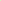
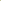
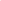
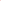
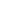

# RiemanLine: Riemannian Manifold Representation of 3D Lines for Factor Graph Optimization

<!-- Page 1 -->

RiemanLine: Riemannian Manifold Representation of 3D Lines for Factor Graph

Optimization

Yan Li1, Ze Yang2, Keisuke Tateno3, Federico Tombari3,4, Liang Zhao5, Gim Hee Lee1

1National University of Singapore 2Peking University 3Google 4Technical University of Munich 5The University of Edinburgh

## Abstract

Minimal parametrization of 3D lines plays a critical role in camera localization and structural mapping. Existing representations in robotics and computer vision predominantly handle independent lines, overlooking structural regularities such as sets of parallel lines that are pervasive in man-made environments. This paper introduces RiemanLine, a unified minimal representation for 3D lines formulated on Riemannian manifolds that jointly accommodates both individual lines and parallel-line groups. Our key idea is to decouple each line landmark into global and local components: a shared vanishing direction optimized on the unit sphere S2, and scaled normal vectors constrained on orthogonal subspaces, enabling compact encoding of structural regularities. For n parallel lines, the proposed representation reduces the parameter space from 4n (orthonormal form) to 2n + 2, naturally embedding parallelism without explicit constraints. We further integrate this parameterization into a factor graph framework, allowing global direction alignment and local reprojection optimization within a unified manifold-based bundle adjustment. Extensive experiments on ICL-NUIM, TartanAir, and synthetic benchmarks demonstrate that our method achieves significantly more accurate pose estimation and line reconstruction, while reducing parameter dimensionality and improving convergence stability.

Code — https://github.com/yanyan-li/RiemanLine

## Introduction

Robustly reconstructing (Schonberger and Frahm 2016; Forster, Pizzoli, and Scaramuzza 2014) unknown threedimensional scenes and estimating (Carlone et al. 2015; Carlone and Calafiore 2018) six degrees-of-freedom (6-DoF) camera poses from visual inputs are fundamental challenges in robotics and computer vision. However, these odometry and SLAM methods often suffer from structural inaccuracies and pose drift during the incremental camera tracking and mapping process. To mitigate these issues, techniques such as local bundle adjustment (Mur-Artal, Montiel, and Tardos 2015; Rosinol et al. 2020), sliding window optimization (Qin, Li, and Shen 2018; Engel, Koltun, and Cremers 2017), and loop closure (Labb´e and Michaud 2019; Mur-Artal, Montiel, and Tardos 2015) are commonly

Copyright © 2026, Association for the Advancement of Artificial Intelligence (www.aaai.org). All rights reserved.

Ground Truth Optimization Iteration Initialization

3 5 7 9 11 13 15 100

150

200

250

300

Iterations

Cost(pixel)

Point RiemanLine

Point OrthLine

(a) TartanAir

3 5 7 9 11 13 15 300 400 500 600 700 800 900

Iterations

Cost(pixel)

Point RiemanLine

Point OrthLine

(b) ICL-NUIM

**Figure 1.** An illustration of co-visibility factor graph optimization based points and lines. The initial factor graphs are depicted in the first row, with landmarks and trajectories colored light green and scarlet, respectively. The convergence curves for different representations are plotted in the second row. The optimized results based on the proposed Point RiemanLine method and ground-truth graphs are presented in the last rows, respectively.

incorporated. The core of these techniques lies in the use of factor graph optimization (Carlone and Calafiore 2018), which jointly refines the structure and transformation parameters. In this paper, we present a novel solution to the lineleveraged factor graph optimization problem by proposing a compact line parameterization on a Riemannian manifold along with constraint factors that connect line landmarks to camera poses, as shown in Figure 1.

The Fortieth AAAI Conference on Artificial Intelligence (AAAI-26)

AI-readable visual equivalent, added: Figure extracted from the paper PDF and converted to an SVG wrapper asset. Use the surrounding page text and caption for interpretation.

AI-readable visual equivalent, added: Figure extracted from the paper PDF and converted to an SVG wrapper asset. Use the surrounding page text and caption for interpretation.

AI-readable visual equivalent, added: Figure extracted from the paper PDF and converted to an SVG wrapper asset. Use the surrounding page text and caption for interpretation.

AI-readable visual equivalent, added: Figure extracted from the paper PDF and converted to an SVG wrapper asset. Use the surrounding page text and caption for interpretation.

AI-readable visual equivalent, added: Figure extracted from the paper PDF and converted to an SVG wrapper asset. Use the surrounding page text and caption for interpretation.

AI-readable visual equivalent, added: Figure extracted from the paper PDF and converted to an SVG wrapper asset. Use the surrounding page text and caption for interpretation.

<!-- Page 2 -->

Point features have long served as the foundation for most visual pose estimation systems, as demonstrated by their widespread adoption in leading methods (Mur-Artal, Montiel, and Tardos 2015; Qin, Li, and Shen 2018; Rosinol et al. 2020). Despite their success, point features exhibit notable limitations, especially in challenging environments such as indoor scenes. To overcome the limitations of point-only factor graph optimization (Li et al. 2024), recent efforts have explored the integration of additional geometric primitives such as lines (Lu and Song 2015; Zuo et al. 2017) and planes (Zhou, Koppel, and Kaess 2021) into both tracking and optimization modules. Compared to plane detection which is typically based on depth maps (Salas- Moreno et al. 2014) or convolutional neural networks (Paigwar et al. 2020), line features can be efficiently extracted from RGB images, offering a versatile and computationally efficient means to enhance visual odometry performance. The most popular and widely adopted line parameterization method in line-based SLAM systems is the Orthonormal algorithm (Bartoli and Sturm 2005), which enables elegant optimization within the framework of Lie Algebra.

Typically, a single line segment contributes a reprojection factor (Hartley and Zisserman 2003) to the optimization module, whereas a collection of lines imparts broader structural and global regularities. Specifically, a group of parallel line segments on a 2D image plane crosses at the vanishing point, which can be projected to the camera coordinate to obtain the corresponding vanishing direction (McLean and Kotturi 1995) via a related intrinsic matrix. A group of vanishing direction vectors can model structured environments such as the Atlanta or Manhattan World assumptions (Straub et al. 2017). However, these assumptions are often too restrictive for general environments, and it is also difficult to optimize the structure as one primitive in factor graph optimization modules. Furthermore, conventional minimal parameterization (Bartoli and Sturm 2005) that is widely adopted in line-SLAM systems (Zuo et al. 2017; He et al. 2018) lacks the expressiveness to compactly parametrize a group of structure lines. Consequently, this leads to increased complexity and reduced efficiency since the optimization frameworks must rely on additional parameters and manually introduce constraints into loss functions to capture the relationships among these lines.

In this paper, we first propose a unified minimal representation for 3D lines, including individual and structure line landmarks, which has a clear geometric interpretation in representation and optimization based on Riemannian manifolds. Specifically, the line parameters are explicitly decoupled into global and local components: the global component defines the shared direction of parallel lines, and the local component that lies in the orthogonal plane encodes scaled normals that distinguish each line. Representing n parallel 3D lines with the Orthonormal representation requires 4n parameters. In contrast, our method reduces this to only 2n+2 parameters, significantly reducing the dimensionality while implicitly encoding parallelism without additional constraints. We integrate this representation into a joint factor graph framework with co-visibility factors, enabling both accurate pose estimation and structurally consis-

## Algorithm

Parameters

Euclidean Ps, Pe endpoints of the 3D line

Pl¨ucker n, v n = [Ps]×Pe, v = Ps −Pe

Quaternion ¯q, d R(¯q) = [n v [n]×v], d = ||n||/||v|| Closest Point j = d¯q

Spherical θ, ϕ, α, d θ, ϕ, and α are angles, d is the distance

**Table 1.** Popular line representations and transformation relationships between them. Here [·]× is the skew-s operation, and the R is the transformation operation from quaternion to rotation matrix. The definitions of the remaining parameters are provided in Section 3.

tent line reconstruction. Our contributions are summarized as follows:

• We introduce a unified minimal parameterization for 3D lines on Riemannian manifolds that seamlessly extends from independent lines to sets of parallel lines by explicitly decoupling global and local components. • A joint factor graph framework incorporating covisibility and extensibility factors, specifically designed to leverage the proposed minimal representation; • We conduct extensive evaluations on ICL-NUIM, TartanAir, and synthetic datasets, demonstrating that our method achieves higher accuracy with fewer parameters and improved convergence stability compared to existing representations.

## Related work

As shown in Table 1, two stages of representation are typically involved in landmark reconstruction and optimization tasks (Bartoli and Sturm 2005). The first stage focuses on 3D triangulation from 2D measurements, and the second seeks a minimal parametrization for iterative refinement. The two stages can be unified into a single step when the degrees of freedom used in reconstruction meet the requirements of minimal parametrization.

Generally, Euclidean XYZ (Mur-Artal, Montiel, and Tardos 2015; Qin, Li, and Shen 2018) is used to parametrize endpoints of a finite line in the 3D space. Although this representation can be used to provide re-projection residuals of lines for camera pose optimization, it has the overparameterization problems in landmark optimization. Similar to the Euclidean, a line at infinity can be represented as the Pl¨ucker coordinate via two three-dimensional vectors containing the direction of the line and normal based on the line and the camera coordinate frame as listed in Table 1. Furthermore, the dual quaternion approach (Kottas and Roumeliotis 2013) represents a line in 3D space using dual quaternions, which provides a concise way to represent rotations and translations in 3D space and can be used to encode the position and orientation of lines. The advantage of this approach is that it allows for easy com-

<!-- Page 3 -->

x y z u2

O bx by Tu2S2

Lj

A great circle perpendicular to u2.

(a) S2 Space x y z

O wj nu1

Lj c

Tu1λS1 wj nu1

A scaled circle where u1 lying on.

(b) λS1 Space

**Figure 2.** Illustration of the proposed parametrization for a line landmark Lj. The vanishing direction vector u2 (∥u2∥= 1) and scaled normal vector ωj

nu1 (∥u1∥= 1, ωj n > 0) are optimized on the tangent spaces Tu2S2 of the sphere and Tu1λS1 of the scaled circle, respectively.

position of transformations, which makes it useful in applications such as robotics and animation. By multiplying the unit quaternion and the distance parameter, the closest point method (Yang and Huang 2019) can be considered as the ’closest point’ for a 3D line. The transformation relationships between Pl¨ucker, Quaternion and Closest Point methods are listed in Table 1. The rotation matrix used in those representations can be optimized via Lie algebras which define the tangent spaces of related manifolds. For the Spherical form, a line can also be represented by three angles and a distance parameter. Instead of optimizing the orthogonal matrix through Lie Groups being special instances of the manifold, a more general Riemannian manifold is used to refine the vanishing and normal vectors subsequently in the proposed method.

Structure-SLAM (Li et al. 2020c) estimates the orientation using surface normals from monocular images, while Linear-SLAM (Joo et al. 2021) extracts planes from depth maps. Given a known rotation, the translation estimation becomes linear. The Manhattan World (MW) model assumes orthonormal landmarks and the Atlanta World (AW) model introduces multiple perpendicular horizontal directions. The multi-MW model (Yunus, Li, and Tombari 2021) enforces orthogonality within local regions instead of throughout the scene. However, such methods often neglect optimization within factor graphs. Recent approaches integrate structural constraints, lines and planes, directly into optimization. (Zhang et al. 2015) pioneered using parametric 3D lines as SLAM landmarks, enhancing traditional point-based methods. (Lu and Song 2015) extended this by incorporating diverse structural features within a multilayer feature graph (MFG) to improve environmental representation and pose estimation. Kimera-VIO (Rosinol et al. 2020) leverages 3D meshes to enforce coplanarity constraints within factor graphs. PLP-VIO (Li et al. 2020a) further refines this approach by incorporating line-based meshes to enhance spatial understanding. CoP (Li et al. 2020b) introduced a novel parameterization that represents points and lines using plane parameters to preserve geometric consistency during optimization. Beyond scene-specific models, Struct-VIO (Zhou et al. 2015; Zou et al. 2019) mitigates directional errors and reducing drift by parameterizing line segments parallel to the local Manhattan world. Our method generalizes this by parameterizing all parallel lines, which uses the structural information to improve pose estimation accuracy in SLAM.

On-Manifold Representation of 3D Lines Preliminary: Representation in Orthonormal As shown in Table 1, a 3-dimensional finite line Lw in the world coordinates can be represented by its two 3D endpoints, Pw s and Pw e, as Lw = [ Pw s Pw e ]. For an infinite line, the direction and normal vectors can be used to represent the line Lw = [ nw dw ] based on the Pl¨ucker representation, where nw and dw can be derived from the endpoints Pw s and Pw e. This can be further expressed as the multiplication of several matrices via the following function:

Lw = [ nw dw ]

= h nw ||nw|| dw ||dw|| i

||nw|| 0 0 ||dw||

. (1)

We then use h nw ||nw|| dw ||dw|| i and

||nw|| 0 0 ||dw|| to establish the following matrices:

  

 

U = h nw ||nw|| dw ||dw|| nw×dw ||nw×dw|| i

;

W =

||nw||/λ −||dw||/λ ||dw||/λ ||nw||/λ

.

(2)

Here, λ denotes p

||dw||2 + ||nw||2, U ∈SO(3), and W ∈ SO(2).

In quaternion-based optimization methods (Yang and Huang 2019), U is represented as a quaternion vector via

¯q = R−1(U), and the optimization process is implemented based on quaternion representation. With the widespread

<!-- Page 4 -->

application of differentiable manifolds in SLAM optimization problems, the Orthonormal representation (Bartoli and Sturm 2005) maps the update process of SO(3)×SO(2) on the tangent space Lie algebra based on 4 degree-of-freedom ρT ω

T that is the minimal line representation widely used in point-line SLAM (Zuo et al. 2017; Li et al. 2020b) and VIO (He et al. 2018) systems.

Riemannian Representation of a Single 3D Line

We decouple the single line Lj into two components: the unit direction vector u2, and the scaled normal vector ωj nu1. As illustrated in Figure 2, the direction vector u2 (with ∥u2∥= 1) lies on the surface of the unit sphere S2. The scaled normal vector ωj nu1 lies on the plane λS1, which is centered at the origin and orthogonal to u2.

Optimization on S2. As illustrated in Figure 2a, the tangent space to S2 (at u2) is given by:

Tu2S2 ˙={x ∈R3|xT u2 = 0}. (3)

Here, xT u2 = 0 shows that the vectors x in the tangent space are perpendicular to u2. Although S2 is a non-linear 3D space, its tangent space Tu2S2 is a 2-DoF linear space. Based on the perpendicular bases bx and by, any vector adjacent to u2 on the unit sphere can be represented.

In the representation process, δθ1 and δθ2, [ δθ1 δθ2 ]T = δθ, are corresponding disturbances towards bx and by, respectively. Consequently, the perturbation δm on the tangent space can be represented as:

δm = [ bx by ]

δθ1 δθ2

, (4)

and the additive operation on the unit sphere is denoted as u2 ⊞δm, which maps δm back to S2 via the Riemannian exponential Expu2(δm), and the vector after perturbation is denoted as v2 computed via:

v2 = u2 ⊞δm

= u2 cos ||δm|| + δm ∥δm∥sin ∥δm∥, (5)

where the perturbation δm is close to 0.

Optimization on λS1. Concurrently, the tangent space to λS1 is denoted as:

Tu1λS1 ˙={x ∈R3 | xT u1 = xT u2 = 0}. (6)

Here, xT u1 = xT u2 = 0 shows that the vectors on the tangent space are perpendicular to u1 and u2 at the same time. Although λS1 is a non-linear 2D space, there is a base vector u3 which is orthogonal to both u1 and u2. This base vector can be selected as u3 since u3 = u2 × u1. With the perturbation of u2, the tangent space of u1 is also perturbed by the orthogonal relationship. Based on the updated global direction v2, we define the space Tu1λS1 based on u3 = v2 × u1.

For a small angle δγ, we rotate u1 within the plane orthogonal to v2 by an angle δγ to obtain the new vector v1 by using the base vector of the tangent space. Based on the x y z d

O bx by Li

Lj wi nni wj nnj

A great circle of the unit sphere.

**Figure 3.** Illustration of the parametrization for two parallel line landmarks Li and Lj. The vanishing direction vector u2 and normalized normal vector u1 are optimized on the tangent spaces Tu2S2 of the sphere and Tu1S1 of the circle, respectively.

Rodrigues rotation formula, the updated direction can be denoted as v1 = λ · cos(δγ)u1 + sin(δγ)u3

, (7)

which rotates u1 within the plane orthogonal to v2 by angle δγ. λ ∈R+ is a scalar magnitude.

Unified Representation for Parallel Line Sets

As illustrated in Figure 3, our method naturally extends to a set of parallel lines by building upon the representation of a single 3D line. For a group of k parallel lines denoted as S = [Lw

0, Lw 1,..., Lw k ], the shared vanishing direction is represented by a single unit vector u2. Each line Lw i in the group is characterized by a local component ui

1 and a scale ωi. This results in a compact representation of the set as:

[u2, ω0u0

1, ω1u1 1,..., ωkuk 1], (8)

where all ωiui

1 lying on the circle ωiS1 perpendicular to u2. This leads to a minimal representation of the entire line group with 2 + 2k degrees of freedom: 2 DoF for the shared global direction u2, and 2 DoF per line for its local component.

As shown in Figure 3, u2 lies on S2 and each ui

1 lies on the associated circle orthogonal to u2 by the minimal representation on the unit sphere. Consequently, the minimal parameterization of the parallel line group follows the same format as the single-line case and can be written as:

[δθ, δγ0,..., δγk, λ0,..., λk], (9)

where δθ encodes the global direction u2, δγi represents the angular perturbation of ui

1 on the circle, and λi denotes the perturbation corresponding distance scale. Since parallel lines Li and Lj share the same direction vector u2, the global vector u2 can thus be optimized via Equation 4 and 5. The associated local vectors ωiui and ωjuj lie on the

<!-- Page 5 -->

1 2 3 4

1 2 3 4

1 2 3 4

1 2 3 4 0

Camera Pose Parallel Lines Local Info. Global Info. Reprojection Factor Reprojection Factor

**Figure 4.** Factor graph representations for different linebased structures. Left: conventional line re-projection factors. Right: the proposed parallel line representation, explicitly separating global and local components with reprojection factors.

same plane defined by this tangent plane, therefore these local components can be optimized separately.

This unified formulation demonstrates the versatility of our approach that enables seamless extension from individual line landmarks to structurally consistent representations of parallel line groups within a common manifold-based optimization framework.

## 4 Optimization with Points and Lines Graph Construction The vertices in the point-line factor graphs G include camera poses

Vpose, point landmarks Vp, line landmarks Vl and parallel-line sets Vpara. Specifically, camera pose Tw,ci =

Rw,ci tw,ci 0 1

, where Tw,ci ∈ SE(3), Rw,ci ∈

SO(3), and tw,ci ∈R3. Points used in the optimization module is parametrized as Pk w = xk yk zk T, and line landmarks are represented in minimal parameterization forms.

Factors and Constraints Co-visibility connections (Mur-Artal, Montiel, and Tardos 2015; Mur-Artal and Tard´os 2017; Campos et al. 2021) are built when two images detect the same landmark, such as a point or a line on the map. In this section, we define the covisibility factors based on the re-projection models of point and line features.

Co-visibility factors from points. Based on the point feature measurement model, the measurement of the kth global point landmark Pk w at frame cj is represented as ¯pj k in the normalized coordinate, and the re-projection factor of a point feature is defined as rp(¯pj i, Pk w, Tw,cj). Co-visibility factors from lines. Traditionally, the mapline Li w in the world coordinate is transferred to the camera coordinates, and then re-projected on the image plane lj k of viewpoint cj. The error between the re-projected line lj k and the two endpoints ¯pj k,s and ¯pj k,e of the extracted 2D line can be written as:

rl(¯pj k,s, ¯pj k,e, Lk w, Tw,cj) =

" dis(¯pj k,s, lj k) dis(¯pj k,e, lj k)

#

, (10)

where dis(·) gives the distance between a point and a line.

Constraints between parallel lines. To enforce structural consistency, we incorporate additional constraints among groups of parallel lines. Specifically, for each mapline Li w in a set of N parallel lines {Li w}N i=1, its direction should be parallel to other lines in the set. The parallelism constraint is enforced by minimizing the angular deviation between the direction of each line ui

## 2. The residual is defined as:

r∥(Lw i, {Lw j }N j=1,j̸=i) = 1 N −1

N X j=1,j̸=i

1 −ui⊤ 2 uj 2

.

(11) Here, the residual r∥encourages all lines in the group to remain parallel to each other during optimization.

## Experiments

We evaluate the proposed RiemanLine and StructRieman- Line parameterizations on both public benchmarks and simulated environments. Our goals are to assess: (i) pose estimation accuracy, (ii) landmark reconstruction quality, and (iii) the benefits of incorporating structural constraints within a unified Riemannian manifold representation.

Baselines. We compare against standard parameterizations widely used in SLAM and VO: Euclidean XYZ (Mur- Artal, Montiel, and Tardos 2015), Orthonormal (Bartoli and Sturm 2005), and ImplicitLine (Zhao et al. 2015). The Orthonormal form serves as the minimal representation for Closest Point (Yang and Huang 2019) and Quaternion (Kottas and Roumeliotis 2013) methods. All baselines are fed with the same co-visibility factor graph in each sequence.

Datasets. We use the ICL-NUIM benchmark (Handa et al. 2014) (eight indoor RGB-D sequences) and four TartanAir (Wang et al. 2020) sequences featuring photorealistic synthetic environments. Additionally, we evaluate on three challenging simulation sequences (corridor, box, sphere) generated using Open-Structure (Li et al. 2024).

Metrics. We report Absolute Trajectory Error (ATE) for camera localization, and angular errors (direction and normal) for line reconstruction. All results are averaged per sequence. Computations were performed on an Intel NUC Mini PC with Core i7-8700 CPU.

## Evaluation

on ICL-NUIM

**Table 2.** summarizes ATE RMSE and MEDIAN errors. The initial factor graphs show significant drift (e.g., RMSE 12.13 cm on livingroom0). For brevity, we refer to Point StructRiemanLine as StructRiemanLine in tables. The proposed Point StructRiemanLine achieves the best overall accuracy across all eight sequences. By explicitly encoding parallel-line constraints into the minimal Riemannian representation, it reduces errors without introducing additional parameters. For example, livingroom2 achieves RMSE 0.75 cm (MEDIAN 0.68 cm), and office2 maintains RMSE 0.75 cm while preserving robust convergence behavior.

<!-- Page 6 -->

Sequence

Initial Optimization using Independent Primitives Optimization using Structure Constraints Factor Graph Point OrthLine ImplicitLine RiemanLine OrthLine Constr StructRiemanLine RMSE Med. RMSE Med. RMSE Med. RMSE Med. RMSE Med. RMSE Med. RMSE Med. livingroom0 12.13 1.95 1.14 0.69 0.81 0.38 0.96 0.40 0.81 0.38 0.81 0.38 0.81 0.37 livingroom1 2.15 1.57 1.67 1.24 4.13 4.22 0.92 0.81 1.19 0.71 3.58 3.60 0.90 0.55 livingroom2 12.95 6.95 1.61 0.80 0.79 0.71 1.18 0.90 0.78 0.71 0.79 0.72 0.75 0.68 livingroom3 18.26 13.93 11.64 11.43 6.70 6.33 6.67 6.76 6.71 6.34 6.71 6.34 6.65 6.33 office0 1.73 0.69 0.70 0.34 0.38 0.26 0.47 0.37 0.38 0.26 0.38 0.26 0.38 0.26 office1 11.93 5.48 7.68 5.22 1.81 0.89 9.78 7.81 1.89 0.87 1.81 0.87 1.76 0.73 office2 2.95 1.88 0.93 0.55 0.75 0.56 0.75 0.53 0.75 0.56 0.76 0.56 0.75 0.56 office3 7.56 2.47 1.22 0.66 0.78 0.49 1.86 0.77 0.79 0.51 0.85 0.53 0.77 0.46

**Table 2.** Comparison of translation (APE) RMSE and median errors (cm) on the ICL-NUIM (Handa et al. 2014) benchmark dataset. The best results are highlighted in bold.

Sequence Carwelding Hospital Office Jpn. Alley Trans. Rot. Trans. Rot. Trans. Rot. Trans. Rot. Initial 14.74 10.89 33.78 26.83 57.00 47.78 10.92 5.23 OrthLine 4.47 0.16 5.32 4.83 43.25 29.23 3.75 2.80 OrthLine Const 4.56 0.16 5.49 4.97 50.04 39.50 3.68 2.72 RiemanLine 4.46 0.16 7.29 6.60 40.95 26.70 3.85 2.92 StructRiemanLine 4.08 0.15 2.91 2.04 15.60 12.08 3.65 2.68

**Table 3.** Comparison of APE RMSE (translation (cm) and rotation (degree) on the TartanAir dataset.

## Method

Carweld. Hospital Office Jpn. Alley Dir. Norm. Dir. Norm. Dir. Norm. Dir. Norm. OrthLine 1.52 1.42 5.16 4.11 3.89 4.49 0.88 0.86 OrthLine Constr 0.92 0.93 5.05 2.54 2.04 2.28 0.46 0.42 RiemanLine 1.55 1.43 5.38 4.68 3.89 4.48 0.88 0.73 StructRiemanLine 0.82 0.83 1.60 0.91 0.04 0.51 0.07 0.15

**Table 4.** Comparison of line reconstruction performance on TartanAir. Median errors (degrees) are reported for direction (Dir.) and normal (Norm.).

## Evaluation

on TartanAir

**Table 3.** reports ATE translation and rotation errors on the TartanAir benchmark. The proposed StructRiemanLine achieves the most significant improvement in structurally rich indoor sequences. On Hospital, the translation RMSE drops from 33.78 cm (Initial) and 7.29 cm (RiemanLine) to only 2.91 cm, while the rotation RMSE decreases from 26.83◦to 2.04◦. Similarly, on Office, the translation error is reduced by over 40% compared to Point OrthLine and Point RiemanLine, demonstrating that the proposed parallel-line manifold representation provides strong orientation priors that are especially beneficial in man-made environments with dominant structural regularities. These results validate that explicitly encoding shared vanishing directions within the factor graph not only improves translational accuracy but also significantly enhances rotational consistency, a critical factor for large indoor scene reconstruction.

Line reconstruction. Table 4 reports median angular errors. StructRiemanLine achieves the lowest direction and normal errors across all TartanAir sequences. In Hospital, the direction error is reduced to 1.60◦and the normal error to 0.91◦, validating that structural encoding improves both pose estimation and landmark quality. Figure 5 shows direction normal

Cumulative Distribution of Angles

Angle Errors (deg)

Point_OrthLine Point_RiemanLine Point_OrthLine_Constr Point_StructRiemanLine Point_OrthLine Point_RiemanLine Point_OrthLine_Constr Point_StructRiemanLine

0 80 60 40 20 0

1

0.2

0.4

0.6

0.8

Direction Normal

**Figure 5.** Line reconstruction errors of different methods in the Hospital sequence.

the cumulative distribution of angular errors for line direction and normal estimation on the Hospital sequence. The proposed StructRiemanLine achieves the steepest rise and highest saturation, indicating that over 90% of reconstructed lines fall within 2◦of the ground truth for both direction and normal vectors. Compared to Point Orthonormal and Point RiemanLine, which exhibit heavier tails beyond 5◦, StructRiemanLine demonstrates significantly reduced variance. This confirms that encoding parallelism within the Riemannian manifold not only lowers median error (Table 4) but also improves the consistency of line reconstruction.

Simulations

**Figure 7.** illustrates the synthetic environments that are corridor and sphere. In the corridor scenario, a rectangular arrangement of green points forms a corridor-like structure with blue structural lines embedded within, while a red trajectory traces a loop along the corridor’s center. The sphere scenario depicts a roughly spherical distribution of green points surrounded by blue lines, where the red trajectory forms a dense circular pattern around the sphere’s surface.

**Table 5.** reports ATE RMSE. While both RiemanLine and Orthonormal perform similarly on simple structures, StructRiemanLine consistently achieves the lowest translation and rotation errors. In the sphere scenario, it reduces translation RMSE to 1.16 cm and maintains minimal orientation drift, confirming the benefits of enforcing parallelism con-

AI-readable visual equivalent, added: Figure extracted from the paper PDF and converted to an SVG wrapper asset. Use the surrounding page text and caption for interpretation.

<!-- Page 7 -->

0 200 400 600 800

Pitch (deg) Roll (deg)

-0.2

0.0

0.2

89.6

90.0

## 90.4 Ground Truth

Point_OrthLine

Point_OrthLine_Constr Point_StructRiemanLine Point_RiemanLine

**Figure 6.** Pitch and roll angle errors for the sphere sequence in the simulation dataset. The plots compare the estimated orientations of different methods against the ground truth.

−13 0 13 −12 0 12 −1

0 1

−2 0 2 −3

0 3 −2

0 2

**Figure 7.** Visualization of the simulation scenarios: corridor and sphere. Points, lines, and trajectories are shown in green, blue, and red, respectively.

## Method

corridor box sphere Trans. Rot. Trans. Rot. Trans. Rot. Initial 10.57 1.54 9.67 0.85 25.99 5.49 OrthLine 4.24 0.32 2.09 0.23 1.19 0.19 OrthLine Constr 4.29 0.32 2.09 0.23 1.19 0.19 RiemanLine 4.24 0.32 2.09 0.23 1.20 0.19 StructRiemanLine 4.02 0.31 2.08 0.23 1.16 0.19

**Table 5.** Comparison of translation (APE RMSE (cm)) and rotation (APE RMSE (degree)) on the simulation dataset.

straints in structurally symmetric environments.

**Figure 6.** further compares pitch and roll estimation errors in the sphere simulation. Point Orthonormal and Point RiemanLine exhibit small but noticeable oscillations, while StructRiemanLine maintains the closest alignment with ground truth across the trajectory.

Runtime and Complexity Analysis. Table 6 reports the parameter complexity and solver runtime on the box simulation sequence, which contains 447 camera poses, 130 point landmarks, 20 line landmarks, and 2 parallelline groups. Landmarks observed by fewer than three cameras are pruned prior to optimization to ensure a consistent and well-constrained factor graph. Starting from the Point-only baseline, the inclusion of 20 line landmarks in

## Method

Para. Blks. Eff. Params. Resi. Blks. Resi. Time (s) Point 577 36010 37010 53.90 OrthLine Constr 597 41773 83452 97.62 StructRiemanLine 579 41679 83358 49.62

**Table 6.** Comparison of parameter complexity and total solver runtime between the conventional Orthonormal representation with additional parallelism constraints and the proposed minimal parametrization on the box sequence

Point OrthLine Constr introduces 20 additional parameter blocks and 80 new parameters due to the conventional 4n minimal parameterization. In contrast, the proposed StructRiemanLine requires only 44 parameters to represent the same 20 lines, as 19 of them are encoded within two parallelline groups under the compact 2n + 2 formulation.

In terms of computational efficiency, the total optimization time drops from 97.62 s to 49.62 s, yielding an approximate 49% overall speed-up. This improvement is consistent with the reduction in parameter blocks (597 →579) and state dimensionality (3152 →3116), which together produce a sparser and better-conditioned Hessian.

## 6 Conclusion and Future Works

We have presented a novel minimal representation for 3D line landmarks. Unlike conventional approaches, the proposed parameterization not only encodes individual lines with minimal degrees of freedom, but also naturally accommodates structural regularities such as sets of parallel lines. Building upon this representation, we introduced a joint factor graph framework that integrates both co-visibility and structural factors, enabling more accurate and efficient optimization of camera poses and landmarks compared to traditional point–line co-visibility graphs.

Looking ahead, we envision incorporating the proposed parameterization into full SLAM and visual odometry pipelines to achieve more robust tracking and high-fidelity reconstruction in large-scale environments.

AI-readable visual equivalent, added: Figure extracted from the paper PDF and converted to an SVG wrapper asset. Use the surrounding page text and caption for interpretation.

<!-- Page 8 -->

## Acknowledgments

We would like to thank Xin Li for insightful discussions and constructive feedback. This research was supported by the Tier 2 Grant (MOE-T2EP20124-0015) from the Singapore Ministry of Education.

## References

Bartoli, A.; and Sturm, P. 2005. Structure-from-motion using lines: Representation, triangulation, and bundle adjustment. Computer vision and image understanding, 100(3): 416–441. Campos, C.; Elvira, R.; Rodr´ıguez, J. J. G.; Montiel, J. M.; and Tard´os, J. D. 2021. Orb-slam3: An accurate open-source library for visual, visual–inertial, and multimap slam. IEEE Transactions on Robotics, 37(6): 1874–1890. Carlone, L.; and Calafiore, G. C. 2018. Convex relaxations for pose graph optimization with outliers. IEEE Robotics and Automation Letters, 3(2): 1160–1167. Carlone, L.; Tron, R.; Daniilidis, K.; and Dellaert, F. 2015. Initialization techniques for 3D SLAM: A survey on rotation estimation and its use in pose graph optimization. In 2015 IEEE international conference on robotics and automation (ICRA), 4597–4604. IEEE. Engel, J.; Koltun, V.; and Cremers, D. 2017. Direct sparse odometry. IEEE transactions on pattern analysis and machine intelligence, 40(3): 611–625. Forster, C.; Pizzoli, M.; and Scaramuzza, D. 2014. SVO: Fast semi-direct monocular visual odometry. In 2014 IEEE international conference on robotics and automation (ICRA), 15–22. IEEE. Handa, A.; Whelan, T.; McDonald, J.; and Davison, A. J. 2014. A benchmark for RGB-D visual odometry, 3D reconstruction and SLAM. In 2014 IEEE international conference on Robotics and automation (ICRA), 1524–1531. IEEE. Hartley, R.; and Zisserman, A. 2003. Multiple view geometry in computer vision. Cambridge university press. He, Y.; Zhao, J.; Guo, Y.; He, W.; and Yuan, K. 2018. PL- VIO: Tightly-coupled monocular visual–inertial odometry using point and line features. Sensors, 18(4): 1159. Joo, K.; Kim, P.; Hebert, M.; Kweon, I. S.; and Kim, H. J. 2021. Linear RGB-D SLAM for structured environments. IEEE Transactions on Pattern Analysis and Machine Intelligence, 44(11): 8403–8419. Kottas, D. G.; and Roumeliotis, S. I. 2013. Efficient and consistent vision-aided inertial navigation using line observations. In 2013 IEEE International Conference on Robotics and Automation, 1540–1547. IEEE. Labb´e, M.; and Michaud, F. 2019. RTAB-Map as an opensource lidar and visual simultaneous localization and mapping library for large-scale and long-term online operation. Journal of Field Robotics, 36(2): 416–446. Li, X.; He, Y.; Lin, J.; and Liu, X. 2020a. Leveraging planar regularities for point line visual-inertial odometry. In 2020 IEEE/RSJ international conference on intelligent robots and systems (IROS), 5120–5127. IEEE.

Li, X.; Li, Y.; ¨Ornek, E. P.; Lin, J.; and Tombari, F. 2020b. Co-planar parametrization for stereo-SLAM and visualinertial odometry. IEEE Robotics and Automation Letters, 5(4): 6972–6979. Li, Y.; Brasch, N.; Wang, Y.; Navab, N.; and Tombari, F. 2020c. Structure-slam: Low-drift monocular slam in indoor environments. IEEE Robotics and Automation Letters, 5(4): 6583–6590. Li, Y.; Guo, Z.; Yang, Z.; Sun, Y.; Zhao, L.; and Tombari, F. 2024. Open-Structure: Structural Benchmark Dataset for SLAM Algorithms. IEEE Robotics and Automation Letters. Lu, Y.; and Song, D. 2015. Visual navigation using heterogeneous landmarks and unsupervised geometric constraints. IEEE Transactions on Robotics, 31(3): 736–749. McLean, G. F.; and Kotturi, D. 1995. Vanishing point detection by line clustering. IEEE Transactions on pattern analysis and machine intelligence, 17(11): 1090–1095. Mur-Artal, R.; Montiel, J. M. M.; and Tardos, J. D. 2015. ORB-SLAM: a versatile and accurate monocular SLAM system. IEEE transactions on robotics, 31(5): 1147–1163. Mur-Artal, R.; and Tard´os, J. D. 2017. Orb-slam2: An opensource slam system for monocular, stereo, and rgb-d cameras. IEEE transactions on robotics, 33(5): 1255–1262. Paigwar, A.; Erkent, ¨O.; Sierra-Gonzalez, D.; and Laugier, C. 2020. GndNet: Fast ground plane estimation and point cloud segmentation for autonomous vehicles. In 2020 IEEE/RSJ International Conference on Intelligent Robots and Systems (IROS), 2150–2156. IEEE. Qin, T.; Li, P.; and Shen, S. 2018. VINS-Mono: A Robust and Versatile Monocular Visual-Inertial State Estimator. IEEE Transactions on Robotics, 34(4): 1004–1020. Rosinol, A.; Abate, M.; Chang, Y.; and Carlone, L. 2020. Kimera: an open-source library for real-time metricsemantic localization and mapping. In 2020 IEEE International Conference on Robotics and Automation (ICRA), 1689–1696. IEEE. Salas-Moreno, R. F.; Glocken, B.; Kelly, P. H.; and Davison, A. J. 2014. Dense planar SLAM. In 2014 IEEE international symposium on mixed and augmented reality (ISMAR), 157– 164. IEEE. Schonberger, J. L.; and Frahm, J.-M. 2016. Structure-frommotion revisited. In Proceedings of the IEEE conference on computer vision and pattern recognition, 4104–4113. Straub, J.; Freifeld, O.; Rosman, G.; Leonard, J. J.; and Fisher, J. W. 2017. The Manhattan frame model—Manhattan world inference in the space of surface normals. IEEE transactions on pattern analysis and machine intelligence, 40(1): 235–249. Wang, W.; Zhu, D.; Wang, X.; Hu, Y.; Qiu, Y.; Wang, C.; Hu, Y.; Kapoor, A.; and Scherer, S. 2020. Tartanair: A dataset to push the limits of visual slam. In 2020 IEEE/RSJ International Conference on Intelligent Robots and Systems (IROS), 4909–4916. IEEE. Yang, Y.; and Huang, G. 2019. Aided Inertial Navigation: Unified Feature Representations and Observability Analysis. In 2019 International Conference on Robotics and Automation (ICRA), 3528–3534.

<!-- Page 9 -->

Yunus, R.; Li, Y.; and Tombari, F. 2021. Manhattanslam: Robust planar tracking and mapping leveraging mixture of manhattan frames. In 2021 IEEE International Conference on Robotics and Automation (ICRA), 6687–6693. IEEE. Zhang, G.; Lee, J. H.; Lim, J.; and Suh, I. H. 2015. Building a 3-D line-based map using stereo SLAM. IEEE Transactions on Robotics, 31(6): 1364–1377. Zhao, L.; Huang, S.; Yan, L.; and Dissanayake, G. 2015. A new feature parametrization for monocular SLAM using line features. Robotica, 33(3): 513–536. Zhou, H.; Zou, D.; Pei, L.; Ying, R.; Liu, P.; and Yu, W. 2015. StructSLAM: Visual SLAM with building structure lines. IEEE Transactions on Vehicular Technology, 64(4): 1364–1375. Zhou, L.; Koppel, D.; and Kaess, M. 2021. LiDAR SLAM with plane adjustment for indoor environment. IEEE Robotics and Automation Letters, 6(4): 7073–7080. Zou, D.; Wu, Y.; Pei, L.; Ling, H.; and Yu, W. 2019. StructVIO: Visual-inertial odometry with structural regularity of man-made environments. IEEE Transactions on Robotics, 35(4): 999–1013. Zuo, X.; Xie, X.; Liu, Y.; and Huang, G. 2017. Robust visual SLAM with point and line features. In 2017 IEEE/RSJ International Conference on Intelligent Robots and Systems (IROS), 1775–1782. IEEE.
