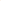

# Robust Integrative Analysis of Multi-omics Datasets via Nuclear-norm Maximization

<!-- Page 1 -->

Robust Integrative Analysis of Multi-omics Datasets via Nuclear-norm

Maximization

Meng-Zhu Wang 1, 2, 3, Yu Zhang 1, 2, Hongxing Zhang 2*

## 1 School of Artificial Intelligence, Hebei University of Technology, 2 State Key Laboratory of Medical Proteomics, National

Center for Protein Sciences (Beijing), 3 Advanced Institute of Big Data, Beijing, AIBD. mzwang@hebut.edu.cn, morii5614@gmail.com, zhanghx08@126.com

## Abstract

Spatially multimodal omics technologies provide unprecedented opportunities to address cellular heterogeneity within tissue contexts. However, learning robust and informative latent representations from such complex data remains a significant challenge. Existing graph-based methods often rely on static connections or indirect optimization objectives, which can constrain the discriminability and diversity of the learned representations, particularly in the presence of sequencing noise and unknown biological priors. To overcome these limitations, we propose Robust Integrative Analysis of Multiomics Datasets via Nuclear-norm Maximization (RIA) to adaptively integrate multimodal features and spatial information through a new graph-based architecture. At the core of RIA is the introduction of the batch nuclear norm maximization (bnm) loss, marking the first application of bnm within the multi-omics domain. By maximizing the nuclear norm of the batch assignment matrix derived from the latent space, RIA simultaneously enhances the discriminability and diversity of the learned embeddings. This objective is synergistically combined with a dynamic prototype contrastive learning strategy and a graph stability loss, ensuring comprehensive and robust optimization.Ultimately, RIA produces a structured, information-rich latent space that enables more reliable downstream analyses, including cell type identification, spatial domain discovery, and microenvironment characterization.

Code — https://github.com/dreamkily/RIA

## Introduction

With the rapid advancement of high-throughput sequencing technologies, spatial multi-omics has emerged at the forefront of biomedical research (Lee et al. 2025; Wang et al. 2024c,d). This approach enables the simultaneous analysis of multiple molecular layers such as the transcriptome, proteome, and epigenome while preserving the spatial context of tissues (Nam et al. 2024). By integrating such multidimensional information, spatial multi-omics provides a powerful tool for unraveling complex biological regulatory networks, cellular heterogeneity, and disease microenvironments. However, this technological revolution also presents

*Corresponding author. Copyright © 2026, Association for the Advancement of Artificial Intelligence (www.aaai.org). All rights reserved.

Labeled Samples Unlabeled Samples Decision Boundry

Ribozyme

RNA circRNA microRNA

IncRNA

**Figure 1.** In the classification task, we need to pay attention to the minority categories with fewer samples in the dashed box on the left. The influence of minority categories is often reduced in direct entropy minimization, resulting in a decrease in category prediction diversity and discrimination ability.

significant computational challenges. The inherent high dimensionality, sparsity, and cross-modal heterogeneity of multimodal omics data, along with pervasive batch effects and technical noise, severely hinder effective data integration and downstream analysis (Ma et al. 2024; Greenwald et al. 2024).

In multimodal omics analysis, a core goal is to accurately identify and annotate cell types to build a comprehensive cell atlas (Sch¨afer et al. 2024). However, in many biological contexts, such as the tumor immune microenvironment or early embryonic development, the true number of cell types is often unknown, and the distribution of cell populations is highly imbalanced (Tasci et al. 2022). Among these, rare cell types—small in number but critical in function—often play decisive roles in processes such as disease progression, drug resistance, or tissue regeneration (Wagle et al. 2024). Traditional machine learning models tend to favor the numerically dominant “majority class” cells during training due to data imbalance, while overlooking these crucial “minority classes.” This leads to insufficient model diversity and an incomplete representation of underlying biological mechanisms. As a result, existing methods often struggle to achieve

The Fortieth AAAI Conference on Artificial Intelligence (AAAI-26)

26372

AI-readable visual equivalent, added: Figure extracted from the paper PDF and converted to an SVG wrapper asset. Use the surrounding page text and caption for interpretation.

AI-readable visual equivalent, added: Figure extracted from the paper PDF and converted to an SVG wrapper asset. Use the surrounding page text and caption for interpretation.

AI-readable visual equivalent, added: Figure extracted from the paper PDF and converted to an SVG wrapper asset. Use the surrounding page text and caption for interpretation.

AI-readable visual equivalent, added: Figure extracted from the paper PDF and converted to an SVG wrapper asset. Use the surrounding page text and caption for interpretation.

<!-- Page 2 -->

both discriminability and diversity in classification.

In recent years, Graph Neural Networks (GNNs) (Wang et al. 2024b,a) have emerged as the predominant approach for analyzing spatial omics data (Madhu et al. 2025; Pratama et al. 2025). These methods typically model cellular spatial relationships by constructing K-nearest neighbor (KNN) graphs, leveraging GNNs’ exceptional capability in information propagation to derive comprehensive cell representations. Notably, frameworks like STAGATE (Dong and Zhang 2022) and GraphST (Long et al. 2023) employ graph autoencoder architectures to learn low-dimensional embeddings, demonstrating outstanding performance in tasks such as cell clustering and spatial domain identification. Despite these advancements, GNN-based approaches still face several fundamental challenges. First, their reliance on fixed, distance-based KNN graphs makes them vulnerable to sequencing noise and data perturbations, while potentially overlooking non-local, biologically meaningful interactions governed by molecular features (Huang et al. 2024). Second, optimization using conventional reconstruction or basic clustering losses often leads to poor representation of rare cell populations in class-imbalanced data, as models tend to collapse toward majority classes. Finally, many existing methods presuppose prior knowledge of cell type quantities and an impractical requirement in exploratory research where such information is typically unknown.

To address the above problems, we propose RIA (Robust Integrative Analysis), a novel computational framework for multimodal omics representation learning that addresses current methodological limitations through several integrated innovations. Departing from traditional approaches, RIA introduces batch nuclear-norm maximization (bnm) (Liu and Zheng 2022; Shi et al. 2024) as its core training objective, replacing conventional reconstruction losses to explicitly optimize for diverse and discriminative representations. RIA begins with an initial k-NN graph based on spatial or unimodal features, then progressively refines the graph structure through data-driven optimization while maintaining cross-modal consistency, ensuring the learned neighborhoods accurately reflect biological relationships with enhanced noise robustness. Complementing this adaptive graph learning, RIA implements a prototype-based contrastive learning scheme where embeddings naturally cluster around adaptive prototype centers, enabling label-free alignment of corresponding cell types across modalities. The bnm optimization ensures high-rank outputs with large Frobenius norms, simultaneously improving cell type separability and feature diversity - a particularly valuable property for overcoming the prevalent bias toward dominant cell types in unlabeled spatial omics data. To our knowledge, this represents the first successful application of bnm principles to spatial omics analysis, offering a principled solution to several long-standing challenges in the field. Our key contributions include:

• We propose a new unified framework for integrating spatial context and multi-omics modalities, called RIA. By jointly leveraging spatially adaptive graphs, prototypedriven semantic alignment, and batch nuclear norm max- imization, our model significantly enhances clustering and structure discovery capabilities of spatial omics data. • Our work represents the first successful adaptation and application of batch nuclear norm maximization (bnm) to spatial multi-omics integration. To our knowledge, no prior work has employed bnm in the context of spatial multi-omics data integration, making this a unique contribution to the field. • We conduct extensive experiments on multiple datasets to validate the effectiveness of our model, which demonstrates its superior performance and superior classification ability compared with state-of-the-art baselines.

## Method

Definition and Motivation Spatial multi-modal omics integration aims to combine spatial information with multi-omics data- such as transcriptomic RNA-seq, genomic ATAC-seq (Assay for Transposase-Accessible Chromatin), and proteomic Antibody-Derived Tags (ADT) into a unified latent representation. Given the spatial coordinates of 𝑁spots 𝑆= {(𝑥𝑖, 𝑦𝑖)}𝑁 𝑖=1 and their corresponding multi-modal features 𝐹𝑀= { 𝑓𝑚 𝑖}𝑁,𝑀 𝑖=1,𝑚=1, where 𝑓𝑚∈R𝐷𝑚denotes the 𝐷𝑚dimensional feature vector of the 𝑚-th modality, these methods learn a mapping function Φ to aggregate 𝐹𝑀and 𝑆into a comprehensive 𝐷𝑧-dimensional latent space Z.

Z = Φ (𝐹𝑀, 𝑆) (1)

The unified latent representation Z facilitates a wide range of downstream bioinformatics applications, enabling comprehensive biological insights at both cellular and tissue levels.

The rapid development of spatial multi-omics technologies has opened new frontiers in biomedical research by enabling simultaneous measurement of multiple molecular modalities while preserving crucial spatial information within tissues. These technological breakthroughs promise to revolutionize our understanding of cellular heterogeneity, tissue organization, and disease mechanisms. However, the computational integration and analysis of such complex, high-dimensional data present significant challenges that current methods struggle to address adequately. Existing approaches often rely on static graph constructions that are vulnerable to technical noise and fail to capture biologically meaningful long-range interactions. Moreover, conventional optimization objectives tend to favor dominant cell populations while neglecting rare but functionally critical cell types, leading to incomplete biological insights. The inherent sparsity and heterogeneity of multi-omics data, combined with frequent batch effects and the typical absence of prior knowledge about cell type composition, further complicate analysis. These limitations motivate our development of RIA, a novel computational framework that introduces batch nuclear-norm maximization to simultaneously enhance representation discriminability and diversity, incorporates dynamic graph learning to improve biological relevance and noise robustness, and employs prototype-based

26373

<!-- Page 3 -->

**Figure 2.** Overview of RIA. The input of RIA includes information of different modalities (such as scRNA-seq data and scATAC-seq data) and the spatial coordinates corresponding to each measured spot. RIA first integrates the feature matrix corresponding to each modality with the spatial matrix to form a learnable feature enhancement graph. Then, a unified potential representation is formed and optimized through encoding and decoding (three loss functions are used for each modality here: Lℎ, L𝑑𝑝𝑐𝑙and L𝑏𝑛𝑚). RIA can be applied to different downstream tasks such as cell type classification, visualization, etc.

contrastive learning for effective cross-modal integration. By addressing these fundamental challenges, RIA enables more comprehensive and reliable analysis of spatial multiomics data, facilitating discoveries in developmental biology, tumor microenvironments, and other complex biological systems where spatial context is paramount.

Adaptive Graph Aggregation To capture the complex interactions both within and across spatial domains among different omics modalities, RIA first constructs a dynamic feature graph for each modality, which is integrated with a shared spatial adjacency graph. The input to RIA consists of two key components: the spatial coordinates of the sequencing spots and their corresponding multi-omics features.

RIA constructs a spatial adjacency graph G𝑆= (𝑆, 𝐴𝑆), where 𝐴𝑆∈R𝑁×𝑁is computed based on the spatial coordinates 𝑆of the sequencing spots using a K-nearest neighbors (KNN) algorithm. This matrix 𝐴𝑆encodes the physical proximity between spots in the tissue, providing a foundational structure for spatial context. Then for each omics modality 𝑚(e.g., RNA, ADT), RIA further constructs a dynamic feature graph G𝐹 𝑚= (𝐹𝑚, 𝐴𝐹 𝑚). Here, 𝐹𝑚denotes the feature matrix of modality 𝑚, and 𝐴𝐹 𝑚∈R𝑁×𝑁is a learnable adjacency matrix that models semantic relationships among spots. The graph dynamically adjusts edge weights to capture latent patterns that might be obscured by noise or perturbations.

To unify spatial context and semantic similarity, RIA generates a spatial aggregation graph ˆG𝑚= (𝐹𝑚, ˆ𝐴𝑚) for each modality. Its adjacency matrix ˆ𝐴𝑚integrates the spatial (𝐴𝑆) and feature (𝐴𝐹 𝑚) graphs via a learnable linear combination:

ˆ𝐴𝑚= 𝑤𝑆 𝑚𝐴𝑆+ 𝑤𝐹 𝑚𝐴𝐹 𝑚, (2)

where 𝑤𝑆 𝑚and 𝑤𝐹 𝑚are trainable parameters that dynamically balance the contributions of spatial proximity and feature relationships in the final graph structure.

Finally, RIA employs a graph convolutional network (GCN) encoder to learn a modality-specific latent representation 𝑍𝑚by encoding 𝐹𝑚on its corresponding spatial aggregation graph ˆG𝑚:

𝑍𝑚= GCN𝑒𝑛 𝑚(𝐹𝑚, ˆ𝐴𝑚) = 𝜎(ˆ𝐴𝑚𝐹𝑚𝑊𝑒𝑛 𝑚), (3)

where 𝜎denotes a nonlinear activation function (e.g., ReLU), and 𝑊𝑒𝑛 𝑚is the learnable weight matrix of the GCN layer.

After obtaining the modality-specific latent representations {𝑍𝑚}𝑀 𝑚=1 of each modality, RIA integrates them into a unified, comprehensive multimodal latent representation Z. The integration process is achieved through concatenation operations and multi-layer perceptrons (MLPs):

Z = MLP(Concat(𝑍1, 𝑍2,..., 𝑍𝑀)). (4)

Concat(·) concatenates the potential representations 𝑍𝑚of all modalities along the feature dimension, and then performs nonlinear transformation and dimensionality reduction through an MLP to obtain the final unified representation Z ∈R𝑁×𝐷𝑧. This unified representation Z is the core goal of RIA learning.

Robust Integrative Analysis by Nuclear-norm Maximization Frobenius norm as a measure of discriminability The Frobenius norm (F-norm) (Peng et al. 2016) is defined as the square root of the sum of the squares of all elements in a matrix 𝐴

||A||𝐹= v u t 𝐵 ∑︁ 𝑖=1

𝐶 ∑︁ 𝑗=1

|𝐴𝑖, 𝑗|2. (5)

26374

AI-readable visual equivalent, added: Figure extracted from the paper PDF and converted to an SVG wrapper asset. Use the surrounding page text and caption for interpretation.

<!-- Page 4 -->

where 𝐴𝑖, 𝑗is the element in the i-th row and j-th column of the matrix A. For the prediction output matrix A(whose element 𝐴𝑖, 𝑗represents the probability that sample 𝑖belongs to category 𝑗, satisfying Í𝐶 𝑗=1 𝐴𝑖, 𝑗= 1 and 𝐴𝑖, 𝑗≥0), maximizing its Frobenius norm ||A||𝐹will push the elements in each prediction vector 𝐴𝑖to be as close to 0 or 1 as possible. This is because under the constraints, Í𝐶 𝑗=1 𝐴2 𝑖, 𝑗reaches its maximum value when and only when some 𝐴𝑖, 𝑗0 = 1 and the rest 𝐴𝑖, 𝑗≠𝑗0 = 0.

The rank of a matrix, denoted by rank(A) corresponds to the maximum number of linearly independent row (or column) vectors in A. In the context of classification, consider the predicted output matrix A where each row represents a sample’s predicted class distribution. When the model achieves high discriminative power (i.e., ∥A∥𝐹approaches its theoretical maximum

√

𝐵as shown in (Cui et al. 2020)), the matrix exhibits distinct structural properties: for samples from different true classes, their ideal prediction vectors become mutually orthogonal (and thus linearly independent), while samples from the same class converge to identical prediction vectors (e.g., all samples of class 𝑘approach the one-hot vector e𝑘), creating linear dependencies. Consequently, under perfect discrimination, rank(A) would precisely equal the number of distinct classes in the dataset, as the matrix columns reduce to a set of orthogonal basis vectors spanning the class space.

Therefore, when the model achieves high discriminative capability, rank(A) can serve as an approximate measure of the number of distinct predicted categories within batch A. By maximizing rank(A) (with its upper bound 𝐷= min(𝐵, 𝐶)), we effectively encourage the model to utilize a wider variety of category labels in its predictions, thereby promoting prediction diversity. Notably, even when the batch size 𝐵is smaller than the total number of categories 𝐶, this maximization still drives the predictions toward maximal diversity within the given batch, although it cannot ensure complete category coverage across all possible classes.

Nuclear Norm for Multi-omics Datasets Nuclear norm is defined as the sum of all singular values of matrix A:

||A||∗= 𝑚𝑖𝑛(𝐵,𝐶) ∑︁ 𝑘=1 𝜎𝑘(A). (6)

where 𝜎𝑘(A) are the singular values of matrix A (in descending order, 𝜎1 ≥𝜎2 ≥· · · ≥𝜎𝑚𝑖𝑛(𝐵,𝐶) ≥0).

The nuclear norm possesses several important mathematical properties. First, it is a convex function, which typically simplifies optimization problems compared to directly handling the nonconvex rank function. More importantly, the nuclear norm serves as the convex envelope of the rank function rank(A) within the set of matrices whose spectral norm (the largest singular value) is less than or equal to 1. This means that the nuclear norm provides the tightest convex approximation to the rank function under these constraints. Although the spectral norm of the probabilistic output matrix A (with elements between 0 and 1, where each row sums to 1) may not necessarily be less than or equal to 1, the fundamental concept of the nuclear norm as a convex relaxation of the rank function still holds. This makes the nuclear norm a suitable replacement for rank in optimization problems.

To further demonstrate the effectiveness of the nuclear norm, we present the following theorem and provide a concise proof.

Theorem 1. Upper bound of the nuclear norm:

∥A∥∗≤

√︁ rank(A) · ∥A∥𝐹

The bounds

1 √

𝐷

∥A∥∗≤∥A∥𝐹≤∥A∥∗≤

√

𝐷· ∥A∥𝐹 where 𝐷= 𝑚𝑖𝑛(𝐵, 𝐶). However, in the context of multimodal omics, the upper bound of the nuclear norm can be more precisely characterized. We now prove this bound using the Cauchy-Schwarz inequality (Bhatia and Davis 1995):

Proof. Let 𝑟= rank(A) for matrix A ∈R𝑚×𝑛, where 𝜎𝑖denotes its 𝑖-th singular value. By definition, the nuclear norm ||A||∗= Ír i=1 1·𝜎i can be viewed as an inner product Í𝑟 𝑖=1 1· 𝜎𝑖, while the Frobenius norm satisfies ∥A∥F = (Ír i=1 𝜎2 i)1/2. Applying the Cauchy-Schwarz inequality to this inner product yields (Í𝑟 𝑖=1 𝜎𝑖)2 ≤(Í𝑟 𝑖=1 12)(Í𝑟 𝑖=1 𝜎2 𝑖) = 𝑟∥A∥2

𝐹, and taking square roots of both sides proves the final bound ∥A∥∗≤

√︁ rank (A) · ∥A∥F. □

This refinement reduces the scaling factor in our upper bound from the dimension-dependent term

√

𝐷to the rankdependent 𝑟, offering significantly tighter theoretical guarantees. To ground this abstract result in biological practice, consider a representative CITE-seq dataset with batch size 𝐵= 256 and 𝐶= 30 annotated cell types, where our model automatically discovers 𝑟= 10 latent prototypes through adaptive clustering. In this scenario, the original dimensional scaling factor

√

𝐷=

√︁ min(256, 30) ≈5.48 improves to √𝑟=

√

10 ≈3.16 under our new bound. This improvement highlights two crucial features of our approach: first, the theoretical advantage amplifies as the intrinsic data structure simplifies (i.e., when 𝑟≪min(𝐵, 𝐶)); second, and perhaps more importantly, our bound’s scaling factor transitions from being a static mathematical parameter to a dynamic, biologically interpretable quantity that reflects the true complexity of the cellular landscape. This dual advancement tighten the theoretical guarantee and enhance biological interpretability which represents a key methodological contribution with direct implications for single-cell analysis.

Training Process The model is trained end-to-end using three complementary loss functions: reconstruction loss, batch nuclear norm maximization (bnm) loss, and contrastive learning loss. For the contrastive objective, we adopt the homogeneity loss Lℎand dynamic prototype contrast loss L𝑑𝑝𝑐𝑙from PRAGA (Huang et al. 2024).

26375

<!-- Page 5 -->

## Algorithm

1: RIA Framework

1: Input: 2: Multi-modal omics features: {𝐹𝑚 ∈R𝑁×𝐷𝑚}𝑀 𝑚=1 (e.g., 𝐹𝑅𝑁𝐴, 𝐹𝑃𝑟𝑜𝑡𝑒𝑖𝑛) 3: Spatial coordinates: 𝑆∈R𝑁×2

4: Main Training Loop: 5: for epoch 𝑡= 1 to 𝐸𝑝𝑜𝑐ℎ𝑠do 6: for all modality 𝑚= 1 to 𝑀do 7: ˆ𝐴(𝑡)

𝑚←𝑤𝑆 𝑚𝐴𝑆+ 𝑤𝐹 𝑚𝐴𝐹(𝑡−1)

𝑚 8: 𝑍(𝑡)

𝑚←GCN𝑒𝑛 𝑚(𝐹𝑚, ˆ𝐴(𝑡)

𝑚) 9: end for 10: Z(𝑡) ←MLP(Concat(𝑍(𝑡)

1,..., 𝑍(𝑡) 𝑀))

11: L(𝑡)

ℎ ← 1 𝑀

Í𝑀 𝑚=1 ||𝐴𝐹(𝑡−1)

𝑚 −¯𝐴𝐹(𝑡−1)

𝑚 ||2

𝐹 12: if adaptive contrastive loss is enabled then 13: Calculate L(𝑡)

𝑑𝑝𝑐𝑙. 14: end if 15: Derive batch assignment matrix 𝑌(𝑡) from Z(𝑡). 16: L(𝑡)

𝐵𝑁𝑀←−1

𝐵||𝑌(𝑡)||∗ 17: L(𝑡)

𝑇𝑜𝑡𝑎𝑙←L(𝑡)

ℎ + 𝛼L (𝑡)

𝑑𝑝𝑐𝑙+ 𝛽L (𝑡)

𝐵𝑁𝑀 18: Update all learnable parameters by backpropagating ∇L(𝑡)

𝑇𝑜𝑡𝑎𝑙. 19: for all modality 𝑚= 1 to 𝑀do 20: ¯𝐴𝐹(𝑡)

𝑚 ←(1 −𝜂𝑠𝑚𝑜𝑜𝑡ℎ) ¯𝐴𝐹(𝑡−1)

𝑚 + 𝜂𝑠𝑚𝑜𝑜𝑡ℎ𝐴𝐹(𝑡)

𝑚 21: end for 22: end for

The bnm principle, originally developed for label-scarce learning, maximizes the nuclear norm of the batch output matrix. This approach simultaneously promotes two desirable properties: (1) discriminative features through increased Frobenius norm, and (2) representation diversity via higher matrix rank. In our multi-omics setting, bnm operates on fused cross-modal representations, yielding three key benefits. First, by favoring high-rank solutions, it prevents dimensional collapse and ensures the embeddings span a maximally informative subspace—the nuclear norm serving as a convex surrogate for rank. Second, the connection between Frobenius norm and feature discriminability guarantees more separable representations. Third, and most critically, the global application of bnm captures both crossmodal correlations and point-wise relationships, providing stronger structural regularization than modality-specific reconstruction objectives.

Concretely, let H ∈R𝑁×𝑑be the matrix of unified embeddings for a training batch of 𝑁spots (each row is a spot’s 𝑑-dimensional representation). We optionally apply a linear projection to H (e.g. to get soft cluster scores), yielding an output matrix Y ∈R𝑁×𝐶. We then define the bnm loss as the negative nuclear norm of this matrix:

L𝑏𝑛𝑚= −1

𝐵∥𝑌∥∗ (7)

where ∥· ∥∗denotes the nuclear norm (sum of singular values). Minimizing 𝐿𝑏𝑛𝑚(i.e. maximizing ∥𝑌∥∗) drives Y to be high-rank and high-norm across the batch. This formulation is directly inspired by prior work showing that nuclear- norm maximization simultaneously enhances output diversity and discriminability.

The RIA model is trained end-to-end by minimizing an overall loss function which is a weighted sum of the above loss components:

L𝑇𝑜𝑡𝑎𝑙= Lℎ+ 𝛼L𝑑𝑝𝑐𝑙+ 𝛽L𝑏𝑛𝑚 (8)

where 𝛼, 𝛽are hyperparameters that balance the contribution of each loss. The overall training pseudo-code is presented in Algorithm. 1.

## Experiments

Experimental Setups Datasets. To fully evaluate the effectiveness of our proposed method, we conducted extensive quantitative and qualitative experiments on a diverse set of public datasets. We selected five benchmark datasets, of which three were used for quantitative experiments: 1) human lymph node dataset(Long et al. 2024); 2) spatial epigenome-transcriptome mouse brain dataset(Zhang et al. 2023); 3) spatial multimodal omics simulation dataset(Long et al. 2024); and two were used for qualitative experiments: 4) mouse thymus stereoCITE-seq dataset (Liao et al. 2023); and 5) SPOTS mouse spleen dataset (Ben-Chetrit et al. 2023).

Qualitative and quantitative experimental results In order to intuitively evaluate the performance of RIA in recognizing the spatial structure of biological tissues, we qualitatively compared it with two current advanced baseline methods (SpatialGlue and PRAGA) on two representative spatial multimodal omics datasets. Taking the human lymph node(HLN) dataset as an example(as shown in Figure 3), in terms of latent space representation, the UMAP visualization results clearly show the difference in the ability of different methods to learn separable representations. In the latent representation learned by SpatialGlue, cells of different categories (represented by different colors) are mixed with each other, and the boundaries of clusters are blurred, indicating that its ability to distinguish different cell states is limited. The representation of PRAGA shows a certain degree of clustering structure, but the distance between clusters is close and there is partial overlap. The proposed RIA shows excellent performance. In the latent space learned by it, the cell clusters of different colors are not only highly compact inside, but also have clear boundaries and good separation between clusters, which proves that our method can learn more discriminative cell representations. In terms of spatial domain recognition analysis: When we map the clustering results back to the original spatial coordinates, the advantages of RIA are more prominent. The spatial domains identified by SpatialGlue showed obvious noise and failed to form biologically meaningful continuous structures. The results of PRAGA were improved, but the boundaries of the regions identified were still not smooth enough. It is worth noting that RIA successfully identified smooth and continuous spatial domains. This shows that our method can not only learn the intrinsic characteristics of cells, but also effectively use spatial information to reconstruct coherent tissue

26376

<!-- Page 6 -->

## Methods

MI NMI AMI FMI ARI V-Measure F1-Score Jaccard Compl.

MOFA+(Argelaguet et al. 2020) 65.0 34.9 34.4 37.6 22.7 34.9 36.9 22.6 31.8 MultiVI(Ashuach et al. 2023) 12.0 7.0 6.4 26.2 3.7 7.0 26.2 15.0 7.1 STAGATE(Dong and Zhang 2022) 1.4 0.8 0.1 20.8 0.2 0.8 20.7 11.7 0.7 PAST(Li et al. 2023) 58.8 33.6 33.1 41.4 24.6 33.6 41.4 26.1 32.4 SpatialGlue(Long et al. 2024) 66.5 36.1 35.7 39.2 23.8 36.1 38.8 24.1 33.2 PRAGA(Huang et al. 2024) 71.9 38.7 38.3 41.7 27.2 38.7 41.1 25.9 35.4

RIA(ours) 72.3 38.7 38.3 43.3 28.9 38.7 42.8 27.3 36.1 Δ +0.4 +0 +0 +1.6 +1.7 +0 +1.7 +1.5 +0.7

**Table 1.** Results of quantitative experiments using nine metrics on the Human Lymph Node Dataset. The symbol Δ indicates the performance improvement of our proposed RIA over the best comparison method. Underlines indicate suboptimal results. The best experimental results are marked in bold.

## Methods

MI NMI AMI FMI ARI V-Measure F1-Score Jaccard Compl.

MOFA+ 19.56 8.6 8.4 15.6 4.4 8.6 15.6 8.5 8.9 MultiVI 17.9 8.5 8.2 18.1 3.8 8.5 17.7 9.6 9.5 STAGATE 48.6 21.3 21.0 22.4 12.2 21.6 22.4 12.6 21.8 PAST 69.5 29.1 28.8 24.5 14.6 29.1 24.5 14.0 28.5 SpatialGlue 95.5 37.8 37.5 33.8 26.3 37.8 33.0 19.8 35.1 PRAGA 95.5 39.3 39.0 35.1 26.9 39.3 35.0 21.2 37.9

RIA(ours) 96.7 39.5 39.4 36.9 27.2 39.5 36.4 22.3 38.3 Δ +1.2 +0.2 +0.3 +1.8 +0.3 +0.2 +1.4 +1.1 +0.4

**Table 2.** Results of quantitative experiments using nine metrics on the Mouse Brain Dataset.

## Methods

MI NMI AMI FMI ARI V-Measure F1-Score Jaccard Compl.

MOFA+ 1.02 0.58 -0.23 21.32 0.39 0.58 21.27 11.90 0.52 MultiVI 1.2 0.8 -0.1 25.2 -0.01 0.8 25.1 14.3 0.8 STAGATE 7.4 3.9 3.9 17.3 1.6 3.9 16.2 8.8 3.3 PAST 2.1 1.2 -0.2 19.2 0.1 1.2 18.9 10.4 1.1 SpatialGlue 150.1 97.0 97.0 98.2 97.7 97.0 98.2 96.5 97.0 PRAGA 153.3 98.3 98.3 98.9 98.7 98.3 98.9 97.9 98.4

RIA(ours) 154.9 99.4 99.4 99.7 99.7 99.4 99.7 99.3 99.4 Δ +1.6 +1.1 +1.1 +0.8 +1.0 +1.1 +0.8 +1.4 +1.0

**Table 3.** Results of quantitative experiments using nine metrics on the Spatial Multi-modal Omics Simulation Dataset.

## Methods

MI NMI AMI FMI ARI V-Measure F1-Score Jaccard Compl.

w/o Lℎ 70.9 38.0 37.6 41.7 27.6 38.0 41.0 25.8 34.7 w/o L𝑏𝑛𝑚 69.9 37.7 37.4 40.9 27.3 37.7 40.5 25.0 33.8 w/o L𝑑𝑝𝑐𝑙 70.5 37.9 37.5 41.3 27.4 37.9 40.8 25.2 34.1 w/o Lℎ+ L𝑑𝑝𝑐𝑙 70.8 37.5 37.2 41.1 27.4 37.5 40.7 25.2 34.3 w/o Lℎ+ L𝑏𝑛𝑚 70.1 37.5 37.0 40.9 27.3 37.5 40.4 24.8 34.0 w/o L𝑏𝑛𝑚+ L𝑑𝑝𝑐𝑙 69.8 37.3 36.9 40.5 27.1 37.3 40.2 24.7 33.6

RIA 72.3 38.7 38.3 43.3 28.9 38.7 42.8 27.3 36.1

**Table 4.** Ablation study for our proposed learnable omics-specific graph, homogeneity loss Lℎ, bnm loss L𝑏𝑛𝑚, and dynamic prototype contrast learning loss L𝑑𝑝𝑐𝑙on the human lymph node dataset. w/o is the abbreviation of without. The best experimental results are marked in bold.

architecture, which is crucial for understanding tissue function.

Next, we evaluated on a simulated dataset (as shown in

Figure 4), which is designed to simulate biological samples with clear organizational hierarchies such as the cerebral cortex. Similarly, in the latent space representation analy-

26377

<!-- Page 7 -->

**Figure 3.** Visualization of spatial omics clustering results on the human lymph node dataset.

**Figure 4.** Visualization results and UMAP plots of Spatialglue, PRAGA, and RIA (ours) on spatial multimodal omics simulation datasets.

sis: In the UMAP map of SpatialGlue, most cells are clustered into a large main cluster, and only a few small clusters are separated, indicating that it fails to effectively distinguish cell types with similar structures. Both PRAGA and RIA successfully separate the data into multiple discrete clusters. However, the clusters generated by RIA are more evenly distributed in the latent space, with smaller intracluster variance and higher separation, showing its effectiveness in resolving fine structures. In terms of spatial domain recognition analysis: In the visualization of the spatial domain, all methods roughly restore the blocky structure of the data. However, the region boundaries identified by RIA and PRAGA are clearer and sharper than those of SpatialGlue. In particular, RIA, whose identified domain boundaries are perfectly aligned with the intrinsic grid structure of the data, has almost no misclassified outliers, and almost perfectly reconstructs the ”ground truth” spatial pattern of the simulated data. This fully demonstrates the powerful ability of RIA in the task of accurate spatial domain segmentation. Ablation studies. As depicted in Table 4, we conduct comprehensive experiments on different model variants to explore the contributions of each proposed module. RIA w/oLℎrepresents the absence of homogeneity loss Lℎ. RIA

0.1 0.3 0.5 0.7 (a) Effect of α

0.3

0.4

0.5

0.6

Metric Value

0.01 0.10 1.00 10.00 (b) Effect of β

0.2

0.3

0.4

0.5

0.6

Metrics MI F1-Score

Completeness NMI

V-Measure AMI

FMI Jaccard

ARI

**Figure 5.** Visualization of hyperparameter sensitivity experiments.

w/o L𝑏𝑛𝑚represents the absence of bnm loss L𝑏𝑛𝑚. RIA w/o L𝑑𝑝𝑐𝑙represents the absence of dynamic prototype contrastive learning loss L𝑑𝑝𝑐𝑙. From the results, we can see that the performance degrades after deleting a single module or two modules, which further proves the effectiveness of our proposed RIA in integrating various modules and distinguishing the degree of clustering results. Hyper-parameter sensitivity. To further verify the effectiveness and stability of the key hyperparameters of the model, we selected the Human Lymph Node dataset for sensitivity analysis. We focused on the impact of the weight coefficient 𝛼of L𝑏𝑛𝑚and the weight coefficient 𝛽of L𝑑𝑝𝑐𝑙 in the loss function on the performance of the RIA model. As shown in Figure 5, within a range of 𝛼and 𝛽values, the various evaluation indicators of the model remain stable. This result strongly proves that the RIA model is insensitive to the values of the core hyperparameters, indicating that it has good robustness, so that it can be more conveniently applied to a wider range of research scenarios without tedious parameter tuning.

## Conclusion

In this paper, we propose a Robust Integrative Analysis (RIA) of multi-omics datasets via nuclear-norm maximization (bnm). By leveraging bnm-driven representation enhancement, RIA addresses key challenges in spatial omics analysis including cross-modal integration and discriminative-diverse representation learning. Our theoretical contributions establish bnm as a principled optimizer for omics data, proving its ability to tighten generalization bounds. We also validate empirically on HLN and Simulation datasets. The framework’s dynamic graph aggregation captures biologically meaningful interactions beyond spatial proximity, while prototype contrast ensures semantic alignment across modalities.

## Acknowledgements

This work is supported by the National Natural Science Foundation of China under Grants No. 62406100 and No. 92570118. Tianjin Natural Science Foundation under Grants No. 24JCQNJC00320, Beijing Postdoctoral Research Foundation.

26378

AI-readable visual equivalent, added: Figure extracted from the paper PDF and converted to an SVG wrapper asset. Use the surrounding page text and caption for interpretation.

AI-readable visual equivalent, added: Figure extracted from the paper PDF and converted to an SVG wrapper asset. Use the surrounding page text and caption for interpretation.

AI-readable visual equivalent, added: Figure extracted from the paper PDF and converted to an SVG wrapper asset. Use the surrounding page text and caption for interpretation.

AI-readable visual equivalent, added: Figure extracted from the paper PDF and converted to an SVG wrapper asset. Use the surrounding page text and caption for interpretation.

AI-readable visual equivalent, added: Figure extracted from the paper PDF and converted to an SVG wrapper asset. Use the surrounding page text and caption for interpretation.

AI-readable visual equivalent, added: Figure extracted from the paper PDF and converted to an SVG wrapper asset. Use the surrounding page text and caption for interpretation.

AI-readable visual equivalent, added: Figure extracted from the paper PDF and converted to an SVG wrapper asset. Use the surrounding page text and caption for interpretation.

AI-readable visual equivalent, added: Figure extracted from the paper PDF and converted to an SVG wrapper asset. Use the surrounding page text and caption for interpretation.

AI-readable visual equivalent, added: Figure extracted from the paper PDF and converted to an SVG wrapper asset. Use the surrounding page text and caption for interpretation.

AI-readable visual equivalent, added: Figure extracted from the paper PDF and converted to an SVG wrapper asset. Use the surrounding page text and caption for interpretation.

AI-readable visual equivalent, added: Figure extracted from the paper PDF and converted to an SVG wrapper asset. Use the surrounding page text and caption for interpretation.

AI-readable visual equivalent, added: Figure extracted from the paper PDF and converted to an SVG wrapper asset. Use the surrounding page text and caption for interpretation.

<!-- Page 8 -->

## References

Argelaguet, R.; Arnol, D.; Bredikhin, D.; Deloro, Y.; Velten, B.; Marioni, J. C.; and Stegle, O. 2020. MOFA+: a statistical framework for comprehensive integration of multi-modal single-cell data. Genome biology, 21: 1–17. Ashuach, T.; Gabitto, M. I.; Koodli, R. V.; Saldi, G.-A.; Jordan, M. I.; and Yosef, N. 2023. MultiVI: deep generative model for the integration of multimodal data. Nature Methods, 20(8): 1222–1231. Ben-Chetrit, N.; Niu, X.; Swett, A. D.; Sotelo, J.; Jiao, M. S.; Stewart, C. M.; Potenski, C.; Mielinis, P.; Roelli, P.; Stoeckius, M.; et al. 2023. Integration of whole transcriptome spatial profiling with protein markers. Nature biotechnology, 41(6): 788–793. Bhatia, R.; and Davis, C. 1995. A Cauchy-Schwarz inequality for operators with applications. Linear algebra and its applications, 223: 119–129. Cui, S.; Wang, S.; Zhuo, J.; Li, L.; Huang, Q.; and Tian, Q. 2020. Towards Discriminability and Diversity: Batch Nuclear-norm Maximization Under Label Insufficient Situations. In CVPR. Dong, K.; and Zhang, S. 2022. Deciphering spatial domains from spatially resolved transcriptomics with an adaptive graph attention auto-encoder. Nature Communications, 13(1). Greenwald, A. C.; Darnell, N. G.; Hoefflin, R.; Simkin, D.; Mount, C. W.; Castro, L. N. G.; Harnik, Y.; Dumont, S.; Hirsch, D.; Nomura, M.; et al. 2024. Integrative spatial analysis reveals a multi-layered organization of glioblastoma. Cell, 187(10): 2485–2501. Huang, X.; et al. 2024. PRAGA: Prototype-aware Graph Adaptive Aggregation for Spatial Multi-modal Omics Analysis. arXiv preprint. Lee, Y.; Lee, M.; Shin, Y.; Kim, K.; and Kim, T. 2025. Spatial Omics in Clinical Research: A Comprehensive Review of Technologies and Guidelines for Applications. International Journal of Molecular Sciences, 26(9): 3949. Li, Z.; Chen, X.; Zhang, X.; Jiang, R.; and Chen, S. 2023. Latent feature extraction with a prior-based self-attention framework for spatial transcriptomics. Genome Research, 33(10): 1757–1773. Liao, S.; Heng, Y.; Liu, W.; Xiang, J.; Ma, Y.; Chen, L.; Feng, X.; Jia, D.; Liang, D.; Huang, C.; et al. 2023. Integrated spatial transcriptomic and proteomic analysis of fresh frozen tissue based on stereo-seq. bioRxiv, 2023–04. Liu, P.; and Zheng, G. 2022. Handling imbalanced data: Uncertainty-guided virtual adversarial training with batch nuclear-norm optimization for semi-supervised medical image classification. IEEE Journal of Biomedical and Health Informatics, 26(7): 2983–2994. Long, Y.; Ang, K. S.; Li, M.; Chong, K. L. K.; Sethi, R.; Zhong, C.; Xu, H.; Ong, Z.; Sachaphibulkij, K.; Chen, A.; et al. 2023. Spatially informed clustering, integration, and deconvolution of spatial transcriptomics with GraphST. Nature Communications, 14(1): 1155.

Long, Y.; Ang, K. S.; Sethi, R.; Liao, S.; Heng, Y.; van Olst, L.; Ye, S.; Zhong, C.; Xu, H.; Zhang, D.; et al. 2024. Deciphering spatial domains from spatial multi-omics with SpatialGlue. Nature Methods, 21(9): 1658–1667. Ma, Y.; Shi, W.; Dong, Y.; Sun, Y.; and Jin, Q. 2024. Spatial Multi-Omics in Alzheimer’s Disease: A Multi-Dimensional Approach to Understanding Pathology and Progression. Current Issues in Molecular Biology, 46(5): 4968–4990. Madhu, H.; Rocha, J. F.; Huang, T.; Viswanath, S.; Krishnaswamy, S.; and Ying, R. 2025. HEIST: A Graph Foundation Model for Spatial Transcriptomics and Proteomics Data. arXiv preprint arXiv:2506.11152. Nam, Y.; Kim, J.; Jung, S.-H.; Woerner, J.; Suh, E. H.; Lee, D.-g.; Shivakumar, M.; Lee, M. E.; and Kim, D. 2024. Harnessing artificial intelligence in multimodal omics data integration: paving the path for the next frontier in precision medicine. Annual Review of Biomedical Data Science, 7. Peng, X.; Lu, C.; Yi, Z.; and Tang, H. 2016. Connections between nuclear-norm and frobenius-norm-based representations. TNNLS, 29(1): 218–224. Pratama, R.; Hilton, J.; Cherry, J. M.; and Song, G. 2025. Gene Spatial Integration: enhancing spatial transcriptomics analysis via deep learning and batch effect mitigation. Bioinformatics, 41(6): btaf350. Sch¨afer, P. S. L.; Dimitrov, D.; Villablanca, E. J.; and Saez- Rodriguez, J. 2024. Integrating single-cell multi-omics and prior biological knowledge for a functional characterization of the immune system. Nature Immunology, 25(3): 405–417. Shi, Z.; Ming, Y.; Fan, Y.; Sala, F.; and Liang, Y. 2024. Domain generalization via nuclear norm regularization. In Conference on Parsimony and Learning, 179–201. Tasci, E.; Zhuge, Y.; Camphausen, K.; and Krauze, A. V. 2022. Bias and class imbalance in oncologic data—towards inclusive and transferrable AI in large scale oncology data sets. Cancers, 14(12): 2897. Wagle, M. M.; Long, S.; Chen, C.; Liu, C.; and Yang, P. 2024. Interpretable deep learning in single-cell omics. Bioinformatics, 40(6): btae374. Wang, M.; Li, J.; Su, H.; Yin, N.; Yang, L.; and Li, S. 2024a. GraphCL: Graph-based Clustering for Semi- Supervised Medical Image Segmentation. ICML. Wang, M.; Liu, J.; Luo, G.; Wang, S.; Wang, W.; Lan, L.; Wang, Y.; and Nie, F. 2024b. Smooth-guided implicit data augmentation for domain generalization. TNNLS, 36(3): 4984–4995. Wang, M.; Liu, Y.; Yuan, J.; Wang, S.; Wang, Z.; and Wang, W. 2024c. Inter-class and inter-domain semantic augmentation for domain generalization. TIP, 33: 1338–1347. Wang, M.; Wang, S.; Yang, X.; Yuan, J.; and Zhang, W. 2024d. Equity in unsupervised domain adaptation by nuclear norm maximization. TCSVT, 34(7): 5533–5545. Zhang, D.; Deng, Y.; Kukanja, P.; Agirre, E.; Bartosovic, M.; Dong, M.; Ma, C.; Ma, S.; Su, G.; Bao, S.; et al. 2023. Spatial epigenome–transcriptome co-profiling of mammalian tissues. Nature, 616(7955): 113–122.

26379
