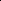

# S2-Boost: Synergistic Semantic Boosting for Coarse-to-Fine Ensemble Learning

<!-- Page 1 -->

S2-Boost: Synergistic Semantic Boosting for Coarse-to-Fine Ensemble Learning

Guanxiong He, Zheng Wang*, Jie Wang, Liaoyuan Tang, Rong Wang, Feiping Nie

School of Artificial Intelligence, Optics and Electronics (iOPEN), Northwestern Polytechnical University

Xi’an Shaanxi, 710072, P.R.China heguanx@mail.nwpu.edu.cn, zhengwangml@gmail.com, jiewang.dl@mail.nwpu.edu.cn, tangly@mail.nwpu.edu.cn, wangrong07@tsinghua.org.cn, feipingnie@gmail.com

## Abstract

Neuroscientific evidence reveals that human visual recognition is not an instantaneous event but a hierarchical process, where the brain constructs a holistic perception by progressively integrating simple features like edges or texture into complex scenes. Ensemble learning successfully utilizes this principle, yet existing methods typically integrate models at the decision level, neglecting the rich, complementary information within the feature space itself and thus fundamentally limiting their potential. To address this, we introduce Synergistic Semantic Boosting (S2-Boosting), a framework that employs a self-supervised hierarchical semantic learning module to decompose an image into complementary, semantically meaningful parts autonomously. These parts guide a boosting procedure where a sequence of specialized learners, each focusing on a specific semantic partition, collaboratively corrects the ensemble’s errors. We further present encouraging results on real-world image datasets, highlighting the intrinsic interpretability, paving the way for more robust and transparent models.

## Introduction

Human visual object recognition is a remarkably effective hierarchical process, where the brain deciphers complex scenes not in a single step, but by progressively integrating rudimentary features like edges and textures into representations of object parts and, ultimately, holistic concepts (Di- Carlo, Zoccolan, and Rust 2012). This principle of achieving robust understanding through the synthesis of multiple, simpler analyses finds a powerful parallel in machine learning’s ensemble paradigms. Techniques like bagging and boosting, which aggregate outputs from multiple models (Popov, Morozov, and Babenko 2020), have become a cornerstone for enhancing generalization and robustness, naturally evolving into deep ensemble learning with the advent of powerful neural networks (Wu 2024). However, a critical disconnect from this cognitive comprehension emerges in their application to vision: current deep ensemble methods operate on the final, monolithic feature embeddings produced by a model (Jiang et al. 2021; Liu et al. 2023). By treating this rich representation as an unstructured vector akin to tabular data,

*Corresponding author. Copyright © 2026, Association for the Advancement of Artificial Intelligence (www.aaai.org). All rights reserved.

Leaf scar

First Impression

(a)

(b) (c) (d) (e)

(f)

Coarse-to-Fine

Sul Butterfly Leaf scar

Mantis Locust Bugs tentacles legs head

Semantic

Fusion

**Figure 1.** Construction process of human visual perception. Starting with a coarse, holistic view, (a) can lead to a misidentification of “leaf”. Through progressively considering isolated “fine” details in the bottom panel, incorrect but closer classifications can be obtained. The correct identification of “Sulphur Butterfly” is finally achieved only by integrating the initial coarse perception with the full set of synergistic semantic details.

they disregard the very spatial hierarchy and semantic relationships that make biological vision so powerful. This approach not only leads to suboptimal performance but also obscures the decision-making process, making it difficult to understand how individual learners contribute to the collective output.

In stark contrast, human visual cognition offers a powerful solution for resolving ambiguity, a process vividly illustrated in Fig.1. The key insight from this example is not simply that scenes are decomposable, but that robust perception is a dynamic process of synthesis (Pennick and Kana 2021; Von Seth et al. 2023). It highlights the limitations of relying on either a single monolithic glance or isolated details alone. This cognitive strategy, where an initial, coarse hypothesis is iteratively corrected and refined by integrating multiple, complementary semantic parts, finds a strong theoretical parallel in the error-correcting nature of ensemble

The Fortieth AAAI Conference on Artificial Intelligence (AAAI-26)

21610

AI-readable visual equivalent, added: Figure extracted from the paper PDF and converted to an SVG wrapper asset. Use the surrounding page text and caption for interpretation.

AI-readable visual equivalent, added: Figure extracted from the paper PDF and converted to an SVG wrapper asset. Use the surrounding page text and caption for interpretation.

AI-readable visual equivalent, added: Figure extracted from the paper PDF and converted to an SVG wrapper asset. Use the surrounding page text and caption for interpretation.

AI-readable visual equivalent, added: Figure extracted from the paper PDF and converted to an SVG wrapper asset. Use the surrounding page text and caption for interpretation.

AI-readable visual equivalent, added: Figure extracted from the paper PDF and converted to an SVG wrapper asset. Use the surrounding page text and caption for interpretation.

AI-readable visual equivalent, added: Figure extracted from the paper PDF and converted to an SVG wrapper asset. Use the surrounding page text and caption for interpretation.

AI-readable visual equivalent, added: Figure extracted from the paper PDF and converted to an SVG wrapper asset. Use the surrounding page text and caption for interpretation.

AI-readable visual equivalent, added: Figure extracted from the paper PDF and converted to an SVG wrapper asset. Use the surrounding page text and caption for interpretation.

<!-- Page 2 -->

flatten

Ensemble

Perd wing legs antenna

Semantic

Boosting

Tradition ensemble

Deep ensemble

⋅⋅⋅

⋅⋅⋅ ⋅⋅⋅

𝑬𝑬

𝑫𝑫

𝑬𝑬𝒘𝒘

𝑬𝑬𝒉𝒉

𝑬𝑬𝒍𝒍

𝑬𝑬𝒂𝒂

•••

Learners 𝒑𝒑𝟏𝟏 𝒑𝒑𝟑𝟑

𝑷𝑷

•••

••• 𝑷𝑷 𝒑𝒑𝟑𝟑 𝒑𝒑𝟐𝟐 𝒑𝒑𝟏𝟏 𝒑𝒑𝟐𝟐

•••

Random Selection head

**Figure 2.** Conventional vs. Semantic-Guided Ensembles. Top: Learners are applied to original features. Bottom: Learners are guided by semantic partitions decomposed from the image.

boosting (Wu et al. 2021), providing a compelling motivation to design a framework that learns not from a black-box vector, but from a structured, coarse-to-fine analysis.

To operationalize this strategy, we leverage two key paradigms. The first is the self-supervised module that learns deep contextual relationships by reconstructing masked image patches (Zhang, Wang, and Wang 2022; Li et al. 2022). Crucially, as shown in Fig.2, this mechanism can be precisely directed: by supplying a semantic mask instead of a random one, we can compel the model to learn a specialized representation for a specific object part. The second is boosting module, which provides a principled framework for sequentially combining these specialized learners (Mienye and Sun 2022), ensuring they develop complementary expertise by focusing on the errors of the existing ensemble.

Building on this foundation, we introduce Synergistic Semantic Boosting (S2-Boosting), a novel framework that operationalizes this part-based reasoning. The primary challenge lies in finding a visual analogue to words, a nontrivial task of decomposing an image into its semantic constituents without supervision. Our framework addresses this through two synergistic components. First, a Self-supervised Progressive Semantic Learning Module (SPSLM) generates these semantic tokens by using cross-attention mechanisms to produce part-based attention maps. To ensure these discovered parts are semantically meaningful, they are validated through a rigorous reconstruction task within a conditional diffusion model. Second, a Semantic Boosting Module (SBM) uses these validated masks to orchestrate a sequence of lightweight Masked Autoencoders (MAEs) as base learners. In this module, each MAE is guided to focus on one semantic partition, learning a specialized representation while sequentially correcting the residual errors of the overall ensemble, effectively building a powerful and inherently interpretable model from the ground up.

Our contributions include: 1) We introduce S2-Boosting, a novel method that operationalizes the human cognitive strategy of coarse-to-fine understanding by unifying partbased semantic decomposition with the iterative, errorcorrecting power of the boosting paradigm. 2) We design a unique Semantic Boosting Mechanism that is guided by masks from our self-supervised hierarchical semantic discovery module to sequentially build a robust and accurate representation. 3) We provide a theoretical justification from an information-theoretic perspective, demonstrating that this strategy both reduces the representational redundancy for each base learner and ensures the systematic aggregation of complementary information, in direct correspondence with the chain rule of mutual information.

Related Works Masked Autoencoder for Visual Learning MAE (He et al. 2022) revolutionized self-supervised learning by adapting masked language modeling (Devlin et al. 2019) to computer vision. The core idea is to mask a large portion of an image and train an asymmetric Vision Transformer (ViT) (Dosovitskiy et al. 2021) to reconstruct the pixels, forcing the model to learn a holistic contextual understanding. While this approach is computationally efficient, its initial random masking strategy treats all image regions as equally important. Recognizing this limitation, subsequent works have proposed semantically aware masking strategies (Chen et al. 2023; Zhang, Wang, and Wang 2022). For instance, SemMAE (Li et al. 2022) learns to focus masking on important objects, while AutoMAE (Shin et al. 2024) targets high-information regions. These advancements confirm that guiding the masking process toward salient regions enables MAE to learn superior semantic representations (Kong et al. 2023).

However, there is still a critical limitation: these approaches still optimize for a single, monolithic representation by identifying one set of “important” regions rather than a diverse set of complementary parts that collectively define an object’s full meaning. Our work addresses this gap by introducing a framework that systematically decomposes an image and learns from its constituent parts in a coordinated, ensemble fashion.

Deep Ensemble Learning To address the limitations of traditional ensemble methods on complex, unstructured data (Popov, Morozov, and Babenko 2020; Wu 2024), deep ensemble learning has emerged. These approaches integrate powerful feature extractors from models like CNNs (Das 2022), ViTs (Cui et al. 2024), and diffusion models (Balaji et al. 2022) with classical ensemble paradigms. Implementations can be explicit, where deep models act as feature extractors for subsequent aggregation (Lee et al. 2017; Borandag 2023; Zeynali, Seyedarabi, and Afrouzian 2023), or implicit, embedding mechanisms like specialized backpropagation (He et al. 2025) or dropout (Zhang et al. 2020; Momeni, Thibault,

21611

AI-readable visual equivalent, added: Figure extracted from the paper PDF and converted to an SVG wrapper asset. Use the surrounding page text and caption for interpretation.

AI-readable visual equivalent, added: Figure extracted from the paper PDF and converted to an SVG wrapper asset. Use the surrounding page text and caption for interpretation.

<!-- Page 3 -->

and Gevaert 2019) directly into the learning framework. The overarching goal is to balance specialization and diversity, often drawing inspiration from human cognition to improve performance and plausibility (Cho, Kr¨ahenb¨uhl, and Ramanathan 2023; Hinton 2023).

However, a critical limitation persists: these methods treat the final, monolithic feature embedding as an unstructured “black box,” ignoring the image’s intrinsic spatial hierarchy and semantic composition. This leaves boosting algorithms without the explicit guidance needed to ensure learners focus on complementary and conceptually distinct regions. As a result, the ensemble is limited in its ability to form a truly synergistic and expert committee.

Condition Diffusion Generative Model The conditional reconstruction task, where image embeddings are decoded with the constraint of specified conditions, has been explored through various generative architectures. While models like StyleGAN (Karras et al. 2020) excel at synthesizing high-fidelity images by manipulating disentangled latent codes for global style control, they offer less direct and granular influence when the condition requires precise spatial or semantic adherence. In contrast, conditional diffusion models (Rombach et al. 2022) are uniquely suited for this role. Their iterative denoising process, often built on a U-Net architecture, provides a natural framework to inject external guidance through mechanisms like crossattention layers (Zhang, Rao, and Agrawala 2023). This allows conditioning variables to steer the generation at multiple scales, ensuring the output faithfully aligns with the desired structure. This ability to directly integrate detailed semantic constraints makes conditional diffusion a superior foundation for our reconstruction objectives (Wei et al. 2023; Li et al. 2024).

## Methodology

Synergistic Semantic Boosting To address the limitations of existing methods, where semantic-aware MAEs generate general representations and boosting treats image features as an unstructured black box, we propose S2-Boosting. Our framework bridges this gap by unifying the part-based learning of MAEs with the structured, drawing inspiration from the human cognitive strategy of understanding scenes by integrating information from distinct semantic parts (Pennick and Kana 2021; Von Seth et al. 2023). Specifically, we define semantics as an instancespecific concept focused on discovering a set of functionally distinct and informationally complementary regions that are vital for reconstructing the whole object. This approach ensures that the identified ”parts” are not just arbitrary segments but are meaningful components that contribute uniquely to the overall understanding of the image.

S2-Boosting operationalizes this part-to-whole strategy through a novel two-stage process with the structure shown in Fig.3. First, our SPSLM automatically discovers complementary, semantically meaningful regions within an image, generating a unique mask for each. Second, these masks guide the SBM, where an ensemble of lightweight learners is trained sequentially. Each learner is explicitly tasked with focusing on a single semantic part to correct the residual errors of the preceding ensemble. In the following subsections, we detail the SPSLM architecture, formulate the boosting dynamics within the SBM, and provide a theoretical analysis of our approach.

Self-supervised Progressive Semantic Learning The SPSLM overcomes the limitation of lacking visual understanding grounded in semantic decompositions by autonomously discovering interpretable part-based hierarchies, without the need for segmentation labels. Technically, SPSLM can be divided into three parts: a pretrained ViT module for image tokenization, a part projection module for part-level attention map generation, and a conditional diffusion module for semantic optimization restriction.

Given the input image I, we employ the Image BERT Pre-training model (iBOT) (Zhou et al. 2022a) for the Hierarchical Tokenization Mechanism. The image is partitioned into P 2 patches, resulting in corresponding tokens processed through the iBOT encoder fibot. This generates two complementary representations: patch tokens Tp ∈Rp2×d encoding localized visual semantics, and global token Tg ∈Rd encapsulating instance-level abstraction. Here d denotes the latent space dimensionality, where Tp maintains spatial patch embeddings while Tg preserves instance-level image semantics.

Following the pretrained extraction, the Semantic Part Projection generates interpretable part-based representations through the following synergistic operations:

1) Semantic-Guided Part Tokenization: The global token Tg is transformed into K part-specific semantic anchors:

Ts = W2 · σ(W1 · Tg), (1)

where W1 ∈R4d×d and W2 ∈RKd×4d are projection matrices and σ means the LeakyReLU function for non-linear activation. Through this projection, Ts ∈RK×d obtain K semantic part tokens T p s ∈Rd, which are used for subsequent semantic response discovery.

2) Semantic Attention Generation: Patch tokens Tp are restructured into a spatial features tensor F ∈Rd×p×p to restore the 2D spatial context from the flattened patch sequence. This is essential for generating spatially coherent semantic masks, and these features are projected via a residual convolution:

Fp = σ(Wconv ∗F + Wres ∗F). (2)

These spatially aware features Fp then interact with projected part tokens through channel-wise correlation:

Rk,i,j = γ d X c=1

(T [k,c]

s · F[c,i,j] p), (3)

where k responding to semantic part ID, i, j are the locations and γ is the scalar parameter for stabilized optimization.

Finally, the Semantic Attention Maps (SAM) Mp can be obtained with multi-scale convolutional refinement from R. Through this, human-aligned part semantics without supervision can be discovered.

21612

<!-- Page 4 -->

Positional

Encoding

⋅⋅⋅

⋅⋅⋅

Tokenization Multi-Head

Attention MLP

[Patch] [Patch] [Patch]

[CLS]

Patch Token

Global Token [SPT]

SAM 𝝉𝝉

Semantic Part Token

… 𝒑𝒑𝒆𝒆𝒆𝒆𝒆𝒆

Semantic Mask Boosting

Pre-trained ViT

Semantic Parts Learning

Attention

Condition Embed

Frozen

Trainable 𝒑𝒑𝟏𝟏 𝒑𝒑𝑲𝑲

Logits

𝑬𝑬

Mask 𝝉𝝉

••• 𝒆𝒆𝟏𝟏 𝒆𝒆𝑲𝑲 𝒈𝒈𝑲𝑲 𝒈𝒈𝟏𝟏

Condition Diffusion

Noise

Condition

SGP

**Figure 3.** An overview of the proposed S2-Boosting framework. The process consists of three main stages: (1) A pretrained ViT extracts initial patch tokens from the input image. (2) The SPSLM then generates a set of SAMs, with their semantic validity enforced by their ability to guide a conditional diffusion model in denoising. (3) Finally, the SBM uses these SAMs as masks to orchestrate a sequence of base learners, progressively building a powerful composite embedding that is optimized for both reconstruction and final downstream tasks.

3) Conditional Diffusion Reconstruction: To enforce the semantic integrity of the learned part tokens, we validate them by guiding a conditional diffusion process. To ensure this semantic guidance is effective and not ignored by the model, we employ Classifier-Free Guidance (CFG) (Ho and Salimans 2021). The key to CFG is training the U-Net on a mix of conditional (using our part tokens) and unconditional (using a null token) denoising objectives. Specifically, for a given image I, its latent representation z0 is corrupted to zt via the forward process:

zt = √¯αtz0 +

√

1 −¯αtϵ. (4)

The U-Net is then trained to predict the noise ϵ from the noisy latent zt. The key to CFG is that the condition c is stochastically set to either the projected part tokens ϕ(Ts) or the null token c = ∅. Then the model is optimized via the single-step noise prediction loss, which facilitates straightforward end-to-end training and serves as a component of our overall objective:

Ldiff = Et,z0,ϵ,c

||ϵ −UNet(zt, t, c)||2

2

. (5)

Such a training scheme enables explicit and tunable guidance during the reverse process. By steering the prediction away from the unconditional estimate and towards the conditional one, we control the influence of our semantic tokens. The final noise prediction ¯ϵt used for denoising is a linear extrapolation of the two learned outputs:

˜ϵt = ˆϵt(zt, t, ∅) + η · (ˆϵt(zt, t, ϕ(Ts)) −ˆϵt(zt, t, ∅)), (6)

where η is a guidance scale that modulates the strength of the semantic conditioning. A successful denoising process under this strict guidance serves as robust validation that the tokens Ts have effectively captured the essential concepts of the image, making them a reliable foundation for the subsequent boosting stage.

4) Compound Loss Optimization: To train SPSLM in an end-to-end manner, we optimize a composite loss that balances the accuracy of the conditional denoising process with part diversity and spatial compactness:

L = Ldiff | {z } Construction

+λdiv Ldiv |{z} Diversity

+λctr Lctr |{z} Center

, (7)

where three loss are combined through hyperparameters λdiv and λctr.

Diffusion Reconstruction Loss Ldiff measures the error between the predicted and true noise across timesteps.

Diversity Loss Ldiv penalizes high cosine similarity between part tokens so that each semantic anchor occupies a distinct direction in latent space:

Ldiv = 2 K(K −1)

X i<j

T i x · T j x ||T ix|| · ||T j x ||

. (8)

Center Loss Lstr encourages each attention map M k p to concentrate around its learned centroid:

Lctr = 1

K

K X k=1

X

(i,j)∈Ak

M k p (i, j)||Pij −Ck||2

2, (9)

where Ak is the coordinate set of salient elements in M k p, Pij is the elements location and Ck is the centroid of the salient area Ak.

21613

AI-readable visual equivalent, added: Figure extracted from the paper PDF and converted to an SVG wrapper asset. Use the surrounding page text and caption for interpretation.

<!-- Page 5 -->

By jointly minimizing the three components, PSLM learns to discover a set of diverse and spatially compact semantic parts. The conditional denoising task validates that these discovered parts are semantically meaningful, as they must be sufficient to guide the generative process, all without requiring explicit segmentation labels.

Semantic Boosting Module The SBM leverages semantic masks {M k p }K k=1 generated by SPSLM to progressively build a unified embedding representation through dual-task optimization. The sequence of semantic masks is sorted by mean activation intensity to mimic a coarse-to-fine perceptual strategy. This guides learners to focus first on broad regions and then on details, an approach that empirically outperforms random ordering.

Shown in Fig.3, SBM operates through K sequential stages, with the aim to learn a cumulative embedding extractor EK = PK j=1 αjej which focuses on a specific semantic region defined by Mp and can lead to better downstream task (classification) performance. This architecture mimics human visual cognition by learning from part-to-whole relationships while enforcing cross-task consistency.

To capture the region-focused embeddings, MAE sequentially recovers image details from the most salient semantic part to the complete instance. At the k-th stage, the masked input is formed by element-wise multiplication:

Ik

M = I ⊗M k p. (10)

The shared feature extractor processes this masked input to generate focused features f k m = Ek(Ik

M). These features are then fed to the reconstruction head:

ˆIk = Gk−1 + αkgk(f k m), (11)

with Gk−1 = Pk−1 j=1 αjgj(f j m) reconstructing the original image I from the masked feature in the k-th and previous steps, and gk means the k-th reconstruction model. The reconstruction follows gradient boosting principles, targeting the residual region:

Lrec = ||I −ˆIk||2

2. (12)

For classification tasks, SBM implements gradient boosting dynamics in output space through additive logits. At stage k, the classification head produces logit hk(f k o) with hk the lightweight MLP and f k o = Ek(I). These ensemble predictions across stages:

pk = Softmax(Hk−1(I) + αkhk(I)). (13)

As the boosting classification mechanism minimizes crossentropy loss:

Lcls = CE(pk, y), (14) which means hk mimics gradient descent in output space:

hk ≈−∇Hk−1Lk−1 cls, (15)

satisfying the first-order condition for loss reduction

The entire framework of SBM is optimized end-to-end via a composite loss balancing both objectives:

Lk tot = λrec · Lrec + λcls · Lcls, (16)

with λrec, λcls balancing task importance. The gradients propagate through all components, which creates synergistic pressure to reconstruct geometric details within semantic regions while enhancing the classification discrimination.

Principled Semantic Decomposition The efficacy of S2-Boosting relies on its ability to learn a set of features that are inherently complementary and compatible. This ensures that the model builds a coarse-tofine understanding by progressively integrating information from global context down to local details, a process fundamentally consistent with human visual cognition. For our model to be justified, we now demonstrate from a theoretical perspective of Variational Information Bottleneck (VIB) (Tishby, Pereira, and Bialek 2000; Alemi et al. 2016).

The goal of supervised learning, as defined by VIB, is to learn a compressed representation R of a high-dimensional input X that is maximally informative about a target label Y. This is formalized as a trade-off between predictive power and compression, governed by the objective:

max

R I(R; Y) −β · I(R; X), (17)

where I(·; ·) denotes the mutual information, I(R; X) measures the representation’s relevance for the task, while I(R; Y) measures the semantic relevance for predicting Y.

By decomposing the image I into K semantic parts {I1

M,..., IK

M}, S2-Boosting turns this one hard problem into a series of easier ones. This has two key advantages:

1) Reducing Representational Redundancy: Each semantic part Ik

M has lower entropy (He) than the full image (He(Ik

M) ≪He(I)). By limiting each base learner to a lowentropy region, the VIB trade-off simplifies significantly:

max

Rk I(Rk; Y) −β · I(Rk; Ik

M). (18)

Constraining the input space acts as a strong regularizer, reducing the risk of overfitting to spurious correlations and making minimization of I(Rk; Ik

M) more effective. This aligns with the principle of entropy minimization, which mitigates noise from irrelevant information (Li et al. 2025).

2) Systematic Information Aggregation: The total information about Y provided by all parts follows the chain rule of mutual information:

I(X1,..., XK; Y) =I(X1; Y) + I(X2; Y |X1) +...

+I(XK; Y |X1,..., Xk−1).

(19) This equation shows that total information is the sum of the information from the first part, plus the new information from the second part, and so on.

Our boosting process directly mimics this. The first learner captures the most obvious information I(I1

M; Y). Subsequent learners, by training on the errors of the previous ones, are naturally guided to capture the new, conditional information I(Ik

M; Y |I1

M,..., Ik−1

M) from the next part. By solving a sequence of easier problems, S2-Boosting builds a final representation that is more robust and accurate than a single model trying to solve the hard problem all at once (Luo et al. 2019).

21614

<!-- Page 6 -->

## Method

Base CIFAR-10 CIFAR-100 ImageNet-1K

Top-1 Acc. (%) Top-1 Acc. (%) Top-1 Acc. (%) Top-5 Acc. (%)

Base Models

ViT (Dosovitskiy et al. 2020) ViT-B 98.95 91.67 83.97 95.28 ViT-L 99.16 92.44 85.15 96.13 BEiT (Bao et al. 2022) ViT-B - 90.10 83.2 - DeiT (Touvron et al. 2021) ViT-B 99.10 91.30 83.4 -

Mask guided Baselines

MAE (He et al. 2022) ViT-B 98.20 87.60 83.6 95.1 ViT-L 99.42 93.31 85.9 96.2 iBOT (Zhou et al. 2022b) ViT-B 99.20 92.20 84.0 - SemMAE (Li et al. 2022) ViT-L - - 84.5 96.5 DiffMAE (Wei et al. 2023) ViT-L - - 88.1 97.8 SGMAE (Shin et al. 2024) Vit-B 99.27 90.00 83.2 96.0

Ensemble Methods

XgBoost (Chen and Guestrin 2016) ViT-S 97.71 90.02 80.73 94.06 ViT-L 98.89 93.04 84.03 95.82

LightGBM (Ke et al. 2017) ViT-S 97.40 84.25 78.28 93.61 ViT-L 98.13 90.62 82.57 95.35

BoostForest (Zhao et al. 2023) ViT-S 98.67 91.21 83.54 94.87 ViT-L 99.14 92.49 84.07 95.14

Re-Boosting (He et al. 2025) ViT-S 98.92 91.42 83.85 95.44 ViT-L 99.24 92.86 84.71 96.39

Our Proposed Method

S2-Boosting (Ours) ViT-S 99.18 92.69 84.52 96.77 ViT-L 99.51 93.47 88.35 98.03

**Table 1.** Performance comparison with state-of-the-art methods on CIFAR-10, CIFAR-100 and ImageNet-1K. All results are reported as Top-1 accuracy, with Top-5 also included for ImageNet. The best results are highlighted in bold.

## Experiment

## Experiment

Setting

Hardware and Software: All experiments were conducted on a server equipped with four NVIDIA RTX 3090 GPUs. Our framework is implemented using PyTorch 2.6.

Dataset: We evaluate our method’s effectiveness and generalization capabilities on standard image classification benchmarks. Including CIFAR-10/100, which contain 60,000 images across 10/100 classes respectively. Besides, to test scalability on more complex data, we also use the large-scale ImageNet-1K benchmark (Deng et al. 2009), which contains over 1.2 million training images spanning 1000 diverse categories.

## Model

Architecture: For CIFAR, we employ a lightweight, fully trainable framework: the SPSLM uses TinyViT and a small diffusion model trained from scratch, while the SBM uses equally lightweight MAEs as weak learners. For ImageNet, we leverage powerful pre-trained models: the SPSLM uses a frozen iBOT (ViT-L/16) and fine-tunes the U-Net from a pre-trained Stable Diffusion v1.4, while the SBM fine-tunes a pre-trained DeiT-Tiny as a more capable base learner for each boosting stage.

Training Hyperparameters: Across all experiments, the AdamW optimizer is used. The initial learning rate is set to 1e-4 for modules trained from scratch and fine-tuning pretrained modules. Key loss-balancing hyperparameters are set empirically: the number of semantic parts K = 6, reconstruction weight λrec = 1.0, diversity weight λdiv = 0.1, and center weight λctr = 0.1.

Comparision Experiment

As detailed in Table.1, we benchmark S2-Boosting against three distinct categories of state-of-the-art methods: foundational Base ViT models; advanced Mask-guided Baselines which learn a single semantic representation; and various Deep Ensemble models, including those that apply traditional boosting to unstructured deep features. For several advanced baselines, namely BEiT, DeiT, iBOT, Sem- MAE, and DiffMAE, we report the performance metrics as published in their original papers to ensure a fair and direct comparison. The results demonstrate the superiority of our proposed framework. With a ViT-L backbone, S2- Boosting consistently achieves the highest Top-1 accuracy across all datasets, reaching 93.47% on CIFAR-100 and 88.35% on ImageNet-1K. This superior performance highlights the unique advantage of our design. While standard ensembles offer modest gains over their base models, they

21615

<!-- Page 7 -->

ID Model Configuration Top-1 Top-5

(a) Full Model 88.35 98.03

(b) w/o Boosting 76.73 89.71

(c) w/ Random Grid Masks 85.07 95.89

(e) SPSLM w/o Ldiv and Lctr 83.35 95.75

(d) SBM w/o (Lrec) 81.37 94.14

**Table 2.** Ablation studies on the Imagenet dataset. The full model serves as the baseline for comparison.

are limited by their failure to exploit the image’s semantic structure. Conversely, while powerful single models like DiffMAE effectively use semantic information, they lack the collaborative, error-correcting power of boosting. S2- Boosting excels by synergistically unifying these two principles, guiding an iterative boosting process with semantic part discovery to construct a more robust and accurate final model that outperforms all competing approaches.

Ablation Studies

We conducted a series of ablation studies on ImageNet-1K, as detailed in Table.2, to dissect the contribution of each key component of S2-Boosting. The indispensable role of the boosting mechanism is starkly evident in model (b), where its removal causes a catastrophic drop in accuracy to 76.73%, confirming that a simple ensemble is insufficient. Furthermore, the importance of semantic guidance is validated by model (c); replacing our learned masks with simple random grid masks degrades performance to 85.07%, proving that guiding learners with meaningful partitions is crucial. The integrity of our two main modules is also critical. Disabling the mask quality objectives (Ldiv, Lctr) in the SP- SLM or the reconstruction loss (Lrec) in the SBM leads to significant performance declines. Collectively, these results affirm that the success of S2-Boosting arises from the tightly integrated synergy between its semantic decomposition and the iterative, error-correcting boosting process.

Robustness to Partial Occlusion

To evaluate our model’s resilience, we tested its performance on ImageNet-1K under increasing levels of random patch occlusion, with results shown in Table.3. S2-Boosting consistently and significantly outperforms the baseline ViT-L across all conditions. Notably, even with 50% of the image occluded, our model maintains an impressive 75.61% accuracy, a level the standard ViT fails to achieve even at just 20% occlusion. This superior robustness is a direct benefit of our ensemble design. Unlike a monolithic model where occlusion can corrupt the entire global representation, S2- Boosting can still rely on specialized learners whose corresponding semantic parts remain visible, allowing it to make a robust final prediction even with incomplete information.

## Method

Occlusion Patch Size

0 5% 10% 20% 50%

ViT-L/16 83.97 82.36 81.49 77.88 60.37 S2-Boosting 88.35 87.96 86.41 82.19 75.61

ViT Drop - 1.61 2.48 6.09 23.60 Our Drop - 0.39 1.94 6.16 12.74

**Table 3.** Top-1 Accuracy (%) on ImageNet-1K under varying levels of random patch occlusion.

Ori P1 P2 P3 P4 P5 P6

**Figure 4.** Visualization of S2-Boosting’s interpretable, coarse-to-fine learning strategy. For each object, the model first identifies a broad, salient region before sequentially focusing on smaller, complementary semantic details.

Visualization of Semantic Progressive Boosting To provide evidence of our model’s intrinsic interpretability, Fig.4 visualizes the semantic decomposition process on various ImageNet samples. For each object, the initial learner correctly identifies a large, general region that is most salient for classification with the guidance of pretrained ViT models, such as the wings of the butterfly or the main body of the hamster. Subsequent learners in the boosting sequence then progressively focus on smaller, complementary, and semantically coherent parts, such as the butterfly’s antennae, the fly’s eyes, the fish’s fins, and the rooster’s beak. Instead of merely finding a single important area, this structured decomposition into diverse, meaningful components provides clear insight into how the final prediction is constructed by aggregating specialized part-based knowledge.

## Conclusion

In this work, we propose S2-Boosting, a framework that unifies a cognitive coarse-to-fine strategy with the errorcorrecting power of ensemble boosting. Our approach achieved superior performance, interpretability, and robustness to occlusion. Its primary limitation is the computational overhead from its sequential ensemble learning and generative components. Future work will focus on enhancing efficiency via distillation and parameter sharing.

21616

<!-- Page 8 -->

## Acknowledgments

This work was supported by the National Natural Science Foundation of China under Grant 62406250, 62236001, 62576277 and the Fundamental Research Funds for the Central Universities.

## References

Alemi, A. A.; Fischer, I.; Dillon, J. V.; and Murphy, K. 2016. Deep variational information bottleneck. arXiv preprint arXiv:1612.00410. Balaji, Y.; Nah, S.; Huang, X.; Vahdat, A.; Song, J.; Zhang, Q.; Kreis, K.; Aittala, M.; Aila, T.; Laine, S.; et al. 2022. ediff-i: Text-to-image diffusion models with an ensemble of expert denoisers. arXiv preprint arXiv:2211.01324. Bao, H.; Dong, L.; Piao, S.; and Wei, F. 2022. BEiT: BERT Pre-Training of Image Transformers. In International Conference on Learning Representations. Borandag, E. 2023. Software fault prediction using an RNNbased deep learning approach and ensemble machine learning techniques. Applied Sciences, 13(3): 1639. Chen, H.; Zhang, W.; Wang, Y.; and Yang, X. 2023. Improving masked autoencoders by learning where to mask. In Chinese Conference on Pattern Recognition and Computer Vision (PRCV), 377–390. Springer. Chen, T.; and Guestrin, C. 2016. Xgboost: A scalable tree boosting system. In Proceedings of the 22nd acm sigkdd international conference on knowledge discovery and data mining, 785–794. Cho, J. H.; Kr¨ahenb¨uhl, P.; and Ramanathan, V. 2023. Partdistillation: Learning parts from instance segmentation. In Proceedings of the IEEE/CVF Conference on Computer Vision and Pattern Recognition, 7152–7161. Cui, Y.; Liu, P.; Ma, Y.; Chen, L.; Xu, M.; and Guo, X. 2024. Pixel-Wise Ensembled Masked Autoencoder for Multispectral Pan-Sharpening. IEEE Transactions on Geoscience and Remote Sensing. Das, A. 2022. Adaptive UNet-based lung segmentation and ensemble learning with CNN-based deep features for automated COVID-19 diagnosis. Multimedia Tools and Applications, 81(4): 5407–5441. Deng, J.; Dong, W.; Socher, R.; Li, L.-J.; Li, K.; and Fei- Fei, L. 2009. Imagenet: A large-scale hierarchical image database. In 2009 IEEE conference on computer vision and pattern recognition, 248–255. Ieee. Devlin, J.; Chang, M.-W.; Lee, K.; and Toutanova, K. 2019. Bert: Pre-training of deep bidirectional transformers for language understanding. In Proceedings of the 2019 conference of the North American chapter of the association for computational linguistics: human language technologies, volume 1 (long and short papers), 4171–4186. DiCarlo, J. J.; Zoccolan, D.; and Rust, N. C. 2012. How does the brain solve visual object recognition? Neuron, 73(3): 415–434. Dosovitskiy, A.; Beyer, L.; Kolesnikov, A.; Weissenborn, D.; Zhai, X.; Unterthiner, T.; Dehghani, M.; Minderer, M.; Heigold, G.; Gelly, S.; et al. 2020. An image is worth 16x16 words: Transformers for image recognition at scale. arXiv preprint arXiv:2010.11929. Dosovitskiy, A.; Beyer, L.; Kolesnikov, A.; Weissenborn, D.; Zhai, X.; Unterthiner, T.; Dehghani, M.; Minderer, M.; Heigold, G.; Gelly, S.; et al. 2021. An Image is Worth 16x16 Words: Transformers for Image Recognition at Scale. In International Conference on Learning Representations. He, G.; Wang, Z.; Tang, L.; Yu, W.; Nie, F.; and Li, X. 2025. Reweighted-Boosting: A Gradient-Based Boosting Optimization Framework. IEEE Transactions on Neural Networks and Learning Systems, 36(7): 11953–11965. He, K.; Chen, X.; Xie, S.; Li, Y.; Doll´ar, P.; and Girshick, R. 2022. Masked autoencoders are scalable vision learners. In Proceedings of the IEEE/CVF conference on computer vision and pattern recognition, 16000–16009. Hinton, G. 2023. How to represent part-whole hierarchies in a neural network. Neural Computation, 35(3): 413–452. Ho, J.; and Salimans, T. 2021. Classifier-Free Diffusion Guidance. In NeurIPS 2021 Workshop on Deep Generative Models and Downstream Applications. Jiang, Z.; Dong, Z.; Wang, L.; and Jiang, W. 2021. Method for diagnosis of acute lymphoblastic leukemia based on ViT- CNN ensemble model. Computational Intelligence and Neuroscience, 2021(1): 7529893. Karras, T.; Laine, S.; Aittala, M.; Hellsten, J.; Lehtinen, J.; and Aila, T. 2020. Analyzing and improving the image quality of stylegan. In Proceedings of the IEEE/CVF conference on computer vision and pattern recognition, 8110–8119. Ke, G.; Meng, Q.; Finley, T.; Wang, T.; Chen, W.; Ma, W.; Ye, Q.; and Liu, T.-Y. 2017. Lightgbm: A highly efficient gradient boosting decision tree. volume 30. Kong, L.; Ma, M. Q.; Chen, G.; Xing, E. P.; Chi, Y.; Morency, L.-P.; and Zhang, K. 2023. Understanding masked autoencoders via hierarchical latent variable models. In Proceedings of the IEEE/CVF Conference on Computer Vision and Pattern Recognition, 7918–7928. Lee, I.; Kim, D.; Kang, S.; and Lee, S. 2017. Ensemble deep learning for skeleton-based action recognition using temporal sliding lstm networks. In Proceedings of the IEEE international conference on computer vision, 1012–1020. Li, G.; Zheng, H.; Liu, D.; Wang, C.; Su, B.; and Zheng, C. 2022. Semmae: Semantic-guided masking for learning masked autoencoders. Advances in Neural Information Processing Systems, 35: 14290–14302. Li, J.; Wang, Y.; Zhang, X.; Jiang, D.; Dai, W.; Li, C.; Xiong, H.; and Tian, Q. 2025. Contrastive Learning via Variational Information Bottleneck. IEEE Transactions on Pattern Analysis and Machine Intelligence. Li, Z.; Xue, Z.; Jia, M.; Nie, X.; Wu, H.; Zhang, M.; and Su, H. 2024. DEMAE: Diffusion Enhanced Masked Autoencoder for Hyperspectral Image Classification With few Labeled Samples. IEEE Transactions on Geoscience and Remote Sensing, 62: 1–16. Liu, J.; Guo, H.; He, Y.; and Li, H. 2023. Vision transformerbased ensemble learning for hyperspectral image classification. Remote Sensing, 15(21): 5208.

21617

<!-- Page 9 -->

Luo, Y.; Liu, P.; Guan, T.; Yu, J.; and Yang, Y. 2019. Significance-aware information bottleneck for domain adaptive semantic segmentation. In Proceedings of the IEEE/CVF international conference on computer vision, 6778–6787. Mienye, I. D.; and Sun, Y. 2022. A survey of ensemble learning: Concepts, algorithms, applications, and prospects. IEEE Access, 10: 99129–99149. Momeni, A.; Thibault, M.; and Gevaert, O. 2019. Dropoutenabled ensemble learning for multi-scale biomedical data. In Brainlesion: Glioma, Multiple Sclerosis, Stroke and Traumatic Brain Injuries: 4th International Workshop, BrainLes 2018, Held in Conjunction with MICCAI 2018, Granada, Spain, September 16, 2018, Revised Selected Papers, Part I 4, 407–415. Springer. Pennick, M. R.; and Kana, R. K. 2021. Specialization and integration of brain responses to object recognition and location detection. Brain and behavior, 2(1): 6–14. Popov, S.; Morozov, S.; and Babenko, A. 2020. Neural Oblivious Decision Ensembles for Deep Learning on Tabular Data. In International Conference on Learning Representations. Rombach, R.; Blattmann, A.; Lorenz, D.; Esser, P.; and Ommer, B. 2022. High-resolution image synthesis with latent diffusion models. In Proceedings of the IEEE/CVF conference on computer vision and pattern recognition, 10684– 10695. Shin, J.; Lee, I.; Lee, J.; and Lee, J. 2024. Self-Guided Masked Autoencoder. In The Thirty-eighth Annual Conference on Neural Information Processing Systems. Tishby, N.; Pereira, F. C.; and Bialek, W. 2000. The information bottleneck method. arXiv preprint physics/0004057. Touvron, H.; Cord, M.; Douze, M.; Massa, F.; Sablayrolles, A.; and J´egou, H. 2021. Training data-efficient image transformers & distillation through attention. In International conference on machine learning, 10347–10357. PMLR. Von Seth, J.; Nicholls, V. I.; Tyler, L. K.; and Clarke, A. 2023. Recurrent connectivity supports higher-level visual and semantic object representations in the brain. Communications Biology, 6(1): 1207. Wei, C.; Mangalam, K.; Huang, P.-Y.; Li, Y.; Fan, H.; Xu, H.; Wang, H.; Xie, C.; Yuille, A.; and Feichtenhofer, C. 2023. Diffusion models as masked autoencoders. In Proceedings of the IEEE/CVF International Conference on Computer Vision, 16284–16294. Wu, Y. 2024. From ensemble learning to deep ensemble learning: A case study on multi-indicator prediction of pavement performance. Applied Soft Computing, 166: 112188. Wu, Y.; Liu, L.; Xie, Z.; Chow, K.-H.; and Wei, W. 2021. Boosting ensemble accuracy by revisiting ensemble diversity metrics. In Proceedings of the IEEE/CVF Conference on Computer Vision and Pattern Recognition, 16469–16477. Zeynali, M.; Seyedarabi, H.; and Afrouzian, R. 2023. Classification of EEG signals using Transformer based deep learning and ensemble models. Biomedical Signal Processing and Control, 86: 105130.

Zhang, L.; Rao, A.; and Agrawala, M. 2023. Adding conditional control to text-to-image diffusion models. In Proceedings of the IEEE/CVF international conference on computer vision, 3836–3847. Zhang, Q.; Wang, Y.; and Wang, Y. 2022. How mask matters: Towards theoretical understandings of masked autoencoders. Advances in Neural Information Processing Systems, 35: 27127–27139. Zhang, W.; Jiang, J.; Shao, Y.; and Cui, B. 2020. Snapshot boosting: a fast ensemble framework for deep neural networks. Science China Information Sciences, 63(1): 112102. Zhao, C.; Wu, D.; Huang, J.; Yuan, Y.; Zhang, H.-T.; Peng, R.; and Shi, Z. 2023. BoostTree and BoostForest for ensemble learning. IEEE Transactions on Pattern Analysis and Machine Intelligence, 45(7): 8110–8126. Zhou, J.; Wei, C.; Wang, H.; Shen, W.; Xie, C.; Yuille, A.; and Kong, T. 2022a. Image BERT Pre-training with Online Tokenizer. In International Conference on Learning Representations. Zhou, J.; Wei, C.; Wang, H.; Shen, W.; Xie, C.; Yuille, A.; and Kong, T. 2022b. Image BERT Pre-training with Online Tokenizer. In International Conference on Learning Representations.

21618
