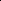
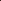

# SAGA: Learning Signal-Aligned Distributions for Improved Text-to-Image Generation

<!-- Page 1 -->

SAGA: Learning Signal-Aligned Distributions for Improved Text-to-Image

Generation

Paul Grimal1, Micha¨el Soumm2, Herv´e Le Borgne1, Olivier Ferret1, Akihiro Sugimoto3

1Universit´e Paris-Saclay, CEA, List, F-91120, Palaiseau, France 2T´el´ecom Paris 3National Institute of Informatics, Japan paul.grimal@cea.fr, soumm@telecom-paris.fr, herve.le-borgne@cea.fr, olivier.ferret@cea.fr, sugimoto@nii.ac.jp

## Abstract

State-of-the-art text-to-image models produce visually impressive results but often struggle with precise alignment to text prompts, leading to missing critical elements or unintended blending of distinct concepts. We propose a novel approach that learns a high-success-rate distribution conditioned on a target prompt, ensuring that generated images faithfully reflect the corresponding prompts. Our method explicitly models the signal component during the denoising process, offering finegrained control that mitigates over-optimization and out-ofdistribution artifacts. Moreover, our framework is training-free and seamlessly integrates with both existing diffusion and flow matching architectures. It also supports additional conditioning modalities – such as bounding boxes – for enhanced spatial alignment. Extensive experiments demonstrate that our approach outperforms current state-of-the-art methods.

Code — https://github.com/grimalPaul/gsn-factory

## Introduction

Despite significant progress of text-to-image (T2I) generative models (Rombach et al. 2022; Podell et al. 2024; Ramesh et al. 2022; Saharia et al. 2022; Esser et al. 2024), ensuring that generated images accurately reflect the user’s prompt remains a challenge. Textual alignment failures have been widely reported (Ramesh et al. 2022; Saharia et al. 2022; Chefer et al. 2023; Feng et al. 2023), where generated images fail to capture the semantic meaning of the target prompt accurately. Two types of inconsistencies are particularly challenging (Figure 1): catastrophic neglect, where central elements are omitted, and subject mixing, where distinct entities are incorrectly blended. These failures significantly impact user experience and limit the actual utility of T2I models.

To mitigate these issues, some approaches refine training data by improving captions (Chen et al. 2024; Segalis et al. 2023) or explore novel architectures (Peebles and Xie 2023). They nevertheless require retraining the entire model, which is computationally demanding. Alternatively, training-free methods based on inference-time optimization have been proposed to guide generation without requiring model retraining, relying on external knowledge from other models to guide

Copyright © 2026, Association for the Advancement of Artificial Intelligence (www.aaai.org). All rights reserved.

2 5 10 Model Size (billions, log scale)

35

40

45

50

55

60

65

70

Overall GenEval Performance

SDv2.1

DALL-E 2

Emu3-Gen SDXL

IF-XL

LWM

SEED-X

Janus

Transfusion JanusFlow

SD 1.4

SAGA (SD 1.4)

SAGA+ (SD 1.4)

SD 3

SAGA (SD 3)

Other Methods Base Models SAGA (Ours)

**Figure 1.** (Left) Text-image alignment issues on SD 3 vs. Ours. Subject mixing: the giraffe’s features are incorrectly applied to the dog for SD 3. Catastrophic neglect: the zebra is missing for SD 3. (Right) GenEval performance of SAGA against models.

generation (Yu et al. 2023; Bansal et al. 2024). They extend the classifier guidance framework (Dhariwal and Nichol 2021), which uses a time-dependent classifier, by generalizing it to arbitrary networks in a time-independent manner. This is achieved by estimating the final image and using it to steer the denoising process.

However, adjusting the latent representation with an external model may lead to inconsistencies in the denoising process. An alternative is Generative Semantic Nursing (GSN) (Rassin et al. 2023; Agarwal et al. 2023; Chefer et al. 2023; Li et al. 2023a; Guo et al. 2024), which modifies the latent image during the denoising process to satisfy a given criterion. However, this optimization process can produce out-of-distribution samples (Guo et al. 2024), as the latent updates are driven solely by the criterion without theoretical guarantees on distribution preservation.

We propose SAGA, Signal-Aligned Gaussian Approximation, a new approach that generalizes the GSN framework to distribution learning within diffusion (Ho, Jain, and Abbeel 2020) and flow matching (Lipman et al. 2023) models, enhancing T2I alignment. While GSN approaches shift an ex-

The Fortieth AAAI Conference on Artificial Intelligence (AAAI-26)

AI-readable visual equivalent, added: Figure extracted from the paper PDF and converted to an SVG wrapper asset. Use the surrounding page text and caption for interpretation.

AI-readable visual equivalent, added: Figure extracted from the paper PDF and converted to an SVG wrapper asset. Use the surrounding page text and caption for interpretation.

AI-readable visual equivalent, added: Figure extracted from the paper PDF and converted to an SVG wrapper asset. Use the surrounding page text and caption for interpretation.

AI-readable visual equivalent, added: Figure extracted from the paper PDF and converted to an SVG wrapper asset. Use the surrounding page text and caption for interpretation.

<!-- Page 2 -->

(a) Alignment with GSN (Chefer et al. 2023) (b) Alignment with InitNO (Guo et al. 2024) (c) Alignment with SAGA

**Figure 2.** Comparison of different alignment approaches, aiming to generate samples from a distribution p(z0|y) for a given prompt y. While GSN (2a) corrects the latents at specific timesteps and InitNO (2b) optimizes the initialization in the prior Gaussian distribution at t = T, our SAGA approach (2c) directly samples from a conditional Gaussian prior that approximates p(zt|y) for a timestep t < T.

isting latent zt towards a point better aligned with a prompt y, our method learns a distribution p(zt|y) ≈N µy, Σy from which one can sample latents zt that are well-aligned with the prompt y. The mean vector µy explicitly captures the central signal component, providing superior control over the generative process and limiting saturated, out-ofdistribution samples. In addition, through extensive experimentation, we show that our method leads to improved sample generation with better adherence to the intended semantics, establishing its superiority over state-of-the-art approaches in generating semantically accurate images.

Another key advantage is that once this distribution is learned, we can efficiently sample multiple examples without requiring a separate optimization process for each zt, as is necessary in GSN methods. This is particularly advantageous for real-world applications that often generate several synthetic images internally before selecting the best candidate via downstream selection mechanisms. While many state-ofthe-art approaches rely on an external model to guide the sampling, our approach relies solely on the model’s internal knowledge, ensuring consistency in the denoising process while remaining training-free and seamlessly integrable with existing methods. Furthermore, it can incorporate other conditioning modalities, such as bounding boxes, to refine spatial alignment and improve generation quality further.

The contributions of the paper are as follows:

• We propose a novel framework for learning distributions designed to capture the underlying manifold of high- fidelity, prompt-aligned latents for text-to-image generation, ensuring compatibility with both diffusion and flow matching frameworks. • Extensive quantitative and qualitative evaluations demonstrate that our method achieves state-of-the-art text-toimage alignment. This superiority manifests at both the distribution level and on a per-sample basis, highlighting the advantages of our learning framework.

## Related Work

Guided Generation Classifier-Free Guidance (CFG) (Ho and Salimans 2021) improves text alignment by interpolating between unconditional and text-conditioned predictions.

However, achieving precise adherence to prompts remains challenging. Some works introduce trainable modules that impose additional constraints on frozen models to enhance controllability. For instance, methods such as GLIGEN (Li et al. 2023b), T2I-Adapter (Mou et al. 2024), and Control- Net (Zhang, Rao, and Agrawala 2023) integrate external conditions such as bounding boxes or sketches to refine the generation process. Another direction leverages external models to guide generation. Classifier guidance (Dhariwal and Nichol 2021) involves training a classifier on noisy images and using its predictions to adjust the latent image during denoising. To circumvent the need for training an external model on noisy data, some approaches (Yu et al. 2023; Bansal et al. 2024) instead leverage pretrained models on clean images and apply similar optimization techniques to a blurred estimate of the final image, inferred from a noisy input. However, these methods rely on external knowledge without explicitly accounting for how the denoising model perceives the guidance signal internally. Since there is no guarantee that the model interprets the signal in the same way as the external guidance modifies it, these approaches may fail to enforce precise alignment. Prior studies (Hertz et al. 2023; Tang et al. 2023) have demonstrated that diffusion models encode meaningful semantic relationships between textual and visual features through the attention mechanism, enabling both interpretability and control over the generation process. GSN, introduced by Chefer et al., exploits this property to refine the latent image during the denoising process, enhancing adherence to the target prompt without requiring model retraining. As illustrated in Figure 2a, this approach extracts attention maps and optimizes an objective formulated as a loss function, which subtly adjusts the latent representation to improve semantic alignment with the prompt. Various loss formulations have been explored (Chefer et al. 2023; Rassin et al. 2023; Li et al. 2023a; Agarwal et al. 2023) to enhance text-image consistency, e.g., ensuring the presence of all referenced entities or mitigating their overlap.

Coarse-to-fine Generation and Signal Control Previous works (Park et al. 2023; Rissanen, Heinonen, and Solin 2023) demonstrated the coarse-to-fine nature of diffusion models, where low-frequency structures (the main scene) are recon-

AI-readable visual equivalent, added: Figure extracted from the paper PDF and converted to an SVG wrapper asset. Use the surrounding page text and caption for interpretation.

AI-readable visual equivalent, added: Figure extracted from the paper PDF and converted to an SVG wrapper asset. Use the surrounding page text and caption for interpretation.

AI-readable visual equivalent, added: Figure extracted from the paper PDF and converted to an SVG wrapper asset. Use the surrounding page text and caption for interpretation.

<!-- Page 3 -->

structed first, followed by finer details. Others (Balaji et al. 2023; Park et al. 2023) further highlighted that textual guidance has the strongest influence at the early stages of generation, where the core elements of the scene are formed, making semantic information crucial. Lin et al. emphasized the phenomenon of signal leakage, which may explain why certain types of noise perform better than others (Grimal et al. 2024). This leakage can be further exploited (Everaert et al. 2024) to control generated images’ style, brightness, and colors. More recently, the concept of winning tickets was introduced (Jiafeng Mao and Aizawa 2024), which corresponds to specific pixel blocks in the initial latent space that are particularly effective for generating certain concepts. By analyzing how the model perceives these pixel blocks and organizing them into bounding boxes per entity, they construct a latent representation that better aligns with the user’s intended scene, enabling finer control over object placement in the final image. InitNO (Guo et al. 2024) focuses on the issues of under-optimization and over-optimization in the GSN approach due to adjustments across multiple denoising steps. As shown in Figure 2b, they propose optimizing the initial noise at the first sampling step (at t = T) to ensure a more effective latent initialization, facilitating better image generation while preserving the original noise distribution. This approach samples from specific regions of the prior Gaussian distribution that minimize the risk of generating outof-distribution samples. Our method enables learning a valid distribution that outperforms InitNO while effectively conditioning the latent representations based on a given prompt. Additionally, it supports conditioning with bounding boxes, similar to the lottery ticket hypothesis.

## Preliminaries

Unified View of Generative Modeling Diffusion models (Ho, Jain, and Abbeel 2020) and flow matching (Lipman et al. 2023) are generative frameworks that learn to map a simple source distribution psource to a complex target distribution ptarget (distribution of images in our case). Both rely on a forward process that progressively corrupts data over time t, and a reverse process that learns to reconstruct the original data. We focus on the variance-preserving diffusion in SD 1.4 (Rombach et al. 2022) and the linear flow model in SD 3 (Esser et al. 2024). Both operate in a latent space, where an encoder E maps an image x0 to a latent code z0 = E(x0), and a decoder D reconstructs it.

These approaches construct a probabilistic path from psource to ptarget. The forward process is defined by a conditional Gaussian distribution pt(zt | z0) = N(zt; atz0, b2 tI) governed by the noise schedule of continuous, positive functions at, bt on t ∈[0, T]. This defines a trajectory of latent variables zt for t ∈[0, T], where t = 0 corresponds to the clean data latent z0 and t = T to pure noise. Using the reparameterization trick, this path is written as zt = atz0 + btϵ, with ϵ ∼N(0, I). This process can be interpreted as interpolating the original signal z0 and noise ϵ, where bt gradually amplifies the noise part and obscures the signal, while at attenuates the signal component.

For conditional generation, a text prompt y is mapped to a conditioning vector c via an encoder function f, such that c = f(y). The specific encoders f are CLIP (Radford et al. 2021) for SD 1.4, and a combination of CLIP and T5 (Raffel et al. 2020) for SD 3. The training objectives then diverge. Diffusion models are trained to predict the noise component via a network ϵθ(zt, c, t). In contrast, linear flow models learn the velocity field vθ(zt, c, t) that governs the dynamics. For the linear path from z0 to ϵ, this target velocity is simply the direction vector ut(zt | z0) = ϵ −z0. Once trained, we can sample new images by using the model’s outputs.

Sampling and Data Estimation During inference, a latent zT is sampled from psource N(0, I) and is iteratively denoised by stepping backward in time using a numerical solver T (·). In practice, T (·) leverages model outputs, with the time discretized into fewer sampling steps to accelerate denoising and then reducing computation. We denote iterative denoising as zt−∆= T (zt), where ∆is the sampling step interval. Note that we can construct an estimator for the expected value of z0 at any time step t according to zt, thus the signal in zt. The estimator is defined as:

ˆz0(zt, c, t) = ˆE[z0 | zt, c] =

   

  

(zt −btϵθ(zt, c, t))

at

(1a)

zt −btvθ(zt, c, t)

at + bt

(1b)

where (1a) is used for diffusion and (1b) for linear flow. Then, a mean image can be recovered as ˆx0 = D(ˆz0).

Attention-based Text Conditioning. Recent advances in image generation (Rombach et al. 2022; Podell et al. 2024; Saharia et al. 2022; Chen et al. 2024; Balaji et al. 2023; Esser et al. 2024) mostly condition the model on the prompt y by leveraging attention mechanisms. In GSN methods, the attention maps are used to adjust the generation. Given a prompt containing a set of subject tokens S = {s1,..., sk}, the corresponding attention maps Ms are extracted for each subject token s. A GSN criterion L is applied to guide the generation process by adjusting the latent image representation zt through a gradient-based update zt ←zt −αt · ∇ztL(M), where αt controls the step size of the modification. This adjustment helps align the generated image with the semantic information captured in the attention maps. This process of repeatedly adjusting zt across multiple denoising steps is what we term GSN guidance.

## 4 Learning Signal-Aligned Distributions

## 4.1 Methodology and Formulation

We aim to generate a final image x0 that is aligned with a given prompt y. As noted by previous studies (Hertz et al. 2023; Chefer et al. 2023), the alignment of both can be assessed by taking a latent zt for high values of t and using the cross-attention maps of the model between zt and y. While GSN (Figure 2a) shifts latents at specific timesteps during denoising and InitNO (Figure 2b) optimizes the initialization in the prior Gaussian distribution, our SAGA approach (Figure 2c) takes a different perspective by directly sampling from a conditional Gaussian prior that approximates p(zt|y)

<!-- Page 4 -->

for an intermediate timestep t < T, when the signal is partially formed but still retains stochasticity. This formulation offers several advantages: (1) it ensures samples remain indistribution by explicitly modeling the conditional probability, (2) it allows efficient generation of multiple aligned samples without repeated optimizations, and (3) it provides direct control over the signal component, enabling more principled optimization. Our approach consists of three key components. First, we formulate a learnable conditional distribution q(zt|y) that approximates the true data distribution p(zt|y). Second, we develop an optimization procedure using gradient descent to refine this distribution. Third, we leverage the estimator of the expected value z0 to provide a natural initialization for this optimization, significantly enhancing the efficiency of our approximation of p(zt|y).

Approximating p(zt|y). Let us consider a visual generative model in which the forward process can be completely defined by at and bt, as explained in Section 3. First, we compute an expansion of p(zt|y) with respect to at and bt, given by Proposition 1 (proof in Appendix A1). Proposition 1. Consider a generative model that produces latent representations z0 conditioned on a prompt y. In the forward process, the latents are noised according to zt = atz0 + btϵ, ϵ ∼N(0, I) where at and bt are continuous, positive-valued functions defined on t ∈[0, T]. Let µy = E[z0|y] and Σy = Var(z0|y). If lim t→T(at) = 0, lim t→T(bt)̸ = 0, and the cumulants of z0|y are finite, then:

p(zt|y) = N zt; atµy, a2 tΣy + b2 tI

+ O t→T(a3 t) (2)

Based on this asymptotic behavior, we choose to parametrize q(zt|y) as a Gaussian density:

q(zt|y, ˜µy, ˜Σy) = N(zt; at˜µy, a2 t ˜Σy + b2 tI) (3)

where we aim to optimize ˜µy and ˜Σy.

Optimizing q(zt|y, ˜µy, ˜Σy). Since µy = E[z0|y] is intractable, we cannot directly optimize ˜µy. However, we hypothesize we have a criterion L(zt, y) that measures misalignment between samples drawn from p(zt|y) and the prompt y. By drawing samples zt from q(zt|y, ˜µy, ˜Σy) and minimizing L(zt, y), we indirectly optimize q(zt|y, ˜µy, ˜Σy) to be close to p(zt|y). More precisely, we solve:

˜µ∗ y, ˜Σ

∗ y = arg min

˜µy,˜Σy

Eq(zt|y,˜µy,˜Σy)[L(zt, y, t)] (4)

This proposition mathematically confirms that at early stages of generation, the distribution of latents zt conditioned on a prompt y can be well-approximated by a simple Gaussian. This insight allows us to simplify a complex problem into learning the mean and covariance of a Gaussian.

In practice, for high values of t, we find that neglecting the a2 t ˜Σy term in the variance is computationally interesting while still producing highly aligned samples with the tested prompts y. Therefore, we introduce our primary method,

1Appendices available at https://www.arxiv.org/abs/2508.13866

Generated image Generated image "a photo of a bear and a bird"

Stable Diffusion 1.4 bear bear bird bird

SAGA (Ours)

**Figure 3.** Only one of the cross-attention maps between the entities bear and bird (bottom-left) with the considered diffused latent zt (illustrated at top-left by the corresponding final image estimation ˆz0(zt, c, t)) is active before the process (left, with the standard SD 1.4) while both maps are active after our optimization procedure (right, with SAGA).

## Algorithm

1: Find optimal ˜µy ≈E[z0|y]

Input: t, a prompt y, N steps of optimization, an optimization step size α, noise scheduler parameters at, bt Output: ˜µy s.t. q(zt|y, ˜µy) approximates p(zt|y).

1 Initialize ˜µy 2 for i = 1 to N do

3 ϵ ∼N(0, I)

zt = at˜µy + btϵ

5 ˜µy ←˜µy −α∇˜µyL(zt, y, t)

6 return ˜µy

SAGA, which learns only the optimal mean ˜µy while keeping the covariance fixed, as detailed in Algorithm 1. The variant that learns the covariance, named SAGAΣ, is detailed in Appendix B.4. Finally, both approaches can be combined with GSN guidance after the distribution is learned; we denote these enhanced variants SAGA+ and SAGAΣ+, respectively.

From a signal-processing perspective, diffusion and flow models construct images in a coarse-to-fine manner, first establishing the image’s foundational structures before progressively adding finer details. Our method leverages this by learning an optimal mean, ˜µy, that explicitly represents the signal, the image’s low-frequency, coarse structural foundation. By isolating and optimizing this deterministic structural component, the generation process becomes more resilient to stochastic high-frequency variations, ensuring that core visual concepts are robustly aligned with the prompt (see Appendix B for a detailed analysis). Figure 3 illustrates that the learned ˜µ∗ y corresponds to the coarse, foundational features that lead to a more coherent final result.

Initialization Strategy. For the gradient-based optimization to converge efficiently, a good initialization of ˜µy is essential, particularly under a limited optimization budget. Ideally, ˜µy should approximate E[z0|y], which is the mean image conditioned on a prompt. For any given t, we can estimate ˆz0(zt, y, t). Initialization is performed using the per-channel spatial mean of ˆz0(zt, y, t)HW, equivalent to

AI-readable visual equivalent, added: Figure extracted from the paper PDF and converted to an SVG wrapper asset. Use the surrounding page text and caption for interpretation.

AI-readable visual equivalent, added: Figure extracted from the paper PDF and converted to an SVG wrapper asset. Use the surrounding page text and caption for interpretation.

AI-readable visual equivalent, added: Figure extracted from the paper PDF and converted to an SVG wrapper asset. Use the surrounding page text and caption for interpretation.

AI-readable visual equivalent, added: Figure extracted from the paper PDF and converted to an SVG wrapper asset. Use the surrounding page text and caption for interpretation.

AI-readable visual equivalent, added: Figure extracted from the paper PDF and converted to an SVG wrapper asset. Use the surrounding page text and caption for interpretation.

AI-readable visual equivalent, added: Figure extracted from the paper PDF and converted to an SVG wrapper asset. Use the surrounding page text and caption for interpretation.

AI-readable visual equivalent, added: Figure extracted from the paper PDF and converted to an SVG wrapper asset. Use the surrounding page text and caption for interpretation.

AI-readable visual equivalent, added: Figure extracted from the paper PDF and converted to an SVG wrapper asset. Use the surrounding page text and caption for interpretation.

<!-- Page 5 -->

the zeroth-frequency coefficient (or DC component) in the Fourier domain, thus representing the average color of each channel. This provides a robust foundation for adding more precise coarse features. The initialization strategy is discussed further in Appendix B.3.

Sampling Our method provides two sampling strategies to generate N images for a prompt y. The first involves denoising a single latent zT to an intermediate step t. This single zt initializes a distribution q(zt|y) from which we sample and fully denoise N latents to obtain the final images z0. The second strategy, which we adopt to maximize sample diversity, starts with N independent latents zT. Each is denoised to step t, and each of the N resulting latents zt initializes its own distinct distribution. We then draw one latent from each of these N distributions and complete their denoising. While we use the latter approach, both strategies yield similar quantitative scores (see Appendix G).

## 4.2 Cross-modal Attention Criterion

By extracting and pre-processing the attention maps of SD 1.4 and SD 3, we obtain Ms ∈Rh×w for each subject token in the prompt S = {s1,..., sk}. To enforce meaningful signal learning, we apply two GSN criteria. The first, from (Chefer et al. 2023), promotes the emergence of attention for each subject token in the prompt:

L1 = max s∈S (1 −max i,j (Ms i,j)) (5)

where Ms i,j represents the attention map value at position (i, j) for the subject token s. The second is based on Intersec- tion over Union (IoU), as used in (Guo et al. 2024; Agarwal et al. 2023). It encourages minimal overlap between all pairs of subject tokens:

L2 = 1

|C|

X

(m,n)∈C



 

P i,j min(Mm i,j, Mn i,j) P i,j

(Mm i,j + Mn i,j)



  (6)

where C represents all possible pairs of subject tokens (m, n), and Mn i,j denotes the attention map value at position (i, j) for subject token n. These criteria ensure a well-defined signal with sufficient attention for each subject token while minimizing overlap, guiding the optimization towards constructing an effective distribution given a prompt y. The final criterion is computed as L = L1+L2

2. While we adopt this formulation, other criteria could have been used as well. In Appendix E, we detail the extraction of attention features and the application of the criterion, along with additional processing steps for SD 1.4 and SD 3. Figure 3 compares the attention maps from standard SD 1.4 with those from our method. The standard model activates only one entity’s map, failing to represent both concepts simultaneously. In contrast, our optimization procedure ensures that both attention maps are properly activated, demonstrating the successful capture of all entities specified in the prompt.

## 4.3 Rescaling the Signal While our

Gaussian formulation for q(zt|y) is supported by a rigorous probabilistic framework, it does not guarantee that

**Figure 4.** Effect of our rescaling mechanism on the generated images on SD 3 with SAGA, hyperparameters are identical.

the final image x0 will be valid. In practice, the optimization can lead to over-saturated outputs, depending on the hyperparameter selection; the alignment score approximates the target condition but fails to enforce a natural dynamic range. As illustrated in Figure 4, an image generated without further control displays recognizable content yet suffers from excessive contrast and saturation. To control this, we adopt a rescaling strategy inspired by (Lin et al. 2024a). After each optimization step, we rescale the learned signal ˜µy to ensure its standard deviation does not exceed that of the ˆz0 used for initialization. Unlike the sample-wise guidance in GSN, this gives us direct control over the global properties of the learned signal. Further details and alternative methods are discussed in Appendix C.

Experimental Analysis and Results 5.1 Implementation Details

Methods. We use 50 sampling steps for the SD 1.4 backbone and 28 sampling steps for SD 3. The distribution parameters are optimized using SGD with a learning rate of 20 for both models. We apply 50 optimization steps for a fair comparison with GSN approaches. For tasks conditioned on bounding boxes, we replace the standard L2 loss with a dedicated criterion (detailed in Appendix E.1). This same criterion is then used both to learn the distribution in SAGA and for the subsequent GSN guidance in SAGA+. We selected all hyperparameters on a validation set. Details of this set and hyperparameters, as well as further ablations, are provided in Appendix F. We present a key study on the sampling step t in Section 5.4. On SD 1.4, we compare various training-free approaches. With SD 1.4, we compare our method to GSN approaches Attend&Excite (Chefer et al. 2023), SynGen (Rassin et al. 2023), BoxDiff (Xie et al. 2023), InitNO (Guo et al. 2024). InitNO+ refers to the variant of InitNO incorporating a GSN guidance. For layout-to-image generation, we use BoxDiff (Xie et al. 2023), UGD (Bansal et al. 2024), and Lottery Tickets (Jiafeng Mao and Aizawa 2024) as baselines. On SD 3, we compare our method to the baseline model. Comprehensive implementation details are available in Appendix E.

Benchmarks and Metrics The evaluation is performed on the TIAM benchmark (Grimal et al. 2024), a Semantic Object Accuracy method based on object detection that verifies whether the objects specified in the prompt appear in the

AI-readable visual equivalent, added: Figure extracted from the paper PDF and converted to an SVG wrapper asset. Use the surrounding page text and caption for interpretation.

AI-readable visual equivalent, added: Figure extracted from the paper PDF and converted to an SVG wrapper asset. Use the surrounding page text and caption for interpretation.

<!-- Page 6 -->

## Methods

TIAM VQA Score 2 3 4 2 3 4

SD 1.4

Stable Diffusion 45.4 8.4 1.0 61.3 31.9 23.5 InitNO 62.1 14.2 1.2 73.5 37.9 23.6 SAGA 74.7 32.3 6.8 83.7 56.6 34.5 SAGAΣ 75.9 37.1 9.0 82.6 59.3 37.5

Attend&Excite 71.4 32.0 10.1 85.7 65.2 49.8 InitNO+ 75.3 33.0 9.8 87.0 65.0 48.0 Syngen 78.5 39.2 13.1 85.4 63.4 47.3 SAGA+ 85.5 50.7 17.9 88.3 70.5 51.1 SAGAΣ

+ 86.1 52.9 19.6 88.1 71.3 51.5

SD 3

Stable Diffusion 84.3 62.3 32.2 90.5 78.6 65.7 SAGA 87.0 80.0 63.2 93.5 86.4 81.2 SAGAΣ 86.6 79.8 64.0 93.4 86.3 80.9

**Table 1.** Comparison of our method against vanilla sampling and state-of-the-art training-free methods on SD 1.4 and SD 3 (scores by number of entities in the prompt: 2, 3, 4). + denotes GSN guidance. Σ denotes the variant with covariance learning. Best and second-best results are shown in bold and underlined, respectively.

## Methods

TIAM VQA Score 2 3 2 3

Lottery Tickets 42.5 8.4 58.6 31.3 UGD 38.3 6.2 66.0 42.0 BoxDiff 57.4 18.0 78.5 53.3 SAGA 75.1 34.4 83.5 59.6 SAGA+ 78.0 40.5 85.4 64.8

**Table 2.** Results of the bounding box-conditioned methods on SD 1.4 (scores by number of entities in the prompt: 2, 3)

generated image. Compositional datasets with 2, 3, and 4 entities are used, each containing 300 prompts, with 16 images generated per prompt as recommended for robust scoring. We extend the datasets by adding bounding box annotations to enable evaluation with bounding box-conditioned generation (see Appendix G.1). In addition to the TIAM score, we compute the VQA score (Lin et al. 2024b), an automatic metric assessing prompt-image consistency and considered more human-aligned than CLIP-based metrics, which behave like bags-of-words (Yuksekgonul et al. 2023). A user study is also conducted. Following prior GSN work, we compute CLIP-based metrics and use the Aesthetic score (Schuhmann et al. 2022) to ensure image quality is not degraded, with the full results available in Appendix G. We also evaluated our method on the GenEval benchmark (Ghosh, Hajishirzi, and Schmidt 2023), which is a general-purpose evaluation not specifically designed to measure improvements in image composition.

## 5.2 Quantitative results Text Conditioning

Only. Table 1 presents a comparison of different methods using TIAM and VQA scores (see Appendix G for additional metrics). The results are divided into three parts. First, we compare our approach to InitNO, which

SD 1.4 SD 3

SAGA+ Syngen InitNO+ ∅ SAGA SD 3 ∅

Semantic 52 42 40 18 73 51 9 Preference 30 25 24 21 51 30 20

**Table 3.** User study results, reported as selection percentages. The ∅symbol denotes trials where no method was chosen.

applies a single intervention during generation, similar to our method. Our approach achieves better scores. This supports our hypothesis that intervening after a foundational signal has begun to form is more effective than optimizing from pure noise. Secondly, we compare SAGA+ with methods that employ GSN guidance. Notably, approaches with a single intervention do not match the performance of techniques that adjust continuously during the diffusion process. Our method achieves nearly superior results across all datasets and metrics. It demonstrates excellent performance on SD 3, yielding superior outcomes. Learning the covariance (Σ-variants) yields a marginal improvement on SD 1.4 but a slight performance decrease on SD 3. We discuss this outcome in more detail in Appendix F.3. The GenEval results, summarized in Figure 1 (right) and detailed in Appendix G.5, show that on SD 1.4, our SAGA+ variant outperforms competing methods with comparable parameter counts. On SD 3, SAGA achieves the strongest results.

Bounding Box Conditioning. Table 2 compares models conditioned on both text prompts and bounding boxes, where our method, SAGA, outperforms all competing approaches. The lower performance of UGD, for instance, can be attributed to its reliance on an external classifier for guidance. This external guidance may not ensure that modifications align with the model’s internal knowledge. Finally, SAGA+ further boosts these results, especially for three objects, by incorporating GSN guidance alongside denoising.

User Study We conducted a user study with 37 participants comparing SAGA+ with top methods on SD 1.4 (InitNO+, Syngen) and SAGA with SD 3 (protocol in Appendix H). The study involved two distinct tasks: semantic matching, where participants could select multiple images matching a caption or none, and preference selection, where they could choose only their single preferred image. Users significantly prefer our method (Table 3).

## 5.3 Qualitative Results

We used the same seeds and prompts for different methods with GSN guidance to generate images. In Figure 5, the first column, only SAGA+ generates two semantically accurate images. In the last column, which features a complex prompt with three entities, only SAGA+ successfully generates the images with all the requested entities. Figure 6 presents the results of SAGA and SD 3. Our method improves text-to-image alignment, as suggested by the more consistent depiction of all entities in response to complex prompts. Further samples are provided in Appendix I.

<!-- Page 7 -->

Attend&Excite InitNO+ Syngen SAGA+

"a photo of a bicycle and a bench" "a photo of a car and donut" "a photo of a horse and a bear"

"a photo of a zebra next to a couch and a motorcycle"

**Figure 5.** Generated images across different methods using SD 1.4. Images in the same column are generated with the same seed.

"a photo of an elephant next to a horse and a dog"

"a photo of a broccoli next to a motorcycle with an apple and a bear"

SAGA SD 3

**Figure 6.** Images generated with SAGA and SD 3 with the same seeds/prompts.

## 5.4 Ablation Study

We analyze the impact of the sampling step t at which SAGA is applied. As shown for SD 1.4 in Figure 7, performance peaks and then declines. This suggests a trade-off: learning the distribution too late in the denoising process is too difficult, perhaps due to the limited optimization budget or the difficulty of learning a more complex µy. This confirms an optimal “sweet spot” exists. A similar analysis is conducted on SD 3 (see Appendix F.2).

## 6 Limitations

Our approach, like GSN methods, requires backpropagation through the model, which remains computationally expensive. Moreover, as it relies solely on the model’s internal knowledge, the extent of correction is inherently limited. For

961

921

881

841

801

761

721

681

641

601

561

Sampling step t

0.0

0.2

0.4

0.6

0.8

Normalized Performance

Metrics TIAM Score Aesthetic Score

CLIP Score Average Score

**Figure 7.** Performance of SAGA on SD 1.4 as a function of the sampling step. Each score is normalized. Points denote the performance averaged over various momentum values, with error bars indicating the standard deviation. The red curve highlights the Average Score.

a fair comparison with other approaches, we used only 50 optimization steps. However, we believe that additional optimization could further improve results, albeit at the cost of increased generation time.

## Conclusion

We introduced a novel modeling approach to enhance image generation at inference time, offering new perspectives on controllable generation. By generalizing the GSN framework with a Gaussian-based formulation, we explicitly model the learned signal ˜µy, providing a new mechanism for guiding the generation process. Experiments showed that the approach improves text-image alignment for both flow matching and diffusion models. Future work could explore alternative forms of control over the learning of ˜µy.

AI-readable visual equivalent, added: Figure extracted from the paper PDF and converted to an SVG wrapper asset. Use the surrounding page text and caption for interpretation.

AI-readable visual equivalent, added: Figure extracted from the paper PDF and converted to an SVG wrapper asset. Use the surrounding page text and caption for interpretation.

AI-readable visual equivalent, added: Figure extracted from the paper PDF and converted to an SVG wrapper asset. Use the surrounding page text and caption for interpretation.

AI-readable visual equivalent, added: Figure extracted from the paper PDF and converted to an SVG wrapper asset. Use the surrounding page text and caption for interpretation.

AI-readable visual equivalent, added: Figure extracted from the paper PDF and converted to an SVG wrapper asset. Use the surrounding page text and caption for interpretation.

AI-readable visual equivalent, added: Figure extracted from the paper PDF and converted to an SVG wrapper asset. Use the surrounding page text and caption for interpretation.

AI-readable visual equivalent, added: Figure extracted from the paper PDF and converted to an SVG wrapper asset. Use the surrounding page text and caption for interpretation.

AI-readable visual equivalent, added: Figure extracted from the paper PDF and converted to an SVG wrapper asset. Use the surrounding page text and caption for interpretation.

AI-readable visual equivalent, added: Figure extracted from the paper PDF and converted to an SVG wrapper asset. Use the surrounding page text and caption for interpretation.

AI-readable visual equivalent, added: Figure extracted from the paper PDF and converted to an SVG wrapper asset. Use the surrounding page text and caption for interpretation.

AI-readable visual equivalent, added: Figure extracted from the paper PDF and converted to an SVG wrapper asset. Use the surrounding page text and caption for interpretation.

AI-readable visual equivalent, added: Figure extracted from the paper PDF and converted to an SVG wrapper asset. Use the surrounding page text and caption for interpretation.

AI-readable visual equivalent, added: Figure extracted from the paper PDF and converted to an SVG wrapper asset. Use the surrounding page text and caption for interpretation.

AI-readable visual equivalent, added: Figure extracted from the paper PDF and converted to an SVG wrapper asset. Use the surrounding page text and caption for interpretation.

AI-readable visual equivalent, added: Figure extracted from the paper PDF and converted to an SVG wrapper asset. Use the surrounding page text and caption for interpretation.

AI-readable visual equivalent, added: Figure extracted from the paper PDF and converted to an SVG wrapper asset. Use the surrounding page text and caption for interpretation.

AI-readable visual equivalent, added: Figure extracted from the paper PDF and converted to an SVG wrapper asset. Use the surrounding page text and caption for interpretation.

AI-readable visual equivalent, added: Figure extracted from the paper PDF and converted to an SVG wrapper asset. Use the surrounding page text and caption for interpretation.

AI-readable visual equivalent, added: Figure extracted from the paper PDF and converted to an SVG wrapper asset. Use the surrounding page text and caption for interpretation.

AI-readable visual equivalent, added: Figure extracted from the paper PDF and converted to an SVG wrapper asset. Use the surrounding page text and caption for interpretation.

AI-readable visual equivalent, added: Figure extracted from the paper PDF and converted to an SVG wrapper asset. Use the surrounding page text and caption for interpretation.

AI-readable visual equivalent, added: Figure extracted from the paper PDF and converted to an SVG wrapper asset. Use the surrounding page text and caption for interpretation.

AI-readable visual equivalent, added: Figure extracted from the paper PDF and converted to an SVG wrapper asset. Use the surrounding page text and caption for interpretation.

AI-readable visual equivalent, added: Figure extracted from the paper PDF and converted to an SVG wrapper asset. Use the surrounding page text and caption for interpretation.

AI-readable visual equivalent, added: Figure extracted from the paper PDF and converted to an SVG wrapper asset. Use the surrounding page text and caption for interpretation.

AI-readable visual equivalent, added: Figure extracted from the paper PDF and converted to an SVG wrapper asset. Use the surrounding page text and caption for interpretation.

AI-readable visual equivalent, added: Figure extracted from the paper PDF and converted to an SVG wrapper asset. Use the surrounding page text and caption for interpretation.

AI-readable visual equivalent, added: Figure extracted from the paper PDF and converted to an SVG wrapper asset. Use the surrounding page text and caption for interpretation.

AI-readable visual equivalent, added: Figure extracted from the paper PDF and converted to an SVG wrapper asset. Use the surrounding page text and caption for interpretation.

AI-readable visual equivalent, added: Figure extracted from the paper PDF and converted to an SVG wrapper asset. Use the surrounding page text and caption for interpretation.

AI-readable visual equivalent, added: Figure extracted from the paper PDF and converted to an SVG wrapper asset. Use the surrounding page text and caption for interpretation.

AI-readable visual equivalent, added: Figure extracted from the paper PDF and converted to an SVG wrapper asset. Use the surrounding page text and caption for interpretation.

AI-readable visual equivalent, added: Figure extracted from the paper PDF and converted to an SVG wrapper asset. Use the surrounding page text and caption for interpretation.

AI-readable visual equivalent, added: Figure extracted from the paper PDF and converted to an SVG wrapper asset. Use the surrounding page text and caption for interpretation.

AI-readable visual equivalent, added: Figure extracted from the paper PDF and converted to an SVG wrapper asset. Use the surrounding page text and caption for interpretation.

AI-readable visual equivalent, added: Figure extracted from the paper PDF and converted to an SVG wrapper asset. Use the surrounding page text and caption for interpretation.

AI-readable visual equivalent, added: Figure extracted from the paper PDF and converted to an SVG wrapper asset. Use the surrounding page text and caption for interpretation.

AI-readable visual equivalent, added: Figure extracted from the paper PDF and converted to an SVG wrapper asset. Use the surrounding page text and caption for interpretation.

AI-readable visual equivalent, added: Figure extracted from the paper PDF and converted to an SVG wrapper asset. Use the surrounding page text and caption for interpretation.

AI-readable visual equivalent, added: Figure extracted from the paper PDF and converted to an SVG wrapper asset. Use the surrounding page text and caption for interpretation.

<!-- Page 8 -->

## Acknowledgments

This work was granted access to the HPC resources of IDRIS under the allocation 2022-AD011014009 made by GENCI. It relied on the use of the FactoryIA supercomputer, financially supported by the ˆIle-de-France Regional Council, and was partly supported by the SHARP ANR project ANR-23-PEIA- 0008 in the context of the France 2030 program.

## References

Agarwal, A.; Karanam, S.; Joseph, K. J.; Saxena, A.; Goswami, K.; and Srinivasan, B. V. 2023. A-STAR: Testtime Attention Segregation and Retention for Text-to-image Synthesis. In Proceedings of the IEEE/CVF International Conference on Computer Vision (ICCV), 2283–2293. Balaji, Y.; Nah, S.; Huang, X.; Vahdat, A.; Song, J.; Zhang, Q.; Kreis, K.; Aittala, M.; Aila, T.; Laine, S.; Catanzaro, B.; Karras, T.; and Liu, M.-Y. 2023. eDiff-I: Text-to-Image Diffusion Models with an Ensemble of Expert Denoisers. arXiv 2211.01324. Bansal, A.; Chu, H.-M.; Schwarzschild, A.; Sengupta, R.; Goldblum, M.; Geiping, J.; and Goldstein, T. 2024. Universal Guidance for Diffusion Models. In The Twelfth International Conference on Learning Representations (ICLR). Chefer, H.; Alaluf, Y.; Vinker, Y.; Wolf, L.; and Cohen- Or, D. 2023. Attend-and-Excite: Attention-Based Semantic Guidance for Text-to-Image Diffusion Models. ACM Trans. Graph., 42(4). Chen, J.; YU, J.; GE, C.; Yao, L.; Xie, E.; Wang, Z.; Kwok, J.; Luo, P.; Lu, H.; and Li, Z. 2024. PixArt-α: Fast Training of Diffusion Transformer for Photorealistic Text-to-Image Synthesis. In The Twelfth International Conference on Learning Representations. Dhariwal, P.; and Nichol, A. Q. 2021. Diffusion Models Beat GANs on Image Synthesis. In Beygelzimer, A.; Dauphin, Y.; Liang, P.; and Vaughan, J. W., eds., Advances in Neural Information Processing Systems. Esser, P.; Kulal, S.; Blattmann, A.; Entezari, R.; M¨uller, J.; Saini, H.; Levi, Y.; Lorenz, D.; Sauer, A.; Boesel, F.; Podell, D.; Dockhorn, T.; English, Z.; and Rombach, R. 2024. Scaling Rectified Flow Transformers for High-Resolution Image Synthesis. In Proceedings of the 41st International Conference on Machine Learning, volume 235, 12606–12633. PMLR. Everaert, M. N.; Fitsios, A.; Bocchio, M.; Arpa, S.; S¨usstrunk, S.; and Achanta, R. 2024. Exploiting the Signal-Leak Bias in Diffusion Models. In Proceedings of the IEEE/CVF Winter Conference on Applications of Computer Vision (WACV), 4025–4034. Feng, W.; He, X.; Fu, T.-J.; Jampani, V.; Akula, A. R.; Narayana, P.; Basu, S.; Wang, X. E.; and Wang, W. Y. 2023. Training-Free Structured Diffusion Guidance for Compositional Text-to-Image Synthesis. In The Eleventh International Conference on Learning Representations. Ghosh, D.; Hajishirzi, H.; and Schmidt, L. 2023. GenEval: An object-focused framework for evaluating text-to-image alignment. In Thirty-seventh Conference on Neural Information Processing Systems Datasets and Benchmarks Track.

Grimal, P.; Le Borgne, H.; Ferret, O.; and Tourille, J. 2024. TIAM - A Metric for Evaluating Alignment in Text-to-Image Generation. In Proceedings of the IEEE/CVF Winter Conference on Applications of Computer Vision (WACV), 2890– 2899. Guo, X.; Liu, J.; Cui, M.; Li, J.; Yang, H.; and Huang, D. 2024. InitNO: Boosting Text-to-Image Diffusion Models via Initial Noise Optimization. In CVPR. Hertz, A.; Mokady, R.; Tenenbaum, J.; Aberman, K.; Pritch, Y.; and Cohen-or, D. 2023. Prompt-to-Prompt Image Editing with Cross-Attention Control. In The Eleventh International Conference on Learning Representations. Ho, J.; Jain, A.; and Abbeel, P. 2020. Denoising Diffusion Probabilistic Models. In Larochelle, H.; Ranzato, M.; Hadsell, R.; Balcan, M.; and Lin, H., eds., Advances in Neural Information Processing Systems, volume 33, 6840–6851. Curran Associates, Inc. Ho, J.; and Salimans, T. 2021. Classifier-Free Diffusion Guidance. In NeurIPS 2021 Workshop on Deep Generative Models and Downstream Applications. Jiafeng Mao, X. W.; and Aizawa, K. 2024. The Lottery Ticket Hypothesis in Denoising: Towards Semantic-Driven Initialization. ECCV. Li, Y.; Keuper, M.; Zhang, D.; and Khoreva, A. 2023a. Divide & bind your attention for improved generative semantic nursing. In 34th British Machine Vision Conference 2023, BMVC 2023. Li, Y.; Liu, H.; Wu, Q.; Mu, F.; Yang, J.; Gao, J.; Li, C.; and Lee, Y. J. 2023b. GLIGEN: Open-Set Grounded Text-to- Image Generation. CVPR. Lin, S.; Liu, B.; Li, J.; and Yang, X. 2024a. Common Diffusion Noise Schedules and Sample Steps Are Flawed. In Proceedings of the IEEE/CVF Winter Conference on Applications of Computer Vision (WACV), 5404–5411. Lin, Z.; Pathak, D.; Li, B.; Li, J.; Xia, X.; Neubig, G.; Zhang, P.; and Ramanan, D. 2024b. Evaluating Text-to-Visual Generation with Image-to-Text Generation. In Computer Vision – ECCV 2024: 18th European Conference, Milan, Italy, September 29–October 4, 2024, Proceedings, Part IX, 366–384. Berlin, Heidelberg: Springer-Verlag. ISBN 978-3-031-72672- 9. Lipman, Y.; Chen, R. T. Q.; Ben-Hamu, H.; Nickel, M.; and Le, M. 2023. Flow Matching for Generative Modeling. In The Eleventh International Conference on Learning Repre- sentations. Mou, C.; Wang, X.; Xie, L.; Wu, Y.; Zhang, J.; Qi, Z.; and Shan, Y. 2024. T2I-Adapter: Learning Adapters to Dig Out More Controllable Ability for Text-to-Image Diffusion Models. Proceedings of the AAAI Conference on Artificial Intelligence, 38(5): 4296–4304. Park, Y.-H.; Kwon, M.; Choi, J.; Jo, J.; and Uh, Y. 2023. Understanding the Latent Space of Diffusion Models through the Lens of Riemannian Geometry. In NeurIPS. Peebles, W.; and Xie, S. 2023. Scalable Diffusion Models with Transformers. In 2023 IEEE/CVF International Conference on Computer Vision (ICCV), 4172–4182. Los Alamitos, CA, USA: IEEE Computer Society.

<!-- Page 9 -->

Podell, D.; English, Z.; Lacey, K.; Blattmann, A.; Dockhorn, T.; M¨uller, J.; Penna, J.; and Rombach, R. 2024. SDXL: Improving Latent Diffusion Models for High-Resolution Image Synthesis. In International Conference on Learning Representations. Radford, A.; Kim, J. W.; Hallacy, C.; Ramesh, A.; Goh, G.; Agarwal, S.; Sastry, G.; Askell, A.; Mishkin, P.; Clark, J.; Krueger, G.; and Sutskever, I. 2021. Learning Transferable Visual Models From Natural Language Supervision. In Meila, M.; and Zhang, T., eds., Proceedings of the 38th International Conference on Machine Learning, volume 139 of Proceedings of Machine Learning Research, 8748–8763. PMLR. Raffel, C.; Shazeer, N.; Roberts, A.; Lee, K.; Narang, S.; Matena, M.; Zhou, Y.; Li, W.; and Liu, P. J. 2020. Exploring the Limits of Transfer Learning with a Unified Text-to- Text Transformer. Journal of Machine Learning Research, 21(140): 1–67. Ramesh, A.; Dhariwal, P.; Nichol, A.; Chu, C.; and Chen, M. 2022. Hierarchical Text-Conditional Image Generation with CLIP Latents. arXiv 2204.06125. Rassin, R.; Hirsch, E.; Glickman, D.; Ravfogel, S.; Goldberg, Y.; and Chechik, G. 2023. Linguistic Binding in Diffusion

Models: Enhancing Attribute Correspondence through Attention Map Alignment. In NeurIPS. Rissanen, S.; Heinonen, M.; and Solin, A. 2023. Generative modelling with inverse heat dissipation. In International Conference on Learning Representations (ICLR). Rombach, R.; Blattmann, A.; Lorenz, D.; Esser, P.; and Ommer, B. 2022. High-Resolution Image Synthesis With Latent Diffusion Models. In Proceedings of the IEEE/CVF Conference on Computer Vision and Pattern Recognition (CVPR), 10684–10695. Saharia, C.; Chan, W.; Saxena, S.; Li, L.; Whang, J.; Denton, E.; Ghasemipour, S. K. S.; Gontijo-Lopes, R.; Ayan, B. K.; Salimans, T.; Ho, J.; Fleet, D. J.; and Norouzi, M. 2022. Photorealistic Text-to-Image Diffusion Models with Deep Language Understanding. In Advances in Neural Information Processing Systems. Schuhmann, C.; Beaumont, R.; Vencu, R.; Gordon, C.; Wightman, R.; Cherti, M.; Coombes, T.; Katta, A.; Mullis, C.; Wortsman, M.; Schramowski, P.; Kundurthy, S.; Crowson, K.; Schmidt, L.; Kaczmarczyk, R.; and Jitsev, J. 2022. LAION- 5B: An open large-scale dataset for training next generation image-text models. arXiv:2210.08402. Segalis, E.; Valevski, D.; Lumen, D.; Matias, Y.; and Leviathan, Y. 2023. A Picture is Worth a Thousand Words: Principled Recaptioning Improves Image Generation. arXiv preprint arXiv:2310.16656. Tang, R.; Liu, L.; Pandey, A.; Jiang, Z.; Yang, G.; Kumar, K.; Stenetorp, P.; Lin, J.; and Ture, F. 2023. What the DAAM: Interpreting Stable Diffusion Using Cross Attention. In Proc. of the ACL (Volume 1: Long Papers). Xie, J.; Li, Y.; Huang, Y.; Liu, H.; Zhang, W.; Zheng, Y.; and Shou, M. Z. 2023. BoxDiff: Text-to-Image Synthesis with Training-Free Box-Constrained Diffusion. In Proceedings of the IEEE/CVF International Conference on Computer Vision (ICCV), 7452–7461.

Yu, J.; Wang, Y.; Zhao, C.; Ghanem, B.; and Zhang, J. 2023. FreeDoM: Training-Free Energy-Guided Conditional Diffusion Model. Proceedings of the IEEE/CVF International Conference on Computer Vision (ICCV). Yuksekgonul, M.; Bianchi, F.; Kalluri, P.; Jurafsky, D.; and Zou, J. 2023. When and Why Vision-Language Models Behave like Bags-Of-Words, and What to Do About It? In The Eleventh International Conference on Learning Representations. Zhang, L.; Rao, A.; and Agrawala, M. 2023. Adding Conditional Control to Text-to-Image Diffusion Models. In IEEE International Conference on Computer Vision (ICCV), 3836– 3847.
