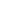
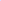

# SCoNE: Spherical Consistent Neighborhoods Ensemble for Effective and Efficient Multi-View Anomaly Detection

<!-- Page 1 -->

SCoNE: Spherical Consistent Neighborhoods Ensemble for Effective and Efficient

Multi-View Anomaly Detection

Yang Xu1,2*, Hang Zhang1,2*, Yixiao Ma1,2, Ye Zhu3, Kai Ming Ting1,2†

## 1 State Key Laboratory for Novel Software Technology, Nanjing University, Nanjing, China 2 School of Artificial

Intelligence, Nanjing University, Nanjing, China 3 School of Information Technology, Deakin University, Geelong, Australia {xuyang, zhanghang, mayx}@lamda.nju.edu.cn, ye.zhu@ieee.org, tingkm@nju.edu.cn

## Abstract

The core problem in multi-view anomaly detection is to represent local neighborhoods of normal instances consistently across all views. Recent approaches consider a representation of local neighborhood in each view independently, and then capture the consistent neighbors across all views via a learning process. They suffer from two key issues. First, there is no guarantee that they can capture consistent neighbors well, especially when the same neighbors are in regions of varied densities in different views, resulting in inferior detection accuracy. Second, the learning process has a high computational cost of OpN 2q, rendering them inapplicable for large datasets. To address these issues, we propose a novel method termed Spherical Consistent Neighborhoods Ensemble (SCoNE). It has two unique features: (a) the consistent neighborhoods are represented with multi-view instances directly, requiring no intermediate representations as used in existing approaches; and (b) the neighborhoods have data-dependent properties, which lead to large neighborhoods in sparse regions and small neighborhoods in dense regions. The data-dependent properties enable local neighborhoods in different views to be represented well as consistent neighborhoods, without learning. This leads to OpNq time complexity. Empirical evaluations show that SCoNE has superior detection accuracy and runs orders-of-magnitude faster in large datasets than existing approaches.

## Introduction

Anomaly detection, a.k.a. outlier detection, is a crucial data analysis technique (Aggarwal 2017) with applications in diverse domains, including fraudulent transaction detection (Chandola, Banerjee, and Kumar 2009), web spam detection (Spirin and Han 2012), and network intrusion detection (Ding et al. 2012). While numerous anomaly detectors have been developed (Breunig et al. 2000; Liu, Ting, and Zhou 2008; Zenati et al. 2018; Coleman and Shrivastava 2020), these traditional detectors identify anomalies in a single-view dataset only and cannot discover multi-view anomalies, which exhibit inconsistent behaviors across different views. For example, in social media user analysis, a user can be characterized by personal attributes such as age

*These authors contributed equally. †Corresponding author. Copyright © 2026, Association for the Advancement of Artificial Intelligence (www.aaai.org). All rights reserved.

**Figure 1.** An illustration of three types of anomalies.

and hobbies (view 1), and their connectivity with other users (view 2). If a user is assigned to the sports enthusiast group in one view based on their self-reported interests, but their interaction patterns in another view show engagement with non-sports related content and communities, then it is natural to consider this user’s behavior anomalous (Yu, He, and Liu 2015). Other examples of multi-view anomalies can also be found in movie recommendation (Gao et al. 2011), web image analysis (Xu, Tao, and Xu 2013), and digit recognition (Li, Shao, and Fu 2015). Thus, the goal of multi-view anomaly detection is to leverage multiple views to effectively and efficiently identify anomalies that manifest inconsistent behaviors across these views.

In single-view anomaly detection, a fundamental assumption is that normal instances have similar characteristics and constitute the majority of instances (Hawkins 1980; Aggarwal 2017). However, in multi-view anomaly detection, an instance which is part of the majority in every view is an anomaly if its behaviors are inconsistent across all views. Therefore, the definition of anomalies in multiview anomaly detection is different from that in single-view anomaly detection. As introduced in the literature (Ji et al. 2019; Hu et al. 2024), there are three different types of multiview anomalies, as illustrated in Figure 1:

• Attribute anomaly has different attribute characteristics from those of most other instances in each view. It is a single-view anomaly. • Class anomaly has inconsistent neighborhoods in different views, i.e., it may belong to different clusters or classes in different views. • Class-attribute anomaly is the mixture of the above two types of anomalies, i.e., it is an attribute anomaly in some views, but a class anomaly in other views.

The Fortieth AAAI Conference on Artificial Intelligence (AAAI-26)

16083

AI-readable visual equivalent, added: Figure extracted from the paper PDF and converted to an SVG wrapper asset. Use the surrounding page text and caption for interpretation.

<!-- Page 2 -->

## Method

C1 C2 C3 C4

Others

HOAD (Gao et al. 2011) ✗ ✗ ✗ ✗ CC (Liu and Lam 2012) ✗ ✗ ✗ ✗ APOD (Marcos Alvarez et al. 2013) ✗ ✗ ✗ ✗ MuvAD (Sheng et al. 2019) ✓ ✗ ✓ ✗ HBM (Wang and Lan 2021) ✓ ✗ ✓ ✓

Representation-based

DMOD (Zhao and Fu 2015) ✓ ✓ ✗ ✗ CRMOD (Zhao et al. 2017) ✓ ✓ ✗ ✓ LDSR (Li et al. 2018) ✓ ✗ ✗ ✓ MODDIS (Ji et al. 2019) ✓ ✗ ✓ ✓ NCMOD (Cheng, Wang, and Liu 2021) ✓ ✗ ✓ ✓ SPLSP (Wang et al. 2023) ✓ ✗ ✓ ✓ ECMOD (Chen et al. 2023) ✓ ✗ ✓ ✓ MODGD (Hu et al. 2024) ✓ ✗ ✓ ✓ IAMOD (Lai et al. 2024) ✓ ✗ ✓ ✓ MODGF (Hu et al. 2025) ✓ ✗ ✓ ✓ SCoNE (The proposed method) ✓ ✓ ✓ ✓

**Table 1.** Comparison of representative methods in terms of four capabilities (C1, C2, C3 & C4). We use “✓” to denote that a method has a capability, and “✗” cannot.

The foundational research in multi-view anomaly detection is established by pioneering methods focusing on graph and clustering inconsistencies. HOAD (Gao et al. 2011) constructs a combined similarity graph across all views and employs the principal eigenvectors of the graph’s Laplacian matrix to identify class anomalies based on inter-component distances. Others, including CC (Liu and Lam 2012) and APOD (Marcos Alvarez et al. 2013), focus on detecting inconsistencies in clustering structures across views. However, a common limitation of these methods is their constraint to two-view datasets and the detection of only class anomalies.

The limitations of these early methods, coupled with the growing complexity and scale of modern data, highlight four key capabilities for a robust multi-view anomaly detection method. In the literature, these can be summarized as the capability of identifying all three types of anomalies (C1); running on datasets with linear time complexity (C2); dealing with datasets that do not have clear clustering structures (C3); and handling an arbitrary number of views (C4). To overcome these challenges, subsequent research has made significant strides on several fronts. For example, DMOD (Zhao and Fu 2015) uses latent coefficients and sample-specific errors to identify all types of multi-view anomalies (C1) with linear time complexity (C2), while MODDIS (Ji et al. 2019) employs neural networks to learn representations in a unified latent space to handle data without clear cluster structures (C3) and arbitrary number of views (C4). We compare existing methods and the proposed method in terms of these capabilities in Table 1. As no existing methods have all of these capabilities simultaneously, we are motivated to explore a method that has all capabilities.

Among these efforts, representation learning has become the most popular strategy in the field of multi-view anomaly detection because it can effectively integrate the information of different views into a consensus representation space where normal instances and anomalies can be effectively distinguished (Hu et al. 2024; Lai et al. 2024; Hu et al. 2025). As the local neighborhoods of normal instances are consistent across different views, while the local neigh- borhoods of abnormal instances are significantly different across different views (Sheng et al. 2019), the core problem of representation learning methods is to represent local neighborhoods of normal instances consistently across all views. However, we notice that existing methods suffer from two key issues due to their shared methodology: using a representation of local neighborhood in each view independently, and then capturing the consistent neighbors across all views via a learning process. First, there is no guarantee that consistent neighborhoods are captured correctly, especially when the same neighbors are in regions of varied densities in different views. The common practice of linearly combining representations from different views disregards the complex distributions of anomalies (Hu et al. 2024). This has led to inferior anomaly detection accuracy. Second, they usually has a high computational cost of OpN 2q, preventing them from handling large-scale datasets.

Our insight is that multi-view instances can be used directly to represent consistent neighborhoods effectively across all views, without explicit learning. We thus introduce a novel and efficient method called Spherical Consistent Neighborhoods Ensemble (SCoNE) which incorporates this insight. Our major contributions are:

• Proposing SCoNE which employs a small sampled set of multi-view instances to represent a set of adaptive-radius spherical regions across all views that yields consistent neighborhoods with linear time complexity. • Revealing that SCoNE creates neighborhoods which adapt to varied local densities by leveraging two key data-dependent properties, necessary for ensuring consistent neighborhoods across all views. • Conducting extensive experiments to evaluate SCoNE on both synthetic and real-world multi-view datasets. The experimental results demonstrate both the effectiveness and efficiency of SCoNE.

Key Idea and Implementation Preliminaries. Given a multi-view dataset D “ txi|i “ 1,..., Nu, and xi “ px1 i,..., xV i q is the i-th instance with V views, where xv i denotes the v-th view of xi, and Dv “ rxv

1,..., xv Ns is sample set observed in the v-th view.

Conceptual Understanding of Consistent Neighborhood across All Views The concept of “consistent neighbors” is pivotal in multiview anomaly detection as it identifies normal instances that exhibit similar behavior across different views. Definition 1. A Consistent Neighborhood of k-Consistent Neighbors of any x P D across all views is defined as:

CN kpxq “ ty P D | @v P t1, 2,..., V u, yv P Nkpxv|Dqu

(1) where Nkpxv|Dvq represents the set of k-nearest neighbors of xv in Dv.

The above definition has two key ingredients, i.e., the individual-view neighborhoods of x which adapt to varied local densities; and the consistent neighborhood, of x being normal, is represented by the same k normal multi-view

16084

<!-- Page 3 -->

instances. A multi-view instance which violates this consistency signifies that it is likely to be a multi-view anomaly.

Although Definition 1 is compatible with a common assumption in existing methods (Sheng et al. 2019; Cheng, Wang, and Liu 2021; Wang et al. 2023; Hu et al. 2024), i.e., normal instances across different views exhibit similar local neighborhood structures, they have used representations other than the multi-view instances and with learning. For example, to achieve this consistency, many existing approaches have employed a method that considers a representation of local neighborhood in each view independently, and then attempts to capture the consistent neighbors across all views via a learning process from the representations of individual views. This has two shortcomings. First, there is no guarantee that the learning can capture the consistent neighbors of a normal instance x, especially when x’s neighbors are in regions of varied densities in each view and the distributions vary over different views. Second, the learning process usually has high computational cost of OpN 2q.

Instead of this indirect method, we propose a direct method and it addresses these shortcomings. It is direct because the consistency in the associated neighborhoods of individual views, even in varied densities, can be ensured by using a set of samples from the given multi-view dataset D.

Specifically, with a set of representative samples S “ ts1,..., sψu from D, each point sv i P Sv in view v defines a neighborhood or a region containing its local normal instances. The key is to ensure that each neighborhood represents a normal region in every view such that all these neighborhoods are represented by almost the same multi-view instances si P S across all views. This is crucial for an unbiased and right-for-the-task multi-view representation. This method also reduces the time complexity to OpNq as computing the neighborhoods represented by a set of sampled instances and the final score for each x from the representation is straightforward, as we show in the next subsection.

SCoNE: Multi-View Spherical Consistent Neighborhoods Ensemble

We introduce SCoNE, a method to determine the consistent neighborhood of x based on a set of adaptive-radius spherical regions, represented by a set of multi-view instances. It offers one unique advantage, i.e., the proposed adaptive spherical regions, which is a unique among existing methods, create large neighborhoods in sparse regions and small neighborhoods in dense regions in every view, while all these neighborhoods across all views are represented by the set of multi-view instances. This is essential in identifying the consistent neighborhoods of x across all views. SCoNE has two key functions: f is the single-view spherical neighborhood function in any one view; and F is its multi-view extension for representing local neighborhoods across all views to create a consistent neighborhood.

Given a multi-view dataset D of V views, and let S “ ts1,..., sψu Ă D be a set of ψ instances, randomly drawn from D. For each sv i in view v, the adaptive-radius rv i of its

**Figure 2.** An illustration of the single-view spherical neighborhoods. The parameters ψ “ 6 and k “ 3 are used here.

spherical neighborhood is determined as:

rv i “ min j“1,...,ψ j‰i

}sv i ´ sv j} (2)

where }sv i ´ sv j} denotes Euclidean distance of sv i and sv j. Definition 2. The view-v spherical neighborhood function f of any xv P Dv, due to sv i P Sv, is defined as:

fpxv; sv i q “

"1 if }xv ´ sv i } ď rv i and sv i P Nkpxv|Svq, 0 otherwise.

(3)

Each spherical neighborhood distinguishes normal instances from anomalies (being inside or outside of the neighborhood) for each x in each individual view, i.e., f defines the membership of a single-view instance xv in each spherical neighborhood, given Sv. Figure 2 illustrates the singleview spherical neighborhoods of k “ 3 nearest neighbors of x derived from a set S of ψ “ 6 multi-view instances in view v. The k-nearest neighbors (kNN) of x ensure that these same kNN of multi-view instances in S (which define the k spherical neighborhoods) are being considered in all individual-view spherical neighborhoods in order to determine the consistency of x being normal across all views. Definition 3. Multi-view consistent neighborhood function F of any x P D, due to si P S, is defined as:

Fpx; siq “

Vź v“1 fpxv; sv i q. (4)

Note that F is a realization of the multi-view consistent neighborhood of k-consistent neighbors, stated in Definition 1. Specifically, Fpx; siq “ 1 if and only if x falls within the spherical neighborhood of si in all views. This product operation effectively assesses the consistency of x being normal across all views: if si is not a neighbor of x in even one view, the product becomes 0, indicating x does not have multi-view consistency of being normal. Then, by aggregating the outcomes of t sets of F functions, SCoNE computes the consistent neighborhoods score for each instance. Definition 4. Given t sets of multi-view consistent neighborhoods generated from t subsamples ˆS “ tS1,..., Stu, the

16085

AI-readable visual equivalent, added: Figure extracted from the paper PDF and converted to an SVG wrapper asset. Use the surrounding page text and caption for interpretation.

<!-- Page 4 -->

**Figure 3.** An illustration of the mapping Φ for normal instances in H. Three sampled points s1, s2, s3 P S (represented as dots), define three spherical neighborhoods of normal regions in each view.

**Figure 4.** An illustration of the mapping Φ for three types of multi-view anomalies. Each violates a different kind of consistency of being normal.

consistent neighborhoods score of SCoNE for any x P D, due to all Sj P ˆS of |Sj| “ ψ points, is defined as follows:

¯Cpxq “ 1 ψt tÿ j“1 ψ ÿ i“1

Fpx; si|Sjq. (5)

The consistent neighborhood of each F ensures that a normal instance yields many values of F equal to 1, which lead to a high ¯Cpxq score. On the other hand, an anomaly of any type has at least some values of F equal to 0, resulting in a low ¯Cpxq score p! 1q.

For every instance in every view, the time cost Opψtkq is needed to compute f. Thus, SCoNE has the overall time complexity OpψtkV Nq which is linear to the dataset size N. The effectiveness of the consistent neighborhoods score derives directly from the observation that normal instances and anomalies are distinguishable in a representation space (through a conceptual understanding of the consistent neighborhood) generated by F, as detailed in the next subsection.

Conceptual understanding of Consistent Neighborhood The following offers a conceptual understanding of Consistent Neighborhood, stated in Definition 1, via function f.

Let Φ: xv ÞÑ t0, 1uψ be the mapping of f that transforms an instance xv into a ψ-dimensional binary space H. Specifically, Φpxvq “ rfpxv; sv

1q,..., fpxv; sv ψqs, where dimension i indicates membership in the corresponding spherical neighborhood of sv i. Let Φpsiq and Φpˆsq denote the representations of si and the origin in the representation space

H, respectively. Figure 3 and Figure 4 show an example of the mapping Φ with parameters V “ 2, t “ 1, k “ 1 and ψ “ 3. In H, normal instances and anomalies are distinguishable based on the following interpretations.

Normal instances, due to their consistent behavior across all views, are likely to be nearest neighbors of the same sampled instance si in all views. Consequently, they are mapped to the same position Φpsiq in H. In contrast, anomalies exhibit inconsistent neighborhoods across different views. Specifically: (1) Attribute anomalies are unlikely to be nearest neighbors of any s P S in any view; thus they are mapped to the origin Φpˆsq. (2) A class anomaly is a nearest neighbor to different samples in S in different views (e.g., si in one view and sj in another, where i ‰ j), resulting in mappings to distinct positions in H. (3) Class-attribute anomalies exhibit characteristics of attribute anomaly in some views, and those of class anomaly in others.

Data-dependent Properties: Capturing Consistent Neighborhoods in Varied Densities To guarantee the capture of consistent neighborhoods across all views, the spherical neighborhoods generated by SCoNE have the following two key properties. Theorem 1. Given a multi-view dataset D, and let S Ă D be a set of ψ sampled points. For each sv P Sv, let θpsvq denote the neighborhood generated by sv, and Rpsvq denote the set of all normal instances from D that within θpsvq in view v. Then, for any two views v1 and v2 of D, Rpsv1q and Rpsv2q contain essentially the same instances, i.e.,

Er|Rpsv1q|s » Er|Rpsv2q|s (6)

where Er| ¨ |s is the expected number of the set.

Theorem 1 establishes that, for each sampled point, the spherical neighborhoods constructed across different views provide an equivalent estimation of the number of normal instances. This property is significant because it ensures that the expected consistent neighborhoods score for any normal instance is equivalent, as normal instances are equally likely to be contained within any spherical neighborhood, thus yielding unbiased estimates across all views. Theorem 2. Given two datasets D and D1 with same number of points observed in view of v, where each point in D and D1 belongs to a subspace X Ď Rd and is drawn from probability distributions PD and PD1 defined on Rd, respectively. Both PD and PD1 are strictly positive on X. Let E Ă X be a region such that for all x P E, PDpxq ă PD1pxq, i.e., D is sparser than D1 in E. Given two randomly sampled sets S Ă D and S1 Ă D1, where |S| “ |S1| “ ψ. Assume that there exists a point s P tS X S1u. Then, for any x P E, the k-nearest neighborhoods function f have the property that

Ppfpx; si|Sq “ 1q ą Ppfpx; si|S1q “ 1q, (7)

where fpx; si|Sq denotes fpxv; sv i q based on the radius of sv i calculated through the sample set Sv. For simplicity, we omit the requisite v in most notations.

Theorem 2 shows that, SCoNE creates appropriately sized neighborhoods by adapting to local data densities: produc-

16086

AI-readable visual equivalent, added: Figure extracted from the paper PDF and converted to an SVG wrapper asset. Use the surrounding page text and caption for interpretation.

AI-readable visual equivalent, added: Figure extracted from the paper PDF and converted to an SVG wrapper asset. Use the surrounding page text and caption for interpretation.

<!-- Page 5 -->

ing small neighborhoods in dense regions and large neighborhoods in sparse region. It is a necessary requirement because a multi-view dataset can have varied local densities in each view, and the distribution can vary significantly from one view to another. Thus, any neighborhood representation must represent the normal regions correctly so that the consistency of being normal across all views can be assessed correctly. Existing methods have difficulty getting this right. They rely on learning a combination of independent representations of individual views, and this could not ensure that all normal regions are presented appropriately over all views. Due to space limitations, the proofs of all theorems are provided in the Appendix.

## Experiment

This section empirically validates the claimed effectiveness and efficiency of SCoNE through a comprehensive comparison with established state-of-the-art methods. Our evaluation is conducted across a wide range of datasets, including synthetic datasets with varied densities, multiple benchmark datasets, and a multi-view social network dataset.

Competing Methods and Setups We compare the performance of SCoNE against several baselines: iForest (Liu, Ting, and Zhou 2008), MOD- DIS (Ji et al. 2019), HBM (Wang and Lan 2021), NC- MOD (Cheng, Wang, and Liu 2021), ECMOD (Chen et al. 2023), MODGD (Hu et al. 2024), IAMOD (Lai et al. 2024), and MODGF (Hu et al. 2025). Their capabilities and categories are detailed in Table 1. Among these, MODDIS and NCMOD are deep learning-based methods, and HBM is the only semi-supervised learning method. Notably, iForest serves as a benchmark for single-view anomaly detection applied to multi-view data, where multiple views are concatenated into a single view before input.

To ensure a fair comparison, we set the parameter configuration in the original works for comparison methods. For SCoNE, we fix the ensemble size t to 200. The number of subsamples ψ is searched in t2i|i “ 1, 2,..., 8u. The value of k is searched in t1, 3, 5, 7, 11, 21, 51, 101u. We adopted the Area Under the ROC Curve (AUC) as the evaluation metric, acknowledging its robustness in anomaly detection tasks with imbalanced datasets. The experiments are executed on a Linux CPU machine: AMD 128-core CPU with each core running at 2 GHz and 1T GB RAM.

Synthetic Data We first evaluate SCoNE using synthetic data with clusters of varied densities. Using scikit-learn, we generate a twoview dataset of N “ 1000 instances: 970 normal instances, 10 attribute anomalies, 10 class anomalies, and 10 classattribute anomalies. This dataset generation process is repeated twenty times to ensure a robust evaluation. Figure 5 illustrates a representative synthetic dataset. To isolate the effect of density variations on anomaly detection, we generate twenty control datasets with clusters of same density.

The results presented in Table 2 demonstrate that SCoNE achieves the highest AUC scores on all datasets of uniform

**Figure 5.** Synthetic datasets with various densities of distributions. Both views derive from the same original instances.

Uniform density Varied densities AUC Proportion AUC Proportion iForest 0.896˘0.010 - 0.835˘0.014 - MODDIS 0.997˘0.002 85.5 0.952˘0.006 78.6 HBM 0.981˘0.004 - 0.925˘0.008 - NCMOD 0.986˘0.004 81.7 0.932˘0.010 74.9 ECMOD 0.977˘0.003 79.1 0.933˘0.005 75.4 MODGD 0.954˘0.005 76.8 0.907˘0.008 69.1 IAMOD 0.995˘0.005 82.3 0.936˘0.007 77.9 MODGF 0.994˘0.003 83.5 0.940˘0.007 76.3

SCoNE 1.000˘0.000 87.6 1.000˘0.000 86.9

**Table 2.** Comparison on synthetic datasets. The mean AUC ± 2*SE (Standard Error) are shown in the table. The proportion results are presented as percentages (%).

Zoo Park. Wdbc MNIST AWA Caltech

Views 3 3 3 3 6 6 Instances 101 197 569 70,000 800 1,474 Clusters 7 2 2 10 10 7 Dimensions 16 22 32 786 10,940 3,766

**Table 3.** Datasets characteristics.

and varied densities. This is because SCoNE’s spherical neighborhoods, which adapt to varied local densities in every view, enable it to perform well on both datasets. In contrast, the performance of other methods degrades on datasets with varied densities compared to those with uniform density. As expected, the single-view detector iForest has lower AUC than any of the multi-view methods.

To further investigate the reason behind SCoNE’s robust performance, we evaluate the ability of representation-based methods to capture consistent neighbors. Specifically, for a normal instance x, we compute its consistent neighbors CN kpxq using k “ 200. Then, we calculate the proportion of these consistent neighbors that are still the k-nearest neighbors in the learned representation space (or the optimized similarity matrix). We randomly selected 20 normal instances and reported the average of the proportion values in Table 2. The results confirm our findings, showing that SCoNE maintains the highest proportion of consistent neighbors on both datasets, which explains the reason for its robust and superior AUC performance.

16087

AI-readable visual equivalent, added: Figure extracted from the paper PDF and converted to an SVG wrapper asset. Use the surrounding page text and caption for interpretation.

<!-- Page 6 -->

iForest MODDIS HBM NCMOD ECMOD MODGD IAMOD MODGF SCoNE

Z 258 0.763˘0.027 0.818˘0.016 0.832˘0.017 0.846˘0.018 0.805˘0.024 0.816˘0.014 0.853˘0.013 0.875˘0.011 0.881˘0.010 Z 555 0.791˘0.031 0.854˘0.014 0.878˘0.015 0.881˘0.014 0.842˘0.021 0.863˘0.011 0.887˘0.011 0.899˘0.010 0.903˘0.010 Z 852 0.829˘0.025 0.861˘0.012 0.891˘0.011 0.893˘0.012 0.869˘0.011 0.905˘0.010 0.919˘0.009 0.922˘0.009 0.924˘0.009 P 258 0.717˘0.033 0.806˘0.012 0.794˘0.016 0.788˘0.014 0.781˘0.021 0.752˘0.015 0.832˘0.016 0.841˘0.014 0.849˘0.013 P 555 0.758˘0.031 0.867˘0.008 0.843˘0.013 0.863˘0.010 0.868˘0.017 0.867˘0.014 0.895˘0.014 0.918˘0.013 0.912˘0.012 P 852 0.822˘0.028 0.949˘0.006 0.912˘0.009 0.943˘0.006 0.937˘0.009 0.905˘0.012 0.960˘0.012 0.958˘0.010 0.962˘0.009 W 258 0.623˘0.037 0.835˘0.008 0.851˘0.009 0.839˘0.014 0.838˘0.026 0.834˘0.010 0.863˘0.012 0.867˘0.010 0.869˘0.009 W 555 0.705˘0.031 0.900˘0.006 0.907˘0.006 0.902˘0.006 0.896˘0.015 0.884˘0.007 0.910˘0.010 0.911˘0.008 0.912˘0.007 W 852 0.831˘0.026 0.955˘0.004 0.954˘0.005 0.957˘0.004 0.961˘0.017 0.946˘0.007 0.957˘0.009 0.955˘0.008 0.962˘0.007 M 258 0.614˘0.061 0.938˘0.002 0.853˘0.011 0.917˘0.006 0.887˘0.006 0.897˘0.007 0.931˘0.005 0.939˘0.004 0.943˘0.002 M 555 0.677˘0.063 0.904˘0.001 0.839˘0.003 0.893˘0.002 0.861˘0.003 0.871˘0.004 0.909˘0.001 0.913˘0.001 0.916˘0.001 M 852 0.602˘0.059 0.875˘0.009 0.762˘0.017 0.803˘0.012 0.835˘0.011 0.762˘0.014 0.856˘0.009 0.885˘0.008 0.897˘0.006 A 258 0.665˘0.042 0.783˘0.022 0.761˘0.027 0.871˘0.023 0.779˘0.031 0.851˘0.026 0.901˘0.016 0.912˘0.013 0.918˘0.011 A 555 0.713˘0.037 0.821˘0.019 0.797˘0.023 0.897˘0.021 0.845˘0.026 0.879˘0.023 0.924˘0.014 0.935˘0.011 0.941˘0.009 A 852 0.734˘0.033 0.819˘0.021 0.777˘0.024 0.883˘0.018 0.829˘0.027 0.867˘0.019 0.913˘0.013 0.928˘0.009 0.933˘0.006 C 258 0.796˘0.035 0.861˘0.029 0.786˘0.025 0.907˘0.022 0.845˘0.024 0.903˘0.021 0.943˘0.012 0.958˘0.010 0.967˘0.008 C 555 0.759˘0.039 0.836˘0.027 0.779˘0.031 0.888˘0.025 0.806˘0.029 0.878˘0.024 0.899˘0.017 0.915˘0.014 0.927˘0.010 C 852 0.782˘0.030 0.845˘0.026 0.797˘0.024 0.911˘0.020 0.832˘0.024 0.914˘0.021 0.927˘0.008 0.938˘0.008 0.945˘0.007 Avg. rank 8.94 5.64 6.86 4.75 6.33 6.17 3.08 2.31 1.06

**Table 4.** The mean AUC ± 2*SE results on identifying three types of anomalies on benchmark datasets. For brevity in presentation, we denote each dataset using the initial letter of its name combined with the percentages of three anomaly types. For example, “Z 258” denotes the Zoo dataset with 2% attribute anomalies, 5% class-attribute anomalies and 8% class anomalies.

Benchmark Datasets This experiment evaluates SCoNE using multiple benchmarks from the UCI Machine Learning Repository and realworld multi-view applications. While dataset choices can vary across studies, UCI datasets. remain widely adopted for evaluation in this field. Their use ranges from pioneering work like HOAD (Gao et al. 2011) to many recent methods such as (Cheng, Wang, and Liu 2021; Chen et al. 2023; Wang et al. 2023; Lai et al. 2024). To maintain consistency with frequently used benchmarks and cover varied data scales and dimensions, we employ four UCI datasets: Zoo, Parkinson, Wdbc, and MNIST. Furthermore, aligning with recent work (Lai et al. 2024), we evaluate on two challenging real-world multi-view datasets, AWA and Caltech. These were chosen for their inherent high dimensionality and availability of six distinct views. Key characteristics of all the datasets are summarized in Table 3.

For the UCI datasets, three views are generated by splitting the original features into three subsets, following common practice (Hu et al. 2024; Lai et al. 2024). The AWA and Caltech datasets are used with their original six views. To generate anomalies, we strictly adhere to the procedures established in existing studies (Chen et al. 2023; Lai et al. 2024). Specifically, three types of anomalies are created: (i) Attribute anomalies, by randomly altering features of selected samples; (ii) Class-attribute anomalies, by first swapping features in a partial set of views between chosen sample pairs, followed by replacing features in the remaining views with random data; (iii) Class anomalies, by randomly selecting pairs of samples and exchanging features between a partial set of their views. On each dataset, we repeat this procedure twenty times to ensure robust evaluation.

The results in Table 4 demonstrate the superior performance of SCoNE, which achieves the best results with an average rank of 1.06. The single-view baseline, iFor- est, predictably performs the worst, confirming the necessity of leveraging multi-view information. It is also noteworthy that HBM, despite being a semi-supervised method that utilizes partial label information, is generally outperformed by most unsupervised representation-based methods. Among all competing methods, MODGF emerges as the closest competitor. Its strong performance can be attributed to its use of graph filtering, a technique that enhances the representation of consistent neighborhoods by effectively denoising each view. To further assess runtime performance on large-scale data, we utilize an expanded version of the MNIST dataset, which was the largest among our initially selected benchmarks. Specifically, starting from the standard MNIST dataset, we generated a significantly larger dataset by applying the data expansion methodology described in (Loosli, Canu, and Bottou 2007). This allowed for a thorough evaluation of scalability. We constructed three views for this expanded dataset, consistent with our setup for the original MNIST, and assessed all methods under varying numbers of samples drawn from this large-scale version. As shown in Figure 6, SCoNE exhibits significantly faster runtime, operating at least two orders of magnitude faster than other methods across different scales. Notably, at the scale of one million instances, other methods failed to produce results within a 24-hour period, whereas SCoNE completed the run efficiently in 428 seconds.

Parameter analysis. The performance of SCoNE is influenced by three parameters: ψ, k and t. Figure 7(a) shows the results of varying ψ and k, and Figure 7(b) shows the impact of changing t. Our analysis reveals that while ψ and k can be easily adjusted within a reasonable range, tuning is necessary for peak performance. Notably, the ensemble parameter t ą 100 yielded satisfactory results, with increasing t leading to decreased variance and robust results.

16088

<!-- Page 7 -->

**Figure 6.** The runtime comparison on MNIST dataset.

**Figure 7.** Analytical experiments on the MNIST (M 258) dataset. (a) The AUC values with different values of ψ and k. (b) The AUC values with different values of t.

Ablation Study We conduct an ablation study to evaluate the contribution of spherical neighborhoods and k-nearest neighbors to the effectiveness of SCoNE. Specifically, we conduct empirical experiments to assess the performance of SCoNE-VD, which creates neighborhoods via Voronoi diagram (Aurenhammer 1991), a nearest-neighbor-based partitioning mechanism, and SCoNE-1NN, which employs only the one nearest neighbor, in identifying different types of anomalies. The comparison results are shown in Table 5. The results demonstrates that both spherical neighborhoods and k-nearest neighbors clearly contribute to the performance of SCoNE, which is due to the fact that spherical neighborhood distinguishes normal instances from anomalies and k-nearest neighbors determine the consistency across all views.

Anomaly Detection in Social Networks To evaluate the performance of SCoNE for anomaly detection in social networks, we conduct experiment on the Facebook dataset (McAuley and Leskovec 2012), which is commonly used for social network analysis tasks. Facebook contains 4,039 users and 88,234 undirected edges, which together form ten distinct social networks. In social network anomaly detection, a user is considered normal if they consistently belong to the same social network across different views of the data. Conversely, a user is classified as a class anomaly if their social network membership varies across views (Yu, He, and Liu 2015). To establish a baseline for comparison, we employ LDSCEN, a method

A 258 A 555 A 852 C 258 C 555 C 852

SCoNE-VD 0.768 0.741 0.753 0.839 0.747 0.655 SCoNE-1NN 0.848 0.861 0.873 0.882 0.785 0.817

SCoNE 0.918 0.941 0.933 0.967 0.927 0.945

**Table 5.** Ablation analysis of average AUC results on two real-world multi-view datasets, AWA and Caltech, using the same notation as in Table 4.

Facebook-2 Facebook-5 Facebook-8 Facebook-10 iForest 0.742˘0.016 0.725˘0.013 0.727˘0.015 0.703˘0.014 MODDIS 0.763˘0.008 0.737˘0.011 0.688˘0.010 0.669˘0.010 HBM 0.707˘0.023 0.721˘0.018 0.724˘0.021 0.714˘0.019 NCMOD 0.809˘0.011 0.774˘0.013 0.769˘0.014 0.723˘0.016 ECMOD 0.856˘0.014 0.817˘0.019 0.803˘0.021 0.781˘0.024 SRLSP 0.977˘0.003 0.968˘0.006 0.959˘0.009 0.954˘0.009 MODGD 0.954˘0.002 0.949˘0.004 0.938˘0.005 0.931˘0.004 IAMOD 0.981˘0.003 0.957˘0.003 0.951˘0.005 0.947˘0.006 LDSCEN 0.991˘0.002 0.972˘0.006 0.962˘0.007 0.955˘0.007 SCoNE 0.982˘0.003 0.973˘0.003 0.965˘0.004 0.960˘0.004

**Table 6.** The mean AUC ± 2*SE results on Facebook.

designed for social network community detection (McAuley and Leskovec 2012). For LDSCEN, if an instance is classified as the same social network across all views, it is identified to be normal; otherwise, it is identified as an anomaly.

## Experiments

are performed on the largest 2, 5, 8 and 10 social networks in Facebook, as shown in Table 6. It is cast as a multi-view problem with V “ 3, and each view has randomly retained 70% of its connectivity relationships and contains class anomalies with an anomaly ratio of 5%. Our proposed method also achieve the best result on this task. When the number of social networks is higher than five, SCoNE outperforms LDSCEN, which is due to the increased likelihood of LDSCEN incorrectly categorizing instances into their respective social networks. Since SCoNE focuses on the consistent neighborhoods across all views, it is thereby more robust as the number of networks increases.

## Conclusion

We introduce a paradigm shift in multi-view anomaly detection by moving from indirect, learning-based approaches to a direct representation of consistent neighborhoods using the multi-view instances themselves. This core insight enables SCoNE, an effective and efficient multi-view anomaly detector built upon adaptive spherical neighborhoods. The reason for using spherical neighborhoods is due to their unique data-dependent properties, which are essential for adapting to varied data densities and producing robust consistency. We demonstrate that the consistent spherical neighborhood representation derived from multi-view instances enables it to effectively identify consistent neighbors across views on density difference data. Our theoretical analysis and empirical evaluations establish SCoNE’s superior detection accuracy and linear time complexity, making it highly suitable for large-scale multi-view anomaly detection task. Moreover, exploring the application of multi-view anomaly detection methods in industrial data is a future research direction.

16089

AI-readable visual equivalent, added: Figure extracted from the paper PDF and converted to an SVG wrapper asset. Use the surrounding page text and caption for interpretation.

AI-readable visual equivalent, added: Figure extracted from the paper PDF and converted to an SVG wrapper asset. Use the surrounding page text and caption for interpretation.

<!-- Page 8 -->

## Acknowledgements

This work is supported by National Natural Science Foundation of China (Grant No. W2531050).

## References

Aggarwal, C. C. 2017. An introduction to outlier analysis. International Publishing: Springer. Aurenhammer, F. 1991. Voronoi diagrams—a survey of a fundamental geometric data structure. ACM Computing Surveys, 23(3): 345–405. Breunig, M. M.; Kriegel, H.-P.; Ng, R. T.; and Sander, J. 2000. LOF: identifying density-based local outliers. In Proceedings of the ACM SIGMOD International Conference on Management of Data, 93–104. Chandola, V.; Banerjee, A.; and Kumar, V. 2009. Anomaly detection. ACM Computing Surveys, 41(3): 1–58. Chen, X.; Wang, X.; Wang, Y.; Han, C.; and Duan, L. 2023. Learning Enhanced Representations via Contrasting for Multi-view Outlier Detection. In 28th International Conference on Database Systems for Advanced Applications, volume 13946, 110–120. Cheng, L.; Wang, Y.; and Liu, X. 2021. Neighborhood consensus networks for unsupervised multi-view outlier detection. In Proceedings of the AAAI Conference on Artificial Intelligence, volume 35, 7099–7106. Coleman, B.; and Shrivastava, A. 2020. Sub-linear race sketches for approximate kernel density estimation on streaming data. In Proceedings of The Web Conference, 1739–1749. Ding, Q.; Katenka, N.; Barford, P.; Kolaczyk, E.; and Crovella, M. 2012. Intrusion as (anti) social communication: characterization and detection. In Proceedings of the 18th ACM SIGKDD International Conference on Knowledge Discovery and Data Mining, 886–894. Gao, J.; Fan, W.; Turaga, D.; Parthasarathy, S.; and Han, J. 2011. A spectral framework for detecting inconsistency across multi-source object relationships. In IEEE 11th International Conference on Data Mining, 1050–1055. IEEE. Hawkins, D. 1980. Identification of Outliers, volume 11. Springer. Hu, B.; Wang, X.; Zhou, P.; and Du, L. 2024. Multi-view Outlier Detection via Graphs Denoising. Information Fusion, 101: 102012. Hu, Z.; Wang, N.; Zhou, P.; Du, L.; Qian, Y.; Wang, C.; and Zhang, Y. 2025. Unsupervised Multi-View Outlier Detection via Optimal Graph Filtering. In ICASSP IEEE International Conference on Acoustics, Speech and Signal Processing, 1– 5. IEEE. Ji, Y.-X.; Huang, L.; He, H.-P.; Wang, C.-D.; Xie, G.; Shi, W.; and Lin, K.-Y. 2019. Multi-view outlier detection in deep intact space. In IEEE International Conference on Data Mining, 1132–1137. IEEE. Lai, J.; Wang, T.; Chen, C.; and Zheng, Z. 2024. Information-aware Multi-view Outlier Detection. ACM Transactions on Knowledge Discovery from Data, 18(4).

Li, K.; Li, S.; Ding, Z.; Zhang, W.; and Fu, Y. 2018. Latent discriminant subspace representations for multi-view outlier detection. In Proceedings of the AAAI Conference on Artificial Intelligence, 3522–3529. Li, S.; Shao, M.; and Fu, Y. 2015. Multi-view low-rank analysis for outlier detection. In Proceedings of the SIAM International Conference on Data Mining, 748–756. SIAM. Liu, A. Y.; and Lam, D. N. 2012. Using consensus clustering for multi-view anomaly detection. In 2012 IEEE Symposium on Security and Privacy Workshops, 117–124. IEEE. Liu, F. T.; Ting, K. M.; and Zhou, Z.-H. 2008. Isolation Forest. In 2008 Eighth IEEE International Conference on Data Mining, 413–422. Loosli, G.; Canu, S.; and Bottou, L. 2007. Training Invariant Support Vector Machines using Selective Sampling. Cambridge, MA.: MIT Press. Marcos Alvarez, A.; Yamada, M.; Kimura, A.; and Iwata, T. 2013. Clustering-based anomaly detection in multi-view data. In Proceedings of the 22nd ACM international conference on Information and Knowledge Management, 1545– 1548. McAuley, J.; and Leskovec, J. 2012. Learning to Discover Social Circles in Ego Networks. In Advances in Neural Information Processing Systems, 817–829. Sheng, X.-R.; Zhan, D.-C.; Lu, S.; and Jiang, Y. 2019. Multiview anomaly detection: Neighborhood in locality matters. In Proceedings of the AAAI Conference on Artificial Intelligence, volume 33, 4894–4901. Spirin, N.; and Han, J. 2012. Survey on web spam detection: principles and algorithms. ACM SIGKDD explorations newsletter, 13(2): 50–64. Wang, Y.; Chen, C.; Lai, J.; Fu, L.; Zhou, Y.; and Zheng, Z. 2023. A Self-Representation Method with Local Similarity Preserving for Fast Multi-View Outlier Detection. ACM Transactions on Knowledge Discovery from Data, 17(1). Wang, Z.; and Lan, C. 2021. Towards a hierarchical Bayesian model of multi-view anomaly detection. In Proceedings of the Twenty-Ninth International Conference on International Joint Conferences on Artificial Intelligence, 2420–2426. Xu, C.; Tao, D.; and Xu, C. 2013. A survey on multi-view learning. arXiv preprint arXiv:1304.5634. Yu, R.; He, X.; and Liu, Y. 2015. Glad: group anomaly detection in social media analysis. ACM Transactions on Knowledge Discovery from Data, 10(2): 1–22. Zenati, H.; Romain, M.; Foo, C.-S.; Lecouat, B.; and Chandrasekhar, V. 2018. Adversarially learned anomaly detection. In 2018 IEEE International Conference on Data Mining, 727–736. IEEE. Zhao, H.; and Fu, Y. 2015. Dual-regularized multi-view outlier detection. In Twenty-Fourth International Joint Conference on Artificial Intelligence. Zhao, H.; Liu, H.; Ding, Z.; and Fu, Y. 2017. Consensus regularized multi-view outlier detection. IEEE Transactions on Image Processing, 27(1): 236–248.

16090
