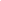

# Self-Interpretable Subgraph Neural Network with Deep Reinforcement Walk Exploration

<!-- Page 1 -->

Self-Interpretable Subgraph Neural Network with Deep Reinforcement Walk Exploration

Jianming Huang1*, Hiroyuki Kasai1, 2

1Dept. of Computer Science and Communication Engineering, Graduate School of Fundamental Science and Engineering WASEDA University, Tokyo 169-8050, Japan 2Dept. of Communication and Computer Engineering, School of Fundamental Science and Engineering WASEDA University, Tokyo 169-8050, Japan koukenmei@toki.waseda.jp, hiroyuki.kasai@waseda.jp

## Abstract

Graph neural networks (GNNs) face dual challenges of limited structural expressiveness and opaque decision-making processes. Recent research on Subgraph Neural Networks (SGNNs) enhance model expressiveness through subgraph ensembles. However, their reliance on predefined sampling strategies leads to poor interpretability and computational inefficiency. Meanwhile, post-hoc GNN explainers enhance model interpretability but still struggle to translate their explanations into model improvements. This paper presents a novel framework that fundamentally bridges this gap by developing SGNNs with intrinsic interpretability. Our key innovation lies in constructing a self-interpretable architecture where the explanation generation mechanism is organically integrated with the prediction process. Our proposed Self- Interpretable SGNN introduces a reinforcement walk exploration (RWE-SGNN) as its data-driven sampling strategy, which can dynamically extract discriminative substructures during model training. This reinforcement walk exploration module not only provides inherent interpretability, but also enables: (1) efficient substructure extraction with less candidate number and simper embedding than traditional subgraph generation methods; and (2) provable equivalence in node coverage to traditional subgraph generation methods for connected subgraphs. Experiments on graph classification tasks show accuracy improvements over state-of-the-art GNNs, with case studies validating that the automatically identified subgraphs align with domain-specific knowledge.

## Introduction

Graph data, as a flexible and structurally variable representation, captures complex real-world phenomena such as chemical compounds, protein structures, and social networks. However, this flexibility also introduces challenges in feature extraction due to structural uncertainty. Most Graph Neural Networks (GNNs) (Kipf and Welling 2017; Xu et al. 2019; Wijesinghe and Wang 2021; Wang et al. 2019) adopt the message-passing mechanism, forming the class of Message Passing Neural Networks (MPNNs) that aggregate

*The author was affiliated with the Center for Digital Media Computation, Xiamen University, China, at the time this paper was accepted. Copyright © 2026, Association for the Advancement of Artificial Intelligence (www.aaai.org). All rights reserved.

node features from local neighborhoods. Although effective, their expressive power is limited to the 1-Weisfeiler-Lehman (WL) test (Xu et al. 2019). High-order GNNs (Morris et al. 2019) extend this capacity to k-WL, but their high complexity restricts practical use to at most third order. Numerous studies have demonstrated the significance of graph substructures in various graph-related tasks (Prˇzulj 2007; Jiang, Coenen, and Zito 2010; Alsentzer et al. 2020; Sun et al. 2021; Huang, Fang, and Kasai 2021). However, in the message passing mechanism, akin to a diffusion-like propagation process, the size of the involved neighborhood grows exponentially as iteration number increases. Consequently, this growth leads to a reduction in the prominence of important substructures, rendering it susceptible to interference from other less relevant components within the local substructure. Therefore, researchers have increasingly directed their attention toward substructures in graph learning. Some studies focus on leveraging substructure information to enchance traditional GNNs, which are commonly referred to as subgraph neural networks (SGNNs) (Bevilacqua et al. 2022, 2024). Some focus on interpreting important substructures from GNNs, known as GNN explainers (Ying et al. 2019; Shan et al. 2021; Lin et al. 2022).

Challenges. In this paper, we discuss the challenges posed by SGNNs and GNN explainers, which exhibit complementary strengths. (i) SGNNs generate multiple subgraphs by removing nodes from the original graph, encode them via MPNNs, and aggregate their representations. However, most rely on predefined sampling strategies (e.g., random or algorithmic) rather than data-driven learning, leading to inefficiency and instability. (ii) MPNNs act as black boxes, offering limited interpretability of important substructures. Recent GNN explainer studies (Ying et al. 2019; Shan et al. 2021; Lin et al. 2022) attempt to extract key subgraph patterns from trained models, yet their explanations still depend on domain knowledge and lack integration into the GNN framework for practical improvement.

Motivations. To address these issues, we propose a selfinterpretable framework that integrates SGNN principles with the generative mechanism of GNN explainers. As shown in Figure 1, the sampling model in SGNN is trained in an explainer-like manner: it acts as an explainer to the out-

The Fortieth AAAI Conference on Artificial Intelligence (AAAI-26)

21984

<!-- Page 2 -->

put model and optimizes subgraph selection to maximize the model’s performance, which serves as supervision. The key question then becomes how to design the sampling model. Insights from recent explainers (Shan et al. 2021; Yuan et al. 2021; Lin et al. 2022) inspire our approach to substructure generation. Traditional subgraph-based methods iteratively expand neighborhoods, but suffer from exponential growth in computational cost. Instead, we adopt a walk exploration process, which optimizes paths over random walks on the input graph to efficiently capture key substructures. This design offers two advantages: (i) walk sequences are easier to embed than subgraphs, and (ii) candidate selection is limited to neighbors of the current node, reducing complexity and improving efficiency.

Present Work. In this work, we propose a selfinterpretable SGNN based on Reinforcement Walk Exploration (RWE-SGNN). As shown in Figure 1, the sampling model comprises two components: a low-level graphlet perceptron and a high-level substructure extractor. The low-level graphlet perceptron, implemented via a shallow MPNN, identifies nodes of interest (NOIs) exhibiting specific graphlet patterns in local neighborhoods. Based on these NOIs, the high-level substructure extractor employs a reinforcement generative model defined by a walkexploration-based Markov decision process (MDP) to generate informative substructures. Subsequently, the resulting walk sequences from sampling model are then encoded into subgraph embeddings for downstream tasks. To achieve self-interpretability, we adopt a two-stage training scheme, where the sampling model and output model are alternately optimized. The output model encodes and decodes walk sequences for task objectives, while its downstream loss serves as the reward signal for training the walk exploration agent through reinforcement learning. Our main contributions are as follows:

• We propose a self-interpretable SGNN framework that integrates the strengths of SGNNs and GNN explainers, effectively mitigating the inefficiency and instability of traditional sampling strategies and improving interpretability. • We design a walk-exploration-based MDP for substructure generation, which significantly reduces computational cost while maintaining equivalent node coverage to traditional subgraph generation methods. • Extensive experiments on graph classification datasets demonstrate the effectiveness and interpretability of the proposed framework.

## Preliminaries

Herein, we use lowercase letters to represent scalars such as a, b, and c. Lowercase letters with bold typeface such as a, b, and c represent vectors. Uppercase letters with bold typeface such as A, B, and C represent the matrices. For slicing matrices, we represent the element of the i-th row and j-th columns of A as A(i, j). Furthermore, A(i,:) denotes the vector of the i-th row of A. Similarly, A(:, j) signifies the vector of j-th column. Also, a(i) denotes the i-th element of the vector a. Uppercase letters with an italic typeface denote a set, such as A, B, C. Also, |A| denotes the size of A. R stands for the real number set.

Graph. A graph can be denoted as G:= (V, E) in discrete mathematics, which is a tuple of a node set V and an edge set E. More specifically, let V:= {v: v ∈N+} be a node index set and let E:= {(v, v′): v, v′ ∈V} be a set of node pairs. It is noteworthy that we only discuss about the undirected graphs, therefore, (v, v′) and (v′, v) are considered equivalent in E. For a node v ∈V, we write N(v):= {v′: v′ ∈V; (v, v′) ∈E; v̸ = v′} as the set of node neighbors. In graph data, each node is assigned with a feature vector. We use the node feature matrix X ∈Rn×d to represent these features, where n and d denote the number of nodes and feature dimensions, respectively.

SGNNs. SGNNs (Bevilacqua et al. 2022, 2024), also known as subgraph GNNs, compute graph representations based on bags of sampled subgraphs. These models typically consist of 4 components: (i) a subgraph sampling policy extracting subgraphs from the original graph, (ii) permutationequivariant layers that convert bags of subgraphs into bags of embeddings while considering their natural symmetry (usually implemented using MPNNs), (iii) a pooling function to aggregate the bags of embeddings, and (iv) a multi-layer perceptron (MLP) network for final outputs.

Post-Hoc GNN Explainers. A post-hoc GNN explainer aims to identify a subgraph denoted as G′ from an input graph G. This subgraph is considered important subgraph because it can explain the predictions made by a pretrained GNN model f on G. Specifically, the effectiveness of the explanation is often evaluated based on the prediction consistency of f between G′ and the original graph G (Ying et al. 2019; Shan et al. 2021; Lin et al. 2022).

Markov Decision Process (MDPs) for

Substructure Generation

This section formalizes the theoretical framework of substructure generation underlying our proposed RWE-SGNN. We first establish an MDP definition for conventional subgraph-based manner, then proposed an enhanced counterpart based on our deep reinforcement walk exploration. We propose a theorem that this walk-based strategy can achieve equivalent structural generation ability.

In our approach, akin to many subgraph extraction methods based on reinforcement learning, we formulate the structure generation process as an MDP. The MDP is represented as a 4-tuple M:= (S, A, P, R), where S denotes the state space, A denotes the action space, P: S×A×S →[0, 1]∩R returns the probability of a 3-tuple transition (s, a, s′) from state s ∈S to state s′ ∈S due to action a ∈A, and R: S × A × S →R represents the immediate reward function for feasible transitions. Notably, although our structure generation process is an unconditional generation process, the available candidate set for each generation step is finite and obtained from a predefined subgraph neighborhood.

21985

<!-- Page 3 -->

Low-Level

Graphlet Perceptron (Shallow MPNN)

High-Level Substructure Extractor (Reinforcement Walk Exploration

Model)

Graph Data

Walk Sequences

Graphlet-

Aware Embeddings

Graphlet Encoder

(Shallow MPNN)

Fully- Connected

Layers

Walk Embeddings

Final Outputs Concatenator NOI Embeddings

Target Graphlet

Extracted

NOI

Node Embedding

Agent

Walk Sequence

Walk Sequence

Walk Embedding

Prediction

**Figure 1.** Illustration of the model architecture, which comprises two main components: the sampling model and the output model. Initially, input graph data are processed by the sampling model, which generates walk sequences in a data-driven manner. Subsequently, leveraging the generated walk sequences, the output model encodes the important substructures for downstream tasks.

Subgraph-Generation-Based MDP. In the context of reinforcement subgraph generation, existing works (Shan et al. 2021; Yuan et al. 2021; Trivedi, Yang, and Zha 2020) are valuable references. Most of these generation methods aim to extract a subgraph from the induced subgraph set of the input graph. It should be noted that induced subgraphs are not necessarily connected. Therefore, the generated subgraph may contain multiple disconnected components. To simplify the discussion, we focus only on the set of connected subgraphs, thereby avoiding separated components in the generated results. Under this assumption, traditional subgraph generation methods typically operate by iteratively adding neighboring nodes to the current subgraph. To compare with our proposed walk-exploration-based method, we provide Definition 1 of the subgraph-generation-based MDP with the connected subgraph set as state space. Definition 1 (Subgraph-generation-based MDP). Given an input graph G(V, E) ∈G, the subgraph-generation-based MDP Mg:= (Sg, Ag, Pg, Rg) consists of the following four concepts.

• State. The state space w.r.t. the input graph G(V, E) is defined as its connected subgraph set Sg:= {G′(V′, E′): V′ ⊆ V, E′ ⊆ E, ∀u, v ∈ V′, u, v are connected.}. Specifically, a state is defined as a subgraph structure derived from G(V, E) and is denoted as s:= Gs(Vs, Es). • Action. The complete action space is defined as the node set of input graph Ag:= V, where an action is defined as a neighbor node a:= va. Furthermore, the feasible action space for a state s ∈Sg is defined as the union of its border neighborhood and is denoted as b Ag(s):= S v∈Vs N(v) \ Vs. • Transition. The transition between different states is defined as a node adding operation, which involves the addition of a neighbor node to the current state s and also the addition of its connection edges to other nodes already existing in s. The transition operator from the cur- rent state s is denoted as T g s: b Ag(s) →Sg, where T g s (a) = s′, Vs′ = Vs ∪{va}, Es′ = Es ∪{(va, j): j ∈N(va) ∩Vs}. • Reward. The immediate reward function Rg: Sg ×Ag × Sg →R is defined based on the downstream tasks. Given an output model Oθ′ and a loss function l presented in Definition 3, we define the reward function as Rg(s, a, s′):= l(Oθ′(s)) −l(Oθ′(s′)), s ∈Sg, s′ = T g s (a).

Walk-Exploration-Based MDP. The subgraphgeneration-based MDP faces the challenge of a substantially large action space. This is because the subgraph generation is actually a breadth-first-search process that selects candidates from all the surrounding neighbors of the generated subgraph. The size of the feasible action space can be approximately calculated as a summation of the size of all node neighborhoods in the generated subgraph. This reveals a potential risk of candidate explosion as the subgraph size grows larger. To mitigate this risk and further reduce the action space, we propose a depth-first-search strategy based on walk exploration. In walk exploration, we utilize a mechanism akin to the random walk process. Specifically, the next step of a walk is chosen from the neighborhood of the current node. Reinforcement learning plays an important role in guiding the direction of the walk. We define the walk-exploration-based MDP as follows.

Definition 2 (Walk-Exploration-Based MDP). Given an input graph G(V, E) ∈G and the maximum length of walks L ∈N+, the Walk-exploration-based MDP Mw:= (Sw, Aw, Pw, Rw) consists of the following four concepts.

• State. The state space w.r.t. the input graph G(V, E) is defined as the random walk set on G of length less than L + 1 and is denoted as Sw:= {(v1, v2, · · ·, vl): ∀i ∈ Jl −1K, l ≤L, vi, vl ∈V, (vi, vi+1) ∈E}. Specifically, a state is defined as a walk sequence and is denoted as s:= (vs

1, vs 2, · · ·, vs l).

21986

<!-- Page 4 -->

• Action. The complete action space is defined as the node set of input graph Aw:= V, where an action is defined as a neighbor node a:= va. Furthermore, the feasible action space for a state s ∈Sw is defined as the node neighborhood of the current step and is denoted as b Aw(s):= N(vs l). • Transition. The transition between different states is defined as a node appending operation, which involves the appending operation of a neighbor node to the walk sequence of s. The transition operator from the current state s is denoted as T w s: b Aw(s) →Sw, where T w s (a) = s ⊕va and ⊕denotes the appending operator to a walk sequence. • Reward. The immediate reward function Rw: Sw × Aw × Sw →R depends on the downstream tasks. Given an output model Oθ′ and a loss function l, we define the reward function as Rw(s, a, s′):= l(Oθ′(s)) − l(Oθ′(s′)), s ∈Sw, s′ = T w s (a). Importantly, we do not employ an additional pretraining step for starting point selection. In both subgraphgeneration-based and walk-exploration-based MDPs, the process begins with an empty substructure as the initial state, where all nodes in the graph are considered candidates. Moreover, the generation process terminates when the substructure reaches its maximum size. To assess the generation capability of our proposed walk exploration approach, we provide the Theorem 1 and the proof. Theorem 1. Given a graph G(V, E). For any connected subgraph G′(V′, E′) of G, let WG′ denote the complete random walk set on G′, which includes all possible random walk sequences of arbitrary length. There always exists at least one random walk sequence in WG′ that can visit all nodes in V′.

Proof. Let a:= (v1, v2,..., vn) be a sequence containing all nodes in V′, arranged in an arbitrary order, where n = |V′|. For any consecutive pairs (vt, vt+1) in a, there always exists a walk sequence wt,t+1 ∈WG′ that starts from vt and ends at vt+1 because G′ is a connected subgraph. Consequently, we can construct a walk containing all nodes in V′ by concatenating w1,2, w2,3,..., wn−1,n into a single walk sequence.

It establishes that the subgraph generation capability achieved through walk exploration is equivalent to our proposed subgraph generation strategy. By replacing the subgraph generation process with walk exploration, we significantly reduce the size of the feasible action space to |N(vs l)| while keeping the same capability to subgraph generation. Although the depth-first-search method may lead to an increased number of necessary generation steps due to backtracing exploration, this trade-off remains acceptable compared to the candidate explosion. We found that the primary scenario for backtracing occurs in star-shaped subgraphs, where walks backtrack from the end of one branch to explore other branches. Fortunately, this challenge is mitigated by our adoption of a shallow MPNN as the graphlet encoder as shown in Figure 1, which avoids exhaustive searches of small branches.

Complexity Analysis. In this section, we analyze and compare the computational complexity of the proposed walk-exploration-based MDP and the subgraph-generationbased MDP in terms of the scale of their action spaces. Let N ∈N+ denote the maximum number of nodes in the subgraph-generation-based method, and let L ∈N+ denote the maximum length of walks in the walk-explorationbased method. For the subgraph-generation-based method, the number of processed candidates required to generate a subgraph can be calculated as PN t=1 | b Ag(st)| = PN t=1

P v∈Vst |N(v) \ Vst|. Although the value of |N(v) \ Vst| varies for different nodes v and at different steps t, we treat them as having the same order of magnitude and denote the average value as D. Consequently, the complexity of processed candidates in the subgraph-generation-based method can be expressed as O

N 2+N

2 D

. For the walkexploration-based method, we calculate the number of processed candidates as PN t=1 | b Aw(st)| = PL t=1 |N(vt)|. Assuming |N(vt)| is of the same order of magnitude as D, the complexity of the walk-exploration-based method becomes O(LD). Consequently, our proposed walk-explorationbased method reduces the complexity of the subgraphgeneration-based method from quadratic to linear complexity.

Self-Interpretable Architechture of

RWE-SGNN This section introduces the implementation details of our proposed RWE-SGNN. We first present the overall architecture of the model, followed by a detailed description of the sampling model and output model.

## Model

Architecture In the introduction section, we present our proposal for a self-interpretable SGNN capable of dynamically extracting important substructures from graph data. To enhance the generalizability of our framework across various downstream tasks, we decompose it into two sub-models: the sampling model and the output model. As illustrated in Figure 1, the sampling model is responsible for the data-driven substructure sampling (generation), while the output model is responsible for the substructure encoding ensures that the outputs align with the requirements of specific downstream tasks. Both of these sub-models incorporate a shallow MPNN that computes node-level embeddings. However, their roles differ. In the sampling model, the MPNN calculates low-level graphlet-aware embeddings to guide the substructure generation process within the high-level reinforcement learning model. Conversely, in the output model, the MPNN encodes the extracted NOIs and aggregates them into substructure representations. These subgraph representations are then fed into fully-connected layers (MLP) to produce the final output. Building upon this architechture, our proposed RWE-SGNN solves the following subgraph optimization problem. Definition 3 (Subgraph optimization problem). Consider a graph dataset denoted as G, along with a downstream task

21987

<!-- Page 5 -->

loss function l: Rd →R that operates on d-dimensional embeddings. The RWE-SGNN learns two key components: a sampling model Sθ: G → bG parameterized by θ, and an output model Oθ′: bG →Rd parameterized by θ′, where bG:= {G′(V′, E′): ∃G(V, E) ∈G, V′ ⊆ V, E′ ⊆E} denotes an induced subgraph set derived from graphs of G. The goal is to optimize the following equation: minimizeθ,θ′ P g∈G l(Oθ′(Sθ(g))).

The learning process for solving this problem diverges from the typical deep learning process, because we incorporate a reinforcement learning subgraph generator within the sampling model. Specifically, we propose a two-stage optimization process. First, we define a dynamic reward function based on l(Oθ′(ˆg)) for the sampling model Sθ, where ˆg denotes a generated substructure. Next, we optimize the parameters θ and θ′ independently and alternately, while keeping the other fixed.

Sampling Model with Reinforcement Learning Overall the sampling model is divided into two parts: a lowlevel graphlet perceptron and a high-level substructure generator. We introduce the implementation details about the each component separately in this subsection. For the detailed pseudo-code algorithms of the training and inference process, please refer to Algorithm 1 and Algorithm 2 in the supplementary material.

Low-Level Graphlet Perceptron. In accordance with the introduction section, we implemente a low-level graphlet perceptron using a shallow MPNN to detect simple graphlets. Let MPNN(p,d,k)

Θ denote a p-layer MPNN parameterized by Θ, with an input channel size of d and an output channel size of k. Given a graph input G(V, E) with a node feature matrix X ∈Rn×d (where |V| = n), and each row of X representing a d-dimensional node feature vector, we compute the graphlet-aware embeddings using Z ←MPNN(p,d,k)

Θ (G, X), where Z ∈Rn×k denotes the matrix of k-dimensional graphlet-aware node embeddings produced by MPNN. These embeddings enhance the reinforcement agent’s awareness of graphlet patterns within node neighborhoods in the following high-level substructure generator.

High-Level Substructure Generator. The high-level substructure generator is implemented using a reinforcement learning framework based on our proposed MDPs. To train an agent model for substructure generation, we employ deep Q-networks (DQN) (Mnih et al. 2013), which is based on the well-known off-policy reinforcement learning algorithm: Qlearning (Watkins and Dayan 1992). We begin by defining the Q-function as Q: S × A →R according to the Bellman equation, which provides a recursive definition as follows.

Q⋆(st, a):= R(st, a, st+1) + γ · maximize a′ Q⋆(st+1, a′),

(1) where st ∈S denotes the current state, and st+1:= Tst(a) ∈S denotes the next state transited from st with action a, and γ ∈[0, 1] ∩R denotes the weight of future rewards. We then define a ϵ-greedy policy function πϵ: S × R →A using the following equation to sample the generation trajectory sequences, where ϵ ∈[0, 1] ∩R and q ∈R denotes a random variable, and Random(b A(s)) denotes the operation to randomly select an action from b A(s). It is noteworthy that q is generated from a uniform probability distribution during the training process, while it is always set to be infinite during the inference process: if q < ϵ, πϵ(s, q):= Random(b A(s)); Otherwise, πϵ(s, q):= arg maxa∈b A(s) Q⋆(s, a). The architecture of the DQN in our sub-model consists of an MLP designed to predict Q-values based on the state environments. Given that we propose two categories of MDPs: Mg and Mw, we define separate state environment encoders for each MDP. First, for the subgraph-generation-based MDP Mg, we introduce the encoder Eg: Sg × Rn×k →Rk in Equation (3), which can be viewed as a global mean pooling on the extracted subgraph with node embeddings. Second, for the walk-exploration-based MDP Mw, we define the state encoder Ew: Sw × Rn×k →RLk in Equation (3), which outputs a zero-padded walk sequence vector.

Eg(s, Z):= 1 |Vs|

X v∈Vs

Z(v,:), (2)

Ew(s, Z):= ZeroPadLd l M i=1

Z(vs i,:)

!

, (3)

where Z represents the graphlet-aware embeddings from the low-level graphlet perceptron, L denotes the vector concatenation operator, and ZeroPadLd corresponds to the zero-padding operator that pads the input vector with zeros until its size reaches L · d. For the training process of DQN, we adopt two different agent models: policy model and target model, each of them is a parameterized Q-function. We denote them as Qp

Φ and Qt

Φ′, respectively, where Φ and Φ′ denote their corresponding parameters (such as MLP parameters). Let T denote the set of T-length generation trajectory sequences sampled by πϵ at one epoch. Let τ:= ((s1, a1), (s2, a2), · · ·, (sT, aT)) ∈T denote one generation trajectory sequence of T, which contains tuples of states and actions of different steps. We optimize the parameters of these two agent models using the following equations.

Θ, Φ ←arg min

Θ,Φ

X τ∈T

X

(s,a)∈τ

|Qp

Φ(E(s, Z), a) −QE(s, a)|,

Φ′ ←β · Φ + (1 −β) · Φ′, where β ∈[0, 1] ∩R denote the smoothing factor and QE(s, a):= R(s, a, s′) + γ · maximizea′ Qt

Φ′(E(s′, Z), a′) denotes the expected Q-value derived from Equation (1). s′:= Ts(a) denotes the state that results from executing action a. The MDP components E and R and Ts in the equation can be replaced with the ones corresponding to the subgraph-generation-based MDP or the walk-explorationbased MDP. It should be noted that, we choose the top- K candidates based on their Q-values from the initial state to generate K distinct samples for the bag of substructures (during both training and inference).

21988

<!-- Page 6 -->

Output Model for Downstream Task In the previous section, we introduce the sampling model that generates bags of substructures. Subsequently, we introduce an output model designed to transform these generated substructures into the expected outputs, driven by the losses relevant to the downstream tasks. This output model is built upon an encoder-decoder architecture. The encoder of the output model use the same encoder functions as the ones of sampling model in Equations (3). The only difference is that the matrix Z within these equations is outputed by another shallow MPNN denoted as MPNN(p,d,k)

Θ′, which is parameterized by Θ′. The rationale behind segregating the MPNNs of the structure generation and output models is to enhance the stability of the learning process. This is attributed to the two-stage updating mechanism for the parameters of these two constituent sub-models. For the decoding phase, we employ an MLP, parameterized by Θ′′, which operates on the embedded representations of the substructures. The optimization of our output model is based on the subsequent equations when given a graph input G(V, E) with a node feature matrix X ∈Rn×d.

Z′ ←MPNN(p,d,k)

Θ′ (G, X), (4)

Θ′, Θ′′ ←arg min

Θ′,Θ′′ l(MLPΘ′′(fPL(E(Sθ(G), Z′)))), (5)

where Sθ denotes the sampling model and l denotes the downstream loss function as described in Definition 3. MLPΘ′′ denotes the MLP decoder. fPL denotes a pooling strategy when needed, such as the global mean pooling and the global max pooling.

Numerical Evaluation In this section, we present numerical evaluations of our proposed method. Our objectives are threefold: (A) to assess the performance of our method in downstream tasks, (B) to investigate its explainability, and (C) to analyze the necessity of our improvement of the walk-based MDP.

## Experimental Setup

Datasets and Criterion. We conduct our experiments in seven graph classification tasks on real-world graph datasets: MUTAG (Debnath et al. 1991), PTC-MR (Helma et al. 2001), BZR, COX2(Sutherland, O’brien, and Weaver 2003), PROTEINS (Borgwardt et al. 2005), IMDB- BINARY (Yanardag and Vishwanathan 2015) and NCI109 (Wale, Watson, and Karypis 2008). We download the source data of real world datasets from the TUdataset (Morris et al. 2020) implemented with Pytorch geometric (Fey and Lenssen 2019). Furthermore, we use a synthetic dataset BA- 2motifs (Luo et al. 2020) and a molecular dataset Mutagenicity (Riesen and Bunke 2008; Kazius, McGuire, and Bursi 2005) for explainability evaluation. All the datasets are for the binary graph classification tasks, where each node in the graphs are assigned with a discrete label. We conduct experiments in two different ways: (i) classification peformance evaluation, and (ii) explainability performance evaluation. In (i), we use a 10-fold cross-validation. Initially, the entire dataset is split into 10 folds, with 9 of them serving as the training subset and 1 as the validation subset. Similar to many related works (Wijesinghe and Wang 2021; Sun et al. 2021), we use the average and standard deviation of the highest validation accuracies as our evaluation metric. In (ii), we use predefined spliting methods and ground truths (Shan et al. 2021; Li et al. 2023). We calculate an Edge AUC to the ground truths for evaluation. In the training processes of both (i) and (ii), we use the cross entropy loss to define l in Definition (3). The machine used for experiments has the following features: CPU i7-12700KF (Intel Corp.), 32 GB RAM, and a GPU (GeForce RTX 3090Ti; Nvidia Corp.). Detailed hyper-parameter settings are provided in in the supplementary material.

Comparison Methods. We compare our proposed methods with other methods of two categories: (i) graph kernels, (ii) GNNs, and (iii) GNN explainers. Category (i) contains WL (Shervashidze et al. 2011), WWL (Togninalli et al. 2019), and FGW (Titouan et al. 2019), which are effective and classic Weisfeiler-Lehman-based graph kernels. Category (ii) contains GIN (Xu et al. 2019), DGCNN (Maron et al. 2019), GraphSAGE(Hamilton, Ying, and Leskovec 2017), SUGAR (Sun et al. 2021), DSS-GNN (Bevilacqua et al. 2022) and GraphSNN (Wijesinghe and Wang 2021). Category (iii) contains GNNExplainer (Ying et al. 2019), PGExplainer (Luo et al. 2020), DEGREE (Feng et al. 2022), RGExplainer (Shan et al. 2021), GFlowExplainer (Li et al. 2023). It is noteworthy that SUGAR is also based on the subgraph extraction with reinforcement learning. They additionally adopt a self-supervised mutual information (MI) loss. Therefore, we only copy their results without MI loss to ensure fairness, which has no standard derivation reported in their original paper.

## Experimental Results and Analysis

Graph Classification Performance. Quantitative evaluation results for graph classification are presented in Table 1, with top-performing methods highlighted in boldface and the second-highest performing approaches underlined. RWE-SGNN denotes our proposed method and RWE- SGNN(S) denotes the other implementation with subgraphbased MDP. The results of comparison methods are copied from original papers (Wijesinghe and Wang 2021; Sun et al. 2021). We observe that our proposed methods consistently achieves top-2 performance across all datasets. Notably, it attains the top position on the MUTAG, PTC-MR, BZR, and COX2 datasets. These experiments produce expected results responding to our experimental objective (A), indicating the effectiveness of our proposed methods in classification tasks. As for our experimental objective (C), by comparing the performance across the rows of RWE-SGNN and RWE-SGNN(S), we observe that our proposed walk-based MDP significantly enhances the performance compared to the subgraph-based MDP. Moreover, Table 3 presents the substructure generation time of test subsets with RWE- SGNN(S) and RWE-SGNN under the same step size. We observe that the walk-based strategy is more efficient than the subgraph-based one.

21989

<!-- Page 7 -->

## Methods

MUTAG PTC-MR BZR COX2 PROTEINS IMDB-B NCI109

WL 90.40±5.7 59.90±4.30 78.5±0.60 81.7±0.70 75.00±3.10 73.80±3.90 82.46±0.24 WWL 87.20±1.50 66.30±1.20 84.40±2.00 78.20±0.40 74.20±0.50 74.30±0.80 - FGW 88.40±5.60 65.30±1.20 85.10±4.10 77.20±4.80 74.50±2.70 63.80±3.40 -

GIN 89.40±5.60 64.60±7.00 - - 75.90±2.80 75.10±5.10 - DGCNN 85.80±1.70 58.60±2.50 - - 75.50±0.90 70.00±0.90 - GraphSAGE 85.10±7.60 63.90±7.70 - - 75.90±3.20 72.30±5.30 - SUGAR (NoMI) 91.11 70.38 - - 74.07 - 80.57 DSS-GNN 91.10±7.00 69.20±6.50 - - 75.90±4.30 77.10±3.00 82.80±1.20 GraphSNN 94.40±1.20 71.01±3.60 91.88±3.20 86.72±2.90 78.21±2.90 77.87±3.10 -

RWE-SGNN(S) 92.57±5.4 75.60±4.26 90.37±3.57 84.59±2.45 73.76±4.29 75.20±2.32 71.99±1.97 RWE-SGNN 97.31±4.35 75.55±6.87 93.34±3.13 88.65±2.69 76.81±3.79 77.30±1.95 83.93±1.31

**Table 1.** Average and standard derivation results of graph classification accuracy (%). “-” represents that the result is not reported in the original paper.

Datasets GNNExplainer PGExplainer DEGREE RGExplainer GFlowExplainer RWE-SGNN

BA-2motifs 0.499±0.001 0.133±0.045 0.755±0.135 0.615±0.029 0.854±0.016 0.918±0.018 Mutagenicity 0.498±0.003 0.843±0.084 0.773±0.029 0.832±0.046 0.882±0.024 0.895±0.054

**Table 2.** Average and standard derivation of explanation AUC.

Epoch 1 Accuracy: 53.00%

Epoch 62 Accuracy: 90.00%

Epoch 92 Accuracy: 100.00% Epoch 1 Accuracy: 53.00%

Epoch 62 Accuracy: 90.00%

Epoch 92 Accuracy: 100.00%

Epoch 1 Accuracy: 53.00%

Epoch 62 Accuracy: 90.00%

Epoch 92 Accuracy: 100.00% Epoch 1 Accuracy: 53.00%

Epoch 62 Accuracy: 90.00%

Epoch 92 Accuracy: 100.00%

Epoch 1 Accuracy: 84.21%

Epoch 7 Accuracy: 94.74%

Epoch 16 Accuracy: 100.00% Epoch 1 Accuracy: 84.21%

Epoch 7 Accuracy: 94.74%

Epoch 16 Accuracy: 100.00%

Mutagenic Non-Mutagenic

Epoch 1 Accuracy: 84.21%

Epoch 7 Accuracy: 94.74%

Epoch 16 Accuracy: 100.00% Epoch 1 Accuracy: 84.21%

Epoch 7 Accuracy: 94.74%

Epoch 16 Accuracy: 100.00%

Circle House

**Figure 2.** The extracted subgraphs at different epochs in MUTAG (above the dotted line) and BA-2motifs (below the dotted line). Nodes highlighted in orange represent the extracted nodes.

21990

AI-readable visual equivalent, added: Figure extracted from the paper PDF and converted to an SVG wrapper asset. Use the surrounding page text and caption for interpretation.

AI-readable visual equivalent, added: Figure extracted from the paper PDF and converted to an SVG wrapper asset. Use the surrounding page text and caption for interpretation.

AI-readable visual equivalent, added: Figure extracted from the paper PDF and converted to an SVG wrapper asset. Use the surrounding page text and caption for interpretation.

AI-readable visual equivalent, added: Figure extracted from the paper PDF and converted to an SVG wrapper asset. Use the surrounding page text and caption for interpretation.

AI-readable visual equivalent, added: Figure extracted from the paper PDF and converted to an SVG wrapper asset. Use the surrounding page text and caption for interpretation.

AI-readable visual equivalent, added: Figure extracted from the paper PDF and converted to an SVG wrapper asset. Use the surrounding page text and caption for interpretation.

AI-readable visual equivalent, added: Figure extracted from the paper PDF and converted to an SVG wrapper asset. Use the surrounding page text and caption for interpretation.

AI-readable visual equivalent, added: Figure extracted from the paper PDF and converted to an SVG wrapper asset. Use the surrounding page text and caption for interpretation.

AI-readable visual equivalent, added: Figure extracted from the paper PDF and converted to an SVG wrapper asset. Use the surrounding page text and caption for interpretation.

AI-readable visual equivalent, added: Figure extracted from the paper PDF and converted to an SVG wrapper asset. Use the surrounding page text and caption for interpretation.

AI-readable visual equivalent, added: Figure extracted from the paper PDF and converted to an SVG wrapper asset. Use the surrounding page text and caption for interpretation.

AI-readable visual equivalent, added: Figure extracted from the paper PDF and converted to an SVG wrapper asset. Use the surrounding page text and caption for interpretation.

AI-readable visual equivalent, added: Figure extracted from the paper PDF and converted to an SVG wrapper asset. Use the surrounding page text and caption for interpretation.

AI-readable visual equivalent, added: Figure extracted from the paper PDF and converted to an SVG wrapper asset. Use the surrounding page text and caption for interpretation.

AI-readable visual equivalent, added: Figure extracted from the paper PDF and converted to an SVG wrapper asset. Use the surrounding page text and caption for interpretation.

AI-readable visual equivalent, added: Figure extracted from the paper PDF and converted to an SVG wrapper asset. Use the surrounding page text and caption for interpretation.

AI-readable visual equivalent, added: Figure extracted from the paper PDF and converted to an SVG wrapper asset. Use the surrounding page text and caption for interpretation.

AI-readable visual equivalent, added: Figure extracted from the paper PDF and converted to an SVG wrapper asset. Use the surrounding page text and caption for interpretation.

AI-readable visual equivalent, added: Figure extracted from the paper PDF and converted to an SVG wrapper asset. Use the surrounding page text and caption for interpretation.

AI-readable visual equivalent, added: Figure extracted from the paper PDF and converted to an SVG wrapper asset. Use the surrounding page text and caption for interpretation.

AI-readable visual equivalent, added: Figure extracted from the paper PDF and converted to an SVG wrapper asset. Use the surrounding page text and caption for interpretation.

AI-readable visual equivalent, added: Figure extracted from the paper PDF and converted to an SVG wrapper asset. Use the surrounding page text and caption for interpretation.

AI-readable visual equivalent, added: Figure extracted from the paper PDF and converted to an SVG wrapper asset. Use the surrounding page text and caption for interpretation.

<!-- Page 8 -->

## Methods

MUTAG PTC-MR BZR COX2 PROTEINS IMDB-B NCI109

RWE-SGNN(S) 124.09±14.55 120.52±4.18 125.70±6.80 126.35±8.50 125.28±7.34 135.88±6.03 134.58±6.60 RWE-SGNN 44.81±3.55 47.16±4.91 45.07±4.08 46.55±2.99 49.17±2.54 50.70±9.57 51.97±3.40

**Table 3.** Average and standard derivation results of substructure generation time (Milliseconds).

**Figure 3.** Curves of classification and explainability performance on BA-2motifs and MUTAG.

Explainability Performance. To evaluate the explainability of our proposed method, we conduct experiments on the BA-2motifs and Mutagenicity datasets. We follow the experimental method in the GFlowExplainer paper (Li et al. 2023). The results are reported in Table 2, where the results of comparison methods are taken from the GFlowExplainer paper (Li et al. 2023). We observe that our proposed method achieves the best performance on both datasets. This indicates that our proposed method is capable of providing convincing explanations for the extracted substructures. Crucially, because our architecture is fundamentally distinct from post-hoc explainers, it does not require explicit explainer-related loss functions during training. This further validates the effectiveness of our self-interpretable architechture in important substructure extraction. Therefore, these results confirm our experimental objective (B) regarding the explainability of our proposed method.

Classification and Explainability Correlation Analysis. Figure 3 present the experimental results of classification and explainability correlation analysis, which illustrates the curves of classification and explainability performance during training. We observe that the changing trends of these two curves are similar, indicating that the prediction of our proposed method has a strong correlation to the ground truth of subgraph explanation. This finding aligns with our expec- tations, as the extracted substructures are expected to be relevant to the graph classification task.

Subgraph Visualization Analysis. To qualitatively evaluate the explainability of our method, we conduct subgraph visualization experiments on the real-world MUTAG dataset and the synthetic BA-2motifs dataset. In biochemical knowledge (Lin et al. 2022), the NO2 group is crucial for distinguishing mutagenic from non-mutagenic molecules in MU- TAG, though it is not always decisive. The BA-2motifs dataset contains 1000 Barabasi-Albert graphs with two motif types: circle and house. We perform graph classification on both datasets and visualize the key substructures identified by our walk-based MDP method, using one sampled walk sequence of maximum length 16. Figures 2 shows the visualization results for MUTAG and BA-2motifs, respectively. In MUTAG, our method correctly extracts the NO2 group and avoids misleading cases where NO2 is present but the label differs. In BA-2motifs, it successfully highlights the circle and house motifs, indicating strong explainability.

Hyperparameter Analysis. To investigate the influence of hyperparameters, we conduct ablation studies focusing on two key factors: trajectory length L and sample number. L denotes the maximum length of the generation trajectory, and the sample number indicates how many substructures are extracted per graph. The encoded substructures are then aggregated using the pooling function fPL in Equation (5). Experiments are performed on the NCI109 dataset with L ∈{4, 8, 16, 32} and sample numbers {3, 16, 32}. The results are provided in the supplementary material, which shows that increasing the sample number yields more stable training curves at the cost of higher computation. In contrast, varying the trajectory length has little effect on performance, indicating the robustness of our method even without prior knowledge of substructure sizes.

## Conclusion

In this paper, we introduce a novel self-interpretable SGNN leveraging deep reinforcement walk exploration to address the inherent challenges of inefficient sampling and lack of explainability. Our method combines the principle of SGNNs with the generation approach of GNN explainers to achieve the self-interpretable framework. Our proposed methods detect relevant graphlets and capture complex subgraphs through a reinforcement learning-based walk exploration process. The proposed method not only improves the explainability of the model but also significantly enhances computational efficiency. In future work, we plan to investigate the incorporation of multi-agent systems to achieve further improvements in classification performance and generation capability.

21991

<!-- Page 9 -->

## References

Alsentzer, E.; Finlayson, S.; Li, M.; and Zitnik, M. 2020. Subgraph neural networks. In Proceedings of Annual Conference on Neural Information Processing Systems (NeurIPS), 8017–8029. Bevilacqua, B.; Eliasof, M.; Meirom, E.; Ribeiro, B.; and Maron, H. 2024. Efficient subgraph gnns by learning effective selection policies. In Proceedings of International Conference on Learning Representations (ICLR). Bevilacqua, B.; Frasca, F.; Lim, D.; Srinivasan, B.; Cai, C.; Balamurugan, G.; Bronstein, M. M.; and Maron, H. 2022. Equivariant subgraph aggregation networks. In Proceedings of International Conference on Learning Representations (ICLR). Borgwardt, K. M.; Ong, C. S.; Sch¨onauer, S.; Vishwanathan, S.; Smola, A. J.; and Kriegel, H.-P. 2005. Protein function prediction via graph kernels. Bioinformatics, 21(suppl 1): i47–i56. Debnath, A. K.; Lopez de Compadre, R. L.; Debnath, G.; Shusterman, A. J.; and Hansch, C. 1991. Structure-activity relationship of mutagenic aromatic and heteroaromatic nitro compounds. correlation with molecular orbital energies and hydrophobicity. Journal of medicinal chemistry, 34(2): 786– 797. Feng, Q.; Liu, N.; Yang, F.; Tang, R.; Du, M.; and Hu, X. 2022. DEGREE: Decomposition based explanation for graph neural networks. In Proceedings of International Conference on Learning Representations (ICLR). Fey, M.; and Lenssen, J. E. 2019. Fast graph representation learning with PyTorch Geometric. ICLR Workshop on Representation Learning on Graphs and Manifolds. Hamilton, W.; Ying, Z.; and Leskovec, J. 2017. Inductive representation learning on large graphs. In Proceedings of Annual Conference on Neural Information Processing Systems (NeurIPS), 1025–1035. Helma, C.; King, R. D.; Kramer, S.; and Srinivasan, A. 2001. The predictive toxicology challenge 2000–2001. Bioinformatics, 17(1): 107–108. Huang, J.; Fang, Z.; and Kasai, H. 2021. LCS graph kernel based on Wasserstein distance in longest common subsequence metric space. Signal Processing, 189: 108281. Jiang, C.; Coenen, F.; and Zito, M. 2010. Finding frequent subgraphs in longitudinal social network data using a weighted graph mining approach. In Proceedings of International Conference on Advanced Data Mining and Applications (ADMA), 405–416. Kazius, J.; McGuire, R.; and Bursi, R. 2005. Derivation and Validation of Toxicophores for Mutagenicity Prediction. Journal of Medicinal Chemistry, 48(1): 312–320. Kipf, T. N.; and Welling, M. 2017. Semi-Supervised Classification with Graph Convolutional Networks. In Proceedings of International Conference on Learning Representations (ICLR). Li, W.; Li, Y.; Li, Z.; Hao, J.; and Pang, Y. 2023. Dag matters! gflownets enhanced explainer for graph neural networks. In Proceedings of International Conference on Learning Representations (ICLR).

Lin, W.; Lan, H.; Wang, H.; and Li, B. 2022. Orphicx: A causality-inspired latent variable model for interpreting graph neural networks. In Proceedings of IEEE Conference on Computer Vision and Pattern Recognition (CVPR), 13729–13738. Luo, D.; Cheng, W.; Xu, D.; Yu, W.; Zong, B.; Chen, H.; and Zhang, X. 2020. Parameterized explainer for graph neural network. In Proceedings of Annual Conference on Neural Information Processing Systems (NeurIPS), 19620–19631. Maron, H.; Ben-Hamu, H.; Serviansky, H.; and Lipman, Y. 2019. Provably powerful graph networks. In Proceedings of Annual Conference on Neural Information Processing Systems (NeurIPS), 2156–2167. Mnih, V.; Kavukcuoglu, K.; Silver, D.; Graves, A.; Antonoglou, I.; Wierstra, D.; and Riedmiller, M. 2013. Playing atari with deep reinforcement learning. arXiv preprint arXiv:1312.5602. Morris, C.; Kriege, N. M.; Bause, F.; Kersting, K.; Mutzel, P.; and Neumann, M. 2020. TUDataset: A collection of benchmark datasets for learning with graphs. Morris, C.; Ritzert, M.; Fey, M.; Hamilton, W. L.; Lenssen, J. E.; Rattan, G.; and Grohe, M. 2019. Weisfeiler and leman go neural: Higher-order graph neural networks. In Proceedings of AAAI Conference on Artificial Intelligence (AAAI), 4602–4609. Prˇzulj, N. 2007. Biological network comparison using graphlet degree distribution. Bioinformatics, 23(2): e177– e183. Riesen, K.; and Bunke, H. 2008. IAM graph database repository for graph based pattern recognition and machine learning. 287–297. Shan, C.; Shen, Y.; Zhang, Y.; Li, X.; and Li, D. 2021. Reinforcement learning enhanced explainer for graph neural networks. In Proceedings of Annual Conference on Neural Information Processing Systems (NeurIPS), 22523–22533. Shervashidze, N.; Schweitzer, P.; Leeuwen, E. J. v.; Mehlhorn, K.; and Borgwardt, K. M. 2011. Weisfeiler- Lehman Graph Kernels. The Journal of Machine Learning Research, 12: 2539–2561. Sun, Q.; Li, J.; Peng, H.; Wu, J.; Ning, Y.; Yu, P. S.; and He, L. 2021. Sugar: Subgraph neural network with reinforcement pooling and self-supervised mutual information mechanism. In Proceedings of Web Conference (WWW), 2081– 2091. Sutherland, J. J.; O’brien, L. A.; and Weaver, D. F. 2003. Spline-fitting with a genetic algorithm: A method for developing classification structure-activity relationships. Journal of chemical information and computer sciences, 43(6): 1906–1915. Titouan, V.; Courty, N.; Tavenard, R.; and Flamary, R. 2019. Optimal transport for structured data with application on graphs. In Proceedings of International Conference on Machine Learning (ICML), 6275–6284. Togninalli, M.; Ghisu, E.; Llinares-L´opez, F.; Rieck, B.; and Borgwardt, K. 2019. Wasserstein weisfeiler-lehman graph kernels. In Proceedings of Annual Conference on Neural Information Processing Systems (NeurIPS), 6439–6449.

21992

<!-- Page 10 -->

Trivedi, R.; Yang, J.; and Zha, H. 2020. Graphopt: Learning optimization models of graph formation. In Proceedings of International Conference on Machine Learning (ICML), 9603–9613. Wale, N.; Watson, I. A.; and Karypis, G. 2008. Comparison of descriptor spaces for chemical compound retrieval and classification. Knowledge and Information Systems, 14: 347–375. Wang, Y.; Sun, Y.; Liu, Z.; Sarma, S. E.; Bronstein, M. M.; and Solomon, J. M. 2019. Dynamic graph cnn for learning on point clouds. ACM Transactions on Graphics, 38(5): 1– 12. Watkins, C. J.; and Dayan, P. 1992. Q-learning. Machine learning, 8: 279–292. Wijesinghe, A.; and Wang, Q. 2021. A new perspective on ”how graph neural networks go beyond weisfeilerlehman?”. In Proceedings of International Conference on Learning Representations (ICLR). Xu, K.; Hu, W.; Leskovec, J.; and Jegelka, S. 2019. How Powerful are Graph Neural Networks? In Proceedings of International Conference on Learning Representations (ICLR). Yanardag, P.; and Vishwanathan, S. 2015. Deep graph kernels. In Proceedings of International Conference on Knowledge Discovery and Data Mining (SIGKDD), 1365–1374. Ying, Z.; Bourgeois, D.; You, J.; Zitnik, M.; and Leskovec, J. 2019. Gnnexplainer: Generating explanations for graph neural networks. In Proceedings of Annual Conference on Neural Information Processing Systems (NeurIPS), 9244– 9255. Yuan, H.; Yu, H.; Wang, J.; Li, K.; and Ji, S. 2021. On explainability of graph neural networks via subgraph explorations. In Proceedings of International Conference on Machine Learning (ICML), 12241–12252.

21993
