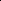
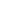

# SFGA: Similarity-Constrained Fusion Learning for Unsupervised Anomaly Detection in Multiplex Graphs

<!-- Page 1 -->

SFGA: Similarity-Constrained Fusion Learning for Unsupervised Anomaly Detection in Multiplex Graphs

Huiliang Zhai1,2*, Xiangyi Teng2*†, Jing Liu1,2

1School of Artificial Intelligence, Xidian University, Xi’an, China 2Guangzhou Institute of Technology, Xidian University, Guangzhou, China 23171110703@stu.xidian.edu.cn, tengxiangyi@xidian.edu.cn, neouma@mail.xidian.edu.cn

## Abstract

Multiplex graphs are widely used to model multi-relational complex systems and play an important role in various realworld scenarios such as financial systems and social networks. Hence, detecting anomalous samples in multiplex graph becomes crucial to ensure cybersecurity and stability. Although existing homogeneous graph anomaly detection (GAD) methods can be applied to deal with multiplex graphs, they still face two major challenges: 1) Due to the multiplicity and complexity of relations in multiplex graphs, homogeneous GAD models fail to effectively capture anomalous behaviors that correlate with diverse relational patterns. 2) In real-world applications, malicious entities usually disguise themselves through various camouflage strategies, making it difficult to capture subtle anomalous features via single-relation analysis. To address these challenges, we propose a novel unsupervised anomaly detection method for multiplex graphs based on Similarityconstrained Fusion Graph Autoencoder (SFGA). In SFGA, we design a multiplex graph autoencoder and introduced a cross-plex attention module at the model bottleneck to achieve comprehensive modeling of cross-relation anomaly patterns. Then, a similarity balancing strategy is proposed to constrain node representations at the bottleneck from both local and global perspectives, enhancing the discriminative power against camouflaged anomalies of autoencoder and enabling more effective identification of anomalous nodes with overlapping or deceptive patterns. Extensive experiments are conducted on both synthetic and real-world datasets at varying scales, and the results demonstrate our proposed method outperforms state-of-the-art approaches by a large margin.

Code — https://github.com/zhaihuiliang/SFGA Extended version — https://github.com/zhaihuiliang/

SFGA/SFGA Fullversion with Appendix.pdf

## Introduction

Multiplex graph is a special type of heterogeneous graph (Shen, He, and Kang 2024) composed of shared node features and multiple relation graphs, where each subgraph

*These authors contributed equally. †Corresponding author. Copyright © 2026, Association for the Advancement of Artificial Intelligence (www.aaai.org). All rights reserved.

**Figure 1.** An example to demonstrate relation-specific anomalies (node A) and camouflaged anomalies (node E).

represents a specific type of relationship between nodes, enabling multi-dimensional modeling of complex node interactions. This powerful multi-relational representation capability makes it widely applicable across numerous scenarios such as social networks (Ma et al. 2021; Peng et al. 2023; Pan et al. 2025b), financial systems (Zhao et al. 2021; Wang et al. 2023), and e-commerce networks (Yang et al. 2022; Ni, Li, and McAuley 2019). To ensure the reliability and security of these real-world systems, it is crucial to perform anomaly detection on multiplex graphs, which enables the identification of abnormal samples that deviate from expected patterns. Taking e-commerce platform as an example, malicious users may fabricate fake reviews to boost product visibility (Liu et al. 2021b; Pan et al. 2025a) or distribute fraudulent links (Zhang et al. 2024; Miao et al. 2025) to guide victims into fake websites. In this case, accurately identifying these anomalies is essential for maintaining a secure digital ecosystem and enhancing user experience.

Aiming to identify the abnormous samples in graphstructured data, graph anomaly detection (GAD) (Guo et al. 2023; Zhao et al. 2025) emerges as a potential solution to address this issue. Leveraging powerful unsupervised learning techniques, such as graph autoencoders (Ding et al. 2019) and graph contrastive learning (Liu et al. 2021a), existing GAD approaches are capable of detecting anomalies without requiring labeled instances, which greatly improves their applicability in real-world scenarios where annotated anomalies are scarce or unavailable. As the multi-relational inter-

The Fortieth AAAI Conference on Artificial Intelligence (AAAI-26)

28140

AI-readable visual equivalent, added: Figure extracted from the paper PDF and converted to an SVG wrapper asset. Use the surrounding page text and caption for interpretation.

<!-- Page 2 -->

actions can be collapsed into a homogeneous graph by treating all relation types uniformly, mainstream GAD methods can be potentially applied to detect anomalies in multiplex graphs.

While existing GAD methods for homogeneous graphs can be a feasible solution for anomaly detection in multiplex graphs, the unique characteristics of real-world multiplex graph data give rise to two major challenges that hinder their effectiveness. Challenge 1 - relation-specific anomaly patterns. Fraudulent behaviors may only manifest in one or several types of relation while performing normal in other types of relation, making it difficult for homogeneous GAD models to capture anomalies. For instance, in e-commerce review data (Dou et al. 2020a), a fraudulent user (e.g., node A in Fig. 1) may post suspiciously positive reviews for low-quality products (anomalous in the review graph) but show no corresponding activity in the browsing or purchase graphs. In this case, collapsing multiple relations into a homogeneous graph may eliminate important relational distinctions, making it harder to distinguish anomalous behavior from normal patterns. Challenge 2 - camouflaged anomalies in multiplex graphs. In real-world anomaly detection scenarios, malicious entities often employ various camouflage tactics to mimic the behaviors of normal users, making them hard to distinguish from benign ones (Zhang et al. 2024; Dou et al. 2020a; Zhang et al. 2021). For example, fraudsters may post carefully timed reviews (Wen et al. 2020) or imitate common language styles (Dou et al. 2020b), causing their latent features to overlap with those of normal users (e.g., node E in Fig. 1). In the context of multiplex graphs, this challenge becomes more severe, since camouflaged anomalies can only be exposed by jointly analyzing behavioral consistency and topological signals in multiple relation types. As a result, directly applying homogeneous GAD methods may fail to capture subtle inconsistencies across relations, leading to reduced detection accuracy.

To address the above challenges, in this paper, we propose Similarity-constrained Fusion Graph Autoencoder (SFGA for short), a novel method specifically designed for unsupervised anomaly detection in multiplex graphs. To handle Challenge 1, we designed a multiplex graph autoencoder with inter-relation attention as the backbone model for anomaly detection of multiplex graphs. More specifically, the autoencoder conduct encoding and decoding based on each relational graph separately, which effectively captures and discriminates the relation-specific information. Meanwhile, a cross-plex attention module is employed at the autoencoder bottleneck to enable interactive information flow among multiple graphs, comprehensively modeling crossrelation patterns for anomaly detection. To overcome Challenge 2, we designed a similarity balancing strategy that constrains bottleneck node representations from both local and global perspectives, ensuring their distributions are well-regulated across multiple dimensions. The balancing strategy enhances the discriminative power of the autoencoder against camouflaged anomalies, making it more effective in identifying anomalies with overlapping or deceptive patterns in multiplex graphs. We conducted extensive experiments on four datasets with either real-world anoma- lies or injected anomalies, and the results show the superior anomaly detection capability of SFGA over state-of-the-art approaches.

## Related Work

In this section, we briefly review two related research directions. A more detailed review is provided in Appendix A. Multiplex Graph Learning. A multiplex graph is a graph composed of multiple views or multiple types of edges. Multiplex graph learning (MGL) aims to learn informative representations or make predictions from such graphs by considering both the structural and attributive information of different views. Based on whether label information is used for training, MGL approaches can be categorized into two categories: supervised (Yun et al. 2019; Zhang et al. 2019)and unsupervised methods (Park et al. 2020; Jing, Park, and Tong 2021). Representative supervised methods include (Hu et al. 2020; Wang et al. 2019; Fu et al. 2020), whose approach is using graph neural networks (GNNs) (Kipf and Welling 2016; Velickovic et al. 2017; Hamilton, Ying, and Leskovec 2017) to project heterogeneous structures to homogeneous structures, which further trained by the supervision signals from label-guided downstream tasks. Due to the heavy costs of labels acquisition (Zhao et al. 2020), researchers pay more attention in unsupervised multiplex graph learning (UMGL). Pioneer studies on UMGL (Lin et al. 2021; Pan and Kang 2021) integrate graph filtering with spectral and subspace clustering to reveal underlying patterns in complex networks, while other UMGL methods (Liu et al. 2022b; Mo et al. 2023a; Qian, Li, and Kang 2024; Peng, Wang, and Zhu 2023; Mo et al. 2023b) adopt unsupervised approachs which utilizing GNNs to generate low-dimensional embeddings and leverage self-supervised learning for model optimization. The learned embeddings can be used in various downstream tasks, including node classification, clustering, and similarity search. However, existing methods mainly focus on representation learning but fail to apply to anomaly detection in multiplex graphs. Different from them, this paper aims to develop an endto-end model to identify anomalous nodes from multiplex graphs. Anomaly Detection on Graph. Graph anomaly detection (GAD) (Liu et al. 2021a) aims to identify nodes deviating statistically from the dominant pattern. Existing GAD methods comprise two categories: traditional and deep learning-based approaches (Pan et al. 2023). Traditional graph anomaly detection distinguishes outliers against normal nodes using non-deep learning methodologies (Perozzi and Akoglu 2016; Li et al. 2017; Peng et al. 2018; Wang et al. 2018; Huang et al. 2022). While traditional methods exhibit limited capacity for high-dimensional features and complex structures, deep learning-based GAD methods achieve higher precision and efficiency by effectively extracting hierarchical relational patterns. Deep learningbased methods primarily utilizes two techiniques: generative learning and contrastive learning. Generative methods (Ding et al. 2019; Fan, Zhang, and Li 2020; Ding et al. 2021; Li et al. 2024) primarily employ GNNs as graph encoders to extract discriminative information within graphs.

28141

<!-- Page 3 -->

Differently, contrastive learning-based methods detect graph anomalies by constructing multi-scale contrastive scenarios (Liu et al. 2021a; Jin et al. 2021; He et al. 2024; Huang et al. 2023; Zheng et al. 2021). Complementary to these two major paradigms, other GAD solutions (Zhou et al. 2021; Wang et al. 2021; Liu et al. 2022a) have also achieved promising results. However, most existing methods are designed for homogeneous edge relationships within singlelayer graphs. In contrast, real-world scenarios often involve multiplex graphs with heterogeneous edges, posing significant challenges to identify anomalies from such graphs.

Preliminary In this paper, we investigate unsupervised graph anomaly detection (GAD) problem on multiplex graphs due to the difficulty in acquiring labeled anomalies in complex realworld graphs. That is to say, the GAD models learn without both node category labels and anomaly labels. Specifically, the definition of multiplex graphs and the multiplex graph anomaly detection (MGAD) problem are given as follows. Multiplex Graphs. Let g = (V, A, X) denote a graph, where V is its node set, A is the adjacency matrix, and X is the node features. A multiplex graph can be represented as G = {g(1), g(2),..., g(R)}, in which R denotes the number of graphs, g(r) denotes the r-th view in the multiplex graph. In g(r) = (V, A(r), X), A(r) denotes the graph structure of each view, while V and X ∈RN×F denote the set of all nodes and node features shared among all views, where N = |V| and F denote the number of nodes and size of node features, respectively. MGAD Problem. Given a multiplex graph G, the unsupervised MGAD problem aims to detect nodes that differ signifcantly from most others in terms of both structure and features. The objective is to learn an anomaly function f (·) to estimate the anomaly score of each node vi ∈V, where a larger the score f(vi) indicates a higher probability of node vi being anomalous.

## Methodology

In this section, we introduce the proposed method, termed SFGA, designed for unsupervised anomaly detection in multiplex graphs. As illustrated in Figure 2, the backbone of the anomaly detection model is a multiplex graph autoencoder, where the discriminative knowledge from different relational graphs is encoded in separate channels of the autoencoder. To jointly capture inter-relational dependencies and enhance representation coherence, we further design an attentive inter-relation fusion module to fuse the bottleneck representations from different channels through a multiview cross-attention mechanism, which facilitates the detection of subtle anomalies that only emerge through inconsistencies across multiple relation types. To detect camouflaged anomalies, we dedicately design a similarity-constrained detection module that enforces both neighbor-node similarity and far-node separability in the latent space, encouraging the model to amplify subtle deviations from typical node patterns even when features appear deceptively normal. Finally, a hierarchical anomaly scoring module is employed to estimate the abnormality from both reconstruction error and local similarity. The following subsections provide detailed descriptions of each module.

Autoencoder with Attentive Inter-Relation Fusion Relation Separated Autoencoder To identify anomalous samples from a homogeneous graph without supervision signals (i.e., labeled anomalies), a widely adopted solution is to build an autoencoder model as the basic detector (Ding et al. 2019; Fan, Zhang, and Li 2020; Zheng et al. 2021). Concretely, their key idea is to reconstruct the graph structure or node features from low-dimensional embeddings, under the assumption that anomalies will incur larger reconstruction errors due to their deviation from dominant patterns. Nevertheless, for multiplex graphs, it is crucial to consider the diverse interaction patterns across different relational graphs, as anomalies may only manifest in specific relations while remaining inconspicuous in others. In this case, a feasible solution is to encode each relational graph with separate autoencoder channels, which allows the model to preserve relation-specific structural and semantic patterns.

To this end, we first employ multiple channels of graph autoencoder with independent GCN layers to each relational graph. Specifically, for the r-th relational graph g(r), the corresponding encoder generates view-specific node representations H(r)

i based on both node features and unique topological structures within each graph by:

H(r)

l = σ(ˆD

−1

2 r ˆA(r) ˆD

−1

2 r H(r)

l−1W(r)

l), (1)

where ˆA(r) = A(r) + wIN, w indicates the weight of identity matrix, ˆDr indicates the degree matrix of ˆA(r), W(r)

l indicates the trainable parameters, and σ(·) represents the non-linear activation function. Here, the input embedding H(r)

0 = X is denoted as the raw feature, and the output, i.e., the bottleneck representations of autoencoder, is denoted as H(r) = H(r)

L, where L is the layer number. With such separate channel encoders, the bottleneck representations can effectively preserve the relation-specific structural and semantic knowledge, laying a solid foundation to capture relational anomaly patterns.

After encoding, the next step is to reconstruct the original data based on the low-dimensional bottleneck representations. Due to the overwhelming computational cost of reconstructing the full graph structure, in SFGA, we simplify the objective as only reconstructing the node features. Specifically, we attempt to use the learned latent representations H(r) from each relational graph. In each channel, we predict the raw node features bX(r) using a relation-specific MLP-based decoder, which can be written as follows:

H

′(r) l = σ(H

′(r) l−1W

′(r) l), (2)

where W

′(r) l denotes the weight matrix of the l-th layer in the MLP, and σ(·) represents the non-linear activation function. In the decoder, the input is the bottleneck representation, i.e., H

′(r) 0 = H(r), and the final output is the reconstructed features, i.e., bX(r) = H

′(r) L′.

28142

<!-- Page 4 -->

**Figure 2.** The overall pipeline of SFGA.

To optimize the graph autoencoder model, a reconstruction loss function is applied to minimize the reconstruction errors of node features, which can be represented by:

Lrec = 1

N

R X r=1

N X i=1

(bX(r) −X)2. (3)

This term enforces that the reconstructed node features are closed to original input (i.e., the node features). In this way, the model learns to capture the dominant patterns of the multiplex graph data, while anomalies, which deviate significantly from these patterns, incur higher reconstruction errors and can thus be effectively detected.

Attentive Inter-Relation Fusion Although the relationseparated autoencoder allows the unique characteristics of each relational graph to be independently captured, it fails to model the interdependencies across different relations, which are often crucial for identifying cross-relation inconsistencies and subtle anomalies (Mo et al. 2023a; Jing, Park, and Tong 2021). To further enable information communication across different relational graphs, in SFGA, we design an attentive inter-relation fusion module that aggregates bottleneck representations from all relation-specific channels through a learnable cross-attention mechanism, which adaptively learns cross-relation information to capture complex abnormality in multiplex graphs.

Specifically, we designate the anchor view in the multiplex graph as the focal graph g(f), and the other graphs within the same multiplex graph as contextual graphs g(c) (here f, c ∈{1, · · ·, R}), then the representation importance of contextual graph g(c) for node i in focal graph g(f) can be calculated as:

¯α(c)

i = 1

N

N X m=1 h(f)

i Wq

T h(c)

m W(c)

k

, (4)

where ¯α(c)

i denotes the importance of contextual graph c to the the representation of node i in the focal graph, W(c)

k is the key transformation matrix specific to contextual graph c, Wq ∈Rd×d is the query transformation matrix for node i in the focal graph, h(f)

i represents the embedding of node i in the focal graph, h(c)

m denotes the embedding of node m in contextual graph c, and N is the total number of nodes. We then obtain the weights of node representations from different views, i.e., α(c)

i = exp (α(c)

i) PR r=1 exp (α(r)

i)

, (5)

where α(c)

i represents the importance weight of the c-th contextual graph for node i in the focal graph. The final fused representation ˜h(f)

i of node i is obtained through weighted aggregation:

˜h(f)

i =

R X r=1 α(r)

i h(r)

i. (6)

By concatnating the fused representations of all nodes, the fused representation matrix H(f) can be used for downstream decoder and further processing. This attentive fusion mechanism enables the model to selectively integrate complementary signals across relational views, which enhances its capacity to detect complex, relation-inconsistent anomalies that are otherwise overlooked in isolated views.

Similarity-Constrained Detection Module While the graph autoencoder-based backbone effectively captures dominant structural and attribute patterns, it may suffer from insufficient discriminability when faced with camouflaged anomalies or overlapping node representations (Li et al. 2024). In multiplex graphs, the situation can be more severe since camouflaged anomalies may exhibit normal behavior in most relation types, making them difficult to distinguish (Zhang et al. 2024). To uncover cam-

28143

AI-readable visual equivalent, added: Figure extracted from the paper PDF and converted to an SVG wrapper asset. Use the surrounding page text and caption for interpretation.

<!-- Page 5 -->

ouflaged anomalies, an effective approach is to leverage local similarity patterns (Li et al. 2024; Qiao and Pang 2023). More specifically, although these anomalies mimic normal node features, such feature-level camouflage can disrupt the inherent homophily property of the graph, which causes the latent representation of an abnormal node to deviate significantly from those of its neighbors.

Building on this intuition, in SFGA, we employ a homophily-aware similarity balancing strategy that guides model training through both local and global distributional constraints in latent space, ultimately optimizing feature representations and also forming a powerful detection module. To be more specific, within each view of the multiplex graph structure, we enhance the average similarity between node representations and their 1-hop neighbor representations in latent space, forcing the model to focus on latent relationships between adjacent node pairs. The similarity can be:

sim(r)

i|nei = 1

N (r)

i|nei

N (r)

i|nei X j=1

˜h(r)T i ˜h(r)

j ∥˜h(r)

i ∥· ∥˜h(r)

j ∥

, (7)

where sim(r)

i|neidenotes the average representation similarity between node i and its 1-hop neighbors in the r-th view, where ˜h(r)

j ∈{˜h(r)

j |vj ∈N (r)

i }, N (r)

i represents the 1- hop neighborhood set of node vi, and N (r)

i|nei indicates the cardinality of node vi’s 1-hop neighborhood set.

Simultaneously, we reduce the average similarity between node representations and their non-1-hop neighbors in latent space, forcing the model to learn a more reasonable global node representation distribution:

sim(r)

i|global = 1

N (r)

i|dis

N (r)

i|dis X k=1

˜h(r)T i ˜h(r)

k ∥˜h(r)

i ∥∥˜h(r)

k ∥

, (8)

here, sim(r)

i|global denotes the average representation similarity between node i and its non-1-hop neighbors in the r-th view, where ˜h(r)

k ∈{˜h(r)

k |vk /∈N (r)

i }, and N (r)

i|dis indicates the number of disconnected nodes from vi in view r.

To maximize the local similarity while minimizing the global one, the constraint loss for the i-th node is given as:

Lcon =

X vi∈V

R X r=1 sim(r)

i|global −sim(r)

i|nei

. (9)

This constraint encourages the model to learn locally coherent yet globally discriminative node representations, making camouflaged anomalies more distinguishable from their neighbors. Importantly, it complements the autoencoderbased backbone by injecting structure-aware supervision into the latent space, and the local similarity can also serves as an indicator of node abnormality.

To jointly optimize node attribute reconstruction errors and representation constraint errors, the objective function of our model can be formulated as:

L = αLrec + (1 −α)Lcon, (10)

where α is a controlling parameter which balances the impacts of reconstruction and similarity contraint.

Hierarchical Anomaly Scoring After sufficient training iterations, anomalies hidden within nodes start to manifest progressively. As the loss function (Eq. (9)) optimizing, a subset of anomalous nodes are initially detected during the representation constraint phase. That is to say, nodes that fail to exhibit normal local similarity patterns are more likely to be identified as anomalies. We begin by evaluating node abnormality from this perspective as following:

f(vi)con = −

R X r=1

1

N (r)

i|nei

N (r)

i|nei X j=1

˜h(r)T i ˜h(r)

j ∥˜h(r)

i ∥· ∥˜h(r)

j ∥

. (11)

At the same time, the reconstruction errors can also indicate the abnormality of nodes. Hence, we can compute the anomaly score of each node vi according to:

f(vi)rec =

R X r=1

||ˆx(r)

i −xi||2. (12)

Finally, the node anomaly score in the multiplex graph is the summation of the scores from the two phases:

f(vi) = βf(vi)rec + (1 −β)f(vi)con, (13)

where β is a controlling parameter to balance the the scores of different levels. The overall algorithm of our SFGA is proposed in Appendix B, with the time complexity of O(r · N 2 · h) and detailed complexity analysis is given in Appendix C.

## Experiments

## Experimental Setup

Datasets. To ensure sufficient coverage of different experimental data types, we conducted experiments on two smallscale datasets with manually injected synthetic anomalies: IMDB (Wang et al. 2019) and Freebase (Mo et al. 2023b), one medium-sized and one large real-world dataset containing fraudulent anomalies: Amazon-fraud and YelpChifraud (Dou et al. 2020a). We injected two types of anomalies into originally normal datasets: contextual anomalies created by swapping node attributes, and structural anomalies generated by disrupting node connections. When injecting both types, we maintained equal quantities for each, following prior research (Ding et al. 2019; Liu et al. 2024). The specific details of anomaly injection and the statistics of datasets are presented in Appendix D. Baselines. We employ three categories of unsupervised GAD methods as baselines: 1) methods based on contrastive learning including CoLA (Liu et al. 2021a), PREM (Pan et al. 2023) and AD-GCL (Xu et al. 2025), 2) methods based on graph autoencoders including DOMINANT (Ding et al. 2019), ADA-GAD (He et al. 2024) and GADAM (Chen et al. 2024), and 3) method based on message passing represented by TAM (Qiao and Pang 2023). A summary of the

28144

<!-- Page 6 -->

## Method

IMDB(I) Freebase(I) Amazon(R) YelpChi(R)

AUROC AUPRC AUROC AUPRC AUROC AUPRC AUROC AUPRC

TAM 70.38±1.24 26.64±4.31 84.89±3.74 38.88±2.97 71.13±6.56 34.19±12.47 OOM OOM CoLA 56.01±0.49 9.14±0.18 55.38±0.54 6.55±0.19 25.01±0.20 5.05±0.05 54.25±0.05 16.38±0.04 PREM 65.20±0.49 14.31±0.30 53.26±0.74 6.46±0.32 68.42±4.62 22.27±7.45 49.96±5.01 15.07±2.34 DOMINANT 75.19±0.59 24.38±1.87 60.14±0.53 11.73±0.58 49.54±3.69 6.16±0.28 48.92±0.40 14.85±0.30 ADA-GAD 58.11±0.01 10.39±0.08 54.54±0.10 6.29±0.03 26.23±0.04 4.25±0.01 47.07±0.01 13.96±0.01 GADAM 71.41±0.08 19.82±0.37 75.81±2.72 19.44±1.37 51.83±0.60 7.18±0.19 51.28±0.27 14.80±0.10 AD-GCL 64.33±0.93 15.24±1.31 64.05±1.42 9.10±0.79 28.15±1.04 4.83±0.18 OOM OOM

SFGA 80.33±0.37 43.07±0.37 92.98±2.84 58.50±12.10 78.48±3.06 16.39±1.80 70.06±0.33 24.68±0.40

**Table 1.** Results in terms of AUROC and AUPRC (in percent ± standard deviation) on 4 datasets, with the best results highlighted in bold black, where “I” indicates datasets with injected anomalies and “R” indicates which with real anoamlies. OOM indicates Out-Of-Memory on a 96GB GPU.

Component Amazon YelpChi

ATT SC HD AUROC AUPRC AUROC AUPRC

– – – 71.86±7.77 13.76±3.78 51.44±1.07 15.68±0.47 – ✓ ✓ 73.13±0.57 15.64±0.77 59.63±1.44 19.83±1.17 ✓ – ✓ 73.47±4.48 13.17±2.53 67.99±0.81 22.43±0.28 ✓ ✓ – 77.69±2.74 15.79±1.85 67.82±0.65 22.33±0.25 ✓ ✓ ✓ 78.48±3.06 16.39±1.80 70.06±0.33 24.68±0.40

**Table 2.** Ablation study results on Amazon and YelpChi of SFGA, with the best results highlighted in bold black.

baselines are provided in Appendix E. Moreover, to ensure a relatively more fair comparison and apply these GAD methods initially designed for homogeneous graphs to multiplex graphs, we treat all edges in the multiplex graph as a single edge type, thereby collapsing them into homogeneous graphs, the specific processing procedures are presented in Appendix D.

## Evaluation

Metrics. Consistent with established graph anomaly detection research (Liu et al. 2021a; Ding et al. 2019), we measure the performance on all these methods using two evaluation metrics: AUROC (Area Under the Receiver Operating Curve) and AUPRC (Area Under the Precision-Recall Curve).

Experimental Details. To ensure fair comparison, we conducted moderate parameter tuning for all baseline methods to maximize their performance. For our proposed SFGA, we employ a single-layer GCN as the encoder for the r-th view, where the embedding dimension is set to DE. As the dataset scales differ, we set different numbers of linear layers L for the MLP-based decoder, configure different quantities of hidden units, and correspondingly adjust the learning rate based on the specific dataset scales. Additionally, all parameters are optimized with the Adam optimizer (Kingma 2014) using the same weight decay, and we use ReLU (Nair and Hinton 2010) function as the nonlinear activation function. To ensure consistency, all methods report the average results from 10 independent runs for comparison. The implementation details and architectural configurations of our method during experiments are shown in Appendix F.

Experimental Results

Performance Comparison. According to the results presented in Table 1, we have the below analysis based on these observations. 1) Although we have conducted parameter tuning for all baselines to maximize their performance potential on multiplex graphs, our proposed SFGA still demonstrates superior performance compared to these baselines. Specifically, on the Freebase and Amazon datasets, SFGA achieves approximately 8% higher AUROC than the second-best method in the group. Moreover, in terms of the AUPRC, SFGA demonstrates over 16% improvement compared to the best baseline results on both the IMDB and Freebase datasets. This validates the effectiveness of our proposed method while demonstrating that such GAD methods initially designed for homogeneous graphs are not suitable for multiplex graphs. 2) On the IMDB dataset, the reconstruction-based DOMINANT outperforms other baselines, yet still shows a 5% gap in AUROC compared to SFGA. This demonstrates that the representation constraint mechanism effectively improves node embeddings in the latent space and mitigates distribution overlapping. 3) On the YelpChi dataset, all baselines exhibit suboptimal detection performance compared to SFGA, which indicates the application potential of SFGA in large-scale datasets. In summary, with the exploitation of inter-relation correlations and constraints on node embeddings in latent space, SFGA can capture more task-relevant information, thereby enhancing its anomaly detection performance. Ablation Study. To validate the effectiveness of key components in SFGA, we conducted ablation studies on multiple variants of the complete SFGA framework, with all results shown in Table 2. Here, ATT, SC, and HD denote the inter-relation attention mechanism, similarity-based constraint mechanism, and hierarchical anomaly detector in our proposed method, respectively.

Through analysis of the obtained results, we draw the following conclusions: 1) Compared with the variant without ATT, our proposed SFGA demonstrates significant improvements in both metrics, exemplified by 10-percentagepoint and 5-percentage-point increases in AUROC and AUPRC respectively on the YelpChi dataset. This indicates

28145

<!-- Page 7 -->

(a) Loss (b) Scoring

**Figure 3.** The effect of the trade-off parameters α and β on loss and scoring.

that the inter-relation attention mechanism can integrate complementary signals from multiple relations, yielding substantial impact on downstream anomaly detection tasks. 2) In contrast to the variant without SC, SFGA also performs better in both metrics, indicating that the similaritybased constraint mechanism plays a critical role in optimizing the representation quality of the model and enhancing its discriminative capability for camouflaged anomalies. 3) The contribution of HD remains non-negligible, as it can expand the anomaly detection scope of the model to enhance its performance. Finally, compared to the variant devoid of ATT, SC, and HD, our method demonstrates substantial superiority across all metrics. This indicates that the proposed inter-relation attention mechanism, similaritybased constraint mechanism, and hierarchical anomaly detector can effectively collaborate during training to mutually enhance the anomaly detection performance of SFGA. Parameter Analysis. To investigate how parameters α in Eq. (10) and β in Eq. (13) affect performance under different settings, we specifically tested anomaly detection on the Amazon-fraud dataset. We varied the parameter values from 0 to 1 with stride = 0.1 and present the results in Figure 3. As shown in Fig. 3a, we observe that variations in α, which controls the weighting between the reconstruction loss and representation constraint loss terms, lead to corresponding fluctuations in both AUROC and AUPRC performance metrics, and both evaluation metrics get the best when α approaches 0.4. However, performance becomes unstable when the representation constraint loss weight falls below 0.5. Notably, extreme α values (approaching either 1 or 0) consistently lead to degraded model performance. From these we can observe that the weight ratio between the two loss terms significantly impacts model performance, while also revealing that the representation constraint mechanism effectively reduces feature overlap caused by “camouflage” in fraud data, evidenced by the performance fluctuations when α exceeds 0.5.

Fig. 3b reveals that the AUROC metric goes to top when β approaches 0.5, then declines as β nears extreme values (0 or 1). In contrast, AUPRC shows a gradual improvement with increasing β values, reaching its maximum when β ≥0.8. This proves the feature reconstruction detector in SFGA, with the balancing strategy, can effectively identify attribute anomalies with camouflage characteristics, but relying too much on it limits detection performance, which proves again the effectiveness of our hierarchical anomaly

(a) IMDB (b) Amazon

**Figure 4.** Efficiency comparison based on training time required to achieve optimal results.

(a) SFGA (b) SFGA w/o con (c) SFGA w/o rec

**Figure 5.** Visualization results on IMDB dataset.

detection mechanism. Efficiency Analysis. To further verify the efficiency of SFGA, we compare the training time required to achieve optimal results with baseline methods on IMDB and Amazon datasets. For the training of all methods, we fixed the model parameters that yielded the results reported in Table 1, the total time cost and corresponding detection results are presented in Fig. 4a and 4b. The results demonstrate that while SFGA ranks 3rd across both datasets in terms of computational cost, its attainment of best performance validates comprehensive superiority over all baselines. Visualization. We further visualize the anomaly score distributions learned by different components of our method on the IMDB dataset in Fig. 5. As shown in Fig. 5a, we observe a clear stratification between anomaly scores of normal and abnormal nodes learned by SFGA, where the combination of the two detectors creates distinct separation between feature anomalies and structural anomalies. When using only the feature reconstruction detector for anomaly detection, Fig. 5b clearly shows that the detected feature-anomalous nodes have significantly higher anomaly scores than structural-anomalous nodes, proving our feature anomaly detector works as intended. Correspondingly, when using only the similarity-based constraint detector for anomaly detection, Fig. 5c demonstrates that structural-anomalous nodes achieve significantly higher anomaly scores than feature-anomalous nodes while maintaining clear separation from normal nodes, which confirms the strong effectiveness of such detector in identifying structural anomalies. In summary, such clear anomaly score boundaries demonstrate the outstanding detection capability of our proposed method.

28146

AI-readable visual equivalent, added: Figure extracted from the paper PDF and converted to an SVG wrapper asset. Use the surrounding page text and caption for interpretation.

AI-readable visual equivalent, added: Figure extracted from the paper PDF and converted to an SVG wrapper asset. Use the surrounding page text and caption for interpretation.

AI-readable visual equivalent, added: Figure extracted from the paper PDF and converted to an SVG wrapper asset. Use the surrounding page text and caption for interpretation.

AI-readable visual equivalent, added: Figure extracted from the paper PDF and converted to an SVG wrapper asset. Use the surrounding page text and caption for interpretation.

AI-readable visual equivalent, added: Figure extracted from the paper PDF and converted to an SVG wrapper asset. Use the surrounding page text and caption for interpretation.

AI-readable visual equivalent, added: Figure extracted from the paper PDF and converted to an SVG wrapper asset. Use the surrounding page text and caption for interpretation.

AI-readable visual equivalent, added: Figure extracted from the paper PDF and converted to an SVG wrapper asset. Use the surrounding page text and caption for interpretation.

AI-readable visual equivalent, added: Figure extracted from the paper PDF and converted to an SVG wrapper asset. Use the surrounding page text and caption for interpretation.

<!-- Page 8 -->

## Conclusion

In this paper, we proposed SFGA, a novel unsupervised multiplex graph anomaly detection method. Through an interrelation attentive module and a carefully-designed representation balancing mechanism, SFGA generates high-quality node representations and further produces highly discriminative reconstructed features, ultimately achieving effective graph anomaly detection on multiplex graphs by jointly considering both feature reconstruction errors and similaritybased constraints. Extensive experiments reveal the effectiveness and superior of our proposed method.

In future work, we plan to further optimize the computational efficiency of SFGA to extend its application to very large-scale multiplex graphs, and investigate the possibility integrated with large language model for a more accurate anomaly detection.

## Acknowledgments

This work was supported in part by the National Natural Science Foundation of China under Grants 62306224 and 62471371, in part by the Guangdong High-level Innovation Research Institution Project under Grant 2021B0909050008, and in part by the Guangzhou Key Research and Development Program under Grant 202206030003.

## References

Chen, J.; Zhu, G.; Yuan, C.; and Huang, Y. 2024. Boosting graph anomaly detection with adaptive message passing. In The 12th International Conference on Learning Representations. Ding, K.; Li, J.; Agarwal, N.; and Liu, H. 2021. Inductive anomaly detection on attributed networks. In Proceedings of the 29th International Conference on International Joint Conferences on Artificial Intelligence, 1288–1294. Ding, K.; Li, J.; Bhanushali, R.; and Liu, H. 2019. Deep anomaly detection on attributed networks. In Proceedings of the 2019 SIAM International Conference on Data Mining, 594–602. SIAM. Dou, Y.; Liu, Z.; Sun, L.; Deng, Y.; Peng, H.; and Yu, P. S. 2020a. Enhancing graph neural network-based fraud detectors against camouflaged fraudsters. In Proceedings of the 29th ACM International Conference on Information & Knowledge Management, 315–324. Dou, Y.; Ma, G.; Yu, P. S.; and Xie, S. 2020b. Robust spammer detection by nash reinforcement learning. In Proceedings of the 26th ACM SIGKDD International Conference on Knowledge Discovery & Data Mining, 924–933. Fan, H.; Zhang, F.; and Li, Z. 2020. Anomalydae: Dual autoencoder for anomaly detection on attributed networks. In ICASSP 2020-2020 IEEE International Conference on Acoustics, Speech and Signal Processing, 5685–5689. IEEE. Fu, X.; Zhang, J.; Meng, Z.; and King, I. 2020. Magnn: Metapath aggregated graph neural network for heterogeneous graph embedding. In Proceedings of the Web Conference, 2331–2341.

Guo, J.; Tang, S.; Li, J.; Pan, K.; and Wu, L. 2023. Rustgraph: Robust anomaly detection in dynamic graphs by jointly learning structural-temporal dependency. IEEE Transactions on Knowledge and Data Engineering, 36(7): 3472–3485.

Hamilton, W.; Ying, Z.; and Leskovec, J. 2017. Inductive representation learning on large graphs. volume 30.

He, J.; Xu, Q.; Jiang, Y.; Wang, Z.; and Huang, Q. 2024. Ada-gad: Anomaly-denoised autoencoders for graph anomaly detection. In Proceedings of the AAAI Conference on Artificial Intelligence, volume 38, 8481–8489.

Hu, Z.; Dong, Y.; Wang, K.; and Sun, Y. 2020. Heterogeneous graph transformer. In Proceedings of the Web Conference, 2704–2710.

Huang, T.; Pei, Y.; Menkovski, V.; and Pechenizkiy, M. 2022. Hop-count based self-supervised anomaly detection on attributed networks. In Joint European Conference on Machine Learning and Knowledge Discovery in Databases, 225–241. Springer.

Huang, Y.; Wang, L.; Zhang, F.; and Lin, X. 2023. Unsupervised graph outlier detection: Problem revisit, new insight, and superior method. In 2023 IEEE 39th International Conference on Data Engineering, 2565–2578. IEEE.

Jin, M.; Liu, Y.; Zheng, Y.; Chi, L.; Li, Y.-F.; and Pan, S. 2021. Anemone: Graph anomaly detection with multi-scale contrastive learning. In Proceedings of the 30th ACM International Conference on Information & Knowledge Management, 3122–3126.

Jing, B.; Park, C.; and Tong, H. 2021. Hdmi: High-order deep multiplex infomax. In Proceedings of the Web Conference, 2414–2424.

Kingma, D. P. 2014. Adam: A method for stochastic optimization. arXiv preprint arXiv:1412.6980.

Kipf, T. N.; and Welling, M. 2016. Semi-supervised classification with graph convolutional networks. arXiv preprint arXiv:1609.02907.

Li, J.; Dani, H.; Hu, X.; and Liu, H. 2017. Radar: Residual analysis for anomaly detection in attributed networks. In IJCAI, volume 17, 2152–2158.

Li, J.; Gao, Y.; Lu, J.; Fang, J.; Wen, C.; Lin, H.; and Wang, X. 2024. DiffGAD: A Diffusion-based Unsupervised Graph Anomaly Detector. arXiv preprint arXiv:2410.06549.

Lin, Z.; Kang, Z.; Zhang, L.; and Tian, L. 2021. Multi-view attributed graph clustering. IEEE Transactions on Knowledge and Data Engineering, 35(2): 1872–1880.

Liu, F.; Ma, X.; Wu, J.; Yang, J.; Xue, S.; Beheshti, A.; Zhou, C.; Peng, H.; Sheng, Q. Z.; and Aggarwal, C. C. 2022a. Dagad: Data augmentation for graph anomaly detection. In 2022 IEEE International Conference on Data Mining, 259– 268. IEEE.

Liu, K.; Dou, Y.; Ding, X.; Hu, X.; Zhang, R.; Peng, H.; Sun, L.; and Yu, P. S. 2024. Pygod: A python library for graph outlier detection. Journal of Machine Learning Research, 25(141): 1–9.

28147

<!-- Page 9 -->

Liu, L.; Kang, Z.; Ruan, J.; and He, X. 2022b. Multilayer graph contrastive clustering network. Information Sciences, 613: 256–267. Liu, Y.; Li, Z.; Pan, S.; Gong, C.; Zhou, C.; and Karypis, G. 2021a. Anomaly detection on attributed networks via contrastive self-supervised learning. IEEE Transactions on Neural Networks and Learning Systems, 33(6): 2378–2392. Liu, Y.; Pan, S.; Wang, Y. G.; Xiong, F.; Wang, L.; Chen, Q.; and Lee, V. C. 2021b. Anomaly detection in dynamic graphs via transformer. IEEE Transactions on Knowledge and Data Engineering, 35(12): 12081–12094. Ma, X.; Wu, J.; Xue, S.; Yang, J.; Zhou, C.; Sheng, Q. Z.; Xiong, H.; and Akoglu, L. 2021. A comprehensive survey on graph anomaly detection with deep learning. IEEE Transactions on Knowledge and Data Engineering, 35(12): 12012– 12038. Miao, R.; Liu, Y.; Wang, Y.; Shen, X.; Tan, Y.; Dai, Y.; Pan, S.; and Wang, X. 2025. Blindguard: Safeguarding llm-based multi-agent systems under unknown attacks. arXiv preprint arXiv:2508.08127. Mo, Y.; Chen, Y.; Lei, Y.; Peng, L.; Shi, X.; Yuan, C.; and Zhu, X. 2023a. Multiplex graph representation learning via dual correlation reduction. IEEE Transactions on Knowledge and Data Engineering, 35(12): 12814–12827. Mo, Y.; Lei, Y.; Shen, J.; Shi, X.; Shen, H. T.; and Zhu, X. 2023b. Disentangled multiplex graph representation learning. In International Conference on Machine Learning, 24983–25005. PMLR. Nair, V.; and Hinton, G. E. 2010. Rectified linear units improve restricted boltzmann machines. In Proceedings of the 27th International Conference on Machine Learning (ICML-10), 807–814. Ni, J.; Li, J.; and McAuley, J. 2019. Justifying recommendations using distantly-labeled reviews and fine-grained aspects. In Proceedings of the 2019 Conference on Empirical Methods in Natural Language Processing and the 9th International Joint Conference on Natural Language Processing, 188–197. Pan, E.; and Kang, Z. 2021. Multi-view contrastive graph clustering. Advances in Neural Information Processing Systems, 34: 2148–2159. Pan, J.; Liu, Y.; Zheng, X.; Zheng, Y.; Liew, A. W.-C.; Li, F.; and Pan, S. 2025a. A label-free heterophily-guided approach for unsupervised graph fraud detection. In Proceedings of the AAAI Conference on Artificial Intelligence, volume 39, 12443–12451. Pan, J.; Liu, Y.; Zheng, Y.; and Pan, S. 2023. Prem: A simple yet effective approach for node-level graph anomaly detection. In 2023 IEEE International Conference on Data Mining, 1253–1258. IEEE. Pan, J.; Zheng, Y.; Tan, Y.; and Liu, Y. 2025b. A Survey of Generalization of Graph Anomaly Detection: From Transfer Learning to Foundation Models. arXiv preprint arXiv:2509.06609. Park, C.; Kim, D.; Han, J.; and Yu, H. 2020. Unsupervised attributed multiplex network embedding. In Proceedings of the AAAI Conference on Artificial Intelligence, volume 34, 5371–5378. Peng, L.; Mo, Y.; Xu, J.; Shen, J.; Shi, X.; Li, X.; Shen, H. T.; and Zhu, X. 2023. GRLC: Graph representation learning with constraints. IEEE Transactions on Neural Networks and Learning Systems. Peng, L.; Wang, X.; and Zhu, X. 2023. Unsupervised multiplex graph learning with complementary and consistent information. In Proceedings of the 31st ACM International Conference on Multimedia, 454–462. Peng, Z.; Luo, M.; Li, J.; Liu, H.; Zheng, Q.; et al. 2018. ANOMALOUS: A Joint Modeling Approach for Anomaly Detection on Attributed Networks. In IJCAI, volume 18, 3513–3519. Perozzi, B.; and Akoglu, L. 2016. Scalable anomaly ranking of attributed neighborhoods. In Proceedings of the 2016 SIAM International Conference on Data Mining, 207–215. SIAM. Qian, X.; Li, B.; and Kang, Z. 2024. Upper bounding barlow twins: A novel filter for multi-relational clustering. In Proceedings of the AAAI Conference on Artificial Intelligence, volume 38, 14660–14668. Qiao, H.; and Pang, G. 2023. Truncated affinity maximization: One-class homophily modeling for graph anomaly detection. Advances in Neural Information Processing Systems, 36: 49490–49512. Shen, Z.; He, H.; and Kang, Z. 2024. Balanced multirelational graph clustering. In Proceedings of the 32nd ACM International Conference on Multimedia, 4120–4128. Velickovic, P.; Cucurull, G.; Casanova, A.; Romero, A.; Lio, P.; Bengio, Y.; et al. 2017. Graph attention networks. volume 1050, 10–48550. Wang, H.; Zhou, C.; Wu, J.; Dang, W.; Zhu, X.; and Wang, J. 2018. Deep structure learning for fraud detection. In 2018 IEEE International Conference on Data Mining, 567–576. IEEE. Wang, X.; Ji, H.; Shi, C.; Wang, B.; Ye, Y.; Cui, P.; and Yu, P. S. 2019. Heterogeneous graph attention network. In the World Wide Web Conference, 2022–2032. Wang, X.; Jin, B.; Du, Y.; Cui, P.; Tan, Y.; and Yang, Y. 2021. One-class graph neural networks for anomaly detection in attributed networks. Neural Computing and Applications, 33: 12073–12085. Wang, Y.; Zhang, J.; Huang, Z.; Li, W.; Feng, S.; Ma, Z.; Sun, Y.; Yu, D.; Dong, F.; Jin, J.; et al. 2023. Label information enhanced fraud detection against low homophily in graphs. In Proceedings of the ACM Web Conference, 406– 416. Wen, R.; Wang, J.; Wu, C.; and Xiong, J. 2020. Asa: Adversary situation awareness via heterogeneous graph convolutional networks. In Companion Proceedings of the Web Conference, 674–678. Xu, Y.; Peng, Z.; Shi, B.; Hua, X.; Dong, B.; Wang, S.; and Chen, C. 2025. Revisiting Graph Contrastive Learning on Anomaly Detection: A Structural Imbalance Perspective. In Proceedings of the AAAI Conference on Artificial Intelligence, volume 39, 12972–12980.

28148

<!-- Page 10 -->

Yang, Y.; Huang, C.; Xia, L.; Liang, Y.; Yu, Y.; and Li, C. 2022. Multi-behavior hypergraph-enhanced transformer for sequential recommendation. In Proceedings of the 28th ACM SIGKDD Conference on Knowledge Discovery and Data Mining, 2263–2274. Yun, S.; Jeong, M.; Kim, R.; Kang, J.; and Kim, H. J. 2019. Graph transformer networks. In Advances in Neural Information Processing Systems, volume 32. Zhang, C.; Song, D.; Huang, C.; Swami, A.; and Chawla, N. V. 2019. Heterogeneous graph neural network. In Proceedings of the 25th ACM SIGKDD International Conference on Knowledge Discovery & Data Mining, 793–803. Zhang, G.; Wu, J.; Yang, J.; Beheshti, A.; Xue, S.; Zhou, C.; and Sheng, Q. Z. 2021. Fraudre: Fraud detection dualresistant to graph inconsistency and imbalance. In 2021 IEEE International Conference on Data Mining, 867–876. IEEE. Zhang, J.; Xu, Z.; Lv, D.; Shi, Z.; Shen, D.; Jin, J.; and Dong, F. 2024. DiG-In-GNN: discriminative feature guided GNNbased fraud detector against inconsistencies in multi-relation fraud graph. In Proceedings of the AAAI Conference on Artificial Intelligence, volume 38, 9323–9331. Zhao, J.; Wang, X.; Shi, C.; Liu, Z.; and Ye, Y. 2020. Network schema preserving heterogeneous information network embedding. In International Joint Conference on Artificial Intelligence. Zhao, K.; Zhang, Z.; Rong, Y.; Yu, J. X.; and Huang, J. 2021. Finding critical users in social communities via graph convolutions. IEEE Transactions on Knowledge and Data Engineering, 35(1): 456–468. Zhao, Y.; Liu, Y.; Li, S.; Chen, Q.; Zheng, Y.; and Pan, S. 2025. Freegad: A training-free yet effective approach for graph anomaly detection. arXiv preprint arXiv:2508.10594. Zheng, Y.; Jin, M.; Liu, Y.; Chi, L.; Phan, K. T.; and Chen, Y.-P. P. 2021. Generative and contrastive self-supervised learning for graph anomaly detection. IEEE Transactions on Knowledge and Data Engineering, 35(12): 12220–12233. Zhou, S.; Tan, Q.; Xu, Z.; Huang, X.; and Chung, F.-l. 2021. Subtractive aggregation for attributed network anomaly detection. In Proceedings of the 30th ACM International Conference on Information & Knowledge Management, 3672– 3676.

28149
