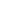
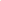

# Source-Free Graph Foundation Model Adaptation via Pseudo-Source Reconstruction

<!-- Page 1 -->

Source-Free Graph Foundation Model Adaptation via

Pseudo-Source Reconstruction

Liang Yang1, Hui Ning1, Jiaming Zhuo1*, Ziyi Ma1, Chuan Wang2, Wenning Wu3, Zhen Wang3

1Hebei Province Key Laboratory of Big Data Calculation, School of Artificial Intelligence, Hebei University of Technology, Tianjin, China, 2School of Computer Science and Technology, Beijing JiaoTong University, Beijing, China, 3School of Artificial Intelligence, OPtics and ElectroNics (iOPEN), School of Cybersecurity, Northwestern Polytechnical University, Xi’an, China, yangliang@vip.qq.com, ninghui048@163.com, jiaming.zhuo@outlook.com, zyma@hebut.edu.cn, wangchuan@iie.ac.cn, wuwenning@nwpu.edu.cn, w-zhen@nwpu.edu.cn

## Abstract

Aiming to overcome distribution shift and label sparsity that hinder cross-domain generalization of Graph Neural Networks (GNNs), Unsupervised Graph Domain Adaptation (UGDA) transfers knowledge from a label-rich source to an unlabeled target graph. Yet in practice, strict privacy protocols often withhold the source graph, reducing UGDA to the more constrained Source-Free UGDA (SFUGDA) where only a pre-trained source GNN remains. In this setting, the source GNN serves as a simple, task-specific graph foundation model. Despite recent progress, existing source-free UGDA methods remain hampered by source-knowledge absence: deprived of source graphs, they lose the reference distribution needed to gauge domain shift and must lean on noisy target cues, incurring biased adaptation and catastrophic forgetting. To overcome this drawback, this paper devises Source-Free Graph foundation model Adaptation via pseudo-source Reconstruction (SFGAR), a twostage SFUGDA framework that first generates pseudo-source graphs to recover the source distribution encoded in a frozen pre-trained GNN, then adversarially aligns these synthetic graphs with the unlabeled target. Theoretical analysis shows that this proxy alignment tightly bounds the target-domain generalization error. Extensive experiments on public benchmarks validate the state-of-the-art performance of SFGAR.

## Introduction

Due to their effectiveness and efficiency, Graph Neural Networks (GNNs) have become powerful tools not only for graph tasks (node-, edge-, and graph-level)(Huang et al. 2023; Zhao et al. 2023; Sun et al. 2024; Wang et al. 2022; Gong et al. 2023; Huang et al. 2024; He et al. 2025; Miao et al. 2024; Zhuo et al. 2023; Chen et al. 2024, 2025; Chen, Wang, and He 2025; Huang et al. 2025; Wang et al. 2025b; Yu et al. 2022; Fu et al. 2023; Li et al. 2025b) but also across application domains including computer (Wang et al. 2024a; Zhuo et al. 2024), natural language processing (Nickel et al. 2015), vision recommendation system (Li et al. 2025a) and

*corresponding author. Copyright © 2026, Association for the Advancement of Artificial Intelligence (www.aaai.org). All rights reserved.

**Figure 1.** Overview of SFGAR. Stage 1 (graph knowledge transfer) uses a frozen Pretrained Extractor to drive Topology Attribute MLPs that construct a pseudo-source graph from the Gaussian noise N(0, I). Stage 2 (model adaption) feeds the pseudo-source and unlabeled target graphs to the extractor to produce the final adapted model.

bioinformatics (Wang et al. 2024b,c; Shen et al. 2024). Despite their impressive success, GNNs still rely on access to large-scale labeled graphs to deliver performance gains. Yet annotating graph-structured data demands intensive manual effort and deep domain expertise, making such resources scarce (Wang et al. 2024b; Yang et al. 2025).

To mitigate this challenge, Unsupervised Graph Domain Adaptation (UGDA) transfers knowledge from a labeled source graph (domain) to an unlabeled target. Because topology and attribute distributions often differ substantially across domains, trained source GNNs typically suffer notable accuracy drops when directly applied to the target graph. Previous work seeks domain-invariant representations along two main lines: (1) minimization of discrepancy between source and target representations using explicit metrics such as MMD (Long et al. 2015) and (2) adversarial learning that achieves implicit alignment through a domain discriminator (Dai et al. 2022; Wu et al. 2020a; Shen et al. 2025).

While prior work delivers strong results, it hinges on direct access to raw source graphs—an assumption at odds with data privacy, security, and intellectual-property constraints. In response to these constraints, this paper focuses

The Fortieth AAAI Conference on Artificial Intelligence (AAAI-26)

27556

AI-readable visual equivalent, added: Figure extracted from the paper PDF and converted to an SVG wrapper asset. Use the surrounding page text and caption for interpretation.

<!-- Page 2 -->

on the more practical, privacy-preserving setting of Source- Free UGDA (SFUGDA), where only a well-trained source GNN and an unlabeled target graph are available for adaptation. Viewed as a capability aligned with Graph Foundation Models (pretrain once, adapt broadly under domain shift)(Sun et al. 2025a,b), SFUGDA seeks to alleviate the generalization gap when source data are unavailable. Existing SFUGDA approaches include SOGA (Mao et al. 2024) which maximizes mutual information with local structure preservation, and GraphCTA (Zhang et al. 2024) which alternates pseudo-labeling with global–local contrastive learning and target-graph refinement.

Unfortunately, they tend to suffer from source-knowledge absence. On the one hand, without source graph data, both methods lose the reference distribution needed to measure the domain gap, so they can only rely on noisy target-side cues, namely, the structure-consistency loss in SOGA and the pseudo-label loop in GraphCTA. This led to biased adaptation signals and unstable pseudo labels. On the other hand, lacking any source-side regularization, the continual unsupervised updates overwrite the source model’s original decision boundaries, causing catastrophic forgetting and poor source-domain reuse. Thus, while both frameworks adapt the model to the target graph, their blind spots to source knowledge limit their generalizability across domains.

To overcome this limitation, this paper devises SFGAR, a Source-Free Graph foundation model Adaptation framework via pseudo-source Reconstruction. SFGAR is a twostage SFUGDA framework composed of Graph Knowledge Transfer (GKT) and Model Adaptation (MA). In GKT, a graph generator guided by the frozen pretrained source GNN synthesizes pseudo-source graphs that recover the source distribution implicitly encoded in the source model. In MA, the target model is trained on both the synthetic graphs and the unlabeled target graph with an adversarial alignment objective, ensuring domain-invariant representations consistent with graph foundation goals. In theory, aligning the pseudo-source with the target effectively approximates the desired alignment between the original source and target, thereby bounding the target-domain generalization error.

Our contributions are threefold:

• We identify a key limitation in existing Source-Free Unsupervised Graph Domain Adaptation (SFUGDA): lack of source-side knowledge. • We propose SFGAR, a SFUGDA framework that synthesizes a pseudo-source to approximate the source distribution and enable adaptation to an unlabeled target domain. • We evaluate SFGAR on multiple real-world graph benchmarks, showing consistent gains over strong baselines.

## Related Work

Domain Adaptation

Traditional Domain Adaptation aims to reduce domain discrepancies by aligning intermediate feature representations. These techniques generally fall into two major categories: methods that minimize pre-defined probability discrepancy metrics (Long et al. 2015; Wang 2025; Wang et al. 2025a)

and those that employ adversarial training techniques (Ganin et al. 2016). Despite the promising performance achieved by these approaches, they are not well-suited for non-Euclidean structured data such as graph. Recently, several approaches have been proposed to address the unique challenges of UGDA. Particularly, UDAGCN (Wu et al. 2020b), AdaGCN (Dai et al. 2022) and ACDNE (Shen et al. 2020) integrate graph convolution with adversarial training for graph transfer learning, where the difference lies at how to generate effective node representations. DMGNN (Shen et al. 2023a) utilizes a encoder equipped with dual feature extractors to distinguish between ego-embedding learning and neighbor-embedding learning. DGASN (Shen et al. 2023b) leverages a Graph Attention Network (GAT) to jointly learn node and edge representations, while incorporating adversarial domain adaptation to align the source and target distributions. GRADE (Wu, He, and Ainsworth 2023) proposes graph subtree discrepancy as a novel metric to quantify the distributional shift between source and target domain. SpecReg (You et al. 2023) designs spectral regularization for theory-grounded graph domain adaptation. A2GNN (Liu et al. 2024) further explores the intrinsic generalization ability of Graph Neural Network (GNN) and identifies the propagation mechanism as a key contributing factor. Unfortunately, prior methods require labeled source supervision, making them unsuitable for source-free adaptation where source data access is restricted by privacy concerns.

Source-Free Domain Adaptation Source-free unsupervised domain adaptation has gained prominence in computer vision as a practical research direction, yielding numerous effective approaches. SHOT (Liang, Hu, and Feng 2020) and its enhanced variant, SHOT++ (Liang et al. 2021), filter high-confidence pseudo-labels and leverage an information maximization strategy to reduce prediction uncertainty in the target domain. BNM (Cui et al. 2020) introduces the batch nuclear-norm maximization technique, which effectively enhances prediction discriminability and diversity. ATDOC (Liang, Hu, and Feng 2021) introduces an auxiliary classifier dedicated to target domain data to alleviate classifier bias and enhance the quality of pseudolabels. NRC (Yang et al. 2021) adopts a neighborhood clustering strategy, encouraging label consistency among samples with high local affinity, based on the key observation that target domain data can still form well-defined clusters. DAC (Zhang et al. 2022) divides target data into source-like and target-specific samples based on the prediction confidence of the source model. JMDS (Lee et al. 2022) differentiates target domain samples by their confidence scores, enhancing the reliability of the generated pseudo-labels. However, the aforementioned methods designed for image data are not suitable for complex graph data. There are a few methods applicable to graph data. SOGA (Mao et al. 2024) preserves the discriminative power of the source model via information maximization while maintaining the consistency of structural proximity on the target graph. GraphCTA (Zhang et al. 2024) performs model adaptation and graph adaptation in a collaborative manner to address the challenges of Source-Free Unsupervised Graph Domain Adap-

27557

<!-- Page 3 -->

tation (SFUGDA). Unlike them, the proposed SFGAR constructs an intermediate pseudo-source domain to approximate the source domain distribution, enabling the use of standard domain adaptation techniques. This strategy eliminates the inherent uncertainty of pseudo-labels and is further backed by solid theoretical support.

## Preliminaries

Notations. In the setting of source-free unsupervised graph domain adaptation, a source-pretrained model and an unlabeled target graph G(V, E) are given, where V and E are the sets of nodes and edges. The node attribute matrix, denoted by X ∈RN×F, contains attribute vector xi for each node vi, where N and F represent the number of nodes and the dimension of node attribute, respectively. Adjacency matrix of G is represented as A = [aij] ∈RN×N. aij = 1 holds if there is an edge eij ∈E connecting nodes vi and vj, and aij = 0 otherwise. We further decompose the model into two key components: the feature extractor fθ: RF →Rd and the classifier hϕ: Rd →RC, where C is the number of classes. The feature extractor fθ maps graph G into node representation space and the classifier hϕ projects node representations into prediction space. In this work, we consider a C-class node classification task in a closed-set scenario, where source and target share the same set of class labels. Source-Free Unsupervised Graph Domain Adaptation. Given a well-trained model on the source domain, which is composed of a feature extractor fθ: RF →Rd and a classifier hϕ: Rd →RC, the goal is to leverage the knowledge embedded in the pretrained model to enable effective domain adaptation on the unlabeled target domain in a fully unsupervised setting, even without source data access.

## Methodology

This section presents SFGAR, a novel two-stage source-free framework with graph knowledge transfer (GKT) and model adaptation (MA), as illustrated in Figure 1. This section first details these two stages, then formalizes the training objective, and finally concludes with a theoretical analysis.

Source-free Graph Knowledge Transfer In the source-free unsupervised graph domain adaptation setting, source graphs are unavailable, but source-specific priors remain in the pretrained model. Therefore, the pretrained source model is exploited to generate pseudo-source graph that approximate the original source domain data distribution, thereby enabling effective transfer of source knowledge to the target model in the model adaptation stage.

To recover the graph data distribution of source domain, a latent variable Z is randomly sampled from a standard Gaussian distribution and fed into a generator. The generator then synthesizes a pseudo-source graph based on the input Z. The process can be formally expressed as follows

G(˜As, ˜Xs) = g(Z), Z ∼N(0, I), (1)

where ˜As denotes the adjacency matrix and ˜Xs represents the attribute matrix of the pseudo-source graph, while g(·)

refers to the pseudo-source graph generator. Inspired by Variational Graph Autoencoders (Kipf and Welling 2016) and recent advances in graph generation methods (Simonovsky and Komodakis 2018; You et al. 2018), a simple yet effective generator is designed to recover the source domain graph distribution. The generator consists of two independent multilayer perceptrons (MLPs): a Attribute MLP and a Topology MLP, responsible for generating node attribute and the graph structure, respectively.

Specifically, a latent variable Z ∼N(0, I) is first sampled from a standard Gaussian and transformed by two MLPs: the Attribute MLP produces the pseudo-source attribute matrix,

˜Xs = MLPattr(Z), (2)

while the Topology MLP outputs a latent representation Z′, from which a probabilistic adjacency is computed as

M = sigmoid(Z′Z′⊤), Z′ = MLPtopo(Z), (3)

where sigmoid(·) is applied element-wise and Mij ∈(0, 1) denotes the probability of an edge between vi and vj.

Since the original source graph data are inaccessible in the source-free scenario, the real number of nodes and edges is unknown. Therefore, the number of nodes is set to N ′ and, based on the probability matrix M, E′ edges with the highest probabilities are selected to generate the adjacency matrix ˜As. The Experiments section thoroughly analyzes the impact of node and edge sampling on performance.

Although the pseudo-source graph G(˜As, ˜Xs) is generated using the aforementioned approach, a critical question arises: How to ensure that the generated graph faithfully approximates the distribution of the source domain in the absence of access to the original source data? Motivated by data-free knowledge distillation, a well-trained source-domain extractor is freezed, an adaptive extractor is initialized with the same parameters and remains trainable throughout the knowledge transfer process. Both models share the same architecture and operate on pseudo-source graph synthesized by a generator.

The pseudo-source graph synthesized by a generator is first fed into both the frozen source extractor and the trainable adaptive extractor, producing respective embeddings:

HSou = f ∗(˜As, ˜Xs), HAda = f(˜As, ˜Xs), (4)

where f ∗(·) is the frozen source extractor and f(·) is the trainable adaptive extractor. To ensure consistency at the embedding level, computation of mean and standard deviation is performed on representations from both extractors, with subsequent MSE loss application for alignment:

LMSE = ∥µ(HSou) −µ(HAda)∥2

+ ∥σ2(HSou) −σ2(HAda)∥2,

(5)

where µ(·) and σ(·) denote the mean and standard deviation of node embeddings computed along the node dimension, respectively. This encourages the adaptive extractor to mimic the distributional characteristics of the sourcedomain embeddings, even without access to real source data.

To align the topological properties of the synthesized pseudo-source graphs with those of the source domain, a

27558

<!-- Page 4 -->

Kullback–Leibler (KL) divergence term is introduced. Since the source-domain extractor was trained on source graphs, the distribution of its outputs reflects source-topology statistics. Accordingly, the outputs on synthetic samples are encouraged to follow this distribution by minimizing:

LKL = DKL(p(HSou)||p(Z)). (6)

By minimizing this KL divergence, the graph generator is regularized to synthesize adjacency matrices whose topological properties are statistically similar to those observed in the source domain. This constraint improves the realism of the pseudo-source graphs, which in turn enhances the effectiveness of both the knowledge transfer and downstream model adaptation.

Through the above approach, the generator is encouraged to synthesize pseudo-source graph data that approximate the topological and representational properties of the original source domain. To ensure that the adaptive extractor retains the source-domain knowledge from the frozen source extractor and avoids catastrophic forgetting caused by distribution shift during adaptation to the target domain, a domain discriminator with an adversarial learning mechanism is incorporated. Specifically, the frozen source classifier is required to correctly classify the representations produced by the adaptive extractor, while the representations from the source-domain and adaptive extractor are encouraged to be indistinguishable to the domain discriminator. To achieve this, we adopt a Gradient Reversal Layer (GRL) (Ganin et al. 2016) to facilitate adversarial training in a simple and effective manner. The formal definition is given as follows:

LKT = −1

2N ′

2N ′ X i=1 milog(ˆmi)+(1−mi)log(1−ˆmi), (7)

where mi ∈{0, 1} denotes the binary domain label for the source-pseudo-source domain representation, and ˆm denotes network prediction for the i-th representation.

In summary, the overall loss function for the source-free graph knowledge transfer stage is defined as follows:

LGKT = LKT + αLKL + βLMSE, (8)

where α and β are the balance parameters.

## Model

Adaptation

In the previous section, the frozen source domain extractor and the generator are utilized to reconstruct source-like data, obtaining pseudo-source G(˜As, ˜Xs). Meanwhile, consistency is enforced between the representations produced by the adaptive extractor and those from the frozen sourcedomain extractor. In the model adaptation stage, the adaptive extractor is used as a shared feature encoder. Specifically, the target domain data are directly fed into the adaptive extractor to obtain the corresponding representations. The detailed process is illustrated as follows:

HTar = f(At, Xt), (9)

where At and Xt represent the adjacency matrix and the node attribute matrix of the target domain graph, respectively. In the previous section, the node representations of the pseudo-source domain HAda have been acquired. For simplicity, following conventional domain adaptation paradigms that adopt an adversarial domain adaptation strategy to align the representation distributions between the pseudo-source and target domain. The detailed formulation is as follows:

LDA = − 1 N ′ + N t

N ′+N t X i=1 dilog(ˆdi)

+ (1 −di)log(1 −ˆdi),

(10)

where di ∈{0, 1} stands for the binary domain label for the pseudo-source-target domain representation, and ˆd denotes the domain prediction for the i-th representation in the pseudo-source domain and target domain, respectively.

For the downstream task, following the approach proposed in SHOT (Liang, Hu, and Feng 2020) and the frozen source domain classifier hϕ is used as the classifier for the target domain prediction.

Overall Objective Function As illustrated in Figure 1, the proposed framework is composed of two key stages: source-free graph knowledge transfer and model adaptation. Based on these stages, the overall objective function is formulated as follows:

L = LGKT + LDA. (11)

With the source GNN frozen, the generator and target model are trained end to end by minimizing L.

Theoretical Analysis This section presents a theoretical analysis of SFGAR, grounded in established domain adaptation theory while incorporating the unique constraints of graph-structured data. Based on the seminal work (Ben-David et al. 2010; Mansour, Mohri, and Rostamizadeh 2008), the expected target error ϵPt(h) for hypothesis h ∈H is considered. In standard domain adaptation, this error is bounded by:

ϵPt(h) ≤ϵPs(h) + D(Ps, Pt) + η, (12)

where D(Ps, Pt) denotes the domain discrepancy, and η represents a constant term.

In the SFUGDA setting, the source domain data are inaccessible and it is infeasible to directly minimize the distribution discrepancy between the source domain and the target domain. Instead, an intermediate domain is constructed, named pseudo-source domain. In our setting, a pseudosource domain Ppseudo approximates the source domain, yielding ϵPt(h) ≤ϵPpseudo(h) + D(Ppseudo, Pt) + η1. (13)

Moreover, the classification error on the pseudo-source domain satisfies ϵPpseudo(h) ≤ϵPs(h) + D(Ps, Ppseudo) + η2. (14)

27559

<!-- Page 5 -->

Combining gives ϵPt(h) ≤ϵPs(h) + D(Ps, Ppseudo)

+ D(Ppseudo, Pt) + ˆη. (15)

where ˆη = η1 + η2 is defined constant term.

To reduce the distribution discrepancy between the source and pseudo-source domains, KL divergence and MSE loss terms are employed to minimize topological and attribute distribution differences. Meanwhile, an adversarial training strategy is adopted to align the representation spaces of the two domains. During the model adaptation stage, we follow previous works to further reduce the distribution gap between the pseudo-source domain and the target domain via adversarial training. By optimizing the overall objective function, the distribution discrepancy in the target domain can be effectively minimized. In summary, the proposed SF- GAR enables principled generalization by jointly aligning the source, pseudo-source, and target distributions, thereby minimizing the target domain classification error in a theoretically grounded manner.

## Experiments

## Experimental Setup

Dataset. The proposed SFGAR is evaluated on two publicly available datasets for the node classification task. The statistics of these datasets are summarized in Table 1. Among them, Elliptic is a temporal bitcoin transaction graph comprising a sequence of graph snapshots, where each edge denotes a payment transaction, and each node is labeled as licit, illicit, or unknown. To simulate temporal domain shifts, we follow the data split strategy proposed in GraphCTA (Zhang et al. 2024) to ensure a fair and consistent evaluation. Twitch consists of the Twitch gamer networks, which comprises six social networks collected from different regions (Liu et al. 2024): Germany (DE), England (EN), Spain (ES), France (FR), Portugal (PT), and Russia (RU). Nodes represent users and edges denote their friendship connections. Each user is assigned a binary label that indicates whether they use explicit language. We select the three largest regional graphs, Germany (DE), England (EN), and France (FR), to construct domain adaptation tasks. Baselines. The baselines for comparison can be divided into three categories. (1) No-adaptation methods, including DeepWalk (Perozzi, Al-Rfou, and Skiena 2014), node2vec (Grover and Leskovec 2016), GAE (Kipf and Welling 2016), Vanilla GCN (Kipf and Welling 2017), GAT (Veliˇckovi´c et al. 2018) and GIN (Xu et al. 2019). These models are first trained on the source graph and then directly evaluated on the target graph without any adaptation operations. (2) Source-needed domain adaptation methods using both source and target graphs for domain alignment, including UDAGCN (Wu et al. 2020b), AdaGCN (Dai et al. 2022), ACDNE (Shen et al. 2020), GRADE (Wu, He, and Ainsworth 2023), SpecReg (You et al. 2023) and A2GNN (Liu et al. 2024). These methods aim to align graph distributions through explicit or implicit alignment strategies, but require access to source data during adaptation. (3) Sourcefree domain adaptation approaches: SHOT (Liang, Hu, and

Types Dataset Features Edges Nodes Classes

Elliptic-S 58,097 71,732 Transaction Elliptic-M 34,333 38,171 165 3 Elliptic-E 46,647 53.491

Twitch-DE 9,498 153,138 Social Twitch-EN 7,126 35,324 3,170 2 Twitch-FR 6,549 112,666

**Table 1.** Statistics of datasets.

Feng 2020) and its extension SHOT++ (Liang et al. 2021), BNM (Cui et al. 2020), ATDOC (Liang, Hu, and Feng 2021), NRC (Yang et al. 2021), DaC (Zhang et al. 2022) and JMDS (Lee et al. 2022), GTRANS (Jin et al. 2023), SOGA (Mao et al. 2024) and GraphCTA (Zhang et al. 2024). These models are analyzed in detail in the Related Works.

Implementation details. For reproducibility, the detailed settings of the experiments are described below. The experiments are performed on Nvidia GeForce RTX 3090 (24GB) GPU cards. In line with previous works (Zhang et al. 2024), each source graph is randomly divided into 80% training, 10% validation, and 10% testing. The source GNN is first trained on the training data under full supervision, and its hyperparameters are tuned based on validation performance.

The test set of the source graph is used to ensure that the pre-trained model is reliable before domain adaptation. The final evaluation is conducted on the entire target graph to assess generalization. The official source codes released by the respective authors are employed, with the same GNN backbone and identical number of layers maintained across all methods. The dimension of node representations is uniformly set to 128 for a fair comparison. In all the experiments, Adam is used as optimizer. All experimental results are averaged over five runs with different random seeds [10, 20, 30, 40, 50], and the mean accuracy is used as the metric. Hyperparameters. For hyperparameter settings, the learning rate and weight decay are tuned from { 0.1, 0.01, 0.001, 0.0001, 0.00001 }. The number of nodes N ′ and edges E′ are selected from { 5000, 10000, 15000, 20000, 25000, 30000 }. α and β are selected from { 0.001, 0.01, 0.1 }. The number of layers L is from { 1, 2, 3, 4, 5, 6 }.

Result Analysis An extensive set of experiments is conducted to compare the proposed SFGAR with state-of-the-art baselines on two public benchmark datasets across nine source-free graph domain adaptation tasks. The overall results are summarized in Table 2. As shown in Table 2, the proposed method SFGAR outperforms all source-free approaches in the social network dataset and achieves comparable performance on the temporal bitcoin transaction network. Furthermore, SFGAR performs on par with source-needed approaches and even surpasses several source-needed methods in certain scenarios. Although the no-adaptation methods, where models trained on the source domain are directly evaluated on the target domain, generally exhibit poor performance, a closer inspection reveals that certain source-needed and source-free methods still perform worse than these simple baselines in

27560

<!-- Page 6 -->

## Methods

EN→DE FR→DE FR→EN DE→EN DE→FR EN→FR S→M S→E M→E

Source-Needed

UDAGCN 58.69±0.75 63.11±0.44 55.11±0.22 59.74±0.21 56.61±0.39 56.94±0.70 81.12±0.04 73.91±0.64 77.22±0.16 AdaGCN 51.31±0.68 42.15±0.21 47.04±0.12 54.69±0.50 37.62±0.51 40.45±0.24 77.49±1.07 76.02±0.54 73.57±2.03 ACDNE 58.79±0.73 55.14±0.43 54.50±0.45 58.08±0.97 54.01±0.30 57.15±0.61 86.27±1.23 80.66±1.11 81.37±1.20 GRADE 61.18±0.08 52.02±0.14 49.74±0.05 56.40±0.05 46.83±0.07 51.17±0.62 79.77±0.01 74.41±0.03 78.84±0.06 SpecReg 61.45±0.18 61.97±0.21 56.29±0.42 56.43±0.11 63.20±0.03 63.21±0.04 80.90±0.06 75.89±0.06 77.65±0.02 A2GNN 61.51±0.83 64.25±0.52 60.12±0.25 56.52±0.83 63.86±0.71 62.50±1.08 81.61±0.12 82.26±0.32 81.32±0.25

No-Adaptation

DeepWalk 55.08±0.61 41.67±0.93 46.84±0.99 52.18±0.35 42.03±0.90 44.72±1.03 75.52±0.01 75.98±0.02 75.86±0.05 node2vec 54.61±1.53 41.42±0.83 46.83±0.54 52.64±0.62 41.42±0.99 44.14±0.89 75.53±0.01 76.00±0.01 75.92±0.06 GAE 54.57±0.49 44.49±1.31 48.06±0.81 58.33±0.46 42.25±0.87 40.89±1.09 80.54±0.43 72.55±0.52 76.60±1.11 GCN 52.02±0.17 45.37±1.46 47.32±0.33 54.77±0.73 54.17±0.70 42.45±0.97 80.93±0.19 73.53±1.93 78.10±0.41 GAT 43.65±0.37 43.76±0.74 45.52±0.13 54.84±0.37 39.63±0.16 53.28±0.78 79.59±0.61 65.64±0.33 74.91±1.31 GIN 55.26±0.75 55.67±0.75 54.18±0.09 52.39±0.31 44.48±0.84 58.39±0.23 75.70±0.57 73.11±0.11 74.90±0.17

Source-Free

SHOT 58.95±0.40 61.26±0.26 56.40±0.11 56.94±0.27 50.94±0.07 52.62±0.79 80.63±0.11 75.23±0.33 76.20±0.21 SHOT++ 63.61±0.20 61.01±0.59 55.12±0.41 56.57±0.29 52.04±0.56 49.97±0.48 80.80±0.06 74.69±0.33 76.27±0.38 BNM 61.83±0.24 60.94±0.31 56.70±0.20 57.92±0.16 51.39±0.22 50.78±1.13 80.80±0.08 74.56±0.41 76.48±0.04 ATDOC 61.95±0.28 57.47±0.89 54.22±0.43 56.31±0.44 49.02±0.58 42.65±0.16 80.39±0.32 74.43±0.50 76.40±0.20 NRC 63.08±0.34 61.84±0.34 56.12±0.65 56.96±0.41 50.63±0.09 50.83±0.46 80.79±0.19 74.09±1.26 75.24±0.38 DaC 62.58±0.34 55.61±0.77 57.73±0.48 58.09±0.55 55.97±0.97 56.55±0.30 80.11±0.18 76.17±0.33 78.47±0.41 JMDS 61.48±0.08 62.12±0.14 52.35±0.32 56.67±0.20 48.72±0.08 46.93±0.26 82.92±0.25 76.29±0.36 79.69±0.31 GTRANS 62.00±0.17 62.06±0.23 56.54±0.06 56.35±0.15 61.30±0.17 60.80±0.26 81.93±0.29 75.66±0.46 78.97±0.10 SOGA 62.29±0.56 61.86±0.27 57.22±0.37 58.53±0.16 60.92±0.14 62.64±0.34 82.81±0.18 76.32±0.33 78.97±0.41 GraphCTA 63.05±0.25 62.83±0.14 58.14±0.13 59.85±0.16 62.55±0.56 63.18±0.33 85.52±0.88 79.47±0.35 81.23±0.61

SFGAR 64.52±0.35 64.07±0.20 59.15±0.16 59.99±0.17 63.76±0.50 63.60 ±0.12 83.52±0.30 80.18±0.43 81.61±0.35

**Table 2.** Node classification performance on social network and temporal bitcoin transaction network. The metric is mean accuracy (%) and standard deviation.We use underline to highlight the best performance among source-needed methods, while boldface is used to indicate the best performance among source-free approaches.

**Figure 2.** The comparison of learning curves of different SFGDA methods on the EN→DE and FR→DE task.

some scenarios. For example, on the DE→FR task, both AdaGCN and SHOT perform worse than the vanilla GCN, indicating a case of negative transfer. This observation is consistent with findings from prior studies. This negative transfer phenomenon is more prevalent in source-free domain scenarios, primarily due to the inability to access labeled source domain data, resulting in a lack of proper supervision signals.

To enable a more in-depth comparison between the SFUGDA baselines and the proposed SFGAR, a detailed stability evaluation is conducted. Figure 2 shows the curve of the average accuracy over the training epochs, with shaded areas indicating the standard deviation. As shown in Figure 2, SFGAR (green) achieves higher accuracy and greater sta-

FR→EN EN→DE

## Methods

Train/Epoch (ms) Mem. (MB) Train/Epoch (ms) Mem. (MB)

SOGA 34.11 308 34.02 182 GraphCTA 84.10 142.34

SFGAR 85.52 86.41

**Table 3.** Training time and GPU memory usage on the FR→EN and EN→DE task. Best and runner-up models are highlighted in bolded and underlined, respectively.

bility compared to GraphCTA (blue) and SOGA (orange). In particular, SOGA exhibits significant fluctuations, making it challenging to determine the optimal stopping point during the training process.In addition, we conducted comparisons of running time and space consumption, as shown in Table 3. Although SOGA exhibits lower GPU memory usage and faster running time, it achieves the poorest experimental performance among the three methods. In contrast, SFGAR, despite having comparable time and space efficiency to GraphCTA in the FR→EN task, delivers the best experimental results. Moreover, as the target domain dataset size increases, the efficiency advantage of SFGAR becomes more pronounced.

Hyperparameter Sensitivity Analysis These experiments are performed to offer an intuitive understanding for selecting hyperparameters, including the

27561

AI-readable visual equivalent, added: Figure extracted from the paper PDF and converted to an SVG wrapper asset. Use the surrounding page text and caption for interpretation.

AI-readable visual equivalent, added: Figure extracted from the paper PDF and converted to an SVG wrapper asset. Use the surrounding page text and caption for interpretation.

<!-- Page 7 -->

(a) Hyperparameter α (b) Hyperparameter β (c) The number of nodes N ′ (d) The number of edges E′

**Figure 3.** Hyper-parameter sensitivity analysis.

**Figure 4.** The layer L. Figure 5: Ablation.

balance parameters α and β for topological and representational constraints, the number of nodes N ′ and edges E′ in the pseudo-source graph, as well as the number of layers L. Balance parameters α and β. As shown in Figures 3a and 3b, SFGAR performs best when α = 0.01 and β = 0.1. This suggests that the distribution of representations plays a more critical role than the structural distribution. However, achieving optimal performance still relies on the joint effect of both constraints, as further demonstrated in the ablation study presented later. The number of nodes N ′ and edges E′. Figures 3c and 3d show that SFGAR exhibits stable performance with respect to the hyperparameters N ′ and E′, with variations remaining within 2%. This indicates that even with a relatively small number of nodes and edges used for constructing the pseudo-source graph, the model can still effectively maintain consistency with the source domain distribution. This characteristic not only significantly reduces memory consumption but also improves computational efficiency. The number of layers L. We also examine the impact of the number of layers on the experimental results, as shown in Figure 4. We observe that the best results are achieved across the three datasets when L = 1, and the overall performance of the model shows a consistent declining trend as the number of layers increases. This may be because as the number of layers increases, node representations gradually tend to become more similar, leading to the over-smoothing phenomenon.

Ablation Study An ablation study is conducted to further investigate the impact on the performance of two key components in the pseudo-source graph, i.e., topology information and attribute information. The comparison results are presented in Figure 5 where w/o Attribute Loss denotes the removal of the attribute loss LMSE from Equation 8, and w/o Topol-

Architectures EN→DE FR→DE FR→EN

SFGARGCN 64.52±0.35 64.07±0.20 59.15±0.16 SFGARGAT 61.74±1.33 62.18±0.86 56.72±0.51 SFGARSAGE 61.94±0.46 63.19±0.27 58.45±0.32 SFGARGIN 62.60±0.77 62.47±0.21 57.46±0.26

**Table 4.** The performance comparison across different GNN architectures on three tasks

ogy Loss indicates the exclusion of the topology loss LKL. As observed in Figure 5, relying solely on a single information yields suboptimal results. This demonstrates that the performance improvement results from the combined effect of both topological and attribute factors. This observation highlights the importance of considering not only the node feature information but also the inherent topological characteristics of graphs when addressing challenges in GNNs.

In addition, the impact of different GNN architectures on the performance of SFGAR is also systematically investigated, as shown in Table 4. We observe that different architectures exhibit varying levels of performance across different datasets. Notably, GCN achieves the best performance among all other compared architectures. Therefore, GCN is adopted as the backbone network.

Conclusions

To tackle the distinctive challenges of Source-Free Unsupervised Graph Domain Adaptation (SFUGDA), we propose a novel method SFGAR, which achieves strong performance on the target domain without relying on any source data. SF- GAR constructs a pseudo-source domain to approximate the distribution of the original source data, enabling standard domain adaptation methods to be applied to the target domain. From a theoretical perspective, we further show that SFGAR effectively reduces the distributional discrepancy between the source and target domains through the constructed pseudo-source domain. Extensive experiments on multiple benchmark graph datasets demonstrate the superior performance of SFGAR. Future work includes (1) scaling pseudo-source generation, (2) integrating instruction-style supervision across tasks, and (3) exploring in-context adaptation without parameter updates.

27562

AI-readable visual equivalent, added: Figure extracted from the paper PDF and converted to an SVG wrapper asset. Use the surrounding page text and caption for interpretation.

AI-readable visual equivalent, added: Figure extracted from the paper PDF and converted to an SVG wrapper asset. Use the surrounding page text and caption for interpretation.

AI-readable visual equivalent, added: Figure extracted from the paper PDF and converted to an SVG wrapper asset. Use the surrounding page text and caption for interpretation.

AI-readable visual equivalent, added: Figure extracted from the paper PDF and converted to an SVG wrapper asset. Use the surrounding page text and caption for interpretation.

AI-readable visual equivalent, added: Figure extracted from the paper PDF and converted to an SVG wrapper asset. Use the surrounding page text and caption for interpretation.

AI-readable visual equivalent, added: Figure extracted from the paper PDF and converted to an SVG wrapper asset. Use the surrounding page text and caption for interpretation.

<!-- Page 8 -->

## Acknowledgements

This work was supported in part by the National Natural Science Foundation of China (No. 92570118, U22B2036, 62376088, 62272020, 62025604, 92370111, 62272340, 62261136549), in part by the Hebei Natural Science Foundation (No. F2024202047, F2024202068), in part by the National Science Fund for Distinguished Young Scholarship (No. 62025602), in part by the Science Research Project of Hebei Education Department (BJK2024172), in part by the Hebei Yanzhao Golden Platform Talent Gathering Programme Core Talent Project (Education Platform) (HJZD202509), in part by the China Postdoctoral Science- Foundation under Grant Number 2025M771533, in part by the Post-graduate’s Innovation Fund Project of Hebei Province (CXZZBS2025036), in part by the Tencent Foundation, and in part by the XPLORER PRIZE.

## References

Ben-David, S.; Blitzer, J.; Crammer, K.; Kulesza, A.; Pereira, F.; and Vaughan, J. W. 2010. A theory of learning from different domains. Machine learning, 79(1): 151–175. Chen, J.; Li, C.; Li, G.; Hopcroft, J. E.; and He, K. 2025. Rethinking Tokenized Graph Transformers for Node Classification. In NeurIPS. Chen, J.; Liu, H.; Hopcroft, J. E.; and He, K. 2024. Leveraging Contrastive Learning for Enhanced Node Representations in Tokenized Graph Transformers. In NeurIPS. Chen, J.; Wang, M.; and He, K. 2025. Hybrid Long-Range Dependency-Aware Graph Convolutional Network for Node Classification. Knowledge and Information Systems. Cui, S.; Wang, S.; Zhuo, J.; Li, L.; Huang, Q.; and Tian, Q. 2020. Towards discriminability and diversity: Batch nuclearnorm maximization under label insufficient situations. In CVPR, 3941–3950. Dai, Q.; Wu, X.-M.; Xiao, J.; Shen, X.; and Wang, D. 2022. Graph transfer learning via adversarial domain adaptation with graph convolution. IEEE Transactions on Knowledge and Data Engineering, 35(5): 4908–4922. Fu, C.; Zheng, G.; Huang, C.; Yu, Y.; and Dong, J. 2023. Multiplex heterogeneous graph neural network with behavior pattern modeling. In KDD, 482–494. Ganin, Y.; Ustinova, E.; Ajakan, H.; Germain, P.; Larochelle, H.; Laviolette, F.; March, M.; and Lempitsky, V. 2016. Domain-adversarial training of neural networks. Journal of machine learning research, 17(59): 1–35. Gong, M.; Zhou, H.; Qin, A. K.; Liu, W.; and Zhao, Z. 2023. Self-Paced Co-Training of Graph Neural Networks for Semi-Supervised Node Classification. IEEE Transactions on Neural Networks and Learning Systems, 34(11): 9234–9247. Grover, A.; and Leskovec, J. 2016. node2vec: Scalable feature learning for networks. In KDD, 855–864. He, X.; Wang, Y.; Fan, W.; Shen, X.; Juan, X.; Miao, R.; and Wang, X. 2025. Mamba-Based Graph Convolutional Networks: Tackling Over-smoothing with Selective State Space. arXiv preprint arXiv:2501.15461.

Huang, J.; Du, L.; Chen, X.; Fu, Q.; Han, S.; and Zhang, D. 2023. Robust mid-pass filtering graph convolutional networks. In WWW, 328–338. Huang, J.; Mo, Y.; Shi, X.; Feng, L.; and Zhu, X. 2025. Enhancing the Influence of Labels on Unlabeled Nodes in Graph Convolutional Networks. In ICML. Huang, J.; Shen, J.; Shi, X.; and Zhu, X. 2024. On Which Nodes Does GCN Fail? Enhancing GCN From the Node Perspective. In ICML. Jin, W.; Zhao, T.; Ding, J.; Liu, Y.; Tang, J.; and Shah, N. 2023. Empowering Graph Representation Learning with Test-Time Graph Transformation. In ICLR. Kipf, T. N.; and Welling, M. 2016. Variational graph autoencoders. arXiv preprint arXiv:1611.07308. Kipf, T. N.; and Welling, M. 2017. Semi-Supervised Classification with Graph Convolutional Networks. In ICLR. Lee, J.; Jung, D.; Yim, J.; and Yoon, S. 2022. Confidence score for source-free unsupervised domain adaptation. In ICML, 12365–12377. PMLR. Li, X.; Fu, C.; Zhao, Z.; Zheng, G.; Huang, C.; Yu, Y.; and Dong, J. 2025a. Dual-channel multiplex graph neural networks for recommendation. IEEE Transactions on Knowledge and Data Engineering. Li, X.; Qi, J.; Zhao, Z.; Zheng, G.; Cao, L.; Dong, J.; and Yu, Y. 2025b. Umgad: Unsupervised multiplex graph anomaly detection. In ICDE, 3724–3737. IEEE. Liang, J.; Hu, D.; and Feng, J. 2020. Do we really need to access the source data? source hypothesis transfer for unsupervised domain adaptation. In ICML, 6028–6039. PMLR. Liang, J.; Hu, D.; and Feng, J. 2021. Domain adaptation with auxiliary target domain-oriented classifier. In CVPR, 16632–16642. Liang, J.; Hu, D.; Wang, Y.; He, R.; and Feng, J. 2021. Source data-absent unsupervised domain adaptation through hypothesis transfer and labeling transfer. IEEE Transactions on Pattern Analysis and Machine Intelligence, 44(11): 8602–8617. Liu, M.; Fang, Z.; Zhang, Z.; Gu, M.; Zhou, S.; Wang, X.; and Bu, J. 2024. Rethinking propagation for unsupervised graph domain adaptation. In AAAI, volume 38, 13963– 13971. Long, M.; Cao, Y.; Wang, J.; and Jordan, M. 2015. Learning transferable features with deep adaptation networks. In ICML, 97–105. PMLR. Mansour, Y.; Mohri, M.; and Rostamizadeh, A. 2008. Domain adaptation with multiple sources. NeurIPS, 21. Mao, H.; Du, L.; Zheng, Y.; Fu, Q.; Li, Z.; Chen, X.; Han, S.; and Zhang, D. 2024. Source free graph unsupervised domain adaptation. In WSDM, 520–528. Miao, R.; Zhou, K.; Wang, Y.; Liu, N.; Wang, Y.; and Wang, X. 2024. Rethinking Independent Cross-Entropy Loss For Graph-Structured Data. In ICML. Nickel, M.; Murphy, K.; Tresp, V.; and Gabrilovich, E. 2015. A review of relational machine learning for knowledge graphs. Proceedings of the IEEE, 104(1): 11–33.

27563

<!-- Page 9 -->

Perozzi, B.; Al-Rfou, R.; and Skiena, S. 2014. Deepwalk: Online learning of social representations. In KDD, 701–710. Shen, X.; Chen, Z.; Pan, S.; Zhou, S.; Yang, L. T.; and Zhou, X. 2025. Open-set cross-network node classification via unknown-excluded adversarial graph domain alignment. In AAAI, volume 39, 20398–20408. Shen, X.; Dai, Q.; Chung, F.-l.; Lu, W.; and Choi, K.- S. 2020. Adversarial deep network embedding for crossnetwork node classification. In AAAI, volume 34, 2991– 2999. Shen, X.; Pan, S.; Choi, K.-S.; and Zhou, X. 2023a. Domainadaptive message passing graph neural network. Neural Networks, 164: 439–454. Shen, X.; Shao, M.; Pan, S.; Yang, L. T.; and Zhou, X. 2023b. Domain-adaptive graph attention-supervised network for cross-network edge classification. IEEE Transactions on Neural Networks and Learning Systems. Shen, X.; Wang, Y.; Zhou, K.; Pan, S.; and Wang, X. 2024. Optimizing ood detection in molecular graphs: A novel approach with diffusion models. In KDD, 2640–2650. Simonovsky, M.; and Komodakis, N. 2018. Graphvae: Towards generation of small graphs using variational autoencoders. In ICANN, 412–422. Springer. Sun, L.; Huang, Z.; Peng, H.; Wang, Y.; Liu, C.; and Yu, P. S. 2024. LSEnet: Lorentz Structural Entropy Neural Network for Deep Graph Clustering. In ICML. Sun, L.; Huang, Z.; Zhang, M.; and Yu, P. S. 2025a. Deeper with Riemannian Geometry: Overcoming Oversmoothing and Oversquashing for Graph Foundation Models. In NeurIPS. Sun, L.; Huang, Z.; Zhou, S.; Wan, Q.; Peng, H.; and Yu, P. S. 2025b. RiemannGFM: Learning a Graph Foundation Model from Riemannian Geometry. In WWW, 1154–1165. ACM. Veliˇckovi´c, P.; Cucurull, G.; Casanova, A.; Romero, A.; Li`o, P.; and Bengio, Y. 2018. Graph Attention Networks. In ICLR. Wang, M.; Li, J.; Su, H.; Yin, N.; Yang, L.; and Li, S. 2024a. GraphCL: Graph-based Clustering for Semi- Supervised Medical Image Segmentation. ICML. Wang, M.; Ren, W.; Zhang, Y.; Fan, Y.; Shi, D.; Jing, L.; and Yin, N. 2025a. Gaussian Mixture Model for Graph Domain Adaptation. In IJCAI, 1963–1972. Wang, M.-z. 2025. SimProF: A Simple Probabilistic Framework for Unsupervised Domain Adaptation. In AAAI, volume 39, 21153–21161. Wang, Y.; Liu, Y.; Liu, N.; Miao, R.; Wang, Y.; and Wang, X. 2025b. AdaGCL+: An Adaptive Subgraph Contrastive Learning Towards Tackling Topological Bias. IEEE Transactions on Pattern Analysis and Machine Intelligence. Wang, Y.; Liu, Y.; Shen, X.; Li, C.; Ding, K.; Miao, R.; Wang, Y.; Pan, S.; and Wang, X. 2024b. Unifying unsupervised graph-level anomaly detection and out-of-distribution detection: A benchmark. arXiv preprint arXiv:2406.15523.

Wang, Y.; Zhou, K.; Liu, N.; Wang, Y.; and Wang, X. 2024c. Efficient Sharpness-Aware Minimization for Molecular Graph Transformer Models. In ICLR. Wang, Y.; Zhou, K.; Miao, R.; Liu, N.; and Wang, X. 2022. Adagcl: Adaptive subgraph contrastive learning to generalize large-scale graph training. In CIKM, 2046–2055. Wu, J.; He, J.; and Ainsworth, E. 2023. Non-iid transfer learning on graphs. In AAAI, volume 37, 10342–10350. Wu, M.; Pan, S.; Zhou, C.; Chang, X.; and Zhu, X. 2020a. Unsupervised domain adaptive graph convolutional networks. In WWW, 1457–1467. Wu, M.; Pan, S.; Zhou, C.; Chang, X.; and Zhu, X. 2020b. Unsupervised domain adaptive graph convolutional networks. In WWW, 1457–1467. Xu, K.; Hu, W.; Leskovec, J.; and Jegelka, S. 2019. How Powerful are Graph Neural Networks? In ICLR. Yang, L.; Chen, X.; Zhuo, J.; Jin, D.; Wang, C.; Cao, X.; Wang, Z.; and Guo, Y. 2025. Disentangled Graph Spectral Domain Adaptation. In ICML. Yang, S.; Van de Weijer, J.; Herranz, L.; Jui, S.; et al. 2021. Exploiting the intrinsic neighborhood structure for sourcefree domain adaptation. NeurIPS, 34: 29393–29405. You, J.; Ying, R.; Ren, X.; Hamilton, W.; and Leskovec, J. 2018. Graphrnn: Generating realistic graphs with deep autoregressive models. In ICML, 5708–5717. You, Y.; Chen, T.; Wang, Z.; and Shen, Y. 2023. Graph domain adaptation via theory-grounded spectral regularization. In ICLR. Yu, P.; Fu, C.; Yu, Y.; Huang, C.; Zhao, Z.; and Dong, J. 2022. Multiplex heterogeneous graph convolutional network. In KDD, 2377–2387. Zhang, Z.; Chen, W.; Cheng, H.; Li, Z.; Li, S.; Lin, L.; and Li, G. 2022. Divide and contrast: Source-free domain adaptation via adaptive contrastive learning. NeurIPS, 35: 5137– 5149. Zhang, Z.; Liu, M.; Wang, A.; Chen, H.; Li, Z.; Bu, J.; and He, B. 2024. Collaborate to adapt: Source-free graph domain adaptation via bi-directional adaptation. In WWW, 664–675. Zhao, Z.; Yang, Z.; Li, C.; Zeng, Q.; Guan, W.; and Zhou, M. 2023. Dual Feature Interaction-based Graph Convolutional Network. IEEE Transactions on Knowledge and Data Engineering, 35(9): 9019–9030. Zhuo, J.; Cui, C.; Fu, K.; Niu, B.; He, D.; Guo, Y.; Wang, Z.; Wang, C.; Cao, X.; and Yang, L. 2023. Propagation is All You Need: A New Framework for Representation Learning and Classifier Training on Graphs. In MM, 481–489. Zhuo, J.; Qin, F.; Cui, C.; Fu, K.; Niu, B.; Wang, M.; Guo, Y.; Wang, C.; Wang, Z.; Cao, X.; and Yang, L. 2024. Improving Graph Contrastive Learning via Adaptive Positive Sampling. In CVPR, 23179–23187.

27564
