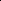
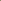

# SphereDiff: Tuning-free 360° Static and Dynamic Panorama Generation via Spherical Latent Representation

<!-- Page 1 -->

SphereDiff: Tuning-free 360° Static and Dynamic Panorama Generation via Spherical Latent Representation

Minho Park∗, Taewoong Kang∗, Jooyeol Yun, Sungwon Hwang, Jaegul Choo

KAIST AI, South Korea {m.park, keh0t0, blizzard072, shwang.14, jchoo}@kaist.ac.kr

## Abstract

The increasing demand for AR/VR applications has highlighted the need for high-quality content, such as 360◦ live wallpapers. However, generating high-quality 360◦ panoramic contents remains a challenging task due to the severe distortions introduced by equirectangular projection (ERP). Existing approaches either fine-tune pretrained diffusion models on limited ERP datasets or adopt tuning-free methods that still rely on ERP latent representations, often resulting in distracting distortions near the poles. In this paper, we introduce SphereDiff, a novel approach for synthesizing 360◦static and live wallpaper with state-of-the-art diffusion models without additional tuning. We define a spherical latent representation that ensures consistent quality across all perspectives, including near the poles. Then, we extend MultiDiffusion to spherical latent representation and propose a dynamic spherical latent sampling method to enable direct use of pretrained diffusion models. Moreover, we introduce distortion-aware weighted averaging to further improve the generation quality. Our method outperforms existing approaches in generating 360◦static and live wallpaper, making it a robust solution for immersive AR/VR applications. 1

Extended version — https://arxiv.org/abs/2504.14396

## Introduction

The growing demand for AR/VR applications has significantly increased the need for high-quality immersive content. AR/VR technologies offer highly engaging environments, providing a sense of presence that traditional displays (e.g., phones and laptops) cannot. A key element in delivering such experiences is the 360◦× 180◦panoramic scene, or 360◦panorama, which provides an omnidirectional view of the virtual world. This allows users to explore their surroundings from any perspective, setting it apart from standard visual content. However, because capturing 360◦ panoramas requires specialized cameras, their availability is limited, especially for videos. As a result, available content is dominated by simulation-based graphics, which can be rudimentary, while users increasingly seek realistic experiences. In this paper, we aim to generate realistic 360◦

Copyright © 2026, Association for the Advancement of Artificial Intelligence (www.aaai.org). All rights reserved.

1∗indicates equal contributions.

ERP Latent Representation Spherical

DynamicScaler SphereDiff (Ours) 360 LoRA 360DVD (a) Qualitative comparison at the upper pole under the forest theme.

360DVD

(c) Spherical Latent Rep. (Ours) (b) ERP Latent Representation

Change Visualization

**Figure 1.** Motivation. Both ERP-based finetuning (Latent- Labs360 2023; Wang et al. 2024) and tuning-free (Liu et al. 2024) approaches often fail to generate seamless scenes near the poles, as their latents are unevenly distributed over the spherical surface. In contrast, our method produces seamless results by leveraging a spherical latent representation.

static and dynamic panoramas (Fig. 2) enabling the creation of countless immersive scenes.

360◦panoramas are typically represented using an equirectangular projection (ERP), which maps spherical imagery onto a 2D rectangular plane, e.g., mapping a 3D globe to a 2D world map. Due to the limited representational capacity of a 2D plane, an ERP inevitably introduces severe nonlinear distortions, known as ERP distortion, where highlatitude regions appear disproportionately large. For example, as shown in Fig. 2, the content near the poles appear significantly larger than the others since we visualize the 360◦wallpapers in ERP. Due to this ERP distortion, 360◦ panoramas lie in a significantly different distribution from standard perspective images or videos, making it challenging to leverage standard pretrained image or video diffusion models (Rombach et al. 2022; HaCohen et al. 2024).

To handle this gap, several previous studies have finetuned pretrained diffusion models using ERP datasets (LatentLabs360 2023; Wang et al. 2024; Chen, Wang, and Liu 2022; Zhang et al. 2024; Li et al. 2024). However, due to the limited availability of text-ERP pairs, data-driven ap-

The Fortieth AAAI Conference on Artificial Intelligence (AAAI-26)

AI-readable visual equivalent, added: Figure extracted from the paper PDF and converted to an SVG wrapper asset. Use the surrounding page text and caption for interpretation.

AI-readable visual equivalent, added: Figure extracted from the paper PDF and converted to an SVG wrapper asset. Use the surrounding page text and caption for interpretation.

AI-readable visual equivalent, added: Figure extracted from the paper PDF and converted to an SVG wrapper asset. Use the surrounding page text and caption for interpretation.

AI-readable visual equivalent, added: Figure extracted from the paper PDF and converted to an SVG wrapper asset. Use the surrounding page text and caption for interpretation.

AI-readable visual equivalent, added: Figure extracted from the paper PDF and converted to an SVG wrapper asset. Use the surrounding page text and caption for interpretation.

AI-readable visual equivalent, added: Figure extracted from the paper PDF and converted to an SVG wrapper asset. Use the surrounding page text and caption for interpretation.

AI-readable visual equivalent, added: Figure extracted from the paper PDF and converted to an SVG wrapper asset. Use the surrounding page text and caption for interpretation.

AI-readable visual equivalent, added: Figure extracted from the paper PDF and converted to an SVG wrapper asset. Use the surrounding page text and caption for interpretation.

AI-readable visual equivalent, added: Figure extracted from the paper PDF and converted to an SVG wrapper asset. Use the surrounding page text and caption for interpretation.

<!-- Page 2 -->

“Grand Canyon, Eagle” “Air Balloons” “Storm” (121st frame)

“Underworld, Turtle” “Blossom” “Storm” (61st frame)

“Fireflies, Moon, Child” “Ruins” “Storm” (1st frame)

FLUX SANA HunyuanVideo

**Figure 2.** SphereDiff enables tuning-free 360° panorama generation via spherical latent. It is compatible with various diffusion backbones, including FLUX (Labs 2024), SANA (Xie et al. 2024), and HunyuanVideo (Kong et al. 2024).

proaches often fail to generate seamless 360◦panoramas, particularly near the poles, as shown in Fig. 1. Notably, this issue is more pronounced for generating dynamic 360◦ panoramas due to the severely limited availability of 360◦ panoramic videos. Thus, tuning-free approaches offer an alternative approach for generating 360◦live wallpapers.

Previous tuning-free approaches are based on MultiDiffusion (Liu et al. 2024; Bar-Tal et al. 2023), which denoises large panoramic latents by dividing them into small overlapping patches and blending them in the overlapping regions. They use an ERP representation for latents, that distributes latents uniformly over the ERP. Despite its simplicity, it causes significant differs the density of latents in spherical representation, resulting severe pole-stretching artifacts, as shown in Fig. 1. In this paper, we present a novel tuningfree framework, SphereDiff, that does not rely on the ERP representation, and generates seamless 360◦static and live wallpapers with minimal distortion, even near the poles.

To this end, we define a spherical latent representation that uniformly distributes latents over the sphere, ensuring consistent generation quality across all view directions. We then extend the tuning-free MultiDiffusion framework (Bar-Tal et al. 2023) to operate within this spherical latent representation. In addition, we propose a dynamic latent sampling algorithm that effectively arranges spherical latents onto a 2D perspective grid. Finally, we introduce a distortion-aware weighted averaging scheme to further reduce minor distortions caused by spherical-to-perspective projection. Extensive experiments demonstrate that SphereDiff outperforms existing methods in generating static and live 360◦wallpapers, in terms of visual quality and distortion reduction.

In summary, our contributions are threefold: • We propose SphereDiff, a tuning-free framework with a spherical latent representation for generating highquality 360◦wallpapers, especially near the poles. • We extend MultiDiffusion for 360◦panoramas with dynamic latent sampling for seamless integration with standard diffusion models, allowing tuning-free generation. • Distortion-aware weighted averaging further mitigates the minor distortion from spherical-to-perspective projection, and significantly enhance visual quality.

## Related Work

Latent Diffusion Models. Recent advancements in diffusion models have enabled the generation of high-quality images (Rombach et al. 2022; Labs 2024; Xie et al. 2024; Chen et al. 2023) and videos (HaCohen et al. 2024; Yang et al. 2024; Kong et al. 2024; Team 2024; Zhang et al. 2025; Liu et al. 2025), achieving impressive visual results across various video generation tasks within the standard perspective of visual content. However, generating content beyond the standard perspective, such as regular or 360◦panoramas, remains relatively underexplored. In this paper, we aim to generate 360◦panoramas, which differ significantly from standard perspective scenes, by solely leveraging pretrained diffusion models designed for standard perspectives.

360◦Panoramic Scene Generation. Most panoramic generation methods rely on equirectangular projection (ERP), which maps spherical coordinates onto a 2D rectangular plane, with latitude and longitude as the vertical and horizontal axes. However, ERP inherently introduces severe nonlinear distortions, particularly near the poles, resulting in a significant gap between ERP and standard perspective views. Although previous studies (Wang et al. 2024; Zhang

AI-readable visual equivalent, added: Figure extracted from the paper PDF and converted to an SVG wrapper asset. Use the surrounding page text and caption for interpretation.

AI-readable visual equivalent, added: Figure extracted from the paper PDF and converted to an SVG wrapper asset. Use the surrounding page text and caption for interpretation.

AI-readable visual equivalent, added: Figure extracted from the paper PDF and converted to an SVG wrapper asset. Use the surrounding page text and caption for interpretation.

AI-readable visual equivalent, added: Figure extracted from the paper PDF and converted to an SVG wrapper asset. Use the surrounding page text and caption for interpretation.

AI-readable visual equivalent, added: Figure extracted from the paper PDF and converted to an SVG wrapper asset. Use the surrounding page text and caption for interpretation.

AI-readable visual equivalent, added: Figure extracted from the paper PDF and converted to an SVG wrapper asset. Use the surrounding page text and caption for interpretation.

AI-readable visual equivalent, added: Figure extracted from the paper PDF and converted to an SVG wrapper asset. Use the surrounding page text and caption for interpretation.

AI-readable visual equivalent, added: Figure extracted from the paper PDF and converted to an SVG wrapper asset. Use the surrounding page text and caption for interpretation.

AI-readable visual equivalent, added: Figure extracted from the paper PDF and converted to an SVG wrapper asset. Use the surrounding page text and caption for interpretation.

<!-- Page 3 -->

Φ ⋅𝒚1

Φ ⋅𝒚2

𝐹1

𝐹2

𝑰𝑡−1

2

𝑰𝑡−1

1

𝑺𝑡

𝑾2

𝒮⊗𝐹2

−1

𝑰𝑡

2

𝑰𝑡

1

𝑾1

𝒮⊗𝐹1

−1

Defining Spherical Latent Mapping Spherical Latent Multi-prompt Denoising Distortion-aware Weighted Averaging

𝑺𝑡−1 = Ψ𝒮𝑺𝑡𝒛= 𝒚1, 𝒚2, …

**Figure 3.** Overall Pipeline. We begin by initializing uniformly distributed spherical latents. Next, we map these latents to perspective latents corresponding to multiple view directions. Each view is then denoised using its corresponding prompt. The denoised views are subsequently fused via distortion-aware weighted averaging.

et al. 2024; Chen, Wang, and Liu 2022; Li et al. 2024) attempt to address this issue by fine-tuning on panoramic ERP datasets, they often fail to generate seamless panoramas, especially near the poles, or struggle with text controllability due to the domain-specific nature of the datasets (e.g., indoor environments). Recently, CubeDiff (Kalischek et al. 2025) introduces an alternative approach using cube map representations for panoramic image generation. While this method effectively reduces distortions near the poles by training on the large-scale 360◦panoramic images, it still struggles with discontinuities at cube-face boundaries. In addition, the data-driven approaches often struggle on generating 360◦ video, due to the extreme data scarcity of 360◦panoramic videos. In contrast, we replace the ERP latent representation with a spherical latent representation, providing a natural solution to eliminate distortion across all perspectives, and it does not require any additional tuning.

360◦Live Wallpaper Generation. Due to the limited availability of 360◦video datasets, recent research on 360◦live wallpapers has increasingly favored using perspective-based models without additional training. DynamicScaler (Liu et al. 2024) attempts to mitigate ERP’s inherent distortions through panoramic-projected denoising, leveraging the MultiDiffusion framework (Bar-Tal et al. 2023) with adjusted windows. 4K4DGen (Li et al. 2024) seeks to avoid distortion by utilizing the input ERP images with an image-to-video model, which makes it less suitable for generating novel or highly creative content directly from text descriptions. Unlike these methods, we overcome these limitations by directly using uniformly distributed spherical latents, thereby ensuring efficiency and reduced distortion without requiring additional training.

Proposed Method In this section, we introduce SphereDiff, a novel tuningfree framework for generating 360◦live wallpapers (Fig. 3). First, we present the spherical latent representation and spherical-to-perspective projection (Section 3.1). Next, we extend the MultiDiffusion framework (Bar-Tal et al. 2023)

for 360◦panoramas (Section 3.2). We then introduce spherical latent sampling methods, which discrete the continuous coordinates of the spherical latent onto a 2D grid (Section 3.3). Finally, we propose a distortion-aware weighted averaging method to mitigate minor distortions from the spherical-to-perspective projection (Section 3.4), and introduce the multi-prompt inference method (Section 3.5).

## 3.1 Spherical Latent Representation

Definition. We introduce a spherical representation of latent features for generating 360◦live wallpapers. We define a latent feature f ∈RC paired with the corresponding spherical coordinate d on a spherical surface. The set of spherical coordinates can be represented as follows:

S2 = {d = (x, y, z) | x, y, z ∈R, ∥d∥= 1}. (1) Then, we pair each latent feature with its associated position, i.e., s = (d, f), referred to as spherical latent. For N spherical latents, we define the spherical latents S as:

S = {si = (di, fi) | di ∈S2, fi ∈RC, for i ∈[1, N]}. (2) which is now composed of multiple latents similar to standard 2D or 3D latent features. We refer to the domain of spherical latents as S, i.e., S ∈S.

Equirectangular Projection (ERP) latents also can be written in our spherical latent representation. However, as shown in Fig. 1 (b), due to the 2D grid constraint of ERP latent, its spherical coordinates are not uniformly distributed on the sphere’s surface. In contrast, we define the spherical latents using the Fibonacci Lattice (Hardin, Michaels, and Saff 2016), which offers the number of spherical latents is nearly equal across all perspectives, as shown in Fig. 1 (c).

Perspective Latent Representation. Since standard diffusion models operate in perspective space, we utilize a spherical-to-perspective projection which transforms the spherical coordinate to the perspective coordinate. To achieve this, we first define the domain of perspective coordinates as a discretized 2D plane as

P2 = u =

2j

H, 2k

W

| j ∈

−H

2, H 2

, k ∈

−W

2, W 2

,

(3)

AI-readable visual equivalent, added: Figure extracted from the paper PDF and converted to an SVG wrapper asset. Use the surrounding page text and caption for interpretation.

AI-readable visual equivalent, added: Figure extracted from the paper PDF and converted to an SVG wrapper asset. Use the surrounding page text and caption for interpretation.

AI-readable visual equivalent, added: Figure extracted from the paper PDF and converted to an SVG wrapper asset. Use the surrounding page text and caption for interpretation.

AI-readable visual equivalent, added: Figure extracted from the paper PDF and converted to an SVG wrapper asset. Use the surrounding page text and caption for interpretation.

AI-readable visual equivalent, added: Figure extracted from the paper PDF and converted to an SVG wrapper asset. Use the surrounding page text and caption for interpretation.

AI-readable visual equivalent, added: Figure extracted from the paper PDF and converted to an SVG wrapper asset. Use the surrounding page text and caption for interpretation.

AI-readable visual equivalent, added: Figure extracted from the paper PDF and converted to an SVG wrapper asset. Use the surrounding page text and caption for interpretation.

AI-readable visual equivalent, added: Figure extracted from the paper PDF and converted to an SVG wrapper asset. Use the surrounding page text and caption for interpretation.

AI-readable visual equivalent, added: Figure extracted from the paper PDF and converted to an SVG wrapper asset. Use the surrounding page text and caption for interpretation.

AI-readable visual equivalent, added: Figure extracted from the paper PDF and converted to an SVG wrapper asset. Use the surrounding page text and caption for interpretation.

AI-readable visual equivalent, added: Figure extracted from the paper PDF and converted to an SVG wrapper asset. Use the surrounding page text and caption for interpretation.

AI-readable visual equivalent, added: Figure extracted from the paper PDF and converted to an SVG wrapper asset. Use the surrounding page text and caption for interpretation.

AI-readable visual equivalent, added: Figure extracted from the paper PDF and converted to an SVG wrapper asset. Use the surrounding page text and caption for interpretation.

AI-readable visual equivalent, added: Figure extracted from the paper PDF and converted to an SVG wrapper asset. Use the surrounding page text and caption for interpretation.

AI-readable visual equivalent, added: Figure extracted from the paper PDF and converted to an SVG wrapper asset. Use the surrounding page text and caption for interpretation.

AI-readable visual equivalent, added: Figure extracted from the paper PDF and converted to an SVG wrapper asset. Use the surrounding page text and caption for interpretation.

<!-- Page 4 -->

(a) Nearest Sampling

(b) Dynamic Sampling

Projected Spherical Latent

Continuous Position

Discretized Position

Case 1: Selected

Case 2: Selected twice

Case 3: Not selected

**Figure 4.** Comparison of Nearest and Dynamic Sampling. Nearest sampling often resamples the selected latents or omits central ones, while dynamic sampling selects latents from the center outward, discarding only the outermost ones.

where H, W indicates the height and width of the bounded 2D perspective plane, respectively. We use a view direction v ∈ S2 and a predefined focal length f to define the spherical-to-perspective projection function u = TS2→P2(d|v, f). For completeness, the projection function formula is included in the extended version.

## 3.2 MultiDiffusion for Spherical Latent The

MultiDiffusion (Bar-Tal et al. 2023) framework is often utilized for generating arbitrary-shaped images by leveraging pretrained diffusion models (Rombach et al. 2022) trained on standard perspective images. In this section, we introduce an extension of the MultiDiffusion framework to the spherical latent representation.

The goal of this framework is to construct the Spherical MultiDiffuser ΨS: S × Z →S, which takes a noisy spherical latent St and a set of text conditions z as inputs and produces the denoised spherical latent St−1, as illustrated in Fig. 3. Based on the MultiDiffuser, a clean spherical latent S0 can be obtained from pure noise ST through an iterative denoising process using diffusion models as:

ST, ST −1,..., S0 s.t. St−1 = ΨS(St|z). (4)

To construct MultiDiffuser ΨS, we first leverage a pretrained diffusion model trained on standard perspective latents Φ: I × Y →I, which takes a noisy latent It and a text condition y as inputs and produces the denoised latent It−1. The pretrained diffusion model gradually denoises the pure Gaussian noise IT ∼N into a clean image I0.

IT, IT −1,..., I0 s.t. It−1 = Φ(It|y) (5)

Next, we define a mapping function between the spherical and perspective latent spaces, Fi: S →I, along with a corresponding condition mapping λi: Z →Y, where i ∈{1,..., n}. The mapping functions Fi and λi can be formulated in various ways, which will be discussed in Sections 3.3 and 3.5, respectively.

Ii t = Fi(St), yi = λi(z) (6)

## Algorithm

## 1 Dynamic Latent Sampling Input: Projected

Latent P = TS→I(S|v, f) Output: Arranged Perspective Latent I I′ ←−Sort the latents of P by ∥ui∥. M ←−|P | ▷Get the number of latents H, W ←−⌊

√

M⌋, ⌊

√

M⌋ ▷Dynamic H, W I ←−∅H×W ▷Initialize a queue for i ∈[1, H/2] do n ←−(2i)2 −(2i −2)2 ▷Counts of i-th border l ←−first n latents from the sorted I′ ▷center-first Set i-th border of I to l Pop first n latents from I′ end return I ▷Ignore M −H × W elements of I

Finally, The denoising step in of MultiDiffuser can be formulated by a closed-form (Bar-Tal et al. 2023).

Ψ(St|z) = n X i=1

W S i ⊗F −1 i (Φ(Ii t|yi)). (7)

where W S i are the per-pixel weights and ⊗is the Hadamard product. In the following sections, we define the latent mapping function Fi (Section 3.3), the per-pixel weights W S i (Section 3.4), and the condition mapping function λi (Section 3.5), which together extend MultiDiffusion to the spherical latent representation.

## 3.3 Mapping Spherical Latent

We define the latent mapping function F that transforms a spherical latent representation into a perspective latent space I. To define mapping function F, we first apply the transformation TS→I based on the view direction v ∈S2 and focal length f, which projects the coordinates of the spherical latents onto the perspective plane P. Formally, the sphericalto-perspective latent transformation can be written as

TS→P(S|v, f) = P = {pi = (ui, fi)|ui ∈[−1, 1]2}, (8)

where ui = TS2→P2(di|v, f). Note that, P does not contain N elements since the perspective are cropped by [−1, 1]. We next introduce simple yet effective latent sampling methods for discretizing perspective coordinates.

Nearest Point Sampling. A straightforward approach to discrete continuous coordinates is nearest-neighbor sampling, where the nearest projected spherical latent is selected for each pixel position. Specifically, the latent closest to the center of a H ×W grid is retrieved and used as input for denoising, as illustrated in Fig. 4 (a). Despite its simplicity, this method introduces two critical issues. First, the same latent may be selected multiple times, altering the latent distribution, which often degrades generation performance (Chang et al. 2024). Second, some spherical latents may not be chosen even if they fall within the field of view of the current camera view direction. This phenomenon, referred to as the undersampling problem, has particularly detrimental consequences for generating a seamless panorama.

AI-readable visual equivalent, added: Figure extracted from the paper PDF and converted to an SVG wrapper asset. Use the surrounding page text and caption for interpretation.

AI-readable visual equivalent, added: Figure extracted from the paper PDF and converted to an SVG wrapper asset. Use the surrounding page text and caption for interpretation.

AI-readable visual equivalent, added: Figure extracted from the paper PDF and converted to an SVG wrapper asset. Use the surrounding page text and caption for interpretation.

<!-- Page 5 -->

0° (Front)

−45°

−90°

(Top)

## 360 LoRA Text2Light PanFusion

Dynamic

Scaler

SphereDiff

(Ours)

360° Static Wallpaper “Underwater, Tropical fish, Sunlight, Coral, etc.”

90° (Bottom)

45°

360 LoRA +AnimateDiff 360DVD Dynamic

Scaler

SphereDiff

(Ours)

360° Live Wallpaper “Firefly, Night, Sky, etc.” Corresponding Regions on ERP View directions

**Figure 5.** Qualitative comparison. Each sample shows perspective views from top to bottom, highlighting end-to-end continuity and distortion. Other methods exhibit artifacts such as seams, pole distortions, blurriness, or spots, while ours produces seamless, high-quality panoramas without these issues. The entire ERPs are available in the extended version.

Undersampling Problem. The undersampling of spherical latents disrupts information flow across neighboring windows. As illustrated in Fig. 4, the green points lack information from the current field of view (FoV) since they are not denoised in this step. If the next window’s FoV captures a green point, not the blue point, it receives no information from the current window, causing discontinuities even when there is a large overlap.

Dynamic Latent Sampling. To address the undersampling problem, we aim to ensure that all points within the FoV are selected, especially those near the center. We propose a dynamic latent sampling strategy, which comprises three components: (1) a queue, (2) a dynamic number of latents, and (3) center-first selection. First, we avoid selecting the same spherical latent more than once by using a queue: once a latent is selected, it is immediately removed from the queue. Then, we dynamically adjust the number of latents so that H and W are not fixed, thereby reducing the number of latents within the FoV that remain unselected. Lastly, we prioritize selecting center-positioned latents first and then ignore the remaining points at the outermost region. The entire algorithm is demonstrated in Algorithm 1 and Fig. 4 (b).

## 3.4 Distortion-Aware Weighted Averaging

While the spherical-to-perspective distortion is relatively smaller than the ERP-to-perspective distortion, it can still cause latent position misalignment for other viewpoints.

To address this, we proposed distortion-aware weighted averaging within the MultiDiffusion framework (Bar-Tal et al. 2023). Specifically, we adjust the per-pixel weight W S i to account for the spherical-to-perspective distortion. Since distortion increases with distance from the center of the per- spective image, we introduce a simple yet effective exponential weighting function in the image space I.

W I i = [W jk i ]j∈[1,H],k∈[1,W ] ∈RH×W, (9)

W jk i = exp (−∥ujk∥/τ), (10)

where ∥ujk∥is the distance from the center of the perspective image, and τ is a scaling factor controlling how quickly the weight decays toward the edges. Then, the weighting function can be represented as W S i = F −1 i (W I i).

## 3.5 Multi-prompt Inference

We generate 360◦wallpapers using multiple prompts that correspond to specific regions on the spherical surface. The use of region-specific prompts helps reduce semantic inconsistencies, such as generating ground in sky regions. To this end, we define a simple condition mapping function λi that selects a region-specific prompt from the prompt set z, according to the elevation of the view direction, ϕi = elevation(di). Specifically, λi selects the prompt whose elevation is closest to ϕi among the discrete elevations {−90◦, −10◦, 0◦, +10◦, +90◦}, with the corresponding prompts given by z = {ytop, yupper, ymiddle, ylower, ybottom}. We allocate denser text prompts near the horizon to capture richer visual complexity in that region.

For enhanced scene complexity, we employ an additional foreground prompt yforeground, conditioned on the corresponding view direction, to generate a foreground object at a specific location (e.g., θi = azimuth(di) = 30◦, ϕi = −30◦). The second column of Fig. 2 shows an example generated in this manner. Visual illustrations of the multiprompt inference are provided in the extended version.

AI-readable visual equivalent, added: Figure extracted from the paper PDF and converted to an SVG wrapper asset. Use the surrounding page text and caption for interpretation.

AI-readable visual equivalent, added: Figure extracted from the paper PDF and converted to an SVG wrapper asset. Use the surrounding page text and caption for interpretation.

AI-readable visual equivalent, added: Figure extracted from the paper PDF and converted to an SVG wrapper asset. Use the surrounding page text and caption for interpretation.

AI-readable visual equivalent, added: Figure extracted from the paper PDF and converted to an SVG wrapper asset. Use the surrounding page text and caption for interpretation.

AI-readable visual equivalent, added: Figure extracted from the paper PDF and converted to an SVG wrapper asset. Use the surrounding page text and caption for interpretation.

AI-readable visual equivalent, added: Figure extracted from the paper PDF and converted to an SVG wrapper asset. Use the surrounding page text and caption for interpretation.

AI-readable visual equivalent, added: Figure extracted from the paper PDF and converted to an SVG wrapper asset. Use the surrounding page text and caption for interpretation.

AI-readable visual equivalent, added: Figure extracted from the paper PDF and converted to an SVG wrapper asset. Use the surrounding page text and caption for interpretation.

<!-- Page 6 -->

Panoramic Criteria Image Criteria Text Adherence Video Criteria

Wallpaper Type Method Distortion ↑ End Continuity ↑ Image Quality ↑ Text Alignment ↑ Motion Smoothness ↑ Temporal Flickering ↑

360 LoRA 21.43 23.81 21.43 20.24 - - Text2Light 5.95 4.76 8.33 5.95 - - 360◦Static PanFusion 14.29 10.71 10.71 16.67 - - DynamicScaler 20.24 25.00 25.00 27.38 - - SphereDiff (Ours) 38.10 35.71 34.52 29.76 - -

360◦Live

360 LoRA + AnimateDiff 25.00 27.38 27.38 27.38 27.38 23.81 360DVD 11.90 13.10 16.67 20.24 8.33 14.29 DynamicScaler 30.95 26.19 28.57 22.62 28.57 29.76 SphereDiff (Ours) 32.14 33.33 27.38 29.76 35.71 32.14

**Table 1.** User study results. The 360◦static and live wallpapers generated by SphereDiff have achieved state-of-the-art performance in user preference across most metrics, particularly in panoramic criteria such as distortion and end continuity.

4 Experiments 4.1 Experimental Setup Implementation Details. For all experiments and comparisons, we adopt SANA (Xie et al. 2024) and LTX- Video (HaCohen et al. 2024) as the base T2I and T2V models, respectively. We use 2,600 spherical latent points, and we conduct the MultiDiffusion framework with 89 view directions with an 80◦FoV, where adjacent views overlap by 60%. More details are available in the extended version.

## Evaluation

Criteria. We evaluate our 360◦static and live wallpapers using four criteria: panoramic, image, video, and text-level aspects. Image quality, text adherence, and temporal smoothness are standard metrics in image and video generation, and we adopt them to assess the realism and consistency of our results. For panoramic evaluation, we consider distortion and end continuity. Distortion measures the geometric deformation introduced when the equirectangular projections (ERPs) are converted into perspective, which tends to increase if models fail to account for ERPspecific constraints. End continuity (also known as loopconsistency) evaluates the seamless alignment of the left and right borders in ERPs, indicating whether the scene wraps smoothly into a loop.

## Evaluation

Process. We use 20 predefined text prompt sets designed for immersive outdoor scenes. We assess the criteria through a user study, following prior studies (Wang et al. 2024; Liu et al. 2024), where participants select the sample among the baselines that best fits the given criteria. The assessments are conducted on perspective images captured from 14 predefined view directions with a 90◦field of view. Additionally, we conduct automatic evaluations for text and video criteria by leveraging VBench (Huang et al. 2024), which has been widely validated. In contrast, image and panoramic criteria cannot be accurately measured by classical methods such as FID (Heusel et al. 2017) due to the absence of a source domain. Thus, we instead employ vision-language models (Hurst et al. 2024) within the LLMas-a-judge framework (Zheng et al. 2023). The reliability of the VLM-based evaluation, supported by comprehensive experiments, is provided in the extended version.

Baselines. For 360◦static wallpaper generation, we compare with open-sourced baselines including 360 LoRA (La- tentLabs360 2023), Text2Light (Chen, Wang, and Liu 2022), Panfusion (Zhang et al. 2024), and Dynamic- Scaler (Liu et al. 2024). Although DynamicScaler (Liu et al. 2024) was originally designed for panoramic video generation, we extend it for image generation and use it as a baseline. For 360◦live wallpaper generation, we use 360DVD (Wang et al. 2024) and DynamicScaler as primary baselines. DynamicScaler is reimplemented with SANA and LTX-Video to enable a fair comparison as a tuning-free method. In addition, we combine 360 LoRA with Animate- Diff (Guo et al. 2023) as an extra baseline. The multiprompt methods, DynamicScaler and ours, share identical text prompt sets (z = {ytop, yupper, ymiddle, ylower, ybottom}) for generation, whereas the other single-prompt methods rely on the main reference prompt (ymiddle).

## 4.2 Results Qualitative

Comparison. As shown in Fig. 5, 360◦static and live wallpaper generation baselines appear noticeable artifacts near the poles, such as distortion, blurriness, and speckling due to the limitation of the ERP latents as we discussed. These artifacts significantly undermine the immersive experience of 360◦wallpapers. In contrast, our method ensures consistent quality at all viewing angles and eliminating distortions and discontinuities, since we utilize uniformly distributed spherical latents. Additional qualitative results from stronger diffusion backbones, including FLUX (Labs 2024) and HunyuanVideo (Kong et al. 2024), are provided in the extended version.

User Study. To evaluate the effectiveness of our panorama generation method, we conduct a user study. A total of 21 participants compared 20 pairs of samples, both images and videos, based on six aspects: visual quality, text alignment, distortion, end continuity, motion smoothness, and temporal flickering. As shown in Tab. 1, our method consistently outperforms all baselines on most metrics for both static and live 360◦wallpaper generation. While DynamicScaler (Liu et al. 2024) received slightly higher scores in image quality, our method achieves significantly better performance in panoramic metrics. Overall, the user study strongly supports the effectiveness of the proposed method, as it demonstrates the best results in panoramic criteria, text adherence and video criteria, even without any additional finetuning.

<!-- Page 7 -->

Panoramic Criteria Image Criteria Text Adherence Video Criteria

Wallpaper Type Method Distortion ↑ End Continuity ↑ Image Quality ↑ Aesthetic Appearance ↑ Scene ↑ CLIP-Score ↑ Motion Smoothness ↑ Temporal Flickering ↑

360 LoRA 2.027 3.423 2.965 3.492 0.2875 26.40 - - Text2Light 2.381 3.454 2.415 2.777 0.0250 20.46 - - 360◦Static PanFusion 1.965 3.696 2.819 3.450 0.2125 25.70 - - DynamicScaler 2.854 3.985 4.496 4.577 0.2750 26.63 - - SphereDiff (Ours) 3.238 4.892 4.496 4.685 0.5875 28.65 - -

360◦Live

360 LoRA + AnimateDiff 1.939 3.482 3.179 3.571 0.2914 26.34 0.9908 0.9847 360DVD 2.086 3.246 2.929 3.396 0.2570 25.54 0.9857 0.9798 DynamicScaler 1.971 2.971 2.711 3.236 0.4836 26.89 0.9943 0.9918 SphereDiff (Ours) 2.579 4.496 3.050 3.593 0.5703 27.52 0.9956 0.9941

**Table 2.** Automated Quantitative Evaluation. We conduct automatic evaluations of 360◦static and live wallpaper synthesis across four criteria. SphereDiff consistently outperforms existing methods except image quality, where it ranks second.

(a) Nearest Sampling

(c) Dynamic Sampling (d) Dynamic + Weighted Average

(b) Nearest + Weighted Average

**Figure 6.** Visual Ablation Study. Nearest sampling causes view inconsistencies and overlap artifacts, while dynamic sampling enables better integrated outputs. Weighted averaging significantly improves seamlessness.

Automatic Quantitative Results. As presented in Tab. 2, our method outperforms all baselines across most evaluation metrics in both static and live 360◦wallpaper generation, consistent with the results of the user study. Notably, it achieves significantly better scores in distortion and end continuity, demonstrating its effectiveness in producing highquality panoramic content. While the image quality of our video generation is lower than that of 360 LoRA + AnimateDiff (LatentLabs360 2023; Guo et al. 2023), it remains comparable overall. The overall score of 360◦live wallpaper generation is lower than the 360◦static wallpaper generation, which may be due to the performance of the underlying diffusion model. Nevertheless, SphereDiff shows the state-of-the-art performance in the most metrics and its performance could be further improved by leveraging a more advanced denoising model.

## 4.3 Ablation Study

We conducted ablation studies to evaluate the impact of each component, namely dynamic latent sampling and distortionaware weighted averaging. For clarity, we performed denoising on only two views, which simplifies visualization while preserving the validity of the comparison, and we visualized the results in ERP format. As shown in Fig. 6, nearest sampling fails to facilitate information exchange between different views, resulting in noticeable artifacts and unnatural transitions in overlapping regions. In contrast, our dynamic latent sampling improves information exchange across views, producing more seamless and coherent images. Furthermore, incorporating our distortion-aware weighted averaging technique yields significantly clearer and more consistent outputs for both sampling methods. These results demonstrate that each component plays a critical role in our framework by integrating multiple perspectives and ensuring high-quality 360◦wallpaper generation. For completeness, comprehensive quantitative results of the ablation studies are provided in the extended version.

## 5 Conclusion and Discussion We introduce

SphereDiff, a tuning-free framework for 360◦ live wallpaper generation that effectively leverages stateof-the-art image and video diffusion models. The proposed spherical latent representation inherently supports consistent generation quality across all view directions, including near the poles. Our extended MultiDiffusion framework for 360◦panoramas with dynamic latent sampling facilitates a tuning-free approach. Lastly, distortion-aware weighted averaging significantly enhances the quality of panoramic content. In summary, we achieve state-of-the-art performance in generating 360◦live and static wallpapers, as demonstrated through comprehensive experiments.

Limitations. Our approach achieves strong results in producing high-quality static and live 360◦wallpapers for a broad range of outdoor. However, it cannot yet generate highly complex scenes, such as indoor environments, without additional training. Recent panoramic image generation approaches (Kalischek et al. 2025; C¸ apuk et al. 2025) handle more complex scenes by relying on largescale panoramic image datasets, but they cannot be readily adapted to panoramic videos due to the limited availability of panoramic video datasets. In contrast, our approach achieves state-of-the-art performance in generating 360◦live wallpapers without additional tuning, highlighting its potential as a strong foundation for future work on more complex 360◦panoramic video generation.

AI-readable visual equivalent, added: Figure extracted from the paper PDF and converted to an SVG wrapper asset. Use the surrounding page text and caption for interpretation.

AI-readable visual equivalent, added: Figure extracted from the paper PDF and converted to an SVG wrapper asset. Use the surrounding page text and caption for interpretation.

AI-readable visual equivalent, added: Figure extracted from the paper PDF and converted to an SVG wrapper asset. Use the surrounding page text and caption for interpretation.

AI-readable visual equivalent, added: Figure extracted from the paper PDF and converted to an SVG wrapper asset. Use the surrounding page text and caption for interpretation.

<!-- Page 8 -->

## Acknowledgments

This work was supported by Institute for Information & communications Technology Planning & Evaluation(IITP) grant funded by the Korea government(MSIT) (RS-2019- II190075, Artificial Intelligence Graduate School Program(KAIST)). This work was supported by the National Research Foundation of Korea(NRF) grant funded by the Korea government(MSIT) (No. RS-2025-00555621) This work was supported by Electronics and Telecommunications Research Institute(ETRI) grant funded by the Korean government [25ZB1200, Fundamental Technology Research for Human-Centric Autonomous Intelligent Systems]

## References

Bar-Tal, O.; Yariv, L.; Lipman, Y.; and Dekel, T. 2023. MultiDiffusion: fusing diffusion paths for controlled image generation. In Proceedings of the 40th International Conference on Machine Learning, 1737–1752.

C¸ apuk, H.; Bond, A.; Kızıl, M. B.; G¨oc¸en, E.; Erdem, E.; and Erdem, A. 2025. TanDiT: Tangent-Plane Diffusion Transformer for High-Quality 360 {\deg} Panorama Generation. arXiv preprint arXiv:2506.21681.

Chang, P.; Tang, J.; Gross, M.; and Azevedo, V. C. 2024. How I Warped Your Noise: a Temporally-Correlated Noise Prior for Diffusion Models. In The Twelfth International Conference on Learning Representations.

Chen, J.; Yu, J.; Ge, C.; Yao, L.; Xie, E.; Wu, Y.; Wang, Z.; Kwok, J.; Luo, P.; Lu, H.; et al. 2023. Pixart-α: Fast training of diffusion transformer for photorealistic text-toimage synthesis. arXiv preprint arXiv:2310.00426.

Chen, Z.; Wang, G.; and Liu, Z. 2022. Text2light: Zero-shot text-driven hdr panorama generation. ACM Transactions on Graphics (TOG), 41(6): 1–16.

Guo, Y.; Yang, C.; Rao, A.; Liang, Z.; Wang, Y.; Qiao, Y.; Agrawala, M.; Lin, D.; and Dai, B. 2023. Animatediff: Animate your personalized text-to-image diffusion models without specific tuning. arXiv preprint arXiv:2307.04725.

HaCohen, Y.; Chiprut, N.; Brazowski, B.; Shalem, D.; Moshe, D.; Richardson, E.; Levin, E.; Shiran, G.; Zabari, N.; Gordon, O.; et al. 2024. Ltx-video: Realtime video latent diffusion. arXiv preprint arXiv:2501.00103.

Hardin, D. P.; Michaels, T.; and Saff, E. B. 2016. A Comparison of Popular Point Configurations on S2. arXiv preprint arXiv:1607.04590.

Heusel, M.; Ramsauer, H.; Unterthiner, T.; Nessler, B.; and Hochreiter, S. 2017. GANs Trained by a Two Time-Scale Update Rule Converge to a Local Nash Equilibrium. In Advances in Neural Information Processing Systems, 6626– 6637.

Huang, Z.; He, Y.; Yu, J.; Zhang, F.; Si, C.; Jiang, Y.; Zhang, Y.; Wu, T.; Jin, Q.; Chanpaisit, N.; et al. 2024. Vbench: Comprehensive benchmark suite for video generative models. In Proceedings of the IEEE/CVF Conference on Computer Vision and Pattern Recognition, 21807–21818.

Hurst, A.; Lerer, A.; Goucher, A. P.; Perelman, A.; Ramesh, A.; Clark, A.; Ostrow, A.; Welihinda, A.; Hayes, A.; Radford, A.; et al. 2024. Gpt-4o system card. arXiv preprint arXiv:2410.21276. Kalischek, N.; Oechsle, M.; Manhardt, F.; Henzler, P.; Schindler, K.; and Tombari, F. 2025. Cubediff: Repurposing diffusion-based image models for panorama generation. In The Thirteenth International Conference on Learning Representations. Kong, W.; Tian, Q.; Zhang, Z.; Min, R.; Dai, Z.; Zhou, J.; Xiong, J.; Li, X.; Wu, B.; Zhang, J.; et al. 2024. Hunyuanvideo: A systematic framework for large video generative models. arXiv preprint arXiv:2412.03603. Labs, B. F. 2024. FLUX. https://github.com/black-forestlabs/flux. LatentLabs360. 2023. LatentLabs360. https://civitai.com/ models/10753/latentlabs360. Li, R.; Pan, P.; Yang, B.; Xu, D.; Zhou, S.; Zhang, X.; Li, Z.; Kadambi, A.; Wang, Z.; Tu, Z.; et al. 2024. 4k4dgen: Panoramic 4d generation at 4k resolution. arXiv preprint arXiv:2406.13527. Liu, D.; Li, S.; Liu, Y.; Li, Z.; Wang, K.; Li, X.; Qin, Q.; Liu, Y.; Xin, Y.; Li, Z.; et al. 2025. Lumina-Video: Efficient and Flexible Video Generation with Multi-scale Next-DiT. arXiv preprint arXiv:2502.06782. Liu, J.; Lin, S.; Li, Y.; and Yang, M.-H. 2024. DynamicScaler: Seamless and Scalable Video Generation for Panoramic Scenes. arXiv preprint arXiv:2412.11100. Rombach, R.; Blattmann, A.; Lorenz, D.; Esser, P.; and Ommer, B. 2022. High-resolution image synthesis with latent diffusion models. In Proceedings of the IEEE/CVF conference on computer vision and pattern recognition, 10684– 10695. Team, G. 2024. Mochi 1. https://github.com/genmoai/ models. Wang, Q.; Li, W.; Mou, C.; Cheng, X.; and Zhang, J. 2024. 360dvd: Controllable panorama video generation with 360-degree video diffusion model. In Proceedings of the IEEE/CVF Conference on Computer Vision and Pattern Recognition, 6913–6923. Xie, E.; Chen, J.; Chen, J.; Cai, H.; Tang, H.; Lin, Y.; Zhang, Z.; Li, M.; Zhu, L.; Lu, Y.; et al. 2024. Sana: Efficient highresolution image synthesis with linear diffusion transformers. arXiv preprint arXiv:2410.10629. Yang, Z.; Teng, J.; Zheng, W.; Ding, M.; Huang, S.; Xu, J.; Yang, Y.; Hong, W.; Zhang, X.; Feng, G.; et al. 2024. Cogvideox: Text-to-video diffusion models with an expert transformer. arXiv preprint arXiv:2408.06072. Zhang, C.; Wu, Q.; Gambardella, C. C.; Huang, X.; Phung, D.; Ouyang, W.; and Cai, J. 2024. Taming Stable Diffusion for Text to 360 Panorama Image Generation. In Proceedings of the IEEE/CVF Conference on Computer Vision and Pattern Recognition, 6347–6357. Zhang, S.; Li, W.; Chen, S.; Ge, C.; Sun, P.; Zhang, Y.; Jiang, Y.; Yuan, Z.; Peng, B.; and Luo, P. 2025. FlashVideo: Flowing Fidelity to Detail for Efficient High-Resolution Video Generation. arXiv preprint arXiv:2502.05179.

<!-- Page 9 -->

Zheng, L.; Chiang, W.-L.; Sheng, Y.; Zhuang, S.; Wu, Z.; Zhuang, Y.; Lin, Z.; Li, Z.; Li, D.; Xing, E.; et al. 2023. Judging llm-as-a-judge with mt-bench and chatbot arena. Advances in neural information processing systems, 36: 46595–46623.
