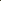

# SSCL: Adversarially Guided Image Compression via Semantic and Spectral Consistency Learning

<!-- Page 1 -->

SSCL: Adversarially Guided Image Compression via Semantic and Spectral

Consistency Learning

Wei Jiang1, Yongqi Zhai1, Jiayu Yang2, Bohao Feng3, Wenqiang Wang3,

Bo Huang3, Lin Ding3, Ronggang Wang1,2,*

1Guangdong Provincial Key Laboratory of Ultra High Definition Immersive Media Technology, Shenzhen Graduate School, Peking University

2Pengcheng Laboratory 3Alibaba Cloud Computing wei.jiang1999@outlook.com, zhaiyongqi@stu.pku.edu.cn, jiayuyang@pku.edu.cn, {fengbohao.fbh, channing.wwq, guiting.hb, bokun.dl}@alibaba-inc.com, rgwang@pkusz.edu.cn

## Abstract

Perceptual image compression has recently gained increasing attention, as it aims to reconstruct visually realistic images using generative models. Most existing methods adopt patch-based generative adversarial networks (PatchGAN) for one-step image generation, where adversarial training helps the decoder learn the distribution of natural images. However, this strategy is often coarse-grained, as it focuses mainly on patch-level consistency and overlooks global structural and semantic details. To address this limitation, we propose a simple yet effective Semantic and Spectral Consistency Learning (SSCL) strategy, which complements existing patch-based approaches for more accurate distribution alignment. For semantic consistency, we leverage semantic vision models to extract semantic features. The semantic discriminator, aware of the specific semantics of each image, provides more adaptive and precise feedback. This guides the encoder to retain meaningful information and helps the decoder synthesize detailed textures, without requiring explicit semantic transmission or additional modules. For spectral consistency, we introduce a frequency discriminator that focuses on highfrequency components, helping to reduce artifacts based on spectral priors. Experiments show that SSCL outperforms existing perceptual codecs in terms of visual quality. Compared to MS-ILLM, SSCL achieves 45% to 60% bit-rate savings on CLIC2020 and Kodak datasets, measured by FID and DISTS.

## Introduction

Learned image compression (LIC) (Ball´e, Laparra, and Simoncelli 2017; Ball´e et al. 2018; Theis et al. 2017; Minnen, Ball´e, and Toderici 2018; Minnen and Singh 2020; Cheng et al. 2020; He et al. 2021) has recently gained increasing attention due to its strong rate-distortion performance achieved through end-to-end training. Many state-of-the-art LIC models (He et al. 2022a; Jiang et al. 2023; Liu, Sun, and Katto 2023; Li et al. 2024a; Jiang et al. 2025c, 2024b) have already surpassed traditional codecs in terms of compression efficiency, suggesting their potential for broader application.

However, most existing LIC models are optimized using distortion-based metrics such as PSNR or MS-SSIM (Wang,

*Corresponding author. Copyright © 2026, Association for the Advancement of Artificial Intelligence (www.aaai.org). All rights reserved.

Kodim01 MS-ILLM (ICML’23) TACO (ICML’24)

Control-GIC (ICLR’25) SSCL (Ours) Kodim 01

0.191 Bpp 0.195 Bpp

0.202 Bpp 0.165 Bpp Bits per pixel (Bpp)

**Figure 1.** Qualitative comparisons with MS-ILLM (Muckley et al. 2023), TACO (Lee et al. 2024) and Control-GIC (Li et al. 2025). Our SSCL demonstrates best fidelity at the lowest bitrate.

Simoncelli, and Bovik 2003). These metrics are not well aligned with human perception, especially at low bit rates (Muckley et al. 2023). For example, optimizing PSNR often results in smooth and blurry outputs, while MS-SSIM may degrade text clarity (Mentzer et al. 2020). Such artifacts distort the natural statistics of reconstructed images and reduce visual realism (Blau and Michaeli 2019).

To improve perceptual quality, recent approaches incorporate generative models into the decoder to better match the distribution of natural images. Many of them (Mentzer et al. 2020; Agustsson et al. 2023; Iwai, Miyazaki, and Omachi 2024; Muckley et al. 2023; K¨orber et al. 2024) use Patch- GAN (Isola et al. 2017) for one-step generation, which promotes realism at the patch level and allows for efficient decoding. However, this strategy remains limited because it focuses mainly on local patches and ignores global structure and semantics. As a result, artifacts may appear in semantically rich regions such as grass or waves, especially under low bit-rate settings.

Moreover, these methods usually overlook the spectral consistency. Natural images have uneven spectral energy distributions. Most energy lies in low-frequency compo-

The Fortieth AAAI Conference on Artificial Intelligence (AAAI-26)

14937

AI-readable visual equivalent, added: Figure extracted from the paper PDF and converted to an SVG wrapper asset. Use the surrounding page text and caption for interpretation.

<!-- Page 2 -->

nents, while high-frequency components, though weaker, are crucial for preserving fine details. Patch-based comparisons often fail to capture these high-frequency distortions, leading to unnatural textures and degraded quality.

To tackle these challenges, we propose the Semantic and Spectral Consistency Learning (SSCL) strategy that complements patch-wise adversarial training in image compression.

For semantic consistency, a straightforward solution is to transmit semantic features from the encoder to the decoder. However, this approach requires additional modules for feature extraction and streaming, which increases computational cost and limits compatibility with existing compression architectures. Instead, we propose to guide semantic information through the discriminator. We design a semantic-aware discriminator that uses features extracted from a pretrained semantic vision model as conditions. A cross-attention mechanism aligns these features with the input, allowing the discriminator to give feedback based on semantic context. This feedback helps the decoder produce textures that better reflect semantic structure.

To improve spectral consistency, we introduce a spectral discriminator tailored for image compression. Inspired by the spectral characteristics of natural images, this module is designed to suppress high-frequency artifacts. Specifically, we decompose the input into spectral tokens and transform the latent representation into condition tokens. A Vision Transformer (ViT) is employed for conditional modeling, where global structural dependencies are captured through self-attention-based token mixing, and local interactions are enhanced via channel mixing.

## Experiments

demonstrate that SSCL achieves state-ofthe-art perceptual quality. On the CLIC2020 dataset, SSCL matches the FID score of the previous best method MS- ILLM (Muckley et al. 2023) while reducing the bit rate by 35.91%. In terms of DISTS (Ding et al. 2020), SSCL achieves 45∼60% bit-rate savings over MS-ILLM on both the CLIC2020 and Kodak datasets.

Our contributions are summarized as follows: • We identify the limitations of existing PatchGAN-based methods and highlight the need for both semantic and spectral consistency in image compression. • We propose the first semantic discriminator for image compression, which injects semantic awareness into the generation process without changing the codec architecture or increasing deployment complexity. • We propose the first spectral discriminator for image compression, which improves spectral-domain fidelity and reduces high-frequency artifacts without changing the codec architecture or increasing deployment complexity. • Extensive experiments demonstrate that our method achieves state-of-the-art perceptual quality, with significant bit-rate savings over existing methods.

Related Works Distortion-Oriented Image Compression Most existing learned image compression methods aim to enhance rate-distortion performance by advancing both

Encoder Decoder

**Figure 2.** Overview of our proposed Semantic and Spectral Consistency Learning (SSCL) approach.

transform design and entropy modeling. In terms of transforms, residual blocks (He et al. 2016; Cheng et al. 2020), transformer layers (Zou, Song, and Zhang 2022; Zhu, Yang, and Cohen 2022; Lu et al. 2022; Liu, Sun, and Katto 2023), and invertible networks (Xie, Cheng, and Chen 2021) have been adopted to enable more expressive and adaptive representations. For entropy modeling, Ball´e et al. (2018) introduce side information to better estimate the probability of latents. Subsequent works exploit latent dependencies via context models, including spatial (Van den Oord et al. 2016; Minnen, Ball´e, and Toderici 2018; He et al. 2021) and channel-wise (Minnen and Singh 2020) contexts. ELIC (He et al. 2022a) integrates both to further improve coding efficiency. Jiang et al. (2023) extend this by modeling global correlations (Jiang et al. 2025a,d,b, 2024a), while Lu et al. (2025) propose a dictionary-based entropy model to incorporate external priors.

Perception-Oriented Image Compression To improve perceptual quality in image compression, recent methods adopt conditional generative models to synthesize realistic textures and details. Agustsson et al. (2019) introduced a GAN-based loss (Goodfellow et al. 2014) to reduce distribution divergence, which was later enhanced by Mentzer et al. (2020) using a conditional discriminator. Ma et al. (2021) further improved visual quality by allocating more bits to regions of interest. To stabilize GAN training, He et al. (2022b) proposed using a hinge loss. Recent works like MS-ILLM(Muckley et al. 2023) and EGIC (K¨orber et al. 2024) leverage segmentation priors (Sch¨onfeld et al. 2021) to improve generation consistency. Beyond GANbased approaches, Yang and Mandt (2024) introduced a diffusion-based decoder conditioned on quantized latents for texture synthesis. Other diffusion-based methods (Ghouse et al. 2023; Hoogeboom et al. 2023; Kuang et al. 2024) apply residual post-processing to refine distortion-optimized outputs. Ma, Yang, and Liu (2024) proposed an end-to-end privileged decoder to guide the sampling process and enhance reconstruction quality.

## Methods

Preliminary: Perceptual Image Compression Given an input image x ∼p(x), the encoder E encodes it into a latent representation y = E(x), which is quantized into ˆy using scalar quantization. The decoder G then reconstructs the image as ˆx = G(ˆy). To facilitate entropy

14938

AI-readable visual equivalent, added: Figure extracted from the paper PDF and converted to an SVG wrapper asset. Use the surrounding page text and caption for interpretation.

<!-- Page 3 -->

Semantic Vision Model

❄

🔥

Real or Fake?

(a) Architecture of Proposed Semantic Discriminator Ds.

Conv

Cross Attention

Cross Attention

Proj

MLP

Proj condition LN Proj

LN

(b) Architecture of Proposed Semantic Conditioning Block (SCB).

**Figure 3.** Architecture of Proposed Semantic Consistency Learning. “LN” is Layernorm (Ba, Kiros, and Hinton 2016).

Tokens

FFT

ViT

ViT

ViT

ViT

Real or Fake?

(a) Architecture of Proposed Spectral Discriminator DF.

LN

Proj

Self

Attention

LN

MLP

(b) Architecture of the First ViT Block in Spectral Discriminator.

**Figure 4.** Architecture of Proposed Spectral Consistency Learning.

estimation and coding, a learned Gaussian model q(ˆy) ∼ N(µ, σ2) is used to approximate the true marginal distribution p(ˆy), where µ and σ are predicted mean and scale (Ball´e et al. 2018).

Perceptual image compression seeks to train the decoder G such that the reconstructed image ˆx is perceptually indistinguishable from the original image x, often by approximating the conditional distribution (Zhu et al. 2025):

ˆx = G(ˆy) ∼p(x|ˆy).

Blau and Michaeli (2019) showed that improving perceptual quality generally increases distortion (e.g., MSE), and formally established the following upper bound:

E

∥ˆx −x∥2

2

≤2 E

∥E[x|ˆy] −x∥2

2

.

Yan, Wen, and Liu (2022) further showed that this bound is tight when the encoder E is deterministic, implying that achieving perceptual optimality can require up to twice the distortion.

Overview of SSCL An overview of the proposed SSCL is shown in Figure 2. In SSCL, semantic and spectral consistency learning are introduced as complements to the conventional patch-wise consistency learning (Mentzer et al. 2018). For semantic consistency, we incorporate a semantic discriminator Ds that provides fine-grained feedback to the decoder. This feedback is guided by high-quality semantic features s extracted from pretrained semantic vision models. For spectral consistency, we propose a spectral discriminator DF that emphasizes discrepancies in high-frequency distributions. It operates on spectral-domain visual tokens as input, with latent tokens serving as conditional guidance, thereby helping to reduce high-frequency artifacts.

Semantic Discriminator

The architecture of the proposed semantic discriminator is illustrated in Figure 3. It leverages a pretrained and frozen vision model to extract high-quality semantic features from the ground-truth images, which serve as conditional inputs for the discrimination process. Within the semantic discriminator, multiple Semantic Conditioning Blocks (SCBs) are stacked to effectively fuse the semantic condition with the input features, enabling more precise and semanticallyaware discrimination.

Semantic Extraction The effectiveness of semantic consistency learning largely depends on the quality of the extracted semantic features. Inspired by recent vision models trained on large-scale datasets (Dosovitskiy et al. 2021; Radford et al. 2021; Caron et al. 2021), we hypothesize that such large-scale training enables better semantic alignment, consistent with the scaling laws observed in vision models (Sun et al. 2017). In SSCL, we adopt CLIP (Radford et al. 2021) with a ResNet-50 (He et al. 2016) backbone as the semantic feature extractor, as the ViT-based version of CLIP requires fixed input resolution (224 × 224) and introduces higher computational complexity. Trained on 400 million imagetext pairs, CLIP provides a strong semantic prior to guide our compression framework.

Semantic Conditioning Given the extracted semantic feature s, we propose the Semantic Conditioning Block (SCB) to integrate it effectively. As an image contains both local semantic details and global contextual information, it is essential to consider both aspects when incorporating semantic guidance. Motivated by the need for a global receptive field and inspired by the conditioning strategies employed in latent diffusion models (Rombach et al. 2022), we adopt the cross-attention mechanism (Vaswani et al. 2017) to perform

14939

AI-readable visual equivalent, added: Figure extracted from the paper PDF and converted to an SVG wrapper asset. Use the surrounding page text and caption for interpretation.

AI-readable visual equivalent, added: Figure extracted from the paper PDF and converted to an SVG wrapper asset. Use the surrounding page text and caption for interpretation.

AI-readable visual equivalent, added: Figure extracted from the paper PDF and converted to an SVG wrapper asset. Use the surrounding page text and caption for interpretation.

AI-readable visual equivalent, added: Figure extracted from the paper PDF and converted to an SVG wrapper asset. Use the surrounding page text and caption for interpretation.

AI-readable visual equivalent, added: Figure extracted from the paper PDF and converted to an SVG wrapper asset. Use the surrounding page text and caption for interpretation.

<!-- Page 4 -->

0.0 0.1 0.2 0.3 0.4 0.5 0.6 0.7 Bpp

2 2

20

22

24

26

FID

0.0 0.1 0.2 0.3 0.4 0.5 0.6 0.7 Bpp

0.1

0.2

0.3

0.4

LPIPS[VGG]

0.0 0.1 0.2 0.3 0.4 0.5 0.6 0.7 Bpp

0.00

0.05

0.10

0.15

0.20

DISTS

0.0 0.1 0.2 0.3 0.4 0.5 0.6 0.7 Bpp

2 15

2 13

2 11

2 9

2 7

2 5

KID

0.0 0.1 0.2 0.3 0.4 0.5 0.6 0.7 Bpp

0.90

0.92

0.94

0.96

0.98

MS-SSIM

0.0 0.1 0.2 0.3 0.4 0.5 0.6 0.7 Bpp

20

25

30

35

PSNR

SSCL(Ours) MRIC(CVPR'23)

Control-GIC(ICLR'25) MS-ILLM(ICML'23)

EGIC(ECCV'24) HiFiC(NeurIPS'20)

TACO(ICML'24) FTIC(ICLR'24)

DiffEIC(TCSVT'24) MLIC+ + (TOMM'25)

CRDR(WACV'23) DCAE(CVPR'25)

CDC(NeurIPS'23) VTM-17.0 Intra

**Figure 5.** Rate-Distortion-Perception curves of SSCL and the baselines (K¨orber et al. 2024; Lee et al. 2024; Hoogeboom et al. 2023; Ghouse et al. 2023; Iwai, Miyazaki, and Omachi 2024; Yang and Mandt 2024; Agustsson et al. 2023; Muckley et al. 2023; Mentzer et al. 2020; VTM 2022; Jiang et al. 2025c) on CLIC 2020 dataset (Toderici et al. 2020).

semantic conditioning.

In SCB, the semantic feature s is first processed by convolutional layers to better align it with the image compression task, and then projected into the query representation Q. The keys and values are derived from the input features of real and generated samples, denoted as (K, V) and (ˆK, ˆV), respectively. Semantic conditioning is performed via:

A = Softmax

QK⊤

√dK

V, ˆA = Softmax

Q ˆK⊤

√dK

!

ˆV,

(1) where dK is the channel dimension of the keys. The outputs of the cross-attention layers, A and ˆA, are subsequently passed through a projection layer and a multilayer perceptron (MLP) for further transformation.

Spectral Discriminator

The architecture of the proposed spectral discriminator is illustrated in Figure 4. It first transforms the input images x and ˆx into visual tokens, which are then converted into spectral tokens via the Fast Fourier Transform (FFT). Meanwhile, the latent representation ˆy is also transformed into conditional spectral tokens to guide the discrimination process. The spectral tokens and conditional spectral tokens are concatenated along the channel dimension and subsequently fed into a series of Vision Transformer (ViT) blocks.

Token-based Spectral Modeling To capture the spectral distribution discrepancy between real and generated images, we first convert both the images and their corresponding latent representations into visual tokens. Each token is then individually mapped to the spectral domain via the Fast Fourier Transform (FFT). This token-based spectral modeling is motivated by the strong local correlations inherent in natural images and the high computational cost of applying FFT to full-resolution inputs. Specifically, the computational complexity of performing FFT on a 2D input of size H ×W is O(HW log(HW)), which becomes prohibitive for highresolution data.

To enable token-based modeling, the latent representation ˆy is first upsampled to match the resolution of the original and reconstructed images, x and ˆx. All inputs are then divided into non-overlapping tokens with a spatial resolution of 32 × 32 pixels. Each token t is transformed into the spectral domain via FFT F(·):

F(m, n) =

31 X j=0

31 X k=0 t(j, k) · e−2πi(mj+nk

32), (2)

where {m, n ∈Z | 0 ≤m, n ≤31}. The resulting spectral representation is then converted to a power spectrum to form the final spectral token:

P(m, n) = |F(m, n)|2 = F(m, n) · F(m, n). (3)

We denote the resulting spectral tokens of x, ˆx, and ˆy as tx, tˆx, and tˆy, respectively. The spectral transform concentrates high-frequency components near the spectral center, enabling clearer separation between high and low frequencies. Compared to spatial-domain coupling, the spectral domain provides a more favorable representation for learning spectral consistency.

Spectral Conditioning Owing to the strong local correlations in natural images, we concatenate the spectral tokens tx and tˆx with tˆy along the channel dimension, enabling the model to leverage spatially aligned spectral features as conditional information. The resulting concatenated tokens are denoted as tx|ˆy and tˆx|ˆy, respectively. These tokens are then processed by multiple Vision Transformer (ViT) blocks for conditional fusion via self-attention:

A = Softmax

QK⊤

√dK

V, ˆA = Softmax

ˆQ ˆK⊤

√dK

!

ˆV,

(4)

14940

<!-- Page 5 -->

## Method

Target

CLIC 2020 Kodak Perc. Dist. Perc. Dist. FID LPIPS[VGG] DISTS MS-SSIM PSNR LPIPS[VGG] DISTS MS-SSIM PSNR

MS-ILLM (ICML’23) Perc. 0.0 0.0 0.0 0.0 0.0 0.0 0.0 0.0 0.0

VTM-17.0 Intra Dist. 2869.4 465.9 889.6 -14.7 -45.0 247.3 435.8 -5.2 -46.5 ELIC (CVPR’22) Dist. 2447.4 573.2 1174.1 -23.3 -48.7 276.7 565.7 -19.8 -49.6 LIC-TCM (CVPR’23) Dist. 2979.0 562.2 1424.8 -28.4 -52.7 214.9 515.1 -23.9 -51.0 FTIC (ICLR’24) Dist. 2793.4 567.0 1417.2 -27.5 -51.9 185.3 479.6 -30.4 -55.2 MLIC++ (TOMM’25) Dist. 2411.1 523.9 1302.0 -34.0 -59.2 204.7 513.0 -31.3 -57.1 DCAE (CVPR’25) Dist. 2481.2 487.6 1246.0 -35.7 -58.2 183.3 476.0 -31.4 -56.8

MRIC (CVPR’23) Perc. 51.2 – – – -22.9 – – – -26.8 DiffEIC (TCSVT’24) Perc. 208.1 -2.5 69.5 163.5 593.3 -39.1 -35.2 118.1 285.8 CRDR (WACV’24) Perc. 45.1 29.8 33.6 1.2 -24.7 5.4 1.4 -3.7 -31.0 TACO (ICML’24) Perc. 188.4 64.8 219.5 -10.4 -34.2 10.2 37.2 -9.6 -32.9 EGIC (ECCV’24) Perc. -1.1 15.5 -5.2 -4.8 -29.6 -1.2 -15.8 -2.4 -27.5 Control-GIC (ICLR’25) Perc. 1043.18 195.6 231.9 329.1 471.8 121.3 127.2 213.4 255.2

SSCL (Ours) Perc. -35.9 -48.0 -45.9 -6.1 -13.4 -49.2 -59.6 -6.3 -19.7

①“–” indicates the result is unavailable. ②BD-Rates for HiFiC and CDC are not reported, since they provide only three points, which is insufficient for cubic spline interpolation required in BD-Rate computation. ③All metrics are computed on 8-bit PNG images to align with standard image display and VTM outputs, which may differ from metrics reported on float32 reconstructions in other works.

**Table 1.** BD-Rate (Bjontegaard 2001) (%) w.r.t MS-ILLM (Muckley et al. 2023) for perception and distortion metrics, with the best results highlighted in bold.

where Q, K, V are the query, key, and value projections of tx|ˆy, ˆQ, ˆK, ˆV are those of tˆx|ˆy, and dK is the channel dimension of keys. The resulting outputs, A and ˆA, are subsequently passed through an MLP for intra-token mixing. The ViT block capture global structural dependencies via self-attention-based token mixing, and enhances local token interactions through channel mixing, enabling a comprehensive integration of global and local spectral modeling and conditioning.

Implementation Details We build SSCL upon MLIC++ (Jiang et al. 2025c), adopting it as the backbone image compression framework. Following MRIC (Agustsson et al. 2023) and CRDR (Iwai, Miyazaki, and Omachi 2024), we adopt a combination of MSE loss (d), LPIPS loss (LP), and adversarial loss. The overall loss is defined as:

L = λRR+λdd(x, ˆx)+β λP LP (x, ˆx) + λadvLG

, (5)

where R is the bit-rate of ˆy, LG is the average of proposed consistency learning-based adversarial losses. Following existing approaches (Mentzer et al. 2018; Agustsson et al. 2023; Iwai, Miyazaki, and Omachi 2024; Muckley et al. 2023), we adopt non-saturating GAN loss (Goodfellow et al. 2014) in SSCL. During inference, we employ an optimized arithmetic coding engine with optimized rANS (Duda 2013) interface to PyTorch. This improvement achieves approximately 30% decoding acceleration on the Kodak dataset and 50% on the CLIC 2020 dataset.

## Experiments

## Experimental Setup

Dataset SSCL are trained on 105 images from ImageNet (Deng et al. 2009), COCO2017 (Lin et al. 2014),

DIV2K (Agustsson and Timofte 2017), and Flickr2K (Lim et al. 2017). Training lasts for 1M steps with a batch size of 16, using the Adam optimizer (Kingma and Ba 2014) and a fixed learning rate of 10−4 on 2 Tesla A100 GPUs.

## Evaluation

Following Muckley et al. (2023), we use PSNR and MS-SSIM (Wang, Simoncelli, and Bovik 2003) to evaluate distortion, and FID (Heusel et al. 2017), KID (Bi´nkowski et al. 2018), LPIPS (VGG)(Zhang et al. 2018), and DISTS(Ding et al. 2020) to assess perceptual quality. FID is computed following the protocol of Mentzer et al. (2020), but is omitted for Kodak due to its small dataset size (24 images), which may lead to unreliable statistics. All metrics are computed on the reconstructed images saved in PNG format (8-bit integer).

Hyperparameters The hyperparameters of SSCL mainly follow those of MRIC and CRDR. λR is selected from {14.0, 6.5, 4.0, 2.2, 1.3, 0.76}. Other parameters are set as follows: λd = 0.01, λP = 1.7, λadv = 1, and β = 3.84.

Baselines We primarily compare SSCL with stateof-the-art perception-oriented methods, including HiFiC (Mentzer et al. 2020), MS-ILLM (Muckley et al. 2023), MRIC (Agustsson et al. 2023), CRDR (Iwai, Miyazaki, and Omachi 2024), TACO (Lee et al. 2024), EGIC (K¨orber et al. 2024), Control-GIC (Li et al. 2025), and diffusion-based approaches such as CDC (Yang and Mandt 2024), and DiffEIC (Li et al. 2024b). We also compare with distortion-oriented methods, including ELIC (He et al. 2022a), LIC-TCM (Liu, Sun, and Katto 2023), FTIC (Li et al. 2024a), MLIC++ (Jiang et al. 2025c) and DCAE (Lu et al. 2025). The traditional codec VTM 17.0 is also included as a baseline.

14941

<!-- Page 6 -->

Kodim22

Bits per pixel (Bpp)

SSCL (Ours)

## 0.111 Bpp

Control-GIC (ICLR’25)

0.143 Bpp CRDR (WACV’24) TACO (ICML’24)

## 0.155 Bpp

MS-ILLM (ICML’23)

## 0.146 Bpp

HiFiC (NeurIPS’20) MLIC++ (TOMM’25)

## 0.148 Bpp

DCAE (CVPR’25)

## 0.149 Bpp Kodim22 SSCL Control-GIC CRDR TACO MS-ILLM

HiFiC MLIC++ DCAE

## 0.114 Bpp

## 0.184 Bpp

**Figure 6.** Comparing input images to reconstructions from our SSCL, the perception-oriented state-of-the-art methods Control- GIC, CRDR, TACO, MS-ILLM, HiFiC and distortion-oriented state-of-the-art methods MLIC++ and DCAE.

0.0 0.2 0.4 0.6 0.8 1.0 Training Step 1e6

0.5

0.6

0.7

0.8

0.9

Loss Value

Spectral Loss Semantic Loss

**Figure 7.** Generator loss curves of proposed Semantic and Spectral Consistency Learning (λR = 1.3).

Main Results Quantitative Comparison The rate-distortion and rateperception performance of SSCL and baselines are shown in Figure 5. The BD-Rates (Bjontegaard 2001) are presented in Table 1. In terms of perception, SSCL achieves state-ofthe-art performance, significantly outperforming other base- lines. Notably, our SSCL outperforms Diffusion-based baselines (Yang and Mandt 2024; Li et al. 2024b). Specifically, SSCL achieves rate reductions of 30 ∼50% while maintaining comparable quality compared to the previous state-of-the-art generative image compression method, MS- ILLM (Muckley et al. 2023). SSCL excels particularly at high bit-rates. Regarding distortion, SSCL performs worse than the distortion-oriented method MLIC++, as realism improvements often come at the cost of distortion (Blau and Michaeli 2019), especially in terms of PSNR (Blau and Michaeli 2019; Hoogeboom et al. 2023). Compared to MS- ILLM, SSCL demonstrates better PSNR and MS-SSIM performances.

Qualitative Comparison The reconstructions are visualized in Figure 6. Compared to other methods, SSCL reconstructs more realistic textures and details on the trees while achieving the lowest bitrate. This benefit comes from seman-

14942

AI-readable visual equivalent, added: Figure extracted from the paper PDF and converted to an SVG wrapper asset. Use the surrounding page text and caption for interpretation.

AI-readable visual equivalent, added: Figure extracted from the paper PDF and converted to an SVG wrapper asset. Use the surrounding page text and caption for interpretation.

AI-readable visual equivalent, added: Figure extracted from the paper PDF and converted to an SVG wrapper asset. Use the surrounding page text and caption for interpretation.

AI-readable visual equivalent, added: Figure extracted from the paper PDF and converted to an SVG wrapper asset. Use the surrounding page text and caption for interpretation.

AI-readable visual equivalent, added: Figure extracted from the paper PDF and converted to an SVG wrapper asset. Use the surrounding page text and caption for interpretation.

AI-readable visual equivalent, added: Figure extracted from the paper PDF and converted to an SVG wrapper asset. Use the surrounding page text and caption for interpretation.

AI-readable visual equivalent, added: Figure extracted from the paper PDF and converted to an SVG wrapper asset. Use the surrounding page text and caption for interpretation.

AI-readable visual equivalent, added: Figure extracted from the paper PDF and converted to an SVG wrapper asset. Use the surrounding page text and caption for interpretation.

AI-readable visual equivalent, added: Figure extracted from the paper PDF and converted to an SVG wrapper asset. Use the surrounding page text and caption for interpretation.

AI-readable visual equivalent, added: Figure extracted from the paper PDF and converted to an SVG wrapper asset. Use the surrounding page text and caption for interpretation.

AI-readable visual equivalent, added: Figure extracted from the paper PDF and converted to an SVG wrapper asset. Use the surrounding page text and caption for interpretation.

AI-readable visual equivalent, added: Figure extracted from the paper PDF and converted to an SVG wrapper asset. Use the surrounding page text and caption for interpretation.

AI-readable visual equivalent, added: Figure extracted from the paper PDF and converted to an SVG wrapper asset. Use the surrounding page text and caption for interpretation.

AI-readable visual equivalent, added: Figure extracted from the paper PDF and converted to an SVG wrapper asset. Use the surrounding page text and caption for interpretation.

AI-readable visual equivalent, added: Figure extracted from the paper PDF and converted to an SVG wrapper asset. Use the surrounding page text and caption for interpretation.

AI-readable visual equivalent, added: Figure extracted from the paper PDF and converted to an SVG wrapper asset. Use the surrounding page text and caption for interpretation.

AI-readable visual equivalent, added: Figure extracted from the paper PDF and converted to an SVG wrapper asset. Use the surrounding page text and caption for interpretation.

<!-- Page 7 -->

## Method

Params (M) CLIC 2020 Kodak Enc Time (s) Dec Time (s) VRAM (GB) Enc Time (s) Dec Time (s) VRAM (GB)

ELIC (CVPR’22) 41.9 0.58 0.51 3.13 0.19 0.13 0.53 LIC-TCM (CVPR’23) 75.9 0.53 0.60 8.33 0.15 0.17 1.41 FTIC (ICLR’24) 69.8 >103 >103 7.26 >102 >102 1.36 MLIC++ (TOMM’25) 83.5 0.57 0.67 4.56 0.16 0.20 1.65 DCAE (CVPR’25) 119.2 0.73 0.79 11.82 0.13 0.14 2.73

HiFiC (NeurIPS’20) 181.5 2.04 5.02 3.90 0.33 0.78 1.72 MRIC (CVPR’23) 60.5 0.49 0.58 4.27 0.14 0.15 0.58 MS-ILLM (ICML’23) 181.5 0.58 0.57 5.10 0.11 0.12 1.09 CDC (NeurIPS’23) 53.9 0.12 15.36 11.09 0.07 2.72 1.47 DiffEIC (TCSVT’24) 1379.5 0.97 60.03 21.24 0.21 4.13 6.69 TACO (ICML’24) 101.7 0.47 0.52 3.37 0.14 0.15 0.98 CRDR (WACV’24) 127.7 0.51 0.58 4.31 0.14 0.155 0.59 EGIC (ECCV’24) 30.0 0.53 0.58 10.19 0.155 0.27 2.57 Control-GIC (ICLR’25) 131.0 0.21 3.79 12.81 0.15 0.53 6.54

SSCL (Ours) 83.5 0.43 0.33 4.56 0.15 0.14 1.65

①All evaluations are conducted on a Tesla A100-40G GPU with a Xeon(R) Platinum 8336C CPU.

**Table 2.** Encoding times (s), decoding times (s) and Peak GPU VRAM consumptions (GB) during encoding / decoding on CLIC 2020 (Toderici et al. 2020) and Kodak (Kodak 1993).

tic consistency learning, which preserves semantic information in the latent representation and enables the model to generate detailed tree structures. In addition, spectral consistency learning helps the generated high-frequency details better match the distribution of the input image, effectively avoiding unpleasing artifacts.

Training Stability The generator losses of semantic and spectral consistency learning are illustrated in Figure 7. Compared with patch-wise consistency learning, introducing semantic and spectral consistency learning does not compromise training stability. Thanks to the use of a nonsaturating GAN loss, the adversarial losses remain stable around 0.693 during training, indicating that the decoder and discriminators are near a Nash equilibrium. As training progresses, the reconstruction quality steadily improves.

## Model

Complexity We compare the model size, encoding, decoding time, VRAM consumption on the CLIC 2020 (Toderici et al. 2020) and Kodak (Kodak 1993). The results are presented in Table 2. Our SSCL model exhibits significantly faster decoding speeds and moderate memory consumption compared to previous approaches, particularly those based on diffusion models such as CDC (Yang and Mandt 2024) and DiffEIC (Li et al. 2024b). Notably, SSCL achieves the fastest decoding speed on the CLIC 2020 dataset (Toderici et al. 2020).

Ablation Studies The contribution of each component is presented in Table 3. As illustrated, proposed semantic and spectral consistency learning enhances perception. In terms of distortion, the variant with more consistency learning regulation exhibits slightly lower PSNR, as enhanced realism often comes at the cost of distortion according to distortion-perception tradeoff (Blau and Michaeli 2019). The adversarially trained vari-

Consistency Learning FID DISTS PSNR Patch-Wise Semantic Spectral

✓ 0 0 0 ✓ ✓ -17.9 -13.2 0.3 ✓ ✓ ✓ -28.5 -21.6 0.7

**Table 3.** Ablation Studies on CLIC 2020 dataset. The metric is BD-Rate (%) for FID, DISTS and PSNR.

ant can generate realistic textures and details, which may not align perfectly with the original pixel values.

## Conclusion

In this paper, we present SSCL, a new paradigm for adversarially guided image compression. SSCL introduces Semantic and Spectral Consistency Learning to enhance previous patch-wise supervision, offering more accurate and diverse guidance to better align reconstructed images with natural image distributions. For semantic consistency, we propose a semantic discriminator conditioned on features extracted from semantic vision models, which are fused via cross-attention to capture global semantics. For spectral consistency, we design a spectral discriminator that emphasizes high-frequency components to reduce artifacts. Experiments show that SSCL achieves SOTA perceptual quality, significantly outperforming the previous SOTA methods.

The additional discriminators in SSCL increase training complexity, this overhead is acceptable as the model is used repeatedly during inference. To further enhance training efficiency, we plan to develop unified discriminators that jointly support semantic and spectral consistency learning.

14943

<!-- Page 8 -->

## Acknowledgments

This work is financially supported by Guangdong Provincial Key Laboratory of Ultra High Definition Immersive Media Technology (Grant No.2024B1212010006), this work is also financially supported for Outstanding Talents Training Fund in Shenzhen, Shenzhen Science and Technology Program (Grant No. SYSPG20241211173440004). This work is also supported by the Alibaba Innovative Research Program and Ant Group.

## References

Agustsson, E.; Minnen, D.; Toderici, G.; and Mentzer, F. 2023. Multi-realism image compression with a conditional generator. In CVPR, 22324–22333. Agustsson, E.; and Timofte, R. 2017. NTIRE 2017 Challenge on Single Image Super-Resolution: Dataset and Study. In CVPR Workshops, 1122–1131. Agustsson, E.; Tschannen, M.; Mentzer, F.; Timofte, R.; and Gool, L. V. 2019. Generative adversarial networks for extreme learned image compression. In ICCV, 221–231. Ba, J. L.; Kiros, J. R.; and Hinton, G. E. 2016. Layer normalization. arXiv:1607.06450. Ball´e, J.; Laparra, V.; and Simoncelli, E. P. 2017. End-to- End Optimized Image Compression. In ICLR. Ball´e, J.; Minnen, D.; Singh, S.; Hwang, S. J.; and Johnston, N. 2018. Variational Image Compression with A Scale Hyperprior. In ICLR. Bi´nkowski, M.; Sutherland, D. J.; Arbel, M.; and Gretton, A. 2018. Demystifying MMD GANs. In ICLR. Bjontegaard, G. 2001. Calculation of average PSNR differences between RD-curves. VCEG-M33. Blau, Y.; and Michaeli, T. 2019. Rethinking lossy compression: The rate-distortion-perception tradeoff. In ICML, 675– 685. PMLR. Caron, M.; Touvron, H.; Misra, I.; J´egou, H.; Mairal, J.; Bojanowski, P.; and Joulin, A. 2021. Emerging properties in self-supervised vision transformers. In ICCV, 9650–9660. Cheng, Z.; Sun, H.; Takeuchi, M.; and Katto, J. 2020. Learned Image Compression With Discretized Gaussian Mixture Likelihoods and Attention Modules. In CVPR. Deng, J.; Dong, W.; Socher, R.; Li, L.-J.; Li, K.; and Fei- Fei, L. 2009. Imagenet: A Large-Scale Hierarchical Image Database. In CVPR, 248–255. IEEE. Ding, K.; Ma, K.; Wang, S.; and Simoncelli, E. P. 2020. Image quality assessment: Unifying structure and texture similarity. TPAMI, 44(5): 2567–2581. Dosovitskiy, A.; Beyer, L.; Kolesnikov, A.; Weissenborn, D.; Zhai, X.; Unterthiner, T.; Dehghani, M.; Minderer, M.; Heigold, G.; Gelly, S.; et al. 2021. An Image is Worth 16x16 Words: Transformers for Image Recognition at Scale. In ICLR. Duda, J. 2013. Asymmetric numeral systems: entropy coding combining speed of huffman coding with compression rate of arithmetic coding. arXiv:1311.2540.

Ghouse, N. F.; Petersen, J.; Wiggers, A.; Xu, T.; and Sautiere, G. 2023. A residual diffusion model for high perceptual quality codec augmentation. arXiv:2301.05489. Goodfellow, I.; Pouget-Abadie, J.; Mirza, M.; Xu, B.; Warde-Farley, D.; Ozair, S.; Courville, A.; and Bengio, Y. 2014. Generative adversarial nets. NeurIPS, 27. He, D.; Yang, Z.; Peng, W.; Ma, R.; Qin, H.; and Wang, Y. 2022a. ELIC: Efficient Learned Image Compression With Unevenly Grouped Space-Channel Contextual Adaptive Coding. In CVPR. He, D.; Yang, Z.; Yu, H.; Xu, T.; Luo, J.; Chen, Y.; Gao, C.; Shi, X.; Qin, H.; and Wang, Y. 2022b. PO-ELIC: Perceptionoriented efficient learned image coding. In CVPR Workshops, 1764–1769. He, D.; Zheng, Y.; Sun, B.; Wang, Y.; and Qin, H. 2021. Checkerboard Context Model for Efficient Learned Image Compression. In CVPR, 14771–14780. He, K.; Zhang, X.; Ren, S.; and Sun, J. 2016. Deep residual learning for image recognition. In CVPR, 770–778. Heusel, M.; Ramsauer, H.; Unterthiner, T.; Nessler, B.; and Hochreiter, S. 2017. Gans trained by a two time-scale update rule converge to a local nash equilibrium. NeurIPS, 30. Hoogeboom, E.; Agustsson, E.; Mentzer, F.; Versari, L.; Toderici, G.; and Theis, L. 2023. High-fidelity image compression with score-based generative models. arXiv:2305.18231. Isola, P.; Zhu, J.-Y.; Zhou, T.; and Efros, A. A. 2017. Imageto-image translation with conditional adversarial networks. In CVPR, 1125–1134. Iwai, S.; Miyazaki, T.; and Omachi, S. 2024. Controlling rate, distortion, and realism: Towards a single comprehensive neural image compression model. In WACV, 2900– 2909. Jiang, W.; Li, J.; Zhang, K.; and Zhang, L. 2024a. LVC- LGMC: Joint local and global motion compensation for learned video compression. In ICASSP, 2955–2959. IEEE. Jiang, W.; Li, J.; Zhang, K.; and Zhang, L. 2025a. BiECVC: Gated Diversification of Bidirectional Contexts for Learned Video Compression. arXiv:2505.09193. Jiang, W.; Li, J.; Zhang, K.; and Zhang, L. 2025b. ECVC: Exploiting Non-Local Correlations in Multiple Frames for Contextual Video Compression. In CVPR. Jiang, W.; Ning, P.; Yang, J.; Zhai, Y.; Gao, F.; and Wang, R. 2024b. LLIC: Large Receptive Field Transform Coding with Adaptive Weights for Learned Image Compression. TMM. Jiang, W.; Yang, J.; Zhai, Y.; Gao, F.; and Wang, R. 2025c. MLIC++: Linear Complexity Multi-Reference Entropy Modeling for Learned Image Compression. ACM TOMM, 21(5): 1–25. Jiang, W.; Yang, J.; Zhai, Y.; Ning, P.; Gao, F.; and Wang, R. 2023. MLIC: Multi-Reference Entropy Model for Learned Image Compression. In ACM MM. Jiang, W.; Zhai, Y.; Yang, J.; Gao, F.; and Wang, R. 2025d. MLICv2: Enhanced Multi-Reference Entropy Modeling for Learned Image Compression. arXiv:2504.19119.

14944

<!-- Page 9 -->

Kingma, D. P.; and Ba, J. 2014. Adam: A method for stochastic optimization. arXiv:1412.6980. Kodak, E. 1993. Kodak lossless true color image suite. K¨orber, N.; Kromer, E.; Siebert, A.; Hauke, S.; Mueller- Gritschneder, D.; and Schuller, B. 2024. Egic: Enhanced low-bit-rate generative image compression guided by semantic segmentation. In ECCV, 202–220. Springer. Kuang, H.; Ma, Y.; Yang, W.; Guo, Z.; and Liu, J. 2024. Consistency Guided Diffusion Model with Neural Syntax for Perceptual Image Compression. In ACM MM, 1622– 1631. Lee, H.; Kim, M.; Kim, J.-H.; Kim, S.; Oh, D.; and Lee, J. 2024. Neural Image Compression with Text-guided Encoding for both Pixel-level and Perceptual Fidelity. In ICML. Li, A.; Li, F.; Liu, Y.; Cong, R.; Zhao, Y.; and Bai, H. 2025. Once-for-All: Controllable Generative Image Compression with Dynamic Granularity Adaption. In ICLR. Li, H.; Li, S.; Dai, W.; Li, C.; Zou, J.; and Xiong, H. 2024a. Frequency-Aware Transformer for Learned Image Compression. In ICLR. Li, Z.; Zhou, Y.; Wei, H.; Ge, C.; and Jiang, J. 2024b. Towards Extreme Image Compression with Latent Feature Guidance and Diffusion Prior. TCSVT. Lim, B.; Son, S.; Kim, H.; Nah, S.; and Mu Lee, K. 2017. Enhanced Deep Residual Networks for Single Image Super- Resolution. In CVPR Workshops. Lin, T.-Y.; Maire, M.; Belongie, S.; Hays, J.; Perona, P.; Ramanan, D.; Doll´ar, P.; and Zitnick, C. L. 2014. Microsoft COCO: Common Objects in Context. In ECCV, 740–755. Liu, J.; Sun, H.; and Katto, J. 2023. Learned Image Compression with Mixed Transformer-Cnn Architectures. In CVPR. Lu, J.; Zhang, L.; Zhou, X.; Li, M.; Li, W.; and Gu, S. 2025. Learned Image Compression with Dictionary-based Entropy Model. In CVPR, 12850–12859. Lu, M.; Guo, P.; Shi, H.; Cao, C.; and Ma, Z. 2022. Transformer-based Image Compression. In DCC, 469–469. Ma, Y.; Yang, W.; and Liu, J. 2024. Correcting Diffusion- Based Perceptual Image Compression with Privileged Endto-End Decoder. In ICML. Ma, Y.; Zhai, Y.; Yang, C.; Yang, J.; Wang, R.; Zhou, J.; Li, K.; Chen, Y.; and Wang, R. 2021. Variable rate roi image compression optimized for visual quality. In CVPR Workshops, 1936–1940. Mentzer, F.; Agustsson, E.; Tschannen, M.; Timofte, R.; and Van Gool, L. 2018. Conditional probability models for deep image compression. In CVPR, 4394–4402. Mentzer, F.; Toderici, G. D.; Tschannen, M.; and Agustsson, E. 2020. High-fidelity generative image compression. NeurIPS, 33: 11913–11924. Minnen, D.; Ball´e, J.; and Toderici, G. D. 2018. Joint Autoregressive and Hierarchical Priors for Learned Image Compression. In NeurIPS, 10771–10780. Minnen, D.; and Singh, S. 2020. Channel-wise Autoregressive Entropy Models for Learned Image Compression. In ICIP, 3339–3343. IEEE.

Muckley, M. J.; El-Nouby, A.; Ullrich, K.; J´egou, H.; and Verbeek, J. 2023. Improving statistical fidelity for neural image compression with implicit local likelihood models. In ICML, 25426–25443. PMLR. Radford, A.; Kim, J. W.; Hallacy, C.; Ramesh, A.; Goh, G.; Agarwal, S.; Sastry, G.; Askell, A.; Mishkin, P.; Clark, J.; et al. 2021. Learning transferable visual models from natural language supervision. In ICML, 8748–8763. PmLR. Rombach, R.; Blattmann, A.; Lorenz, D.; Esser, P.; and Ommer, B. 2022. High-resolution image synthesis with latent diffusion models. In CVPR, 10684–10695. Sch¨onfeld, E.; Sushko, V.; Zhang, D.; Gall, J.; Schiele, B.; and Khoreva, A. 2021. You Only Need Adversarial Supervision for Semantic Image Synthesis. In ICLR. Sun, C.; Shrivastava, A.; Singh, S.; and Gupta, A. 2017. Revisiting unreasonable effectiveness of data in deep learning era. In ICCV, 843–852. Theis, L.; Shi, W.; Cunningham, A.; and Husz´ar, F. 2017. Lossy Image Compression with Compressive Autoencoders. In ICLR. Toderici, G.; Shi, W.; Timofte, R.; Theis, L.; Ball´e, J.; Agustsson, E.; Johnston, N.; and Mentzer, F. 2020. Workshop and Challenge on Learned Image Compression. Van den Oord, A.; Kalchbrenner, N.; Espeholt, L.; Vinyals, O.; Graves, A.; et al. 2016. Conditional Image Generation with Pixelcnn Decoders. NeurIPS, 29. Vaswani, A.; Shazeer, N.; Parmar, N.; Uszkoreit, J.; Jones, L.; Gomez, A. N.; Kaiser, Ł.; and Polosukhin, I. 2017. Attention is All You Need. NeurIPS, 30: 5998–6008. VTM. 2022. Versatile video coding reference software version 17.0 (VTM-17.0). Wang, Z.; Simoncelli, E. P.; and Bovik, A. C. 2003. Multiscale Structural Similarity for Image Quality Assessment. In ACSSC, volume 2. IEEE. Xie, Y.; Cheng, K. L.; and Chen, Q. 2021. Enhanced Invertible Encoding for Learned Image Compression. In ACM MM, 162–170. Yan, Z.; Wen, F.; and Liu, P. 2022. Optimally Controllable Perceptual Lossy Compression. In ICML, 24911–24928. PMLR. Yang, R.; and Mandt, S. 2024. Lossy image compression with conditional diffusion models. NeurIPS, 36. Zhang, R.; Isola, P.; Efros, A. A.; Shechtman, E.; and Wang, O. 2018. The unreasonable effectiveness of deep features as a perceptual metric. In CVPR, 586–595. Zhu, Y.; Yang, Y.; and Cohen, T. 2022. Transformer-based Transform Coding. In ICLR. Zhu, Z.; Xu, T.; Huang, M.; He, D.; Ge, X.; Zhang, X.; Li, L.; and Wang, Y. 2025. Fast Training-free Perceptual Image Compression. arXiv:2506.16102. Zou, R.; Song, C.; and Zhang, Z. 2022. The Devil Is in the Details: Window-based Attention for Image Compression. In CVPR.

14945
