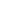

# SVD-NO: Learning PDE Solution Operators with SVD Integral Kernels

<!-- Page 1 -->

SVD-NO: Learning PDE Solution Operators with SVD Integral Kernels

Noam Koren1, Ralf J. J. Mackenbach2, Ruud J. G. van Sloun3, Kira Radinsky1, Daniel Freedman4

1Department of Computer Science, Technion – Israel Institute of Technology, Haifa, Israel 2Swiss Plasma Center, EPFL, Switzerland 3Department of Electrical Engineering, Eindhoven University of Technology, Eindhoven, The Netherlands 4Department of Applied Mathematics, Tel Aviv University, Tel Aviv, Israel noam.koren@campus.technion.ac.il, ralf.mackenbach@epfl.ch, r.j.g.v.sloun@tue.nl, kira@technion.ac.il, dfreedman@tauex.tau.ac.il

## Abstract

Neural operators have emerged as a promising paradigm for learning solution operators of partial differential equations (PDEs) directly from data. Existing methods, such as those based on Fourier or graph techniques, make strong assumptions about the structure of the kernel integral operator, assumptions which may limit expressivity. We present SVD-NO, a neural operator that explicitly parameterizes the kernel by its singular-value decomposition (SVD) and then carries out the integral directly in the low-rank basis. Two lightweight networks learn the left and right singular functions, a diagonal parameter matrix learns the singular values, and a Gram-matrix regularizer enforces orthonormality. As SVD-NO approximates the full kernel, it obtains a high degree of expressivity. Furthermore, due to its low-rank structure the computational complexity of applying the operator remains reasonable, leading to a practical system. In extensive evaluations on five diverse benchmark equations, SVD-NO achieves a new state of the art. In particular, SVD-NO provides greater performance gains on PDEs whose solutions are highly spatially variable.

Code — https://github.com/2noamk/SVDNO.git

## Introduction

Many problems in physics and engineering can be modeled by Partial Differential Equations (PDEs), which describe the evolution of complex systems across space and time. While classical numerical solvers, such as the finite element method (Reddy 1993), finite difference method (Morton and Mayers 2005), and finite volume method (Eymard, Gallou¨et, and Herbin 2000), are widely used, they often require fine spatial discretization and massive computational resources. For example, simulating turbulent plasma dynamics can demand millions of CPU hours (Tang and Lin 2017). These constraints have encouraged the rise of various techniques based on deep learning, from data-driven surrogates such as U-Net models (Gupta and Brandstetter 2022; Williams et al. 2023), to neural operators that learn the entire solution operator from data and now represent the state of the art.

Neural operators approximate functionals between infinite-dimensional function spaces. The functionals

Copyright © 2026, Association for the Advancement of Artificial Intelligence (www.aaai.org). All rights reserved.

map from some specification of the PDE, such as initial conditions, boundary conditions, or parameter fields, to the solution of the PDE. Neural operators can be broadly divided into four established families. DeepONet models (Lu, Jin, and Karniadakis 2019) break down the operator learning problem into one of learning two subnetworks, the branch which processes the input function and the trunk which processes the query point. Overall, DeepONets tend to be less effective than methods which parameterize the integral operator directly; the latter are represented by the following three families. Fourier-based operators (Li et al. 2020a) recast the kernel integral as a convolution evaluated in the frequency domain. This implies both stationarity of the operator as well as a lack of dependence of the operator on the input function; both of these implications limit the expressivity of the operator. Graph-based operators (Li et al. 2020b) employ message passing on both regular grids as well as irregular meshes, which enables them to accommodate complex geometries. As the message passing is local in nature, the underlying kernel integral operator must also be local. In practice, this means that such methods often oversmooth and struggle to capture long-range interactions without computational overhead. Physics-informed operators (Li et al. 2024b) take inspiration from Physics-Informed Neural Networks (Wang et al. 2023), by including a loss based on the residual of the PDE. Such a loss can often be useful, but does not directly address the expressivity of the underlying kernel integral operator. (For example, in (Li et al. 2024b) the method used was a Fourier Neural Operator.)

In this paper, we introduce the Singular Neural Operator (SVD-NO), a method that is derived from the underlying functional analysis of integral operators. SVD-NO begins with a full kernel integral operator, and then expresses it in a useful form via its singular value decomposition. By truncating this decomposition, SVD-NO is able to directly learn the operator. Specifically, it learns both the kernel’s left and right singular functions along with their singular values. The only approximation is the truncation, which imposes a low-rank structure. As a result, the operator retains a high degree of expressivity, as it may depend in complex ways on both the coordinates as well as the input function. Unlike Fourier-based methods, there are no stationarity assumptions; and unlike graph-based based methods, the ker-

The Fortieth AAAI Conference on Artificial Intelligence (AAAI-26)

525

<!-- Page 2 -->

nel is not assumed to be local. Finally, due to the structure of the SVD decomposition, the application of the integral operator to a given function is rendered efficient, allowing the method to be practical.

In summary, the contributions of this work are threefold: 1. Utilization of operator theory to motivate a new architecture for solving PDEs. We embed a learnable SVD decomposition of the Hilbert–Schmidt kernel within a neural operator. Although the mathematics of the singular value decomposition of integral kernels has classical roots, this is the first time it has been realized as an end-to-end trainable layer, yielding a low-rank parameterization grounded in functional analysis. 2. An expressive yet practical neural operator based on SVD. Other than assuming a low-rank structure, our method makes no other approximations or assumptions on the form of the integral kernel. The result is a high degree of expressivity: our architecture allows for a highly complex dependence on the input function, by modelling an approximation to the full kernel operator. This expressivity is considerably greater than competing methods such as Fourier- or graph-based techniques, which make strong assumptions on the form of the operator. Furthermore, due to the low-rank structure, the computational complexity of applying the operator remains reasonable, leading to a practical system. 3. State-of-the-art performance on diverse PDEs. The increased expressivity of SVD-NO leads to strong empirical results. We evaluate the proposed operator on five benchmark equations and show significant improvements over six leading neural operators.

## Related Work

## 2.1 Survey of Neural Operators

Neural operators learn mappings between infinitedimensional function spaces, from some specification of the PDE - such as initial conditions, boundary conditions, or parameter fields - to the solution of the PDE. Thus, they learn the solution operator of PDEs. Broadly, they can be grouped into four major categories, each characterized by how they approximate the underlying kernel integral operator: DeepONet-based, Fourier-based, Graph-based, and Physics-Informed.

DeepONet-Based Operators. DeepONet (Lu, Jin, and Karniadakis 2019) was among the first neural operator. It learns operator mappings directly from data without discretizing the kernel. It introduced a branch–trunk architecture: the branch network embeds sampled values of the input field, the trunk encodes the query point, and their inner product yields the solution. Follow-ups, e.g., F-DeepONet (Min et al. 2023), PI-DeepONet (Lin et al. 2023), and GraphDeep- ONet (Yixuan et al. 2022), add Fourier features, physicsinformed losses, or graph message passing, respectively. Despite these advances, DeepONet often struggles with highdimensional inputs due to its fully connected structure.

Fourier-Based Neural Operators. The Fourier Neural Operator (FNO) (Li et al. 2020a) treats the kernel as a convolution and evaluates it in the frequency domain via the

Fourier transform. This assumes that the solution operator is stationary. Several variants have been proposed: F- FNO (Tran et al. 2021) applies low-rank factorizations to the Fourier weight matrices to reduce computational complexity. WNO (Tripura and Chakraborty 2022a) replaces Fourier transforms with wavelets for better spatial localization. SFNO (Bonev et al. 2023) and Geo-FNO (Li et al. 2023) adapt FNO to spherical and irregular domains, respectively. U-NO (Rahman et al. 2023) integrates FNO into a U-Net encoder-decoder structure for multiscale modeling.

Graph-Based Neural Operators. For PDEs on unstructured domains, Graph Neural Networks (GNNs) (Zhou et al. 2020) are a natural representation. The Graph Neural Operator (GNO) (Li et al. 2020b) models functions over nodes and approximates the kernel by message passing on graph edges. While effective on irregular geometries, these methods often struggle capturing long-range dependencies and can suffer from oversmoothing and high computational cost. Several extensions were researched; LGN (Jain, Haghighat, and Nelaturi 2024) simulates 3D lattice structures. GINO (Li et al. 2024a) bridges GNO and FNO by projecting irregular grids to regular ones for FFT-based modeling. The Message- Passing Neural PDE Solver (MPNN) (Brandstetter and Johannes 2022) approximates the operator by passing messages along graph edges.

Physics-Informed Neural Operators. PINO methods incorporate the structure of the PDE directly into the loss function, enabling data-efficient learning guided by physical laws. For example, (Li et al. 2024c) adds physics-informed loss terms to guide the FNO training with PDE residuals. This approach is somewhat orthogonal, in that this loss may be used for any given neural operator architecture.

## 2.2 Relationship with SVD-NO

All approaches approximate the kernel operator indirectly, either by learning it functionally via neural networks (e.g., DeepONet, GNN-based operators, PINNs) or by performing spectral analysis using Fourier transforms under stationarity assumptions, with Fourier-based neural operators (e.g. FNO, U-NO) and physics-informed variants (e.g. PINO) currently leading in accuracy. Addressing this gap, SVD-NO explicitly learns the kernel and applies the operator by integrating the learned kernel against the input field, aligned with classical operator theory.

We benchmark SVD–NO against the six established models from the PDENNEval benchmark (Wei et al. 2024), a comprehensive evaluation suite for neural-network PDE solvers: DeepONet, FNO, U-NO, MPNN, PINO, and U-Net. Together, these models span the four operator-learning families discussed above, while U-Net serves as an ML baseline.

## 3 Neural Operator Background

Operator Learning. Let D ⊂Rdx be a bounded domain and consider two Hilbert spaces of functions A:= C

D; Rda and U:= C

D; Rdu

. An operator

G: A −→U

526

<!-- Page 3 -->

maps an input field a ∈A (e.g. coefficients, source terms, initial or boundary data) to a corresponding output field u = G(a) ∈U (e.g. the PDE solution). Learning G from a finite set of samples {(aj, uj)}N j=1 with uj = G(aj), where N is the number of samples, is the essence of operator learning (Li 2021) and forms the foundation of neural operators.

Neural Operator Architecture. A neural operator parameterizes an approximate operator Gθ: A →U through the composition

Gθ = Q ◦ γ (W T −1 + KT −1 θ)

◦· · ·

◦ γ (W 0 + K0 θ)

◦P (1)

where

• P: Rda →Rdv and Q: Rdv →Rdu are local fully connected networks that lift the input a(x) to a highdimensional latent field v0(x) = P a(x)

; and project the final latent representation back to the target space u(x) = Q(vT (x)), where vT is the last hidden layer. • Each hidden layer applies a pointwise linear map W t: Rdv →Rdv in parallel with a non-local integral operator Kt θ(a): U →U, followed by a non-linearity γ:

vt+1(x) = γ

W tvt(x) + [Kt θ(a) vt](x)

(2)

• The integral operator Kt θ(a) is defined by a kernel, κt θ:

Kt θ(a) v

(x) =

Z

D κt θ x, a(x), x′, a(x′)

v(x′) dx′

(3)

Training. Given training pairs {(aj, uj)}N j=1 we learn θ by minimising an empirical risk, minθ 1

N

PN j=1 L

Gθ(aj), uj

, where L is typically an L2 or relative-error loss.

## 4 The Singular Neural

Operator (SVD-NO) 4.1 SVD-NO Theory and Architecture Integral Layer Reformulation. Let D ⊂R be a bounded spatial domain and let a: D →Rda denote an input field, recall the generic integral layer

Kθ(a) v

(x) =

Z

D κθ x, a(x), x′, a(x′)

v(y) dy (Eq. 3),

Henceforward we will suppress θ. It is convenient to regard the pair (x, a(x)) as a single augmented coordinate z = (x, a(x)) ∈Z = D × A, (4) where A ⊂Rda is the range of the input function a(·). Using this notation the kernel becomes a mapping κ: Z × Z → Rd×d, and Eq. (3) reads

(Kvt)(z) =

Z

Z κ(z, z′) vt(z′) dµ(z′), z ∈Z, (5)

where µ is the push-forward of the Lebesgue measure on D under x 7→(x, a(x)).

SVD-NO retains this structure but constrains the kernel κθ through an explicit low-rank singular-value decomposition (SVD). Figure 1 provides an overview.

An SVD Parameterization: Scalar Case. Suppose that each of the vt functions are scalar-valued (i.e. choose d = 1), so that κ is also scalar-valued. If we choose the function κ so that it is square integrable, then the integral operator

(Kv)(z)

is Hilbert–Schmidt and therefore compact. Consequently there exist orthonormal systems {ϕℓ}ℓ∈N and {ψℓ}ℓ∈N in L2 µ(Z) together with singular values {σℓ}ℓ∈N ∈ℓ2 such that κ(z, z′) =

∞ X ℓ=1 σℓϕℓ(z) ψℓ(z′), ∀z, z′ ∈Z, (6)

with absolute convergence (Arcozzi 2025; Rudin 1991). A proof of this statement is given in the Appendix. In practice we retain only the leading L terms of (6), yielding the rank- L approximation κL(z, z′) = PL ℓ=1 σℓϕℓ(z)ψℓ(z′).

Update Equation. Inserting (6) into the evolution step of a Neural Operator gives

(Kv)(z) =

Z

Z

L X ℓ=1 σℓϕℓ(z)ψℓ(z′) v(z′) dµ(z′) (7)

which simplifies to vt+1(z) =

L X ℓ=1 σℓϕℓ(z)

Z

Z ψℓ(z′) vt(z′) dµ(z′). (8)

The ability to factor out the z part of the expression from the integral will have important implications for the computational complexity, as we will see in Section 4.2.

Extension to Vector-Valued Fields. We may improve the expressivity of the neural operator by allowing the vt functions to be vector-valued, i.e. vt: Z →Rd. There is a natural extension of the SVD decomposition for this scenario, which is as follows. We promote the kernel to κ: Z × Z →Rd×d and write κ(z, z′) = Φ(z) Σ Ψ(z′)⊤, where Φ(z), Ψ(z′) ∈Rd×L collect the d-component singular functions {ϕℓ(z)}L ℓ=1 and {ψℓ(z′)}L ℓ=1, and Σ = diag(σ1,..., σL) is a diagonal matrix containing the singular values. In this case, we have that

(Kv)(z) =

Z

Z

Φ(z) Σ Ψ(z′)⊤v(z′) d(z′)

which simplifies to

(Kv)(z) = Φ(z) Σ

Z

Z

Ψ(z′)⊤v(z′) d(z′)

This extension is quite natural. Although we have not proven its convergence as L →∞, a precisely analogous result for matrix-valued operators has been proven in the case of positive definite operators, which is effectively a matrix version of Mercer’s Theorem (De Vito, Umanit`a, and Villa 2013). (We also note a different setting for functional SVD has been treated in (Tan, Shi, and Zhang 2024).)

527

<!-- Page 4 -->

**Figure 1.** SVD-NO. The coefficient–coordinate tuple z = (a(x), x) is fed through two singular function nets, NNΦ and NNΨ, producing global basis functions Φ(z) and Ψ(z). An encoder P maps z to the initial latent state, v0, which is then processed by T SVD blocks to reach vT. Each block applies a kernel K(v) = Ψ(z) Σ

R

Φ(z′) v(z′) dz′ (with trainable diagonal Σ), adds a point-wise map Wv, followed by activation σ. A decoder Q maps the final latent state, vT, to the predicted solution u. Dashed arrows indicate loss paths: Gram matrices GΦ, GΨ drive the orthogonality penalty Lorth, with u supervising L2(y, u).

Discrete Form. With quadrature nodes {zj}n j=1 and weights {∆zj}, the integral operator is approximated by vt+1(zi) = Φ(zi) Σ n X j=1

Ψ(zj)⊤vt(zj) ∆z (9)

Direct Factor Parameterization. Rather than first estimating κ and then factorizing, we parameterize κ directly by its SVD factors. Specifically, we introduce two singular function nets

Φ(·; θϕ), Ψ(·; θψ): Z −→Rd×L, each realized by a lightweight neural network; and a diagonal matrix of singular values

Σ = diag(σ1,..., σL) ∈RL×L, whose entries {σℓ} are learnable parameters. The complete trainable set is therefore θ = (θϕ, θψ, Σ), optimised jointly via back-propagation.

Singular Function Nets (Φ, Ψ). Each singular function net is implemented with one of the following lightweight neural networks:

• MLP: This is effectively a neural field (Xie et al. 2022). It consists of linear layers with sine activations. • LSTM (1D only): LSTM layers (sigmoid gates, tanh outputs) with a linear projection. Effective at capturing longrange dependencies on 1D spatial grids, but not extensible to dx > 1 as there is no natural ordering of points.

Orthogonality. The true singular functions form an orthonormal system,

⟨ϕℓ, ϕk⟩= δℓk, ⟨ψℓ, ψk⟩= δℓk, where δℓk denotes the Kronecker delta. To push the learned singular functions toward the same structure we introduce an orthogonality penalty.

The Gram matrices of Φ(z) and Ψ(z) are:

GΦ =

Z

D

Φ(z)⊤Φ(z) dz, GΨ =

Z

D

Ψ(z)⊤Ψ(z) dz, with integrals approximated via the trapezoidal rule. Departures from perfect orthonormality are measured by the squared Frobenius distance to the identity:

Lortho =

GΦ −IL

2

F +

GΨ −IL

2

F, (10) where IL is the L×L identity matrix. Including Lortho in the total loss softly regularizes the columns of Φ and Ψ, nudging them toward an orthonormal basis.

## 4.2 Expressivity and Computational Complexity Improved

Expressivity vs. Competing Methods. As we have seen, SVD-NO models the integral kernel κ in such a way so as to allow full dependence on all arguments. That is, we retain the property that κ = κ(x, a(x), x′, a(x′)). There are two important aspects to highlight here: 1. Input Function Dependence: κ depends not only on the coordinates x and x′, but also on the input function through a(x) and a(x′). 2. Long-Range Effects: For a given x, κ can take non-zero values, indeed even very large values, for x′ which is far away from x. Let us contrast this situation with competing methods. In the case of Fourier-based methods, the kernel does not have input function dependence; the assumption is that it only depends on the coordinates, i.e. κ = κ(x, x′). Indeed the assumption is even stronger than that, in that it is only dependent on the difference between coordinates, κ = κ(x −x′). This limits the expressivity of the Fourier-based kernels.

In the case of graph-based methods, the underlying graph is taken to be local in nature: a grid point only interacts with nearby points. In other words, κ = κ(x, a(x), x′, a(x′)) but is only non-zero for x′ ∈N(x), i.e. in a small neighborhood around x. Thus, in the case of graph-based methods the kernel cannot directly model long-range effects; instead, these must come from the repeated application of many layers, which can in practice lead to oversmoothing. In Section 6, we see that this greater expressivity improves performance.

Time Complexity. The complexity is governed by the discrete update rule in Eq. (9) where n is the number of evaluation points zi ∈Z, d is the dimensionality of the vector field vt(z) ∈Rd, and L is the number of retained SVD modes.

528

AI-readable visual equivalent, added: Figure extracted from the paper PDF and converted to an SVG wrapper asset. Use the surrounding page text and caption for interpretation.

<!-- Page 5 -->

This update can be decomposed into two steps: (1) Compute rank-L representation:

q:= n X j=1

Ψ(zj)⊤vt(zj) ∆z ∈RL.

For each zj, evaluating Ψ(zj)⊤vt(zj) requires O(dL) operations. Summing over all n points costs O(ndL). (2) For each output point zi:

vt+1(zi) = Φ(zi) Σ q.

Multiplying Σ (diagonal matrix) with q costs O(L), and the matrix-vector product with Φ(zi) ∈Rd×L costs O(dL). Repeating this for all n points costs O(ndL).

Thus, the total complexity of one layer is O(ndL). This scales linearly with the number of points, output dimension, and SVD rank L. This is a major improvement over the cost of generic kernel integral operators, which is easily seen to be O(n2d2), as L ≪nd. (See the ablation in Section 6.2 for runtime comparisons.)

Memory Complexity. Each SVD-NO layer must store:

• The latent field v ∈Rn×d, costing O(nd) memory. • The singular function net activations Ψ, Φ ∈Rn×d×L costing O(ndL) memory; and Σ costing O(L).

Hence, the total peak memory footprint per layer is O(ndL), i.e. linear in the number of points n, feature dimension d, and SVD rank L. As in the case of time complexity, this improves substantially the O(n2d2) memory cost of generic kernel integral operators. (See Figure 3 for memory usage.)

Empirical Evaluation 5.1 Experimental Methodology Our experiments are designed to quantify how well SVD- NO generalizes across five diverse benchmark equations: Shallow-Water, Allen-Cahn, Diffusion-Reaction, Diffusion- Sorption, and Darcy-Flow. We compare our results with SOTA baselines. Performance is reported as the mean L2 relative error multiplied by 100:

L2 = 100 × 1 N

N X i=1

∥ui −ˆui∥2

∥ui∥2

(11)

where ∥·∥2 is the Euclidean norm. This metric expresses the error as a percentage of the ground-truth signal energy and is standard in operator-learning benchmarks (Tripura and Chakraborty 2022b).

## 5.2 Baseline Models

We evaluated SVD-NO against the six representative baselines evaluated in the PDENNEval benchmark (Wei et al. 2024), a comprehensive evaluation suite for neural network PDE solvers: DeepONet, FNO, U-NO, MPNN, PINO, and U-Net. These models cover all four neural-operator families reviewed in Section 2.1 and include an ML surrogate (U- Net).

## 5.3 Datasets

2D Shallow Water. Simulates fluid flow under gravity over variable topography: ∂th + ∂x(hu) + ∂y(hv) = 0 ∂t(hu) + ∂x u2h + 1

2grh2 + grh ∂xb = 0 ∂t(hv) + ∂y v2h + 1

2grh2 + grh ∂yb = 0 Input:

h(x, y, 0), b(x, y)

at 1282 points. Output: Solution h, u, v on the full 128 × 128 × 101 grid.

1D Allen-Cahn. Models phase separation: ∂tu−ϵ ∂xxu+5u3−5u = 0, ϵ = 10−4 on (−1, 1)×(0, 1]. Input: Initial conditions u(x, 0) ∈R256. Output: Full solution u(x, t) ∈R256×101.

1D Diffusion-Reaction. Models diffusion with logistictype reaction: ∂tu−0.5 ∂xxu−u(1−u) = 0 on (0, 1)×(0, 1] (periodic). Input: Initial conditions u(x, 0) ∈R256. Output: Full solution u(x, t) ∈R256×101.

1D Diffusion-Sorption. Models solute transport with nonlinear sorption: ∂tu − D R(u) ∂xxu = 0 on (0, 1) × (0, 1] Boundary conditions: u(0, t) = 1, ux(1, t) = D−1u(1, t) with D = 5 × 10−4 and Freundlich R(u). Input: Initial conditions u(x, 0) ∈R256. Output: Full solution u(x, t) ∈R256×201.

2D Darcy Flow. Models steady incompressible flow in porous media: −∇· (a∇u) = 1 on (0, 1)2 u|∂Ω= 0 Input: Permeability field a(x, y). Output: Solution u(x, y) ∈R128×128.

Together these five datasets cover elliptic (Darcy), reaction–diffusion (Diffusion–Reaction/Sorption, Allen–Cahn) and fluid-dynamics (Shallow Water) regimes, providing a broad test bed for neural operators.

## 5.4 Experimental Setup

The experiments were conducted on an NVIDIA L40 49GB GPU. Following the PDENNEval protocol (Wei et al. 2024), we trained for 500 epochs on each PDE benchmark (200 epochs for Shallow Water), and split the data into 10% test, 10% validation, and 80% training sets. Our training loss is: Ltotal = L2+Lorth, (Eqs. 11, 10), where L2 is the reconstruction error (without the 100 pre-factor) and Lorth enforces singular-function orthonormality. Moreover, all time-steps were learned jointly as in (Li et al. 2020a). Hyperparameter tuning was performed on the validation dataset. The ADAM optimizer was used, with an initial learning rate of 10−3.

Hyperparameter Tuning. The hyperparameters used are provided in Table 1. These include configurations for the SVD-NO model, such as the rank L of the singular functions, the lifting dimension (from z to v), the type of singular net used, number of singular net layers, and their hidden layer dimension. The activation function γ in the SVD-NO layer was Gelu, and the number of SVD-NO layers was 4.

529

<!-- Page 6 -->

Rank L Lifting Dimension z →v

Singular Net

Type

Number of Singular Net Layers

Hidden- Layer Dimension Shallow Water 4 512 MLP 3 64 Allen Cahn 8 128 LSTM 4 32 Diffusion Sorption 8 128 MLP 32 Diffusion Reaction 3 512 LSTM 3 128 Darcy Flow 9 128 MLP 2 128

**Table 1.** Hyperparameters for each dataset

SVD-NO DeepONet FNO U-NO MPNN PINO U-Net

Category Ours DeepONet Fourier Fourier Graph PINN, Fourier ML

Shallow Water 0.37 ± 0.042 1.11 ± 0.235 0.49 ± 0.022 0.52 ± 0.042 0.50 ± 0.031 0.46 ± 0.002 10.93 ± 0.706

Allen Cahn 0.06 ± 0.007 16.53 ± 0.230 0.08 ± 0.001 0.30 ± 0.013 0.33 ± 0.009 0.08 ± 0.001 68.93 ± 0.954

Diffusion Sorption 0.10 ± 0.002 0.11 ± 0.001 0.11 ± 0.001 0.11 ± 0.001 0.29 ± 0.007 0.11 ± 0.001 12.24 ± 0.002

Diffusion Reaction 0.33 ± 0.010 0.61 ± 0.001 0.39± 0.014 0.40 ± 0.001 0.39 ± 0.015 0.43 ± 0.014 6.70 ± 0.053

Darcy Flow 2.55 ± 0.030 4.91 ± 0.116 2.35 ± 0.023 2.02 ± 0.028 N/A 3.40 ± 0.071 50.20 ± 0.017

**Table 2.** Mean L2 relative error, expressed as a percent. Best results are in bold and second-best are underlined. The ± values denote 95% Confidence Intervals. All improvements are statistically significant at the 0.05 level (paired t-test, see Appendix). (N/A indicates a value not reported in the original paper.)

Baseline Hyperparameters. For all baselines, we used the hyperparameter settings provided in (Wei et al. 2024).

## Results

## 6.1 Main Results The experimental results, summarized in

Table 2, demonstrate the performance of SVD-NO compared to other SOTA methods across various PDE benchmarks. The Mean L2 Relative Error (%) was used as the performance metric. The model achieves SOTA performance and significant L2 reductions, with average improvement percentages of: 17.8% in Shallow-Water, 25.0% in Allen-Cahn, 9.1% in Diffusion- Sorption, and, 15.4% in Diffusion-Reaction. The improvement percentage was calculated by comparing the model to the best-performing baseline per PDE. In terms of the one remaining equation, Darcy Flow, SVD-NO places third.

In addition, SVD-No achieves L∞reductions, with improvement percentages up to 26.80%. The full L∞results can be found in the appendix.

Significance of Results. To assess robustness, each experiment was repeated ten times with different random seeds. For each setting we report the sample mean and its 95% confidence interval (CI). These statistics are presented in Table 2. Moreover, we conducted paired t-tests on datasets where SVD-NO performed best, yielding p-values well below 0.05. Full results are provided in the appendix.

Orthogonality. We assess the orthogonality of the learned basis functions. The values of Lortho range from 1.4 × 10−7 for Diffusion-Sorption to 3.4 × 10−5 for Darcy Flow. The training is thus quite effective at simultaneously orthogonalizing while learning to solve the PDEs.

Performance vs. Solution Spatial Variability. We hypothesize that SVD-NO will give greater performance gains when the solution is more challenging. While it is not straightforward to quantify how challenging a solution is, we may use a simple heuristic: how much spatial variation there is in the solution. In particular, if the solution is u(x) we may examine the following quantity:

β(h) =

R

(u(x + h) −u(x))2dx

Var(u)

where h ∈Rdx is an offset, and Var(u) is the variance of u. This quantity (which is related to the “Variogram” (Matheron 1963)) measures how similar the solution is when comparing any point x to a point that is h away from x, and is normalized by Var(u) to remove scaling effects. In our case, we will compute a single number by averaging over many possible offsets, β = 1 |H|

X h∈H β(h)

In practice, we take H = {1,..., 5}dx: we allow grid points which are up to 5 away in any spatial direction. Finally, if the PDE solution depends on time, then we will compute β for each time t, and then average over the results.

**Figure 2.** shows, for each PDE benchmark, the spatial variability of its solution as measured by β on the horizontal axis, vs. SVD-NO’s percent improvement over the best baseline on the vertical axis. The least-squares fit reveals a clear positive trend: PDEs whose solutions are characterized by higher spatial variability yield larger performance gains. In other words, our method delivers the greatest improvements on more spatially inhomogeneous problems, while on problems with smoother solutions the benefits are smaller. Thus, this trend serves to illustrate that the more expressive kernel provided by SVD-NO helps the most on problems with more challenging solutions.

Memory–Accuracy Trade-off. Figure 3 illustrates that increasing the SVD rank L steadily reduces the normalized

530

<!-- Page 7 -->

0 2 · 10−2 4 · 10−2 6 · 10−2 8 · 10−2 0.1

0

10

20

30

Darcy Flow

Reaction Diffusion

Reaction Sorption

Allen Cahn

Shallow Water

Solution Spatial Variability (β)

Improvement (%)

Percentage Improvement vs. Solution Spatial Variability

**Figure 2.** SVD-NO’s percentage improvement over the best baseline versus the solution’s spatial variability (β) for each PDE. Each point represents a dataset; the least-squares fit shows that more challenging problems (higher solution spatial variability) correlate with larger improvements.

test loss (left panel), at the cost of higher GPU memory usage (right panel). In particular, moving from L = 3 to L = 10 (well below the full data dimensionality) substantially improves accuracy, while peak memory requirements grow linearly (as expected from the O(n d L) memory complexity). This clear memory–accuracy trade-off allows practitioners to pick L based on their hardware budget. A similar linear trend in runtime, proportional to O(n d L), was also observed, but the plot is omitted for brevity. To enable overlaying curves from different datasets on the same scale, each dataset’s raw test losses and peak GPU memory were min–max normalized.

3 4 5 6 8 9 10 0

0.5

1

Number of singular functions L

Normalized test loss

Test Loss

3 4 5 6 8 9 10 0

0.5

1

Number of singular functions L

Normalized GPU memory

GPU Memory

Allen–Cahn Diffusion–Sorption Shallow Water

**Figure 3.** (Left) Min–max normalized test-loss curves and (Right) min–max normalized peak GPU memory usage vs. SVD rank L. Increasing L yields significant accuracy gains but also linearly higher memory, illustrating the practical trade-off between model fidelity and resource consumption.

## 6.2 Ablation Studies

To evaluate the impact of each design choice in SVD-NO, we conduct the following ablations, with results in Table 3.

Direct MLP Kernel To isolate the contribution of the lowrank SVD, we replace the factorized kernel with a fully connected network that learns a mapping directly, i.e.

˜κθ(z, z′) = MLP(z, z′).

Removing the rank-L constraint substantially degrades accuracy: the mean relative error rises by 3.02× across bench-

Ablation SVD-NO Direct MLP

Kernel Mercer No Lortho

Penalty Shallow Water 0.37 0.99 0.87 0.76 Allen Cahn 0.06 0.49 0.99 0.84 Diffusion Sorption 0.10 0.11 0.13 0.11 Diffusion Reaction 0.33 0.88 0.54 0.51

**Table 3.** Mean L2 relative error (%) for each dataset across ablations

marks. The dense formulation is also markedly slower, the average training time per epoch increases from 17.64s to 85.73s on Diffusion–Reaction, from 2.32s to 176.19s on Diffusion–Sorption, from 4.87s to 74.31s on Allen–Cahn, and from 22.36s to 374.75s on Shallow–Water. These results underscore the dual advantage of SVD-NO: it achieves higher accuracy while reducing the per-layer complexity from O(n2d2) for a generic dense kernel to O(ndL).

Mercer Theorem. To measure the benefit of the SVD, we swap it for Mercer’s Theorem (Ghojogh et al. 2021), valid for continuous, symmetric, positive-definite kernels. We write κ(z, z′) = P∞ ℓ=1 λℓϕℓ(z) ϕℓ(z′), with λℓ≥0, and keep only the first L terms. The truncated eigenpairs {λℓ, ϕℓ}L ℓ=1 are learned end-to-end, giving an update analogous to Eq (8). For vector-valued fields, we use the block form κ(z, z′) = Φ(z) Λ Φ(z′)⊤with Λ = diag(λ1,..., λL) as in (De Vito, Umanit`a, and Villa 2013).

Replacing SVD with the Mercer expansion degrades performance, increasing the mean error by 3.32× across datasets. This drop is expected: the Mercer theorem applies only to symmetric, positive-definite kernels, whereas the SVD factorisation holds for any Hilbert–Schmidt kernel operator, making SVD-NO applicable in a broader range.

No Orthogonality Penalty. We assess the impact of the orthogonality regulariser by training SVD-NO using only the L2 reconstruction loss, i.e. setting Lortho =0. Eliminating the Gram–matrix penalty markedly degrades performance: the mean relative error rises by 2.97× across benchmarks. Without the orthogonality constraint the learned set of singular functions Φ and Ψ drift away from an (approximate) orthonormal basis, so the factorisation no longer behaves as an SVD, reducing predictive accuracy.

Conclusions

SVD-NO is a new neural operator framework which allow for the learning of highly expressive kernels, bridging Hilbert–Schmidt theory and deep learning. By learning the kernel’s left and right singular functions and singular values end-to-end, SVD-NO provides a low-rank factorization that applies to any square-integrable kernel and scales linearly with the spatial resolution. A Gram-matrix orthogonality penalty preserves the SVD structure during training. Comprehensive experiments on five diverse PDEs demonstrate that SVD-NO sets a new state of the art reducing the mean L2 error of the best competing models by up to 25%. Ablation studies further verify the importance of the SVD parameterization and the orthogonality regularizer.

531

<!-- Page 8 -->

## References

Arcozzi, N. 2025. Functional Analysis and Operator Theory. arXiv preprint arXiv:2505.05526. Bonev, B.; Kurth, T.; Hundt, C.; Pathak, J.; Baust, M.; Kashinath, K.; and Anandkumar, A. 2023. Spherical fourier neural operators: Learning stable dynamics on the sphere. In International conference on machine learning, 2806–2823. PMLR. Brandstetter; and Johannes, D. W. M. W. 2022. Message passing neural PDE solvers. ICLR. De Vito, E.; Umanit`a, V.; and Villa, S. 2013. An extension of Mercer theorem to matrix-valued measurable kernels. Applied and Computational Harmonic Analysis, 34(3): 339– 351. Eymard, R.; Gallou¨et, T.; and Herbin, R. 2000. Finite volume methods. Handbook of numerical analysis, 7: 713– 1018. Ghojogh, B.; Ghodsi, A.; Karray, F.; and Crowley, M. 2021. Reproducing Kernel Hilbert Space, Mercer’s Theorem, Eigenfunctions, Nystr\” om Method, and Use of Kernels in Machine Learning: Tutorial and Survey. arXiv preprint arXiv:2106.08443. Gupta, J. K.; and Brandstetter, J. 2022. Towards multispatiotemporal-scale generalized pde modeling. arXiv preprint arXiv:2209.15616. Jain, A.; Haghighat, E.; and Nelaturi, S. 2024. LatticeGraph- Net: A two-scale graph neural operator for simulating lattice structures. Engineering with Computers, 1–16. Li, Z. 2021. Neural operator: Learning maps between function spaces. In 2021 Fall Western Sectional Meeting. AMS. Li, Z.; Huang, D. Z.; Liu, B.; and Anandkumar, A. 2023. Fourier neural operator with learned deformations for pdes on general geometries. Journal of Machine Learning Research, 24(388): 1–26. Li, Z.; Kovachki, N.; Azizzadenesheli, K.; Liu, B.; Bhattacharya, K.; Stuart, A.; and Anandkumar, A. 2020a. Fourier neural operator for parametric partial differential equations. arXiv preprint arXiv:2010.08895. Li, Z.; Kovachki, N.; Azizzadenesheli, K.; Liu, B.; Bhattacharya, K.; Stuart, A.; and Anandkumar, A. 2020b. Neural operator: Graph kernel network for partial differential equations. arXiv preprint arXiv:2003.03485. Li, Z.; Kovachki, N.; Choy, C.; Li, B.; Kossaifi, J.; Otta, S.; Nabian, M. A.; Stadler, M.; Hundt, C.; Azizzadenesheli, K.; et al. 2024a. Geometry-informed neural operator for largescale 3d pdes. Advances in Neural Information Processing Systems, 36. Li, Z.; Zheng, H.; Kovachki, N.; Jin, D.; Chen, H.; Liu, B.; Azizzadenesheli, K.; and Anandkumar, A. 2024b. Physicsinformed neural operator for learning partial differential equations. ACM/JMS Journal of Data Science, 1(3): 1–27. Li, Z.; Zheng, H.; Kovachki, N.; Jin, D.; Chen, H.; Liu, B.; Azizzadenesheli, K.; and Anandkumar, A. 2024c. Physicsinformed neural operator for learning partial differential equations. ACM/JMS Journal of Data Science, 1(3): 1–27.

Lin, B.; Mao, Z.; Wang, Z.; and Karniadakis, G. E. 2023. Operator Learning Enhanced Physics-informed Neural Networks for Solving Partial Differential Equations Characterized by Sharp Solutions. arXiv preprint arXiv:2310.19590. Lu, L.; Jin, P.; and Karniadakis, G. E. 2019. Deeponet: Learning nonlinear operators for identifying differential equations based on the universal approximation theorem of operators. arXiv preprint arXiv:1910.03193. Matheron, G. 1963. Principles of Geostatistics. Economic Geology. Min, Z.; Shihang, F.; Youzuo, L.; and Lu, L. 2023. Fourier- DeepONet: Fourier-enhanced deep operator networks for full waveform inversion with improved accuracy, generalizability, and robustness. Computer Methods in Applied Mechanics and Engineering 416. Morton, K. W.; and Mayers, D. F. 2005. Numerical solution of partial differential equations: an introduction. Cambridge university press. Rahman; Md, A.; Zachary, R.; and Kamyar, A. 2023. U-no: U-shaped neural operators. arXiv preprint arXiv:2204.11127. Reddy, J. 1993. An Introduction to the Finite Element Method. Rudin, W. 1991. Functional analysis 2nd ed. International Series in Pure and Applied Mathematics. McGraw- Hill, Inc., New York. Tan, J.; Shi, P.; and Zhang, A. R. 2024. Functional Singular Value Decomposition. arXiv preprint arXiv:2410.03619. Tang, W.; and Lin, Z. 2017. Global Gyrokinetic Particle-in- Cell Simulation. In Exascale Scientific Applications, 507– 528. Chapman and Hall/CRC. Tran, A.; Mathews, A.; Xie, L.; and Ong, C. S. 2021. Factorized fourier neural operators. arXiv preprint arXiv:2111.13802. Tripura, T.; and Chakraborty, S. 2022a. Wavelet neural operator: a neural operator for parametric partial differential equations. arXiv preprint arXiv:2205.02191. Tripura, T.; and Chakraborty, S. 2022b. Wavelet neural operator: a neural operator for parametric partial differential equations. arXiv preprint arXiv:2205.02191. Wang, S.; Sankaran, S.; Wang, H.; and Perdikaris, P. 2023. An expert’s guide to training physics-informed neural networks. arXiv preprint arXiv:2308.08468. Wei, P.; Liu, M.; Cen, J.; Zhou, Z.; Chen, L.; and Zou, Q. 2024. PDENNEval: A Comprehensive Evaluation of Neural Network Methods for Solving PDEs. Thirty-Third International Joint Conference on Artificial Intelligence. Williams, C.; Falck, F.; Deligiannidis, G.; Holmes, C. C.; Doucet, A.; and Syed, S. 2023. A unified framework for U- Net design and analysis. Advances in Neural Information Processing Systems, 36: 27745–27782. Xie, Y.; Takikawa, T.; Saito, S.; Litany, O.; Yan, S.; Khan, N.; Tombari, F.; Tompkin, J.; Sitzmann, V.; and Sridhar, S. 2022. Neural fields in visual computing and beyond. In Computer graphics forum, volume 41, 641–676. Wiley Online Library.

532

<!-- Page 9 -->

Yixuan, S.; Christian, M.; Guang, L.; and Meng, Y. 2022. DeepGraphONet: A Deep Graph Operator Network to Learn and Zero-shot Transfer the Dynamic Response of Networked Systems. IEEE Systems Journal 17.3. Zhou, J.; Cui, G.; Hu, S.; Zhang, Z.; Yang, C.; Liu, Z.; Wang, L.; Li, C.; and Sun, M. 2020. Graph neural networks: A review of methods and applications. AI open, 1: 57–81.

533
