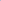

# SynerDetect: Hierarchical Synergistic Learning for Generalizable AI-Generated Image Detection

<!-- Page 1 -->

SynerDetect: Hierarchical Synergistic Learning for Generalizable AI-Generated

Image Detection

Shuaibo Li1, Yijun Yang1, Zhaohu Xing1, Hongqiu Wang1, Pengfei Hao1,

Xingyu Li1, Zekai Liu1, Qing Zhang3, Lei Zhu1,2*

1The Hong Kong University of Science and Technology (Guangzhou) 2The Hong Kong University of Science and Technology 3Sun Yat-sen University sli270@connect.hkust-gz.edu.cn, leizhu@ust.hk

## Abstract

The rapid advancement of generative models, which produce increasingly realistic synthetic images, urgently demands robust and generalizable detection methods. Consequently, research has largely pivoted to leveraging large-scale Vision Foundation Models (VFMs) for enhanced generalization. However, existing VFM-based approaches primarily adhere to either perceptual or generative paradigms, each with limitations: perceptual models capture high-level semantics but often miss subtle artifacts, whereas generative models emphasize fine-grained flaws yet overlook semantic inconsistency. To resolve this inherent trade-off, we introduce SynerDetect, a novel hierarchical synergistic framework that fundamentally unifies the two paradigms. SynerDetect achieves deep integration of heterogeneous forensic representations through two levels of synergy: Cross-Model Interactive Distillation (CMID) distills generative forensic signals into perceptual encoders via prompt-guided reconstruction; and Optimal Transport-Guided Discriminative Contrastive Learning (OT-DCL) structurally aligns and integrates these heterogeneous representations, consolidating them into a robust, unified detection space. SynerDetect achieves superior performance on standard benchmarks (AIGCDetectBenchmark and GenImage) and attains a notable 5.20% accuracy gain on the challenging Chameleon benchmark, whose synthetic images consistently pass the Visual Turing Test. These results unequivocally validate the robust, real-world generalization of our unified cross-paradigm framework.

## Introduction

Recent advances (Karras et al. 2018; Brock, Donahue, and Simonyan 2019; Dhariwal and Nichol 2021; Nichol et al. 2022) in AI-generated content have dramatically improved the realism and diversity of synthetic images. While this progress unlocks broad creative benefits, it simultaneously elevates the risks of sophisticated forgeries and misinformation that threaten public trust and information integrity (Tan et al. 2024b; Ojha, Li, and Lee 2023). As generative techniques continue to mature (Bie et al. 2024), the associated generation artifacts become increasingly subtle and diverse, substantially heightening both the challenge and imperative of reliable detection. However, despite strong results on

*Corresponding author. Copyright © 2026, Association for the Advancement of Artificial Intelligence (www.aaai.org). All rights reserved.

Generativebased Space

Perceptualbased Space

Latent Noise

Encoder

Recon.

Unified

Space

Real Fake (a) Generative-based Framework

(b) Perceptual-based Framework

(c) SynerDetect: Unified Framework

Real Fake prompt prompt

(d) Detection Performance semantic embedding low-level representation input input input

Real Fake

Semantic Discrimination Ability

Low-Level Artifact Sensitivity

Generative

Models

Perceptual

Models

SynerDetct

(Unified)

SynerDetect (Unified) UnivFD (Perceptual) DIRE (Generative)

Reconstruction (Generative VFM)

Visual Encoder (Perceptual VFM)

Generative

Inverter

Generative

Denoiser

Perceptual Visual Encoder

**Figure 1.** Comparison of detection frameworks. Our method unifies (a) generative and (b) perceptual paradigms through (c) a hierarchical design featuring Cross-Model Interactive Distillation (CMID) and Optimal Transport-Guided Discriminative Contrastive Learning (OT-DCL), achieving (d) superior performance against single-paradigm methods (Ojha, Li, and Lee 2023; Wang et al. 2023).

curated benchmarks such as GenImage (Zhu et al. 2023), existing detectors struggle to generalize to complex realworld scenarios (Li et al. 2025a). This limitation is particularly evident on challenging datasets like Chameleon (Yan et al. 2024a), where high-fidelity synthetic images can pass the Visual Turing Test. The consistent degradation observed across state-of-the-art models suggests that achieving robust, real-world forgery detection remains difficult (Zhang et al. 2025).

Early forgery detectors relied on fixed artifacts such as frequency statistics (Frank et al. 2020) or local pixel patterns (Tan et al. 2024b; Li et al. 2021), but these cues tend to vanish quickly as generative models improve. Recent progress shifts toward leveraging large-scale pretrained Vision Foundation Models (VFMs) for enhanced generalization. Existing VFM-based methods predominantly follow two complementary paradigms (Figure 1): perceptual VFMs (e.g., CLIP (Radford et al. 2021)), which emphasize

The Fortieth AAAI Conference on Artificial Intelligence (AAAI-26)

AI-readable visual equivalent, added: Figure extracted from the paper PDF and converted to an SVG wrapper asset. Use the surrounding page text and caption for interpretation.

AI-readable visual equivalent, added: Figure extracted from the paper PDF and converted to an SVG wrapper asset. Use the surrounding page text and caption for interpretation.

AI-readable visual equivalent, added: Figure extracted from the paper PDF and converted to an SVG wrapper asset. Use the surrounding page text and caption for interpretation.

AI-readable visual equivalent, added: Figure extracted from the paper PDF and converted to an SVG wrapper asset. Use the surrounding page text and caption for interpretation.

AI-readable visual equivalent, added: Figure extracted from the paper PDF and converted to an SVG wrapper asset. Use the surrounding page text and caption for interpretation.

AI-readable visual equivalent, added: Figure extracted from the paper PDF and converted to an SVG wrapper asset. Use the surrounding page text and caption for interpretation.

AI-readable visual equivalent, added: Figure extracted from the paper PDF and converted to an SVG wrapper asset. Use the surrounding page text and caption for interpretation.

AI-readable visual equivalent, added: Figure extracted from the paper PDF and converted to an SVG wrapper asset. Use the surrounding page text and caption for interpretation.

AI-readable visual equivalent, added: Figure extracted from the paper PDF and converted to an SVG wrapper asset. Use the surrounding page text and caption for interpretation.

AI-readable visual equivalent, added: Figure extracted from the paper PDF and converted to an SVG wrapper asset. Use the surrounding page text and caption for interpretation.

AI-readable visual equivalent, added: Figure extracted from the paper PDF and converted to an SVG wrapper asset. Use the surrounding page text and caption for interpretation.

AI-readable visual equivalent, added: Figure extracted from the paper PDF and converted to an SVG wrapper asset. Use the surrounding page text and caption for interpretation.

AI-readable visual equivalent, added: Figure extracted from the paper PDF and converted to an SVG wrapper asset. Use the surrounding page text and caption for interpretation.

AI-readable visual equivalent, added: Figure extracted from the paper PDF and converted to an SVG wrapper asset. Use the surrounding page text and caption for interpretation.

AI-readable visual equivalent, added: Figure extracted from the paper PDF and converted to an SVG wrapper asset. Use the surrounding page text and caption for interpretation.

<!-- Page 2 -->

high-level semantic inconsistencies, and generative VFMs (e.g., diffusion models (Rombach et al. 2022)), which amplify fine-grained clues through image reconstruction. Perceptual VFM-based detectors such as UniFD (Ojha, Li, and Lee 2023) construct discriminative spaces from highlevel embeddings and may overlook low-level traces. Conversely, generative VFM-based methods like DIRE (Wang et al. 2023) recover imperceptible anomalies but offer limited semantic reasoning. Recent work LaRE2 (Luo et al. 2024) shows that generative reconstruction cues can be integrated into perceptual representations to improve robustness. Meanwhile, perceptual and generative paradigms exhibit structural and statistical differences (Liu et al. 2025), which can offer complementary perspectives for forensic reasoning. However, leveraging this complementarity in practice is difficult, as the two paradigms operate in heterogeneous representational spaces. The shallow fusion strategies struggle to reconcile this gap, preventing the deeper interaction needed for robust forensic discrimination. This raises a critical question: How can we bridge the heterogeneity between these two paradigms to build a unified discriminative space that leverages their strengths without causing interference?

To address the limitations of single-paradigm detectors, SynerDetect introduces a hierarchical synergy paradigm that unifies perceptual and generative foundation model knowledge within a single forgery-aware discriminative manifold. At the core of SynerDetect is a two-level synergy mechanism grounded in the dual operational modes of diffusionbased generative models, forward denoising and backward inversion. The forward process reconstructs images from noisy inputs, exposing fine-grained artifacts that perceptual models such as CLIP often fail to capture. We exploit this property through a self-supervised reconstruction task, which implicitly guides the perceptual encoder toward learning artifact-sensitive representations. Conversely, the backward inversion reveals generative process-specific traces as latent noise maps, uncovering cues that are not directly observable at the pixel level. Together, these two directions provide the basis for deep cross-paradigm knowledge transfer. Building on this foundation, SynerDetect incorporates two key components: (1) Cross-Model Interactive Distillation (CMID), which enables perceptual encoders to internalize fine-grained generative cues via prompt-conditioned reconstruction; and (2) Optimal Transport-Guided Discriminative Contrastive Learning (OT-DCL), which structurally aligns the heterogeneous visual and latent noise embeddings through prototype-based optimal transport and contrastive objectives.

As shown in Figure 2, SynerDetect comprises four tightly integrated components, each specifically designed to resolve modality heterogeneity. First, a discriminative prompt generation module injects semantic priors by producing visually grounded prompts that consistently condition downstream components. Second, CMID establishes deep interaction between perceptual and generative cues, using joint visualprompt embeddings to guide reconstruction and enhance the perceptual encoder’s sensitivity to subtle forensic artifacts. Third, a discriminative conditional inversion module lever- ages prompt-guided inversion to extract latent noise maps, exposing generation-specific anomalies beyond pixel space. Finally, OT-DCL integrates these distinct evidence streams through a two-stage strategy: prototype-based optimal transport minimizes cross-modality distributional gaps, and contrastive learning enforces semantically consistent alignment. These objectives are jointly optimized with the CMID loss in an end-to-end learning scheme. This holistic design allows SynerDetect to integrate both semantic-level cues and low-level forensic artifacts within a unified discriminative space, resulting in strong generalization across diverse and challenging distributional shifts.

Our main contributions are summarized as follows:

• We present SynerDetect, a new paradigm for synthetic image detection that hierarchically synergizes perceptual and generative foundation models. This architecture enables comprehensive and cross-paradigm forensic reasoning within a unified discriminative space. • To realize this paradigm, we develop two key innovations: Cross-Model Interactive Distillation (CMID), which distills generative forensic knowledge into perceptual encoders through prompt-guided reconstruction; and Optimal Transport-Guided Discriminative Contrastive Learning (OT-DCL), which structurally aligns heterogeneous forensic signals to enable robust information integration and reliable decision making. • Extensive experiments across diverse benchmarks, including the challenging real-world Chameleon dataset featuring high-fidelity synthetic forgeries, demonstrate the strong robustness and generalization capabilities of SynerDetect over state-of-the-art methods.

## Related Work

Generalizable AI-Generated Image Detection Research on AI-generated image detection has rapidly evolved as generative models continue to advance in realism and diversity (Yan et al. 2024b). Early detectors targeted model-specific artifacts such as local frequency statistics (Frank et al. 2020) and GAN fingerprints (Yu, Davis, and Fritz 2019), yet these designs often struggle to transfer to unseen generators. Recent works have achieved notable progress by leveraging large-scale pretrained Vision Foundation Models (VFMs) to enhance robustness and generalization. UniFD (Ojha, Li, and Lee 2023) first used CLIP as a perceptual backbone for detection, followed by RINE (Koutlis and Papadopoulos 2024) and FatFormer (Liu et al. 2024), which refine CLIP using intermediate features or forgeryaware adapters. These models offer strong semantic-level discrimination, though their sensitivity to subtle low-level artifacts can be limited (Tong et al. 2024). In parallel, generative VFMs have been exploited in methods such as DIRE (Wang et al. 2023) and FakeInversion (Cazenavette et al. 2024), which utilize reconstruction-based frameworks to reveal fine-grained forgeries; such approaches emphasize low-level artifacts but may under-represent high-level inconsistencies. Recent work LaRE2 (Luo et al. 2024) shows that generative reconstruction signals can be incorporated

<!-- Page 3 -->

Perceptual Visual Encoder ℰ𝑣𝑣

Latent Noise

Encoder ℰ𝑑𝑑

Conditional Reconstruction

Visual-aware Tuner

Text Encoder ℰ𝑡𝑡 latent noise map

Conditional

Control

[CLASS]

[Real/Fake]

…

Feedback

Enhance

(enhanced) visual embedding z𝑣𝑣

Generative Denoiser 𝒢𝒢𝑑𝑑

Input image 𝑥𝑥

…

Generative Inverter 𝒢𝒢𝑖𝑖 prompt embedding z𝑡𝑡 (anchor)

visual embedding z𝑣𝑣 latent noise embedding z𝑛𝑛 fake sample real sample

Pull Push

Projection

Projection

Projection context tokens instant-conditional tokens

Sample Space

Prototype Space

Cost Matrix

Transportation

Matrix

(a.2) Optimal Transport

Discriminative Conditional Inversion

(a) Prototype-based Optimal Transport (POT)

input class embedding

Add Noise

Latent noise embedding z𝑛𝑛 prompt embedding z𝑡𝑡 discriminative prompt embedding z𝑡𝑡

(a.1) Prototype Construction

ℒPOT

ℒDCL

ℒCR

Trainable Frozen Discriminative Prompt Generation

(b) Discriminative Contrastive Learning (DCL)

prompt embedding z𝑡𝑡̂ 𝑝𝑝𝑐𝑐 𝑝𝑝𝑐𝑐

Real Fake

ො𝑥𝑥

POT

**Figure 2.** Overview of the SynerDetect framework. Our method hierarchically unifies perceptual and generative paradigms for robust AI-generated image detection. Level-1 synergy (CMID) enhances perceptual encoders via prompt-guided generative reconstruction. Level-2 synergy (OT-DCL) structurally aligns visual and latent noise embeddings using optimal transport and contrastive learning, forming a unified discriminative space sensitive to both semantic and fine-grained artifacts.

into perceptual representations to improve robustness, underscoring the complementarity between the two sources of forensic cues. Building on the broader observation that generative and perceptual priors are complementary, we pursue a distinct objective: constructing a hierarchical synergy framework that deeply aligns perceptual and generative VFMs within a unified discriminative space, enabling feature- and distribution-level mutual reinforcement for stronger cross-model generalization.

Knowledge and Representation Fusion A number of fusion methods have been proposed to integrate multi-source representations across modalities or views (Li et al. 2025c,b; Gao et al. 2017). Transformer-based approaches (Tsai et al. 2019; Yang et al. 2022; Li et al. 2024) employ cross-attention mechanisms to dynamically combine complementary information, while Uni-Code (Xia et al. 2023) aligns semantically coherent cross-modal concepts within a shared embedding space. Methods such as (Hudson et al. 2024; Wang et al. 2024a,b; Prabhudesai et al. 2023) utilize self-supervised reconstruction to inject generative pri- ors into visual embeddings. Although these techniques offer valuable insights into representation fusion, they are primarily designed for general multimodal learning and therefore fall short of the specific demands of forgery detection, which demands a unified representation capable of capturing multi-scale forensic evidence, from global semantic inconsistencies to local subtle irregularities. Consequently, directly applying these fusion techniques to forgery detection tends to overlook the complementary nature of perceptual and generative forensic cues. This gap highlights the need for a more principled integration mechanism capable of reconciling heterogeneous evidence sources within a unified discriminative space, a direction we pursue in this work.

## Methodology

We introduce SynerDetect, a hierarchical synergistic learning framework for generalizable AI-generated image detection. To integrate the heterogeneous forensic knowledge between perceptual and generative paradigms into a unified discriminative space, SynerDetect features two synergy lev-

AI-readable visual equivalent, added: Figure extracted from the paper PDF and converted to an SVG wrapper asset. Use the surrounding page text and caption for interpretation.

AI-readable visual equivalent, added: Figure extracted from the paper PDF and converted to an SVG wrapper asset. Use the surrounding page text and caption for interpretation.

AI-readable visual equivalent, added: Figure extracted from the paper PDF and converted to an SVG wrapper asset. Use the surrounding page text and caption for interpretation.

AI-readable visual equivalent, added: Figure extracted from the paper PDF and converted to an SVG wrapper asset. Use the surrounding page text and caption for interpretation.

AI-readable visual equivalent, added: Figure extracted from the paper PDF and converted to an SVG wrapper asset. Use the surrounding page text and caption for interpretation.

AI-readable visual equivalent, added: Figure extracted from the paper PDF and converted to an SVG wrapper asset. Use the surrounding page text and caption for interpretation.

AI-readable visual equivalent, added: Figure extracted from the paper PDF and converted to an SVG wrapper asset. Use the surrounding page text and caption for interpretation.

AI-readable visual equivalent, added: Figure extracted from the paper PDF and converted to an SVG wrapper asset. Use the surrounding page text and caption for interpretation.

AI-readable visual equivalent, added: Figure extracted from the paper PDF and converted to an SVG wrapper asset. Use the surrounding page text and caption for interpretation.

AI-readable visual equivalent, added: Figure extracted from the paper PDF and converted to an SVG wrapper asset. Use the surrounding page text and caption for interpretation.

AI-readable visual equivalent, added: Figure extracted from the paper PDF and converted to an SVG wrapper asset. Use the surrounding page text and caption for interpretation.

AI-readable visual equivalent, added: Figure extracted from the paper PDF and converted to an SVG wrapper asset. Use the surrounding page text and caption for interpretation.

AI-readable visual equivalent, added: Figure extracted from the paper PDF and converted to an SVG wrapper asset. Use the surrounding page text and caption for interpretation.

AI-readable visual equivalent, added: Figure extracted from the paper PDF and converted to an SVG wrapper asset. Use the surrounding page text and caption for interpretation.

AI-readable visual equivalent, added: Figure extracted from the paper PDF and converted to an SVG wrapper asset. Use the surrounding page text and caption for interpretation.

AI-readable visual equivalent, added: Figure extracted from the paper PDF and converted to an SVG wrapper asset. Use the surrounding page text and caption for interpretation.

AI-readable visual equivalent, added: Figure extracted from the paper PDF and converted to an SVG wrapper asset. Use the surrounding page text and caption for interpretation.

AI-readable visual equivalent, added: Figure extracted from the paper PDF and converted to an SVG wrapper asset. Use the surrounding page text and caption for interpretation.

AI-readable visual equivalent, added: Figure extracted from the paper PDF and converted to an SVG wrapper asset. Use the surrounding page text and caption for interpretation.

AI-readable visual equivalent, added: Figure extracted from the paper PDF and converted to an SVG wrapper asset. Use the surrounding page text and caption for interpretation.

AI-readable visual equivalent, added: Figure extracted from the paper PDF and converted to an SVG wrapper asset. Use the surrounding page text and caption for interpretation.

AI-readable visual equivalent, added: Figure extracted from the paper PDF and converted to an SVG wrapper asset. Use the surrounding page text and caption for interpretation.

AI-readable visual equivalent, added: Figure extracted from the paper PDF and converted to an SVG wrapper asset. Use the surrounding page text and caption for interpretation.

AI-readable visual equivalent, added: Figure extracted from the paper PDF and converted to an SVG wrapper asset. Use the surrounding page text and caption for interpretation.

AI-readable visual equivalent, added: Figure extracted from the paper PDF and converted to an SVG wrapper asset. Use the surrounding page text and caption for interpretation.

AI-readable visual equivalent, added: Figure extracted from the paper PDF and converted to an SVG wrapper asset. Use the surrounding page text and caption for interpretation.

<!-- Page 4 -->

els: Cross-Model Interactive Distillation (CMID) and Optimal Transport-Guided Discriminative Contrastive Learning (OT-DCL). In addition, a Discriminative Prompt Generation module produces authenticity-aware text prompts, and a Discriminative Conditional Inversion module extracts latent noise features. The overall architecture is shown in Figure 2.

Discriminative Prompt Generation To supervise forgery detection and guide cross-paradigm synergy, we first construct soft prompt embeddings that integrate global semantics with local cues. Given an input image x, the CLIP visual encoder extracts a visual embedding zv. A Visual-aware Tuner refines the learnable context tokens pc using both global visual embedding zv and local artifact-sensitive CConv(x) obtained via constrained convolution (Bayar and Stamm 2018). Formally,

ˆpc = pc + Attn(LN(pc), LN(zv), LN(CConv(x))), (1)

where LN(·) denotes Layer Normalization (Ba, Kiros, and Hinton 2016), and Attn(·) is multi-head attention. The enhanced context ˆpc is concatenated with class tokens ([Real]/[Fake]) and fed into the CLIP text encoder Et to obtain the final prompt embedding zt.

Cross-Model Interactive Distillation (CMID) CMID establishes the first synergy level, transferring finegrained forensic knowledge from a frozen diffusion model into the perceptual encoder. Inspired by (Prabhudesai et al. 2023; Wang et al. 2024a), we construct a self-supervised conditional reconstruction task using a frozen diffusion model Gd, conditioned jointly on visual and prompt embeddings. For each image x, we combine zv and zt to form the conditioning signal c = zv + zt. A noisy version of x is passed to Gd, which predicts the noise added during the forward diffusion process. The reconstruction loss is:

LCR = Et,x,ϵ,c[||ϵ −Gd(√αtx +

√

1 −αtϵ, t, c)||2], (2)

where t is the diffusion timestep, αt is the noise schedule, and ϵ is sampled noise. Training updates only the perceptual encoder Ev, which learns fine-grained forensic cues through generative feedback while the diffusion model stays frozen.

Discriminative Conditional Inversion While CMID enhances visual embeddings via forward denoising, it cannot capture latent generative traces intrinsic to the synthesis process. Prior works (Zhang and Xu 2023; Cazenavette et al. 2024) show that backward DDIM inversion (Song, Meng, and Ermon 2020) exposes characteristic forensic signals reflecting generation dynamics and underlying likelihood distribution. To leverage this complementary perspective, we introduce Discriminative Conditional Inversion. A frozen generative inverter Gi conditioned on the prompt embedding zt performs DDIM inversion to yield a latent noise map: ˆx = Gi(x, zt). A trainable encoder Ed then extracts the latent noise embedding: zn = Ed(ˆx). Unlike prior methods (Zhang and Xu 2023; Cazenavette et al. 2024) that directly use these latent features for classification, we treat zn as an independent forensic modality that complements the perceptual embedding zv. The resulting pair

(zv, zn) provides two paradigm-distinct and mutually reinforcing forensic views, whose joint modeling serves as the foundation for the second synergy level, OT-DCL.

Optimal Transport-Guided Discriminative Contrastive Learning (OT-DCL) With the prompt embedding (zt) encoding authenticity semantics, the enhanced visual embedding (zv) capturing fine-grained artifacts via forward denoising, and the latent noise embedding (zn) representing process-specific generative traces from backward inversion, we aim to fully exploit and reconcile these heterogeneous forensic cues within a unified discriminative space. To this end, we introduce OT- DCL as the second synergy level, consisting of two components: Prototype-Based Optimal Transport (POT) and Discriminative Contrastive Learning (DCL). Prototype-Based Optimal Transport. Directly aligning zv and zn is challenging due to substantial modality- and distribution-level discrepancies. To address this, we introduce an optimal transport theory (Peyr´e, Cuturi et al. 2019; Fan et al. 2023; Qian et al. 2025) that adaptively guides cross-modal alignment of fine-grained forensic features. To flexibly capture the complex distributions and potential correlations of both modalities, we model zv and zn with Gaussian Mixture Models (GMMs), generating prototype sets:

Pr = {(µr k, Σr k)}K k=1, r ∈{v, n}, (3) where µr k and Σr k denote the mean and covariance of the kth Gaussian component for representation r. We quantify the global alignment between these prototype sets by constructing a cost matrix C ∈RK×K:

C(kn, kv) = ∥µn kn −µv kv∥2

+ Tr

Σn kn + Σv kv −2(Σn knΣv kv)1/2

,

(4)

which measures distributional divergence between the kn-th zn prototype and the kv-th zv prototype. To align these prototype structures, we formulate an entropy-regularized optimal transport objective that seeks the optimal transport plan T ∗∈RK×K minimizing the overall matching cost:

T ∗= arg min

T

(X kn,kv

T(kn, kv) · C(kn, kv)

+ η

X kn,kv

T(kn, kv) log T(kn, kv)

)

,

(5)

where T follows the marginal constraints determined by the GMM mixing coefficients, guaranteeing a probabilistically consistent coupling between the visual and noise prototype distributions. To further promote local consistency, we additionally impose sample-to-prototype regularization, encouraging each zn instance to align with visual prototypes according to its GMM responsibilities. The resulting prototype-based optimal transport loss is:

LPOT =

X kn,kv

T ∗(kn, kv) · C(kn, kv)

+ 1

N

N X i=1

K X k=1 wn i (k) · ∥xn i −µv k∥2,

(6)

<!-- Page 5 -->

where wn i (k) represents the GMM responsibility of noise sample xn i to the k-th prototype. Discriminative Contrastive Learning. The prototypebased optimal transport loss LPOT promotes cross-modal alignment by reducing distributional heterogeneity. Based on this alignment, robust forgery detection further requires explicit discriminative supervision to reliably separate real from fake samples (Shen et al. 2018). So we introduce a discriminative contrastive loss LDCL as the principal supervision signal within OT-DCL. In this objective, the prompt embedding zt (encoding the authenticity label) serves as the anchor, while the visual embedding zv and latent noise embedding zn act as positive or negative samples depending on whether their labels are consistent with zt. This design encourages embeddings from different modalities that share the same authenticity label to cluster in representation space, while pushing apart those corresponding to mismatched authenticity. We instantiate the contrastive loss with the InfoNCE formulation (Oord, Li, and Vinyals 2018). Given a batch of N samples, the loss is defined as:

LDCL = 1

N

N X i=1

"

−sim(zi t, zi

+) τ + log exp sim(zi t, zi

+) τ

+

X j̸=i exp sim(zi t, zj

−) τ

#

,

(7)

where zi

+ and zj

−denote embeddings with matching and non-matching authenticity labels relative to zi t, sim(·) is cosine similarity, and τ is the temperature. Finally, OT-DCL loss integrates contrastive supervision with transport-based regularization:

LOT−DCL = LDCL + α · LPOT, (8)

where α controls the balance between contrastive supervision and transport-based regularization.

Hierarchical Synergistic Learning and Inference

As described above, SynerDetect integrates complementary forensic signals from distinct paradigms through a hierarchical two-level synergistic framework. The first level (CMID) transfers fine-grained generative cues into the visual encoder via prompt-guided self-supervised reconstruction. The second level (OT-DCL) further consolidates cross-modal information by aligning zv and zn through prototype-based optimal transport and anchoring them to zt with discriminative contrastive learning, thereby forming a unified discriminative space. The overall objective is optimized end-to-end as:

Ltotal = λ · LCR + (1 −λ) · LOT−DCL, (9)

where λ controls the relative weights of each synergy level. After training, SynerDetect is equipped to capture both high-level semantics and fine-grained artifacts across diverse forensic perspectives, supporting robust and generalizable forgery detection. Inference. At test time, we adopt a CLIP-style (Radford et al. 2021) contrastive matching strategy. For each input image, we extract zv and zn and compute their cosine similarities with the class-specific prompt zreal t and zfake t. The final matching score is:

s = sim(zv, zt) + sim(zn, zt). (10)

The image is classified according to the prompt yielding the higher score.

## Experiments

In this section, we conduct a comprehensive empirical evaluation of SynerDetect. We first describe the experimental setup and then present extensive results and analysis, including comparison with state-of-the-art methods and ablation studies.

## Experimental Setup

Datasets. To thoroughly assess the performance and generalization ability of SynerDetect, we evaluate on two widely used benchmarks and one challenging dataset that reflects real-world complexity: (1) AIGCDetectBenchmark (Zhong et al. 2023): Includes synthetic images generated by seventeen GAN and diffusion models. Following the standard protocol (Wang et al. 2020), we train on ProGANgenerated data. (2) GenImage (Zhu et al. 2023): A broad benchmark spanning eight categories of synthetic and real images. We follow the official protocol by training on SD v1.4-generated data and evaluating across all generators. (3) Chameleon (Yan et al. 2024a): A challenging real-world dataset of high-resolution images (720P–4K) curated via human perceptual Turing tests. We evaluate SynerDetect on Chameleon under three training configurations: ProGANgenerated data, SD v1.4-generated data, and the full Gen- Image training set. Evaluation Metrics. Following prior works (Wang et al. 2020; Ojha, Li, and Lee 2023; Yan et al. 2024a), we evaluate performance using accuracy (Acc) and average precision (AP). Accuracy is reported as the main metric in the paper, while comprehensive AP results are provided in the Appendix for completeness. Baseline Methods. To provide a comprehensive evaluation, we compare SynerDetect against a diverse set of state-ofthe-art methods, including CNNSpot (Wang et al. 2020), GramNet (Liu, Qi, and Torr 2020), FreDect (Frank et al. 2020), Fusing (Ju et al. 2022), LNP (Liu et al. 2022), LGrad (Tan et al. 2023), UniFD (Ojha, Li, and Lee 2023), DIRE (Wang et al. 2023), NPR (Tan et al. 2024b), Fat- Former (Liu et al. 2024), RINE (Koutlis and Papadopoulos 2024), C2P-CLIP (Tan et al. 2024a), AIDE (Yan et al. 2024a), D3 (Yang et al. 2025), FIRE (Chu et al. 2025), and CO-SPY (Cheng et al. 2025). Implementation Details. The Perceptual Visual Encoder (Ev) and Latent Noise Encoder (Ed) are both based on Open- CLIP ViT-L/14 (Ilharco et al. 2021), and are fine-tuned with LoRA (Hu et al. 2021) to effectively incorporate global semantics and fine-grained generative cues while mitigating overfitting. The generative denoiser and inverter are initialized from Stable Diffusion v2.1 (Rombach et al. 2022), with DDIM inversion performed using a fixed 100-step schedule.

<!-- Page 6 -->

## Method

Ref

ProGAN

StyleGAN

BigGAN

CycleGAN

StarGAN

GauGAN

StyleGAN2

WFIR

ADM

Glide

Midjourney

SD v1.4

SD v1.5

VQDM

Wukong

DALLE2

SD-XL

Mean

CNNSpot CVPR 2020 100.0 90.17 71.18 87.62 94.60 81.42 86.91 91.65 60.39 58.07 51.39 50.57 50.53 56.46 51.03 50.45 53.03 69.73 GramNet CVPR 2020 99.99 87.05 67.33 86.07 95.05 69.35 87.28 86.80 58.61 54.50 50.02 51.70 52.16 52.86 50.76 49.25 64.53 68.43 FreDect ICML 2020 99.36 78.02 81.97 78.77 94.62 80.57 66.19 50.75 63.42 54.13 45.87 38.79 39.21 77.80 40.30 34.70 51.23 63.28 Fusing ICIP 2022 100.0 85.20 77.40 87.00 97.00 77.00 83.30 66.80 49.00 57.20 52.20 51.00 51.40 55.10 51.70 52.80 55.60 67.63 LNP ECCV 2022 99.95 92.64 88.43 79.07 100.0 79.17 93.82 50.00 83.91 83.50 69.55 89.33 88.81 85.03 86.39 92.45 87.75 85.28 LGrad CVPR 2023 99.83 91.08 85.63 86.94 99.27 78.46 85.32 55.70 67.15 66.11 65.35 63.03 63.67 72.99 59.55 65.45 71.30 75.11 UniFD CVPR 2023 99.81 84.93 95.08 98.33 95.75 99.47 74.96 86.90 66.87 62.46 56.13 63.66 63.49 85.31 70.93 50.75 50.73 76.80 DIRE-G ICCV 2023 95.19 83.03 70.13 74.19 95.47 67.79 75.31 58.05 75.78 71.75 58.01 49.74 49.83 53.68 54.46 66.48 55.35 67.90 DIRE-D ICCV 2023 52.75 51.31 49.70 49.58 46.72 51.23 51.72 53.30 98.25 92.42 89.45 91.24 91.63 91.90 90.90 92.45 91.28 72.70 NPR CVPR 2024 99.79 97.70 84.35 96.10 99.35 82.50 98.38 65.80 69.69 78.36 77.85 78.63 78.89 78.13 76.11 64.90 81.28 82.81 FatFormer CVPR 2024 99.93 98.42 99.50 99.78 99.12 98.36 97.51 87.23 85.67 90.94 71.03 68.66 68.02 85.47 82.34 74.17 70.45 86.86 RINE ECCV 2024 100.0 97.72 99.60 99.32 99.55 99.77 96.89 98.46 71.94 81.72 66.03 81.37 81.91 87.08 82.29 56.91 74.65 86.78 C2P-CLIP AAAI 2025 100.0 98.59 99.87 98.42 97.95 98.71 97.08 92.31 70.93 86.84 62.21 80.47 80.31 86.52 79.36 67.12 69.57 86.25 AIDE ICLR 2025 99.99 99.64 83.95 98.48 99.91 73.25 98.00 94.20 93.43 95.09 77.20 93.00 92.85 95.16 93.55 96.60 92.15 92.73 D3 CVPR 2025 99.87 90.84 97.84 98.35 97.60 99.79 88.91 84.86 77.36 74.21 70.44 73.73 73.82 89.72 72.32 70.07 71.13 84.17 FIRE CVPR 2025 96.93 87.31 83.36 86.13 95.08 79.59 85.15 85.36 85.66 84.42 77.88 85.24 85.18 79.81 84.78 83.54 77.58 84.88 CO-SPY CVPR 2025 99.86 96.29 92.00 98.03 96.05 90.90 97.89 71.65 73.28 88.82 88.70 86.01 86.35 82.35 78.77 77.05 87.45 87.73 Ours - 98.50 90.28 98.15 99.62 99.87 96.77 93.75 88.30 80.58 96.58 85.13 99.60 99.61 93.46 98.72 95.45 96.53 94.76

**Table 1.** Comparison on the AIGCDetectBenchmark. Accuracy (%) of each detector (rows) in identifying real and fake images from various generators (columns). DIRE-D uses ADM-generated images for training, following its official protocol; DIRE-G is trained on ProGAN, matching other methods. We copy the results of CNNSpot, GramNet, FreDect, Fusing, LNP, LGrad, UniFD, DIRE-G, DIRE-D, NPR, AIDE and CO-SPY from papers (Zhong et al. 2023; Yan et al. 2024a; Cheng et al. 2025), and obtain the results of FatFormer, RINE, C2P-CLIP, D3, FIRE using the official pretrained models or re-implemented models. The best and second-best results are marked in bold and underline, respectively.

These generative components remain frozen during training to ensure stable and consistent feature extraction. We train the entire architecture end-to-end using SGD with a learning rate of 1 × 10−4, momentum 0.9, and a batch size of 64 on two NVIDIA A800 GPUs for 6 epochs. Training completes in approximately 8 hours. The synergy coefficients are set to α = 0.5 and λ = 0.4.

Quantitative Analysis

## Evaluation

on AIGCDetectBenchmark and GenImage. Table 1 reports classification accuracy on AIGCDetect- Benchmark. Except for DIRE-D, all baselines are trained with ProGAN-generated samples. SynerDetect achieves the highest average accuracy of 94.76% across seventeen test generators. Notably, relative to the strongest perceptualbased detector, C2P-CLIP, which relies on CLIP’s semantic embedding space, SynerDetect delivers an 8.51% improvement. Similarly, relative to recent generative-based methods such as DIRE and FIRE, our unified discriminative space yields a further 9.88% gain. These gains indicate that perceptual and generative pathways encode complementary discriminative structure, and their integration produces a more robust decision space than either pathway alone. Table 2 summarizes results on GenImage. SynerDetect surpasses the current state-of-the-art method, AIDE, by 5.51% in average accuracy across all eight generator categories. This improvement highlights the robustness of our hierarchical synergy framework under diverse content distributions. Evaluation on Chameleon. Table 3 presents results on the Chameleon dataset, which reflects real-world, highresolution, and human-validated conditions that substan- tially challenge existing detectors. Most methods exhibit notable degradation under this setting. Across all three training configurations—ProGAN, SD v1.4, and the full GenImage set—SynerDetect achieves consistent improvements of 3.50%, 5.53%, and 5.20%, respectively, over the strongest competing approaches. These gains stem from the complementary nature of our hierarchical synergy framework. On the perceptual side, CLIP-based encoders capture semantic inconsistencies indicative of conceptual anomalies, while on the generative side, diffusion-based inversion exposes subtle synthesis artifacts that reveal fine-grained forgery traces. Integrating these heterogeneous forensic cues into a unified discriminative representation substantially enhances robustness and reduces error rates under the most perceptually deceptive scenarios. Such synergy is crucial for countering advanced AI-generated forgeries that simultaneously optimize semantic realism and pixel-level fidelity.

Qualitative Analysis

**Figure 3.** visualizes the logit distributions of SynerDetect, UniFD (perceptual-based), and DIRE (generative-based) trained on ProGAN data. For UniFD and DIRE, the distributions of real and synthetic images exhibit substantial overlap, and this overlap becomes even more pronounced when evaluated on the Chameleon dataset. In contrast, SynerDetect produces two clearly separated clusters with minimal ambiguity between the real and fake classes, even under Chameleon’s challenging real-world conditions. These visual patterns indicate that SynerDetect induces a more structured and discriminative representation space, where class boundaries remain stable across domains rather than collaps-

<!-- Page 7 -->

## Method

Midjourney SD v1.4 SD v1.5 ADM GLIDE Wukong VQDM BigGAN Mean

CNNSpot 52.80 96.30 95.90 50.10 39.80 78.60 53.40 46.80 64.21 GramNet 54.20 99.20 99.10 50.30 54.60 98.90 50.80 51.70 69.85 DIRE 60.20 99.90 99.80 50.90 55.00 99.20 50.10 50.20 70.66 UniFD 73.20 84.20 84.00 55.20 76.90 75.60 56.90 80.30 73.29 NPR 70.00 94.54 94.80 61.20 89.92 85.73 58.84 56.00 76.38 FatFormer 80.76 98.21 97.69 70.57 79.29 89.18 73.38 64.52 81.70 RINE 74.37 99.18 98.72 65.64 82.85 84.69 88.43 76.96 83.86 C2P-CLIP 85.31 90.24 90.12 79.85 85.43 84.91 87.66 81.94 85.68 AIDE 79.38 99.74 99.76 78.54 91.82 98.65 80.26 66.89 86.88 D3 79.28 99.47 98.97 68.85 73.28 96.04 72.97 69.61 82.31 FIRE 78.40 95.19 94.83 77.58 79.57 90.32 76.73 75.38 83.50 CO-SPY 82.97 97.55 96.72 69.14 91.68 94.21 79.36 68.88 85.06 Ours 84.33 99.39 99.41 77.64 92.28 96.30 93.06 96.72 92.39

**Table 2.** Comparison on the GenImage benchmark. Accuracy (%) of each detector (rows) in detecting real and fake images from various generators (columns). We copy the results of CNNSpot, GramNet, DIRE, UniFD, AIDE from paper (Yan et al. 2024a), and obtain the results of NPR, FatFormer, RINE, C2P-CLIP, D3, FIRE, CO-SPY using the official pretrained models or re-implemented models.

(a) ProGAN (b) StyleGAN (c) SD v1.4 (e) Chameleon (d) DALLE 2

UniFD Ours DIRE

Logits Logits Logits Logits Logits

Density Density Density

15 20 25 10 5

20 60 -20 -60

5 15 -5 -15 -10 0 -20 10

0 20 -50 -20 -60 40 -40 0 20 -20 -60 -30 -40 -60 30 -10 10 -40 0 -20

15 20 10 0 25 5 15 20 10 0 25 5 15 20 10 0 25 5

0 5 -5 -15 -10 0 5 -5 -15 -10 0 5 -5 -15 -10

15 20 10 0 25 5

0.05

0.15

0.25

0.01

0.03

0.05

0.02

0.06

0.10

0.14

0.02

0.06

0.10

0.14

0.01

0.03

0.05

0.02

0.06

0.10

0.14

0.10

0.30

0.50

0.01

0.03

0.05

0.02

0.06

0.10

0.14

0.05

0.10

0.20

0.01

0.03

0.05

0.02

0.06

0.10

0.14

0.05

0.15

0.25

0.01

0.03

0.05

0.02

0.06

0.10

**Figure 3.** Logit distributions of different methods. We compare SynerDetect (unified space) with the baseline UniFD (perceptual-based) and DIRE (generative-based). A total of five test cases are considered, including ProGAN, StyleGAN, SD v1.4, DALLE 2, and Chameleon.

ing under unseen generative variants. The resulting separation directly reflects stronger inter-class discrimination and improved robustness in realistic detection scenarios.

Robustness Evaluation We further assess the robustness of SynerDetect under common input perturbations, following the evaluation protocol of prior works (Liu et al. 2024; Frank et al. 2020). We apply image degradations—including random cropping, Gaussian blurring, JPEG compression, and Gaussian noise—to the AIGCDetectBenchmark. As shown in Table 4, SynerDetect consistently achieves the best performance under these challenging conditions. These results indicate that SynerDetect maintains a stable and discriminative representation space even when confronted with real-world degradations.

Ablation Study We perform extensive ablations on AIGCDetectBenchmark, with mean accuracy (mAcc) reported in Table 5.

Effectiveness of Hierarchical Synergy Modules. The contributions of our hierarchical design are evident from the substantial performance drops observed when key components are removed. Removing the CMID module lowers accuracy to 82.52%, which shows that this component is essential for injecting fine-grained generative cues into the perceptual encoder. Disabling the OT-DCL fusion mechanism causes performance to fall to 85.41%. In addition, eliminating only the POT regularizer reduces accuracy to 87.24%, confirming that explicit structural alignment between heterogeneous feature spaces is necessary for contrastive learning to function effectively.

## Analysis

of Fusion Strategies. Our full SynerDetect model reaches an accuracy of 94.76%, which reflects the benefit of its customized fusion architecture. To provide singleparadigm references, we train a lightweight classifier on three individual feature sources: vanilla CLIP achieves 76.80%, diffusion reconstruction errors yield 67.90%, and diffusion inversion features yield 69.80%. These results in-

<!-- Page 8 -->

Training Dataset CNNSpot GramNet UniFD DIRE NPR FatFormer AIDE D3 FIRE CO-SPY Ours

ProGAN 56.94 58.94 57.22 58.19 57.29 58.03 56.45 56.51 55.53 58.34 62.44 SD v1.4 60.11 60.95 55.62 59.71 58.13 61.35 61.10 58.67 65.49 64.83 71.02 All GenImage 60.89 59.81 60.42 57.83 55.70 57.81 63.89 69.93 67.91 74.22 79.42

**Table 3.** Comparison on the Chameleon benchmark. Accuracy (%) of different detectors (rows) in detecting real and fake images of Chameleon. We copy the results of CNNSpot, GramNet, UniFD, DIRE, NPR, AIDE from paper (Yan et al. 2024a), and obtain the results of FatFormer, D3, FIRE, CO-SPY using the official pretrained models or re-implemented models.

## Methods

Blurring Cropping JPEG Noise

CNNSpot 59.3 / 74.4 62.1 / 72.8 58.9 / 72.1 61.7 / 72.9 GramNet 59.4 / 73.2 61.9 / 72.9 59.0 / 72.4 61.0 / 72.6 FreDect 56.2 / 60.3 54.1 / 61.6 55.4 / 61.8 55.7 / 61.6 Fusing 57.5 / 76.4 57.4 / 77.0 56.6 / 75.0 57.0 / 74.2 LNP 73.7 / 79.7 74.6 / 80.8 74.3 / 84.7 72.2 / 81.5 LGrad 62.9 / 72.2 64.5 / 71.7 65.5 / 72.5 62.8 / 71.5 UniFD 66.7 / 84.5 67.2 / 82.1 65.4 / 79.7 67.0 / 83.4 DIRE-G 58.8 / 64.1 57.1 / 65.6 58.3 / 65.3 59.2 / 67.9 DIRE-D 59.7 / 66.4 58.8 / 67.8 58.9 / 68.7 62.2 / 66.4 NPR 78.0 / 88.4 78.3 / 84.6 77.5 / 84.7 76.8 / 85.9 FatFormer 71.2 / 83.6 73.1 / 81.4 71.9 / 84.5 73.4 / 83.0 RINE 75.4 / 86.6 74.2 / 87.9 77.5 / 86.9 71.3 / 85.2 C2P-CLIP 80.1 / 86.4 72.9 / 86.4 79.4 / 87.1 72.6 / 85.4 AIDE 85.4 / 91.5 83.5 / 90.4 83.1 / 91.1 82.9 / 90.9 D3 78.4 / 85.8 79.0 / 86.1 79.3 / 86.8 77.7 / 84.9 FIRE 78.9 / 85.5 79.3 / 86.2 78.6 / 85.4 78.0 / 85.9 CO-SPY 81.9 / 89.8 82.4 / 90.2 83.0 / 90.3 81.7 / 90.7 Ours 87.9 / 93.0 86.6 / 91.8 86.2 / 92.4 85.6 / 92.9

**Table 4.** Robustness evaluations. We report mAcc/mAP (%) on four perturbation methods.

dicate that neither perceptual cues nor generative cues alone provide sufficient discriminative power. We further examine whether these heterogeneous representations can be fused using general-purpose methods (Tsai et al. 2019; Xia et al. 2023) (Fusion-A and Fusion-B) or simple feature concatenation (Fusion-C). All of these strategies exhibit strong interference between modalities. The best alternative, Fusion- B with 74.02%, performs even worse than vanilla CLIP itself. This outcome shows that generic fusion mechanisms are unable to reconcile heterogeneous feature spaces, and that SynerDetect requires a dedicated fusion design in order to exploit the complementary strengths of both paradigms. Analysis of the Visual-aware Tuner. The Visual-aware Tuner provides essential dynamic conditioning. Using fixed text prompts reduces accuracy to 89.36%, which reflects the loss of semantic adaptability that benefits both CMID and the conditional inverter. The removal of either the global visual embedding zv or the local CConv features further reduces accuracy to 92.27% and 91.03% respectively. These findings suggest that complementary global and local cues are necessary to form expressive instance-specific prompts.

## Conclusion

We present SynerDetect, a hierarchical synergistic framework that unifies perceptual and generative paradigms for robust and generalizable AI-generated image detection. By integrating Cross-Model Interactive Distillation (CMID)

Module Mean vanilla CLIP 76.80 vanilla Diffusion-Rec 67.90 vanilla Diffusion-Inv 69.80 Fusion-A 73.36 Fusion-B 74.02 Fusion-C 69.30 Ours 94.76

(a) Single paradigm baselines and fusion strategies. SynerDetect achieves higher accuracy than vanilla CLIP or diffusion-based variants, as well as generic fusion baselines.

Module Mean w/o CMID 82.52 w/o OT-DCL 85.41 w/o POT 87.24 Ours 94.76

(b) Core module ablations.

Global Local Mean

✗ ✗ 89.36 ✗ ✓ 91.03 ✓ ✗ 92.27 ✓ ✓ 94.76

(c) Prompt tuner design.

**Table 5.** Ablation study of SynerDetect. We evaluate the contributions of key design choices.

and Optimal Transport-Guided Discriminative Contrastive Learning (OT-DCL), SynerDetect constructs a unified discriminative space capturing both semantic inconsistencies and low-level generative artifacts. Extensive experiments on diverse benchmarks validate its effectiveness across challenging, real-world scenarios. We hope this work offers new insights into leveraging pretrained foundation models for unified, cross-paradigm visual forensics.

## Acknowledgments

This work is supported by the Guangdong Science and Technology Department (No. 2024ZDZX2004), the Guangzhou Industrial Information and Intelligent Key Laboratory Project (No. 2024A03J0628), and the China Southern Power Grid Science and Technology Project (Project No.: 030117KC23120005).

## References

Ba, J. L.; Kiros, J. R.; and Hinton, G. E. 2016. Layer Normalization. arXiv preprint arXiv:1607.06450. Bayar, B.; and Stamm, M. C. 2018. Constrained convolutional neural networks: A new approach towards general purpose image manipulation detection. IEEE Transactions on Information Forensics and Security, 13(11): 2691–2706. Bie, F.; Yang, Y.; Zhou, Z.; Ghanem, A.; Zhang, M.; Yao, Z.; Wu, X.; Holmes, C.; Golnari, P.; Clifton, D. A.; et al. 2024. Renaissance: A survey into ai text-to-image generation in the era of large model. IEEE transactions on pattern analysis and machine intelligence.

<!-- Page 9 -->

Brock, A.; Donahue, J.; and Simonyan, K. 2019. Large Scale GAN Training for High Fidelity Natural Image Synthesis. In International Conference on Learning Representations. Cazenavette, G.; Sud, A.; Leung, T.; and Usman, B. 2024. FakeInversion: Learning to Detect Images from Unseen Text-to-Image Models by Inverting Stable Diffusion. In Proceedings of the IEEE/CVF Conference on Computer Vision and Pattern Recognition, 10759–10769. Cheng, S.; Lyu, L.; Wang, Z.; Zhang, X.; and Sehwag, V. 2025. CO-SPY: Combining Semantic and Pixel Features to Detect Synthetic Images by AI. In Proceedings of the Computer Vision and Pattern Recognition Conference, 13455– 13465. Chu, B.; Xu, X.; Wang, X.; Zhang, Y.; You, W.; and Zhou, L. 2025. Fire: Robust detection of diffusion-generated images via frequency-guided reconstruction error. In Proceedings of the Computer Vision and Pattern Recognition Conference, 12830–12839. Dhariwal, P.; and Nichol, A. 2021. Diffusion Models Beat GANs on Image Synthesis. In Advances in Neural Information Processing Systems, 8780–8794. Fan, Y.; Xu, W.; Wang, H.; Wang, J.; and Guo, S. 2023. Pmr: Prototypical modal rebalance for multimodal learning. In Proceedings of the IEEE/CVF Conference on Computer Vision and Pattern Recognition, 20029–20038. Frank, J.; Eisenhofer, T.; Sch¨onherr, L.; Fischer, A.; Kolossa, D.; and Holz, T. 2020. Leveraging Frequency Analysis for Deep Fake Image Recognition. In Proceedings of the 37th International Conference on Machine Learning, 3247– 3258. Gao, L.; Guo, Z.; Zhang, H.; Xu, X.; and Shen, H. T. 2017. Video Captioning With Attention-Based LSTM and Semantic Consistency. IEEE Transactions on Multimedia, 19(9): 2045–2055. Hu, E. J.; Shen, Y.; Wallis, P.; Allen-Zhu, Z.; Li, Y.; Wang, S.; and Chen, W. 2021. LoRA: Low-Rank Adaptation of Large Language Models. arXiv:2106.09685. Hudson, D. A.; Zoran, D.; Malinowski, M.; Lampinen, A. K.; Jaegle, A.; McClelland, J. L.; Matthey, L.; Hill, F.; and Lerchner, A. 2024. Soda: Bottleneck diffusion models for representation learning. In Proceedings of the IEEE/CVF Conference on Computer Vision and Pattern Recognition, 23115–23127. Ilharco, G.; Wortsman, M.; Wightman, R.; Gordon, C.; Carlini, N.; Taori, R.; Dave, A.; Shankar, V.; Namkoong, H.; Miller, J.; Hajishirzi, H.; Farhadi, A.; and Schmidt, L. 2021. OpenCLIP. Ju, Y.; Jia, S.; Ke, L.; Xue, H.; Nagano, K.; and Lyu, S. 2022. Fusing global and local features for generalized aisynthesized image detection. In 2022 IEEE International Conference on Image Processing (ICIP), 3465–3469. IEEE. Karras, T.; Aila, T.; Laine, S.; and Lehtinen, J. 2018. Progressive Growing of GANs for Improved Quality, Stability, and Variation. In Proceedings of International Conference on Learning Representations (ICLR) 2018.

Koutlis, C.; and Papadopoulos, S. 2024. Leveraging representations from intermediate encoder-blocks for synthetic image detection. In European Conference on Computer Vision, 394–411. Springer. Li, S.; Ma, W.; Guo, J.; Xu, S.; Li, B.; and Zhang, X. 2024. Unionformer: Unified-learning transformer with multi-view representation for image manipulation detection and localization. In Proceedings of the IEEE/CVF Conference on Computer Vision and Pattern Recognition, 12523–12533. Li, S.; Xing, Z.; Wang, H.; Hao, P.; Li, X.; Liu, Z.; and Zhu, L. 2025a. Toward Medical Deepfake Detection: A Comprehensive Dataset and Novel Method. In International Conference on Medical Image Computing and Computer-Assisted Intervention, 626–637. Springer. Li, S.; Xu, S.; Ma, W.; and Zong, Q. 2021. Image manipulation localization using attentional cross-domain CNN features. IEEE Transactions on Neural Networks and Learning Systems, 34(9): 5614–5628. Li, Y.; Cao, Y.; He, H.; Cheng, Q.; Fu, X.; Xiao, X.; Wang, T.; and Tang, R. 2025b. M²IV: Towards Efficient and Finegrained Multimodal In-Context Learning via Representation Engineering. In Second Conference on Language Modeling. Li, Y.; Yang, J.; Yun, T.; Feng, P.; Huang, J.; and Tang, R. 2025c. Taco: Enhancing multimodal in-context learning via task mapping-guided sequence configuration. In Proceedings of the 2025 Conference on Empirical Methods in Natural Language Processing, 736–763. Liu, B.; Yang, F.; Bi, X.; Xiao, B.; Li, W.; and Gao, X. 2022. Detecting generated images by real images. In European Conference on Computer Vision, 95–110. Springer. Liu, H.; Tan, Z.; Tan, C.; Wei, Y.; Wang, J.; and Zhao, Y. 2024. Forgery-aware adaptive transformer for generalizable synthetic image detection. In Proceedings of the IEEE/CVF Conference on Computer Vision and Pattern Recognition, 10770–10780. Liu, X.; Zhou, T.; Wang, C.; Wang, Y.; Wang, Y.; Cao, Q.; Du, W.; Yang, Y.; He, J.; Qiao, Y.; et al. 2025. Toward the unification of generative and discriminative visual foundation model: a survey. The Visual Computer. Liu, Z.; Qi, X.; and Torr, P. H. 2020. Global Texture Enhancement for Fake Face Detection in the Wild. In Proceedings of the IEEE/CVF Conference on Computer Vision and Pattern Recognition (CVPR). Luo, Y.; Du, J.; Yan, K.; and Ding, S. 2024. LaREˆ 2: Latent reconstruction error based method for diffusion-generated image detection. In Proceedings of the IEEE/CVF Conference on Computer Vision and Pattern Recognition. Nichol, A. Q.; Dhariwal, P.; Ramesh, A.; Shyam, P.; Mishkin, P.; Mcgrew, B.; Sutskever, I.; and Chen, M. 2022. GLIDE: Towards Photorealistic Image Generation and Editing with Text-Guided Diffusion Models. In Proceedings of the 39th International Conference on Machine Learning, 16784–16804. Ojha, U.; Li, Y.; and Lee, Y. J. 2023. Towards Universal Fake Image Detectors That Generalize Across Generative Models. In Proceedings of the IEEE/CVF Conference on

<!-- Page 10 -->

Computer Vision and Pattern Recognition (CVPR), 24480– 24489. Oord, A. v. d.; Li, Y.; and Vinyals, O. 2018. Representation learning with contrastive predictive coding. arXiv preprint arXiv:1807.03748. Peyr´e, G.; Cuturi, M.; et al. 2019. Computational optimal transport: With applications to data science. Foundations and Trends® in Machine Learning, 11(5-6): 355–607. Prabhudesai, M.; Ke, T.-W.; Li, A. C.; Pathak, D.; and Fragkiadaki, K. 2023. Diffusion-tta: Test-time adaptation of discriminative models via generative feedback. In Thirtyseventh Conference on Neural Information Processing Systems. Qian, C.; Xing, S.; Li, S.; Zhao, Y.; and Tu, Z. 2025. DecAlign: Hierarchical Cross-Modal Alignment for Decoupled Multimodal Representation Learning. arXiv preprint arXiv:2503.11892. Radford, A.; Kim, J. W.; Hallacy, C.; Ramesh, A.; Goh, G.; Agarwal, S.; Sastry, G.; Askell, A.; Mishkin, P.; Clark, J.; et al. 2021. Learning transferable visual models from natural language supervision. In International conference on machine learning, 8748–8763. PMLR. Rombach, R.; Blattmann, A.; Lorenz, D.; Esser, P.; and Ommer, B. 2022. High-Resolution Image Synthesis With Latent Diffusion Models. In Proceedings of the IEEE/CVF Conference on Computer Vision and Pattern Recognition (CVPR), 10684–10695. Shen, F.; Xu, Y.; Liu, L.; Yang, Y.; Huang, Z.; and Shen, H. T. 2018. Unsupervised Deep Hashing with Similarity- Adaptive and Discrete Optimization. IEEE Transactions on Pattern Analysis and Machine Intelligence, 40(12): 3034– 3044. Song, J.; Meng, C.; and Ermon, S. 2020. Denoising diffusion implicit models. arXiv preprint arXiv:2010.02502. Tan, C.; Tao, R.; Liu, H.; Gu, G.; Wu, B.; Zhao, Y.; and Wei, Y. 2024a. C2p-clip: Injecting category common prompt in clip to enhance generalization in deepfake detection. arXiv preprint arXiv:2408.09647. Tan, C.; Zhao, Y.; Wei, S.; Gu, G.; Liu, P.; and Wei, Y. 2024b. Rethinking the up-sampling operations in cnn-based generative network for generalizable deepfake detection. In Proceedings of the IEEE/CVF Conference on Computer Vision and Pattern Recognition, 28130–28139. Tan, C.; Zhao, Y.; Wei, S.; Gu, G.; and Wei, Y. 2023. Learning on Gradients: Generalized Artifacts Representation for GAN-Generated Images Detection. In Proceedings of the IEEE/CVF Conference on Computer Vision and Pattern Recognition (CVPR), 12105–12114. Tong, S.; Liu, Z.; Zhai, Y.; Ma, Y.; LeCun, Y.; and Xie, S. 2024. Eyes wide shut? exploring the visual shortcomings of multimodal llms. In Proceedings of the IEEE/CVF Conference on Computer Vision and Pattern Recognition, 9568– 9578. Tsai, Y.-H. H.; Bai, S.; Liang, P. P.; Kolter, J. Z.; Morency, L.-P.; and Salakhutdinov, R. 2019. Multimodal transformer for unaligned multimodal language sequences. In Proceedings of the conference. Association for computational linguistics. Meeting, volume 2019, 6558. Wang, H.; Zheng, A.; Zhao, Y.; Wang, T.; Ge, Z.; Zhang, X.; and Zhang, Z. 2024a. Reconstructive visual instruction tuning. arXiv preprint arXiv:2410.09575. Wang, S.-Y.; Wang, O.; Zhang, R.; Owens, A.; and Efros, A. A. 2020. CNN-Generated Images Are Surprisingly Easy to Spot... for Now. In Proceedings of the IEEE/CVF Conference on Computer Vision and Pattern Recognition (CVPR). Wang, W.; Sun, Q.; Zhang, F.; Tang, Y.; Liu, J.; and Wang, X. 2024b. Diffusion feedback helps clip see better. arXiv preprint arXiv:2407.20171. Wang, Z.; Bao, J.; Zhou, W.; Wang, W.; Hu, H.; Chen, H.; and Li, H. 2023. DIRE for Diffusion-Generated Image Detection. In Proceedings of the IEEE/CVF International Conference on Computer Vision (ICCV), 22445–22455. Xia, Y.; Huang, H.; Zhu, J.; and Zhao, Z. 2023. Achieving cross modal generalization with multimodal unified representation. Advances in Neural Information Processing Systems, 36: 63529–63541. Yan, S.; Li, O.; Cai, J.; Hao, Y.; Jiang, X.; Hu, Y.; and Xie, W. 2024a. A sanity check for ai-generated image detection. arXiv preprint arXiv:2406.19435. Yan, Z.; Wang, J.; Wang, Z.; Jin, P.; Zhang, K.-Y.; Chen, S.; Yao, T.; Ding, S.; Wu, B.; and Yuan, L. 2024b. Effort: Efficient Orthogonal Modeling for Generalizable AI-Generated Image Detection. arXiv preprint arXiv:2411.15633. Yang, D.; Huang, S.; Kuang, H.; Du, Y.; and Zhang, L. 2022. Disentangled representation learning for multimodal emotion recognition. In Proceedings of the 30th ACM international conference on multimedia, 1642–1651. Yang, Y.; Qian, Z.; Zhu, Y.; Russakovsky, O.; and Wu, Y. 2025. Dˆ 3: Scaling Up Deepfake Detection by Learning from Discrepancy. In Proceedings of the Computer Vision and Pattern Recognition Conference, 23850–23859. Yu, N.; Davis, L. S.; and Fritz, M. 2019. Attributing fake images to gans: Learning and analyzing gan fingerprints. In Proceedings of the IEEE/CVF international conference on computer vision, 7556–7566. Zhang, L.; Li, S.; Ma, W.; and Zha, H. 2025. TrueMoE: Dual-Routing Mixture of Discriminative Experts for Synthetic Image Detection. arXiv preprint arXiv:2509.15741. Zhang, Y.; and Xu, X. 2023. Diffusion noise feature: Accurate and fast generated image detection. arXiv preprint arXiv:2312.02625. Zhong, N.; Xu, Y.; Li, S.; Qian, Z.; and Zhang, X. 2023. Patchcraft: Exploring texture patch for efficient ai-generated image detection. arXiv preprint arXiv:2311.12397. Zhu, M.; Chen, H.; YAN, Q.; Huang, X.; Lin, G.; Li, W.; Tu, Z.; Hu, H.; Hu, J.; and Wang, Y. 2023. GenImage: A Million-Scale Benchmark for Detecting AI-Generated Image. In Advances in Neural Information Processing Systems, volume 36, 77771–77782.
