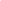

# Targeting Borderline Fraudsters: Multi-View Hypergraph Fraud Detection with LLM-Guided Contrastive Learning

<!-- Page 1 -->

Targeting Borderline Fraudsters: Multi-View Hypergraph Fraud Detection with LLM-Guided Contrastive Learning

Rui Ou1, Kun Zhu1*, Nana Zhang2, Jiangtong Li1, Chaochao Chen3, Yuhua Xu2, Changjun Jiang1

1School of Computer Science and Technology, Tongji University, Shanghai 201804, China 2School of Information and Intelligent Science, Donghua University, Shanghai 201620, China 3School of Computer Science and Technology, Zhejiang University, Hangzhou 310027, China {ourui, kzhu00, jiangtongli, cjjiang}@tongji.edu.cn, {nnzhang, xuyuhua}@dhu.edu.cn, zjuccc@zju.edu.cn

## Abstract

Graph fraud detection (GFD) on transaction networks is crucial for safeguarding financial systems. However, due to the limited perspective of existing graph neural networks (GNNs) in the single transaction view, sophisticated fraudsters can disguise themselves to exhibit weak fraud signals, appearing as borderline fraudsters. To address this challenge, we propose MH-LGC, a multi-view hypergraph fraud detection model with large language model (LLM) guided contrastive learning. MH-LGC tackles two key limitations of existing GNN-based GFD methods: (1) Due to the local aggregation mechanism, existing methods struggle to capture high-order trading patterns among distant fraudsters. MH-LGC introduces two temporal hyper-views as complements to the transaction view and employs a Temporal Hypergraph Attention Network (THAN) to integrate the three views. (2) Most GFD methods overlook the rich semantic cues embedded in transaction data. Although some general graph learning studies have explored LLM integration, the high computational overhead and task-specific fine-tuning make them impractical for GFD tasks. MH-LGC introduces a semantic view through a fine-tuning-free LLM-Guided Contrastive learning (LGC), adopting a novel paradigm for integrating GNN and LLM to reduce the computational overhead of LLM. Extensive experiments on three real-world datasets demonstrate that MH-LGC outperforms twelve state-of-the-art baselines, with AUC improvements ranging from 1.10% to 5.70%.

## Introduction

Detecting fraud in transaction networks is essential for maintaining financial integrity in digital payment systems (Motie and Raahemi 2024; Qiao et al. 2025; Cheng et al. 2025). Despite the notable success in graph-based fraud detection (GFD) using graph neural networks (GNNs), sophisticated fraudsters can still evade detection by exploiting the limited perspective of single-view GNNs (Zhang et al. 2023; Wang et al. 2023b). As shown in Figure 1, these fraudsters exhibit weak fraud signals and appear as borderline fraudsters, with embeddings close to benign users and ambiguous fraud scores. This challenge arises from the limited perspective of the transaction view, which restricts GNNs from capturing comprehensive information

*Corresponding author. Copyright © 2026, Association for the Advancement of Artificial Intelligence (www.aaai.org). All rights reserved.

Transaction View

GNN Encoder

Fraud Decoder

User Embedding Fraud Score

0

Borderline Fraudster Fraudster Benign User Benign/Fraudulent Transaction

**Figure 1.** Illustration of borderline fraudsters.

Split

Uncaptured Collusive Fraudsters

...

t2 t1 t1 t3 t3 t3

Area #1

2-hop Local Neighbors

65$ t3

Area #2

60$ t3

Area #3

5M$ t3

**Figure 2.** Distributed micro-transactions. GNNs fail to capture collusive fraudsters due to the local aggregation.

and makes them vulnerable to strategic manipulation. Targeting these borderline fraudsters, we introduce two types of novel views to overcome limitations in the transaction view.

Limitation 1: Local aggregation mechanism. Most GFD studies use GNNs to calculate user embedding by aggregating local neighbors in transaction view, which can be exploited by sophisticated fraudsters (Kipf and Welling 2016; Yu, Liu, and Luo 2024). Figure 2 illustrates a prevalent fraud pattern, known as distributed micro-transactions, where fraudsters intentionally split a single large transaction into multiple small and cross-regional ones (Xue, Wang, and Wei 2023; Li et al. 2024d). These small transactions generate weak fraud signals, which in turn position individual fraudsters near the detection boundary. Detecting such fraudsters requires aggregating information across multiple geographically dispersed transactions, which is difficult for traditional GNNs. Some state-of-the-art studies attempt to address this limitation by employing temporal encoding (Liu et al. 2023; Li et al. 2024a), neighbor extension (Liu et al. 2021; Yu et al. 2025), and risk propagation (Xiang et al. 2023, 2025), yet they still remain confined to the single transaction view. In this work, we introduce two temporal hyper-views to capture the high-order collusive patterns, addressing the limitation of local aggregation in transaction

The Fortieth AAAI Conference on Artificial Intelligence (AAAI-26)

15591

AI-readable visual equivalent, added: Figure extracted from the paper PDF and converted to an SVG wrapper asset. Use the surrounding page text and caption for interpretation.

AI-readable visual equivalent, added: Figure extracted from the paper PDF and converted to an SVG wrapper asset. Use the surrounding page text and caption for interpretation.

<!-- Page 2 -->

view. And a novel Temporal Hypergraph Attention Network (THAN) is proposed to integrate the hyper-views and the transaction view through hierarchical hyper-attention.

Limitation 2: Semantic blindness. Transaction networks contain rich semantic information, but GFD studies often directly reduce them to feature vectors, neglecting native semantics. Large language models (LLMs) have emerged as powerful tools for semantics mining (Li et al. 2024b; Jin et al. 2024), but they face two main challenges when applied to GFD tasks: (1) LLMs incur significant computational overhead (Tang et al. 2024). Figure 3 shows three existing paradigms for integrating GNNs and LLMs (i.e., as predictor (Chen et al. 2024), enhancer (Liu et al. 2024a), and aligner (Wang et al. 2024)), where the LLM typically processes all graph samples. This substantially slows both training and inference, which is impractical for efficiencycritical GFD tasks. (2) Directly employing LLMs as domain classifiers demands task-specific fine-tuning and extensive prior knowledge, making them difficult to detect subtle fraud patterns (Tang et al. 2024). To address these challenges, we propose a novel paradigm to employ LLM as a guide, constructing a semantic view to support GNN training. Specifically, we propose an LLM-Guided Contrastive learning (LGC) that selectively involves LLM only for borderline fraudsters, ensuring efficient processing for most samples. Furthermore, LGC employs a fine-tuning-free LLM to analyze users’ semantic contexts, enhancing generalizability and reducing reliance on task-specific fine-tuning.

Our main contributions are summarized as follows. • We present a Multi-view Hypergraph fraud detection model with LLM-Guide Contrastive learning (MH- LGC). To address the limitation of local aggregation, MH-LGC incorporates a temporal hypergraph attention network (THAN), which captures high-order user patterns with two temporal hyper-views. • Toward transactional semantic mining, MH-LGC integrates an LLM-guided contrastive learning (LGC) to construct a sematic view, guiding the training of THAN. LGC adopts a novel paradigm that leverages LLM as a guide to selectively handle borderline fraudsters, significantly reducing its computational overhead. • We conduct extensive experiments on three real-world fraud detection datasets. Experimental results demonstrate the superiority of MH-LGC over twelve state-ofthe-art baselines, with AUC improvements ranging from 1.10% to 5.70%.

## Related Work

Fraud Detection with GNNs. GNNs have been widely applied to various graph-based fraud detection (GFD) tasks, including web edit fraud (Tian et al. 2023; Li et al. 2024a; Liu et al. 2025), review fraud (Li et al. 2023; Li, Yu, and Luo 2025; Yang et al. 2025), and transaction fraud (Xu et al. 2024; Wang et al. 2023a; Xiang et al. 2025). However, most existing methods struggle to capture high-order temporal patterns due to the inherent limitations in local aggregation mechanisms (Figure 2). DGNN-SR (Yuan et al. 2025) incorporates temporal encoding; DAGNN (Li et al. 2022) adopts

LLM GNN LLM GNN as Predictor as Enhancer as Aligner

Transaction Graph

Node Emb. Align

Fraud Score

LLM

GNN

Fast Slow

Guide

Borderline

Fraudster

Ours: as Guide

Text Emb.

LLM

GNN

Text Emb. Node Emb.

Node Emb.

**Figure 3.** Paradigms for integrating GNNs and LLMs.

neighborhood expansion; RGTAN (Xiang et al. 2025) introduces risk propagation to enhance multi-hop structural awareness. Although these studies have attempted to improve GNNs’ perception capability, they remain constrained in the single transaction view. In this work, we propose two temporal-enhanced hyper-views using high-order hyperedges to capture cross-regional fraud patterns. Large Language Models on Graphs. LLMs have demonstrated impressive performance in graph learning (Guo et al. 2023; Zhang et al. 2024), with three main paradigms integrating with GNN (Figure 3). GraphGPT (Tang et al. 2024) and LLaGa (Chen et al. 2024) employ LLM as a predictor based on GNN-encoded node embeddings. However, these methods require costly task-specific fine-tuning and extensive prior knowledge, which limits their applications in GFD. Others use LLMs as enhancers or aligners: OFA (Liu et al. 2024a) and ZeroG (Li et al. 2024c) inject LLM-generated text embeddings, while TEA-GLM (Wang et al. 2024) and Grenade (Li, Ding, and Lee 2023) align GNN and LLM embeddings to capture both structure and semantics. However, all these methods invoke LLMs for each sample, making them inefficient for fraud detection. These limitations motivate us to design a new paradigm that employs LLM as a guide to selectively handle the borderline fraudsters.

## Preliminaries

Transaction Graph (TG). An TG G = (N, E, XN, XE) is constructed by the transaction records between users, with users as nodes N and transactions as edges E. e = (u, v, t) ∈E ⊆|N| × |N| × R indicates a transaction between users u and v at time t, XN ∈R|N|×dN and XE ∈R|E|×dE denote the user and transaction feature matrix, respectively, where dN and dE denote the respective feature dimensions. Transaction Hypergraph (TH). An TH HG = (N, H, XN, XH) shares the same node set and node feature with G. Each hyperedge he =

Nh, t

∈ H consists of a set of connected nodes Nh and a timestamp t. XH ∈R|H|×dH denotes the hyperedge features with dimension dH. TH provides a higher-order view that can potentially capture complex user patterns. Problem Formulation. Given an TG G, each transaction e is associated with a label y ∈{0, 1, −1} that indicates the

15592

<!-- Page 3 -->

Natural Language

Text Embedding

Hyper-View Construction

Raw Transaction Records

90$ t1

70$ t4 t1 t4 t4 t2 t3 t1 t3 t4

[t3,t4], f = 2

[t3,t4], f = 1

[t1,t2], f = 2 t1 t3 t2 t4 Intra-Hyperedge Attention

Inter-Edge/Hyperedge Attention

Multi-View Attention

Relative Time Encoding

Temporal Neighbor Sampling

LLM-Guided Contrastive Learning (LGC) Temporal Hypergraph Attention Network (THAN)

Multi-View Flattener

Large Language Model

Instruction [Role Description] You are a financial risk analysis expert... [Task Definition] Your task is to analyze the transaction patterns of target user... [Input Graph] <Flattened Views>

Semantic View of User Patterns

Origin Views Augment Views

THAN

LGC Only involves Borderline Fraudsters

Frequency Hyper-View

Time Hyper-View

Transaction View

Fraud Decoder

User Embedding Fraud Score

Contrastive Training

LLM Guide: Hardness of Negatives

THAN

Human Audit

Anchor Positive Negative Origin Feature Masked Feature

Frozen Tuned

Benign User Fraudster Benign/Fraudulent Transaction

Time/Frequency Hyperedge /

**Figure 4.** Overall architecture of MH-LGC.

transaction is benign, fraudulent, or unknown. Our goal is to train a model that predicts the labels of all unknown transactions. To overcome the limitations of single transaction view, we construct two hyper-views and a semantic view to enable multi-view hypergraph fraud detection.

## Methodology

Overview of MH-LGC

**Figure 4.** demonstrates the overall architecture of MH- LGC, a multi-view fraud detection model that includes four views: transaction view G, time hyper-view HG(1), frequency hyper-view HG(2), and semantic view. As illustrated in the upper left of Figure 4, the transaction view G is constructed based on the raw transaction records (Tian et al. 2023; Li et al. 2024a). Time and frequency hyper-views HG(1), HG(2) are constructed based on G to capture highorder temporal patterns. MH-LGC consists of two key modules: THAN and LGC. As illustrated in the middle of Figure 4, THAN encodes the first three views into user embeddings, and a fraud decoder calculates the fraud scores. THAN addresses the limitation of local aggregation by integrating high-order hyper-views with hierarchical attentions. As shown on the right of Figure 4, LGC introduces a novel paradigm that leverages LLM as a guide to provide a semantic view for contrastive training. LGC selectively handles the hard-to-distinguish borderline fraudsters, allowing most users to be efficiently processed by THAN.

Temporal Hypergraph Attention Network (THAN)

THAN constructs two hyper-views HG(1) and HG(2) to capture time and frequency patterns, and integrates them with the transaction view G to calculate user embeddings. Hyper-View Construction. HG(1) and HG(2) are constructed based on G to model high-order temporal patterns.

Time Hyper-view HG(1) connects users who engage in transactions within a time window, capturing the temporal clustering collusive fraudsters. Specifically, we divide the entire time span into overlapping time windows. The i-th window can be represented as T (1)

i = i · s(1)

t, i · s(1)

t + ∆t(1)

, with step size s(1)

t step size and window length ∆t(1). In practice, we fix the step size to half the window length. A hyperedge connects all nodes involved in the time window, whose node set can be formulated as:

N (1)

i = n u ∈N

∃v ∈N, ∃t ∈T (1)

i, (u, v, t) ∈E o

. (1) Based on Equation (1), we construct a membership matrix M(1) ∈{0, 1}|H|×|N |, where M(1)[x][y] represents whether node y is connected by hyperedge x:

M(1)[x][y] = I y ∈N (1)

x

, (2)

where I(·) denotes the indicator function.

Frequency Hyper-view HG(2) focuses on the transaction frequency of users. Similar to HG(1), HG(2) also divides time windows T (2)

i = [i·s(2)

t, i·s(2)

t +∆t(2)], but with larger

15593

AI-readable visual equivalent, added: Figure extracted from the paper PDF and converted to an SVG wrapper asset. Use the surrounding page text and caption for interpretation.

AI-readable visual equivalent, added: Figure extracted from the paper PDF and converted to an SVG wrapper asset. Use the surrounding page text and caption for interpretation.

AI-readable visual equivalent, added: Figure extracted from the paper PDF and converted to an SVG wrapper asset. Use the surrounding page text and caption for interpretation.

<!-- Page 4 -->

time step s(2)

t and window length ∆t(2) to capture frequency patterns in a longer time span. The transaction frequency of user u in T (2)

i can be formulated as:

fi,u = n

(u, v, t) ∈E t ∈T (2)

i o. (3)

HG(2) additionally divides frequency windows in each T (2)

i: F (2)

j = [j · s(2)

f, j · s(2)

f + ∆f (2)]. Each frequency window is associated with a temporal hyperedge, whose set of connected nodes is:

N (2)

k = u ∈N

∃v ∈N, ∃t ∈T (2)

i, (u, v, t) ∈E, fi,u ∈F (2)

j

, k = I · i + j.

(4)

We extract four features xH =

|Nh|, ¯f, µt, σt for each hyperedge in both hyper-views, where Nh denotes the number of connected users; ¯f denotes the average transaction frequency of connected users; µt and σt are the mean and standard deviation of transaction timestamps. Hierarchical Hyper-Attention. To integrate the three views, THAN designs a hierarchical hyper-attention to encode the multi-view hypergraph. The basic attention formulation (Vaswani 2017) is as follows:

Attn(q, k, v) = softmax

Q · KT

√ d

V. (5)

THAN consists of three attention layers, which implement Equation (5) with different q, k, v. First, a Intra- Hyperedge Attention aggregates the connected nodes on the hyperedge to a single hyper-neighbors XHN:

zintra

H = [WHXH||Φ(0)], zintra

N = [WN(H ◦XN)||Φ(∆t)],

(6) XHN = Attn(q = zintra

H, k = v = zintra

N), (7) where WH, WN are projection matrices; zintra

H, zintra

N are the hidden embedding matrices of hyperedges and connected nodes, respectively. Φ(·) denotes a relative time encoding to model periodical information:

Φ(∆t) = [ cos(ω1∆t), sin(ω1∆t),..., cos(ωdΦ∆t), sin(ωdΦ∆t)], (8)

where ω1,..., ωdΦ are learnable frequencies, and d = 2dΦ.

In addition, a Inter-Edge/Hyperedge Attention aggregates neighbors/hyper-neighbors to the center node for each view. The formulation of hyper-views is as follows:

zinter

C = [WNXN||Φ(0)], zinter

HN = [WN(MT ◦XHN)||Φ(∆t)],

(9)

Zv = Attn(q = zinter

C, k = v = zinter

HN), (10) where zinter

C, zinter

HN are the hidden embeddings for center nodes and hyper-neighbors; Zv denotes the user embedding on view v; ◦denotes element-wise multiplication; M denotes the membership matrix in Equation (2).

Finally, a Multi-View Attention fuses three views and produces user embeddings Z.

zmv = [ZG || ZHG(1) || ZHG(2)], (11)

Z = Attn(q = k = v = zmv). (12)

The fraud decoder then predicts the fraud scores ˆY based on user embeddings, and the classification loss can be calculated with ground-truth labels Y.

ˆY = FraudDecoder(Z). (13)

Lcla = −

X yi∈Y, ˆyi∈ˆ Y

[yi log ˆyi + (1 −yi) log(1 −ˆyi)].

(14)

LLM-Guided Contrastive Learning (LGC) Targeting borderline fraudsters, we employ LGC to construct a semantic view, capturing their latent semantic information. LGC applies only to borderline fraudsters to reduce LLM overhead. Specifically, the fraudster with the lowest predicted fraud score ˆyi in a batch is considered the borderline fraudster and designated as the anchor in LGC. Multi-view Augmentation. To augment borderline fraudsters, LGC adopts random masking strategies of features, edges, and hyperedge memberships. For example, given the membership matrix M ∈{0, 1}|H|×|N | in Equation (2), we sample a binary mask Mask ∈{0, 1}|H|×|N| ∼ Bernoulli(1 −p) from a Bernoulli distribution, where p is the masking probability. And the augmented membership matrix can be derived as ˜ M = Mask◦M. By applying similar masking strategies to features and edges, we can obtain augmented views:

˜G, ˜ HG

(1), ˜ HG

(2) = A

G, HG(1), HG(2)

, (15)

where A(·) denotes the augmentation function. As illustrated in the upper right of Figure 4, we consider the borderline fraudster in origin views as anchor x, the same node in augment views as positive x+, and others as negative x−. Hardness-aware Contrastive Learning. Based on the positive and negatives, the InfoNCE contrastive loss (Rusak et al. 2024) can be calculated as:

Lcon = −Ex log ef(x)T f(x+)

ef(x)T f(x+) + Ex−∼p(x−)ef(x)T f(x−),

(16) where f(x) denotes the THAN embedding of sample x in Equation (12), and p(x−) is the negative sampling distribution. Although traditional studies sample x−evenly, placing higher sampling weights on hard negatives can benefit contrastive learning (Robinson et al. 2020; Liu et al. 2024b). Hard negatives refer to those who are hard-to-distinguish with anchor x according to a similarity criterion sim(x, x−). The hard negative distribution can be derived as:

qβ|x(x−) = eβ sim(x,x−) × p(x−), (17)

where β > 0 controls the impact of hard negatives and eβ sim(x,x−) denotes the hardness of the negative x−. This hard negative sampling strategy can enhance THAN’s capability to distinguish borderline fraudsters from benign users. In practice, the weighted negative distribution in Equation

15594

<!-- Page 5 -->

Wikipedia Reddit Credit

#Nodes 9,227 10,984 87,130 #Edges 157,474 672,447 587,473 #Feat. 172 172 7 Time Span 30 days 30 days 180 days

**Table 1.** Dataset statistics.

20 50 100 150 200

88 92 96 100

AUC, Recall (\%)

AUC Recall

(a) ∆t(1)

100 250 500 750 1000

88 92 96 100

||

||

(b) ∆t(2)

**Figure 5.** Hyperparameter sensitivity for THAN.

(17) can be equivalently implemented by reweighting the negative samples (Hao et al. 2024; Jiang et al. 2024). LLM-Guided Negative Sampling. Existing studies typically calculate similarity based on GNN embeddings f(x): sim(x, x−) = f(x)T f(x−). LGC is the first work that leverages LLM to calculate sim(·), guiding the negative sampling procedure. Specifically, we transform the local subgraph of the anchor and negative into flattened JSON format, and leverage LLM to analyze their transaction patterns in natural language, which can also support human auditing. To quantify similarity, we extract the embeddings in the last hidden layer as text embedding g(x):

g(x) = LLM

G(x), HG(1)(x), HG(2)(x)

, g(x−) = LLM

˜G(x−), ˜ HG

(1)(x−), ˜ HG

(2)(x−)

,

(18)

where G(x) denotes the local subgraph around x in view G.

Based on both f(x) and g(x), the similarity criterion of LGC can be derived as:

sim(x, x−) = (1−γ)f(x)T f(x−)

df(x)

+γ g(x)T g(x−)

dg(x)

, (19)

where γ balances the contribution of two embeddings. df(x) and dg(x) denote the dimensions of embeddings, which are used to eliminate the impact of different embedding sizes.

LGC adopts a novel paradigm to employ LLM as a guide for contrastive training, allowing most samples to be efficiently encoded without involving LLM. Moreover, LGC utilizes LLM to analyze the semantic transactional patterns rather than directly classify fraudsters, thereby avoiding the dependence on task-specific fine-tuning.

## Experiments

## Experimental Setup

Datasets. As shown in Table 1, we conduct extensive experiments on three real-world fraud detection datasets, including two public datasets Wikipedia and Reddit (Tian et al. 2023), as well as a private credit card fraud dataset Credit.

0 0.5 1 2 3 80

85

90

95

## 100 AUC

Recall

(a) Hard Impact β

0 0.25 0.5 0.75 1 80

85

90

95

## 100 AUC

Recall

(b) Similarity Balance γ

**Figure 6.** Hyperparameter sensitivity for LGC.

Baselines. We compare MH-LGC with twelve state-of-theart baselines, including nine GNN-based fraud detection (GFD) methods (TGAT (Xu et al. 2020), SemiGNN (Wang et al. 2019), CARE (Dou et al. 2020), GDN (Ding et al. 2021), TADDY (Liu et al. 2023), MADG (Yuan, Shao, and Yan 2023), SAD (Tian et al. 2023), AdaDyGNN (Li et al. 2024a), and RGTAN (Xiang et al. 2025)) and three latest graph learning methods integrating large language models (OFA (Liu et al. 2024a), TEA-GLM (Wang et al. 2024), GAugLLM (Fang et al. 2024)). Metrics. We use AUC and Recall as evaluation metrics. AUC is widely adopted in fraud detection tasks (Xiang et al. 2025) due to its threshold-independence and robustness in imbalanced classification tasks. Recall is selected to assess the model’s capability to identify borderline fraudsters. Implementation Details. We implement MH-LGC using PyTorch 1.10.1 and conduct all experiments on an NVIDIA V100 (32GB). For each experiment, we conduct 10 independent runs and report the mean and standard deviation results. By default, we adopt LLaMa3-8B as the LLM backbone in LGC. For dataset settings, we strictly follow the preprocessing procedures and the 75%-15%-15% split of training, validation, and test sets as described in (Tian et al. 2023).

Overall Performance We compare the fraud detection performance of MH-LGC to twelve SOTA baselines on edge classification tasks. As reported in Table 2, the extensive results across three datasets clearly demonstrate that MH-LGC outperforms all baselines. Notably, in Credit dataset, MH-LGC achieves improvements of +8.02% and +3.02% compared to the backbone TGAT (Xu et al. 2020) model in terms of AUC and Recall, respectively. The other eight GFD baselines achieve notable improvements compared to TGAT by adopting techniques such as neighbor extension, risk propagation, etc. However, the are still limited in single transaction view, lacking high-order perspectives and semantic mining.

The applications of LLMs in GFD are almost unexplored. OFA, TEA-GLM and GAugLLM are three general graph learning methods integrating LLMs. Although not specifically designed for GFD, they still demonstrate robust performance across datasets. Notably, they generally perform better in Credit dataset because it is a text-attributed dataset with nominate features, which allows LLMs to not only model the graph structure but also understand the semantics of features (e.g., transaction amount, transaction limit, etc.).

15595

AI-readable visual equivalent, added: Figure extracted from the paper PDF and converted to an SVG wrapper asset. Use the surrounding page text and caption for interpretation.

AI-readable visual equivalent, added: Figure extracted from the paper PDF and converted to an SVG wrapper asset. Use the surrounding page text and caption for interpretation.

AI-readable visual equivalent, added: Figure extracted from the paper PDF and converted to an SVG wrapper asset. Use the surrounding page text and caption for interpretation.

AI-readable visual equivalent, added: Figure extracted from the paper PDF and converted to an SVG wrapper asset. Use the surrounding page text and caption for interpretation.

<!-- Page 6 -->

Datasets Wikipedia Reddit Credit

Metrics AUC Recall AUC Recall AUC Recall

TGAT 83.69±0.70 76.59±8.13 65.56±0.70 51.70±14.97 86.84±0.14 85.87±2.09

SemiGNN 84.65±0.82 74.95±5.23 64.18±0.78 55.85±10.35 87.76±0.21 85.66±2.05 CARE 83.47±0.84 72.73±9.03 65.78±0.96 58.40±9.16 87.98±0.42 86.14±2.02 GDN 85.12±0.69 72.05±8.01 67.02±0.51 52.77±10.05 87.91±0.23 85.64±2.14 TADDY 84.72±1.01 79.32±7.57 67.95±0.94 61.71±7.37 88.74±0.22 86.08±1.26 MADG 86.53±0.86 78.64±2.53 68.21±0.63 62.45±6.28 88.53±0.25 84.65±2.01 SAD 86.77±0.24 80.68±4.46 68.77±0.75 63.62±11.29 88.98±0.17 86.27±1.43 AdaDyGNN 86.84±0.48 80.13±5.89 68.19±0.64 62.76±8.41 88.76±0.25 86.38±1.55 RGATN 86.93±0.62 80.69±5.72 68.31±0.79 63.55±9.23 88.81±0.27 86.15±1.58

OFA 82.84±1.24 77.46±8.67 65.87±0.84 53.50±12.42 88.93±0.62 86.40±1.79 TEA-GLM 86.48±0.79 80.09±7.17 67.93±0.83 60.87±9.94 89.02±0.59 86.61±1.58 GAugLLM 87.14±0.93 80.69±7.87 68.42±0.92 63.08±7.22 89.16±0.38 86.44±2.10

MH-LGC 90.17±0.42 84.25±2.83 69.87±0.61 65.01±7.24 94.86±0.15 88.89±1.58

**Table 2.** Fraud detection performance on edge classification.

In contrast, Wikipedia and Reddit use anonymous features, which limits LLM’s capability of semantic mining. Compared to the best baseline, MH-LGC demonstrates significant improvements of +5.70% and +2.28% in Credit dataset in terms of AUC and Recall, respectively.

Hyperparameter Sensitivity For THAN, we vary the time window lengths of the two hyper-views, denoted ∆t(1) and ∆t(2). Figure 5 reports the results in Credit dataset. As the window length increases, the number of hyperedges |H| in both views decreases, which enables THAN to capture user trading patterns over longer time spans, but may reduce its capability to detect finegrained temporal dynamics. Based on empirical results, we set ∆t(1) = 100 and ∆t(2) = 500.

**Figure 6.** illustrates the impact of two key hyperparameters in LGC: (1) Hard impact β in Equation (17). β controls the emphasis placed on hard negatives. A larger β encourages LGC to pay more attention to beneficial negatives, yet reduces the diversity of sampled negatives. We empirically set β = 1. (2) Similarity Balance γ in Equation (19). γ determines the relative contribution of the text embedding g(x) and the graph embedding f(x). We set γ = 0.75 to effectively integrate the insights from graph and semantic views.

Ablation Study To evaluate the effectiveness of each component in MH- LGC, we conduct a comprehensive ablation study on the following variants: (1) TGAT (Xu et al. 2020) is the backbone of MH-LGC that only involves transaction view G. (2) w/o HG(1) disables the temporal hyper-view HG(1) in THAN. (3) w/o HG(2) disables the frequency hyper-view HG(2) in THAN. (4) w/o THAN disables both HG(1) and HG(2). (5) w/o LGC disables the LLM-guided contrastive learning and the semantic view. (6) MH-LGC is the complete model that integrates four views. As shown in Table 3, each view in MH-LGC contributes to performance improvement compared to the backbone. Integrating the transaction view, two

TGAT

AdaDyGNN

RGTAN

TEA-GLM

GAugLLM

MH-LGC

75

80

85

90

Recall (%)

All Borderline

**Figure 7.** The Recall gap between identifying all fraudsters and borderline fraudsters.

hyper-views, and the semantic view, MH-LGC demonstrates SOTA performance on multi-view fraud detection.

In addition, we perform ablation studies on different LLM backbones used in LGC. As shown in the table, MH-LGC variants equipped with Vicuna-7B and LLaMA2-7B also outperform w/o LGC, demonstrating the effectiveness of LGC across different LLM backbones.

Case study on Borderline Fraudsters

To provide deeper insight into the performance improvements of MH-LGC, we conduct a case study on borderline fraudsters in Credit dataset. Figure 7 compares MH-LGC with five representative baselines in terms of Recall, evaluating their capability to identify all fraudsters and borderline fraudsters. MH-LGC significantly improves the detection of borderline fraudsters, achieving a +4.06% gain over the best baseline, which contributes substantially to model’s overall Recall improvement (+2.28%). Notably, MH-LGC achieves even higher recall for borderline fraudsters than that for all fraudsters in SOTA baselines, highlighting its effectiveness in identifying challenging fraud cases.

We further visualize user embedding to assess models’ capability in distinguishing borderline fraudsters within the embedding space. As shown in Figure 8, the embeddings of

15596

<!-- Page 7 -->

Datasets Wikipedia Reddit Credit

Metrics AUC Recall AUC Recall AUC Recall

TGAT 83.69±0.70 76.59±8.13 65.56±0.70 51.70±14.97 86.84±0.14 85.87±2.09 w/o HG(1) 88.97±0.51 83.89±4.96 69.64±0.78 63.98±6.45 92.97±0.18 87.78±1.98 w/o HG(2) 89.15±0.49 84.10±4.47 69.70±0.67 64.28±8.43 93.18±0.14 88.10±1.67 w/o THAN 87.67±0.54 82.35±6.94 68.45±0.84 62.05±8.76 91.81±0.20 87.52±1.51 w/o LGC 88.26±0.63 83.41±4.61 68.94±0.79 63.50±6.97 90.54±0.19 87.09±1.86

Vicuna-7B 89.35±0.71 83.74±3.31 69.63±1.15 64.76±8.36 93.56±0.47 88.18±2.09 LLaMA2-7B 89.86±0.65 84.14±3.68 69.55±1.64 64.84±8.20 93.84±0.39 88.35±1.87

MH-LGC 90.17±0.42 84.25±2.83 69.87±0.61 65.01±7.24 94.86±0.15 88.89±1.58

**Table 3.** Ablation Study.

(a) RGTAN (b) TEA-GLM

(c) GAugLLM (d) MH-LGC

**Figure 8.** Visualization results of user embeddings, where blue, red, orange nodes represent benign users, borderline fraudsters, and other fraudsters, respectively.

baselines often exhibit significant overlaps between fraudsters and benign users, particularly in the case of borderline fraudsters. In contrast, MH-LGC can clearly separate borderline fraudsters from benign users.

Training and Inference Efficiency To evaluate the efficiency of MH-LGC, we compare the training and inference times with representative baselines. We set the batch size to 256 and employ LLaMA3-8B as the LLM backbone for all baselines. As shown in Table 4, GNN-based baselines are highly efficient. In contrast, LLMintegrated methods incur much higher overhead due to frequent LLM queries. OFA involves a large number of queries to construct prompt graphs for each sample. GAugLLM augments each sample using three prompts, resulting in 3×B = 768 queries. TEA-GLM requires B = 256 queries to align the node embeddings with text embeddings. Although they can preprocess all samples in advance to mitigate slow training, the preprocessing procedure remains time-consuming and is not applicable to online inference for newly arrived transactions in GFD.

Offline Training Online Inference

Time #LLM Time #LLM

TGAT 0.41s 0 0.32s 0 SAD 0.53s 0 0.41s 0 AdaDyGNN 0.47s 0 0.36s 0 RGTAN 0.51s 0 0.38s 0

OFA 235m 235m TEA-GLM 22m 256 22m 256 GAugLLM 64m 768 64m 768

MH-LGC 21s 4 0.39s 0

**Table 4.** Time and number of LLM queries per batch in training and inference.

MH-LGC requires only 4 queries by selectively processing one sample in each batch. For each borderline sample, MH-LGC employs LLM to encode the text embeddings of the anchor and three negatives. Furthermore, although MH- LGC incurs more training time than GNN-based baselines due to LLM involvement, its inference is similarly efficient. The LLM guidance during contrastive training has been internalized into THAN’s parameters, enabling it to identify borderline fraudsters independently at inference stage.

## Conclusion

In this work, we present MH-LGC, a multi-view hypergraph fraud detection model with large language model (LLM) guided contrastive learning. MH-LGC comprises two novel components: (1) To address the locality limitations of traditional GNNs, MH-LGC introduces a temporal hypergraph attention network (THAN), which captures high-order collusive patterns by integrating two temporal hyper-views. (2) To construct a semantic view of transaction data, MH-LGC incorporates a fine-tuning-free LLM-guided contrastive learning (LGC), which adopts a novel paradigm that selectively handles borderline fraudsters and significantly reduces the computational overhead of LLMs. MH- LGC achieves consistent improvements over twelve SOTA baselines on three real-world datasets, with AUC improvements ranging from 1.10% to 5.70%.

15597

AI-readable visual equivalent, added: Figure extracted from the paper PDF and converted to an SVG wrapper asset. Use the surrounding page text and caption for interpretation.

AI-readable visual equivalent, added: Figure extracted from the paper PDF and converted to an SVG wrapper asset. Use the surrounding page text and caption for interpretation.

AI-readable visual equivalent, added: Figure extracted from the paper PDF and converted to an SVG wrapper asset. Use the surrounding page text and caption for interpretation.

AI-readable visual equivalent, added: Figure extracted from the paper PDF and converted to an SVG wrapper asset. Use the surrounding page text and caption for interpretation.

<!-- Page 8 -->

## Acknowledgments

This work is supported in part by the National Key Research and Development Program of China under Grant YS2022YFB4500205 and in part by the National Natural Science Foundation of China under Grant 62302337, 62402098, 62402341.

## References

Chen, R.; Zhao, T.; JAISWAL, A. K.; Shah, N.; and Wang, Z. 2024. LLaGA: Large Language and Graph Assistant. In Forty-first International Conference on Machine Learning.

Cheng, D.; Zou, Y.; Xiang, S.; and Jiang, C. 2025. Graph neural networks for financial fraud detection: a review. Frontiers of Computer Science, 19(9): 199609.

Ding, K.; Zhou, Q.; Tong, H.; and Liu, H. 2021. Fewshot network anomaly detection via cross-network metalearning. In Proceedings of the web conference 2021, 2448– 2456.

Dou, Y.; Liu, Z.; Sun, L.; Deng, Y.; Peng, H.; and Yu, P. S. 2020. Enhancing graph neural network-based fraud detectors against camouflaged fraudsters. In Proceedings of the 29th ACM international conference on information & knowledge management, 315–324.

Fang, Y.; Fan, D.; Zha, D.; and Tan, Q. 2024. Gaugllm: Improving graph contrastive learning for text-attributed graphs with large language models. In Proceedings of the 30th ACM SIGKDD Conference on Knowledge Discovery and Data Mining, 747–758.

Guo, J.; Du, L.; Liu, H.; Zhou, M.; He, X.; and Han, S. 2023. Gpt4graph: Can large language models understand graph structured data? an empirical evaluation and benchmarking. arXiv preprint arXiv:2305.15066.

Hao, Z.; Xin, H.; Wei, L.; Tang, L.; Wang, R.; and Nie, F. 2024. Towards expansive and adaptive hard negative mining: Graph contrastive learning via subspace preserving. In Proceedings of the ACM Web Conference 2024, 322–333.

Jiang, R.; Nguyen, T.; Ishwar, P.; and Aeron, S. 2024. Supervised Contrastive Learning with Hard Negative Samples. In 2024 International Joint Conference on Neural Networks (IJCNN), 1–8.

Jin, B.; Liu, G.; Han, C.; Jiang, M.; Ji, H.; and Han, J. 2024. Large language models on graphs: A comprehensive survey. IEEE Transactions on Knowledge and Data Engineering.

Kipf, T. N.; and Welling, M. 2016. Semi-supervised classification with graph convolutional networks. arXiv preprint arXiv:1609.02907.

Li, H.; Li, C.; Feng, K.; Yuan, Y.; Wang, G.; and Zha, H. 2024a. Robust knowledge adaptation for dynamic graph neural networks. IEEE Transactions on Knowledge and Data Engineering.

Li, P.; Yu, H.; and Luo, X. 2025. Context-aware Graph Neural Network for Graph-based Fraud Detection with Extremely Limited Labels. In Proceedings of the AAAI Conference on Artificial Intelligence, volume 39, 12112–12120.

Li, P.; Yu, H.; Luo, X.; and Wu, J. 2023. LGM-GNN: A local and global aware memory-based graph neural network for fraud detection. IEEE Transactions on Big Data, 9(4): 1116–1127. Li, Q.; He, Y.; Xu, C.; Wu, F.; Gao, J.; and Li, Z. 2022. Dual-augment graph neural network for fraud detection. In Proceedings of the 31st ACM International Conference on Information & Knowledge Management, 4188–4192. Li, Y.; Ding, K.; and Lee, K. 2023. Grenade: Graph-Centric Language Model for Self-Supervised Representation Learning on Text-Attributed Graphs. In 2023 Findings of the Association for Computational Linguistics: EMNLP 2023, 2745– 2757. Association for Computational Linguistics (ACL). Li, Y.; Li, Z.; Wang, P.; Li, J.; Sun, X.; Cheng, H.; and Yu, J. X. 2024b. A survey of graph meets large language model: progress and future directions. In Proceedings of the Thirty-Third International Joint Conference on Artificial Intelligence, 8123–8131. Li, Y.; Wang, P.; Li, Z.; Yu, J. X.; and Li, J. 2024c. Zerog: Investigating cross-dataset zero-shot transferability in graphs. In Proceedings of the 30th ACM SIGKDD Conference on Knowledge Discovery and Data Mining, 1725–1735. Li, Y.; Yang, X.; Gao, Q.; Wang, H.; Zhang, J.; and Li, T. 2024d. Cross-Regional Fraud Detection via Continual Learning With Knowledge Transfer. IEEE Transactions on Knowledge and Data Engineering. Liu, G.; Zhang, J.; Lv, P.; Wang, C.; Wang, H.; and Wang, D. 2025. TAAD: Time-varying adversarial anomaly detection in dynamic graphs. Information Processing & Management, 62(1): 103912. Liu, H.; Feng, J.; Kong, L.; Liang, N.; Tao, D.; Chen, Y.; and Zhang, M. 2024a. One For All: Towards Training One Graph Model For All Classification Tasks. In The Twelfth International Conference on Learning Representations. Liu, X.; Qian, B.; Liu, H.; Guo, D.; Wang, Y.; and Wang, M. 2024b. Seeking false hard negatives for graph contrastive learning. IEEE Transactions on Circuits and Systems for Video Technology, 34(8): 7454–7466. Liu, Y.; Ao, X.; Qin, Z.; Chi, J.; Feng, J.; Yang, H.; and He, Q. 2021. Pick and choose: a GNN-based imbalanced learning approach for fraud detection. In Proceedings of the web conference 2021, 3168–3177. Liu, Y.; Pan, S.; Wang, Y. G.; Xiong, F.; Wang, L.; Chen, Q.; and Lee, V. C. 2023. Anomaly detection in dynamic graphs via transformer. IEEE Transactions on Knowledge and Data Engineering, 35(12): 12081–12094. Motie, S.; and Raahemi, B. 2024. Financial fraud detection using graph neural networks: A systematic review. Expert Systems with Applications, 240: 122156. Qiao, Y.; Wang, N.; Gao, Y.; Yang, Y.; Fu, X.; Wang, W.; and Ao, X. 2025. Online Fraud Detection via Test-Time Retrieval-Based Representation Enrichment. In Proceedings of the AAAI Conference on Artificial Intelligence, volume 39, 12470–12478. Robinson, J.; Chuang, C.-Y.; Sra, S.; and Jegelka, S. 2020. Contrastive learning with hard negative samples. arXiv preprint arXiv:2010.04592.

15598

<!-- Page 9 -->

Rusak, E.; Reizinger, P.; Juhos, A.; Bringmann, O.; Zimmermann, R. S.; and Brendel, W. 2024. InfoNCE: Identifying the Gap Between Theory and Practice. arXiv preprint arXiv:2407.00143. Tang, J.; Yang, Y.; Wei, W.; Shi, L.; Su, L.; Cheng, S.; Yin, D.; and Huang, C. 2024. Graphgpt: Graph instruction tuning for large language models. In Proceedings of the 47th International ACM SIGIR Conference on Research and Development in Information Retrieval, 491–500. Tian, S.; Dong, J.; Li, J.; Zhao, W.; Xu, X.; Song, B.; Meng, C.; Zhang, T.; Chen, L.; et al. 2023. Sad: Semisupervised anomaly detection on dynamic graphs. arXiv preprint arXiv:2305.13573. Vaswani, A. 2017. Attention is all you need. Advances in Neural Information Processing Systems. Wang, C.; Tang, H.; Zhu, H.; and Jiang, C. 2023a. Collaborative Prediction in Anti-Fraud System Over Multiple Credit Loan Platforms. IEEE Transactions on Dependable and Secure Computing. Wang, D.; Lin, J.; Cui, P.; Jia, Q.; Wang, Z.; Fang, Y.; Yu, Q.; Zhou, J.; Yang, S.; and Qi, Y. 2019. A semi-supervised graph attentive network for financial fraud detection. In 2019 IEEE International Conference on Data Mining (ICDM), 598– 607. IEEE. Wang, D.; Zuo, Y.; Li, F.; and Wu, J. 2024. Llms as zeroshot graph learners: Alignment of gnn representations with llm token embeddings. Advances in Neural Information Processing Systems, 37: 5950–5973. Wang, L.; Zhao, H.; Feng, C.; Liu, W.; Huang, C.; Santoni, M.; Cristofaro, M.; Jafrancesco, P.; and Bian, J. 2023b. Removing Camouflage and Revealing Collusion: Leveraging Gang-crime Pattern in Fraudster Detection. In Proceedings of the 29th ACM SIGKDD Conference on Knowledge Discovery and Data Mining, 5104–5115. Xiang, S.; Zhang, G.; Cheng, D.; and Zhang, Y. 2025. Enhancing Attribute-Driven Fraud Detection With Risk-Aware Graph Representation. IEEE Transactions on Knowledge and Data Engineering. Xiang, S.; Zhu, M.; Cheng, D.; Li, E.; Zhao, R.; Ouyang, Y.; Chen, L.; and Zheng, Y. 2023. Semi-supervised credit card fraud detection via attribute-driven graph representation. In Proceedings of the AAAI Conference on Artificial Intelligence, volume 37, 14557–14565. Xu, D.; Ruan, C.; Korpeoglu, E.; Kumar, S.; and Achan, K. 2020. Inductive representation learning on temporal graphs. arXiv preprint arXiv:2002.07962. Xu, F.; Wang, N.; Wu, H.; Wen, X.; Zhao, X.; and Wan, H. 2024. Revisiting graph-based fraud detection in sight of heterophily and spectrum. In Proceedings of the AAAI conference on artificial intelligence, volume 38, 9214–9222. Xue, Q.; Wang, H.; and Wei, J. 2023. Internet technology and regional financial fraud: evidence from Broadband expansion in China. Journal of Applied Economics, 26(1): 2281167. Yang, J.; Zhang, R.; Cheng, Z.; Cheng, D.; Yang, G.; and Wang, B. 2025. Grad: Guided relation diffusion generation for graph augmentation in graph fraud detection. In Proceedings of the ACM on Web Conference 2025, 5308–5319. Yu, H.; Liu, Z.; and Luo, X. 2024. Barely supervised learning for graph-based fraud detection. In Proceedings of the AAAI Conference on Artificial Intelligence, volume 38, 16548–16557. Yu, Z.; Liang, C.; Chang, X.; He, D.; Jin, D.; and Wei, J. 2025. Dynamic Neighborhood Modeling via Node- Subgraph Contrastive Learning for Graph-Based Fraud Detection. In Proceedings of the AAAI Conference on Artificial Intelligence, volume 39, 13115–13123. Yuan, Q.; Liu, Y.; Tang, Y.; Chen, X.; Zheng, X.; He, Q.; and Ao, X. 2025. Dynamic Graph Learning with Static Relations for Credit Risk Assessment. In Proceedings of the AAAI Conference on Artificial Intelligence, volume 39, 13133–13141. Yuan, Z.; Shao, M.; and Yan, Q. 2023. Motif-level Anomaly Detection in Dynamic Graphs. IEEE Transactions on Information Forensics and Security. Zhang, Z.; Wan, J.; Zhou, M.; Lai, Z.; Tessone, C. J.; Chen, G.; and Liao, H. 2023. Temporal burstiness and collaborative camouflage aware fraud detection. Information Processing & Management, 60(2): 103170. Zhang, Z.; Wang, X.; Zhang, Z.; Li, H.; Qin, Y.; and Zhu, W. 2024. LLM4DyG: can large language models solve spatialtemporal problems on dynamic graphs? In Proceedings of the 30th ACM SIGKDD Conference on Knowledge Discovery and Data Mining, 4350–4361.

15599
