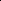

# Towards Multiple Missing Values-resistant Unsupervised Graph Anomaly Detection

<!-- Page 1 -->

Towards Multiple Missing Values-resistant Unsupervised Graph Anomaly

Detection

Jiazhen Chen1*, Xiuqin Liang2*, Sichao Fu3, 4†, Zheng Ma5, Weihua Ou6

1Department of Statistics and Actuarial Science, University of Waterloo 2Data Science Center of Excellence, Deloitte Consulting Beijing 3School of Electronic Information and Communications, Huazhong University of Science and Technology 4 Text Computing and Cognitive Intelligence Ministry of Education Engineering Research Center, Guizhou University 5Cheriton School of Computer Science, University of Waterloo 6School of Big Data and Computer Science, Guizhou Normal University j385chen@uwaterloo.ca, pliang@deloittecn.com.cn, fusichao upc@163.com, z43ma@uwaterloo.ca, ouweihua@gznu.edu.cn

## Abstract

Unsupervised graph anomaly detection (GAD) has received increasing attention in recent years, which aims to identify anomalous data patterns utilizing only unlabeled node information from graph-structured data. However, prevailing unsupervised GAD methods typically presuppose complete node attributes and structure information, a condition hardly satisfied in real-world scenarios owing to privacy, collection errors, or dynamic node arrivals. Existing standard imputation schemes risk “repairing” rare anomalous nodes so that they appear normal, thereby introducing imputation bias into the detection process. In addition, when both node attributes and edges are missing simultaneously, estimation errors in one view can contaminate the other, causing cross-view interference that further undermines detection performance. To overcome these challenges, we propose M2V-UGAD, a multiple missing values-resistant unsupervised GAD framework on incomplete graphs. Specifically, a dual-pathway encoder is first proposed to independently reconstruct missing node attributes and graph structure, thereby preventing errors in one view from propagating to the other. The two pathways are then fused and regularized in a joint latent space so that normals occupy a compact inner manifold while anomalies reside on an outer shell. Lastly, to mitigate imputation bias, we sample latent codes just outside the normal region and decode them into realistic node features and subgraphs, providing hard negative examples that sharpen the decision boundary. Experiments on seven public benchmarks demonstrate that M2V-UGAD consistently outperforms existing unsupervised GAD methods across varying missing rates.

## Introduction

Graph-structured data is pervasive across various real-world domains, including social networks, financial transaction systems, e-commerce platforms, and biological interaction networks (Chaudhary, Mittal, and Arora 2019; Huang et al. 2022; Yu et al. 2024, 2025). While these graph-structured data are adept at capturing rich and complex relationships

*These authors contributed equally. †Corresponding author. Copyright © 2026, Association for the Advancement of Artificial Intelligence (www.aaai.org). All rights reserved.

among entities, they are frequently contaminated by anomalous patterns. For example, collusive users may inflate or deflate item ratings to manipulate ranking algorithms; whereas in social-media graphs, spam accounts frequently coalesce into unusually dense connectivity clusters (Fakhraei et al. 2015; Zhang et al. 2020). Graph anomaly detection (GAD) seeks to isolate these irregular nodes by identifying attribute profiles or structural patterns that diverge markedly from the dominant graph distribution. Nevertheless, the effectiveness of GAD is often hindered by extreme class imbalance and the scarcity of reliable labels: true anomalies are vastly outnumbered by normal nodes, and acquiring ground-truth annotations is both costly and often impractical (Ma et al. 2021). These challenges have propelled recent research toward unsupervised GAD, where detectors must discern abnormality solely from unlabeled graph-structured data.

Unsupervised GAD seeks to effectively spot nodes or substructures that violate the graph’s intrinsic attributes or topological regularities, operating on the premise that anomalies stand apart from normal patterns. Existing work falls largely into two families: reconstruction-based approaches and contrastive-learning approaches. Reconstruction-based methods train graph autoencoders to recover node attributes or structure and detect anomalies by measuring reconstruction errors (Ding et al. 2019a; Luo et al. 2022; He et al. 2024; Li et al. 2025). For instance, ADA-GAD (He et al. 2024) pretrains multi-level graph autoencoders on spectral anomalydenoised augmented graphs, then reconstructs the original graph and uses the resulting attribute and structure reconstruction errors to identify anomalies. DiffGAD (Li et al. 2025) leverages latent diffusion models to distill discriminative and common information in node representations, then reconstructs the original graph and uses reconstruction errors in the latent space to detect anomalies.

On the other hand, contrastive learning-based methods distinguish anomalies by learning to separate normal and abnormal patterns through agreement or disagreement between node representations and their local neighborhoods (Liu et al. 2022; Pan et al. 2023; Jin et al. 2021; Duan et al. 2023). For example, CoLA (Liu et al. 2022) formulates anomaly detection as a node-versus-subgraph contrastive

The Fortieth AAAI Conference on Artificial Intelligence (AAAI-26)

20100

<!-- Page 2 -->

task, training a GNN to distinguish normal from abnormal nodes according to the agreement between node representations and their local subgraphs. PREM (Pan et al. 2023) preaggregates ego-neighbor features with a single anonymized message-passing step, then uses a simple contrastive matching network to efficiently score anomalies according to egoneighbor representation similarity.

Despite their efficacy, existing unsupervised GAD methods implicitly assume a complete input graph-structured data, i.e., one in which both the node feature matrix is complete and the adjacency matrix captures the full topology. Nevertheless, both the node attributes and edge connectivity are often missing in practice: node attributes may be redacted for privacy or lost in acquisition; node edges may be missing when new nodes arrive or when interactions go unrecorded (Xia et al. 2025). A typical remedy is to perform data imputation before anomaly detection. Off-the-shelf imputers like Mean, MissForest (Stekhoven and B¨uhlmann 2011) or GAIN (Yoon, Jordon, and van der Schaar 2018) treat each node in isolation, thus ignoring the relational cues that become critical under severe missingness. More recent graph-aware imputers exploit the observed topology to guide node attribute reconstruction: some match the distributions of node attribute and structure embeddings (Jiang et al. 2024; Chen et al. 2020), others refine structure-derived embeddings iteratively to impute missing features (Tu et al. 2022), or restrict message passing to observed attributes only (Jiang and Zhang 2020). Yet these techniques hinge on reciprocal complementation between the node attribute and structural views; when either view is incomplete, noise in one bleeds into the other. Recent studies reveal that this cross-view interference amplifies reconstruction errors and ultimately degrades the resulting node representations (Huo et al. 2023; Fu et al. 2023). Some approaches mitigate this by decoupling attribute imputation from structure enhancement before alignment (Huo et al. 2023; Yuan and Tang 2024). However, they heavily rely on partial label supervision for node classification and are therefore unsuitable for a fully unsupervised anomaly detection task.

Aside from the mutual interference arising from dual feature–structure incompleteness, another critical challenge is the imputation bias issue, which arises due to the rarity of anomalies. In a conventional two-stage (impute-then-detect) pipeline, the imputer is trained almost exclusively on nodes that exhibit normal behaviour. As a result, it fills missing attributes or absent edges with prototypical normal values during inference. This process suppresses the distinctive patterns that characterise anomalies and pulls them toward the distribution of normal nodes, and consequently mask them from the detector. Recent empirical studies demonstrate that the more faithfully an imputer reproduces normal patterns, particularly when the proportion of missing data is low, the more pronounced this bias becomes. Ultimately, it leads to degradation in anomaly-detection performance (Xiao and Fan 2024; Zemicheal and Dietterich 2019).

In this work, we propose an unsupervised anomaly detection framework robust to graphs with incomplete node attributes and topology, termed M2V-UGAD. The framework is specifically designed to tackle cross-view interfer- ence and imputation bias under anomaly scarcity arising in the incomplete-graph setting. To correctly impute data while preventing errors from propagating between the attribute and structural views, we introduce a dual-pathway encoder that independently imputes node features via an MLP and restores missing edges through deterministic Personalized PageRank diffusion. To allow the reconstructed two views to complement one another, we fuse them in a shared latent space using a lightweight GCN. A Sinkhorn divergence further regularizes the embeddings toward a truncated hyperspherical Gaussian, ensuring a compact normal region and clear separation of anomalies. To preserve intricate attribute–structure semantics and avoid collapse of the normal region, we append a recovery decoder that reconstructs node features from the latent embeddings, enforcing semantic consistency. To counteract imputation bias under anomaly scarcity, we synthesize pseudo-anomalies by sampling latent codes just beyond the normal region, and decoding them into realistic features and an internally connected subgraph. Thus providing challenging and plausible contrastive examples. Finally, to reinforce a clear boundary between normal nodes and anomalies, we fine-tune with a mixed Sinkhorn loss, ensuring normals remain tightly clustered while pseudo-anomalies are aligned to the outer ring.

The main contributions are summarized as follows:

• Novel Problem: To the best of our knowledge, we are the first to investigate and address the problem of unsupervised GAD in the setting where both node attributes and the underlying topology are incomplete. • Dual-pathway Imputation and Hyperspherical Fusion: To avoid error propagation while exploiting complementary signals, we disentangle attribute and topology imputation via a dual-pathway module and fuse the two restored views under a truncated hyperspherical Gaussian prior. A reconstruction constraint is enforced to preserve fine-grained attribute–structure semantics. • Graph Pseudo-anomaly Generation: To counteract imputation bias and fortify the anomaly frontier, we sample latent codes from the ring-shaped shell beyond the normal manifold, decode them into realistic pseudoanomaly nodes and a self-contained subgraph, and enforce their separation via mixed Sinkhorn divergence. • Extensive Empirical Validation: Experiments on seven public benchmarks show the superior performance of M2V-UGAD over existing unsupervised GAD methods across varying missing rates.

## Methodology

## 2.1 Overview This section gives an overview of the M2V-UGAD framework (see

Figure 1), which tackles unsupervised GAD with incomplete attributes and topology. To handle missing features and edges without mutual interference, a dual-pathway imputation module independently reconstructs node attributes via an MLP encoder and restores missing edges via deterministic Personalized PageRank diffusion (Section 2.3). These two reconstructions are projected into a

20101

<!-- Page 3 -->

Feature Reconstruction Path

Structure Reconstruction Path

GCN Encoder

…

Decoder mask

Sinkhorn() Sinkhorn()

Normal/Anomaly/Pseudo Nodes Node feature with missing values

Anomaly embedding Normal embedding Pseudo embedding

…

…

Node feature with imputed values

Pseudo-graph Augmentation

+

**Figure 1.** A diagram illustrating the proposed M2V-UGAD framework.

shared latent space, where a Sinkhorn divergence aligns the empirical distribution to a truncated Gaussian on a hypersphere, and a recovery decoder reconstructs node attributes to preserve attribute–structure semantics (Section 2.4). Finally, to mitigate imputation bias from anomaly scarcity, the model is fine-tuned on an augmented dataset that includes pseudo-anomalies sampled from the ring-shaped shell beyond the normal latent sphere (Section 2.5). The full training pipeline and anomaly scoring are detailed in Section 2.6.

## 2.2 Problem Formulation

Consider an undirected attributed graph G = (V, E, X), where V = {v1,..., vn} denotes the set of nodes, E ⊆V×V denotes the set of edges, and X = [x1;...; xn] ∈Rn×d is the node attribute matrix, with xi ∈Rd representing the attributes of node vi. The graph topology is encoded by a binary symmetric adjacency matrix A ∈{0, 1}n×n, where Aij = 1 if and only if (vi, vj) ∈E.

Incomplete observations In practice, both node attributes and edges may be partially missing, yielding incomplete observations Gobs = (V, Eobs, Xobs), where Eobs ⊆E and Xobs is the incomplete attribute matrix. The partially observed attributes and adjacency structure are described by MX ∈{0, 1}n×d and MA ∈{0, 1}n×n, respectively, as Xobs = MX ⊙X, Aobs = MA ⊙A, where ⊙denotes the element-wise product. Unobserved entries in Xobs and Aobs (i.e., entries with mask values of 0) are initially zero-filled and serve as placeholders during preprocessing.

Objective Under the majority-normal assumption, the objective is to learn an anomaly-scoring function f: (Xobs, Aobs, MX, MA) →s ∈Rn, where a larger score si indicates a greater deviation of node vi from the normal patterns embedded in the incomplete graph Gobs. During inference, the problem is formulated as a ranking task, with higher scores marking as anomalies (Ding et al. 2019b).

## 2.3 Dual-pathway Incomplete Graph Imputation

Simultaneous incompleteness of node attributes and graph structure causes mutual interference: attribute imputation based on incomplete topology yields inaccurate neighborhood contexts, while structure completion using noisy attributes propagates reconstruction errors. To mitigate this, we propose a dual-pathway imputation module: 1) a feature reconstruction pathway that imputes node attributes independently of structure, and 2) a structure reconstruction pathway that enhances sparse topology via global diffusion. The reconstructed attributes and structure are then integrated into a refined surrogate graph for anomaly detection.

Feature Reconstruction Pathway To reconstruct missing node features, we employ a self-supervised MLP imputer. MLPs are robust to input sparsity and can flexibly model nonlinear relationships without relying on the graph topology (Yoon, Jordon, and van der Schaar 2018). Formally, given Xobs and its binary mask MX, an MLP encoder fθ is employed to reconstruct missing features as ˆX = fθ(Xobs), where fθ is trained by minimizing the mean squared error (MSE) between observed entries in the original attribute matrix X and their reconstructed ˆX:

Lfeat = MSE(MX ⊙ˆX, MX ⊙X). (1)

Structure Reconstruction Pathway To recover the incomplete graph topology, we adopt deterministic Personalized PageRank (PPR) diffusion (Park et al. 2019). It propagates relationships beyond immediate neighbors on a global scale, thus alleviating node isolation caused by structural sparsity. Let P(t) be the propagated structure matrix, initialized as I. PPR iteratively diffuses structural information:

P(t+1) = β ˜A P(t) + (1 −β) I, ˜A = Aobs + I, (2)

where β is the teleport probability, and t represents the iteration step. After convergence at step T, the final diffused

20102

AI-readable visual equivalent, added: Figure extracted from the paper PDF and converted to an SVG wrapper asset. Use the surrounding page text and caption for interpretation.

AI-readable visual equivalent, added: Figure extracted from the paper PDF and converted to an SVG wrapper asset. Use the surrounding page text and caption for interpretation.

AI-readable visual equivalent, added: Figure extracted from the paper PDF and converted to an SVG wrapper asset. Use the surrounding page text and caption for interpretation.

AI-readable visual equivalent, added: Figure extracted from the paper PDF and converted to an SVG wrapper asset. Use the surrounding page text and caption for interpretation.

AI-readable visual equivalent, added: Figure extracted from the paper PDF and converted to an SVG wrapper asset. Use the surrounding page text and caption for interpretation.

AI-readable visual equivalent, added: Figure extracted from the paper PDF and converted to an SVG wrapper asset. Use the surrounding page text and caption for interpretation.

AI-readable visual equivalent, added: Figure extracted from the paper PDF and converted to an SVG wrapper asset. Use the surrounding page text and caption for interpretation.

<!-- Page 4 -->

structure is obtained as Appr = PT. The enhanced adjacency is then obtained by superimposing the diffusion result on the original observation:

ˆA = Aobs + Appr. (3)

The pair (ˆA, ˆX) constitutes a densified surrogate graph used in the subsequent anomaly-scoring module.

## 2.4 Joint Latent-Space Modeling

While the dual-pathway imputer reduces cross interference, it ignores the intrinsic co-dependencies between attributes and structure, i.e., a missing node feature can be inferred from the attributes of its neighbors, and conversely, a missing edge may be recovered using similarity in node features. To capture these dependencies, we embed both reconstructed views into a shared latent space, allowing each view to mutually refine and complement the other. Then we impose 1) a spherical prior to compact normal nodes and 2) a reconstruction objective to preserve fine-grained semantics.

Latent-Space Fusion and Spherical Constraint Formally, we denote the GCN projector by gγ, an L-layer GCN with propagation rules:

Z(0) = ˆX, Z(l) = σ

ˆA Z(l−1) W (l)

(l = 1,..., L), where W (l) ∈Rdl−1×dl and σ(·) is ReLU. The fused node embedding is then simply Z = gγ(ˆX, ˆA) = Z(L).

To shape the empirical distribution of Z, a Sinkhorn divergence Ldist is minimised between Z and a truncated Gaussian prior Nr(0, I) supported on the latent ball ∥z∥2 ≤r:

Ldist = Sinkhorn(Z, Nr(0, I)). (4)

Under the assumption that most nodes are normal, this constraint compacts their embeddings within radius r and implicitly reserves the exterior for anomalies. Unlike point-tocenter objectives (e.g., SVDD (Ruff et al. 2018)), Sinkhorn offers global distribution matching: it aligns the entire embedding cloud to the truncated-Gaussian prior, encouraging a meaningful spread of normal patterns inside the latent ball and preventing trivial collapse.

Latent Semantics Preservation via Reconstruction To tether the compact latent space to the input’s fine-grained semantics, we append a two-layer MLP recovery decoder rω seeking to reconstruct node attributes from the embeddings, i.e., ˜X = rω(Z), trained under the MSE objective:

Lrecon = MSE(MX ⊙˜X, MX ⊙X). (5)

Jointly minimising Lrecon alongside the spherical Sinkhorn loss preserves attribute–structure details in each embedding for faithful reconstruction and prevents collapse.

## 2.5 Graph Pseudo-Anomaly Generation

The scarcity of true anomalies and the absence of labels can cause imputation bias: a model trained almost exclusively on majority-normal data tends to reconstruct anomalous nodes as if they were normal, thereby erasing distinctive signals and degrading detection performance. To counteract this effect we aim to generate sufficient pseudo-anomalies. The idea is to sample latent codes that lie just outside the compact normal region, decode them into node attributes via the decoder rω, endow them with a lightweight internal topology, and append the resulting subgraph to the training graph as hard negative examples.

Latent-Space Sampling After the latent-space training in Section 2.4, normal embeddings are concentrated inside a ball of radius r. Rather than sampling latent codes arbitrarily far from this region, which can produce trivial or unrealistic outliers, we focus on the margin where boundary refinement is most critical. Specifically, we sample M latent vectors { z(a)

i }M i=1 uniformly from an annular shell:

Sshell = z ∈Rdz | ra < ∥z∥2 < rb

. (6)

Vectors in this shell remain close enough to the normal manifold to be decoded into realistic feature–structure patterns, yet lie just outside the compact region, providing hard negative examples that sharpen the model’s decision boundary. To avoid excessive hyper-parameter tuning, we set ra = 1.2 r and rb = 2r for all experiments.

Synthetic Graph Construction Each sampled vector is then mapped to the original attribute space through the decoder, i.e., ˜x(a) = rω(z(a)

i). Since the decoder has been trained to reconstruct authentic node features, the resulting

˜x(a)

i resembles plausible but atypical nodes. However, a key challenge is how to embed the pseudoanomaly nodes into the training graph, without introducing spurious connections that would either corrupt the normal manifold, or yield unrealistic, uninformative structures (e.g., if left isolated). To address this, we create an internal pseudo-anomaly subgraph whose edges reflect feature similarity, while keeping it disconnected from the real nodes.

Specifically, we compute pairwise cosine similarity among the decoded features and connect node pair (i, j) whenever cos(˜x(a)

i, ˜x(a)

j) ≥τa, yielding an adjacency matrix S(a) ∈(0, 1)M×M. To align with the characteristics of Aobs, we perform row-wise min-max normalization on S(a), followed by binarization with a fixed threshold τa = 0.5:

A(a)

ij = I

S(a)

ij −mink S(a)

ik maxk S(a)

ik −mink S(a)

ik

≥τa

. (7)

This ensures all node-specific similarities are mapped to [0, 1], preserving local topological rankings while enabling direct comparison with Aobs.

Finally, we build a block-diagonal augmented graph:

Aaug =

Aobs 0 0 A(a)

, Xaug =

Xobs

˜X(a)

. (8)

The graph provides realistic, self-contained pseudoanomalies that serve as explicit contrastive signals, sharpening the anomaly detector’s decision boundary without introducing spurious mixed-type edges.

20103

<!-- Page 5 -->

DI Method GAD Method Cora Citeseer Books Disney Flickr ACM Reddit

Mean

COLA (TNNLS 2022) (Liu et al. 2022) 0.46±0.02 0.44±0.02 0.50±0.04 0.48±0.09 0.50±0.01 0.45±0.01 0.51±0.02 PREM (ICDM 2023) (Pan et al. 2023) 0.63±0.02 0.67±0.01 0.36±0.02 0.29±0.07 0.58±0.01 0.59±0.01 0.54±0.01 GRADATE (AAAI 2023) (Duan et al. 2023) 0.49±0.03 0.48±0.02 0.52±0.08 0.49±0.09 0.46±0.02 0.46±0.05 0.51±0.05 ADA-GAD (AAAI 2024) (He et al. 2024) 0.84±0.01 0.90±0.01 0.41±0.05 0.40±0.04 0.70±0.01 0.78±0.00 0.56±0.01 DiffGAD (ICLR 2025) (Li et al. 2025) 0.52±0.05 0.50±0.08 0.51±0.07 0.49±0.06 0.51±0.01 0.60±0.01 0.52±0.05

MissForest

COLA (TNNLS 2022) (Liu et al. 2022) 0.52±0.01 0.49±0.02 0.49±0.10 0.55±0.12 0.64±0.01 0.48±0.02 0.52±0.01 PREM (ICDM 2023) (Pan et al. 2023) 0.65±0.01 0.65±0.01 0.40±0.04 0.37±0.08 0.75±0.01 0.66±0.01 0.55±0.00 GRADATE (AAAI 2023) (Duan et al. 2023) 0.52±0.03 0.49±0.01 0.54±0.10 0.55±0.05 0.64±0.01 0.48±0.07 0.55±0.03 ADA-GAD (AAAI 2024) (He et al. 2024) 0.84±0.01 0.70±0.13 0.54±0.12 0.45±0.06 0.69±0.01 0.78±0.01 0.49±0.05 DiffGAD (ICLR 2025) (Li et al. 2025) 0.50±0.10 0.55±0.03 0.48±0.05 0.45±0.10 0.62±0.01 0.48±0.01 0.48±0.04

GAE

COLA (TNNLS 2022) (Liu et al. 2022) 0.53±0.04 0.53±0.01 0.52±0.06 0.58±0.11 0.48±0.03 0.51±0.01 0.50±0.02 PREM (ICDM 2023) (Pan et al. 2023) 0.41±0.08 0.32±0.02 0.40±0.04 0.46±0.13 0.55±0.02 0.48±0.06 0.51±0.01 GRADATE (AAAI 2023) (Duan et al. 2023) 0.49±0.02 0.50±0.02 0.58±0.05 0.55±0.17 0.49±0.01 0.50±0.02 0.49±0.03 ADA-GAD (AAAI 2024) (He et al. 2024) 0.66±0.02 0.64±0.04 0.57±0.09 0.51±0.11 0.56±0.01 0.64±0.01 0.55±0.01 DiffGAD (ICLR 2025) (Li et al. 2025) 0.66±0.02 0.61±0.01 0.49±0.03 0.46±0.08 0.61±0.01 0.57±0.01 0.51±0.06

ASD-VAE

COLA (TNNLS 2022) (Liu et al. 2022) 0.54±0.02 0.49±0.03 0.66±0.01 0.54±0.01 0.37±0.11 0.53±0.05 0.50±0.02 PREM (ICDM 2023) (Pan et al. 2023) 0.64±0.00 0.66±0.02 0.58±0.04 0.59±0.01 0.35±0.05 0.40±0.03 0.56±0.01 GRADATE (AAAI 2023) (Duan et al. 2023) 0.51±0.03 0.49±0.03 0.58±0.03 0.51±0.05 0.39±0.22 0.49±0.06 0.49±0.01 ADA-GAD (AAAI 2024) (He et al. 2024) 0.83±0.01 0.90±0.01 0.70±0.00 0.78±0.01 0.41±0.09 0.43±0.06 0.56±0.00 DiffGAD (ICLR 2025) (Li et al. 2025) 0.79±0.01 0.50±0.00 0.50±0.00 0.50±0.00 0.48±0.08 0.50±0.00 0.55±0.00

GAIN

COLA (TNNLS 2022) (Liu et al. 2022) 0.53±0.01 0.50±0.03 0.50±0.08 0.58±0.10 0.67±0.01 0.56±0.01 0.51±0.02 PREM (ICDM 2023) (Pan et al. 2023) 0.62±0.02 0.66±0.01 0.42±0.02 0.61±0.06 0.56±0.04 0.57±0.01 0.55±0.01 GRADATE (AAAI 2023) (Duan et al. 2023) 0.49±0.03 0.51±0.05 0.58±0.08 0.57±0.07 0.61±0.03 0.52±0.03 0.53±0.04 ADA-GAD (AAAI 2024) (He et al. 2024) 0.84±0.01 0.90±0.01 0.60±0.04 0.44±0.12 0.74±0.01 0.82±0.01 0.47±0.01 DiffGAD (ICLR 2025) (Li et al. 2025) 0.47±0.08 0.50±0.01 0.51±0.01 0.46±0.07 0.65±0.01 0.53±0.01 0.49±0.04 M2V-UGAD (ours) 0.93±0.02 0.92±0.02 0.63±0.02 0.81±0.05 0.93±0.01 0.92±0.01 0.58±0.02

**Table 1.** Detection performance comparison with the existing GAD methods under 30% missing rate in terms of AUROC.

## 2.6 Training Pipeline and Anomaly Scoring

Overall, our training proceeds in two stages. In the pretraining stage, we jointly optimize Lpretrain on the original graph (Xobs, Aobs):

Lpretrain = Ldist + αLfeat + λLrecon, (9)

where α, λ are hyperparameters balancing their contributions. In the fine-tuning stage, we augment the data with M = ηn pseudo-anomalies (η denotes the fraction of pseudo-anomaly nodes among all training samples), to obtain (Xaug, Aaug) and re-optimise:

Lfinetune = L

′ dist + αLfeat + λLrecon, (10)

where

L′ dist = Sinkhorn

Zpseudo, N{ra<∥z∥2≤rb}(0, I)

+ Sinkhorn

Z, Nr(0, I)

(11)

compacts normal embeddings inside the radius r ball while pushing pseudo-anomaly embeddings toward the outer shell {ra < ∥z∥2 ≤rb}. During inference, each node vi is processed through the trained imputers and projector to produce its latent embedding zi. Its anomaly score is defined as si = ∥zi∥2, where larger values indicate greater deviation from the learned normal region.

3 Experiment 3.1 Experimental Settings We perform experiments on seven real-world attributed graphs spanning diverse application domains. Four of these datasets (Cora, Citeseer, Flickr, and ACM) do not include ground-truth anomaly labels and are hence used for anomaly injection, while the other three (Books, Disney, and Reddit) contain inherent anomalies derived from user behavior or content semantics. For the injection datasets, we follow the CoLA protocol (Liu et al. 2022) to synthesize structural anomalies by randomly rewiring edges among a subset of nodes and contextual anomalies by replacing selected nodes’ feature vectors with those of semantically distant peers. To simulate real-world missingness, we randomly mask 30% of nodes and edges in every graph for our main experiments.

We compare M2V-UGAD against five recent unsupervised GAD models, including CoLA (Liu et al. 2022), PREM (Pan et al. 2023), GRADATE (Duan et al. 2023), ADA-GAD (He et al. 2024), and DiffGAD (Li et al. 2025). None of these detectors natively supports graphs with missing nodes or edges; therefore, we adopt a two-stage “imputethen-detect” pipeline. In the first stage, we restore missing values using one of five data imputation (DI) methods (Mean Filling, MissForest (Stekhoven and B¨uhlmann 2011), GAIN (Yoon, Jordon, and van der Schaar 2018), GAE (Kipf and Welling 2016), or ASD-VAE (Jiang et al. 2024)). In the second stage, we apply each detector to each imputed graph. All methods are evaluated using the Area Under the ROC Curve (AUROC) with performance averaged over 5 independent runs.

## 3.2 Comparison Study

**Table 1.** presents AUROC scores for all methods across seven datasets at 30% missingness, while Table 2 shows performance on Cora under varying masking ratios. Overall, M2V- UGAD consistently outperforms all baselines across diverse settings and most datasets.

The weaker performance of the baselines stems partially from limitations in their imputation methods. Mean Filling,

20104

<!-- Page 6 -->

Dataset DI Method GAD Method 10% 20% 30% 40% 50%

Cora

Mean

COLA (TNNLS 2022) (Liu et al. 2022) 0.53±0.02 0.49±0.02 0.46±0.02 0.44±0.01 0.47±0.02 PREM (ICDM 2023) (Pan et al. 2023) 0.70±0.01 0.66±0.02 0.63±0.02 0.62±0.02 0.65±0.01 GRADATE (AAAI 2023) (Duan et al. 2023) 0.50±0.04 0.52±0.02 0.49±0.03 0.49±0.02 0.49±0.02 ADA-GAD (AAAI 2024) (He et al. 2024) 0.85±0.01 0.85±0.00 0.84±0.01 0.82±0.01 0.82±0.01 DiffGAD (ICLR 2025) (Li et al. 2025) 0.53±0.06 0.47±0.01 0.52±0.05 0.53±0.08 0.46±0.08

MissForest

COLA (TNNLS 2022) (Liu et al. 2022) 0.53±0.01 0.56±0.01 0.52±0.01 0.53±0.01 0.55±0.01 PREM (ICDM 2023) (Pan et al. 2023) 0.71±0.01 0.70±0.01 0.65±0.01 0.64±0.00 0.64±0.01 GRADATE (AAAI 2023) (Duan et al. 2023) 0.52±0.02 0.48±0.01 0.52±0.03 0.52±0.03 0.53±0.02 ADA-GAD (AAAI 2024) (He et al. 2024) 0.86±0.01 0.85±0.01 0.84±0.01 0.80±0.00 0.77±0.01 DiffGAD (ICLR 2025) (Li et al. 2025) 0.45±0.07 0.51±0.07 0.50±0.10 0.53±0.10 0.49±0.09

GAE

COLA (TNNLS 2022) (Liu et al. 2022) 0.52±0.02 0.53±0.04 0.53±0.04 0.56±0.01 0.51±0.02 PREM (ICDM 2023) (Pan et al. 2023) 0.39±0.06 0.32±0.03 0.41±0.08 0.40±0.06 0.35±0.06 GRADATE (AAAI 2023) (Duan et al. 2023) 0.52±0.02 0.51±0.02 0.49±0.02 0.52±0.04 0.47±0.03 ADA-GAD (AAAI 2024) (He et al. 2024) 0.67±0.01 0.65±0.01 0.66±0.02 0.60±0.02 0.58±0.01 DiffGAD (ICLR 2025) (Li et al. 2025) 0.68±0.02 0.66±0.02 0.66±0.02 0.59±0.01 0.64±0.01

ASD-VAE

COLA (TNNLS 2022) (Liu et al. 2022) 0.51±0.02 0.52±0.02 0.54±0.02 0.52±0.00 0.55±0.01 PREM (ICDM 2023) (Pan et al. 2023) 0.69±0.01 0.66±0.01 0.64±0.00 0.63±0.03 0.60±0.02 GRADATE (AAAI 2023) (Duan et al. 2023) 0.50±0.03 0.51±0.01 0.51±0.03 0.52±0.03 0.50±0.02 ADA-GAD (AAAI 2024) (He et al. 2024) 0.86±0.01 0.84±0.01 0.83±0.01 0.83±0.01 0.82±0.01 DiffGAD (ICLR 2025) (Li et al. 2025) 0.78±0.02 0.79±0.01 0.79±0.01 0.50±0.01 0.50±0.01

GAIN

COLA (TNNLS 2022) (Liu et al. 2022) 0.54±0.02 0.53±0.01 0.53±0.01 0.55±0.02 0.57±0.04 PREM (ICDM 2023) (Pan et al. 2023) 0.69±0.01 0.64±0.01 0.62±0.02 0.58±0.02 0.63±0.01 GRADATE (AAAI 2023) (Duan et al. 2023) 0.51±0.03 0.50±0.03 0.49±0.03 0.50±0.01 0.53±0.02 ADA-GAD (AAAI 2024) (He et al. 2024) 0.86±0.01 0.84±0.01 0.84±0.01 0.83±0.00 0.83±0.01 DiffGAD (ICLR 2025) (Li et al. 2025) 0.55±0.07 0.60±0.09 0.47±0.08 0.51±0.06 0.50±0.01 M2V-UGAD (ours) 0.93±0.01 0.93±0.02 0.93±0.02 0.92±0.01 0.92±0.01

**Table 2.** Detection performance comparison with the existing GAD methods under various missing rates in terms of AUROC.

Cora 0.40

0.60

0.80

1.00

AUROC

Citeseer 0.40

0.60

0.80

1.00

AUROC

Books 0.40

0.50

0.60

0.70

AUROC

Disney 0.30

0.50

0.70

0.90

AUROC ours wo. feat wo. recon wo. feature path wo. structure path wo. pseudo anomaly

**Figure 2.** Ablation experiments of M2V-UGAD under 30% missing rate in terms of AUROC.

MissForest, and GAIN treat nodes independently and neglect the structural relationships among nodes, resulting in large imputation errors under severe incompleteness. While GAE and ASD-VAE leverage graph topology, they implicitly assume that the observed structural information is complete and reliable. When edges are also missing, structural noise adversely affects attribute imputation due to mutual interference between structure and node attributes. Incomplete edges can further disrupt standard message-passing mechanisms. Even for low imputation error, the predominance of normal nodes introduces imputation bias, diluting the distinctive signals required for accurate anomaly detection.

Subsequent anomaly detectors can amplify errors or biases introduced during imputation. Contrastive learning methods like CoLA and PREM, detect anomalies based on discrepancies between nodes and their local or global neighborhoods. If imputation errors are large, these methods can inaccurately represent normal node characteristics. Conversely, strong imputation bias can homogenize reconstructed node attributes, blurring distinctions between anomalous and normal nodes. ADA-GAD can partially mit- igate imputation errors through its anomaly-denoised pretraining strategy, which is evidenced by its higher performance in comparison to other baselines. However, its finetuning step is conducted on the fully imputed graph, making it difficult to rescue anomalies that have already been smoothed into normal patterns.

## 3.3 Ablation Study We systematically ablate the main building blocks of M2V- UGAD on Cora, Citeseer, Books, and

Disney with 30% missingness to gauge their individual impact (Figure 2). Removing either the Lfeat imputation loss or the Lrecon reconstruction loss produces a moderate AUROC decline (≈2-4% on most datasets), confirming that both objectives are needed to enhance imputation fidelity and maintain a well-behaved latent manifold. Eliminating an entire pathway is more damaging: dropping the feature-imputation branch lowers AUROC by roughly 3% to 10%, while discarding the structure-reconstruction path yields the steepest degradation among the two (≈10-30%). These underscore the importance of the dual-path design in preventing cross-view

20105

<!-- Page 7 -->

Cora Citeseer Books Disney

10−4 10−3 10−2 10−1 100 α

0.60

0.70

0.80

0.90

AUROC

(a) Imputation loss weight α

10−4 10−3 10−2 10−1 100 λ

0.60

0.70

0.80

0.90

AUROC

(b) Reconstruction loss weight λ

0.1 0.2 0.3 0.4 0.5 η

0.60

0.70

0.80

0.90

AUROC

(c) Pseudo-anomaly ratio η

6 8 9 10 r

0.60

0.70

0.80

0.90

AUROC

(d) Latent-sphere radius r

**Figure 3.** Sensitivity analysis of M2V-UGAD under 30% missing rate in terms of AUROC.

(a) COLA (b) PREM (c) GRADATE (d) ADA-GAD (e) DiffGAD (f) M2V-UGAD

**Figure 4.** t-SNE embedding of various GAD methods (with GAIN as DI) and M2V-UGAD on Cora under 30% missing rate.

contamination. The most pronounced impact arises when the pseudo-anomaly generation process is disabled, slashing AUROC by roughly 10% to 35% across all datasets. This highlights its crucial role in countering imputation bias and sharpening the decision boundary. Collectively, these results verify that each component of M2V-UGAD is indispensable for robust anomaly detection on incomplete graphs.

## 3.4 Sensitivity Analysis

We conduct a sensitivity study to examine how four key hyper-parameters affect the performance of M2V-UGAD under the 30% missingness (Figure 3). For the imputation loss weight α, AUROC peaks within 0.001 ≤α ≤0.01; Setting α to a low number like 0.0001 may under-train the feature imputer, which is evidenced by a slight drop on Disney. Whereas setting α > 0.01 shifts optimisation away from the latent objectives and leads to a clear decline on all datasets. For the reconstruction loss weight λ, raising λ from 0.001 to 1 induces a monotonic yet mild downward trend, while a small dip also appears at 0.0001. These observations suggest that extremely small λ weakens latent semantics, whereas overly large values over-regularise and blunt anomaly separation, although overall performance remains stable across roughly two orders of magnitude. In terms of the pseudo-anomaly ratio η, most datasets are almost insensitive to variations within 0.1 ≤η ≤0.5; While Disney exhibits a gradual decline as η grows. This is likely because an excessive synthetic set can dilute the decision boundary on very small graphs. Hence a moderate ratio (η −0.1 ∼0.3) offers a sound trade-off. Finally, adjusting the latent-sphere radius r between 6 and 8 leaves AUROC virtually unchanged, and expanding it to 10 induces only a mild decrease (below two percentage points) on Books and Disney, indicating that the Sinkhorn alignment adapts robustly provided r is not extreme. Overall, M2V-UGAD shows low sensitivity to hyperparameter variations.

## 3.5 Visualization Study

**Figure 4.** shows the node embeddings from M2V-UGAD alongside five GAD methods using GAIN for data imputation, on the Cora dataset with 30% attribute and structural missingness. For the five baselines (Figure 4a-4e), anomalies (orange points) are clearly entangled with normal nodes (blue points), leading to blurred boundaries and difficulty in anomaly discrimination. In contrast, embeddings produced by M2V-UGAD (Figure 4f) exhibit a clear distinction, where normal nodes are arranged along a smooth manifold, while anomalous nodes are predominantly positioned on the periphery, clearly separated from the main distribution of normal nodes. This stark contrast highlights the superior ability of our proposed components, including the dual-pathway imputation, spherical latent alignment, and pseudo-anomaly generation, to preserve and emphasize anomaly signals under significant attribute and structure missingness.

## 4 Conclusion

In this paper, we present the first investigation into unsupervised graph anomaly detection under simultaneous incompleteness of node attributes and graph topology. We propose M2V-UGAD, a framework combining dual-pathway imputation, Sinkhorn-driven latent regularization, and pseudoanomaly synthesis to address feature–structure interference and imputation bias. Extensive experiments verify the effectiveness of each component and demonstrate that M2V- UGAD significantly outperforms a variety of existing graph anomaly detection methods coupled with different imputation strategies across multiple benchmark datasets.

20106

<!-- Page 8 -->

## Acknowledgements

This work was supported in part by the National Natural Science Foundation of China under Grant 62262005, in part by the High-level Innovative Talents in Guizhou Province under Grant GCC[2023]033, in part by the Open Project of the Text Computing and Cognitive Intelligence Ministry of Education Engineering Research Center under Grant TCCI250208.

## References

Chaudhary, A.; Mittal, H.; and Arora, A. 2019. Anomaly detection using graph neural networks. In Proceedings of the International Conference on Machine Learning, Big Data, Cloud and Parallel Computing, 346–350. Chen, X.; Chen, S.; Yao, J.; Zheng, H.; Zhang, Y.; and Tsang, I. W. 2020. Learning on attribute-missing graphs. IEEE Transactions on Pattern Analysis and Machine Intelligence, 44(2): 740–757. Ding, K.; Li, J.; Bhanushali, R.; and Liu, H. 2019a. Deep anomaly detection on attributed networks. In Proceedings of the SIAM International Conference on Data Mining, 594– 602. Ding, K.; Li, J.; Bhanushali, R.; and Liu, H. 2019b. Deep Anomaly Detection on Attributed Networks. In Proceedings of the SIAM International Conference on Data Mining, 594– 602. Duan, J.; Wang, S.; Zhang, P.; Zhu, E.; Hu, J.; Jin, H.; Liu, Y.; and Dong, Z. 2023. Graph anomaly detection via multiscale contrastive learning networks with augmented view. In Proceedings of the AAAI Conference on Artificial Intelligence, volume 37, 7459–7467. Fakhraei, S.; Foulds, J.; Shashanka, M.; and Getoor, L. 2015. Collective spammer detection in evolving multi-relational social networks. In Proceedings of the ACM SIGKDD International Conference on Knowledge Discovery and Data Mining, 1769–1778. Fu, S.; Peng, Q.; He, Y.; Du, B.; and You, X. 2023. Towards unsupervised graph completion learning on graphs with features and structure missing. In Proceedings of the IEEE International Conference on Data Mining, 1019–1024. He, J.; Xu, Q.; Jiang, Y.; Wang, Z.; and Huang, Q. 2024. Ada-gad: Anomaly-denoised autoencoders for graph anomaly detection. In Proceedings of the AAAI Conference on Artificial Intelligence, volume 38, 8481–8489. Huang, X.; Yang, Y.; Wang, Y.; Wang, C.; Zhang, Z.; Xu, J.; Chen, L.; and Vazirgiannis, M. 2022. Dgraph: A largescale financial dataset for graph anomaly detection. In Advances in Neural Information Processing Systems, volume 35, 22765–22777. Huo, C.; Jin, D.; Li, Y.; He, D.; Yang, Y.-B.; and Wu, L. 2023. T2-gnn: Graph neural networks for graphs with incomplete features and structure via teacher-student distillation. In Proceedings of the AAAI Conference on Artificial Intelligence, volume 37, 4339–4346. Jiang, B.; and Zhang, Z. 2020. Incomplete graph representation and learning via partial graph neural networks. arXiv preprint arXiv:2003.10130.

Jiang, X.; Qin, Z.; Xu, J.; and Ao, X. 2024. Incomplete graph learning via attribute-structure decoupled variational auto-encoder. In Proceedings of the ACM International Conference on Web Search and Data Mining, 304–312. Jin, M.; Liu, Y.; Zheng, Y.; Chi, L.; Li, Y.-F.; and Pan, S. 2021. Anemone: Graph anomaly detection with multi-scale contrastive learning. In Proceedings of the ACM International Conference on Information and Knowledge Management, 3122–3126. Kipf, T. N.; and Welling, M. 2016. Variational Graph Auto- Encoders. In Advances in Neural Information Processing Systems Workshop. Li, J.; Gao, Y.; Lu, J.; Fang, J.; Wen, C.; Lin, H.; and Wang, X. 2025. DiffGAD: A Diffusion-based Unsupervised Graph Anomaly Detector. In Proceedings of the International Conference on Learning Representations. Liu, Y.; Li, Z.; Pan, S.; Gong, C.; Zhou, C.; and Karypis, G. 2022. Anomaly detection on attributed networks via contrastive self-supervised learning. IEEE Transactions on Neural Networks and Learning Systems, 33(6): 2378–2392. Luo, X.; Wu, J.; Beheshti, A.; Yang, J.; Zhang, X.; Wang, Y.; and Xue, S. 2022. Comga: Community-aware attributed graph anomaly detection. In Proceedings of the ACM International Conference on Web Search and Data Mining, 657– 665. Ma, X.; Wu, J.; Xue, S.; Yang, J.; Zhou, C.; Sheng, Q. Z.; Xiong, H.; and Akoglu, L. 2021. A comprehensive survey on graph anomaly detection with deep learning. IEEE Transactions on Knowledge and Data Engineering, 35(12): 12012– 12038. Pan, J.; Liu, Y.; Zheng, Y.; and Pan, S. 2023. PREM: A Simple Yet Effective Approach for Node-Level Graph Anomaly Detection. In Proceedings of the IEEE International Conference on Data Mining, 1253–1258. Park, S.; Lee, W.; Choe, B.; and Lee, S.-G. 2019. A survey on personalized PageRank computation algorithms. IEEE Access, 7: 163049–163062. Ruff, L.; Vandermeulen, R.; Goernitz, N.; Deecke, L.; Siddiqui, S. A.; Binder, A.; M¨uller, E.; and Kloft, M. 2018. Deep one-class classification. In Proceedings of the International Conference on Machine Learning, 4393–4402. Stekhoven, D. J.; and B¨uhlmann, P. 2011. MissForest—nonparametric missing value imputation for mixed-type data. Bioinformatics, 28(1): 112–118. Tu, W.; Zhou, S.; Liu, X.; Liu, Y.; Cai, Z.; Zhu, E.; Zhang, C.; and Cheng, J. 2022. Initializing Then Refining: A Simple Graph Attribute Imputation Network. In Proceedings of the International Joint Conference on Artificial Intelligence, 3494–3500. Xia, R.; Liu, H.; Li, A.; Liu, X.; Zhang, Y.; Zhang, C.; and Yang, B. 2025. Incomplete graph learning: A comprehensive survey. Neural Networks, 107682. Xiao, F.; and Fan, J. 2024. Unsupervised Anomaly Detection in The Presence of Missing Values. In Proceedings of the Annual Conference on Neural Information Processing Systems.

20107

<!-- Page 9 -->

Yoon, J.; Jordon, J.; and van der Schaar, M. 2018. GAIN: Missing Data Imputation using Generative Adversarial Nets. In Proceedings of the International Conference on Machine Learning, volume 80, 5689–5698. Yu, S.; Dong, Z.; Wang, S.; Wan, X.; Liu, Y.; Liang, W.; Zhang, P.; Tu, W.; and Liu, X. 2024. Towards resourcefriendly, extensible and stable incomplete multi-view clustering. In Proceedings of the International Conference on Machine Learning, 57415–57440. Yu, S.; Liu, S.; Wang, S.; Tang, C.; Luo, Z.; Liu, X.; and Zhu, E. 2025. Sparse low-rank multi-view subspace clustering with consensus anchors and unified bipartite graph. IEEE Transactions on Neural Networks and Learning Systems, 36(1): 1438–1452. Yuan, P.; and Tang, P. 2024. MDS-GNN: A Mutual Dual- Stream Graph Neural Network on Graphs with Incomplete Features and Structure. arXiv preprint arXiv:2408.04845. Zemicheal, T.; and Dietterich, T. G. 2019. Anomaly detection in the presence of missing values for weather data quality control. In Proceedings of the ACM SIGCAS Conference on Computing and Sustainable Societies, 65–73. Zhang, S.; Yin, H.; Chen, T.; Hung, Q. V. N.; Huang, Z.; and Cui, L. 2020. Gcn-based user representation learning for unifying robust recommendation and fraudster detection. In Proceedings of the International ACM SIGIR Conference on Research and Development in Information Retrieval, 689– 698.

20108
