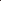
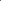
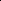
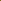
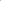
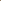

# Towards Spatially Consistent Image Generation: On Incorporating Intrinsic Scene Properties into Diffusion Models

<!-- Page 1 -->

Towards Spatially Consistent Image Generation: On Incorporating

Intrinsic Scene Properties into Diffusion Models

Hyundo Lee1, Suhyung Choi1, Inwoo Hwang2†, Byoung-Tak Zhang1†

1AI Institute, Seoul National University 2Columbia University {hdlee, schoi}@bi.snu.ac.kr, inwoo.hwang@columbia.edu, btzhang@bi.snu.ac.kr

## Abstract

Image generation models trained on large datasets can synthesize high-quality images but often produce spatially inconsistent and distorted images due to limited information about the underlying structures and spatial layouts. In this work, we leverage intrinsic scene properties (e.g., depth, segmentation maps) that provide rich information about the underlying scene, unlike prior approaches that solely rely on imagetext pairs or use intrinsics as conditional inputs. Our approach aims to co-generate both images and their corresponding intrinsics, enabling the model to implicitly capture the underlying scene structure and generate more spatially consistent and realistic images. Specifically, we first extract rich intrinsic scene properties from a large image dataset with pre-trained estimators, eliminating the need for additional scene information or explicit 3D representations. We then aggregate various intrinsic scene properties into a single latent variable using an autoencoder. Building upon pre-trained large-scale Latent Diffusion Models (LDMs), our method simultaneously denoises the image and intrinsic domains by carefully sharing mutual information so that the image and intrinsic reflect each other without degrading image quality. Experimental results demonstrate that our method corrects spatial inconsistencies and produces a more natural layout of scenes while maintaining the fidelity and textual alignment of the base model (e.g., Stable Diffusion).

Extended version — https://arxiv.org/abs/2508.10382

## Introduction

Recent text-to-image (T2I) generation models, notably diffusion models (Ho, Jain, and Abbeel 2020; Dhariwal and Nichol 2021; Saharia et al. 2022; Rombach et al. 2022), have shown remarkable success in producing diverse and realistic images. However, these models often produce images with spatial inconsistencies—such as distorted object geometry or implausible scene layouts as in Fig. 1—due to their reliance on pixel-level supervision and lack of structured scene understanding (Podell et al. 2023). To overcome

Copyright © 2026, Association for the Advancement of Artificial Intelligence (www.aaai.org). All rights reserved. †Corresponding authors.

this, richer and more structured representations beyond pixels are needed to guide the generation process to generate more spatially coherent images.

A natural remedy is to incorporate explicit 3D scene information (e.g. point clouds, meshes) into the generative process (Luo and Hu 2021; Jun and Nichol 2023). While effective in grounding geometry, the high cost of data acquisition and rendering limits its scalability and diversity. Additionally, the reliance on explicit 3D structure makes them illsuited for abstract, stylized, or artistic scenes. An alternative approach is to leverage intrinsic scene properties (or simply intrinsics)—such as depth, surface normals, or segmentation maps—which offer structured, complementary views of the same scene. Here, we use the term intrinsics in the sense of Barrow et al. (1978), referring to image-inherent scene attributes rather than camera intrinsics in multi-view geometry. However, prior work leveraging intrinsics has not aimed to improve spatial consistency, but rather focused on conditional generation given external intrinsic inputs (Zhang, Rao, and Agrawala 2023). This reliance on additional signals limits their applicability to general T2I generation and fails to model the underlying scene structure.

To address this issue, we propose a new approach that improves spatial consistency by jointly modeling both images and their intrinsic scene properties. As illustrated in Fig. 1, intrinsics provide complementary geometric and semantic cues that help delineate object boundaries and spatial layouts, especially in perceptually ambiguous regions. By learning a joint distribution over images and intrinsics, our model captures multiple structured views of a scene, thereby significantly reducing spatial inconsistencies in the generation process. In contrast to conditional approaches that model a unidirectional relationship, our joint modeling allows intrinsics and images to regularize each other during training. Incorporating intrinsics also offers practical advantages: they can be efficiently extracted from large-scale 2D datasets using pre-trained models, without the need for 3D data or manual labeling. Moreover, since large T2I models implicitly contain intrinsic knowledge (Du et al. 2023; Zhan et al. 2023; El Banani et al. 2024), we leverage this capacity with only minimal adjustments, without compromising the quality and capabilities of the original model.

To this end, we propose Intrinsic Latent Diffusion Models (I-LDM), which extend existing T2I models (Rombach et al.

The Fortieth AAAI Conference on Artificial Intelligence (AAAI-26)

<!-- Page 2 -->

**Figure 1.** By co-generating images and aligned intrinsic scene properties, we aim to address the problem of spatial inconsistency prevalent in existing text-to-image models. (Gray) Paradoxical image generated by Stable Diffusion 2.1, including inconsistent wall, object (green circle), and floor (orange circle). (Beige) Our approach generates an image and intrinsic scene properties representing the scene from diverse perspectives, thereby producing a more natural and realistic image.

2022; Podell et al. 2023; Chen et al. 2024) to jointly generate images and their corresponding intrinsics. To enable efficient joint generation, we first train an autoencoder that encodes multiple intrinsic channels into a single latent space. Since naive fine-tuning might compromise the performance of the base model, we retain the architecture and weights for generating images while adopting LoRA weights (Hu et al. 2021) to generate intrinsics separately. Furthermore, we introduce a cross-domain weight scheduling mechanism that shares self-attention between the image and intrinsic domains during the denoising process, promoting alignment without introducing visual artifacts.

By learning from both perceptual and structural views of a scene, I-LDM produces more faithful and structured images without compromising the visual fidelity of strong base models. We evaluate our model under general text prompts and challenging multi-object arrangements, showing that I- LDM produces clearer separation and more realistic spatial layouts. We show that I-LDM generates more realistic images and achieves higher scores in human preference estimators while maintaining the fidelity and text alignment of the base model. Furthermore, we demonstrate that learning to co-generate intrinsics helps to model complex structures by providing consistent structural guidance in dynamic hand pose generation tasks.

## Related Work

## 2.1 Large-scale Diffusion Models

Recently, image synthesis has achieved remarkable results based on diffusion models (Esser et al. 2024; Sauer et al. 2024; Chen et al. 2024), which generate images by denoising random noise (Sohl-Dickstein et al. 2015; Song and Ermon 2019; Ho, Jain, and Abbeel 2020). Diffusion models have evolved to enable natural language-based control (Saharia et al. 2022; Nichol et al. 2021; Ho and Salimans 2022) using language models such as CLIP (Radford et al. 2021). Latent diffusion models (LDMs) (Rombach et al. 2022) apply perceptual compression via VQ-VAE (Razavi, Van den Oord, and Vinyals 2019) to learn the denoising process in perceptually compressed latent space, facilitating high-resolution image synthesis. Models such as DALL-E (Shi et al. 2020) or Stable Diffusion (Rombach et al. 2022; Podell et al. 2023) have been trained on large-scale text-image pair datasets containing billions of examples, allowing them to generate images conditioned on general natural language without restricting domains (Schuhmann et al. 2022). Our work is based on production-ready Stable Diffusion models, using fine-tuning techniques with LoRA (Hu et al. 2021) to maintain their quality and capability.

## 2.2 Reflecting Physical Structure in LDMs

Diffusion models trained on pairs of text images struggle to accurately capture the physical structures and spatial layout of scenes, occasionally producing distorted or inconsistent images (Podell et al. 2023; Shen et al. 2024). One solution is to incorporate 3D data (Luo and Hu 2021; Zhou, Du, and Wu 2021; Jun and Nichol 2023), such as point clouds (Chang et al. 2015), CAD models (Wu et al. 2015), or polygonal meshes (Deitke et al. 2023, 2024). Despite effectively capturing geometry, this approach is limited to specific objects and struggles with general or abstract text prompts due to the high cost and inflexibility of 3D data. Instead, we leverage intrinsic scene properties to capture underlying structures while maintaining flexibility for diverse textual inputs.

In image generation, intrinsic scene properties (Barrow et al. 1978) have been widely used as conditional controls, including SDEdit (Meng et al. 2021), sketch-guided generation (Voynov, Aberman, and Cohen-Or 2023), and Control- Net (Zhang, Rao, and Agrawala 2023), focusing on aligning outputs to given intrinsic conditions. In contrast, we aim to co-generate intrinsics alongside images, enabling the model to learn and reflect the distribution of underlying scenes.

AI-readable visual equivalent, added: Figure extracted from the paper PDF and converted to an SVG wrapper asset. Use the surrounding page text and caption for interpretation.

AI-readable visual equivalent, added: Figure extracted from the paper PDF and converted to an SVG wrapper asset. Use the surrounding page text and caption for interpretation.

AI-readable visual equivalent, added: Figure extracted from the paper PDF and converted to an SVG wrapper asset. Use the surrounding page text and caption for interpretation.

AI-readable visual equivalent, added: Figure extracted from the paper PDF and converted to an SVG wrapper asset. Use the surrounding page text and caption for interpretation.

AI-readable visual equivalent, added: Figure extracted from the paper PDF and converted to an SVG wrapper asset. Use the surrounding page text and caption for interpretation.

AI-readable visual equivalent, added: Figure extracted from the paper PDF and converted to an SVG wrapper asset. Use the surrounding page text and caption for interpretation.

AI-readable visual equivalent, added: Figure extracted from the paper PDF and converted to an SVG wrapper asset. Use the surrounding page text and caption for interpretation.

<!-- Page 3 -->

**Figure 2.** The overall architecture of I-LDM. (Left) We first train an intrinsic VAE to encode all intrinsics into a single latent variable. (Middle) Then, we train the LoRA weights of the self-attention layers included in the diffusion network of the intrinsic domain to learn the denoising process. (Right) We employ a weight scheduling mechanism for exchanging self-attention with the image domain. As a result, I-LDM simultaneously generates spatially consistent images and intrinsics during inference.

Recent studies also explore generating intrinsics from images using diffusion models, including depth maps and surface normals (Fu et al. 2025; Ji et al. 2023; Saxena et al. 2023; Qiu et al. 2024; Ke et al. 2024), segmentation maps (Amit et al. 2021; Li et al. 2023; Nguyen et al. 2024), and other scene properties (Du et al. 2023). However, our goal is not to reconstruct exact geometry, but to guide image generation by jointly modeling intrinsic and image domains, using only text conditions.

A prior approach generates surface normals from noise using GANs and then conditions image synthesis on them (Wang and Gupta 2016). However, generating intrinsics without considering the image domain can lead to spatial inconsistencies, as they lack awareness of the full scene. Another related line of work is LDM3D (Stan et al. 2023), which generates depth maps aligned with images from text. However, their primary goal is to generate RGB-D images and 360◦views. In contrast, we focus on enhancing spatial consistency by jointly modeling image and intrinsic representations during generation. We empirically compare our method with these prior approaches to validate the effectiveness in improving spatial consistency and image quality.

## Method

In this section, we utilize intrinsics to reflect the underlying scene in generated images more faithfully. The theoretical motivation is discussed in Appendix A. We first present our model architecture, which incorporates cross-domain selfattention and a weight scheduling mechanism to co-generate images and aligned intrinsics without compromising image quality. We then introduce a practical approach for handling multiple intrinsics simultaneously.

## 3.1 Intrinsic Latent Diffusion Model

In this work, we consider four intrinsic scene properties; depth map, surface normal, segmentation map, and line drawing. A straightforward way to generate an imageintrinsic pair (x, i) given a text condition c is to augment pre-trained T2I models with intrinsic features—either by adding extra channels or using spatial addition—and finetune them. However, we found that this significantly harms the image quality, as demonstrated in Sec. 4.1.

Instead, we propose an method using a large LDM model consisting of self-attention layers (e.g., Stable Diffusion (Rombach et al. 2022; Podell et al. 2023), PixArt (Chen et al. 2024)) as a base model that fully exploits its capabilities without compromising its quality. As depicted in Fig. 2, we devise separate models for the image domain and the intrinsic domain, preserving the architecture and weights the same as the base model for the image domain. To train the intrinsic domain, we adapt LoRA (Hu et al. 2021) to finetune only the attention layers, leveraging the inherent knowledge of the intrinsics (Du et al. 2023; Zhan et al. 2023).

Second, we employ cross-domain self-attention (Fu et al. 2025) to align the spatial arrangements between the two domains and allow them to reflect each other’s information. Specifically, we concatenate the keys and values from the self-attention layers at the same stage as follows:

qx = Qx · zx, qi = Qi · zi, kx = ki = (Kx · zx) ⊕(Ki · zi), vx = vi = (Vx · zx) ⊕(Vi · zi),

(1)

where the subscript x, i denotes each domain, z denotes intermediate representations, ⊕denotes concatenation, q, k, v denotes the query, key, and value, and Q, K, V denotes the corresponding weight matrix.

AI-readable visual equivalent, added: Figure extracted from the paper PDF and converted to an SVG wrapper asset. Use the surrounding page text and caption for interpretation.

<!-- Page 4 -->

**Figure 3.** Qualitative analysis of generated images and co-generated intrinsic scene properties from I-LDM (clockwise from top left: depth map, surface normal, line drawing, and segmentation map). The red boxes indicate generated images of the base model. The top and bottom rows visualize samples with Drop and Gaussian weight scheduling, respectively. Red and blue captions denote samples from the Parti and Multi prompts, respectively.

Importantly, we introduce a weight scheduling mechanism for cross-domain self-attention, i.e., w(l,t), in contrast to prior work without weighting (Fu et al. 2025). This is because we found that the received information from the intrinsic model during image sampling often incurs undesirable artifacts in the generated image, leading to a significant degradation in image quality. Therefore, we introduce the scheduling of the weight of the exchanged key and values across domains for each block index l and each timestep t. Specifically, we fix the weight to 1 during training, while introducing two different weight scheduling strategies during sampling, Drop and Gaussian, as follows:

(Drop) w(l,t)

d =

1 if (l ∈L) ∧(t ≤τ), 0 otherwise, (2)

(Gaussian) w(l,t)

g = α · exp(−(t −τ)2/σ2), (3) where L, τ, σ, α are hyperparameters. We then change the self-attention process as follows:

Attn(l,t)

x = softmax qx · kT x √dk

+ log

W (l,t)

vx,

Attni = softmax

(qi · kT i)/ p dk vi,

(4)

where dk denotes the inner dimension of q, k, and W (l,t) denotes a N × 2N weight matrix where the first through N columns are filled with 1, and the N+1 through 2N columns are filled with w(l,t). The difference from the original image denoising process is that the intrinsic model affects the image model with a weight w(l,t) by passing its intermediate key and value vectors. We assign a low weight to the outer blocks of the diffusion network and for low t, where relatively fine-grained detail is denoised. We also assign low weight to very early steps of the denoising process, which greatly impacts the image. This adjustment allows us to mitigate the influence of artifacts on images, thereby preserving the quality of the generated images.

For the loss function, we use the conventional DDPM loss to train LoRA weights θ′ in the network ϵθ,θ′ = ϵ(x)

θ,θ′, ϵ(i)

θ,θ′ for the image and intrinsic domains separately, with assigning a balancing factor of λ:

L = Ex0,i0,c,ϵx,ϵi,t[||ϵ(x)

θ,θ′(xt, it, t, c) −ϵx||2

2

+λ·||ϵ(i)

θ,θ′(xt, it, t, c) −ϵi||2

2], (5)

where θ is the parameters of the base model, and xt, it denotes encoded x0, i0 with mixed noise ϵx, ϵi respectively. Thus, we train θ′ not only to generate intrinsics but also to provide useful information to the image by reducing ||ϵ(x)

θ,θ′ −ϵx||2

2. We independently sample ϵx and ϵi during the training and use the same ϵ during sampling.

## 3.2 Intrinsic Space Encoding

While incorporating various intrinsics enriches scene understanding, increasing their number introduces two main challenges: (1) higher training and sampling overhead, and (2) learning difficulty due to distributional mismatch between intrinsics and images. For instance, random noise sampled from a standard normal distribution tends to generate unnatural surface normals, where most pixels are green or blue (Du et al. 2023; Lin et al. 2024). We analyze the latent distribution for images and intrinsics in Appendix D.

To address this, we train an intrinsic VAE that encodes all intrinsics into a shared latent variable with the same dimensionality as the base model. This is achieved by extending the base VAE with additional CNN channels and finetuning it. During training, we randomly zero out individual intrinsics to prevent any particular intrinsic from being encoded dominantly, ensuring that the encoded latent representation reflects information from all intrinsics. As a result, our method enables efficient two-pass denoising for images and intrinsics, reducing memory from cross-domain attention. It also aligns intrinsic and image distributions, allowing minimal LoRA weight adjustments and eliminating the need for zero terminal SNR (Lin et al. 2024). Ablations of intrinsic VAE are presented in Tab. 5.

AI-readable visual equivalent, added: Figure extracted from the paper PDF and converted to an SVG wrapper asset. Use the surrounding page text and caption for interpretation.

AI-readable visual equivalent, added: Figure extracted from the paper PDF and converted to an SVG wrapper asset. Use the surrounding page text and caption for interpretation.

AI-readable visual equivalent, added: Figure extracted from the paper PDF and converted to an SVG wrapper asset. Use the surrounding page text and caption for interpretation.

AI-readable visual equivalent, added: Figure extracted from the paper PDF and converted to an SVG wrapper asset. Use the surrounding page text and caption for interpretation.

AI-readable visual equivalent, added: Figure extracted from the paper PDF and converted to an SVG wrapper asset. Use the surrounding page text and caption for interpretation.

AI-readable visual equivalent, added: Figure extracted from the paper PDF and converted to an SVG wrapper asset. Use the surrounding page text and caption for interpretation.

AI-readable visual equivalent, added: Figure extracted from the paper PDF and converted to an SVG wrapper asset. Use the surrounding page text and caption for interpretation.

AI-readable visual equivalent, added: Figure extracted from the paper PDF and converted to an SVG wrapper asset. Use the surrounding page text and caption for interpretation.

AI-readable visual equivalent, added: Figure extracted from the paper PDF and converted to an SVG wrapper asset. Use the surrounding page text and caption for interpretation.

AI-readable visual equivalent, added: Figure extracted from the paper PDF and converted to an SVG wrapper asset. Use the surrounding page text and caption for interpretation.

AI-readable visual equivalent, added: Figure extracted from the paper PDF and converted to an SVG wrapper asset. Use the surrounding page text and caption for interpretation.

AI-readable visual equivalent, added: Figure extracted from the paper PDF and converted to an SVG wrapper asset. Use the surrounding page text and caption for interpretation.

AI-readable visual equivalent, added: Figure extracted from the paper PDF and converted to an SVG wrapper asset. Use the surrounding page text and caption for interpretation.

AI-readable visual equivalent, added: Figure extracted from the paper PDF and converted to an SVG wrapper asset. Use the surrounding page text and caption for interpretation.

AI-readable visual equivalent, added: Figure extracted from the paper PDF and converted to an SVG wrapper asset. Use the surrounding page text and caption for interpretation.

AI-readable visual equivalent, added: Figure extracted from the paper PDF and converted to an SVG wrapper asset. Use the surrounding page text and caption for interpretation.

AI-readable visual equivalent, added: Figure extracted from the paper PDF and converted to an SVG wrapper asset. Use the surrounding page text and caption for interpretation.

AI-readable visual equivalent, added: Figure extracted from the paper PDF and converted to an SVG wrapper asset. Use the surrounding page text and caption for interpretation.

AI-readable visual equivalent, added: Figure extracted from the paper PDF and converted to an SVG wrapper asset. Use the surrounding page text and caption for interpretation.

AI-readable visual equivalent, added: Figure extracted from the paper PDF and converted to an SVG wrapper asset. Use the surrounding page text and caption for interpretation.

AI-readable visual equivalent, added: Figure extracted from the paper PDF and converted to an SVG wrapper asset. Use the surrounding page text and caption for interpretation.

AI-readable visual equivalent, added: Figure extracted from the paper PDF and converted to an SVG wrapper asset. Use the surrounding page text and caption for interpretation.

AI-readable visual equivalent, added: Figure extracted from the paper PDF and converted to an SVG wrapper asset. Use the surrounding page text and caption for interpretation.

AI-readable visual equivalent, added: Figure extracted from the paper PDF and converted to an SVG wrapper asset. Use the surrounding page text and caption for interpretation.

AI-readable visual equivalent, added: Figure extracted from the paper PDF and converted to an SVG wrapper asset. Use the surrounding page text and caption for interpretation.

AI-readable visual equivalent, added: Figure extracted from the paper PDF and converted to an SVG wrapper asset. Use the surrounding page text and caption for interpretation.

AI-readable visual equivalent, added: Figure extracted from the paper PDF and converted to an SVG wrapper asset. Use the surrounding page text and caption for interpretation.

AI-readable visual equivalent, added: Figure extracted from the paper PDF and converted to an SVG wrapper asset. Use the surrounding page text and caption for interpretation.

AI-readable visual equivalent, added: Figure extracted from the paper PDF and converted to an SVG wrapper asset. Use the surrounding page text and caption for interpretation.

AI-readable visual equivalent, added: Figure extracted from the paper PDF and converted to an SVG wrapper asset. Use the surrounding page text and caption for interpretation.

AI-readable visual equivalent, added: Figure extracted from the paper PDF and converted to an SVG wrapper asset. Use the surrounding page text and caption for interpretation.

AI-readable visual equivalent, added: Figure extracted from the paper PDF and converted to an SVG wrapper asset. Use the surrounding page text and caption for interpretation.

AI-readable visual equivalent, added: Figure extracted from the paper PDF and converted to an SVG wrapper asset. Use the surrounding page text and caption for interpretation.

AI-readable visual equivalent, added: Figure extracted from the paper PDF and converted to an SVG wrapper asset. Use the surrounding page text and caption for interpretation.

AI-readable visual equivalent, added: Figure extracted from the paper PDF and converted to an SVG wrapper asset. Use the surrounding page text and caption for interpretation.

AI-readable visual equivalent, added: Figure extracted from the paper PDF and converted to an SVG wrapper asset. Use the surrounding page text and caption for interpretation.

<!-- Page 5 -->

**Figure 4.** Comparison of base and I-LDM with generated intrinsics, providing key cues for reducing spatial inconsistencies.

## 4 Experiments

Here, we investigate the effectiveness of intrinsics with I- LDM for generating natural and spatially consistent images. Experimental details are provided in Appendix C.

Metrics. Our goal is to alleviate spatial inconsistencies by accurately reflecting the underlying scene while maintaining the quality and capability of the base model. However, precisely quantifying spatial inconsistency is inherently challenging, as ground-truth structural annotations do not exist for synthesized images. For this, we first utilize metrics based on human preference prediction, including ImageReward (IR) (Xu et al. 2024) and Human Preference Score (HPSv2) (Wu et al. 2023). To further assess the improvement in spatial inconsistency, we evaluate AI preference using GPT-4o, asking which image better reflects the actual physical scene between the base model and ours. Finally, to evaluate whether our method maintains the capability of the base diffusion model, we employ conventional CMMD (Jayasumana et al. 2024) and CLIP score (Hessel et al. 2021) to measure fidelity and text alignment, respectively. We measure the distribution discrepancy for CMMD in Sec. 4.1 by comparing with images from the base model, as real images are not available in this setting. This allows us to assess how well each method preserves the base model’s quality, rather than indicating improvements over it.

Baselines. We employ Stable Diffusion 2.1 (SD2.1) as a pre-trained base model (Rombach et al. 2022). Comparison of its configuration with ours in terms of model size, inference time, and memory usage is in Tab. 6. For baselines, we first implement LDM3D (Stan et al. 2023) based on SD2.1, training a VAE to encode both images and depth into the existing latent space, and then fine-tune UNet. We also extend this method with four intrinsics that we use, denoted as LDM3D+. We also consider a naive method that adds extra CNN channels for intrinsics to the UNet and fine-tunes it (+CNN), and a variant that injects intrinsic features via spatial addition using the ControlNet architecture (+Spatial- Add). To compare with a two-stage generation approach, we first generate single or multiple intrinsics from text using our intrinsic LDM trained without images, and then use them to condition image generation via ControlNet, denoted as ControlNet-(Intrinsic). Finally, we evaluate base models with doubled sampling steps (denoted as ×2).

Implementation details. For the training dataset, we use a subset of 542k images with aesthetic scores of 6.5 or higher from LAION-5B dataset (Schuhmann et al. 2022) in which the base model was trained. To estimate intrinsics, we use Metric3D (Hu et al. 2024) for depth maps and surface normals, SAM (Ravi et al. 2024) for segmentation maps, and a publicly available image-to-line drawing model. For training intrinsic VAE, we zero-mask each intrinsic with a probability of 0.1. To train the denoising process in the intrinsic domain, we adapt LoRA to self-attention weights with rank 32. The resolution of the images for training is set to 512×512, and 768×768 for sampling. All images were sampled with the CFG scale 7.5 and the sampling steps 25 (50 steps for ×2). For the hyperparameters of our model in Eq. (2), we set τ = 900, L = {3, 4, 5, 6, 7} for wd, α = 1, τ = 800, σ = 100 for wg.

## 4.1 Learning Intrinsics on T2I Generation

We perform two tasks to evaluate the quality and spatial consistency of T2I generation with and without learning intrinsics. First, we assess general text conditions using images generated from Parti prompts (Parti) (Yu et al. 2022), designed to test capability across various categories and challenges. However, some prompts are too abstract or simple to evaluate spatial inconsistency (e.g., “energy” or “an orange”). Therefore, we design a second task, the multiple objects prompts (Multi), which constructs complex scenes where structural distortion can be more pronounced by placing many objects. We randomly sample 3 to 5 classes from the MS-COCO dataset (Lin et al. 2014) and one place from Places365 (Zhou et al. 2017), and construct 1,000 prompts in the format “{class1}s and {class2}s and... in a {place}”.

Tabs. 1 and 2 and Fig. 3 summarize both quantitative metrics and qualitative results on the Parti and Multi prompts.

AI-readable visual equivalent, added: Figure extracted from the paper PDF and converted to an SVG wrapper asset. Use the surrounding page text and caption for interpretation.

AI-readable visual equivalent, added: Figure extracted from the paper PDF and converted to an SVG wrapper asset. Use the surrounding page text and caption for interpretation.

AI-readable visual equivalent, added: Figure extracted from the paper PDF and converted to an SVG wrapper asset. Use the surrounding page text and caption for interpretation.

AI-readable visual equivalent, added: Figure extracted from the paper PDF and converted to an SVG wrapper asset. Use the surrounding page text and caption for interpretation.

AI-readable visual equivalent, added: Figure extracted from the paper PDF and converted to an SVG wrapper asset. Use the surrounding page text and caption for interpretation.

AI-readable visual equivalent, added: Figure extracted from the paper PDF and converted to an SVG wrapper asset. Use the surrounding page text and caption for interpretation.

AI-readable visual equivalent, added: Figure extracted from the paper PDF and converted to an SVG wrapper asset. Use the surrounding page text and caption for interpretation.

AI-readable visual equivalent, added: Figure extracted from the paper PDF and converted to an SVG wrapper asset. Use the surrounding page text and caption for interpretation.

AI-readable visual equivalent, added: Figure extracted from the paper PDF and converted to an SVG wrapper asset. Use the surrounding page text and caption for interpretation.

AI-readable visual equivalent, added: Figure extracted from the paper PDF and converted to an SVG wrapper asset. Use the surrounding page text and caption for interpretation.

AI-readable visual equivalent, added: Figure extracted from the paper PDF and converted to an SVG wrapper asset. Use the surrounding page text and caption for interpretation.

AI-readable visual equivalent, added: Figure extracted from the paper PDF and converted to an SVG wrapper asset. Use the surrounding page text and caption for interpretation.

AI-readable visual equivalent, added: Figure extracted from the paper PDF and converted to an SVG wrapper asset. Use the surrounding page text and caption for interpretation.

AI-readable visual equivalent, added: Figure extracted from the paper PDF and converted to an SVG wrapper asset. Use the surrounding page text and caption for interpretation.

AI-readable visual equivalent, added: Figure extracted from the paper PDF and converted to an SVG wrapper asset. Use the surrounding page text and caption for interpretation.

AI-readable visual equivalent, added: Figure extracted from the paper PDF and converted to an SVG wrapper asset. Use the surrounding page text and caption for interpretation.

AI-readable visual equivalent, added: Figure extracted from the paper PDF and converted to an SVG wrapper asset. Use the surrounding page text and caption for interpretation.

AI-readable visual equivalent, added: Figure extracted from the paper PDF and converted to an SVG wrapper asset. Use the surrounding page text and caption for interpretation.

<!-- Page 6 -->

Parti prompt Multiple objects

## Method

CMMD(↓) CLIP(↑) ImageReward(↑) HPSv2(↑) CMMD(↓) CLIP(↑) ImageReward(↑) HPSv2(↑)

Base - 0.2725 0.2998 0.2497 - 0.2671 -0.7389 0.2355 Base ×2 0.00488 0.2726 0.3647 0.2548 0.00763 0.2676 -0.7342 0.2395 Base +CNN 1.07265 0.2164 -1.5378 0.1713 2.51353 0.1986 -1.8801 0.1650 Base +SpatialAdd 0.39911 0.2413 -0.7374 0.2058 1.12689 0.2214 -1.5315 0.1807 LDM3D 0.57590 0.2693 0.1254 0.2349 1.20401 0.2472 -1.0290 0.2096 LDM3D+ 0.11885 0.2644 0.0499 0.2357 0.33486 0.2575 -0.6855 0.2298 ControlNet-Norm 0.04578 0.2697 0.3444 0.2548 0.11182 0.2599 -0.6445 0.2388 ControlNet-Seg 0.08571 0.2672 0.3144 0.2550 0.36383 0.2521 -0.6504 0.2340 ControlNet-All 0.20289 0.2671 0.2900 0.2549 0.47350 0.2540 -0.6877 0.2342 I-LDM (Drop) 0.02074 0.2717 0.3843 0.2560 0.03707 0.2664 -0.6148 0.2461 I-LDM (Gaussian) 0.01538 0.2739 0.4416 0.2582 0.08228 0.2687 -0.5739 0.2450

**Table 1.** Quantitative results on generated images for each prompt in Parti and Multi prompts. The evaluation is conducted using images sampled from three seeds for each prompt. The best result is bolded, and the second-best result is underlined.

Parti prompt Multiple objects

## Method

Ours(↑) Tie Base(↓) Ours(↑) Tie Base(↓)

I-LDM (D) 41.9% 32.8% 25.2% 47.7% 36.6% 15.7% I-LDM (G) 41.0% 34.9% 24.1% 44.3% 39.4% 16.3%

**Table 2.** LLM evaluation of spatial consistency between images generated by the base model and ours. Ours, Tie, Base denote GPT-4o preference percentages.

## Method

Resolution CMMD(↓) CLIP(↑) ImageReward(↑) HPSv2(↑)

I-LDM (D)

256 0.02027 0.2732 0.4572 0.2590 384 0.02122 0.2739 0.5129 0.2606 512 0.02730 0.2717 0.4719 0.2622

I-LDM (G)

256 0.01431 0.2742 0.4960 0.2606 384 0.01466 0.2756 0.5311 0.2618 512 0.01633 0.2741 0.4803 0.2611

**Table 3.** Quantitative results on downscaling the intrinsic resolution provided by the intrinsic estimators for training.

Compared to the base model and other intrinsic-based approaches, learning to co-generate multiple intrinsics leads to better alignment with the physical structure of the scene without compromising image quality (see Appendix G.2 for detailed baseline analysis). Fig. 4 emphasizes that the base model may misrepresent the physical relationship between each object and incorrectly represent the boundaries of objects. In contrast, the intrinsics generated by our method clearly distinguish and reflect them in the image, resulting in a more accurate representation.

While our method reflects valuable information from the intrinsic, we emphasize that it also protects from the effects of ambiguities or inaccuracies from the intrinsic domain.

Preserving diversity. Although abstract scenes can be difficult to represent using geometric intrinsics, such as the ”black hole” example in Fig. 3, we demonstrate that our approach does not constrain the diversity of the base model. This is quantitatively supported by maintaining CMMD and CLIP scores across various textual conditions provided by Parti prompts. Analysis on various categories and challenges is reported in Appendix G.1. This is achieved by disentangling the latent representations of images and intrinsics, enabling diversity of images beyond geometric constraints.

**Figure 5.** Comparison of the base model and I-LDM with Drop, Gaussian, and no weight scheduling.

Robustness to inaccurate intrinsics. An intriguing property of our framework is that we utilize existing intrinsic estimators without the additional cost of data collection. To investigate how our model performs given an imperfect intrinsic estimation, we downscale the resolution of the intrinsic for training. Tab. 3 shows that our model is robust to such errors or noises from intrinsic estimators. Moreover, Fig. 9 in Appendix F shows that meaningful information can still be exchanged despite misalignment across domains. This is due to the design of cross-domain self-attention process (Eq. (4)), which estimates cross-domain attention within the entire set of patches rather than just the same region.

Drop vs. Gaussian. Analysis of different weight scheduling are visualized in Fig. 5. With drop scheduling, there is a tendency to improve fine-grained details while maintaining the overall composition of the image. In contrast, Gaussian scheduling typically adjusts the overall image composition. On the other hand, completely removing the weight scheduling from the inference process degrades the quality of the images. However, fine-tuning approaches (+CNN, +Spatial- Add, LDM3D) suffer from severe image degradation and do not provide meaningful improvements in spatial inconsistency. See Appendix G.3 for further analysis.

## 4.2 Complex Hand Structure Generation

The human hand, with its intricate articulations that result in highly complex structures and self-occlusions, is a well-

AI-readable visual equivalent, added: Figure extracted from the paper PDF and converted to an SVG wrapper asset. Use the surrounding page text and caption for interpretation.

AI-readable visual equivalent, added: Figure extracted from the paper PDF and converted to an SVG wrapper asset. Use the surrounding page text and caption for interpretation.

AI-readable visual equivalent, added: Figure extracted from the paper PDF and converted to an SVG wrapper asset. Use the surrounding page text and caption for interpretation.

AI-readable visual equivalent, added: Figure extracted from the paper PDF and converted to an SVG wrapper asset. Use the surrounding page text and caption for interpretation.

<!-- Page 7 -->

## Method

CMMD(↓) HPSv2(↑) Detection(↑) Confidence(↑)

Base (Rombach et al. 2022) 0.7222 0.1475 29.82% 0.9310 Base ×2 0.6906 0.1472 30.22% 0.9271 I-LDM (Drop) 0.7750 0.1487 28.20% 0.9242 I-LDM (Gauss) 0.7051 0.1506 39.40% 0.9384

**Table 4.** Quantitative results on 1000 generated images trained with InterHand samples. The best result is bolded.

CMMD(↓) CLIP(↑) ImageReward(↑) HPSv2(↑)

I-LDM 0.01633 0.2741 0.4803 0.2611 - Depth 0.01144 0.2720 0.3914 0.2578 - Normal 0.01299 0.2742 0.4655 0.2592 - Line 0.01919 0.2746 0.5074 0.2615 - Segment 0.01872 0.2727 0.4302 0.2590

-w(l,t) 0.05460 0.2706 0.3852 0.2556 -VAE 0.01836 0.2702 0.3545 0.2551 LoRA-only 0.03314 0.2747 0.3617 0.2493 +resolution 0.08452 0.2640 0.1240 0.2470 +wtrain 0.03827 0.2716 0.3920 0.2552

**Table 5.** Results on ablating each intrinsic, model settings.

known example of a particularly challenging object to synthesize. We investigate how learning intrinsics affect the generation of such complex structures. First, since the base model tends to generate hand images with limited poses, we generate diverse and complex poses by training a dataset with various hand poses. Specifically, we extract 3,493 distinct samples from InterHand dataset (Moon et al. 2020). We then train the base model by applying LoRA without any annotations or additional information. The prompt is fixed as “A close-up of a hand with a black background”. We use a hand detection model (Zhang et al. 2020) to measure the detection rate and confidence scores for detected cases, assessing whether generated hands follow an accurate structure.

We applied hand LoRA trained on the base model to the image domain of I-LDM to investigate how learned intrinsic information affects the generation of hands with dynamic poses. Tab. 4 and visualizations in Appendix H summarize the experimental results, which show that reflecting intrinsics substantially improves the generation of accurate hand structures. This experiment supports our claim that incorporating intrinsics helps generate complex structures.

## 4.3 Adapting I-LDM to Other Base Models

To verify the applicability of our method with more scalable or different architectures, we additionally implement I-LDM based on SDXL (Podell et al. 2023) with 2.5B parameters and based on PixArt-α (Chen et al. 2024) with DiT architecture (Peebles and Xie 2023). Fig. 6 visualizes the qualitative results of our model. Samples with SDXL demonstrate that even with a more scalable base model, there are still spatial inconsistencies that I-LDM alleviates. The example of PixArt-α also shows that our method is generally applicable to Transformer-based architectures. For quantitative analysis and more qualitative results, see Appendices E.2 and G.3.

## 4.4 Ablation Study and Analysis

We perform ablation studies on each intrinsic and the training and sampling settings. Evaluations are performed on

**Figure 6.** Examples of generated images of I-LDM using SDXL and PixArt-α as base models.

Parti prompts, using w(l,t)

g unless specifically noted. More detailed analysis including visualizations are provided in Appendix I and Appendix J.

Effects of each intrinsic scene properties. First, we perform an ablation study on each intrinsic scene property that composes I-LDM. Tab. 5 summarizes the effect of ablating each intrinsic, indicating that learning for each intrinsic shows meaningful improvement. While line drawing has a small negative effect on metrics, we qualitatively observe that it enhances the generation of object shapes.

Ablations on training settings. Next, we conduct an ablation study on the training and sampling process. As shown in Tab. 5, removing weight scheduling causes noticeable artifacts from the intrinsic domain, and excluding the intrinsic VAE results in inconsistent intrinsic generation. Training LoRA weights without image domain degrades intrinsic quality due to lack of image domain information. Additionally, using scheduling weights or increasing the resolution to 768×768 during training negatively impacts image quality.

## 5 Conclusion

To mitigate spatial inconsistencies in image generation, we proposed learning intrinsic scene properties aligned with the images. We presented I-LDM, a model that jointly generates images and intrinsics (i.e. depth map, surface normal, line drawing and segmentation map). We carefully designed our architecture to share valuable self-attention information between the image and the intrinsics while preserving the quality and capabilities of the base model. Experimental results on Parti, Multi prompts, and InterHand demonstrated the effectiveness of our approach.

AI-readable visual equivalent, added: Figure extracted from the paper PDF and converted to an SVG wrapper asset. Use the surrounding page text and caption for interpretation.

AI-readable visual equivalent, added: Figure extracted from the paper PDF and converted to an SVG wrapper asset. Use the surrounding page text and caption for interpretation.

AI-readable visual equivalent, added: Figure extracted from the paper PDF and converted to an SVG wrapper asset. Use the surrounding page text and caption for interpretation.

AI-readable visual equivalent, added: Figure extracted from the paper PDF and converted to an SVG wrapper asset. Use the surrounding page text and caption for interpretation.

AI-readable visual equivalent, added: Figure extracted from the paper PDF and converted to an SVG wrapper asset. Use the surrounding page text and caption for interpretation.

AI-readable visual equivalent, added: Figure extracted from the paper PDF and converted to an SVG wrapper asset. Use the surrounding page text and caption for interpretation.

AI-readable visual equivalent, added: Figure extracted from the paper PDF and converted to an SVG wrapper asset. Use the surrounding page text and caption for interpretation.

AI-readable visual equivalent, added: Figure extracted from the paper PDF and converted to an SVG wrapper asset. Use the surrounding page text and caption for interpretation.

AI-readable visual equivalent, added: Figure extracted from the paper PDF and converted to an SVG wrapper asset. Use the surrounding page text and caption for interpretation.

AI-readable visual equivalent, added: Figure extracted from the paper PDF and converted to an SVG wrapper asset. Use the surrounding page text and caption for interpretation.

AI-readable visual equivalent, added: Figure extracted from the paper PDF and converted to an SVG wrapper asset. Use the surrounding page text and caption for interpretation.

AI-readable visual equivalent, added: Figure extracted from the paper PDF and converted to an SVG wrapper asset. Use the surrounding page text and caption for interpretation.

AI-readable visual equivalent, added: Figure extracted from the paper PDF and converted to an SVG wrapper asset. Use the surrounding page text and caption for interpretation.

AI-readable visual equivalent, added: Figure extracted from the paper PDF and converted to an SVG wrapper asset. Use the surrounding page text and caption for interpretation.

AI-readable visual equivalent, added: Figure extracted from the paper PDF and converted to an SVG wrapper asset. Use the surrounding page text and caption for interpretation.

AI-readable visual equivalent, added: Figure extracted from the paper PDF and converted to an SVG wrapper asset. Use the surrounding page text and caption for interpretation.

<!-- Page 8 -->

## Acknowledgements

This work was partly supported by the IITP (RS-2021- II212068-AIHub/10%, RS-2021-II211343-GSAI/10%, RS- 2022-II220951-LBA/15%, RS-2022-II220953-PICA/15%), NRF (RS-2024-00353991-SPARC/15%, RS-2023- 00274280-HEI/15%), KEIT (RS-2024-00423940/10%), and Gwangju Metropolitan City (Artificial intelligence industrial convergence cluster development project/10%) grant funded by the Korean government.

## References

Amit, T.; Shaharbany, T.; Nachmani, E.; and Wolf, L. 2021. Segdiff: Image segmentation with diffusion probabilistic models. arXiv preprint arXiv:2112.00390. Barrow, H.; Tenenbaum, J.; Hanson, A.; and Riseman, E. 1978. Recovering intrinsic scene characteristics. Comput. vis. syst, 2(3-26): 2. Chang, A. X.; Funkhouser, T.; Guibas, L.; Hanrahan, P.; Huang, Q.; Li, Z.; Savarese, S.; Savva, M.; Song, S.; Su, H.; et al. 2015. Shapenet: An information-rich 3d model repository. arXiv preprint arXiv:1512.03012. Chen, J.; YU, J.; GE, C.; Yao, L.; Xie, E.; Wang, Z.; Kwok, J.; Luo, P.; Lu, H.; and Li, Z. 2024. PixArt-α: Fast Training of Diffusion Transformer for Photorealistic Text-to-Image Synthesis. In ICLR. Deitke, M.; Liu, R.; Wallingford, M.; Ngo, H.; Michel, O.; Kusupati, A.; Fan, A.; Laforte, C.; Voleti, V.; Gadre, S. Y.; et al. 2024. Objaverse-xl: A universe of 10m+ 3d objects. NeurIPS, 36. Deitke, M.; Schwenk, D.; Salvador, J.; Weihs, L.; Michel, O.; VanderBilt, E.; Schmidt, L.; Ehsani, K.; Kembhavi, A.; and Farhadi, A. 2023. Objaverse: A universe of annotated 3d objects. In CVPR, 13142–13153. Dhariwal, P.; and Nichol, A. 2021. Diffusion models beat gans on image synthesis. NeurIPS, 34: 8780–8794. Du, X.; Kolkin, N.; Shakhnarovich, G.; and Bhattad, A. 2023. Generative models: What do they know? do they know things? let’s find out! arXiv preprint arXiv:2311.17137. El Banani, M.; Raj, A.; Maninis, K.-K.; Kar, A.; Li, Y.; Rubinstein, M.; Sun, D.; Guibas, L.; Johnson, J.; and Jampani, V. 2024. Probing the 3d awareness of visual foundation models. In CVPR, 21795–21806. Esser, P.; Kulal, S.; Blattmann, A.; Entezari, R.; M¨uller, J.; Saini, H.; Levi, Y.; Lorenz, D.; Sauer, A.; Boesel, F.; et al. 2024. Scaling rectified flow transformers for high-resolution image synthesis. Fu, X.; Yin, W.; Hu, M.; Wang, K.; Ma, Y.; Tan, P.; Shen, S.; Lin, D.; and Long, X. 2025. Geowizard: Unleashing the diffusion priors for 3d geometry estimation from a single image. In ECCV, 241–258. Springer. Hessel, J.; Holtzman, A.; Forbes, M.; Bras, R. L.; and Choi, Y. 2021. Clipscore: A reference-free evaluation metric for image captioning. arXiv preprint arXiv:2104.08718. Ho, J.; Jain, A.; and Abbeel, P. 2020. Denoising diffusion probabilistic models. NeurIPS, 33: 6840–6851.

Ho, J.; and Salimans, T. 2022. Classifier-free diffusion guidance. arXiv preprint arXiv:2207.12598. Hu, E. J.; Shen, Y.; Wallis, P.; Allen-Zhu, Z.; Li, Y.; Wang, S.; Wang, L.; and Chen, W. 2021. Lora: Low-rank adaptation of large language models. arXiv preprint arXiv:2106.09685. Hu, M.; Yin, W.; Zhang, C.; Cai, Z.; Long, X.; Chen, H.; Wang, K.; Yu, G.; Shen, C.; and Shen, S. 2024. Metric3D v2: A Versatile Monocular Geometric Foundation Model for Zero-shot Metric Depth and Surface Normal Estimation. arXiv preprint arXiv:2404.15506. Jayasumana, S.; Ramalingam, S.; Veit, A.; Glasner, D.; Chakrabarti, A.; and Kumar, S. 2024. Rethinking fid: Towards a better evaluation metric for image generation. In CVPR, 9307–9315. Ji, Y.; Chen, Z.; Xie, E.; Hong, L.; Liu, X.; Liu, Z.; Lu, T.; Li, Z.; and Luo, P. 2023. Ddp: Diffusion model for dense visual prediction. In ICCV, 21741–21752. Jun, H.; and Nichol, A. 2023. Shap-e: Generating conditional 3d implicit functions. arXiv preprint arXiv:2305.02463. Ke, B.; Obukhov, A.; Huang, S.; Metzger, N.; Daudt, R. C.; and Schindler, K. 2024. Repurposing diffusion-based image generators for monocular depth estimation. In CVPR, 9492– 9502. Li, Z.; Zhou, Q.; Zhang, X.; Zhang, Y.; Wang, Y.; and Xie, W. 2023. Open-vocabulary object segmentation with diffusion models. In ICCV, 7667–7676. Lin, S.; Liu, B.; Li, J.; and Yang, X. 2024. Common diffusion noise schedules and sample steps are flawed. In Proceedings of the IEEE/CVF winter conference on applications of computer vision, 5404–5411. Lin, T.-Y.; Maire, M.; Belongie, S.; Hays, J.; Perona, P.; Ramanan, D.; Doll´ar, P.; and Zitnick, C. L. 2014. Microsoft coco: Common objects in context. In ECCV, 740–755. Springer. Luo, S.; and Hu, W. 2021. Diffusion probabilistic models for 3d point cloud generation. In CVPR, 2837–2845. Meng, C.; He, Y.; Song, Y.; Song, J.; Wu, J.; Zhu, J.-Y.; and Ermon, S. 2021. Sdedit: Guided image synthesis and editing with stochastic differential equations. arXiv preprint arXiv:2108.01073. Moon, G.; Yu, S.-I.; Wen, H.; Shiratori, T.; and Lee, K. M. 2020. InterHand2.6M: A Dataset and Baseline for 3D Interacting Hand Pose Estimation from a Single RGB Image. In ECCV. Nguyen, Q.; Vu, T.; Tran, A.; and Nguyen, K. 2024. Dataset diffusion: Diffusion-based synthetic data generation for pixel-level semantic segmentation. NeurIPS, 36. Nichol, A.; Dhariwal, P.; Ramesh, A.; Shyam, P.; Mishkin, P.; McGrew, B.; Sutskever, I.; and Chen, M. 2021. Glide: Towards photorealistic image generation and editing with textguided diffusion models. arXiv preprint arXiv:2112.10741. Peebles, W.; and Xie, S. 2023. Scalable diffusion models with transformers. In Proceedings of the IEEE/CVF international conference on computer vision, 4195–4205.

<!-- Page 9 -->

Podell, D.; English, Z.; Lacey, K.; Blattmann, A.; Dockhorn, T.; M¨uller, J.; Penna, J.; and Rombach, R. 2023. Sdxl: Improving latent diffusion models for high-resolution image synthesis. arXiv preprint arXiv:2307.01952. Qiu, L.; Chen, G.; Gu, X.; Zuo, Q.; Xu, M.; Wu, Y.; Yuan, W.; Dong, Z.; Bo, L.; and Han, X. 2024. Richdreamer: A generalizable normal-depth diffusion model for detail richness in text-to-3d. In CVPR, 9914–9925. Radford, A.; Kim, J. W.; Hallacy, C.; Ramesh, A.; Goh, G.; Agarwal, S.; Sastry, G.; Askell, A.; Mishkin, P.; Clark, J.; et al. 2021. Learning transferable visual models from natural language supervision. 8748–8763. PMLR. Ravi, N.; Gabeur, V.; Hu, Y.-T.; Hu, R.; Ryali, C.; Ma, T.; Khedr, H.; R¨adle, R.; Rolland, C.; Gustafson, L.; Mintun, E.; Pan, J.; Alwala, K. V.; Carion, N.; Wu, C.-Y.; Girshick, R.; Doll´ar, P.; and Feichtenhofer, C. 2024. SAM 2: Segment Anything in Images and Videos. arXiv preprint arXiv:2408.00714. Razavi, A.; Van den Oord, A.; and Vinyals, O. 2019. Generating diverse high-fidelity images with vq-vae-2. NeurIPS, 32. Rombach, R.; Blattmann, A.; Lorenz, D.; Esser, P.; and Ommer, B. 2022. High-resolution image synthesis with latent diffusion models. In CVPR, 10684–10695. Saharia, C.; Chan, W.; Saxena, S.; Li, L.; Whang, J.; Denton, E. L.; Ghasemipour, K.; Gontijo Lopes, R.; Karagol Ayan, B.; Salimans, T.; et al. 2022. Photorealistic text-toimage diffusion models with deep language understanding. NeurIPS, 35: 36479–36494. Sauer, A.; Boesel, F.; Dockhorn, T.; Blattmann, A.; Esser, P.; and Rombach, R. 2024. Fast high-resolution image synthesis with latent adversarial diffusion distillation. arXiv preprint arXiv:2403.12015. Saxena, S.; Herrmann, C.; Hur, J.; Kar, A.; Norouzi, M.; Sun, D.; and Fleet, D. J. 2023. The Surprising Effectiveness of Diffusion Models for Optical Flow and Monocular Depth Estimation. In Oh, A.; Naumann, T.; Globerson, A.; Saenko, K.; Hardt, M.; and Levine, S., eds., NeurIPS, volume 36, 39443–39469. Curran Associates, Inc. Schuhmann, C.; Beaumont, R.; Vencu, R.; Gordon, C.; Wightman, R.; Cherti, M.; Coombes, T.; Katta, A.; Mullis, C.; Wortsman, M.; et al. 2022. Laion-5b: An open largescale dataset for training next generation image-text models. NeurIPS, 35: 25278–25294. Shen, D.; Song, G.; Xue, Z.; Wang, F.-Y.; and Liu, Y. 2024. Rethinking the Spatial Inconsistency in Classifier-Free Diffusion Guidance. In CVPR, 9370–9379. Shi, Z.; Zhou, X.; Qiu, X.; and Zhu, X. 2020. Improving image captioning with better use of captions. arXiv preprint arXiv:2006.11807. Sohl-Dickstein, J.; Weiss, E.; Maheswaranathan, N.; and Ganguli, S. 2015. Deep unsupervised learning using nonequilibrium thermodynamics. In International conference on machine learning, 2256–2265. PMLR. Song, Y.; and Ermon, S. 2019. Generative modeling by estimating gradients of the data distribution. NeurIPS, 32.

Stan, G. B. M.; Wofk, D.; Fox, S.; Redden, A.; Saxton, W.; Yu, J.; Aflalo, E.; Tseng, S.-Y.; Nonato, F.; Muller, M.; et al. 2023. Ldm3d: Latent diffusion model for 3d. arXiv preprint arXiv:2305.10853. Voynov, A.; Aberman, K.; and Cohen-Or, D. 2023. Sketchguided text-to-image diffusion models. In ACM SIGGRAPH 2023 Conference Proceedings, 1–11. Wang, X.; and Gupta, A. 2016. Generative image modeling using style and structure adversarial networks. In European conference on computer vision, 318–335. Springer. Wu, X.; Hao, Y.; Sun, K.; Chen, Y.; Zhu, F.; Zhao, R.; and Li, H. 2023. Human preference score v2: A solid benchmark for evaluating human preferences of text-to-image synthesis. arXiv preprint arXiv:2306.09341. Wu, Z.; Song, S.; Khosla, A.; Yu, F.; Zhang, L.; Tang, X.; and Xiao, J. 2015. 3d shapenets: A deep representation for volumetric shapes. In CVPR, 1912–1920. Xu, J.; Liu, X.; Wu, Y.; Tong, Y.; Li, Q.; Ding, M.; Tang, J.; and Dong, Y. 2024. Imagereward: Learning and evaluating human preferences for text-to-image generation. NeurIPS, 36. Yu, J.; Xu, Y.; Koh, J. Y.; Luong, T.; Baid, G.; Wang, Z.; Vasudevan, V.; Ku, A.; Yang, Y.; Ayan, B. K.; et al. 2022. Scaling autoregressive models for content-rich text-to-image generation. arXiv preprint arXiv:2206.10789, 2(3): 5. Zhan, G.; Zheng, C.; Xie, W.; and Zisserman, A. 2023. A General Protocol to Probe Large Vision Models for 3D Physical Understanding. In NeurIPS. Zhang, F.; Bazarevsky, V.; Vakunov, A.; Tkachenka, A.; Sung, G.; Chang, C.-L.; and Grundmann, M. 2020. Mediapipe hands: On-device real-time hand tracking. arXiv preprint arXiv:2006.10214. Zhang, L.; Rao, A.; and Agrawala, M. 2023. Adding conditional control to text-to-image diffusion models. In CVPR, 3836–3847. Zhou, B.; Lapedriza, A.; Khosla, A.; Oliva, A.; and Torralba, A. 2017. Places: A 10 million image database for scene recognition. IEEE TPAMI, 40(6): 1452–1464. Zhou, L.; Du, Y.; and Wu, J. 2021. 3d shape generation and completion through point-voxel diffusion. In ICCV, 5826– 5835.
