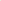

# UniMapGen: A Generative Framework for Large-Scale Map Construction from Multi-modal Data

<!-- Page 1 -->

UniMapGen: A Generative Framework for Large-Scale Map Construction from Multi-modal Data

Yujian Yuan1,2*†, Changjie Wu1†, Xinyuan Chang1†, Sijin Wang1†, Hang Zhang1, Shiyi Liang1,3*,

Shuang Zeng1,3*, Mu Xu1‡

1Amap, Alibaba Group 2The Hong Kong University of Science and Technology 3Xi’an Jiaotong University

## Abstract

Large-scale map construction is foundational for critical applications such as autonomous driving and navigation systems. Traditional large-scale map construction approaches mainly rely on costly and inefficient special data collection vehicles and labor-intensive annotation processes. While existing satellite-based methods have demonstrated promising potential in enhancing the efficiency and coverage of map construction, they exhibit two major limitations: (1) inherent drawbacks of satellite data (e.g., occlusions, outdatedness) and (2) inefficient vectorization from perception-based methods, resulting in discontinuous and rough roads that require extensive post-processing. This paper presents a novel generative framework, UniMapGen, for large-scale map construction, offering three key innovations: (1) representing lane lines as discrete sequence and establishing an iterative strategy to generate more complete and smooth map vectors than traditional perception-based methods. (2) proposing a flexible architecture that supports multi-modal inputs, enabling dynamic selection among BEV, PV, and text prompt, to overcome the drawbacks of satellite data. (3) developing a state update strategy for global continuity and consistency of the constructed large-scale map. UniMapGen achieves state-ofthe-art performance on the OpenSatMap dataset. Furthermore, UniMapGen can infer occluded roads and predict roads missing from dataset annotations.

Code — https://github.com/amap-cvlab/UniMapGen

## Introduction

Lane-level map navigation plays a vital role in both autonomous and human driving systems, especially as intelligent transportation applications expand across cities. The construction of large-scale, high-quality vector maps has thus become a critical research challenge, as such maps are essential for enabling precise localization and route planning. Traditional Standard Definition (SD) maps lack precise lane-level information, resulting in limited navigation

*Work done during internship at Amap, Alibaba Group. †These authors contributed equally. ‡Corresponding author. Email: xumu.xm@alibaba-inc.com Copyright © 2026, Association for the Advancement of Artificial Intelligence (www.aaai.org). All rights reserved.

capabilities. While High Definition (HD) maps (Liu et al. 2023b) offer comprehensive vector and attribute data, their creation demands substantial resources, particularly in terms of specialized data collection vehicles. The use of satellite image to efficiently construct large-scale high-quality, lanelevel maps that fall between SD and HD, as proposed by OpenSatMap (Zhao et al. 2024), has become a trend due to its advantage of satisfying global geographical coverage.

When constructing large-scale lane-level maps from satellite image, three essential challenges are inevitable (Fig. 1 right bottom): (1) Occlusion of roads (Senlet et al. 2012). The physical occlusions (e.g., by tall buildings and trees) in satellite image can cause missing or inaccurate road predictions. (2) Outdatedness of satellite image. The irregular collection of satellite image leads to time gaps between annotations and up-to-date road conditions, which hinders map accuracy. (3) Incomplete annotations. As the definition of roads varies across different annotators, there are various inconsistent and incomplete road annotations in the datasets.

Existing satellite-based methods for map construction are mainly segmentation-based approaches (e.g., Seg- NeXt (Zhao et al. 2024)) and detection-based vectorized methods (Liao et al. 2022; Liu et al. 2023b). They fail to address the above fundamental challenges inherent in satellite image. Moreover, they overlook critical aspects of electronic map representation, which require vector formatting with global consistency. These limitations lie in three key areas: (1) Inefficient representation. Existing segmentationbased approaches require complex post-processing, while detection-based methods use fixed-point vectors, which is limited for complex long lines and wasteful for short ones. (2) Discontinuous connecting. Both segmentation and detection methods require post-processing for connecting together multiple patches, leading to discontinuous connections (Fig. 1 top). (3) Limited flexibility. Existing frameworks demonstrate limited flexibility as they support fixed modality input (e.g., Bird’s Eye View (BEV) only). This harms the framework’s ability to improve map construction using alternative inputs, such as fresher Perspective View (PV) frames or specialized road mapping prompts.

To address the above critical issues, inspired by the powerful contextual learning, inference, and flexible multi-

The Fortieth AAAI Conference on Artificial Intelligence (AAAI-26)

12277

<!-- Page 2 -->

Segmentation

Patched Seg. map

UniMapGen

Large-scale Map

Postprocessing

Previous Method

Our Proposed

…

Incomplete & Discontinuous

Complete & Continuous

…

City-scale

Satellite

Image

Text Prompt

Construct the road map from (x1, y1) to (x2, y2)

…

PV Frames

Merged Global map

Satellite Image Challenges

Complete prediction

Occlusion

+

Outdatedness

+

Incomplete annotation

+

Up-to-date Full prediction

N cropped Satellite patches

**Figure 1.** Methods and challenges in large-scale map construction. (Top) Previous segmentation methods process image patches separately, causing incomplete and discontinuous lines. (Bottom) UniMapGen uses flexible multi-modal inputs to construct complete and continuous maps, overcoming satellite challenges including occlusion, outdateness, and incomplete annotation.

modal fusion ability of multi-modal large language models (MLLMs) (Liu et al. 2023a; Li et al. 2023a; Chen et al. 2024b), we propose UniMapGen, a MLLM-based novel framework for large-scale map construction. As shown in Fig. 1, it offers three key innovations: (1) We reformulate lane-level map construction as a token-based generative problem using a generative model backbone. This approach produces smoother vector outputs across lane lines of varying lengths. (2) We propose a state update strategy for constructing large-scale maps. The map updated at each state relies on that of the last state. (3) Our framework accepts flexible multi-modal inputs, including PV, BEV, and text prompt inputs. PV images reduce inaccurately constructed maps caused by occlusions and outdateness in satellite image. Text prompt offers flexibility for interactive map construction, eliminating the problem of incomplete annotation. Extensive experiments on OpenSatMap (Zhao et al. 2024) demonstrate the effectiveness of UniMapGen.

In summary, our contributions include:

• We innovatively formulate large-scale map construction as an iterative generation task. To achieve this, we propose to serialize the line vectors and employ a state update strategy that iteratively builds the large-scale maps. It improves the map smoothness and completeness by effectively using image and map context.

• We propose UniMapGen, a novel token-based genera- tive framework that unifies multi-modal inputs for flexible map construction. UniMapGen integrates BEV image, PV frames, and text prompt as input, supporting any combination of them. This multi-mode approach addresses the occlusion, outdatedness, and incomplete annotations issues of map construction from satellite image.

• UniMapGen demonstrates SOTA performance on OpenSatMap datasets at zoom level-20. Additionally, UniMapGen can infer occluded roads and predict roads missing from dataset annotations.

## Related Work

Large-Scale Map Construction. Traditional large-scale map construction primarily relies on semantic segmentation approaches (Jiang et al. 2022; Cheng et al. 2025). Notable advances include D-LinkNet’s (Zhou et al. 2018) multiscale dilated convolution with pretrained ResNet34 (He et al. 2016), RoadFormer’s (Jiang et al. 2022) pyramidal deformable vision transformer, and CE-RoadNet’s (Cheng et al. 2025) cascaded CNN architecture, each improving road extraction through enhanced feature learning. RoadDA (Zhang et al. 2021) further addresses domain adaptation through adversarial learning and self-training for cross-domain performance. However, segmentation-based methods face common challenges in maintaining structural continuity and struggle with lane-level map generation. Our

12278

AI-readable visual equivalent, added: Figure extracted from the paper PDF and converted to an SVG wrapper asset. Use the surrounding page text and caption for interpretation.

AI-readable visual equivalent, added: Figure extracted from the paper PDF and converted to an SVG wrapper asset. Use the surrounding page text and caption for interpretation.

AI-readable visual equivalent, added: Figure extracted from the paper PDF and converted to an SVG wrapper asset. Use the surrounding page text and caption for interpretation.

AI-readable visual equivalent, added: Figure extracted from the paper PDF and converted to an SVG wrapper asset. Use the surrounding page text and caption for interpretation.

AI-readable visual equivalent, added: Figure extracted from the paper PDF and converted to an SVG wrapper asset. Use the surrounding page text and caption for interpretation.

AI-readable visual equivalent, added: Figure extracted from the paper PDF and converted to an SVG wrapper asset. Use the surrounding page text and caption for interpretation.

AI-readable visual equivalent, added: Figure extracted from the paper PDF and converted to an SVG wrapper asset. Use the surrounding page text and caption for interpretation.

AI-readable visual equivalent, added: Figure extracted from the paper PDF and converted to an SVG wrapper asset. Use the surrounding page text and caption for interpretation.

<!-- Page 3 -->

work addresses these limitations through a generative endto-end framework that directly produces vectorized road maps from satellite images, eliminating post-processing artifacts and enabling accurate lane-level map generation.

Vertorized Map Construction. The evolution of vectorized map construction began with HDMapNet’s (Li et al. 2022) two-stage segmentation approach, followed by VectorMapNet’s (Liu et al. 2023b) pioneering end-to-end framework using sequential point prediction. MapTR (Liao et al. 2022) introduced unified shape modeling with parallel processing, inspiring subsequent developments: Map- TRv2 (Liao et al. 2024b) enhanced training through auxiliary supervision, PivotNet (Ding et al. 2023) preserved geometry using dynamic pivotal points, and P- MapNet (Jiang et al. 2024) improved robustness via masked pre-training. Recent advances include MapTracker’s (Chen et al. 2024a) temporal consistency through query propagation and SMART’s (Ye et al. 2025) integration of map priors from SD Map and satellite image. However, these detectionbased methods rely on fixed-point vector representations regardless of line length, leading to potential quality degradation for very short or long lines. To address this, we propose a equidistant sampling strategy combined with a generative framework that supports variable-length line prediction, enabling more accurate and adaptive vector representations.

## Method

This paper aims to construct large-scale lane-level maps using flexible multi-modal data, primarily relying on city-level satellite image. An ideal map can be represented as a collection of vectors that are complete and smooth, with global continuity and consistency among them (Ovsjanikov et al. 2012). However, previous methods suffer from inefficient representation, discontinuous connecting, limited flexibility, and drawbacks of satellite image (e.g., occlusion) in map construction. To solve these, we introduce UniMapGen, a generative framework to construct globally continuous and consistent maps from multi-modal data inputs (e.g., BEV, PV frames, and text) in an iterative state update strategy, overcoming challenges like occlusion and data outdateness.

## 3.1 Task Definition

The large-scale map construction can be formalized as an iterative generation process to achieve the global map GN at the latest state N, the iterative process can be formalized as:

Gn = UniMapGen(IBEV, IP V, T P rompt, Gn−1), (1)

where Gn represents the map at current state n, defined as G =< V, A >= {(vi, ai)}K i=1, K is the number of vectors. Here, V denotes a set of vectors and A represents their corresponding attributes. The vectors V = {vi}K i=1 comprise vectorized lines, where each vi = {(xj, yj)}Nj j=1, and (xj, yj) indicates the geographic position of the j-th point of vi. Each attribute ai ∈A = {ai}K i=1 corresponds to vector vi, encompassing properties such as line categories.

The task accepts multiple optional inputs:

1. Bird’s-Eye View image (IBEV ∈RHBEV ×W BEV ×3): City-level low-cost satellite image with broad coverage.

2. Perspective-View frames (IP V ∈RHP V ×W P V ×3×L): Ground-level frames that complement satellite data by addressing occlusion and outdated information issues, where L denotes the number of PV frames. 3. Text prompt (T P rompt): User-specified task prompts that guide the model to generate specific map regions, enabling interactive road generation and updates. 4. Previous-state map (Gn−1): The map of the last state n− 1 that provides context and ensures global continuity and consistency without the need for post-processing.

## 3.2 Framework of UniMapGen

Existing vector-based map construction methods are perception-based (e.g., detection and segmentation), facing limitations like occlusion and poor vector smoothness. To address this, we propose to construct the maps using generative large language model (LLM), leveraging its powerful inference ability and modality flexibility to generate complete, smooth, and globally continuous vectors. To enable the generative model to process the map effectively, we first serialize the map representation. Then, to handle multi-modal inputs, we design a multi-modal framework, incorporating specialized encoders and tokenizers for each modality.

Map Serialization Since generative LLMs only support serialized data formats, as shown in Fig. 2(b), we serialize map vectors into a single sequence by: (1) resampling original vector representations, and (2) concatenating these discrete vectors in a specified order. Traditional fixed-point sampling strategies, such as the 20-point sampling used in MapTR (Liao et al. 2022), struggle to accurately represent long and complex lines in satellite images due to limited point num, while being inefficient for short lines (e.g., 2 m), where many points are redundant. To improve this, we propose an equal-distance sampling strategy that samples points at fixed distances, enabling efficient adaptive point allocation based on line length. In concatenation, we reorder map vectors for order consistency, facilitating easier learning by the LLM, and potentially simplifying map construction.

Formally, given the raw annotated map Gr = {(vr i, ai)}K i=1, we perform equidistant sampling on each line vector vr i at intervals of Ns (we set as 6 meter) to obtain vs i, resulting in equal-distance sampled-map Gs = {(vs i, ai)}K i=1. Then, to ensure order consistency, we reorder the vectors {vs i}K i=1 according to their euclidean distance di between their first point to the origin point (i.e., (0,0)), getting Go = {(vo i, ai)}K i=1, where d1 ≤d2 ≤· · · ≤dK. Later, we serialize the map Go to get sequence SG by concatenating each lane line vector-attribute pairs in order:

SG =

K⊕ i=1(vo i, ai) (2)

Finally, we convert each part of SG into predefined special tokens. Please see suppl. for implementation details.

## Model

Architecture Previous methods receive the fixedmodality input and construct maps with a single mode, limiting the flexibility and efficiency for large-scale map construction, as the road information can not be prompted or updated by the inputs from other modalities (e.g., PV frames).

12279

<!-- Page 4 -->

(c) State Update for Global Construction

(a) Model Architecture of UniMapGen (b) Map Serialization

Equidistant Sampling

Reordering

Vector Tokenization …

Raw annotated map

…

BEV Encoder

Large Language Model

PV Encoder Text Tokenizer

PV Frames

…

3D Conv

… …

Satellite Image Text Prompt

Vector Detokenizer

Previous Map (Gn-1)

…

Vector Tokenizer

Cut

End

Start

Please generate the line points and line type according to …

… Current Map (Gn) Cut

Gn

UniMapGen

Satellite

Image

G0 G1 G2 G5

GN-1 GN G6 GN-2

…

…

Gn-1

State Update

Update

Cut

…

UniMapGen

**Figure 2.** Overview. (a) Model Architecture: UniMapGen supports multi-modal data inputs, including BEV, PV, text, and maps. (b) Map Serialization: we apply equidistant sampling to the raw map vectors, and then reorder them in the specified order. Finally, they are converted into special tokens. (c) State Update: we propose a state update strategy to incrementally construct large-scale maps. This process requires no post-processing, yielding smooth and connected outputs.

To address this, as shown in Fig. 2(a), we design an MLLMbased architecture for UniMapGen, leveraging its acceptance of various input modalities and powerful contextual learning ability. Additionally, to transform the inputs in Eq.1 into LLM-compatible feature spaces, we designed specialized encoders and tokenizers for each modality.

A. Encoders/LLM and Tokenizers. (1) BEV Encoder. It encodes a single satellite image IBEV into N D-dimensional tokens eBEV ∈RD×N. (2) PV Encoder. We utilize a 3D convolution (Tran et al. 2015) followed by the image encoder from Qwen2-VL-2B (Wang et al. 2024) as our PV Encoder, processing L PV frames IP V into M D-dimensional tokens eP V ∈RD×M. (3) Vector Tokenizer and Detokenizer. We propose a special vector tokenizer to convert the previous state map Gn−1 into special tokens eG, subsequently processed through word embeddings. The vector detokenizer performs the inverse operation, decoding the MLLM-predicted tokens back into vectorized maps. (4) Large Language Model and Text Encoder. We adopt Qwen2.5-1.5B (Qwen et al. 2025) as our LLM, receiving multimodal input to construct maps. Additionally, we utilize the LLM’s text tokenizer to tokenize T prompt into eT. More model details are listed in the suppl.

B. Flexible Multi-modal inputs. To enable flexible map construction, UnimapGen supports multiple generation modes. The model inputs (BEV image, PV frames, text prompt, and previous map) are designed to be optional, allowing inference with any combination of inputs. The input embedding sequence Sinput is formulated as:

Sinput = eBEV ∥eP V ∥eT ∥eG, (3)

During training, we randomly mask different modalities to enhance sample diversity and develop model’s adaptive multi-modal ability. This ensures robust performance regardless of available input modalities. We use different text prompts to control the generation mode, as listed in suppl.

## 3.3 State Update for Global Construction

Previous methods construct large-scale maps by dividing satellite images into patches, processing each independently, and merging results. However, this ignores context from neighboring patches and creates unsmooth lines at patch

12280

AI-readable visual equivalent, added: Figure extracted from the paper PDF and converted to an SVG wrapper asset. Use the surrounding page text and caption for interpretation.

AI-readable visual equivalent, added: Figure extracted from the paper PDF and converted to an SVG wrapper asset. Use the surrounding page text and caption for interpretation.

AI-readable visual equivalent, added: Figure extracted from the paper PDF and converted to an SVG wrapper asset. Use the surrounding page text and caption for interpretation.

AI-readable visual equivalent, added: Figure extracted from the paper PDF and converted to an SVG wrapper asset. Use the surrounding page text and caption for interpretation.

AI-readable visual equivalent, added: Figure extracted from the paper PDF and converted to an SVG wrapper asset. Use the surrounding page text and caption for interpretation.

AI-readable visual equivalent, added: Figure extracted from the paper PDF and converted to an SVG wrapper asset. Use the surrounding page text and caption for interpretation.

AI-readable visual equivalent, added: Figure extracted from the paper PDF and converted to an SVG wrapper asset. Use the surrounding page text and caption for interpretation.

AI-readable visual equivalent, added: Figure extracted from the paper PDF and converted to an SVG wrapper asset. Use the surrounding page text and caption for interpretation.

AI-readable visual equivalent, added: Figure extracted from the paper PDF and converted to an SVG wrapper asset. Use the surrounding page text and caption for interpretation.

AI-readable visual equivalent, added: Figure extracted from the paper PDF and converted to an SVG wrapper asset. Use the surrounding page text and caption for interpretation.

AI-readable visual equivalent, added: Figure extracted from the paper PDF and converted to an SVG wrapper asset. Use the surrounding page text and caption for interpretation.

AI-readable visual equivalent, added: Figure extracted from the paper PDF and converted to an SVG wrapper asset. Use the surrounding page text and caption for interpretation.

AI-readable visual equivalent, added: Figure extracted from the paper PDF and converted to an SVG wrapper asset. Use the surrounding page text and caption for interpretation.

AI-readable visual equivalent, added: Figure extracted from the paper PDF and converted to an SVG wrapper asset. Use the surrounding page text and caption for interpretation.

AI-readable visual equivalent, added: Figure extracted from the paper PDF and converted to an SVG wrapper asset. Use the surrounding page text and caption for interpretation.

AI-readable visual equivalent, added: Figure extracted from the paper PDF and converted to an SVG wrapper asset. Use the surrounding page text and caption for interpretation.

<!-- Page 5 -->

Models Method APC

## 0.9 APC

## 1.5 APC

## 3.0 APC

## 4.5 APM APM

## 50 APM

75 mIoU

MapTRsat (Liao et al. 2022) vector-based 18.20 22.13 26.36 28.25 6.02 14.12 4.18 34.10 MapTRv2sat (Liao et al. 2024b) vector-based 19.34 23.44 26.98 29.89 6.45 14.89 4.47 35.42

SegNeXt (Zhao et al. 2024) segmentation-based 20.30 25.93 29.50 31.38 6.98 16.05 5.26 33.69 UniMapGen vector-based 29.17 30.41 32.54 34.81 8.38 21.67 5.19 41.81

**Table 1.** Evaluation on OpenSatMap20 validation set. APM means that the mask IoU is used when determining true positives, while APC

D means Chamfer AP with a threshold of D meters. APx denotes that threshold is set to x. AP indicates averaged values, varying thresholds from 50 to 95. The models noted sat are produced by us using satellite images.

edges. To address this, as shown in Fig. 2(c), we employ a state update framework for end-to-end large-scale map construction. It iteratively builds current map upon the previous map while maintaining global continuity and consistency.

To support state update, we add two attributes: start/end type, into ai of each line vector vi. Start/end type refers to the start/end point type of a line, classified as ’start’, ’end’, or ’cut’. The three types indicate whether the point is a natural start/end point or formed by cutting a line into two patches.

During the inference process, the state update process is similar to a growth process, where the current map evolves from the previous state map. Specifically, we adopted a leftto-right, top-to-bottom patch update strategy. When constructing the map for a patch, the model refers to all the ’cut’ points adjacent to the patch, which are extracted from the previous state map. This ensures the edge vector of the next region is consistent with that of the current region. In this way, the model generates coherent and smooth lane line vectors that seamlessly connect with existing vectors.

Formally, starting from an empty map G0 in initial state, we construct the maps Gn at n state based the maps on n−1 state (Gn−1) and multi-model inputs at n state as:

Gn = UniMapGen(eBEV n ∥eP V n ∥eT n ∥eG n−1), (4)

After N step iteration, where N = HBEV ×W BEV Hpatch×Wpatch, we obtain the final result GN with full maps on BEV image IBEV.

For the training process of state update, the start/end type of lines comes from the ground truth of the current patch, which is different from that (from adjacent patches) in the inference process.

## 4 Experiments

Dataset. We evaluate the performance of UniMapGen on OpenSatMap dataset at 20-level, which includes 1180 training and 393 validation satellite image of 4096*4096 pixels. Each image in the dataset is annotated with lane-level vectorized maps, with each line classified into three line categories (Curb, Lane line, and Virtual Line), and eight attributes (e.g., line types and level of occlusion). To meet the large training data requirement for MLLMs, we conduct overlapped and inclined cropping augmentation, resulting in 700k training satellite patches. Details of the training data preparation, including PV-only, PV and BEV joint training, text-prompted target map construction, and data augmentation, are provided in the suppl..

Metric. Following (Zhao et al. 2024), the line width is set to 6 pixels by default, and evaluations are conducted at both semantic and instance levels. For semantic-level evaluation, we use the mean intersection over union (mIoU) (Everingham et al. 2010) as the metric across different line categories. For instance-level evaluation, we employ average precision (AP) metrics, which include Mask AP (APM) using mask IoU thresholds to determine true positive samples (Cheng et al. 2022), and Chamfer AP (APC

D) (Zhao et al. 2024) by choosing the distance threshold D. Since standard AP computation requires class probabilities for each predicted line, we propose a pseudo-scoring mechanism based on the MLLM’s token prediction confidence. Specifically, for the i-th line, we define its pseudo-score pi as:

pi = max(softmax(oi)) (5)

where oi ∈RC represents the logits output of MLLM for the i-th line’s class token, and C is the number of classes.

Implementation Details. For the training of UniMap- Gen, a batch size 32, and AdamW optimizer with a weight decay of 0.1 are used to fully finetune for 6 epochs. A cosine learning rate decay with a peak learning rate of 2e-5 and a linear warm-up of 100 steps was adopted. The input satellite image of each state was of size 896×896. Due to the GPU memory limit, we only use the front-view frames in our experiment. Additionally, we uniformly sample up to 10 PV images for a paired satellite image, and resize each PV image into 644×364. All the experiments run on 32 Nvidia H20, while UniMapGen can infer on a single Nvidia 3090.

## 4.1 Quantitative Evaluation We compare UniMapGen with the current state-of-the-art method

SegNeXt (Zhao et al. 2024) and vector-based map construction methods (e.g., MapTR) on the OpenSatMap20 dataset. SegNeXt employs a three-stage pipeline, including semantic segmentation and two post-processing processes (instance detection and vectorization). It constructs maps for 4096×4096 images by dividing them into 1024×1024 patches and predicting lines for each patch. MapTR (Liao et al. 2022) and MapTRv2 are originally PV frames-based map construction methods. To evaluate their performance of BEV-based generation, we replace the BEVFormer with ViT-Large-14 from Dinov2 (Oquab et al. 2023), followed by an MLP, to directly extract BEV features from the satellite image. Tab. 1 shows that UniMapGen outperforms SegNeXt and MapTR series across most metrics, including mIoU

12281

<!-- Page 6 -->

Upd Reo Aug APC

0.9 APC 1.5 APC 3.0 APC 4.5 APM APM 50 APM 75 mIoU

✗ ✗ ✗ 21.44 22.68 24.76 26.05 4.92 14.44 2.28 36.84 ✗ ✗ ✓ 24.53 25.82 28.19 29.57 6.40 17.32 3.57 38.99 ✓ ✗ ✓ 25.89 26.96 29.78 31.29 6.92 18.42 3.99 39.37 ✗ ✓ ✓ 27.96 29.31 31.62 33.07 7.63 19.99 4.98 40.08 ✓ ✓ ✓ 29.17 30.41 32.54 34.81 8.38 21.67 5.19 41.81

**Table 2.** Ablation on OpenSatMap20 validation set. Upd means the state update strategy for map construction. Reo means reordering lines, and Aug means data augmentation.

GT Modal APC

0.9 APC 1.5 APC 3.0 APC 4.5 APM APM 50 APM 75 mIoU

Tar.

BEV 9.93 11.39 13.59 16.38 2.78 7.62 1.51 16.89 BEV+T 22.02 23.73 27.09 30.01 4.47 12.07 3.74 35.56 BEV+T+PV 23.28 26.17 30.67 33.59 5.98 14.65 4.26 41.02

Full BEV 29.80 31.41 33.93 35.59 8.32 22.17 4.90 43.08 BEV+PV 31.91 33.35 35.79 37.11 9.05 23.99 5.43 45.16

**Table 3.** Ablation on OpenSatMap20 val subset on nuSences and Argoverse2 cities. Target/Full GT: target or full map construction. T: text prompt for target map.

and APs, demonstrating the powerful ability of UniMap- Gen in large-scale map construction. Qualitative comparisons in Fig. 3 (a) further reveal that UniMapGen generates smoother, more continuous, and complete lines compared to SegNeXt’s post-processing and MapTR series results. Fig. 3 (g) shows an example of our constructed global map.

## 4.2 Ablation Study To validate the effectiveness of key components, as shown in

Tab. 2 and 3, we conduct ablation studies on OpenSatMap20 val set to explore the effectiveness of state update, line reorder, augmentation, the assistance of multi-modal inputs.

Effectiveness of State Update. Tab. 2 demonstrates that incorporating state update significantly enhances UniMap- Gen’s performance. This improvement is attributed to the mechanism that the previous-state map serves as a contextual guide for predicting the current state map, ensuring smooth transitions at patch boundaries. Visual comparisons in Fig. 3 (b) further reveal that state update generation yields more continuous line structures across patch edges.

Effectiveness of Data Augmentation and Reordering Lines. As shown in Tab. 2, data augmentation significantly enhances model performance, aligning with MLLMs’ datadriven characteristics. Line reordering further boosts performance by providing structured sequence patterns, enabling more consistent feature learning and generation.

Effectiveness of Multi-modal inputs. Tab. 3 reports the model results on the validation subset on nuSences and Argoverse2 cities. Target GT refers to the target GT (a subset of full GT), and Full GT means vanilla full GT. (1) PV frames. It is observed that both in target and full GT map construction, incorporating PV frames improves the accuracy

Models Landmark Reachability L-P L-R L-F1 R-P R-R R-F1

TopoNet (Li et al. 2023b) 52.5 47.1 49.6 46.9 10.8 17.5 LaneGAP (Liao et al. 2024a) 49.9 57.0 53.2 74.1 34.9 47.5 RNTR (Lu et al. 2023) 57.1 42.7 48.9 63.7 45.2 52.8 UniMapGen 53.4 48.7 50.9 72.6 58.3 64.6

**Table 4.** Evaluation on nuSences default split for lane topology construction. This evaluates Landmark Precision- Recall, Reachability Precision-Recall, and their F1 score.

of constructed maps. This enhancement is due to the complementary ground-level information, which resolves ambiguities in satellite image. Specifically, PV frames are effective in addressing the occlusion (examples see suppl.) and outdateness (Fig. 3(c)) of satellite image. (2) Text Prompt. The BEV-only result on target GT(first line) refers to generating all lane lines without using any target-guided text prompts. Its poor qualitative performance suggests a clear gap between full map generation and target map construction. With the guidance of text prompts, UniMapGen considerably improved target map construction, showcasing its ability in target text-prompted generation. As illustrated in Fig. 3 (f), when prompted with road-specific instructions, UniMapGen accurately generates specified complete roads, addressing the incomplete annotation of satellite datasets.

## 4.3 Qualitative Visualization

PV-based Map Construction. As shown in Fig. 3 (d), when provided with only PV frames, UniMapGen could still generate lane lines that align with the observed lane types, numbers, and location. This indicates UniMapGen’s ability to understand the relationship between PV perspective and lane geometry. Even in cases where satellite image is outdated, UniMapGen can still produce accurate map representations.

Inference Capability. UniMapGen demonstrates robust inference ability in challenging scenarios, particularly with significant occlusions from tall structures such as trees (Fig. 3 (e)). Unlike segmentation-based methods, UniMap- Gen reconstructs occluded roads even without PV frames by leveraging MLLM-driven in-context reasoning and inference ability rather than relying solely on pixel-level features.

## 4.4 Lane Topology Construction

Due to the absence of intersection annotations in Open- SatMap, we assess UniMapGen’s lane topology construction performance on the default nuScenes split. As shown in Tab. 4, UniMapGen outperforms leading methods in Reachability F1 and achieves comparable performance in Landmark F1. Landmark Precision-Recall measures accuracy in locating key points (e.g., splits, forks, merges), while Reachability Precision-Recall evaluates connectivity prediction between them, indicating road existence. These results show UniMapGen’s effectiveness in constructing complex intersection lane topologies. Experiment details are in suppl.

12282

<!-- Page 7 -->

(f) Target Map Construction Incomplete Annotation UniMapGen

(g) Global Constructed Map

(b) Ablation on State Update

Please construct the road from (367, 534) to (20, 224)

GT UniMapGen (e) Occlusion

(d) PV based Map Construction

Ground Truth SegNeXt UniMapGen (Ours) Image

(a) Comparison with SOTA method MapTRsat w

Cut Point

(c) BEV & PV Map Construction w/o

Image w/o PV w. PV PV Frames

Patch edge

**Figure 3.** Qualitative results of UniMapGen. (a) Comparison with SOTA. Different color refers to different line instances. (b) Ablation on State Update. The black lines are the patch edges. (c) BEV and PV map construction. PV provides up-to-date (purple) and complementary (red) road information. The line with purple circles is worn out or outdated in BEV image but clear in PV frames. (d) PV-based map construction. (e) Occluded road construction even without PV frames. (f) UniMapGen generates target maps given text prompts. (g) Global constructed map (missing intersection due to OpenSatMap annotation).

## 5 Limitation and Discussion Although

UniMapGen demonstrates promising results in large-scale map construction, it has several limitations. Firstly, the computational demands of MLLMs, along with their relatively slow inference speed (average 4 seconds per 135m×135m), pose practical challenges for real-time map construction like MapTR for autonomous driving. Actually, UniMapGen serves as a large-scale map constructor to assist autonomous driving and navigation, and could utilize up-todate PV frames to update existing maps. Secondly, the text prompt in UniMapGen only supports coordinates for target map construction, but not more flexible natural language, such as generating the map from the school to the hospital. This is due to the lack of training data. Using an offline object detection model (Carion et al. 2020) to extract the object location or synthesizing the training data leveraging more annotations has the potential to solve this, which will be explored in our future work.

## 6 Conclusion We propose a novel generative framework,

UniMapGen, for large-scale lane-level map construction. UniMapGen formulates lane detection as a discrete sequential generation task, powered by a state update strategy to construct smooth and complete lane lines. Additionally, our framework supports map construction from multi-modal inputs, including BEV images, PV frames, and text prompts, enabling flexible and efficient generation. In the future, we plan to synthesize more data to enrich our text prompts to support more flexible and user-friendly map construction. Additionally, we aim to extend our framework to support richer map elements such as traffic signs and road rules (Liang et al. 2026).

12283

AI-readable visual equivalent, added: Figure extracted from the paper PDF and converted to an SVG wrapper asset. Use the surrounding page text and caption for interpretation.

AI-readable visual equivalent, added: Figure extracted from the paper PDF and converted to an SVG wrapper asset. Use the surrounding page text and caption for interpretation.

AI-readable visual equivalent, added: Figure extracted from the paper PDF and converted to an SVG wrapper asset. Use the surrounding page text and caption for interpretation.

AI-readable visual equivalent, added: Figure extracted from the paper PDF and converted to an SVG wrapper asset. Use the surrounding page text and caption for interpretation.

AI-readable visual equivalent, added: Figure extracted from the paper PDF and converted to an SVG wrapper asset. Use the surrounding page text and caption for interpretation.

AI-readable visual equivalent, added: Figure extracted from the paper PDF and converted to an SVG wrapper asset. Use the surrounding page text and caption for interpretation.

AI-readable visual equivalent, added: Figure extracted from the paper PDF and converted to an SVG wrapper asset. Use the surrounding page text and caption for interpretation.

AI-readable visual equivalent, added: Figure extracted from the paper PDF and converted to an SVG wrapper asset. Use the surrounding page text and caption for interpretation.

AI-readable visual equivalent, added: Figure extracted from the paper PDF and converted to an SVG wrapper asset. Use the surrounding page text and caption for interpretation.

AI-readable visual equivalent, added: Figure extracted from the paper PDF and converted to an SVG wrapper asset. Use the surrounding page text and caption for interpretation.

AI-readable visual equivalent, added: Figure extracted from the paper PDF and converted to an SVG wrapper asset. Use the surrounding page text and caption for interpretation.

AI-readable visual equivalent, added: Figure extracted from the paper PDF and converted to an SVG wrapper asset. Use the surrounding page text and caption for interpretation.

AI-readable visual equivalent, added: Figure extracted from the paper PDF and converted to an SVG wrapper asset. Use the surrounding page text and caption for interpretation.

AI-readable visual equivalent, added: Figure extracted from the paper PDF and converted to an SVG wrapper asset. Use the surrounding page text and caption for interpretation.

AI-readable visual equivalent, added: Figure extracted from the paper PDF and converted to an SVG wrapper asset. Use the surrounding page text and caption for interpretation.

AI-readable visual equivalent, added: Figure extracted from the paper PDF and converted to an SVG wrapper asset. Use the surrounding page text and caption for interpretation.

AI-readable visual equivalent, added: Figure extracted from the paper PDF and converted to an SVG wrapper asset. Use the surrounding page text and caption for interpretation.

AI-readable visual equivalent, added: Figure extracted from the paper PDF and converted to an SVG wrapper asset. Use the surrounding page text and caption for interpretation.

AI-readable visual equivalent, added: Figure extracted from the paper PDF and converted to an SVG wrapper asset. Use the surrounding page text and caption for interpretation.

AI-readable visual equivalent, added: Figure extracted from the paper PDF and converted to an SVG wrapper asset. Use the surrounding page text and caption for interpretation.

AI-readable visual equivalent, added: Figure extracted from the paper PDF and converted to an SVG wrapper asset. Use the surrounding page text and caption for interpretation.

AI-readable visual equivalent, added: Figure extracted from the paper PDF and converted to an SVG wrapper asset. Use the surrounding page text and caption for interpretation.

AI-readable visual equivalent, added: Figure extracted from the paper PDF and converted to an SVG wrapper asset. Use the surrounding page text and caption for interpretation.

AI-readable visual equivalent, added: Figure extracted from the paper PDF and converted to an SVG wrapper asset. Use the surrounding page text and caption for interpretation.

<!-- Page 8 -->

## References

Carion, N.; Massa, F.; Synnaeve, G.; Usunier, N.; Kirillov, A.; and Zagoruyko, S. 2020. End-to-end object detection with transformers. In European conference on computer vision (ECCV). Chen, J.; Wu, Y.; Tan, J.; Ma, H.; and Furukawa, Y. 2024a. Maptracker: Tracking with strided memory fusion for consistent vector hd mapping. In European Conference on Computer Vision (ECCV). Chen, Z.; Wu, J.; Wang, W.; Su, W.; Chen, G.; Xing, S.; Zhong, M.; Zhang, Q.; Zhu, X.; Lu, L.; et al. 2024b. Internvl: Scaling up vision foundation models and aligning for generic visual-linguistic tasks. In IEEE/CVF conference on computer vision and pattern recognition (CVPR). Cheng, B.; Misra, I.; Schwing, A. G.; Kirillov, A.; and Girdhar, R. 2022. Masked-attention mask transformer for universal image segmentation. In IEEE/CVF conference on computer vision and pattern recognition (CVPR). Cheng, K.-N.; Ni, W.; Zhang, H.; Wu, J.; Xiao, X.; and Yang, Z. 2025. CE-RoadNet: A Cascaded Efficient Road Network for Road Extraction from High-Resolution Satellite Images. Remote Sensing, 17(5): 831. Ding, W.; Qiao, L.; Qiu, X.; and Zhang, C. 2023. Pivotnet: Vectorized pivot learning for end-to-end hd map construction. In IEEE/CVF International Conference on Computer Vision (CVPR). Everingham, M.; Van Gool, L.; Williams, C. K.; Winn, J.; and Zisserman, A. 2010. The pascal visual object classes (voc) challenge. International journal of computer vision (IJCV), 88: 303–338. He, K.; Zhang, X.; Ren, S.; and Sun, J. 2016. Deep residual learning for image recognition. In IEEE/CVF conference on computer vision and pattern recognition (CVPR), 770–778. Jiang, X.; Li, Y.; Jiang, T.; Xie, J.; Wu, Y.; Cai, Q.; Jiang, J.; Xu, J.; and Zhang, H. 2022. RoadFormer: Pyramidal deformable vision transformers for road network extraction with remote sensing images. International Journal of Applied Earth Observation and Geoinformation, 113: 102987. Jiang, Z.; Zhu, Z.; Li, P.; Gao, H.-a.; Yuan, T.; Shi, Y.; Zhao, H.; and Zhao, H. 2024. P-mapnet: Far-seeing map generator enhanced by both sdmap and hdmap priors. IEEE Robotics and Automation Letters. Li, J.; Li, D.; Savarese, S.; and Hoi, S. 2023a. Blip-2: Bootstrapping language-image pre-training with frozen image encoders and large language models. In International conference on machine learning (ICML). Li, Q.; Wang, Y.; Wang, Y.; and Zhao, H. 2022. Hdmapnet: An online hd map construction and evaluation framework. In International Conference on Robotics and Automation (ICRA). Li, T.; Chen, L.; Wang, H.; Li, Y.; Yang, J.; Geng, X.; Jiang, S.; Wang, Y.; Xu, H.; Xu, C.; et al. 2023b. Graphbased topology reasoning for driving scenes. arXiv preprint arXiv:2304.05277. Liang, S.; Chang, X.; Wu, C.; Yan, H.; Bai, Y.; Liu, X.; Zhang, H.; Yuan, Y.; Zeng, S.; Xu, M.; et al. 2026. Persistent

Autoregressive Mapping with Traffic Rules for Autonomous Driving. In The Association for the Advancement of Artificial Intelligence (AAAI). Liao, B.; Chen, S.; Jiang, B.; Cheng, T.; Zhang, Q.; Liu, W.; Huang, C.; and Wang, X. 2024a. Lane graph as path: Continuity-preserving path-wise modeling for online lane graph construction. In European Conference on Computer Vision (ECCV). Liao, B.; Chen, S.; Wang, X.; Cheng, T.; Zhang, Q.; Liu, W.; and Huang, C. 2022. MapTR: Structured Modeling and Learning for Online Vectorized HD Map Construction. In International Conference on Learning Representations (ICLR). Liao, B.; Chen, S.; Zhang, Y.; Jiang, B.; Zhang, Q.; Liu, W.; Huang, C.; and Wang, X. 2024b. Maptrv2: An end-to-end framework for online vectorized hd map construction. International Journal of Computer Vision (IJCV), 1–23. Liu, H.; Li, C.; Wu, Q.; and Lee, Y. J. 2023a. Visual instruction tuning. In Advances in neural information processing systems (NeurIPS). Liu, Y.; Yuan, T.; Wang, Y.; Wang, Y.; and Zhao, H. 2023b. Vectormapnet: End-to-end vectorized hd map learning. In International Conference on Machine Learning (ICML). Lu, J.; Peng, R.; Cai, X.; Xu, H.; Li, H.; Wen, F.; Zhang, W.; and Zhang, L. 2023. Translating images to road network: A non-autoregressive sequence-to-sequence approach. In IEEE/CVF International Conference on Computer Vision (CVPR). Oquab, M.; Darcet, T.; Moutakanni, T.; Vo, H.; Szafraniec, M.; Khalidov, V.; Fernandez, P.; Haziza, D.; Massa, F.; El- Nouby, A.; et al. 2023. Dinov2: Learning robust visual features without supervision. arXiv preprint arXiv:2304.07193. Ovsjanikov, M.; Ben-Chen, M.; Solomon, J.; Butscher, A.; and Guibas, L. 2012. Functional maps: a flexible representation of maps between shapes. ACM Transactions on Graphics (ToG), 31(4): 1–11. Qwen;:; Yang, A.; Yang, B.; Zhang, B.; Hui, B.; Zheng, B.; Yu, B.; Li, C.; Liu, D.; Huang, F.; Wei, H.; Lin, H.; Yang, J.; Tu, J.; Zhang, J.; Yang, J.; Yang, J.; Zhou, J.; Lin, J.; Dang, K.; Lu, K.; Bao, K.; Yang, K.; Yu, L.; Li, M.; Xue, M.; Zhang, P.; Zhu, Q.; Men, R.; Lin, R.; Li, T.; Tang, T.; Xia, T.; Ren, X.; Ren, X.; Fan, Y.; Su, Y.; Zhang, Y.; Wan, Y.; Liu, Y.; Cui, Z.; Zhang, Z.; and Qiu, Z. 2025. Qwen2.5 Technical Report. arXiv:2412.15115. Senlet; Turgay; Turgay; and Elgammal, A. 2012. Segmentation of occluded sidewalks in satellite images. In Proceedings of the 21st International Conference on Pattern Recognition (ICPR2012), 805–808. Tran, D.; Bourdev, L.; Fergus, R.; Torresani, L.; and Paluri, M. 2015. Learning spatiotemporal features with 3d convolutional networks. In IEEE/CVF conference on computer vision and pattern recognition (CVPR). Wang, P.; Bai, S.; Tan, S.; Wang, S.; Fan, Z.; Bai, J.; Chen, K.; Liu, X.; Wang, J.; Ge, W.; Fan, Y.; Dang, K.; Du, M.; Ren, X.; Men, R.; Liu, D.; Zhou, C.; Zhou,

12284

<!-- Page 9 -->

J.; and Lin, J. 2024. Qwen2-VL: Enhancing Vision- Language Model’s Perception of the World at Any Resolution. arXiv:2409.12191. Ye, J.; Paz, D.; Zhang, H.; Guo, Y.; Huang, X.; Christensen, H. I.; Wang, Y.; and Ren, L. 2025. SMART: Advancing Scalable Map Priors for Driving Topology Reasoning. arXiv preprint arXiv:2502.04329. Zhang, L.; Lan, M.; Zhang, J.; and Tao, D. 2021. Stagewise unsupervised domain adaptation with adversarial selftraining for road segmentation of remote-sensing images. IEEE Transactions on Geoscience and Remote Sensing, 60: 1–13. Zhao, H.; Fan, L.; Chen, Y.; Wang, H.; Jin, X.; Zhang, Y.; Meng, G.; ZHANG, Z.-X.; et al. 2024. Opensatmap: A finegrained high-resolution satellite dataset for large-scale map construction. Advances in Neural Information Processing Systems (NeurIPS). Zhou, L.; Zhang, C.; Wu, M.; and Wu, M. 2018. D- LinkNet: LinkNet with pretrained encoder and dilated convolution for high resolution satellite imagery road extraction. In IEEE/CVF conference on computer vision and pattern recognition (CVPR).

12285
