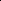

# Unlocking Multi-Modal Potentials for Link Prediction on Dynamic Text-Attributed Graphs

<!-- Page 1 -->

Unlocking Multi-Modal Potentials for Link Prediction on

Dynamic Text-Attributed Graphs

Yuanyuan Xu1, Wenjie Zhang1, Ying Zhang2*, Xuemin Lin3, Xiwei Xu4

1School of Computer Science and Engineering, University of New South Wales 2Common Prosperity Visualization and Policy Simulation Lab, Zhejiang Gongshang University 3Antai College of Economics and Management, Shanghai Jiao Tong University 4Architecture and Analytics Platforms Team, CSIRO Data61 {yuanyuan.xu, wenjie.zhang}@unsw.edu.au, ying.zhang@zjgsu.edu.cn, xuemin.lin@gmail.com, xiwei.xu@data61.csiro.au

## Abstract

Dynamic Text-Attributed Graphs (DyTAGs) are a novel graph paradigm that captures evolving temporal events (edges) alongside rich textual attributes. Existing studies can be broadly categorized into TGNN-driven and LLM-driven approaches, both of which encode textual attributes and temporal structures for DyTAG representation. We observe that DyTAGs inherently comprise three distinct modalities: temporal, textual, and structural, often exhibiting completely disjoint distributions. However, the first two modalities are largely overlooked by existing studies, leading to suboptimal performance. To address this, we propose MoMent, a multimodal model that explicitly models, integrates, and aligns each modality to learn node representations for link prediction. Given the disjoint nature of the original modality distributions, we first construct modality-specific features and encode them using individual encoders to capture correlations across temporal patterns, semantic context, and local structures. Each encoder generates modality-specific tokens, which are then fused into comprehensive node representations with a theoretical guarantee. To avoid disjoint subspaces of these heterogeneous modalities, we propose a dual-domain alignment loss that first aligns their distributions globally and then fine-tunes coherence at the instance level. This enhances coherent representations from temporal, textual, and structural views. Extensive experiments across seven datasets show that MoMent achieves up to 17.28% accuracy improvement and up to 31× speed-up against eight baselines.

Extended version — https://arxiv.org/pdf/2502.19651

## Introduction

Dynamic Text-Attributed Graphs (DyTAGs) are a recent development to represent systems with evolving structures and text attributes over time, where nodes and edges are enriched with text attributes. DyTAGs are critical for modeling complex real systems, such as e-commerce platforms (Zhao et al. 2023; Kazemi et al. 2020; Liu, Liu, and Ge 2023; Seo et al. 2024) and social networks (Pareja et al. 2020; Sun et al. 2022; Luo et al. 2023; Song et al. 2019). For instance, in social networks, nodes represent posts with text attributes, and edges may be annotated with user comments,

*Corresponding author. Copyright © 2026, Association for the Advancement of Artificial Intelligence (www.aaai.org). All rights reserved.

allowing users to engage in behaviors at any time. To represent DyTAGs and support real applicability, there is a pioneering exploration DTGB (Zhang et al. 2024a) that leverages Pre-trained Language Models (PLMs) to encode text attributes and then integrates them with Temporal Graph Neural Networks (TGNNs) (Kumar, Zhang, and Leskovec 2019; Trivedi et al. 2019; Xu et al. 2020; Rossi et al. 2020; Wang et al. 2021; Cong et al. 2023; Yu et al. 2023) for node representations. Subsequently, LKD4DyTAG (Roy, Yan, and Mortazavi 2025) employs a knowledge distillation framework to transfer knowledge from the text-based edge representation of a teacher Large Language Model (LLM) model to the spatio-temporal representation of a student Graph Neural Network (GNN) for DyTAG representation. These explorations predominantly adopt edge-centric modeling that emphasizes local connectivity (node external) but often overlooks node internal semantic dynamics (temporal/textual), thereby compromising model performance. Observation for multi-model nature of DyTAGs. We first analyze unique characteristics of DyTAGs, illustrated by the toy example in Fig. 1a, to establish a foundation for modeling. Taking a node-centric perspective, we identify Dy- TAGs as inherently multi-modal, which distinguishes them from traditional dynamic graphs: (1) Structural Modality: Similar to dynamic graphs, each node interacts with multiple neighbors through evolving edges, where edge text attributes and timestamps are inherently associated with edges, encoding external semantic dynamics of nodes. (2) Temporal Modality: Beyond structural changes, nodes initiate interactions at different timestamps, capturing temporal evolution patterns (e.g., frequency) that preserve node internal dynamics. (3) Textual Modality: Unlike dynamic graphs, nodes in DyTAGs are inherently enriched with raw text attributes, introducing internal semantic contexts of nodes.

To better understand these three modalities, we analyze their Kernel Density Estimation (KDE) distributions using the Enron dataset, as shown in Fig. 1b, where the structural modality is derived from the 20 neighbors of each node. Temporal modality shows a dispersed distribution with values from 0.6 to 0.8, reflecting global variability in event timings, whereas textual modality is compact and concentrated near 0, indicating high semantic regularity. The structural modality exhibits a moderate distribution, capturing structural diversity and local variability in edge attributes. Fur-

The Fortieth AAAI Conference on Artificial Intelligence (AAAI-26)

27386

<!-- Page 2 -->

Name: Star Serves: Latte,......

Date: 09-16 08:18 Review: The coffee beans aren't great. Rate: 2

08-06 11:52 Review

Review

Textual Modality Node att.: User profile

PLM/LLM encodings

Structural Modality

Edge text att.

Time gaps

Temporal Modality Timestamps: 09-03 06:01 Time encodings

09-03 06:01

Review

09-06 12:26

(a) A dynamic text-attributed graph

0.0 0.2 0.4 0.6 0.8 1.0 Value

0

20

40

60

80

100

120

Density

Temporal.O

Textual.O

Structural.O

(b) KDE distribution of modalities

Enron ICEWS1819

Stack elec

Stack ubuntu

Googlemap CT

Amazon movies

Yelp

0

50

100

150

Raw Text Length (Token)

Node Text Att. Edge Text Att.

(c) Text attribute statistics

**Figure 1.** (1) A toy example of DyTAGs, together with its three modalities. (b) KDE distribution of three modalities in a real DyTAG (Enron), where ‘X.O’ indicates original features. (c) The average text length of edges and nodes in 7 DyTAGs.

thermore, the temporal, textual, and structural modalities exist in different value spaces with disjoint distributions, highlighting the necessity for multi-modal modeling and alignment while posing the following challenges. Challenge I: How to unlock the potential of each modality for comprehensive representation? Existing approaches (Zhang et al. 2024a; Roy, Yan, and Mortazavi 2025) typically entangle temporal and/or textual modalities with structure learning, confining attention to local neighbors. Specifically, timestamps are merely treated as auxiliary features during local structure learning via TGNNs, preventing these models from capturing rich temporal patterns such as frequency. Subsequently, LKD4DyTAG (Roy, Yan, and Mortazavi 2025) leverages LLMs with prompt-based mechanisms to enhance edge textual semantics from an edgecentric view, working with GNNs for DyTAG representation. Yet, our statistics (Fig. 1c) show that the text attributes attached to nodes and edges in existing DyTAGs are relatively short, only 3 to 164 tokens, limiting the gains from LLMs. Fig. 1c shows that node text attributes convey even greater semantic richness, judged by their length, than edge attributes, a strength that existing approaches largely ignore. These observations lead to a key question: how can we design a lightweight framework that fully exploits temporal, textual, and structural modalities for DyTAG representation? Challenge II: How to align the heterogeneous modalities for coherent representation? Fig. 1b shows that the three modalities in DyTAGs (i.e., temporal, textual, and structural) exhibit distinct value ranges and density distributions, reflecting their inherently different characteristics. This confirms that the modalities are largely disjoint in nature. While modeling each modality individually can capture its unique characteristics, combining them without proper alignment often leads to disjoint latent spaces. This misalignment results in modality inconsistency, making it difficult to generate coherent node representations and ultimately compromising model performance. Therefore, it is crucial to develop an alignment mechanism for coherent representation.

To address these challenges, we propose MoMent, a lightweight yet effective model that fully leverages each modality and effectively aligns those residing in different value spaces for link prediction on dynamic text-attributed graphs. Guided by the density patterns illustrated in Fig. 1b,

MoMent employs a self-attention-only architecture with modality-specific encoders to capture temporal dynamics from recent node behavior timestamps, textual semantics from node attributes, and structural correlations from the local graph topology. Such a learning mechanism extracts both internal and external semantic dynamics, addressing Challenge I. The encoder outputs are fused to generate comprehensive node representations, where we theoretically demonstrate that our multi-modal modeling enhances information gain over a single structural modality. To tackle Challenge II and avoid the modality misalignment, Mo- Ment first aligns temporal and textual distributions globally, then refines coherence among all three modalities at the instance level. This dual-domain alignment loss enforces coherence across temporal, textual, and structural modalities, preventing disjoint latent spaces and enabling the generation of comprehensive and coherent node representations.

Our contributions can be summarized as

• We propose MoMent for modeling, aligning, and integrating the multi-modal nature of DyTAGs, which can capture internal and external semantic dynamics for node representations. We theoretically demonstrate that Mo- Ment can achieve additional conditional information gain from internal semantic dynamics. • MoMent investigates the self-attention-only architecture to capture temporal patterns, textual semantics, and structural correlations based on effective modality construction, while ensuring temporal-semantic-structural coherence via our dual-domain alignment loss. • Extensive experiments show that MoMent yields better accuracy than 8 baselines over 7 datasets, with an average of 7.05% improvement on inductive link prediction with minimal time costs. The Visualization shows the subspace alignment of its modality-specific tokens.

## Related Work

Dynamic Text-Attributed Graph Learning The Dynamic Text-Attributed Graph is a new concept, recording the evolving dynamic structures and text attributes simultaneously. Behind this new concept, there is a new benchmark (DTGB) (Zhang et al. 2024a) for DyTAG learning. Concretely, DTGB first introduced DyTAG datasets

27387

AI-readable visual equivalent, added: Figure extracted from the paper PDF and converted to an SVG wrapper asset. Use the surrounding page text and caption for interpretation.

AI-readable visual equivalent, added: Figure extracted from the paper PDF and converted to an SVG wrapper asset. Use the surrounding page text and caption for interpretation.

AI-readable visual equivalent, added: Figure extracted from the paper PDF and converted to an SVG wrapper asset. Use the surrounding page text and caption for interpretation.

AI-readable visual equivalent, added: Figure extracted from the paper PDF and converted to an SVG wrapper asset. Use the surrounding page text and caption for interpretation.

AI-readable visual equivalent, added: Figure extracted from the paper PDF and converted to an SVG wrapper asset. Use the surrounding page text and caption for interpretation.

AI-readable visual equivalent, added: Figure extracted from the paper PDF and converted to an SVG wrapper asset. Use the surrounding page text and caption for interpretation.

<!-- Page 3 -->

from multiple domains and standardized the evaluation process. Then, it presented a framework that learned raw text attributes of nodes and edges by pre-trained language models and then integrated them into existing TGNNs. Although text attributes are employed to learn node representations, DTGB with various TGNNs (Kumar, Zhang, and Leskovec 2019; Trivedi et al. 2019; Xu et al. 2020; Cong et al. 2023; Yu et al. 2023) focuses exclusively on local learning based on the graph topology, where timestamps and edge/node attributes are treated as an optional supplement for structure learning, leading to the underexploration of temporal and textual modalities. LKD4DyTAG (Roy, Yan, and Mortazavi 2025) distilled LLM-based edge semantics into a GNN that models spatio-temporal structure, but it treated time information merely as an auxiliary for structure learning. However, this fails to capture temporal patterns, like node behavior frequency, while edge text modelling based on LLMs would lead to substantial computation costs. In contrast, we propose a node-centric modeling that exploits three modalities for DyTAG. We investigate the use of self-attentiononly encoders, eliminating reliance on LLMs as the encoder, which we find excessive for DyTAG representation.

Continuous-Time Dynamic Graph Learning

TGNNs aim to process the dynamic graphs with/without vector-based edge/node attributes, which have been extensively studied due to their practical applicability. Existing TGNNs (Kumar, Zhang, and Leskovec 2019; Trivedi et al. 2019; Sankar et al. 2020; Xu et al. 2020; Rossi et al. 2020; Wang et al. 2021; Ma et al. 2024; Ji et al. 2023; Li et al. 2023; Xu et al. 2024a,b; Zhong et al. 2024; Zou et al. 2024; Wu, Fang, and Liao 2024; Zhu et al. 2024; Lu et al. 2024; Bastos et al. 2024; Gravina et al. 2024a; Su and Wu 2025; Qian et al. 2024; Yuan et al. 2025; Li, Pang, and Wang 2025; Yin et al. 2024; Xu et al. 2025; Cheng et al. 2025) typically focused on complex dynamic structure learning, where some (Kumar, Zhang, and Leskovec 2019; Rossi et al. 2020) leveraged sequence models (e.g., Gated Recurrent Unit (GRU)) to capture temporal dependencies. For example, co-neighbor encoding (Yu et al. 2023; Tian, Qi, and Guo 2024; Cheng et al. 2024; Zhang et al. 2024b) and lightweight mixers (Cong et al. 2023; Tian, Qi, and Guo 2024; Li et al. 2025b) were explored to model intricate structural dynamics, yet they treat timestamps as mere auxiliary, missing global temporal context and leaving temporal modality underexplored. Beyond dynamic structure modeling, significant efforts (Gravina et al. 2024b; Su, Zou, and Wu 2024; Tian et al. 2024; Ma et al. 2024) have been devoted to capturing long-range temporal dynamics through various techniques. However, the above approaches fall short in capturing the complex textual semantics, as they often treat the textual modality as auxiliary or overlook them during structure learning, leading to sub-optimal performance for DyTAG representation.

## Preliminaries

In this paper, we focus on dynamic text-attributed graphs and introduce the definition below.

Definition 1 (Dynamic Text-Attributed Graphs (DyTAGs)). A Dynamic Text-Attributed Graph (DyTAG) can be defined as G = (V, E), where V represents the set of nodes, E ⊆V × V denotes the set of edges. Let T, D and R denote the sets of timestamps, node text attributes and edge text attributes, respectively. Each v ∈V is associated with a text attribute dv ∈D. Each (u, v) ∈E can be represented as (ruv, tuv) with a text attribute ruv ∈R and a timestamp tuv ∈T to indicate the occurrence time of this edge.

Based on the definition 1, DyTAGs can be regarded as continuous-time dynamic text-attributed graphs. We analyze the DyTAGs from the node-centric perspective and highlight the characteristics of three modalities of real DyTAGs in Fig. 1b and Fig. 1 of the extended version. Next, we follow an encoder-decoder framework (Kazemi et al. 2020) and define the problem of representation learning on DyTAGs.

Problem 1 (Representation Learning on Dynamic Text-Attributed Graphs). Given a DyTAG G = (V, E) with a sequence of temporal events, e.g., (u, v): (ruv, tuv), we aim to design an encoder function F: (u, v) →zu(tuv), zv(tuv) ∈ Rf, where zu(tuv) and zv(tuv) respectively represents representations/embeddings of nodes u and v at time tuv and f is the embedding dimension.

Then, node representations are input into decoder functions for downstream tasks, such as link prediction.

The Proposed MoMent

Overview

This paper proposes to model, integrate, and align multiple modalities for link prediction over DyTAGs. The key idea behind MoMent is to individually extract node correlations from three modalities and align them effectively to enhance node representations by a lightweight model design. Concretely, we first construct multi-modal inputs from the node-centric view and then leverage self-attention-only encoders to encode temporal patterns, textual semantics, and structural correlations, which can extract unique and complementary features from DyTAGs. Then, we fuse these tokens from three encoders to generate node representations. To align modality-specific tokens, we design a dual-domain alignment loss that globally aligns temporal-textual distributions and then fine-tunes the multi-modal coherence at the instance level, which can avoid disjoint subspaces and ensure coherent node representations.

Multi-Modal Modeling

Motivation As shown in Fig. 1b, modality-specific distributions are well separated, suggesting that each modality encodes distinct and complementary information. However, existing works (Zhang et al. 2024a; Roy, Yan, and Mortazavi 2025) typically treat timestamps and node attributes as auxiliary inputs, rather than exploiting them as fundamental temporal and semantic signals. As a result, the temporal and textual modalities are often underutilized. Additionally, our analysis of DyTAG datasets in the DTGB benchmark (Zhang et al. 2024a) reveals that only 3 out of the 14 node and edge

27388

<!-- Page 4 -->

text lengths exceed 128 tokens (see Fig. 1c), raising questions about the necessity of using LLMs for textual correlation extraction. Notably, in some datasets, node attribute texts are longer than those of edge attributes, underscoring the rich semantics and importance of node attributes, which is often overlooked. These insights motivate us to explore lightweight designs for multi-modal learning on DyTAGs.

Formulation We begin by constructing modality-specific inputs, i.e., node text attributes, temporal densities, and local structures. We then model node correlations based on these inputs for the node-centric modeling, employing a selfattention-based encoder for each modality to generate tokens, which are fused to generate node representations of DyTAGs. Given a batch of temporal edges before time t: Gb(t) = (Vb(t), Eb(t)) with raw node text attributes Db(t), raw edge text attributes Rb(t) and observed timestamps Tb in Gb(t), we present multi-modal modeling and fusion. • Textual modality modeling. For DyTAGs, textual information appears in both node and edge attributes. Since edge texts are inherently tied to topological structures, we focus on modeling node text attributes to extract semantic context for textual modality modeling, leaving edge text attributes for structure learning for integrity. To capture the underlying semantics, we process the raw node textual inputs Db(t) using a pre-trained language model. These vectors are then encoded via a self-attention mechanism to generate modalityspecific textual tokens. Formally, this process is defined as

Zx b (t) = SAMx(Db(t)), Db(t) = FFN(PLM(Db(t))),

(1) where PLM(·) is the Bert-base-uncased model (Kenton and Toutanova 2019), followed by DTGB for text attribute vectorization. FFN(·) is the feedforward network, which is used to regularize the dimension; SAM∗(·) is the selfattention mechanism (Waswani et al. 2017). Zx b (t) denotes textual tokens, which preserve rich semantic context for enhancing downstream tasks such as link prediction. • Temporal modality modeling. For each node (e.g., source node), we know its behavior timestamps, where each timestamp is shared with a destination node for an edge. If we only model current timestamps for nodes, it is hard to provide discriminative information, as the source and destination nodes share the same timestamps. Thus, we attempt to model temporal densities for each node within the time gap to capture temporal patterns for each node, like activity cycles and frequency. Given Gb(t) = (Vb(t), Eb(t)) and observed timestamps Tb in Gb(t), we first extract their behavior timestamps within a time gap for each node and then input them into temporal encoder. We formulate the process as

Tb(t) = FFN([ϕ(Tb)∥ϕ(T ι)|{tι uv}v∈N ι u(t)]), (2)

Zτ b(t) = SAMτ(Pooling(Tb(t))), (3)

where u ∈Vb(t) and N ι u(t) denotes the node behaviors for node u between (t −ι, t]. ϕ(·) is the time encoding function (Xu et al. 2020). Pooling(·) denotes the mean pooling function, ∥denotes concatenation, and zero-padding is applied to maintain uniform sequence length. Zτ b(t) is the tem- poral tokens, which average the timestamps of the recent behaviors and encode recent temporal densities. Such temporal density and behavioral patterns serve as informative signals for distinguishing node states. • Structural modality modeling. Unlike traditional structure learning methods, we focus on utilizing the local structures of nodes to capture their correlations to generate structural tokens for final node representations. Given Gb(t) = (Vb(t), Eb(t)), observed timestamps Tb, and raw edge textual attributes Rb(t) in Gb(t), we first sample nodes’ neighbors from previous timestamps and stack their features into sequences. These sequences are then fed into a structural encoder built on the self-attention mechanism to learn node correlations. We formulate the process as

Sb(t) = [PLM(Rς(t))∥ϕ(∆T ς)|{(rς uv, tς uv)}v∈Nu(t)],

(4) Zs b(t) = Pooling(SAMs(Sb(t))), (5) where ∆T ς denotes the timestamp gap between nodes and their neighbors, and Nu(t) represents the neighbors of node u between [0, t]. Eq. (5) captures a node’s local neighbors at a given timestamp, preserving structural dependencies together with edge attributes. The resulting structural tokens, denoted as Zs b(t), encode node correlations along with these structural features. The structural tokens reflect external semantic dynamics, representing how a node interacts with and is generated based on its neighbor information. In contrast, node attributes and temporal density can be regarded as internal semantic dynamics, capturing the intrinsic characteristics and temporal evolution of the node itself. Last, we obtain three modality-specific tokens for each node. • Modality-specific token fuison. Considering the difference between internal and external semantic dynamics, we design a dual fusion strategy, allowing the model to first aggregate internal semantic dynamics before incorporating structural context. Given learned temporal tokens Zτ b(t), semantic tokens Zx b (t), and structural tokens Zs b(t), we generate the final node embeddings Zb(t) by Zb(t) = Zs b(t) + βZπ b (t), Zπ b (t) = FFN(Zx b (t) + γZτ b(t)),

(6) where β and γ are learnable parameters to adaptively balance their contribution. Eq. (6) allows the MoMent to jointly capture who the node is and how it connects, leading to comprehensive representations. In summary, our multi-modal network employs a node-centric modeling to leverage the complementary strengths of structural, temporal, and textual modalities. Unlike edge-centric modeling that performs early feature fusion before structure learning, our approach preserves modality-specific semantics through progressive integration. This design leads to more expressive representations. The following theorem provides theoretical support, showing that incorporating additional internal semantic dynamics guarantees increased task-relevant information. Theorem 1 (Conditional Information Gain). Let the multimodal representation be Z(t) = Zs(t) + βZπ(t), and assume β̸ = 0. Then the following holds:

I

Z(t); Y

= I

Zs(t); Y

+ I

Zπ(t); Y | Zs(t)

, (7)

where I(·; ·) denotes mutual information.

27389

<!-- Page 5 -->

Proof. By the chain rule of mutual information,

I

Z(t); Y

= I βZπ(t) + Zs(t); Y

= I

Zs(t); Y

+ I βZπ(t); Y | Zs(t)

.

(8)

Since scaling β by a non-zero value is a bijective transformation, I βZπ(t); Y | Zs(t)

= I

Zπ(t); Y | Zs(t)

(Cover 1999). Substituting it into Eq. (8) completes the proof.

Theorem 1 indicates that incorporating the internal semantic dynamics Zπ(t) improves the information gain for predicting Y, unless I(Zπ(t); Y | Zs(t)) = 0. In contrast, existing works (Zhang et al. 2024a; Roy, Yan, and Mortazavi 2025) fully or partially treat internal modalities as auxiliary information during structure learning, generating only structure-specific representations Zs(t) and thereby missing the conditional gain I(Zπ(t); Y | Zs(t)) from internal temporal and semantic signals of nodes. This ensures that our multi-modal modeling not only preserves but enhances taskrelevant signals, leading to higher-quality node representations and improved performance on downstream tasks.

Dual-Domain Alignment Loss Motivation While MoMent can preserve the unique characteristics of each modality by multi-modal modeling, this may result in a disjoint latent space due to disjoint original distributions, compromising model robustness. Additionally, structural tokens are obtained by aggregating external semantic dynamics of nodes from their neighbors; in contrast, temporal and textual tokens are formed from internal semantic dynamics regardless of neighbor information. Given this distinction, we focus on aligning the internal semantic dynamics (temporal and textual modalities) first and then ensuring temporal-semantic-structural coherence.

Formulation To achieve this, we propose a dual-domain alignment loss, which combines a distribution-level objective for global alignment and an instance-level objective for final alignment. Concretely, we first align tokens capturing internal semantic dynamics from temporal and textual modalities. As shown in Fig. 1b, these modalities exhibit non-overlapping peaks and different density distributions. After processing by non-shared encoders, the temporal tokens Zτ b(t) and textual tokens Zx b (t) easily diverge. To mitigate this drift, we aim to reduce the discrepancy between their distributions using Maximum Mean Discrepancy (MMD), as it effectively captures complex statistical differences between audio-visual-language modalities (Li et al. 2025a). The distribution-level alignment loss is defined as

LDistribution =

1 B

B X i=1 zτ i (t) −1

B

B X j=1 zx j (t)

2

2

, (9)

where ∥·∥2

2 means the squared Euclidean norm and B denotes the number of nodes in the batch. Eq. (9) establishes global alignment between the textual and temporal token distributions, but achieving comprehensive multi-modal representations also requires the integration of structural modality. Upon the dual token fusion in Eq. (6), we design an instance-level alignment loss to synchronize further the fused temporal-textual tokens Zπ b (t) with structural tokens Zs b(t). This alignment ensures cross-modal coherence by fine-tuning both tokens at the instance level. Specifically, we adopt cosine similarity to encourage semantic closeness between modalities, and define the alignment loss as

LInstance = 1 −1

B

B X i=1 zπ i (t)⊤zs i(t) ∥zπ i (t)∥2 ∥zs i(t)∥2

, (10)

where ∥·∥2 means the Euclidean norm. Based on Eq. (10), it fine-tunes the modality alignment, enforcing both internal coherence between temporal and semantic modalities and external coherence between node-centric and structureaware representations. By mitigating the risk of disjoint feature subspaces across modalities, it enhances the coherence and quality of the final node representations.

The proposed alignment loss serves as an auxiliary loss that can be seamlessly integrated into the main loss function of link prediction. Thus, we define the overall loss as

L = Lbce + αLalign, Lalign = LDistribution + LInstance, (11)

where Lbce is Binary Cross Entropy (BCE) loss for link prediction. Other task losses for different downstream tasks can replace it. MoMent preserves the main optimization objective while ensuring modality-specific tokens are aligned within a shared latent space. Thus, our MoMent can minimize modality discrepancies between three modalityspecific tokens. Once aligned, decision-level fusion via Eq. (6) becomes more seamless, resulting in comprehensive and coherent node representations.

## Experiments

Datasets, Baselines and Evaluation Metrics We collect 7 datasets from (Zhang et al. 2024a), where we provide dataset statistics in Table 1 of the extended version. To assess the effectiveness of MoMent, we compare it with eight baselines, including seven TGNNs based on the DTGB framework (Zhang et al. 2024a) and the only LLMdriven approach (LKD4DyTAG (Roy, Yan, and Mortazavi 2025)). We collect the results of JODIE (Kumar, Zhang, and Leskovec 2019), DyRep (Trivedi et al. 2019), TGAT (Xu et al. 2020), CAWN (Wang et al. 2021), GraphMixer (Cong et al. 2023), and DyGFormer (Yu et al. 2023) in Table 1 from the DTGB benchmark (Zhang et al. 2024a), and we run the DTGB with TPNet (Lu et al. 2024) in our environments. We collect the results of LKD4DyTAG from its original paper.

We evaluate link prediction in transductive and inductive settings. In the inductive setting, the test set consists of new nodes that do not appear in the training and validation sets. We use Average Precision (AP) and Area Under the Receiver Operating Characteristic Curve (AUC) as the metric (Huang et al. 2024; Zhang et al. 2024a, 2025). We report the mean and standard deviation over 5 repeated runs. The extended version includes details on the datasets, baselines, training & hyperparameter configurations, additional experiments, and source code.

27390

<!-- Page 6 -->

## Approach

Enron ICEWS1819 Googlemap CT Stack elec Stack ubuntu Amazon movies Yelp AUC under Inductive Setting JODIE 0.8732 ± 0.0037 0.9285 ± 0.0065 OOM OOM OOM OOM OOM DyRep 0.7901 ± 0.0047 0.9030 ± 0.0097 OOM OOM OOM OOM OOM TGAT 0.8650 ± 0.0032 0.9706 ± 0.0054 0.8791 ± 0.0028 0.8423 ± 0.0018 0.7655 ± 0.0019 0.8706 ± 0.0023 0.9173 ± 0.0008 CAWN 0.9091 ± 0.0014 0.9774 ± 0.0039 0.7058 ± 0.0047 0.7963 ± 0.0074 0.7871 ± 0.0080 0.8492 ± 0.0008 0.8995 ± 0.0005 GraphMixer 0.8347 ± 0.0039 0.9605 ± 0.0025 0.7543 ± 0.0018 0.8232 ± 0.0031 0.7870 ± 0.0032 0.8418 ± 0.0012 0.8452 ± 0.0014 DyGFormer 0.9316 ± 0.0015 0.9630 ± 0.0027 0.7648 ± 0.0052 0.8607 ± 0.0015 0.7773 ± 0.0047 0.8733 ± 0.0005 0.9067 ± 0.0009 TPNet 0.8024 ± 0.0003 0.9405 ± 0.0035 0.7336 ± 0.0020 0.7877 ± 0.0242 0.7564 ± 0.0010 0.8184 ± 0.0009 0.8122 ± 0.0014 LKD4DyTAG 0.9367 ± 0.0011 0.9543 ± 0.0013 0.8857 ± 0.2327 - - - - MoMent 0.9711 ± 0.0061 0.9938 ± 0.0000 0.9560 ± 0.0031 0.9482 ± 0.0066 0.9599 ± 0.0012 0.9837 ± 0.0171 0.9713 ± 0.0102 AP under Inductive Setting JODIE 0.8761 ± 0.0023 0.9333 ± 0.0026 OOM OOM OOM OOM OOM DyRep 0.7734 ± 0.0044 0.9134 ± 0.0041 OOM OOM OOM OOM OOM TGAT 0.8589 ± 0.0031 0.9716 ± 0.0033 0.8750 ± 0.0015 0.8391 ± 0.0036 0.7664 ± 0.0015 0.8760 ± 0.0010 0.9174 ± 0.0010 CAWN 0.9223 ± 0.0011 0.9631 ± 0.0034 0.8012 ± 0.0021 0.7921 ± 0.0086 0.7882 ± 0.0015 0.8508 ± 0.0006 0.9010 ± 0.0009 GraphMixer 0.8328 ± 0.0034 0.9625 ± 0.0030 0.7633 ± 0.0013 0.8142 ± 0.0021 0.7870 ± 0.0015 0.8517 ± 0.0007 0.8494 ± 0.0008 DyGFormer 0.9409 ± 0.0025 0.9688 ± 0.0018 0.7735 ± 0.0031 0.8801 ± 0.0043 0.7832 ± 0.0015 0.8780 ± 0.0006 0.9092 ± 0.0006 TPNet 0.7706 ± 0.0017 0.9459 ± 0.0039 0.7457 ± 0.0008 0.7841 ± 0.0277 0.7445 ± 0.0010 0.8334 ± 0.0007 0.8083 ± 0.0011 LKD4DyTAG 0.9550 ± 0.0013 0.9634 ± 0.0010 0.8890 ± 0.1134 - - - - MoMent 0.9671 ± 0.0002 0.9924 ± 0.0000 0.9660 ± 0.0024 0.9574 ± 0.0058 0.9526 ± 0.0016 0.9860 ± 0.0151 0.9648 ± 0.0093

**Table 1.** Performance on inductive link prediction under AUC and AP. The best and second results are highlighted. ‘OOM’ indicates an out-of-memory error, while ‘–’ denotes unavailable results.

Effectiveness and Efficiency Evaluation

We evaluate the effectiveness of MoMent on link prediction under transductive and inductive settings, using AUC and AP metrics. Due to space limits, results for the transductive setting are reported in Table 2 of the extended version. We also evaluate the time efficiency and model generalization. Obs-1: MoMent outperforms TGNN-driven approaches due to additional information gain from internal semantic dynamics. As shown in Table 1 and Table 2 of the extended version, MoMent consistently outperforms seven TGNN-based baselines, achieving an average absolute improvement of 7.80% in the inductive setting and 3.39% in the transductive setting. This performance gain stems from MoMent’s ability to fully exploit the unique contributions of each modality in DyTAGs, rather than treating temporal and textual information as merely auxiliary inputs. Moreover, the proposed dual-domain alignment loss enforces coherence across temporal, textual, and structural modalities, leading to more coherent and task-relevant node representations. These empirical results align with our theoretical findings in Theorem 1, which guarantees information gain through multi-modal modeling. Obs-2: MoMent outperforms the LLM-driven approach owing to comprehensive modality construction and modeling. MoMent beats LKD4DyTAG in both transductive and inductive settings, with improvements of up to 7.03% in AUC and 10.70% in AP. This performance gap arises from LKD4DyTAG’s edge-centric design, which relies heavily on LLMs and GNNs for edge representations while underutilizing internal features of nodes, such as temporal densities. In contrast, MoMent adopts a self-attention-only architecture. It leverages an effective feature construction to capture rich correlations across both internal semantic dynamics (temporal and textual features) and external semantic dynamics (neighbor information), leading to more comprehensive and coherent node representations.

## Approach

Enron Stack elec Stack ubuntu MoMent 0.9711 0.9482 0.9599 w/o Temporal.M 0.9427 0.9059 0.8534 w/o Textual.M 0.8387 0.7867 0.7770 w Structural Only 0.8671 0.7848 0.7660 w/o Align-D 0.9299 0.9294 0.9339 w/o Align-I 0.9482 0.9128 0.9320 w/o Align 0.9108 0.9045 0.9048

**Table 2.** Ablation study under AUC in the inductive setting.

Obs-3: MoMent achieves superior time efficiency due to lightweight architecture. To assess time efficiency, we compare MoMent against seven TGNN baselines by measuring per-epoch training time on the Enron dataset 1. As shown in Fig. 2a, MoMent achieves 2 ∼31× speed-up while showing better prediction accuracy on inductive link prediction. This is due to our multi-modal modeling with streamlined architecture without complex modules. In contrast, existing TGNNs emphasize structural modality, prioritizing the extraction of complex structural correlations, which results in substantial computational overhead. Obs-4: MoMent shows good generalization capabilities across different downstream tasks. To assess the generalization capabilities of MoMent, we conduct edge classification experiments on three benchmark datasets, comparing it against eight state-of-the-art baselines. We report performance using weighted precision in Table 3 of the extended version. MoMent consistently outperforms all baselines, achieving an average improvement of 2.64% across datasets. This consistent gain highlights the effectiveness of our multi-modal network, which captures unique and complementary information from temporal, structural, and seman-

1The code of LKD4DyTAG is currently unavailable under the company policy, so its results are omitted in efficiency evaluation.

27391

<!-- Page 7 -->

1.7 2.2 2.7 3.2 3.7 Per-epoch Training Time (log scale)

77

82

87

92

97

AUC (%)

JODIE

DyRep

TGAT

CAWN

GraphMixer

DyGFormer

TPNet

MoMent

(a) Training Time Cost

1 2 3 4 5 The Number of Epoches

0.04

0.06

0.08

0.10

0.12

0.14

Alignment Loss

0.94

0.96

0.98

AUC

(b) Alignment Process

**Figure 2.** (a) Resource consumption on Enron. (b) Averaged alignment loss value and dev AUC score on Enron across training epochs.

tic contexts. This also confirms that MoMen’s lightweight design allows it to generate high-quality node representations, leading to enhanced performance across various downstream tasks.

Ablation Study We conduct six variants to assess the impact of individual modules using three datasets on inductive link prediction. Specifically, we evaluate: (1) removing the temporal modality modeling (‘w/o Temporal.M’), (2) removing the textual modality modeling (‘w/o Textual.M’), (3) using structural modality modeling only (‘w Structural Only’), (4) removing the distribution-level alignment (‘w/o Align-D’), (5) removing the instance-level alignment (‘w/o Align-I’), and (6) removing the alignment loss (‘w/o Align’). The AUC results in the inductive setting are reported in Table 2. Obs-5: Internal semantic dynamics complement external ones, where textual semantics contribute more significantly. Modeling temporal and textual modalities offers significant discriminative power for link prediction, leading to average improvements of 5.91% and 15.89%, respectively. This gain stems from unique characteristics in the original distributions of temporal patterns and textual semantics, which provide complementary information for structural modality. Node text semantics are critical for DyTAG representation, which is neglected by existing studies. In contrast, only external semantic dynamics result in a performance drop of up to 19.39%, highlighting the effectiveness of our multi-modal modeling and supporting Theorem 1. Obs-6: The dual-domain alignment loss facilitates learning coherent node representations. Distribution-level and instance-level alignment contribute improvements of up to 4.12% and 3.54%, respectively, on inductive link prediction, demonstrating the effectiveness of dual alignment across the three modalities. Moreover, removing the alignment loss leads to a performance drop of up to 6.03%, likely caused by disjoint latent subspaces of modality-specific tokens.

Case Study and Visualization We further assess the effectiveness of modality alignment by analyzing its evolution during training, using case studies based on the Enron dataset. We visualize the modalityspecific tokens at convergence on the Enron dataset.

-4 -2 0 2 4 Value

0.0

0.2

0.4

0.6

0.8

Density

Structural.T Temporal+Textual.T

(a) Instance Alignment

-4 -2 0 2 4 Value

0.0

0.1

0.2

0.3

0.4

0.5

0.6

Density

Textual.T Temporal.T

(b) Distribution Alignment

**Figure 3.** KDE distributions of tokens from three modalities on the Enron dataset. ‘X.T’ indicates the use of learned tokens from each modality.

Obs-7: A positive correlation exists between modality alignment and prediction accuracy. As shown in Fig. 2b, this shows a clear inverse relationship between alignment loss value (red line) and development (dev) accuracy (purple line) across training epochs: as the alignment loss value decreases, AUC score increases. This suggests that better alignment between modality-specific tokens contributes directly to higher prediction accuracy, highlighting the significance of temporal-semantic-structural coherence in multimodal modeling. Obs-8: MoMent shows coherent subspaces across multiple modalities. MoMent demonstrates effective modality alignment at both instance and distribution levels: (1) As shown in Fig. 3a, the distributions of structural and temporal+textual tokens exhibit significant overlap, indicating tight alignment and coherence across modalities at the instance level; and (2) Fig. 3b illustrates substantial overlap between temporal and textual token distributions, where slight differences in peak shapes suggest the preservation of modality-specific characteristics within a shared latent space. These observations confirm the effectiveness of our multi-modal modeling, alignment, and integration idea.

## Conclusion

In this paper, we investigate the modeling, integration, and alignment of multi-modal features from a node-centric view for link prediction on dynamic text-attributed graphs. Unlike prior works that depend heavily on TGNNs and/or LLMs, we propose MoMent that captures correlations across textual semantics, temporal densities, and local structures by effective feature construction and encoding. The learned temporal, textual, and structural tokens are then integrated to generate node representations that preserve internal and external semantic dynamics. To enhance cross-modal coherence, we present a dual-domain alignment loss that globally aligns the distributions of temporal and textual tokens while enforcing coherence across three modalities at the instance level. We provide a theoretical analysis demonstrating that our multi-modal modeling offers greater information gain than TGNN-driven approaches. Extensive experiments confirm the effectiveness, efficiency, and generalization of our MoMent, and visualizations highlight its strength in multimodal learning for DyTAGs.

27392

<!-- Page 8 -->

## Acknowledgments

The work of Ying Zhang was supported by the Zhejiang Federation of Humanities and Social Sciences under Grant 25SYS06ZD. The work of Wenjie Zhang was supported by the Australian Research Council (ARC) under Grant DP230101445 and Grant FT210100303. The work of Xuemin Lin was supported by the National Natural Science Foundation of China (NSFC) under Grant U2241211.

## References

Bastos, A.; Singh, K.; Nadgeri, A.; Singh, M.; and Suzumura, T. 2024. Beyond Spatio-Temporal Representations: Evolving Fourier Transform for Temporal Graphs. In The International Conference on Learning Representations. Cheng, K.; Linzhi, P.; Ye, J.; Sun, L.; and Du, B. 2024. Co-Neighbor Encoding Schema: A Light-cost Structure Encoding Method for Dynamic Link Prediction. In ACM SIGKDD Conference on Knowledge Discovery and Data Mining, 421–432. Cheng, K.; Peng, L.; Wang, P.; Chang, H.; Ye, J.; and Du, B. 2025. On the scalability of temporal relative positional encoding for dynamic link prediction. In ACM SIGKDD Conference on Knowledge Discovery and Data Mining V. 2, 298–309. Cong, W.; Zhang, S.; Kang, J.; Yuan, B.; Wu, H.; Zhou, X.; Tong, H.; and Mahdavi, M. 2023. Do We Really Need Complicated Model Architectures For Temporal Networks? In International Conference on Learning Representations. Cover, T. M. 1999. Elements of information theory. John Wiley & Sons. Gravina, A.; Lovisotto, G.; Gallicchio, C.; Bacciu, D.; and Grohnfeldt, C. 2024a. Long range propagation on continuous-time dynamic graphs. In International Conference on Machine Learning, 16206–16225. Gravina, A.; Lovisotto, G.; Gallicchio, C.; Bacciu, D.; and Grohnfeldt, C. 2024b. Long Range Propagation on Continuous-Time Dynamic Graphs. In International Conference on Machine Learning. Huang, S.; Poursafaei, F.; Danovitch, J.; Fey, M.; Hu, W.; Rossi, E.; Leskovec, J.; Bronstein, M.; Rabusseau, G.; and Rabbany, R. 2024. Temporal graph benchmark for machine learning on temporal graphs. Advances in Neural Information Processing Systems, 36. Ji, S.; Lu, X.; Liu, M.; Sun, L.; Liu, C.; Du, B.; and Xiong, H. 2023. Community-based dynamic graph learning for popularity prediction. In ACM SIGKDD Conference on Knowledge Discovery and Data Mining, 930–940. Kazemi, S. M.; Goel, R.; Jain, K.; Kobyzev, I.; Sethi, A.; Forsyth, P.; and Poupart, P. 2020. Representation learning for dynamic graphs: A survey. Journal of Machine Learning Research, 21(70): 1–73. Kenton, J. D. M.-W. C.; and Toutanova, L. K. 2019. Bert: Pre-training of deep bidirectional transformers for language understanding. In Proceedings of naacL-HLT, volume 1. Minneapolis, Minnesota.

Kumar, S.; Zhang, X.; and Leskovec, J. 2019. Predicting dynamic embedding trajectory in temporal interaction networks. In ACM SIGKDD international conference on knowledge discovery & data mining, 1269–1278. Li, J.; Pang, M.; and Wang, B. 2025. Practicable blackbox evasion attacks on link prediction in dynamic graphs—a graph sequential embedding method. In AAAI Conference on Artificial Intelligence, volume 39, 26265–26272. Li, J.; Yu, Z.; Zhu, Z.; Chen, L.; Yu, Q.; Zheng, Z.; Tian, S.; Wu, R.; and Meng, C. 2023. Scaling Up Dynamic Graph Representation Learning via Spiking Neural Networks. In AAAI Conference on Artificial Intelligence, 8588– 8596. AAAI Press. Li, Y.; Xing, Y.; Lan, X.; Li, X.; Chen, H.; and Jiang, D. 2025a. AlignMamba: Enhancing Multimodal Mamba with Local and Global Cross-modal Alignment. In Computer Vision and Pattern Recognition Conference, 24774–24784. Li, Y.; Xu, Y.; Lin, X.; Zhang, W.; and Zhang, Y. 2025b. Ranking on Dynamic Graphs: An Effective and Robust Band-Pass Disentangled Approach. In The ACM Web Conference, 3918–3929. Liu, R.; Liu, Q.; and Ge, T. 2023. Fairness-Aware Continuous Predictions of Multiple Analytics Targets in Dynamic Networks. In ACM SIGKDD Conference on Knowledge Discovery and Data Mining, 1512–1523. Lu, X.; Sun, L.; Zhu, T.; and Lv, W. 2024. Improving Temporal Link Prediction via Temporal Walk Matrix Projection. In Advances in Neural Information Processing Systems, volume 37, 141153–141182. Luo, X.; Yuan, J.; Huang, Z.; Jiang, H.; Qin, Y.; Ju, W.; Zhang, M.; and Sun, Y. 2023. Hope: High-order graph ode for modeling interacting dynamics. In International Conference on Machine Learning, 23124–23139. PMLR. Ma, C.; Ren, Y.; Castells, P.; and Sanderson, M. 2024. Temporal Conformity-aware Hawkes Graph Network for Recommendations. In ACM on Web Conference, 3185–3194. Pareja, A.; Domeniconi, G.; Chen, J.; Ma, T.; Suzumura, T.; Kanezashi, H.; Kaler, T.; Schardl, T.; and Leiserson, C. 2020. Evolvegcn: Evolving graph convolutional networks for dynamic graphs. In AAAI conference on artificial intelligence, volume 34, 5363–5370. Qian, H.; Zhou, H.; Zhao, Q.; Chen, H.; Yao, H.; Wang, J.; Liu, Z.; Yu, F.; Zhang, Z.; and Zhou, J. 2024. MDGNN: Multi-Relational Dynamic Graph Neural Network for Comprehensive and Dynamic Stock Investment Prediction. In AAAI Conference on Artificial Intelligence, volume 38, 14642–14650. Rossi, E.; Chamberlain, B.; Frasca, F.; Eynard, D.; Monti, F.; and Bronstein, M. 2020. Temporal graph networks for deep learning on dynamic graphs. arXiv preprint arXiv:2006.10637. Roy, A.; Yan, N.; and Mortazavi, M. 2025. LLMdriven Knowledge Distillation for Dynamic Text-Attributed Graphs. AI for Time Series Analysis workshop, AAAI 2025. Sankar, A.; Wu, Y.; Gou, L.; Zhang, W.; and Yang, H. 2020. DySAT: Deep Neural Representation Learning on Dynamic Graphs via Self-Attention Networks. In Caverlee, J.;

27393

<!-- Page 9 -->

Hu, X. B.; Lalmas, M.; and Wang, W., eds., ACM International Conference on Web Search and Data Mining, 519– 527. ACM. Seo, S.; Kim, S.; Jung, J.; Lee, Y.; and Park, C. 2024. Self- Explainable Temporal Graph Networks based on Graph Information Bottleneck. In ACM SIGKDD Conference on Knowledge Discovery and Data Mining, 2572–2583. Song, W.; Xiao, Z.; Wang, Y.; Charlin, L.; Zhang, M.; and Tang, J. 2019. Session-based social recommendation via dynamic graph attention networks. In ACM international conference on web search and data mining, 555–563. Su, J.; and Wu, S. 2025. Temporal-Aware Evaluation and Learning for Temporal Graph Neural Networks. In The AAAI Conference on Artificial Intelligence, volume 39, 20628–20636. Su, J.; Zou, D.; and Wu, C. 2024. PRES: Toward Scalable Memory-Based Dynamic Graph Neural Networks. In International Conference on Learning Representations. OpenReview.net. Sun, M.; Zhang, X.; Zheng, J.; and Ma, G. 2022. Ddgcn: Dual dynamic graph convolutional networks for rumor detection on social media. In AAAI conference on artificial intelligence, volume 36, 4611–4619. Tian, Y.; Jiang, A.; Huang, Q.; Guo, J.; and Qi, Y. 2024. Latent Diffusion-based Data Augmentation for Continuous- Time Dynamic Graph Model. In ACM SIGKDD Conference on Knowledge Discovery and Data Mining, 2900–2911. Tian, Y.; Qi, Y.; and Guo, F. 2024. FreeDyG: Frequency Enhanced Continuous-Time Dynamic Graph Model for Link Prediction. In International Conference on Learning Representations. Trivedi, R.; Farajtabar, M.; Biswal, P.; and Zha, H. 2019. Dyrep: Learning representations over dynamic graphs. In International conference on learning representations. Wang, Y.; Chang, Y.-Y.; Liu, Y.; Leskovec, J.; and Li, P. 2021. Inductive Representation Learning in Temporal Networks via Causal Anonymous Walks. In International Conference on Learning Representations. Waswani, A.; Shazeer, N.; Parmar, N.; Uszkoreit, J.; Jones, L.; Gomez, A.; Kaiser, L.; and Polosukhin, I. 2017. Attention is all you need. In Advances in neural information processing systems. Wu, Y.; Fang, Y.; and Liao, L. 2024. On the Feasibility of Simple Transformer for Dynamic Graph Modeling. In ACM on The Web Conference, 870–880. Xu, D.; Ruan, C.; Korpeoglu, E.; Kumar, S.; and Achan, K. 2020. Inductive representation learning on temporal graphs. arXiv preprint arXiv:2002.07962. Xu, Y.; Zhang, W.; Lin, X.; and Zhang, Y. 2025. UniDyG: A Unified and Effective Representation Learning Approach for Large Dynamic Graphs. IEEE Transactions on Knowledge and Data Engineering. Xu, Y.; Zhang, W.; Xu, X.; Li, B.; and Zhang, Y. 2024a. Scalable and Effective Temporal Graph Representation Learning With Hyperbolic Geometry. IEEE Transactions on Neural Networks and Learning Systems.

Xu, Y.; Zhang, W.; Zhang, Y.; Orlowska, M. E.; and Lin, X. 2024b. TimeSGN: Scalable and Effective Temporal Graph Neural Network. In IEEE International Conference on Data Engineering, 3297–3310. IEEE. Yin, N.; Wang, M.; Chen, Z.; De Masi, G.; Xiong, H.; and Gu, B. 2024. Dynamic spiking graph neural networks. In AAAI Conference on Artificial Intelligence, volume 38, 16495–16503. Yu, L.; Sun, L.; Du, B.; and Lv, W. 2023. Towards better dynamic graph learning: New architecture and unified library. Advances in Neural Information Processing Systems, 36: 67686–67700. Yuan, H.; Sun, Q.; Wang, Z.; Fu, X.; Ji, C.; Wang, Y.; Jin, B.; and Li, J. 2025. Dg-mamba: Robust and efficient dynamic graph structure learning with selective state space models. In AAAI Conference on Artificial Intelligence, 22272–22280. Zhang, J.; Chen, J.; Yang, M.; Feng, A.; Liang, S.; Shao, J.; and Ying, R. 2024a. DTGB: A Comprehensive Benchmark for Dynamic Text-Attributed Graphs. In Advances in Neural Information Processing Systems. Zhang, S.; Chen, X.; Xiong, Y.; Wu, X.; Zhang, Y.; Fu, Y.; Zhao, Y.; and Zhang, J. 2024b. Towards adaptive neighborhood for advancing temporal interaction graph modeling. In ACM SIGKDD Conference on Knowledge Discovery and Data Mining, 4290–4301. Zhang, S.; Xiong, Y.; Tang, Y.; Xu, J.; Chen, X.; Gu, Z.; Hao, X.; Jia, Z.; and Zhang, J. 2025. Unifying text semantics and graph structures for temporal text-attributed graphs with large language models. arXiv preprint arXiv:2503.14411. Zhao, Z.; Zhu, X.; Xu, T.; Lizhiyu, A.; Yu, Y.; Li, X.; Yin, Z.; and Chen, E. 2023. Time-interval Aware Share Recommendation via Bi-directional Continuous Time Dynamic Graphs. In International ACM SIGIR Conference on Research and Development in Information Retrieval, 822–831. Zhong, Y.; Vu, H.; Yang, T.; and Adhikari, B. 2024. Efficient and Effective Implicit Dynamic Graph Neural Network. In ACM SIGKDD Conference on Knowledge Discovery and Data Mining, 4595–4606. ACM. Zhu, Z.; Wang, K.; Liu, H.; Li, J.; and Luo, S. 2024. Topology-monitorable Contrastive Learning on Dynamic Graphs. In ACM SIGKDD Conference on Knowledge Discovery and Data Mining, 4700–4711. Zou, T.; Mao, Y.; Ye, J.; and Du, B. 2024. Repeat-Aware Neighbor Sampling for Dynamic Graph Learning. In ACM SIGKDD Conference on Knowledge Discovery and Data Mining, 4722–4733. ACM.

27394
