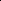

# VAEVQ: Enhancing Discrete Visual Tokenization Through Variational Modeling

<!-- Page 1 -->

VAEVQ: Enhancing Discrete Visual Tokenization Through Variational Modeling

Sicheng Yang *1,2†, Xing Hu *1, Qiang Wu1, Dawei Yang1‡

1Houmo AI 2Xi’an Jiaotong University yscript@stu.xjtu.edu.cn, xing.hu@houmo.ai, dawei.yang@houmo.ai, qiang.wu@houmo.ai

## Abstract

Vector quantization (VQ) transforms continuous image features into discrete representations, providing compressed, tokenized inputs for generative models. However, VQ-based frameworks suffer from several issues, such as non-smooth latent spaces, weak alignment between representations before and after quantization, and poor coherence between the continuous and discrete domains. These issues lead to unstable codeword learning and underutilized codebooks, ultimately degrading the performance of both reconstruction and downstream generation tasks. To this end, we propose VAEVQ, which comprises three key components: (1) Variational Latent Quantization (VLQ), replacing the AE with a VAE for quantization to leverage its structured and smooth latent space, thereby facilitating more effective codeword activation; (2) Representation Coherence Strategy (RCS), adaptively modulating the alignment strength between pre- and post-quantization features to enhance consistency and prevent overfitting to noise; and (3) Distribution Consistency Regularization (DCR), aligning the entire codebook distribution with the continuous latent distribution to improve utilization. Extensive experiments on two benchmark datasets demonstrate that VAEVQ outperforms state-of-the-art methods.

Code — https://github.com/script-Yang/VAEVQ

## Introduction

Discrete visual tokenization transforms continuous image features into discrete representations by mapping them to entries in a learned codebook, typically implemented via vector quantization (VQ) (Van Den Oord, Vinyals et al. 2017). In autoregressive transformers, the discrete tokens produced by VQ serve as sequential inputs for image generation (Esser, Rombach, and Ommer 2021), while in latent diffusion models, VQ functions as an autoencoder (AE) that defines the sampling space (Rombach et al. 2022). Thus, the structure and utilization of the codebook are crucial to both the reconstruction quality and the expressiveness of generative models (Cao et al. 2023; Tian et al. 2024).

*These authors contributed equally. †This work was conducted during his internship at Houmo AI. ‡Corresponding author. Copyright © 2026, Association for the Advancement of Artificial Intelligence (www.aaai.org). All rights reserved.

(a) Vanilla (b) VLQ (c) VLQ+RCS+DCR

VAE

AE

AE

DINO encode quant align quant VAE Space

AE Space

Domain shift

Overhead

Codebook

Collapse

ℒrcs

ℒdcr

High efficiency

High utilization

Learned code

Dead code

**Figure 1.** Comparison of different VQ strategies. (a) Direct quantization over AE latents often leads to codebook collapse, as the latent space of AE is typically irregular and fragmented, making it suboptimal for quantization. (b) VLQ introduces variational modeling to smooth the transition between pre- and post-quantization representations, enabling more effective codeword activation and updating. (c) The complete VAEVQ framework, augmented with RCS and DCR, achieves high efficiency (i.e., without pretrained models such as DINO) and high codebook utilization.

However, existing discrete visual tokenizers suffer from three major limitations. First, autoencoders(AEs) produce an irregular, fragmented latent space with sparse and disconnected clusters (Dai and Wipf 2019; Vuong et al. 2023). As shown in Fig.1(a), such unstructured representations hinder the effective activation and updating of codewords, leading to codebook collapse. Recent methods such as FSQ (Mentzer et al. 2023) and LFQ (Yu et al. 2023) attempt to reshape the AE latent space by forcibly compressing it and discarding its unstructured components. While this compression improves quantizability to some extent, it introduces a representational bottleneck that significantly limits expressiveness, especially under large codebook settings (Zhu et al. 2024b).

Second, the weak constraint between pre- and postquantization representations often leads to semantic misalignment, allowing noise or unstable features to be writ-

The Fortieth AAAI Conference on Artificial Intelligence (AAAI-26)

11703

AI-readable visual equivalent, added: Figure extracted from the paper PDF and converted to an SVG wrapper asset. Use the surrounding page text and caption for interpretation.

AI-readable visual equivalent, added: Figure extracted from the paper PDF and converted to an SVG wrapper asset. Use the surrounding page text and caption for interpretation.

AI-readable visual equivalent, added: Figure extracted from the paper PDF and converted to an SVG wrapper asset. Use the surrounding page text and caption for interpretation.

<!-- Page 2 -->

ten into the codebook. Existing methods typically minimize the distance between encoder outputs and their nearest codewords, without accounting for the noise and uncertainty in the encoder, particularly during the early stages of training (Peng et al. 2021). This can result in unstable codeword assignments and noisy codebook updates. VQGAN- EMA (Razavi, Van den Oord, and Vinyals 2019) introduces exponential moving average updates to stabilize the learning dynamics, while RQVAE (Lee et al. 2022) leverages residual connections to refine encoded features. However, these techniques provide only marginal improvements as the codebook size grows and cannot fundamentally resolve instability.

Third, there is a lack of explicit structural alignment between the continuous latent space and the discrete codebook space (Fang et al. 2025). Since only a small subset of codewords is updated in each iteration, the codebook distribution may gradually drift away from the latent manifold (Takida et al. 2022), leaving most entries underutilized (Zheng and Vedaldi 2023). Some methods attempt to mitigate this drift by introducing external semantic guidance. For instance, VQGAN-LC (Zhu et al. 2024a) incorporates CLIP (Radford et al. 2021) features, and SoftVQ (Chen et al. 2025) employs DINO (Caron et al. 2021) supervision to align token semantics. However, as illustrated in the top-right part of Fig.1, these pretrained models are trained on natural images and often suffer from domain shift when applied to fields like medical imaging (Caron et al. 2021). Moreover, reliance on such external supervision introduces additional computational overhead.

In this paper, we propose VAEVQ, a unified framework composed of three key components to improve codebook utilization and representation quality in vector quantization. Specifically, We introduce the Variational Latent Quantization (VLQ) module, which performs quantization within the smooth latent space produced by a VAE, enabling more effective codeword activation and updating. We propose the Representation Coherence Strategy (RCS) to further improve representation consistency by leveraging both the encoder’s output variance and codeword information, and adaptively penalizing discrepancies between pre- and postquantization features. We present the Distribution Consistency Regularization (DCR) module, which aligns the codebook distribution with the VAE’s Gaussian prior via optimal transport. This alignment encourages both the continuous and discrete latent spaces to conform to a shared prior, thereby mitigating global distribution mismatches. Our contributions can be summarized as follows:

• We propose Variational Latent Quantization (VLQ), which replaces the standard AE with a VAE for quantization. By leveraging the structured latent space and Gaussian sampling induced by the VAE, VLQ produces smoother and more organized latent features, facilitating more effective codeword activation and updating, and ultimately alleviating codebook collapse.

• We introduce the Representation Coherence Strategy (RCS) to mitigate the semantic inconsistency between pre- and post-quantization features. RCS adaptively adjusts the alignment strength based on encoder uncer- tainty and codeword statistics, suppressing the influence of noisy or unstable features during codebook updates. • We present Distribution Consistency Regularization (DCR) to reduce global distribution mismatch between the continuous and discrete latent spaces. DCR leverages optimal transport to align the codebook distribution with the VAE’s Gaussian prior, promoting consistency across latent spaces and enhancing codebook utilization. • We conduct extensive experiments on two benchmark datasets, demonstrating that VAEVQ consistently outperforms state-of-the-art baselines in both reconstruction and generation tasks.

## Related Work

Discrete Visual Tokenizers Visual tokenizers convert images into compact representations for generative modeling and fall into two main categories: continuous and discrete. Continuous approaches like VAEs (Kingma, Welling et al. 2013) offer strong semantic modeling but produce continuous outputs incompatible with token-based transformers. Discrete methods such as VQ-VAE (Van Den Oord, Vinyals et al. 2017) and VQGAN (Esser, Rombach, and Ommer 2021), as well as their numerous variants (Weber et al. 2024; Zhou et al. 2025), generate indexable tokens via codebooks, enabling autoregressive and diffusion models, yet often suffer from codebook collapse and semantic loss (Ma et al. 2025; Yang, Xing, and Zhu 2025; Han et al. 2025; Zhang et al. 2025). To address this, we propose VAEVQ, a framework that combines the semantic richness of VAEs with the discrete structure required for token-based generation.

Visual Tokenizers for Image Generation The representations produced by discrete visual tokenizers serve as the foundation for downstream tasks. In autoregressive settings (Chang et al. 2022; Sun et al. 2024), transformers predict the next token in a sequence, while latent diffusion models (Rombach et al. 2022; Karras et al. 2022; Esser et al. 2024) iteratively denoise tokens in a learned latent space. In both cases, tokens produced by the trained codebook critically affects generation quality (Razavi, Van den Oord, and Vinyals 2019). However, conventional discrete tokenizers often yield poorly utilized or semantically inconsistent codebooks. To address this, we propose VAEVQ, which combines variational encoding with vector quantization to produce discrete tokens that are both expressive and welldistributed. This unified design enhances token quality and yields improvements across diverse generative paradigms.

## Methodology

Overview Figure 2 illustrates the proposed VAEVQ framework. The VLQ module quantizes the latent space of a VAE and employs dual-path decoding to reconstruct the input from both the sampled and quantized representations. RCS adaptively aligns the pre- and post-quantization vectors at the feature level, guided by the encoder’s output variance and the corresponding codewords. DCR regularizes the global code-

11704

<!-- Page 3 -->

Enc 𝑥

Sample Update

1

2

N-1

N-2

N

Codebook 𝑧𝑐 ℎ𝑐 𝑧𝑞

RP Trick

VLQ Module

Grad

N-3

Query

Dec 𝑧𝑞 𝑧𝑐

RCS 𝑧𝑞,1 𝜇𝑐,1 𝜎𝑐,1 𝜎𝑐,2 𝜇𝑐,2 𝑧𝑞,2

ℒ𝑟𝑐𝑠 1 = 6.19 ℒ𝑟𝑐𝑠 1 = 0.35 ℒ𝑟𝑐𝑠 𝑧c 𝑧𝑞

DCR

N 2 1

VAE Prior

ℒdcr

2 = 0.08 ℒdcr

1 = 3.74 Update 𝜇 𝜎 Random Gaussian Noise

**Figure 2.** Overview of the proposed VAEVQ framework. The VLQ module encodes the input into a variational latent vector zc and quantizes it into zq, followed by dual-path decoding to enforce consistency. RCS imposes a variance-aware alignment between zc and zq to preserve confident features while tolerating uncertainty. DCR aligns the codebook distribution with the VAE prior via optimal transport. Through the joint effect of these modules, the codebook is progressively updated during training, leading to improved utilization and higher-quality visual tokens.

book distribution to match the VAE prior via optimal transport, thereby encouraging comprehensive codeword activation. Together, these components enhance codebook utilization and token quality.

Variational Latent Quantization (VLQ)

Traditional vector quantization (VQ) frameworks typically operate on the latent space of deterministic autoencoders (AEs). Although AEs can preserve local semantics to some extent through reconstruction training, their latent representations often exhibit irregular global geometry and nonuniform density (Dai and Wipf 2019). That is, the relative distribution of latent vectors does not faithfully reflect the relative similarity structure of their corresponding inputs, which leads to distortions in the latent space and ultimately hampers quantization effectiveness (Peng et al. 2021). Such misalignment between the latent manifold and the input data manifold limits codebook utilization and may cause codeword collapse under large-scale settings. In contrast, the latent space induced by a variational autoencoder (VAE) is explicitly regularized to follow a smooth prior distribution, resulting in more continuous, semantically coherent representations that are better suited for quantization.

To overcome these limitations, we propose Variational Latent Quantization (VLQ). as illustrated in Fig. 1, Fig. 3, VLQ performs quantization over latent vectors sampled from the VAE latent space, whose smoother and more continuous structure facilitates codeword learning and leads to higher codebook utilization.

Given an input image x, the encoder E(·) produces a hidden feature hc = E(x), which generates the mean µc and log-variance log σ2 c of a diagonal Gaussian posterior q(z|x). A latent vector is sampled using the reparameterization trick (Kingma, Welling et al. 2013):

zc = µc + σc ⊙ϵ, ϵ ∼N(0, I), (1) and quantized via nearest-neighbor lookup in a learnable codebook:

k∗= arg min k ∥zc −ek∥2

2, zq = ek∗. (2)

Both zc and zq are passed through a shared decoder D to reconstruct the input:

ˆxc = D(zc), ˆxq = D(zq), (3) and the reconstruction loss is defined as:

Lrec = ∥x −ˆxc∥2

2 + ∥x −ˆxq∥2 2. (4) VLQ offers three key advantages. First, it quantizes latent features sampled from the VAE latent space, which tends to be more continuous and well-structured than that of AE latent space, leading to more effective and robust quantization. Second, the stochasticity introduced by ϵ ∼N(0, I) encourages the sampled latent vector zc to explore the latent space more broadly, promoting diverse codeword activation and alleviating early-stage codebook collapse. Third, VLQ employs a dual-path reconstruction strategy where both zc and its quantized version zq are used for decoding. This setup not only reduces semantic drift by allowing zc to provide corrective feedback to zq, but also enables zq to guide zc, gradually aligning its distribution with the codebook topology and making it more quantization-friendly.

11705

<!-- Page 4 -->

(a) Vanilla (b) VLQ

Init code Dead code Learned code

Fail! easy hard easy

**Figure 3.** Comparison between vanilla vector quantization and our proposed Variational Latent Quantization (VLQ). (a) In vanilla VQ, latent features from the autoencoder (AE) latent space are sparse and rigid, causing most initial codewords (orange) to remain unused. As a result, many codewords become inactive (red), and only a few (green) are eventually trained, leading to low codebook utilization. (b) In VLQ, latent vectors are drawn from the VAE latent space, which has a smoother distribution. This enables more codewords to be activated and gradually updated.

Representation Coherence Strategy (RCS) Vector quantization (VQ) models often incorporate featurelevel alignment objectives to bridge the gap between the continuous latent zc and its quantized counterpart zq. A common approach is to apply an ℓ2 penalty, i.e., ∥zq −zc∥2, which we refer to as hard alignment. However, since the encoder inevitably introduces noise during training, the ℓ2 loss penalizes all deviations equally, regardless of whether the discrepancy is semantically meaningful or caused by uncertainty. This indiscriminate treatment can cause the model to overcorrect dimensions that are inherently high-variance and naturally fluctuating.

To address these issues, we propose the Representation Coherence Strategy (RCS), a soft alignment mechanism that adapts the alignment strength according to the encoder’s confidence in each latent dimension. In our VLQ framework, zc is not a deterministic point but a sample drawn from a Gaussian distribution parameterized by the encoder: zc ∼N(µc, diag(σ2 c)). Within this formulation, the variance σ2 c reflects the encoder’s uncertainty. A lower variance indicates higher confidence, suggesting that the corresponding dimension encodes stable and reliable semantics. Accordingly, zq is expected to lie within this highconfidence region and deviations from it should be penalized more strongly. In contrast, higher variance implies uncertainty, and zq should be allowed to explore a wider range of plausible alternatives.

Formally, we express this behavior using the loglikelihood of zq under the distribution of zc:

log p(zq) = −1

2 d X i=1

" zq,i −µc,i σc,i

2

+ log(2πσ2 c,i)

#

,

(5)

and define the coherence loss as the negative log-likelihood:

Lrcs = −log p(zq). (6)

To stabilize training and avoid gradient explosion in highuncertainty regions, we detach the variance term σc from the computational graph and omit the constant term, yielding the simplified objective:

Lrcs = 1

2 d X i=1 zq,i −µc,i detach(σc,i)

2

. (7)

By minimizing Lrcs, RCS enforces a confidence-aware soft alignment that adaptively constrains zq based on the encoder’s reliability. Dimensions with low variance, indicative of high confidence, are aligned more tightly to preserve critical semantics, while high variance dimensions are granted greater flexibility to avoid overfitting noise and to explore a wider range of codewords. This variance-guided constraint acts as a divide-and-conquer strategy, encouraging zc and zq to move closer in a targeted manner. As a result, RCS preserves essential semantic information while promoting more balanced and effective codebook utilization.

Distribution Consistency Regularization (DCR) Traditional vector quantization (VQ) methods typically lack explicit constraints on the global structure of the codebook, often leading to codebook collapse or severe underutilization, where only a small subset of codewords are frequently updated during training. VLQ and RCS partially alleviate this issue: VLQ leverages a well-structured variational latent space for quantization, promoting diversified codeword activation, while RCS imposes instance-level alignment between the sampled latent zc and its quantized counterpart zq to enhance local consistency. However, neither method explicitly regulates the overall distribution of the codebook. As a result, they remain insufficient to ensure meaningful utilization of all codewords throughout training.

To address this, we introduce Distribution Consistency Regularization (DCR), which enforces global consistency between the discrete and continuous latent spaces. In VAE frameworks, only the continuous latents are regularized toward the standard Gaussian prior N(0, I). DCR extends this constraint to the quantized branch by encouraging the codebook embeddings to follow the same prior, formulated as a distribution alignment problem solved via optimal transport.

From a statistical perspective, the approximate Gaussianity of the quantized representations can be explained by the bounded and finite-variance nature of the latent space: when a large number of latent samples are aggregated, their empirical distribution tends to approach a multivariate Gaussian according to the central limit theorem (Rosenblatt 1956; Kwak and Kim 2017). Therefore, we model the codebook C = {ek}K k=1 as a finite set of samples drawn from an empirical Gaussian distribution:

ˆq(zq) = N(µq, Σq), (8)

µq = 1

K

K X k=1 ek, (9)

Σq = 1 K −1

K X k=1

(ek −µq)(ek −µq)⊤. (10)

11706

AI-readable visual equivalent, added: Figure extracted from the paper PDF and converted to an SVG wrapper asset. Use the surrounding page text and caption for interpretation.

AI-readable visual equivalent, added: Figure extracted from the paper PDF and converted to an SVG wrapper asset. Use the surrounding page text and caption for interpretation.

<!-- Page 5 -->

This formulation characterizes the geometry of the codebook using its first- and second-order statistics, providing a compact parametric approximation of its global distribution. To align the codebook distribution ˆq(zq) with the VAE prior N(0, I), we formulate this task as an optimal transport (OT) problem. In the special case where both source and target distributions are Gaussians, the 2-Wasserstein distance (Panaretos and Zemel 2019) admits a closed-form expression. The resulting regularization objective is given by:

Ldcr = ∥µq∥2

2 + Tr(Σq) −2 · Tr(Σ1/2 q), (11)

where Tr(·) denotes the matrix trace operator. This regularization encourages the global structure of the codebook to match the Gaussian prior, thereby improving compatibility with the variational latent space. Under the VAE framework, the continuous latent space is naturally regularized toward N(0, I); by minimizing Ldcr, the discrete codebook is similarly guided to adopt this structure. As training progresses, codewords are dynamically adjusted to align with the distributional structure of the continuous latent space. This structural consistency facilitates smoother transitions between zc and zq, reduces quantization error, and enhances codebook utilization. The improved alignment also activates a broader range of codewords, thereby increasing the expressive capacity of the codebook.

While RCS promotes instance-level consistency between zc and zq, DCR complements it by globally regularizing the distribution of codebook embeddings. As illustrated in Fig. 4, VLQ explicitly quantizes samples from the continuous latent space of a VAE, enabling a smoother transition to discrete representations. RCS enforces feature-level consistency between the sampled and quantized latents, reducing semantic drift caused by quantization. DCR further regularizes the overall codebook distribution by aligning it with the VAE prior, promoting balanced codeword activation. Together, these components not only stabilize the learning dynamics but also maintain a well-structured latent space that facilitates effective and balanced codeword usage, thereby enhancing codebook utilization.

VQ

VAE

Prior

(a) VLQ (b) VLQ + RCS (c) VLQ + RCS +DCR

Prior

VAE VQ

Prior

VAE VQ codeword

**Figure 4.** Conceptual illustration of the progressive alignment among the VQ space, continuous latent space (VAE), and the prior distribution. (a) VQ and VAE are partially aligned, but both remain misaligned with the prior. (b) RCS encourages instance-level alignment between VQ and VAE, reducing their local discrepancies. However, some regions of the latent space remain unaligned. (c) DCR regularizes the codebook distribution to match the Gaussian prior, yielding a diverse and well-structured codebook whose space is aligned with both the VAE latent space and the prior.

Training Objective To ensure a fair comparison, we adopt the same encoder and decoder architecture as VQGAN (Esser, Rombach, and Ommer 2021). The overall objective is formulated as:

Ltotal = Lrec + λrcsLrcs + λdcrLdcr + λnetLnet. (12)

Here, Lnet includes the perceptual and adversarial losses commonly used in VQGAN (Esser, Rombach, and Ommer 2021), along with the KL loss from the VAE branch (Van Den Oord, Vinyals et al. 2017). The weights of each loss component are determined through extensive empirical studies to ensure stable training and optimal performance. Specifically, we set λrcs = 1.0 and λdcr = 0.1, while λnet remains consistent with the default setting in VQGAN.

## Experiments

Datasets and Implementation Details Datasets. We evaluate our method on two benchmark datasets: ImageNet (Deng et al. 2009) and BraTS24 (de Verdier et al. 2024). Both datasets are resized to 256 × 256. ImageNet is a large-scale natural image dataset with diverse object categories, and we follow its standard train/test split. To assess the generalization ability of our model across domains and modalities, we further include BraTS24, a medical imaging dataset that differs significantly from ImageNet in both visual appearance and semantic structure. BraTS24 contains multi-contrast 3D brain MRI scans; to ensure compatibility with our 2D framework, we extract axial slices from the volumetric data. We use 80% of the subjects for training and the remaining 20% for evaluation and testing. Both datasets are used for reconstruction and generation tasks, enabling a comprehensive evaluation of VAEVQ’s performance across diverse visual domains.

Implementation Details. We use VQGAN (Esser, Rombach, and Ommer 2021) as the primary baseline and compare it with several representative variants and competing methods, including Mo-VQGAN (Zheng et al. 2022), VQGAN-EMA (Razavi, Van den Oord, and Vinyals 2019), VQGAN-LC (Zhu et al. 2024a), SimVQ (Zhu et al. 2024b), SoftVQ (Chen et al. 2025), and our proposed VAEVQ. For all models, the latent dimensionality is set to 64 and the codebook size is fixed at 16,384 for consistency and fair comparison. All models are implemented using the PyTorch 2.4.1 framework. Training is performed from scratch for 50 epochs with a batch size of 32, using the Adam optimizer with an initial learning rate of 1 × 10−4, following a cosine annealing schedule, on 8 NVIDIA A6000 GPUs. Performance is evaluated using three standard metrics: PSNR, SSIM, and reconstruction FID (rFID).

Visual Reconstruction Performance As shown in Table 1, our proposed VAEVQ consistently outperforms all baselines and state-of-the-art methods across both datasets and all metrics. In particular, compared to the strongest prior method SimVQ, VAEVQ achieves a 0.03dB improvement in PSNR, 2% in SSIM, and a 0.72 reduction in

11707

<!-- Page 6 -->

## Method

ImageNet BraTS24

PSNR↑ SSIM↑ rFID↓ PSNR↑ SSIM↑ rFID↓

VQGAN 19.28 0.53 8.02 21.59 0.81 10.47 VQGAN-EMA 20.23 0.55 6.36 23.37 0.83 9.35 Mo-VQGAN 21.12 0.57 4.49 25.33 0.85 8.91 VQGAN-LC 21.48 0.62 3.52 26.59 0.89 9.78 SoftVQ 21.73 0.65 2.03 27.34 0.91 5.12 SimVQ 22.02 0.66 1.86 29.82 0.93 4.36 Ours 22.05 0.68 1.14 31.91 0.95 2.50

**Table 1.** Comparison of visual tokenizers on ImageNet and BraTS24 using PSNR, SSIM, and rFID. Higher PSNR/S- SIM and lower rFID are better.

VQGAN VQGAN-EMA VAEVQ 0

20

40

60

80

100

Codebook…Utilization…(\%)

7.2

25.6

99.9

3.4

18.1

## 99.8 ImageNet

BraTS24

**Figure 5.** Codebook utilization rates (%) of different tokenizers on ImageNet and BraTS24. VAEVQ achieves significantly higher utilization across both datasets, indicating more effective and diverse token usage.

rFID on ImageNet. On BraTS24, it brings a further 2.09dB PSNR gain, 0.02 SSIM improvement, and a 1.86 drop in rFID. These results underscore the superior reconstruction quality and robust domain generalization capability of our approach. Notably, although VQGAN-LC attempts to leverage external pre-trained feature extractors for enhanced tokenization, it exhibits a relatively high rFID on the BraTS24 dataset (9.78), suggesting that such domain-agnostic priors may induce semantic drift when applied to medical images with significantly different visual structures.

We further analyze the codebook utilization rates (Tian et al. 2024) on the two benchmark datasets, as illustrated in Fig. 5. The baseline VQGAN shows significant underutilization, with only 7.2% and 3.4% of the codebook entries effectively used on the two datasets, indicating that most codewords remain inactive. Although its EMA-based variant achieves moderate improvements, the overall utilization remains suboptimal. In stark contrast, our VAEVQ activates nearly all codebook entries, effectively resolving the issue of insufficient codeword usage.

**Fig. 6.** presents qualitative comparisons of reconstructed samples from both datasets. Compared to existing methods, VAEVQ generates reconstructions with clearer textures, sharper boundaries, and stronger semantic consistency. These visual results, combined with the quantitative evaluations and codebook analysis, demonstrate the effectiveness of VAEVQ in achieving high perceptual quality

**Figure 6.** Visual comparison of reconstructed images on two benchmark datasets. Compared to existing methods, VAEVQ achieves superior reconstruction quality with sharper textures and enhanced structural preservation.

while faithfully preserving structural and semantic details.

Visual Generation Performance To evaluate the generative capability of our learned codebook, we integrate it into two mainstream generation paradigms: autoregressive and diffusion-based models. For the autoregressive setting, we adopt LlamaGen-B (Sun et al. 2024) as the generative backbone. For the diffusion-based setting, we adopt the LDM-4 model (Rombach et al. 2022). Except for replacing the visual tokenizer with our proposed VAEVQ, all other configurations follow the original implementation. We evaluate generation quality on ImageNet and BraTS24 using the standard generation FID (gen FID) metric. As shown in Table 2, our VAEVQ consistently outperforms VQGAN in terms of generative quality, achieving lower gFID scores across both generation architectures and datasets. Specifically, with LlamaGen-B, VAEVQ reduces gFID from 5.43 to 4.68 on ImageNet (↓0.75) and from 7.54 to 4.42 on BraTS24 (↓3.12). Similarly, under the LDM-4 backbone, VAEVQ lowers gFID from 3.60 to 2.98 on ImageNet (↓0.62) and from 6.85 to 3.11 on BraTS24 (↓3.74). These improvements can be attributed to the effectiveness of VAEVQ’s three core components, which jointly contribute to better generative quality across diverse settings.

11708

AI-readable visual equivalent, added: Figure extracted from the paper PDF and converted to an SVG wrapper asset. Use the surrounding page text and caption for interpretation.

<!-- Page 7 -->

Tokenizer LlamaGen-B LDM-4

ImageNet BraTS24 ImageNet BraTS24

VQGAN 5.43 7.54 3.60 6.85 VAEVQ 4.68 4.42 2.98 3.11

∆(↓) 0.75 3.12 0.62 3.74

**Table 2.** Generation FID (gFID ↓) comparison between VQ- GAN and our VAEVQ on ImageNet and BraTS24 using LlamaGen-B and LDM-4. Lower values indicate better generative quality.

## Method

VLQ RCS DCR ImageNet BraTS24

Baseline 8.02 10.47 M1 ✓ 2.84 5.12 M2 ✓ ✓ 1.92 2.98 M3 ✓ ✓ 2.18 3.26 Ours (Full) ✓ ✓ ✓ 1.14 2.50

**Table 3.** Component-wise ablation on ImageNet and BraTS24 using rFID, where lower values indicate better reconstruction quality. We evaluate the individual and combined contributions of VLQ, RCS, and DCR modules.

Ablation Study

Impact of Codebook Size. We further investigate the impact of codebook size on reconstruction quality, generation performance, and codebook utilization on the ImageNet dataset. As shown in Fig. 7, we conduct experiments using VAEVQ under varying codebook sizes ranging from 4096 (212) to 131,072 (217). The generation model is based on the LDM-4 architecture. Our results indicate that increasing the codebook size generally improves reconstruction fidelity, as a larger dictionary offers finer granularity for encoding visual details. However, we observe that the generation performance tends to saturate once the codebook size exceeds 16,384, likely due to increased token entropy and sparsity. Therefore, we use a codebook size of 16,384 to balance reconstruction quality and generation stability. Moreover, we observe consistently high codebook utilization (above 95%) across different sizes, indicating that our framework scales well and avoids codebook collapse even at large scales.

Impact of Modular Components. We conduct ablation studies to evaluate the individual and combined contributions of VLQ, RCS, and DCR, as summarized in Table 3. Starting from the standard VQGAN as the baseline (rFID: 8.02 on ImageNet and 10.47 on BraTS24), we progressively incorporate each proposed module.

Introducing VLQ alone (M1), which quantizes the latent space of a variational autoencoder, results in a significant reduction in rFID, with values decreasing to 2.84 on ImageNet and 5.12 on BraTS24. This demonstrates the advantage of learning a smoother and more structured latent space. Incorporating RCS (M2), which enforces instancelevel coherence between the sampled latent zc and its quan-

95

100

Usage ratio

Codebook Utilization

212 213 214 215 216 217 Codebook Size

1

2

3 rFID rFID gFID

3

4 gFID

**Figure 7.** Effect of codebook size on performance. The top plot shows the codebook utilization ratio (%) across different codebook sizes, indicating how effectively the quantized space is used. The bottom plot reports the rFID and gFID.

tized counterpart zq, further improves performance, reducing the rFID to 1.92 on ImageNet and 2.98 on BraTS24. Replacing RCS with DCR (M3), which encourages alignment between the codebook distribution and the VAE prior, also yields favorable results, achieving rFID scores of 2.18 and 3.26, respectively. When all three modules are combined, the full model achieves the best performance, with the lowest rFID of 1.14 on ImageNet and 2.50 on BraTS24. These findings indicate that VLQ serves as the primary driver of performance improvement, while RCS and DCR provide complementary benefits by enhancing feature-level alignment across the quantization boundary and promoting global consistency between the codebook and the continuous latent space. Together, these components contribute to improved codebook utilization and reconstruction quality.

## Conclusion

In this paper, we propose VAEVQ, a framework that enhances vector quantization for visual representation learning. VAEVQ introduces three key components: Variational Latent Quantization (VLQ), which performs quantization over a structured and smooth latent space learned through a VAE; Representation Coherence Strategy (RCS), which adaptively adjusts the alignment strength between pre- and post-quantization features to improve local consistency; and Distribution Consistency Regularization (DCR), which aligns the global distribution of codebook embeddings with the latent prior to promote codebook utilization. Extensive experiments on two benchmark datasets demonstrate that VAEVQ consistently outperforms previous methods in terms of reconstruction quality, generative fidelity, and codebook efficiency, without relying on pretrained models.

While VAEVQ demonstrates strong empirical performance, its use of a fixed-size codebook may constrain flexibility when dealing with data of varying complexity. In future work, we plan to investigate adaptive codebook scaling strategies that allow the model to dynamically adjust the codebook size during training.

11709

<!-- Page 8 -->

## References

Cao, Y.; Li, S.; Liu, Y.; Yan, Z.; Dai, Y.; Yu, P. S.; and Sun, L. 2023. A comprehensive survey of ai-generated content (aigc): A history of generative ai from gan to chatgpt. arXiv preprint arXiv:2303.04226. Caron, M.; Touvron, H.; Misra, I.; J´egou, H.; Mairal, J.; Bojanowski, P.; and Joulin, A. 2021. Emerging properties in self-supervised vision transformers. In Proceedings of the IEEE/CVF international conference on computer vision, 9650–9660. Chang, H.; Zhang, H.; Jiang, L.; Liu, C.; and Freeman, W. T. 2022. Maskgit: Masked generative image transformer. In Proceedings of the IEEE/CVF conference on computer vision and pattern recognition, 11315–11325. Chen, H.; Wang, Z.; Li, X.; Sun, X.; Chen, F.; Liu, J.; Wang, J.; Raj, B.; Liu, Z.; and Barsoum, E. 2025. Softvq-vae: Efficient 1-dimensional continuous tokenizer. In Proceedings of the Computer Vision and Pattern Recognition Conference, 28358–28370. Dai, B.; and Wipf, D. 2019. Diagnosing and enhancing VAE models. arXiv preprint arXiv:1903.05789. de Verdier, M. C.; Saluja, R.; Gagnon, L.; LaBella, D.; Baid, U.; Tahon, N. H.; Foltyn-Dumitru, M.; Zhang, J.; Alafif, M.; Baig, S.; et al. 2024. The 2024 brain tumor segmentation (brats) challenge: Glioma segmentation on post-treatment mri. arXiv preprint arXiv:2405.18368. Deng, J.; Dong, W.; Socher, R.; Li, L.-J.; Li, K.; and Fei- Fei, L. 2009. Imagenet: A large-scale hierarchical image database. In 2009 IEEE conference on computer vision and pattern recognition, 248–255. Ieee. Esser, P.; Kulal, S.; Blattmann, A.; Entezari, R.; M¨uller, J.; Saini, H.; Levi, Y.; Lorenz, D.; Sauer, A.; Boesel, F.; et al. 2024. Scaling rectified flow transformers for high-resolution image synthesis. In Forty-first international conference on machine learning. Esser, P.; Rombach, R.; and Ommer, B. 2021. Taming transformers for high-resolution image synthesis. In Proceedings of the IEEE/CVF conference on computer vision and pattern recognition, 12873–12883. Fang, X.; Guo, L.; Chen, H.; Zhang, Y.; Song, D.; Liu, Y.; Wang, H.; Yang, H.; Yuan, Y.; Sun, Q.; et al. 2025. Enhancing Vector Quantization with Distributional Matching: A Theoretical and Empirical Study. arXiv preprint arXiv:2506.15078. Han, J.; Liu, J.; Jiang, Y.; Yan, B.; Zhang, Y.; Yuan, Z.; Peng, B.; and Liu, X. 2025. Infinity: Scaling bitwise autoregressive modeling for high-resolution image synthesis. In Proceedings of the Computer Vision and Pattern Recognition Conference, 15733–15744. Karras, T.; Aittala, M.; Aila, T.; and Laine, S. 2022. Elucidating the design space of diffusion-based generative models. Advances in neural information processing systems, 35: 26565–26577. Kingma, D. P.; Welling, M.; et al. 2013. Auto-encoding variational bayes.

Kwak, S. G.; and Kim, J. H. 2017. Central limit theorem: the cornerstone of modern statistics. Korean journal of anesthesiology, 70(2): 144. Lee, D.; Kim, C.; Kim, S.; Cho, M.; and Han, W.-S. 2022. Autoregressive image generation using residual quantization. In Proceedings of the IEEE/CVF conference on computer vision and pattern recognition, 11523–11532. Ma, C.; Jiang, Y.; Wu, J.; Yang, J.; Yu, X.; Yuan, Z.; Peng, B.; and Qi, X. 2025. Unitok: A unified tokenizer for visual generation and understanding. arXiv preprint arXiv:2502.20321. Mentzer, F.; Minnen, D.; Agustsson, E.; and Tschannen, M. 2023. Finite scalar quantization: Vq-vae made simple. arXiv preprint arXiv:2309.15505. Panaretos, V. M.; and Zemel, Y. 2019. Statistical aspects of Wasserstein distances. Annual review of statistics and its application, 6(1): 405–431. Peng, J.; Liu, D.; Xu, S.; and Li, H. 2021. Generating diverse structure for image inpainting with hierarchical VQ-VAE. In Proceedings of the IEEE/CVF conference on computer vision and pattern recognition, 10775–10784. Radford, A.; Kim, J. W.; Hallacy, C.; Ramesh, A.; Goh, G.; Agarwal, S.; Sastry, G.; Askell, A.; Mishkin, P.; Clark, J.; et al. 2021. Learning transferable visual models from natural language supervision. In International conference on machine learning, 8748–8763. PmLR. Razavi, A.; Van den Oord, A.; and Vinyals, O. 2019. Generating diverse high-fidelity images with vq-vae-2. Advances in neural information processing systems, 32. Rombach, R.; Blattmann, A.; Lorenz, D.; Esser, P.; and Ommer, B. 2022. High-resolution image synthesis with latent diffusion models. In Proceedings of the IEEE/CVF conference on computer vision and pattern recognition, 10684– 10695. Rosenblatt, M. 1956. A central limit theorem and a strong mixing condition. Proceedings of the national Academy of Sciences, 42(1): 43–47. Sun, P.; Jiang, Y.; Chen, S.; Zhang, S.; Peng, B.; Luo, P.; and Yuan, Z. 2024. Autoregressive model beats diffusion: Llama for scalable image generation. arXiv preprint arXiv:2406.06525. Takida, Y.; Shibuya, T.; Liao, W.; Lai, C.-H.; Ohmura, J.; Uesaka, T.; Murata, N.; Takahashi, S.; Kumakura, T.; and Mitsufuji, Y. 2022. Sq-vae: Variational bayes on discrete representation with self-annealed stochastic quantization. arXiv preprint arXiv:2205.07547. Tian, K.; Jiang, Y.; Yuan, Z.; Peng, B.; and Wang, L. 2024. Visual autoregressive modeling: Scalable image generation via next-scale prediction. Advances in neural information processing systems, 37: 84839–84865. Van Den Oord, A.; Vinyals, O.; et al. 2017. Neural discrete representation learning. Advances in neural information processing systems, 30. Vuong, T.-L.; Le, T.; Zhao, H.; Zheng, C.; Harandi, M.; Cai, J.; and Phung, D. 2023. Vector quantized wasserstein autoencoder. arXiv preprint arXiv:2302.05917.

11710

<!-- Page 9 -->

Weber, M.; Yu, L.; Yu, Q.; Deng, X.; Shen, X.; Cremers, D.; and Chen, L.-C. 2024. Maskbit: Embedding-free image generation via bit tokens. arXiv preprint arXiv:2409.16211. Yang, S.; Xing, Z.; and Zhu, L. 2025. VQ-Seg: Vector- Quantized Token Perturbation for Semi-Supervised Medical Image Segmentation. In The Thirty-ninth Annual Conference on Neural Information Processing Systems. Yu, L.; Lezama, J.; Gundavarapu, N. B.; Versari, L.; Sohn, K.; Minnen, D.; Cheng, Y.; Birodkar, V.; Gupta, A.; Gu, X.; et al. 2023. Language Model Beats Diffusion–Tokenizer is Key to Visual Generation. arXiv preprint arXiv:2310.05737. Zhang, B.; Rao, Q.; Zheng, W.; Zhou, J.; and Lu, J. 2025. Quantize-then-Rectify: Efficient VQ-VAE Training. arXiv preprint arXiv:2507.10547. Zheng, C.; and Vedaldi, A. 2023. Online clustered codebook. In Proceedings of the IEEE/CVF International Conference on Computer Vision, 22798–22807. Zheng, C.; Vuong, T.-L.; Cai, J.; and Phung, D. 2022. Movq: Modulating quantized vectors for high-fidelity image generation. Advances in Neural Information Processing Systems, 35: 23412–23425. Zhou, Y.; Li, Z.; Ouyang, Z.; Chen, Y.; Du, R.; Zhou, D.; Fu, B.; Liu, Y.; Gao, P.; Cheng, M.-M.; et al. 2025. OneVAE: Joint Discrete and Continuous Optimization Helps Discrete Video VAE Train Better. arXiv preprint arXiv:2508.09857. Zhu, L.; Wei, F.; Lu, Y.; and Chen, D. 2024a. Scaling the codebook size of VQ-GAN to 100,000 with a utilization rate of 99%. Advances in Neural Information Processing Systems, 37: 12612–12635. Zhu, Y.; Li, B.; Xin, Y.; and Xu, L. 2024b. Addressing representation collapse in vector quantized models with one linear layer. arXiv preprint arXiv:2411.02038.

11711
