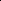

# WaveFormer: Frequency-Time Decoupled Vision Modeling with Wave Equation

<!-- Page 1 -->

WaveFormer: Frequency-Time Decoupled Vision Modeling with Wave Equation

Zishan Shu1,2*, Juntong Wu1*, Wei Yan3*, Xudong Liu1,2, Hongyu Zhang1,2, Chang Liu7†,

Youdong Mao2,3,4,5,6†, Jie Chen1,2†

1School of Electronic and Computer Engineering, Peking University, Shenzhen, China 2AI for Science (AI4S)-Preferred Program, Peking University Shenzhen Graduate School, China 3 School of Physics, Peking University, Beijing, China 4 Center for Quantitative Biology, Peking University, Beijing, China 5 National Biomedical Imaging Center, Peking University, Beijing, China 6 Peking-Tsinghua Joint Center for Life Sciences, Peking University, Beijing, China 7 Department of Automation and BNRist, Tsinghua University, Beijing, China {zishanshu, wujt, weiyan, xudongliu, zhanghy}@stu.pku.edu.cn {ymao, jiechen2019}@pku.edu.cn; liuchang2022@tsinghua.edu.cn

## Abstract

Vision modeling has advanced rapidly with Transformers, whose attention mechanisms capture visual dependencies but lack a principled account of how semantic information propagates spatially. We revisit this problem from a wave-based perspective: feature maps are treated as spatial signals whose evolution over an internal propagation time (aligned with network depth) is governed by an underdamped wave equation. In this formulation, spatial frequency—from low-frequency global layout to high-frequency edges and textures—is modeled explicitly, and its interaction with propagation time is controlled rather than implicitly fixed. We derive a closedform, frequency–time decoupled solution and implement it as the Wave Propagation Operator (WPO), a lightweight module that models global interactions in O(N log N) time—far lower than attention. Building on WPO, we propose a family of WaveFormer models as drop-in replacements for standard ViTs and CNNs, achieving competitive accuracy across image classification, object detection, and semantic segmentation, while delivering up to 1.6× higher throughput and 30% fewer FLOPs than attention-based alternatives. Furthermore, our results demonstrate that wave propagation introduces a complementary modeling bias to heat-based methods, effectively capturing both global coherence and high-frequency details essential for rich visual semantics.

## Introduction

Deep learning has achieved remarkable success in visual representation learning, largely driven by convolutional neural networks (CNNs)(He et al. 2016; Krizhevsky, Sutskever, and Hinton 2012) and vision transformers (ViTs)(Dosovitskiy et al. 2021; Liu et al. 2021). These architectures model local patterns and long-range dependencies via similarity-based interactions between tokens, but

*These authors contributed equally. †Corresponding authors. Copyright © 2026, Association for the Advancement of Artificial Intelligence (www.aaai.org). All rights reserved.

Self-Attention

Wave Propagation Operator 𝑠𝑜𝑓𝑡𝑚𝑎𝑥𝑄𝐾!/ 𝑑" 𝑉 ~ 𝑶𝑵𝟐 𝑒$%

&' 𝐴cos 𝜔(𝑡+ 𝐵sin 𝜔(𝑡 ~ 𝑶𝑵𝒍𝒐𝒈𝑵

(a) Previous Methods:

(b) WaveFormer:

**Figure 1.** (a) The self-attention operator facilitates information from a pixel to all other pixels, resulting in O(N 2) complexity.(b) The wave propagation operator (WPO) introduces oscillatory dynamics that balance energy across different frequency components, enabling new modeling behavior and reduced complexity.

they operate mainly in the spatial domain and lack an explicit inductive bias on how information at different spatial frequencies should be propagated, which can hinder the joint preservation of global semantics and fine-grained details (Luo et al. 2016).

A complementary line of work views global feature propagation through the lens of partial differential equations (PDEs). Throughout this paper, we use frequency to refer to the spatial frequency of 2D feature maps (separating low-frequency layout from high-frequency edges and textures), and time to denote the continuous propagation variable of the PDE, corresponding in networks to the temporal evolution of features. Most existing physics-inspired designs adopt heat-like conduction, which in the Fourier domain acts as a strong low-pass filter: the decay of each mode grows with the product of its spatial frequency and propagation time. This tight frequency–time coupling causes high-frequency components to vanish much faster than low-

The Fortieth AAAI Conference on Artificial Intelligence (AAAI-26)

25428

AI-readable visual equivalent, added: Figure extracted from the paper PDF and converted to an SVG wrapper asset. Use the surrounding page text and caption for interpretation.

AI-readable visual equivalent, added: Figure extracted from the paper PDF and converted to an SVG wrapper asset. Use the surrounding page text and caption for interpretation.

AI-readable visual equivalent, added: Figure extracted from the paper PDF and converted to an SVG wrapper asset. Use the surrounding page text and caption for interpretation.

<!-- Page 2 -->

frequency ones, leading to over-smoothed features and weak modeling of local structures.

We therefore ask: how should we propagate information across space so that the interaction between spatial frequency and propagation time is explicitly controllable, rather than intrinsically low-pass? To address this, we adopt a wave-based formulation. In contrast to heat-based conduction, the underdamped wave equation governs oscillatory evolution of spatial signals, where amplitude decay is controlled by damping and is not intrinsically tied to spatial frequency. In the frequency domain, low- and highfrequency components can coexist and exchange information over propagation time, providing a physically grounded alternative to similarity-based attention and heat-based conduction that preserves fine details while still supporting long-range transport.

We formalize this idea by deriving the general solution of the underdamped wave equation in 2D and extending it to high-dimensional feature space. Building upon this formulation, we propose the Wave Propagation Operator (WPO), a novel module that enables frequency-aware semantic modeling via global oscillatory propagation. Moreover, it achieves O(N log N) complexityand captures multiscale interactions in a frequency–time decoupled fashion. This design introduces a novel physics-inspired inductive bias by leveraging the underdamped wave equation to enable oscillatory information propagation. This mechanism captures multi-scale semantic features while preserving structural and fine-grained details, providing a frequency-aware and physically grounded solution for visual representation learning, as illustrated in Fig. 1. We further develop a family of WaveFormer models (i.e., WaveFormer-Tiny/Small/Base) and conduct extensive experiments to demonstrate their effectiveness across a wide range of visual tasks. Compared to benchmark vision backbones with diverse architectures (e.g., ConvNeXt (Liu et al. 2022), Swin Transformer (Liu et al. 2021), Vision Mamba (Zhu et al. 2024a), and vHeat (Wang et al. 2025)), WaveFormer consistently achieves superior performance on image classification, object detection, and semantic segmentation across different model scales. Specifically, WaveFormer-Base achieves 84.2% Top-1 accuracy on ImageNet-1K, surpassing Swin Transformer by 0.7%.

Our main contributions can be summarized as follows:

• We propose a novel frequency–time decoupled modeling framework for visual semantic propagation, which addresses the limitations of heat-based methods. To implement this framework, we adopt damped wave dynamics as the underlying mechanism, enabling oscillatory propagation that preserves both global semantics and fine-grained details across time. • We instantiate this modeling principle through Wave- Former, a physics-inspired vision backbone built upon the Wave Propagation Operator (WPO), which simulates damped wave propagation in the frequency domain. WPO achieves efficient and interpretable global information transfer with O(N log N) complexity. • We develop WaveFormer-Tiny/Small/Base and demon- strate their effectiveness across image classification, object detection, and semantic segmentation, achieving state-of-the-art accuracy–efficiency trade-offs in terms of throughput, FLOPs, and performance.

## Related Work

Vision Foundational Models

Vision Foundational Models have evolved significantly from early convolutional architectures to modern largescale pre-trained backbones. Convolutional Neural Networks (CNNs) (He et al. 2016; Krizhevsky, Sutskever, and Hinton 2012) marked the initial breakthrough in visual perception by leveraging local convolution kernels for spatially invariant feature extraction. With the advent of large-scale datasets (Deng et al. 2009) and high-performance GPUs, increasingly deeper and more efficient architectures (He et al. 2016; Huang et al. 2017; Simonyan and Zisserman 2014; Szegedy et al. 2015; Howard et al. 2017; Radosavovic et al. 2020; Tan and Le 2019; Yang et al. 2021) have been proposed. To address the inherent limitation of local receptive fields, various modifications have been introduced, such as dilated convolutions (Chollet 2017), large-kernel convolutions (Ding et al. 2022b), and dynamic convolutions (Dai et al. 2017; Wang et al. 2023b). However, despite these advances, CNNs still struggle to efficiently capture long-range dependencies in high-resolution images.

Vision Transformers (ViTs) (Dosovitskiy et al. 2021) further revolutionized vision modeling by introducing self-attention, which inherently models global dependencies between all image patches. Pretrained on massive datasets (Dosovitskiy et al. 2021; Peng et al. 2022; Touvron et al. 2021), ViTs have become dominant in various vision tasks. Hierarchical variants (Ding et al. 2022a; Dong et al. 2022; Liu et al. 2021; Tian et al. 2023; Zhang et al. 2023; Zhao, Wang, and Tian 2022) improved scalability and representation power, but their quadratic O(N 2) complexity remains a bottleneck for high-resolution images. Numerous approaches have been proposed to reduce the computational cost, including windowed attention, linear attention, and cross-covariance attention (Ali et al. 2021; Chen, Fan, and Panda 2021; Liu et al. 2021), but often at the expense of receptive field or non-linear modeling capacity. Hybrid architectures combining convolutional and transformer modules were also explored to balance efficiency and performance.

More recently, State Space Models (SSMs) (Gu et al. 2022; Nguyen et al. 2022; Wang et al. 2023a) have emerged as an alternative, offering long-sequence modeling with linear complexity, which also migrated from the natural language area (Mamba (Gu and Dao 2023)). Adaptations like visual SSMs (Liu et al. 2024; Zhu et al. 2024b) introduced selective scanning for 2D images, while RWKV and Ret- Net (Peng et al. 2023; Sun et al. 2023) improved parallelism by combining transformer-style training with efficient RNNstyle inference. Nevertheless, modeling a 2D image as a 1D sequence often impairs spatial interpretability.

25429

<!-- Page 3 -->

Stem

LN

WPO Block

LN

FFN

𝑈! 𝑈"

DWConv

Linear

WPO

LN

Linear

Linear

SiLU

×4

Frequency Domain Frequency Domain

Spatial Domain Spatial Domain

𝑈!

𝑈" u! 𝑣!

Spatial

Frequency

Spatial u# 𝑣#

Frequency-Time Decoupled

(a) (b) 𝑥, 𝑦

Φ · Ψ · 𝑒!"

#$ 𝓕𝒖𝟎𝑐𝑜𝑠𝜔&𝑡+ 𝑠𝑖𝑛𝜔&𝑡 𝜔&

𝓕𝒗𝟎+ 𝛼

2 𝓕𝒖𝟎 /

**Figure 2.** The network architecture of WaveFormer. (a) The network follows a hierarchical vision backbone design, consisting of a stem followed by four stages of WPO Blocks, where each stage integrates the Wave Propagation Operator (WPO) with feed-forward layers and downsampling in between. (b) Implementation of the WPO. The input feature map is transformed into the frequency domain, where the frequency–time decoupled analytical solution of the underdamped wave equation modulates each frequency component through oscillatory dynamics. The result is then mapped back to the spatial domain via the inverse Fourier transform, enabling global semantic propagation while preserving fine-grained high-frequency details.

Biology and Physics Inspired Models Biology and physics have long inspired the design of visual models, providing complementary inductive biases. Diffusion models (Ho, Jain, and Abbeel 2020; Saharia et al. 2022; Song, Meng, and Ermon 2020), grounded in nonequilibrium thermodynamics (De Groot and Mazur 2013), model image generation as a Markovian denoising process. QB-Heat (Chen et al. 2022) utilizes the physical heat equation as a supervision signal for masked image modeling, mimicking thermal diffusion to propagate semantic information. Similarly, Spiking Neural Networks (SNNs) (Ghosh- Dastidar and Adeli 2009; Lee, Delbruck, and Pfeiffer 2016; Tavanaei et al. 2019), inspired by biological neurons, simulate discrete spike-driven information transmission and have been applied to low-level vision tasks (Bawane et al. 2018).

Beyond biological analogies, physical principles of signal propagation have also been explored. Heat conductionbased, such as vHeat (Wang et al. 2025), approaches inherently favor smooth, monotonic diffusion but tend to oversmooth high-frequency components, losing fine-grained details. Prior studies on wave propagation (Sorteberg et al. 2018) demonstrate the potential of oscillatory dynamics for modeling frequency-balanced signal evolution (Rasht- Behesht et al. 2022). Such models preserve both global semantics and local textures, providing a physics-consistent alternative to purely data-driven architectures.

## Methodology

This chapter presents the wave physics-inspired approach for visual modeling, formulating feature evolution as semantic propagation via a damped wave equation. Building on this foundation, we introduce WaveFormer, a novel vision backbone that incorporates the newly proposed Wave Prop- agation Operators (WPO) to achieve frequency-time decoupled semantic transfer, enabling preservation of both global structure and local details. Semantic Propagation Formalization We formalize semantic propagation as damped wave dynamics, where visual features evolve through oscillatory patterns over space and time. Step 1 defines the initial semantic and velocity fields; Step 2 decomposes the solution into spatial modes with frequency–time decoupled dynamics; Step 3 derives a closed-form frequency-domain formulation for efficient and interpretable propagation. This wave-based approach preserves both global structure and fine-grained detail, offering a principled alternative to heat-based modeling.

Step 1. Wave Equation-based Semantic Propagation Denote an input image I(x, y) over a bounded spatial domain as (x, y) ∈[0, H] × [0, W]. For semantic propagation, we initialize its semantic field u(x, y, t)) and optional semantic velocity field v(x, y, t) as u(x, y, 0) = Φ(I(x, y)) = u0, v(x, y, 0) = Ψ(I(x, y)) = v0, (1)

where Φ(·) is a semantic encoder that maps the image to an initial activation field u0, and Ψ(·) optionally provides a velocity field v0 that reflects the rate of semantic excitation or suppression across regions.

The evolution of the semantic field u(x, y, t) can be modeled by the damped wave equation, as

∂2u

∂t2 + α∂u

∂t = v2

∂2u

∂x2 + ∂2u

∂y2

, u(x, y, 0) = u0, ∂u

∂t t=0

= v0.

(2)

25430

AI-readable visual equivalent, added: Figure extracted from the paper PDF and converted to an SVG wrapper asset. Use the surrounding page text and caption for interpretation.

AI-readable visual equivalent, added: Figure extracted from the paper PDF and converted to an SVG wrapper asset. Use the surrounding page text and caption for interpretation.

AI-readable visual equivalent, added: Figure extracted from the paper PDF and converted to an SVG wrapper asset. Use the surrounding page text and caption for interpretation.

AI-readable visual equivalent, added: Figure extracted from the paper PDF and converted to an SVG wrapper asset. Use the surrounding page text and caption for interpretation.

AI-readable visual equivalent, added: Figure extracted from the paper PDF and converted to an SVG wrapper asset. Use the surrounding page text and caption for interpretation.

AI-readable visual equivalent, added: Figure extracted from the paper PDF and converted to an SVG wrapper asset. Use the surrounding page text and caption for interpretation.

<!-- Page 4 -->

vHeat

WaveFormer vHeat

WaveFormer t=0 t=5 t=10 t=15 t=20 t=0 t=5 t=10 t=15 t=20 image image

**Figure 3.** Attention map evolution over time for heat conduction (top) and wave propagation (bottom) across different ADE20K image cases. Red boxes highlight key different regions.

This equation governs the propagation of semantic signals, where v controls the propagation velocity, and α determines the damping behavior across time.

Step 2. Frequency–Time Decoupling with Oscillatory Mode Decomposition To analyze the multi-scale nature of semantic propagation, we decompose the wave field u(x, y, t) into space-time separable modes. We assume a spatially orthogonal sine basis ϕn,m(x, y) = sin nπx

H sin mπy

W

, where (n, m) indexes horizontal and vertical frequency components. The field can thus be expressed as: u(x, y, t) =

∞ X n=1

∞ X m=1 qn,m(t) · ϕn,m(x, y)

=

∞ X n=1

∞ X m=1 e−α

2 t [An,m cos(ωdt) + Bn,m sin(ωdt)]

× sin nπx

H sin mπy

W

,

(3) where the constants An,m and Bn,m are determined by the initial semantic field u0(x, y) and velocity field v0(x, y) via Fourier projection.

Unlike arbitrary learnable functions, this structure is not free-form but derived from the physical solution of wave dynamics. Notably, qn,m(t) reveals a frequency-time decoupled structure: the damping term e−α

2 t uniformly governs temporal decay across all modes, while the oscillation frequency ωd is determined solely by the spatial mode index (n, m) and wave velocity v. The resulting damped frequency is:

ωn,m = v r nπ

H

2

+ mπ

W

2

, ωd = r ω2n,m − α

2

2

.

(4) This formulation enables frequency–aware semantic propagation: low-frequency modes govern global structure, and high-frequency modes preserve local detail. The temporal and spectral behaviors are independently controllable—an essential property for modeling long-range, multiscale semantic interaction without over-smoothing.

Step 3. Closed-Form Solution for Practice To facilitate practical implementation, we derive a closed-form solution to the damped wave equation (Eq. (2)) in the frequency domain. Applying the 2D Fourier transform F to both sides of the PDE, we convert spatial derivatives into multiplicative frequency terms and obtain the following explicit solution in the spectral domain:

u(x, y, t) = F−1n e−α

2 th F(u0) cos(ωdt)

+ sin(ωdt)

ωd

F(v0) + α

## 2 F(u0) io

,

(5)

where u0 and v0 denote the initial semantic field and velocity as defined in Eqs. (1), and ωd is the damped propagation frequency defined in Eq. (4).

This solution serves as a continuous counterpart to the mode expansion in Eq. (3), shifting from discrete spatial modes to continuous frequency components. Notably, it reveals a desirable frequency–time decoupling: unlike the heat equation where high frequencies decay quickly due to the e−kω2t term, the damping e−αt/2 applies uniformly across frequencies, while ωd governs frequency-specific oscillations. This structure allows both low- and high-frequency semantics to persist over time, rather than being rapidly suppressed. The damping behavior remains controllable via α, enabling fine-grained temporal regulation.

Together, our wave-based formulation models semantic propagation as damped oscillations over space and time. By decoupling frequency and time, it preserves both global coherence and fine details without over-smoothing. This provides a compact, physically grounded foundation for expressive semantic modeling in WaveFormer.

Semantic Propagation Instantiation

Wave Propagation Operator (WPO) Drawing inspiration from the analogy between wave physics and the propagation of visual semantics, we propose the Wave Propagation Operator (WPO), a frequency-modulated propagation module designed to simulate wave-based semantic transfer within image representations.

25431

AI-readable visual equivalent, added: Figure extracted from the paper PDF and converted to an SVG wrapper asset. Use the surrounding page text and caption for interpretation.

AI-readable visual equivalent, added: Figure extracted from the paper PDF and converted to an SVG wrapper asset. Use the surrounding page text and caption for interpretation.

AI-readable visual equivalent, added: Figure extracted from the paper PDF and converted to an SVG wrapper asset. Use the surrounding page text and caption for interpretation.

AI-readable visual equivalent, added: Figure extracted from the paper PDF and converted to an SVG wrapper asset. Use the surrounding page text and caption for interpretation.

<!-- Page 5 -->

WPO is grounded in the oscillatory dynamics of the damped wave equation, as formalized in Eq. (5). The solution exhibits temporally coherent oscillation, frequencyindependent damping, and preserves both global and finegrained semantic components over time.

To implement WPO in practice, we extend the 2D scalar semantic field u(x, y, t) to a multi-channel semantic tensor U(x, y, c, t), where c = 1,..., C is the channel index in a feature map. The input U 0 = U(x, y, c, 0) and its optional initial velocity V 0 = V (x, y, c, 0) are propagated across abstract time t using the frequency-domain closed-form solution. Formally, WPO) can be defined as:

U t = F−1n e−α

2 th F(U 0) cos(ωdt)

+ sin(ωdt)

ωd

F(V 0) + α

## 2 F(U 0) io

,

(6)

where F and F−1 denote the 2D Fourier transform and its inverse applied per channel, and ωd is the damped frequency magnitude computed from the spatial frequency spectrum:

ωd = q v2(ω2x + ω2y) − α

2 2. (7)

Here, (ωx, ωy) denotes the 2D frequency grid over spatial dimensions. The scalar hyperparameters α and v control the damping and semantic propagation velocity, respectively, and can be made trainable or adaptive.

WaveFormer Inspired by the oscillatory nature of physical wave propagation, we propose WaveFormer, a physicsinspired architecture for visual representation learning. Unlike heat conduction, which irreversibly dissipate information, WaveFormer models semantic propagation as damped oscillations, enabling global context modeling with reversible energy transfer.

WaveFormer serves as a drop-in replacement for standard ViTs or CNNs. As illustrated in Fig. 2, the model partitions the input image into patches and embeds them into a feature map. Multiple stages progressively downsample the spatial resolution while increasing the channel dimension.

Each stage consists of several Wave Propagation Layers, where Transformer self-attention is replaced by WPO, while depthwise convolutions and feedforward layers enhance local and channel-wise modeling. WaveFormer is built upon the Wave Propagation Operator (WPO), which integrates the principle of the damped wave equation (Eq. 6) into discrete feature processing. The wave velocity and damping are made adaptive to image content, making WaveFormer a flexible and learnable vision backbone.

We develop three variants: WaveFormer-Tiny, WaveFormer-Small, and WaveFormer-Base, differing in width and depth. Thanks to its physically grounded propagation dynamics and efficient spectral implementation, WaveFormer achieves competitive accuracy with reduced computational cost compared to attention-based backbones.

## Discussion

Why does the damped wave field U(x, y, c, t) correspond to visual features, and what is the role of the damped oscillation terms cos(ωdt) and sin(ωdt) in WaveFormer? WaveFormer models semantic information as a damped wave field evolving over time. The feature value U(x, y, c, t) captures oscillatory information flow across the feature map, enabling bidirectional, reversible propagation—unlike heat conduction, which diffuses irreversibly. In the frequency domain, each spatial frequency (ωx, ωy) propagates via a damped oscillation:

e−α

2 t

ˆu0 cos(ωdt) + 1 ωd

ˆv0 + α

2 ˆu0 sin(ωdt)

, where ωd is the damped frequency determined by spatial frequency ω0 and learnable damping α. Low frequencies decay slowly and encode global structure, while high frequencies oscillate rapidly and are selectively attenuated, preserving edges and textures. This frequency-aware mechanism allows WaveFormer to retain both global context and fine detail, enabling interpretable semantic propagation.

Why is wave propagation suitable for visual representation learning? Many physics-inspired methods use heat conduction for global modeling, but this oversmooths features and suppresses high-frequency signals. In contrast, wave propagation distributes energy more evenly across frequencies via oscillation, preserving both global coherence and fine detail. This makes wave-based propagation a strong complement to heat-based models with enhanced ability to capture complex patterns.

## Experiment

Experimental Settings We evaluate WaveFormer on three core vision tasks—image classification, object detection, and semantic segmentation—using ImageNet-1K (Deng et al. 2009), COCO (Lin et al. 2014), and ADE20K (Zhou et al. 2017). We use the same training strategy for each task to ensure a fair comparison. All models are trained using Pytorch, and some pretrained weights are used for downstream tasks. More details are provided in Appendix 2.

Experimental Results Image classification. The ImageNet-1K classification results are summarized in Table 1. Under similar FLOPs and model sizes, WaveFormer outperforms representative CNN and ViT architectures across all scales. For example, WaveFormer-T achieves 82.5% top-1 accuracy, surpassing Swin-T/ConvNeXt-T by +1.2%/+0.4% with only 4.4G FLOPs. Notably, WaveFormer also exhibits clear advantages at larger scales. Specifically, WaveFormer-B reaches 84.2% top-1 accuracy with 10.8G FLOPs and 68M parameters, improving over Swin-B/Vim-B by 0.7%/1.0% while being more computationally efficient. In terms of throughput, WaveFormer shows consistently higher inference speed than baselines: for instance, WaveFormer-T achieves 1560 images/s, which is 26% faster than ConvNeXt-T and 92% faster than Vim-S, while maintaining superior accuracy. These results highlight the efficacy of frequency-aware wave propagation for balanced global and local feature modeling.

25432

<!-- Page 6 -->

## Method

Image size #Param. FLOPs Test Throughput

(img/s)

ImageNet top-1 acc. (%)

Swin-TICCV2021 28M 4.6G 81.3 ConvNeXt-TCVPR2022 29M 4.5G 82.1 DCFormer-SW-TWACV2023 28M 4.5G - 82.1 Vim-SICML2024 26M 5.3G 811 81.4 vHeat-TCVPR2025 29M 4.6G 82.2 WaveFormer-T (Ours) 29M 4.4G 82.5

Swin-SICCV2021 50M 8.7G 720 83.0 ConvNeXt-SCVPR2022 50M 8.7G 687 83.1 DCFormer-SW-SWACV2023 50M 8.7G - 82.9 vHeat-SCVPR2025 50M 8.5G 945 83.6 WaveFormer-S (Ours) 50M 7.8G 83.9

Swin-BICCV2021 88M 15.4G 456 83.5 ConvNeXt-BCVPR2022 89M 15.4G 439 83.8 RepLKNet-31BCVPR2022 79M 15.3G - 83.5 DCFormer-SW-BWACV2023 88M 15.4G - 83.5 Vim-BICML2024 98M 19.0G 294 83.2 vHeat-BCVPR2025 68M 11.2G 661 84.0 WaveFormer-B (Ours) 68M 10.8G 719 84.2

**Table 1.** Performance comparison of image classification on ImageNet-1K.

Object Detection and Instance Segmentation. We further evaluate WaveFormer as a backbone for object detection and instance segmentation on the MS COCO 2017 dataset using Mask R-CNN. Classification-pretrained weights are used for fair downstream comparisons, with appropriate alignment for input resolutions. Results under both 1× and 3× training schedules are summarized in Table 2. Wave- Former consistently outperforms Swin and ConvNeXt in both box AP (APb) and mask AP (APm), while maintaining comparable FLOPs. For example, with the 1× schedule, WaveFormer-T achieves 45.8% APb and 41.5% APm, surpassing Swin-T by +3.1%/+2.2% and ConvNeXt-T by +1.6%/+1.4%. Similar trends hold for larger backbones: WaveFormer-B achieves 47.9% APb and 43.2% APm, outperforming Swin-B and ConvNeXt-B. Moreover, Wave- Former consistently delivers higher inference FPS; for instance, WaveFormer-B runs at 20.4 images/s, which is 48%/45% faster than Swin-B/ConvNeXt-B. These improvements demonstrate the benefit of oscillatory bidirectional propagation for dense prediction tasks.

Semantic Segmentation. We also benchmark Wave- Former on semantic segmentation using UperNet on the ADE20K dataset, and the results are shown in Table 3. Across all scales, WaveFormer consistently achieves higher mean IoU (mIoU) while reducing computational cost. For example, WaveFormer-T obtains 47.4% mIoU with slightly fewer FLOPs than ConvNeXt-T, improving over Swin-T by +3.0%. At the base scale, WaveFormer-B reaches 50.5% mIoU, outperforming NAT-B and ViL-B by 2.0% and 1.7%. Similar to detection results, WaveFormer maintains compet- itive or higher inference FPS compared to existing backbones. These results further validate that frequency-aware wave propagation preserves both global structure and finegrained details, leading to superior semantic segmentation performance. Detailed case study segmentation results are provided in Appendix 5.

Overall, across classification, detection, and segmentation, WaveFormer consistently achieves a better accuracy–efficiency trade-off compared to both CNN- and ViTbased models. Its ability to balance low-frequency global coherence and high-frequency detail preservation proves crucial for complex visual tasks.

0.01 0.1 1 10 damping coefficient ()

0.1

1

10

100 velocity (v)

48.79 48.93 48.62 47.78

49.53 50.05 49.86 48.39

49.61 49.42 48.73 48.67

48.82 48.36 47.92 47.44

47.5

48.0

48.5

49.0

49.5

50.0 Metric: mIoU (%)

**Figure 4.** Evaluation of thermal wave velocity and damping term using WaveFormer-B with different (v, α) settings.

25433

AI-readable visual equivalent, added: Figure extracted from the paper PDF and converted to an SVG wrapper asset. Use the surrounding page text and caption for interpretation.

AI-readable visual equivalent, added: Figure extracted from the paper PDF and converted to an SVG wrapper asset. Use the surrounding page text and caption for interpretation.

<!-- Page 7 -->

Mask R-CNN 1× schedule on COCO

Backbone APb APm FPS (img/s) FLOPs

Swin-T 42.7 39.3 26.3 267G ConvNeXt-T 44.2 40.1 29.3 262G vHeat-T 45.1 41.2 32.7 272G WaveFormer-T (Ours) 45.8 41.5 32.1 270G

Swin-S 44.8 40.9 19.7 359G ConvNeXt-S 45.4 41.8 20.2 349G vHeat-S 46.8 42.3 25.9 348G WaveFormer-S (Ours) 47.0 42.5 26.2 345G

Swin-B 46.9 42.3 13.8 504G ConvNeXt-B 47.0 42.7 14.1 486G vHeat-B 47.7 43.0 20.2 432G WaveFormer-B (Ours) 47.9 43.2 20.4 431G

Mask R-CNN 3× MS schedule on COCO

Swin-T 46.0 41.6 26.3 267G ConvNeXt-T 46.2 41.7 29.3 262G vHeat-T 47.2 42.4 32.7 272G WaveFormer-T (Ours) 47.4 42.6 33.0 270G

Swin-S 48.2 43.2 19.7 359G ConvNeXt-S 47.9 42.9 20.2 349G vHeat-S 48.8 43.7 25.9 348G WaveFormer-S (Ours) 49.0 43.9 26.3 345G

**Table 2.** Comparison of different backbones on COCO using Mask R-CNN with 1× and 3× MS training schedules. Best results in each group are highlighted.

Experimental Analysis

Damping-Controlled Spectral Modulation Capability. To investigate the role of wave dynamics in semantic propagation, we conduct an ablation study on WaveFormer-B by varying the wave velocity v ∈0.1, 1, 10, 100 and damping coefficient α ∈0.01, 0.1, 1, 10. As shown in Figure 4, the best performance is achieved at v = 1, α = 0.1, indicating that moderately damped oscillations offer the most effective trade-off. Extreme values of either parameter degrade results—too little damping leads to instability, while excessive damping suppresses high frequencies. This trend is supported by the spectral condition in Eq. (7), where the effective oscillation frequency ωd exists only if v2(ω2 x + ω2 y) > (α/2)2, suggesting that strong damping or low wave velocity reduces the available frequency bandwidth. Thus, v determines how broadly semantic signals propagate across frequencies, while α controls their persistence. The optimal region balances temporal coherence and spectral richness, enabling precise, frequency-aware modulation for smooth yet detailed semantic representation.

UperNet on ADE20K

Backbone mIoU FPS (img/s) FLOPs

Swin-T 44.4 31.8 237G ConvNeXt-T 46.0 37.8 235G ViL-S 46.3 - vHeat-T 46.9 36.7 235G WaveFormer-T (Ours) 47.4 36.9 233G

Swin-S 47.6 22.1 261G NAT-S 48.0 23.1 254G ConvNeXt-S 48.7 27.7 257G vHeat-S 49.1 26.1 254G WaveFormer-S (Ours) 49.8 26.4 252G

Swin-B 48.1 19.2 299G NAT-B 48.5 20.8 285G ViL-B 48.8 - - ConvNeXt-B 49.1 21.6 293G vHeat-B 49.6 23.6 293G WaveFormer-B (Ours) 50.5 23.8 290G

**Table 3.** Comparison of different backbones on ADE20K using UperNet. Best results in each group are highlighted.

Frequency-Time Decoupled Semantic Propagation for Fine-Grained Boundary Modeling. WaveFormer performs comparably to vHeat in global tasks, but surpasses it in segmentation with fine structural demands. This stems from their spectral behavior: vHeat’s heat kernel e−kω2t strongly attenuates high frequencies, leading to oversmoothing. In contrast, WaveFormer adopts frequency–time decoupled wave dynamics (Eq. 5), where high-frequency components are preserved through oscillatory terms cos(ωdt) and sin(ωdt), while the uniform damping term e−αt/2 provides controllable temporal decay, while maintaining detail and boundary sharpness. Segmentation case studies (Fig.3) confirm WaveFormer consistently yields sharper boundaries. Its oscillation-driven propagation avoids the blurring seen in heat-based methods, highlighting the benefits of frequencytime decoupling for fine-grained boundary modeling.

## Conclusion

We propose WaveFormer, a physics-inspired vision backbone that models semantic propagation through the damped wave equation. By leveraging the frequency–time decoupling of the wave equation, our formulation enables oscillatory information flow that preserves both global context and fine-grained structure. To instantiate this, we develop the Wave Propagation Operator (WPO), an efficient and interpretable module that simulates global semantic communication with O(N log N) complexity. WaveFormer achieves strong performance across classification, detection, and segmentation tasks, demonstrating the effectiveness of wavebased modeling.

25434

<!-- Page 8 -->

## Acknowledgments

This work was supported in part by Natural Science Foundation of China (No. U24B6012, 61972217, 32071459, 62176249, 62006133, 62271465, 62406167, 12125401), Shenzhen Medical Research Funds in China (No. B2302037), National Key Research and Development Program of China (No. 2023YFF1204400 and 2023YFF1204401), and AI for Science (AI4S)-Preferred Program, Peking University Shenzhen Graduate School, China.

## References

Ali, A.; Touvron, H.; Caron, M.; Bojanowski, P.; Douze, M.; Joulin, A.; Laptev, I.; Neverova, N.; Synnaeve, G.; Verbeek, J.; et al. 2021. XCiT: Cross-Covariance Image Transformers. In Advances in Neural Information Processing Systems (NeurIPS), volume 34, 20014–20027. Bawane, P.; Gadariye, S.; Chaturvedi, S.; and Khurshid, A. 2018. Object and Character Recognition Using Spiking Neural Network. Materials Today: Proceedings, 5(1): 360– 366. Chen, C.-F.; Fan, Q.; and Panda, R. 2021. CrossViT: Cross- Attention Multi-Scale Vision Transformer for Image Classification. In Proceedings of the IEEE/CVF International Conference on Computer Vision (ICCV). Chen, Y.; Dai, X.; Chen, D.; Liu, M.; Yuan, L.; Liu, Z.; and Lin, Y. 2022. Self-Supervised Learning Based on Heat Equation. arXiv preprint arXiv:2211.13228. Chollet, F. 2017. Xception: Deep Learning with Depthwise Separable Convolutions. In Proceedings of the IEEE Conference on Computer Vision and Pattern Recognition (CVPR), 1251–1258. Dai, J.; Qi, H.; Xiong, Y.; Li, Y.; Zhang, G.; Hu, H.; and Wei, Y. 2017. Deformable Convolutional Networks. In Proceedings of the IEEE International Conference on Computer Vision (ICCV), 764–773. De Groot, S. R.; and Mazur, P. 2013. Non-Equilibrium Thermodynamics. Courier Corporation. Deng, J.; Dong, W.; Socher, R.; Li, L.-J.; Li, K.; and Fei- Fei, L. 2009. ImageNet: A large-scale hierarchical image database. In Proceedings of the IEEE Conference on Computer Vision and Pattern Recognition (CVPR), 248–255. Ding, M.; Xiao, B.; Codella, N.; Luo, P.; Wang, J.; and Yuan, L. 2022a. DaViT: Dual Attention Vision Transformers. In European Conference on Computer Vision (ECCV), 74–92. Ding, X.; Zhang, X.; Han, J.; and Ding, G. 2022b. Scaling Up Your Kernels to 31x31: Revisiting Large Kernel Design in CNNs. In Proceedings of the IEEE/CVF Conference on Computer Vision and Pattern Recognition (CVPR), 11963– 11975. Dong, X.; Bao, J.; Chen, D.; Zhang, W.; Yu, N.; Yuan, L.; Chen, D.; and Guo, B. 2022. CSWin Transformer: A General Vision Transformer Backbone with Cross-Shaped Windows. In Proceedings of the IEEE/CVF Conference on Computer Vision and Pattern Recognition (CVPR), 12124– 12134.

Dosovitskiy, A.; Beyer, L.; Kolesnikov, A.; Weissenborn, D.; Zhai, X.; Unterthiner, T.; Dehghani, M.; Minderer, M.; Heigold, G.; Gelly, S.; Uszkoreit, J.; and Houlsby, N. 2021. An image is worth 16x16 words: Transformers for image recognition at scale. In International Conference on Learning Representations (ICLR).

Ghosh-Dastidar, S.; and Adeli, H. 2009. Spiking Neural Networks. International Journal of Neural Systems, 19(04): 295–308.

Gu, A.; and Dao, T. 2023. Mamba: Linear-time Sequence Modeling with Selective State Spaces. arXiv preprint arXiv:2312.00752.

Gu, A.; Goel, K.; Gupta, A.; and R´e, C. 2022. On the Parameterization and Initialization of Diagonal State Space Models. In Advances in Neural Information Processing Systems (NeurIPS), volume 35, 35971–35983.

He, K.; Zhang, X.; Ren, S.; and Sun, J. 2016. Deep residual learning for image recognition. In Proceedings of the IEEE Conference on Computer Vision and Pattern Recognition (CVPR), 770–778.

Ho, J.; Jain, A.; and Abbeel, P. 2020. Denoising Diffusion Probabilistic Models. In Advances in Neural Information Processing Systems (NeurIPS), volume 33, 6840–6851.

Howard, A. G.; Zhu, M.; Chen, B.; Kalenichenko, D.; Wang, W.; Weyand, T.; Andreetto, M.; and Adam, H. 2017. MobileNets: Efficient Convolutional Neural Networks for Mobile Vision Applications. arXiv preprint arXiv:1704.04861.

Huang, G.; Liu, Z.; Van Der Maaten, L.; and Weinberger, K. Q. 2017. Densely Connected Convolutional Networks. In Proceedings of the IEEE Conference on Computer Vision and Pattern Recognition (CVPR), 4700–4708.

Krizhevsky, A.; Sutskever, I.; and Hinton, G. E. 2012. ImageNet classification with deep convolutional neural networks. In Advances in Neural Information Processing Systems (NeurIPS), 1106–1114.

Lee, J. H.; Delbruck, T.; and Pfeiffer, M. 2016. Training Deep Spiking Neural Networks Using Backpropagation. Frontiers in Neuroscience, 10: 228000.

Lin, T.-Y.; Maire, M.; Belongie, S.; Hays, J.; Perona, P.; Ramanan, D.; Doll´ar, P.; and Zitnick, C. L. 2014. Microsoft COCO: Common Objects in Context. In European conference on computer vision (ECCV), 740–755. Springer.

Liu, Y.; Tian, Y.; Zhao, Y.; Yu, H.; Xie, L.; Wang, Y.; Ye, Q.; and Liu, Y. 2024. Vmamba: Visual state space model. arXiv preprint arXiv:2401.10166.

Liu, Z.; Lin, Y.; Cao, Y.; Hu, H.; Wei, Y.; Zhang, Z.; Lin, S.; and Guo, B. 2021. Swin Transformer: Hierarchical Vision Transformer using Shifted Windows. In Proceedings of the IEEE/CVF International Conference on Computer Vision (ICCV), 10012–10022.

Liu, Z.; Mao, H.; Wu, C.-Y.; Feichtenhofer, C.; Darrell, T.; and Xie, S. 2022. A ConvNet for the 2020s. In Proceedings of the IEEE/CVF Conference on Computer Vision and Pattern Recognition (CVPR), 11976–11986.

25435

<!-- Page 9 -->

Luo, W.; Li, Y.; Urtasun, R.; and Zemel, R. 2016. Understanding the Effective Receptive Field in Deep Convolutional Neural Networks. In Advances in Neural Information Processing Systems (NeurIPS), volume 29. Nguyen, E.; Goel, K.; Gu, A.; Downs, G.; Shah, P.; Dao, T.; Baccus, S.; and R´e, C. 2022. S4ND: Modeling Images and Videos as Multidimensional Signals with State Spaces. In Advances in Neural Information Processing Systems (NeurIPS), volume 35, 2846–2861. Peng, B.; Alcaide, E.; Anthony, Q.; Albalak, A.; Arcadinho, S.; Biderman, S.; Cao, H.; Cheng, X.; Chung, M.; Derczynski, L.; Du, X.; Grella, M.; Gv, K.; He, X.; Hou, H.; Kazienko, P.; Kocon, J.; Kong, J.; Koptyra, B.; Lau, H.; Lin, J.; Mantri, K. S. I.; Mom, F.; Saito, A.; Song, G.; Tang, X.; Wind, J. S.; Wozniak, S.; Zhang, Z.; Zhou, Q.; Zhu, J.; and Zhu, R.-J. 2023. RWKV: Reinventing RNNs for the Transformer Era. In Proceedings of the Conference on Empirical Methods in Natural Language Processing (EMNLP), 14048–14077. Peng, Z.; Dong, L.; Bao, H.; Ye, Q.; and Wei, F. 2022. BEiT v2: Masked Image Modeling with Vector-Quantized Visual Tokenizers. arXiv preprint arXiv:2208.06366. Radosavovic, I.; Kosaraju, R. P.; Girshick, R.; He, K.; and Doll´ar, P. 2020. Designing Network Design Spaces. In Proceedings of the IEEE/CVF Conference on Computer Vision and Pattern Recognition (CVPR), 10428–10436. Rasht-Behesht, M.; Huber, C.; Shukla, K.; and Karniadakis, G. E. 2022. Physics-Informed Neural Networks (PINNs) for Wave Propagation and Full Waveform Inversions. Journal of Geophysical Research: Solid Earth, 127. Saharia, C.; Chan, W.; Saxena, S.; Li, L.; Whang, J.; Denton, E. L.; Ghasemipour, K.; Lopes, R. G.; Karagol Ayan, B.; Salimans, T.; et al. 2022. Photorealistic Text-to- Image Diffusion Models with Deep Language Understanding. In Advances in Neural Information Processing Systems (NeurIPS), volume 35, 36479–36494. Simonyan, K.; and Zisserman, A. 2014. Very Deep Convolutional Networks for Large-Scale Image Recognition. arXiv preprint arXiv:1409.1556. Song, J.; Meng, C.; and Ermon, S. 2020. Denoising Diffusion Implicit Models. arXiv preprint arXiv:2010.02502. Sorteberg, W. E.; Garasto, S.; Pouplin, A. S.; Cantwell, C. D.; and Bharath, A. A. 2018. Approximating the solution to wave propagation using deep neural networks. arXiv:1812.01609. Sun, Y.; Dong, L.; Huang, S.; Ma, S.; Xia, Y.; Xue, J.; Wang, J.; and Wei, F. 2023. Retentive Network: A Successor to Transformer for Large Language Models. arXiv preprint arXiv:2307.08621. Szegedy, C.; Liu, W.; Jia, Y.; Sermanet, P.; Reed, S.; Anguelov, D.; Erhan, D.; Vanhoucke, V.; and Rabinovich, A. 2015. Going Deeper with Convolutions. In Proceedings of the IEEE Conference on Computer Vision and Pattern Recognition (CVPR), 1–9. Tan, M.; and Le, Q. V. 2019. EfficientNet: Rethinking Model Scaling for Convolutional Neural Networks. In Proceed- ings of the International Conference on Machine Learning (ICML), 6105–6114. Tavanaei, A.; Ghodrati, M.; Kheradpisheh, S. R.; Masquelier, T.; and Maida, A. 2019. Deep Learning in Spiking Neural Networks. Neural Networks, 111: 47–63. Tian, Y.; Xie, L.; Wang, Z.; Wei, L.; Zhang, X.; Jiao, J.; Wang, Y.; Tian, Q.; and Ye, Q. 2023. Integrally Pre- Trained Transformer Pyramid Networks. In Proceedings of the IEEE/CVF Conference on Computer Vision and Pattern Recognition (CVPR), 18610–18620. Touvron, H.; Cord, M.; Douze, M.; Massa, F.; Sablayrolles, A.; and J´egou, H. 2021. Training Data-Efficient Image Transformers & Distillation Through Attention. In Proceedings of the International Conference on Machine Learning (ICML), 10347–10357. Wang, J.; Zhu, W.; Wang, P.; Yu, X.; Liu, L.; Omar, M.; and Hamid, R. 2023a. Selective Structured State-Spaces for Long-Form Video Understanding. In Proceedings of the IEEE/CVF Conference on Computer Vision and Pattern Recognition (CVPR), 6387–6397. Wang, W.; Dai, J.; Chen, Z.; Huang, Z.; Li, Z.; Zhu, X.; Hu, X.; Lu, T.; Lu, L.; Li, H.; Wang, X.; and Qiao, Y. 2023b. InternImage: Exploring Large-Scale Vision Foundation Models with Deformable Convolutions. In Proceedings of the IEEE/CVF Conference on Computer Vision and Pattern Recognition (CVPR), 14408–14419. Wang, Z.; Liu, Y.; Tian, Y.; Liu, Y.; Wang, Y.; and Ye, Q. 2025. Building Vision Models upon Heat Conduction. In Proceedings of the Computer Vision and Pattern Recognition Conference (CVPR), 9707–9717. Yang, J.; Li, C.; Zhang, P.; Dai, X.; Xiao, B.; Yuan, L.; and Gao, J. 2021. Focal Self-Attention for Local- Global Interactions in Vision Transformers. arXiv preprint arXiv:2107.00641. Zhang, X.; Tian, Y.; Xie, L.; Huang, W.; Dai, Q.; Ye, Q.; and Tian, Q. 2023. HiViT: A Simpler and More Efficient Design of Hierarchical Vision Transformer. In International Conference on Learning Representations (ICLR). Zhao, W.; Wang, W.; and Tian, Y. 2022. GraFormer: Graph- Oriented Transformer for 3D Pose Estimation. In Proceedings of the IEEE/CVF Conference on Computer Vision and Pattern Recognition (CVPR), 20438–20447. Zhou, B.; Zhao, H.; Puig, X.; Fidler, S.; Barriuso, A.; and Torralba, A. 2017. Scene Parsing through ADE20K Dataset. In Proceedings of the IEEE Conference on Computer Vision and Pattern Recognition. Zhu, L.; Liao, B.; Zhang, Q.; Wang, X.; Liu, W.; and Wang, X. 2024a. Vision Mamba: Efficient Visual Representation Learning with Bidirectional State Space Model. In Proceedings of the Forty-first International Conference on Machine Learning (ICML). Zhu, L.; Liao, B.; Zhang, Q.; Wang, X.; Liu, W.; and Wang, X. 2024b. Vision Mamba: Efficient Visual Representation Learning with Bidirectional State Space Model. In Proceedings of the Forty-first International Conference on Machine Learning (ICML).

25436
