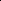
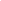

# WeightFlow: Learning Stochastic Dynamics via Evolving Weight of Neural Network

<!-- Page 1 -->

WeightFlow: Learning Stochastic Dynamics via Evolving Weight of Neural Network

Ruikun Li1, Jiazhen Liu2, Huandong Wang2*, Qingmin Liao1, Yong Li2

## 1 Shenzhen International Graduate School, Tsinghua University 2 Department of Electronic Engineering, BNRist, Tsinghua

University

## Abstract

Modeling stochastic dynamics from discrete observations is a key interdisciplinary challenge. Existing methods often fail to estimate the continuous evolution of probability densities from trajectories or face the curse of dimensionality. To address these limitations, we present a novel paradigm: modeling dynamics directly in the weight space of a neural network by projecting the evolving probability distribution. We first theoretically establish the connection between dynamic optimal transport in measure space and an equivalent energy functional in weight space. Subsequently, we design WeightFlow, which constructs the neural network weights into a graph and learns its evolution via a graph controlled differential equation. Experiments on interdisciplinary datasets show that WeightFlow improves performance by an average of 43.02% over state-ofthe-art methods, providing an effective and scalable solution for modeling high-dimensional stochastic dynamics.

Code — https://github.com/tsinghua-fib-lab/WeightFlow Page — https://tsinghua-fib-lab.github.io/WeightFlow/

## Introduction

Stochastic dynamical processes are ubiquitous across numerous scales, from gene regulation and ecological evolution to climate patterns, making them a core subject of interdisciplinary research (Sha et al. 2024; Wagner 2023; Lenton et al. 2019; Li et al. 2025a). A key challenge in modeling such systems lies in solving the temporal evolution of their state distribution, which is deterministically described by the renowned Fokker-Planck equation or the Master Equation (Chen and Majda 2017; Jiang et al. 2021; Liu et al. 2025). Consequently, early efforts focused on developing efficient solution algorithms, including statistical approximations and variational autoregressive networks (Chen and Majda 2018; Anderson and Farazmand 2024; Tang, Weng, and Zhang 2023; Liu and Wang 2024). These studies, however, are predicated on the availability of well-defined governing equations or reaction rules. In real-world scenarios, we often lack this prior knowledge and only have access to static snapshots of the system at discrete time points (Gao, Qiao, and Huang 2022; Neklyudov et al. 2023; Qu et al. 2025).

*Corresponding author (wanghuandong@tsinghua.edu.cn). Copyright © 2026, Association for the Advancement of Artificial Intelligence (www.aaai.org). All rights reserved.

X1

Xd

Stochastic State Space

Deterministic Probability Space

Parameterized Weight Space 𝑑𝑋𝑡= 𝑓𝑑𝑡+ 𝜎𝑑𝑊𝑡

State x

Time t

……

Fokker-Planck / Master Equation

Neural Network

𝒫(ℝ𝑑)

𝜃𝑡1 𝜃𝑡2 𝜃𝑡3 𝜃𝑡𝑁 𝑝𝑡1 𝑝𝑡2 𝑝𝑡3 𝑝𝑡𝑁

Θ

**Figure 1.** Learning stochastic dynamics: from sample trajectories to evolving weights.

In the absence of governing equations, existing methods for inferring continuous dynamics from observational data can be classified into two categories. The first category models the stochastic trajectories of individual particles in state space. For instance, NeuralSDE (Li et al. 2020) and SPINN (Zhang et al. 2025) integrate stochastic differential equations to fit the drift and diffusion mechanisms. Methods based on dynamic optimal transport are inspired by the principle of least action and construct trajectories by minimizing path energy (Tong et al. 2020; Onken et al. 2021; Huguet et al. 2022). More recent studies (Koshizuka and Sato 2023; Chen et al. 2023; Kapusniak et al. 2024; Terpin et al. 2024) have formalized this process as a Schr¨odinger Bridge problem, ensuring the physical realism and smoothness of trajectories by learning a potential function or introducing momentum. These trajectory-based approaches are unable to directly yield the probability density of states. Instead, the distribution must be approximated through large-scale trajectory sampling, which makes it exceedingly difficult to estimate rare events or the tails of the distribution. To address this, a second category of methods emphasizes the evolution of deterministic probability distributions. For example, transfer operator-based methods (Mardt et al. 2018; Schreiner, Winther, and Ols-

The Fortieth AAAI Conference on Artificial Intelligence (AAAI-26)

641

AI-readable visual equivalent, added: Figure extracted from the paper PDF and converted to an SVG wrapper asset. Use the surrounding page text and caption for interpretation.

AI-readable visual equivalent, added: Figure extracted from the paper PDF and converted to an SVG wrapper asset. Use the surrounding page text and caption for interpretation.

<!-- Page 2 -->

son 2023; Kostic et al. 2023; Federici et al. 2024) learn the transition probabilities of the system between metastable states. NeuralMJP (Seifner and S´anchez 2023) and ANN- SM (Jiang et al. 2021) explicitly learn the master equation for discrete systems, thereby directly modeling the temporal evolution of the state distribution. Similarly, PESLA (Li et al. 2025c) and DeepRUOT (Zhang, Li, and Zhou 2025) parameterize and solve the Fokker-Planck equation for continuous state spaces. However, these methods require describing a state space that grows exponentially with the system’s dimension (Tang, Weng, and Zhang 2023). They not only face the curse of dimensionality during optimization but also struggle to capture the underlying geometric manifold (Knobloch and Wiesenfeld 1983) of the dynamical process.

In light of the limitations of existing methods, we propose a novel approach: projecting the evolution of the state distribution, p(x, t), into the weight space of a neural network that defines it, Θ = {θ|p(x, t) = pθt(x)}, and directly modeling the dynamics of weight evolution (Figure 1). Compared to probability measures unfolded in high-dimensional spaces, the weights benefit from a well-defined topological structure imposed by the neural network’s connectivity, making them amenable to modern graph representation models (Li et al. 2025b). Furthermore, the number of parameters in neural networks designed for sequential modeling, such as the autoregressive network (Tang, Weng, and Zhang 2023; Feng et al. 2025), does not depend directly on the system’s dimension, thus effectively circumventing the curse of dimensionality.

In this work, we first theoretically demonstrate that the dynamic optimal transport path in probability space can be approximated by solving an equivalent energy functional in the weight space. Building on this, we design a novel framework named WeightFlow. WeightFlow models the neural network weights as a graph and employs a graph neural differential equation to learn the continuous dynamics of this weight graph. To capture the global manifold of dynamics, WeightFlow projects a latent path from observational snapshots and performs a Riemann–Stieltjes integral to achieve continuous interpolation. Our contributions are as follows:

• We propose a novel framework for modeling stochastic dynamics in the weight space of a neural network, offering a new paradigm for tackling the curse of dimensionality. • We theoretically derive the approximately equivalent formulation in neural network weight space for the dynamic optimal transport path found in probability space. • WeightFlow models network weights as a weight graph and introduces a graph controlled differential equation to learn its continuous evolution. • WeightFlow achieves an average performance improvement of 43.02% over existing state-of-the-art methods.

Preliminary Stochastic Dynamics & Probability Evolution

We consider a physical system whose state Xt ∈Rd evolves according to a stochastic differential equation:

dXt = f(Xt, t)dt + σ(Xt, t)dWt (1)

where Wt is a standard Wiener process, f(Xt, t) is the drift, and σ(Xt, t) is the diffusion tensor. While individual trajectories are stochastic, the ensemble’s probability density p(x, t) evolves deterministically according to the Fokker- Planck equation (Risken 1989; Gardiner 2009):

∂tp(x, t) = −∇x·[(f(x, t)p(x, t))]+∇2 x: [D(x, t)p(x, t)],

(2) where D(x, t) = 1 2σ2(x, t) is the diffusion matrix and ∇2 x: denotes the tensor dot product. The Master equation (Van Kampen 1992) similarly describes probability evolution for discrete state spaces. This creates a duality between the microscopic stochastic process and its macroscopic deterministic evolution.

Problem Definition Our goal is to reconstruct the continuous evolution trajectory (µt)t∈[0,T ] in the space of measures P(Rd) from a set of em- pirical distributions {ˆµti}N i=1 observed at N discrete times. Each snapshot ˆµti consists of n samples from the system’s ensemble. We assume an absolutely continuous path, where each measure µt has a probability density function p(x, t) satisfying dµt(x) = p(x, t)dx. This formulation applies generally to continuous PDF evolutions, including those governed by the Fokker-Planck equation or approximated from Master equations.

We frame this as a dynamical optimal transport problem based on the principle of least action (Koshizuka and Sato 2023; Kapusniak et al. 2024). The optimal path between two consecutive snapshots, ν0 and ν1, is found by solving the Benamou-Brenier formulation (Benamou and Brenier 2000):

W(ν0, ν1) = inf p,f

Z 1

0

Z

Rd

1 2∥f(x, t)∥2 2p(x, t)dxdt s.t. ∂tp + ∇· (pf) = 0, p|t=0 = ν0, p|t=1 = ν1.

(3) This problem seeks an optimal path, defined by density p(x, t) and velocity f(x, t), that minimizes kinetic energy.

Weight Path of Probability Evolution In this section, we provide a theoretical justification for modeling stochastic dynamics through the evolution of weights.

Parameterizing Probability Distribution We parameterize the high-dimensional probability density p(x, t) with an autoregressive neural network (Wu, Wang, and Zhang 2019). This factorizes the joint density into a product of conditional probabilities via the chain rule:

p(x, t) = pθt(x) = d Y i=1 pθt(xi|x1,..., xi−1) (4)

Here, a complex, high-dimensional distribution is represented by a finite-dimensional weight vector θt. A key advantage of this autoregressive formulation is scalability with dimension d, which mitigates the curse of dimensionality. The universal approximation property (Hornik, Stinchcombe, and White 1989) ensures that for any time t, a weight set θt exists that can accurately represent the true density p(x, t).

642

<!-- Page 3 -->

We formalize this relationship as a map G, determined by the network architecture, from the weight space Θ to the space of probability densities:

G: θt ∈Θ 7→pθt(x) ∈P(Rd) (5)

Thus, the deterministic evolution of the probability distribution becomes a trajectory in the network’s finite-dimensional weight space. This maps the density path (pt)t∈[0,T ] to a weight path (θt)t∈[0,T ].

Bridging the Probability Path and Evolving Weight The dynamic optimal transport problem of equation (3) can be approximately solved by finding an optimal trajectory in the network’s weight space. The core idea is to find a weightspace path that approximates the true optimal path’s energy by minimizing a corresponding energy functional. We first define this energy functional (Zhang, Li, and Zhou 2025) as:

E(p, v):=

Z 1

0

Z

Rd[1

2||v(x, t)2|| + σ4

8 ||∇log p||2]pdxdt,

(6) where p denotes p(x, t). Here, v(x, t) is the velocity field, and the density p(x, t) evolves according to the continuity equation ∂tp + ∇· (pv) = 0. The evolution of the parameterizing weights θt is then governed by an Ordinary Differential Equation (ODE):

dθ dt = g(θ, t). (7)

The weight-space velocity field g defines a corresponding state-space velocity vg(x, t) that satisfies the continuity equation ∂tpθ + ∇· (pθvg) = 0. Theorem 1. Let µ0 and µ1 be the initial and end probability measures on Rd, and let (p∗, v∗) be the optimal path under the Eq. 6. Assuming the following conditions are satisfied: (C1) There exists a reference parameter θ0 such that pg0 ≈p∗ and vg0 ≈v∗; (C2) The trained minimizer θ∗satisfies pθ∗(1) ≈µ1; (C3) θ∗= arg minθ(λE(pθ, vg) + L(g)) with λ > 0, where

E(pθ, vg):=

Z 1

0

Z

Rd[1

2||vg||2+ σ4

8 ||∇log pθ||2]pθdxdt

(8) and L(g) = −Ex∼µ0[log pθµ0 (x)]−Ex∼µ1[log pθµ1 (x)].

Then, we have |E(pθ∗, vg∗) −E(p∗, v∗)| ≤δ.

Proof. See Appendix for proof.

Here, δ > 0 is an arbitrarily small error term. A detailed proof is in Appendix I. Theorem 1 bridges weight evolution and dynamic optimal transport, showing that the probability path can be projected onto a path in network’s weight space.

Learning Stochastic Dynamics via Evolving Weight We formalize learning stochastic dynamics as an optimization problem in the weight space. Given N empirical distributions {ˆµti}N i=1, an autoregressive network G (Eq. 4) models the state distribution p(x, t) by mapping a weight vector θt to a density pθt(x). Learning the dynamics involves finding an optimal velocity field g(θ, t) whose resulting weight trajectory {θt}t∈[0,T ] minimizes the objective function:

1 N

N X i=1

(−Ex∼ˆµti log pθti (x)) + λE(pθ, vg). (9)

The objective’s first term ensures data fit, while the second constrains the path energy.

WeightFlow In this section, we introduce WeightFlow, a novel framework for modeling stochastic dynamics through the evolution of neural network weights, as illustrated in Figure 2.

Backbone and Weight Graph WeightFlow uses an autoregressive model, termed the backbone, to parameterize the state distribution p(x, t). The backbone implements the factorization in Eq. 4 and can be any sequential architecture like an RNN or Transformer. For an RNN-based backbone, it conditions the i-th dimension’s probability on a hidden state hi−1: p(xi, t) = p(xi|hi−1, θt). Normalization of p(x, t) is ensured by applying a softmax output to each conditional density p(xi, t). We train a separate backbone for each time snapshot ti by minimizing the data’s Negative Log-Likelihood (NLL). This yields a set of weights {θti}N i=1 that serve as anchor points for learning the continuous dynamics. Details of the Transformer-based backbone are provided in Appendix A.

The weights of the backbone are inherently structured by the network’s architecture. To represent this structure, we organize the weights of each snapshot θti into a weight graph based on the network’s forward data flow. Specifically, each output neuron of the backbone’s linear layers becomes a node in the graph. Each node’s feature vector is formed by concatenating its incoming connection weights and its bias term. Thus, a linear layer with weights w ∈RDout×Din and bias b ∈RDout×1 becomes Dout nodes in the weight graph, each with a (Din + 1)-dimensional feature. Weight evolution is thereby formalized as the evolution of node features on this graph.

Graph Neural Differential Equation To learn the optimal weight path from Eq. 9, we parameterize the velocity field g as a neural differential equation. Specifically, WeightFlow models the evolution of the backbone weights θt as a graph neural ODE (Chen et al. 2018):

θτ = θ0 +

Z τ

0 gϕ(θt, t)dt, (10)

where gϕ = dθt dt is a hypernetwork modeling the dynamics of the backbone weights θt. To handle the heterogeneous dimensions of the weight graph’s node features, we first use a layer-wise linear map to project them into a common dimension. We then apply a multi-head attention mechanism to the fully connected weight graph to model all inter-node relationships. The resulting representation is projected back to the original dimensions via another layer-wise map to predict the weight derivative.

643

<!-- Page 4 -->

**Figure 2.** Framework of WeightFlow.

To capture the global path’s manifold trend, we enhance the ODE into a Controlled Differential Equation (CDE) (Kidger et al. 2020) via a Riemann–Stieltjes integral:

θτ = θ0 +

Z τ

0 gϕ(θt, t)dZt dt dt, (11)

where integration follows a controlling variable path Zt. A self-supervised autoencoder (encoder E, decoder D) projects the anchor weights {θti}N i=1 into latent vectors {zti}N i=1. We then use cubic spline interpolation on these latent vectors to approximate the path’s rate of change, dZt dt. This injects the global evolutionary trend into the integration and explicitly scales the conditional vector field gϕ = dθt dZt.

Training Strategy WeightFlow’s training has two stages: anchor pre-training and dynamics model training. First, in the warm-up stage, we pre-train the backbone independently at each observation time ti to get the anchor weights {θti}N i=1. To ensure a smooth transition, we use a sequential-aligning strategy, initializing the training for time ti with the weights from ti−1. These anchor weights are projected into a latent space and interpolated with cubic splines to form the control path Zt. The main stage optimizes the hypernetwork gϕ that governs weight dynamics. In the objective from Eq. 9, the NLL loss is replaced with a weight reconstruction loss. This reconstruction loss is a mean squared error between the trajectory’s weights and the pre-trained anchor weights ˆθti. Path energy is computed via a ODE solver. We detail the training procedure in Algorithm 1 of the Appendix.

Time and Computational Complexity Let L be the number of candidate states or mixture density parameters per dimension in a d-dimensional system. Weight- Flow’s complexity depends on its autoregressive backbone and the hypernetwork gϕ.

• Backbone: The backbone’s size is independent of dimension d, with O(L) space complexity. Its inference time complexity is O(d) due to the autoregressive calculation. • Hypernetwork: The hypernetwork’s inference bottleneck is its multi-head attention mechanism. Its time complexity is O(N 2 nodes), where the number of nodes, Nnodes, is determined by the backbone architecture (e.g., proportional to L) and is also independent of dimension d.

Thus, WeightFlow effectively avoids the curse of dimensionality, as its main computational costs do not scale with the state-space dimension.

Numerical Results In this section, we empirically evaluate WeightFlow on a diverse set of simulated and real-world stochastic dynamics.

Experimental Settings Dynamical Systems We evaluate WeightFlow’s capacity to model interdisciplinary stochastic dynamics in both discrete and continuous state spaces across a diverse set of simulated and real-world systems. The simulated systems include four biochemical reaction networks (Tang, Weng, and Zhang 2023): Epidemic, Toggle Switch, and Signalling Cascades 1 and 2, as well as one ecological adaptive evolution process (Li et al. 2025c). The real-world systems consist of two singlecell differentiation datasets: the human embryoid body (Tong et al. 2020) and the in vitro pancreatic β-cell (Veres et al. 2019). Detailed system dynamics, data collection for each dataset are provided in the Appendix.

Baselines We benchmark WeightFlow against several stateof-the-art baselines that model stochastic dynamics from diverse perspectives. These include methods based on the direct modeling of stochastic differential equations, LatentSDE (Li et al. 2020); Markov jump processes, NeuralMJP (Seifner and

644

AI-readable visual equivalent, added: Figure extracted from the paper PDF and converted to an SVG wrapper asset. Use the surrounding page text and caption for interpretation.

<!-- Page 5 -->

Epidemic Toggle Switch Signalling Cascade1 Signalling Cascade2 Ecological Evolution

×10−1 W ↓ JSD ↓ W ↓ JSD ↓ W ↓ JSD ↓ W ↓ JSD ↓ W ↓ JSD ↓

Latent SDE 3.14±0.25 4.22±0.26 2.34±0.15 1.27±0.12 3.04±0.17 0.85±0.14 3.59±0.13 1.02±0.06 8.04±0.33 3.52±0.23 Neural MJP 1.88±0.14 1.61±0.14 2.13±0.26 0.94±0.14 1.69±0.15 0.30±0.04 1.68±0.11 0.36±0.01 1.68±0.18 0.51±0.03 T-IB 2.62±0.17 3.52±0.29 1.59±0.20 0.88±0.11 1.66±0.16 0.32±0.04 2.16±0.17 0.40±0.03 2.17±0.24 0.56±0.06 NLSB 3.27±0.28 1.65±0.14 2.97±0.30 1.32±0.20 1.50±0.10 0.39±0.05 1.83±0.15 0.48±0.05 3.09±0.26 2.80±0.32 DeepRUOT 1.78±0.13 1.08±0.09 1.37±0.17 0.77±0.05 0.52±0.02 0.07±0.00 0.51±0.01 0.08±0.00 3.27±0.31 2.47±0.36

WeightFlowO 1.14±0.15 0.36±0.02 0.90±0.08 0.35±0.02 0.59±0.06 0.05±0.00 0.64±0.08 0.07±0.01 0.50±0.08 0.13±0.01 WeightFlowC 1.10±0.14 0.34±0.01 0.82±0.07 0.33±0.02 0.48±0.03 0.04±0.00 0.49±0.07 0.06±0.01 0.51±0.07 0.12±0.02 Promotion 38.20% 68.52% 40.15% 57.14% 7.69% 42.86% 3.92% 25.00% 70.24% 76.47%

**Table 1.** Statistic results on various stochastic dynamical systems over 10 runs. The best/second-best are bold/underlined.

t=10 t=25 t=50 t=100 Fitness Landscape

Evolutionary Dynamics

**Figure 3.** Joint and marginal distributions predicted by WeightFlow over time on the Ecological Evolution system. The central panels show the joint distribution contours of two loci overlaid on the fitness landscape (brighter yellow indicates higher fitness).

S´anchez 2023); transfer operator, T-IB (Federici et al. 2024); Schr¨odinger bridges, NLSB (Koshizuka and Sato 2023); and dynamic optimal transport, DeepRUOT (Zhang, Li, and Zhou 2025). The configurations are detailed in the Appendix IV.

Metrics We measure the difference between probability densities using several standard metrics from related work. These include the Wasserstein (W) distance (Zhang, Li, and Zhou 2025), Maximum Mean Discrepancy (MMD) (Kapusniak et al. 2024), and the Jensen-Shannon Divergence (JSD) (Li et al. 2025c). The detailed computational formulas for these metrics are provided in the Appendix V.

Main Results

In all experiments, unless otherwise specified, WeightFlow uses an RNN with Gated Recurrent Units (GRU) as its default backbone. The subscripts O and C denote implementations based on ODEs and CDEs, respectively. When not explicitly subscripted, WeightFlow defaults to the CDE-based implementation. The specific configuration of WeightFlow for each system is provided in the Appendix C.

Simulated Datasets For five discrete systems, we simulate 1,000 evolution trajectories of 100 steps each. Training data is created by down-sampling each trajectory to 10 time points, while evaluation is performed on the full 100 time points.

Across all systems, WeightFlow outperforms baselines, improving the Wasserstein distance and Jensen-Shannon divergence by 32.04% and 53.99% on average, respectively (Table 1). These results demonstrate WeightFlow’s ability to capture probabilistic dynamics and validate our weight-space modeling approach. Compared to DeepRUOT, WeightFlow provides more stable long-term predictions by avoiding latestage error accumulation (Appendix Figure 1).

A case study on an ecological evolution system further demonstrates WeightFlow’s performance in Figure 3. In this system, a 2D genetic phenotype evolves towards a global peak on a fitness landscape. WeightFlow accurately predicts the distribution throughout the evolution, capturing both macroscopic landscape shifts and fine-grained local dynamics.

Real-world Datasets We evaluate WeightFlow on two continuous-space, single-cell differentiation datasets. The datasets track gene expression via scRNA-seq during in vitro

645

<!-- Page 6 -->

t=1 t=4 t=2 t=3

Reference Ours DeepRUOT t=7

Moment Ours RUOT

Mean 0.101±0.038 0.264±0.096 Variance 0.672±0.422 0.623±0.275 Skewness 1.775±1.461 1.845±1.586 Kurtosis 1.651±1.743 2.089±2.383

**Figure 4.** Weight prediction for β-cell differentiation. The trajectory shows the continuous evolution of weights and corresponding ensemble distributions (PCA). Highlights compare the results at observed snapshots: reference (left), WeightFlow’s prediction (center), and DeepRUOT’s prediction (right). The table reports the average relative error of the first four statistical moments.

β-cell Embryoid

W ↓ MMD ↓ W ↓ MMD ↓

NLSB 11.18±0.22 0.07±0.01 14.39±0.40 0.10±0.03 RUOT 10.99±0.20 0.06±0.01 14.71±0.49 0.15±0.03 WeightFlowC 9.73±0.27 0.02±0.01 14.18±0.43 0.03±0.01 Promotion 11.44% 71.88% 4.64% 81.37%

**Table 2.** Statistical results on real-world cell datasets.

7LPH

3DWK 1RUPDOL]HG

7LPH 6WHS

:DVVHUVWHLQ 'LVWDQFH

2'(&'(

**Figure 5.** Comparing the path (left) and average error (right) for ODE and CDE models on the Toggle Switch system.

pancreatic β-cell and human embryoid body differentiation. Following related work (Koshizuka and Sato 2023; Zhang, Li, and Zhou 2025), we project the high-dimensional gene data onto 30 and 100 principal components. We then use a Mixture Density Network (MDN) as WeightFlow’s backbone to model the resulting continuous distributions. The detailed configuration is provided in the Appendix B.

WeightFlow significantly outperforms baselines on these systems, demonstrating its effectiveness in continuous state spaces (Table 2). A case study of the pancreatic β-cell visualizes the predicted paths in Figure 4. We compare the first four statistical moments of the predicted distributions against the ground truth. While both WeightFlow and base- line capture the global shape with comparable errors in mean and variance, WeightFlow is significantly more accurate for higher-order moments like skewness and kurtosis. This shows WeightFlow accurately reproduces fine-grained distribution structures like asymmetry and extreme values. Similar results are observed for the embryoid body dataset in the Appendix Figure 2.

Ablation Study

Path Integral WeightFlowC, which integrates along the latent path Z, generally outperforms WeightFlowO, which integrates directly with respect to time t (Table 1). Taking the Toggle Switch system as an example (Figure 5), the integration path of WeightFlowC is able to capture the slow-down behavior during the later convergence phase, which is consistent with the system evolution trend. This, in turn, guides the weight evolution to decelerate in later stages, which corresponds to WeightFlowC having lower long-term errors. The results for other systems are in the Appendix Figure 3.

Path Projection We replace the autoencoder with different projection algorithms for computing the control variable Zt. The results indicate that WeightFlow consistently achieves the best performance when using the autoencoder-based path projection (Appendix Table 3). Visualizations of different paths are provided in the Appendix Figure 5.

Sequential Aligning We evaluate the importance of the sequential warm-start strategy by disabling it during the warmup stage and instead using random initializations at each observation time. The resulting performance degradation confirms the importance of the sequential strategy (Figure 7c).

Sensitivity Analysis

Backbone Size WeightFlow uses the backbone to parameterize probability distributions. Therefore, the backbone’s

646

AI-readable visual equivalent, added: Figure extracted from the paper PDF and converted to an SVG wrapper asset. Use the surrounding page text and caption for interpretation.

AI-readable visual equivalent, added: Figure extracted from the paper PDF and converted to an SVG wrapper asset. Use the surrounding page text and caption for interpretation.

AI-readable visual equivalent, added: Figure extracted from the paper PDF and converted to an SVG wrapper asset. Use the surrounding page text and caption for interpretation.

AI-readable visual equivalent, added: Figure extracted from the paper PDF and converted to an SVG wrapper asset. Use the surrounding page text and caption for interpretation.

AI-readable visual equivalent, added: Figure extracted from the paper PDF and converted to an SVG wrapper asset. Use the surrounding page text and caption for interpretation.

AI-readable visual equivalent, added: Figure extracted from the paper PDF and converted to an SVG wrapper asset. Use the surrounding page text and caption for interpretation.

AI-readable visual equivalent, added: Figure extracted from the paper PDF and converted to an SVG wrapper asset. Use the surrounding page text and caption for interpretation.

AI-readable visual equivalent, added: Figure extracted from the paper PDF and converted to an SVG wrapper asset. Use the surrounding page text and caption for interpretation.

AI-readable visual equivalent, added: Figure extracted from the paper PDF and converted to an SVG wrapper asset. Use the surrounding page text and caption for interpretation.

AI-readable visual equivalent, added: Figure extracted from the paper PDF and converted to an SVG wrapper asset. Use the surrounding page text and caption for interpretation.

AI-readable visual equivalent, added: Figure extracted from the paper PDF and converted to an SVG wrapper asset. Use the surrounding page text and caption for interpretation.

AI-readable visual equivalent, added: Figure extracted from the paper PDF and converted to an SVG wrapper asset. Use the surrounding page text and caption for interpretation.

AI-readable visual equivalent, added: Figure extracted from the paper PDF and converted to an SVG wrapper asset. Use the surrounding page text and caption for interpretation.

AI-readable visual equivalent, added: Figure extracted from the paper PDF and converted to an SVG wrapper asset. Use the surrounding page text and caption for interpretation.

AI-readable visual equivalent, added: Figure extracted from the paper PDF and converted to an SVG wrapper asset. Use the surrounding page text and caption for interpretation.

AI-readable visual equivalent, added: Figure extracted from the paper PDF and converted to an SVG wrapper asset. Use the surrounding page text and caption for interpretation.

AI-readable visual equivalent, added: Figure extracted from the paper PDF and converted to an SVG wrapper asset. Use the surrounding page text and caption for interpretation.

AI-readable visual equivalent, added: Figure extracted from the paper PDF and converted to an SVG wrapper asset. Use the surrounding page text and caption for interpretation.

AI-readable visual equivalent, added: Figure extracted from the paper PDF and converted to an SVG wrapper asset. Use the surrounding page text and caption for interpretation.

AI-readable visual equivalent, added: Figure extracted from the paper PDF and converted to an SVG wrapper asset. Use the surrounding page text and caption for interpretation.

AI-readable visual equivalent, added: Figure extracted from the paper PDF and converted to an SVG wrapper asset. Use the surrounding page text and caption for interpretation.

AI-readable visual equivalent, added: Figure extracted from the paper PDF and converted to an SVG wrapper asset. Use the surrounding page text and caption for interpretation.

AI-readable visual equivalent, added: Figure extracted from the paper PDF and converted to an SVG wrapper asset. Use the surrounding page text and caption for interpretation.

AI-readable visual equivalent, added: Figure extracted from the paper PDF and converted to an SVG wrapper asset. Use the surrounding page text and caption for interpretation.

AI-readable visual equivalent, added: Figure extracted from the paper PDF and converted to an SVG wrapper asset. Use the surrounding page text and caption for interpretation.

AI-readable visual equivalent, added: Figure extracted from the paper PDF and converted to an SVG wrapper asset. Use the surrounding page text and caption for interpretation.

AI-readable visual equivalent, added: Figure extracted from the paper PDF and converted to an SVG wrapper asset. Use the surrounding page text and caption for interpretation.

AI-readable visual equivalent, added: Figure extracted from the paper PDF and converted to an SVG wrapper asset. Use the surrounding page text and caption for interpretation.

AI-readable visual equivalent, added: Figure extracted from the paper PDF and converted to an SVG wrapper asset. Use the surrounding page text and caption for interpretation.

AI-readable visual equivalent, added: Figure extracted from the paper PDF and converted to an SVG wrapper asset. Use the surrounding page text and caption for interpretation.

AI-readable visual equivalent, added: Figure extracted from the paper PDF and converted to an SVG wrapper asset. Use the surrounding page text and caption for interpretation.

<!-- Page 7 -->

(a) Backbone Size (b) Data Ratio (c) Path Dimension

**Figure 6.** Wasserstein distance as a function of (a) backbone size, (b) data ratio, and (c) path dimension across five systems.

(a) Autoregressive Order (b) Backbone Architecture (c) Sequential Aligning

**Figure 7.** Wasserstein distance distributions for WeightFlow across five systems under various settings: (a) autoregressive order, (b) backbone architecture, and (c) sequential aligning (with versus without). The outliers are truncated to highlight differences.

L

3 6

**Figure 8.** Inference time (left) and model size (right).

size affects the quality of its fit to complex distributions. We test the performance of a single-layer RNN with different latent dimensions (Figure 6a). For these systems, a hidden dimension of just 8 is sufficient (< 1k parameters). This benefits from WeightFlow’s decoupled design, where the backbone only models static distributions, leaving the temporal evolution to the hypernetwork.

Data Size We evaluate WeightFlow’s dependency on the amount of observational data by reducing the number of training samples (Figure 6b). The results show that WeightFlow’s performance does not collapse even when the data is reduced to only 20%, but instead shows only a limited decline.

Path Dimension The dimension of the latent path affects WeightFlow’s capacity to represent weight dynamics. We find that WeightFlow is not sensitive to the path dimension (Figure 6c). A 1-dim path is even slightly superior to that with higher dimensions. This could be because the weight evolution dynamics occur on a low-dimensional manifold (Figure 4), for which 1-dim path is sufficient.

Autoregressive Order Mathematically, WeightFlow’s autoregressive backbone models the joint probability distribu- tion in the form of Eq. 4, which supports any autoregressive order. We test the performance with a randomly shuffled autoregressive order (Figure 7a). The results indicate that the prediction error of the random order is indeed very close to that of the sequential order.

Backbone Architecture WeightFlow supports any implementation for its backbone. Therefore, we compare the performance of a Transformer-based WeightFlow (Figure 7b). The results show that the predictive performance of WeightFlow is similar for both backbone architectures.

Time and Space Cost We report the inference time versus error for various methods, as well as the parameter size of WeightFlow in Figure 8. WeightFlow achieves the Pareto frontier in terms of inference time and error. Furthermore, its parameter size scales only linearly with the number of candidate states, L.

Conclusions We propose WeightFlow, a new framework for modeling stochastic dynamics in the weight space of a neural network. By learning the continuous evolution of a weight graph, WeightFlow effectively circumvents the curse of dimensionality in high-dimensional state spaces. We find WeightFlow exhibits good robustness to data quantity and model size, and that a very low-dimensional latent path (even 1-dim) is sufficient to capture the complex dynamics of weight evolution. This suggests the evolution of the ensemble distribution may lie on a concise manifold. Furthermore, compared to baselines, WeightFlow more accurately captures the higher-order moments, indicating a stronger ability to characterize fine structures. This indicates WeightFlow is a promising solution for an effective solution to stochastic dynamics modeling.

647

AI-readable visual equivalent, added: Figure extracted from the paper PDF and converted to an SVG wrapper asset. Use the surrounding page text and caption for interpretation.

AI-readable visual equivalent, added: Figure extracted from the paper PDF and converted to an SVG wrapper asset. Use the surrounding page text and caption for interpretation.

AI-readable visual equivalent, added: Figure extracted from the paper PDF and converted to an SVG wrapper asset. Use the surrounding page text and caption for interpretation.

AI-readable visual equivalent, added: Figure extracted from the paper PDF and converted to an SVG wrapper asset. Use the surrounding page text and caption for interpretation.

AI-readable visual equivalent, added: Figure extracted from the paper PDF and converted to an SVG wrapper asset. Use the surrounding page text and caption for interpretation.

AI-readable visual equivalent, added: Figure extracted from the paper PDF and converted to an SVG wrapper asset. Use the surrounding page text and caption for interpretation.

<!-- Page 8 -->

## Acknowledgments

This work is supported in part by the National Key Research and Development Program of China under 2024YFC3307603, and the National Natural Science Foundation of China under 92270114 and 62171260.

## References

Anderson, W.; and Farazmand, M. 2024. Fisher information and shape-morphing modes for solving the Fokker–Planck equation in higher dimensions. Applied Mathematics and Computation, 467: 128489. Benamou, J.-D.; and Brenier, Y. 2000. A computational fluid mechanics solution to the Monge-Kantorovich mass transfer problem. Numerische Mathematik, 84(3): 375–393. Chen, N.; and Majda, A. J. 2017. Beating the curse of dimension with accurate statistics for the Fokker–Planck equation in complex turbulent systems. Proceedings of the National Academy of Sciences, 114(49): 12864–12869.

Chen, N.; and Majda, A. J. 2018. Efficient statistically accurate algorithms for the Fokker–Planck equation in large dimensions. Journal of Computational Physics, 354: 242– 268. Chen, R. T.; Rubanova, Y.; Bettencourt, J.; and Duvenaud, D. K. 2018. Neural ordinary differential equations. Advances in neural information processing systems, 31. Chen, T.; Liu, G.-h.; Tao, M.; and Theodorou, E. A. 2023. Deep multi-marginal momentum Schr¨odinger bridge. In Proceedings of the 37th International Conference on Neural Information Processing Systems, 57058–57086. Federici, M.; Forr´e, P.; Tomioka, R.; and Veeling, B. S. 2024. Latent Representation and Simulation of Markov Processes via Time-Lagged Information Bottleneck. In The Twelfth International Conference on Learning Representations. Feng, M.; Huang, Y.; Liao, W.; Liu, Y.; Liu, Y.; and Yan, J. 2025. SINGER: Stochastic Network Graph Evolving Operator for High Dimensional PDEs. In The Thirteenth International Conference on Learning Representations. Gao, M.; Qiao, C.; and Huang, Y. 2022. UniTVelo: temporally unified RNA velocity reinforces single-cell trajectory inference. Nature Communications, 13(1): 6586. Gardiner, C. 2009. Stochastic methods, volume 4. Springer Berlin Heidelberg. Hornik, K.; Stinchcombe, M.; and White, H. 1989. Multilayer feedforward networks are universal approximators. Neural networks, 2(5): 359–366. Huguet, G.; Magruder, D. S.; Tong, A.; Fasina, O.; Kuchroo, M.; Wolf, G.; and Krishnaswamy, S. 2022. Manifold interpolating optimal-transport flows for trajectory inference. Advances in neural information processing systems, 35: 29705– 29718. Jiang, Q.; Fu, X.; Yan, S.; Li, R.; Du, W.; Cao, Z.; Qian, F.; and Grima, R. 2021. Neural network aided approximation and parameter inference of non-Markovian models of gene expression. Nature communications, 12(1): 2618.

Kapusniak, K.; Potaptchik, P.; Reu, T.; Zhang, L.; Tong, A.; Bronstein, M.; Bose, J.; and Di Giovanni, F. 2024. Metric flow matching for smooth interpolations on the data manifold. Advances in Neural Information Processing Systems, 37: 135011–135042. Kidger, P.; Morrill, J.; Foster, J.; and Lyons, T. 2020. Neural controlled differential equations for irregular time series. Advances in neural information processing systems, 33: 6696–

6707. Knobloch, E.; and Wiesenfeld, K. 1983. Bifurcations in fluctuating systems: The center-manifold approach. Journal of Statistical Physics, 33(3): 611–637. Koshizuka, T.; and Sato, I. 2023. Neural Lagrangian Schr¨odinger Bridge: Diffusion Modeling for Population Dynamics. In The Eleventh International Conference on Learning Representations. Kostic, V. R.; Novelli, P.; Grazzi, R.; Lounici, K.; and Pontil, M. 2023. Learning invariant representations of timehomogeneous stochastic dynamical systems. arXiv preprint arXiv:2307.09912. Lenton, T. M.; Rockstr¨om, J.; Gaffney, O.; Rahmstorf, S.; Richardson, K.; Steffen, W.; and Schellnhuber, H. J. 2019. Climate tipping points—too risky to bet against. Nature, 575(7784): 592–595. Li, R.; Cheng, J.; Wang, H.; Liao, Q.; and Li, Y. 2025a. Predicting the dynamics of complex system via multiscale diffusion autoencoder. arXiv preprint arXiv:2505.02450. Li, R.; Wang, H.; Ding, J.; Yuan, Y.; Liao, Q.; and Li, Y. 2025b. Predicting Dynamical Systems across Environments via Diffusive Model Weight Generation. arXiv preprint arXiv:2505.13919. Li, R.; Wang, H.; Liao, Q.; and Li, Y. 2025c. Predicting the Energy Landscape of Stochastic Dynamical System via Physics-informed Self-supervised Learning. In The Thirteenth International Conference on Learning Representations. Li, X.; Wong, T.-K. L.; Chen, R. T.; and Duvenaud, D. 2020. Scalable gradients for stochastic differential equations. In International Conference on Artificial Intelligence and Statistics, 3870–3882. PMLR. Liu, C.; and Wang, J. 2024. Distilling dynamical knowledge from stochastic reaction networks. Proceedings of the National Academy of Sciences, 121(14): e2317422121. Liu, J.; Li, R.; Wang, H.; Yu, Z.; Liu, C.; Ding, J.; and Li, Y. 2025. Beyond Equilibrium: Non-Equilibrium Foundations Should Underpin Generative Processes in Complex Dynamical Systems. arXiv preprint arXiv:2505.18621. Mardt, A.; Pasquali, L.; Wu, H.; and No´e, F. 2018. VAMPnets for deep learning of molecular kinetics. Nature communications, 9(1): 5. Neklyudov, K.; Brekelmans, R.; Severo, D.; and Makhzani, A. 2023. Action matching: Learning stochastic dynamics from samples. In International conference on machine learning, 25858–25889. PMLR. Onken, D.; Fung, S. W.; Li, X.; and Ruthotto, L. 2021. Otflow: Fast and accurate continuous normalizing flows via

648

<!-- Page 9 -->

optimal transport. In Proceedings of the AAAI Conference on Artificial Intelligence, volume 35, 9223–9232.

Qu, R.; Cheng, X.; Sefik, E.; Stanley III, J. S.; Landa, B.; Strino, F.; Platt, S.; Garritano, J.; Odell, I. D.; Coifman, R.; et al. 2025. Gene trajectory inference for single-cell data by optimal transport metrics. Nature biotechnology, 43(2): 258–268. Risken, H. 1989. Fokker-planck equation. In The Fokker- Planck equation: methods of solution and applications, 63– 95. Springer. Schreiner, M.; Winther, O.; and Olsson, S. 2023. Implicit transfer operator learning: Multiple time-resolution models for molecular dynamics. Advances in Neural Information Processing Systems, 36: 36449–36462. Seifner, P.; and S´anchez, R. J. 2023. Neural markov jump processes. In International Conference on Machine Learning, 30523–30552. PMLR. Sha, Y.; Qiu, Y.; Zhou, P.; and Nie, Q. 2024. Reconstructing growth and dynamic trajectories from single-cell transcriptomics data. Nature Machine Intelligence, 6(1): 25–39. Tang, Y.; Weng, J.; and Zhang, P. 2023. Neural-network solutions to stochastic reaction networks. Nature Machine Intelligence, 5(4): 376–385. Terpin, A.; Lanzetti, N.; Gadea, M.; and Dorfler, F. 2024. Learning diffusion at lightspeed. Advances in Neural Information Processing Systems, 37: 6797–6832. Tong, A.; Huang, J.; Wolf, G.; Van Dijk, D.; and Krishnaswamy, S. 2020. Trajectorynet: A dynamic optimal transport network for modeling cellular dynamics. In International conference on machine learning, 9526–9536. PMLR. Van Kampen, N. G. 1992. Stochastic processes in physics and chemistry, volume 1. Elsevier. Veres, A.; Faust, A. L.; Bushnell, H. L.; Engquist, E. N.; Kenty, J. H.-R.; Harb, G.; Poh, Y.-C.; Sintov, E.; G¨urtler, M.; Pagliuca, F. W.; et al. 2019. Charting cellular identity during human in vitro β-cell differentiation. Nature, 569(7756): 368–373. Wagner, A. 2023. Evolvability-enhancing mutations in the fitness landscapes of an RNA and a protein. Nature Communications, 14(1): 3624. Wu, D.; Wang, L.; and Zhang, P. 2019. Solving statistical mechanics using variational autoregressive networks. Physical review letters, 122(8): 080602. Zhang, Y.; Zhu, J.; Xie, H.; and He, Y. 2025. Physicsinformed deep learning for stochastic particle dynamics estimation. Proceedings of the National Academy of Sciences, 122(9): e2418643122. Zhang, Z.; Li, T.; and Zhou, P. 2025. Learning stochastic dynamics from snapshots through regularized unbalanced optimal transport. In The Thirteenth International Conference on Learning Representations.

649
