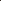
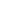
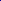
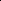

# Monocular Normal Estimation via Shading Sequence Estimation

<!-- Page 1 -->

Published as a conference paper at ICLR 2026

MONOCULAR NORMAL ESTIMATION VIA SHADING SE- QUENCE ESTIMATION

Zongrui Li1∗ Xinhua Ma1∗ Minghui Hu1 Yunqing Zhao2 Yingchen Yu2

Qian Zheng3,4 Chang Liu5† Xudong Jiang1 Song Bai2

1School of Electrical and Electronic Engineering, Nanyang Technological University 2ByteDance 3College of Computer Science and Technology, Zhejiang University 4The State Key Lab of Brain-Machine Intelligence, Zhejiang University 5MoE Key Laboratory of Interdisciplinary Research of Computation and Economics, Shanghai University of Finance and Economics https://github.com/LMozart/ICLR2026-RoSE.git

Ref. Image DSINE StableNormal Neural LightRig NiRNE Ours

**Figure 1.** We present RoSE, a method using a video generative model for monocular normal map estimation, built on a new paradigm that reformulates normal estimation as a shading sequence estimation task. Results on complex and diverse scenarios show that RoSE reconstructs fine-grained geometric details and generalizes robustly to unseen datasets, achieving state-of-the-art performance in object-based monocular normal estimation on benchmark datasets.

## ABSTRACT

Monocular normal estimation aims to estimate the normal map from a single RGB image of an object under arbitrary lights. Existing methods rely on deep models to directly predict normal maps. However, they often suffer from 3D misalignment: while the estimated normal maps may appear to have a correct appearance, the reconstructed surfaces often fail to align with the 3D geometry. We argue that this misalignment stems from the current paradigm: the model struggles to distinguish and estimate varying geometry represented in normal maps, as the differences in underlying geometry are reflected only through relatively subtle color variations. To address this issue, we propose a new paradigm that reformulates normal estimation as shading sequence estimation, where shading sequences are more sensitive to various geometry information. By learning to infer the shading

∗Equal contribution. †Corresponding author.

arXiv:2602.09929v5 [cs.CV] 26 Mar 2026

AI-readable visual equivalent, added: Figure extracted from the paper PDF and converted to an SVG wrapper asset. Use the surrounding page text and caption for interpretation.

AI-readable visual equivalent, added: Figure extracted from the paper PDF and converted to an SVG wrapper asset. Use the surrounding page text and caption for interpretation.

AI-readable visual equivalent, added: Figure extracted from the paper PDF and converted to an SVG wrapper asset. Use the surrounding page text and caption for interpretation.

AI-readable visual equivalent, added: Figure extracted from the paper PDF and converted to an SVG wrapper asset. Use the surrounding page text and caption for interpretation.

AI-readable visual equivalent, added: Figure extracted from the paper PDF and converted to an SVG wrapper asset. Use the surrounding page text and caption for interpretation.

AI-readable visual equivalent, added: Figure extracted from the paper PDF and converted to an SVG wrapper asset. Use the surrounding page text and caption for interpretation.

AI-readable visual equivalent, added: Figure extracted from the paper PDF and converted to an SVG wrapper asset. Use the surrounding page text and caption for interpretation.

AI-readable visual equivalent, added: Figure extracted from the paper PDF and converted to an SVG wrapper asset. Use the surrounding page text and caption for interpretation.

AI-readable visual equivalent, added: Figure extracted from the paper PDF and converted to an SVG wrapper asset. Use the surrounding page text and caption for interpretation.

AI-readable visual equivalent, added: Figure extracted from the paper PDF and converted to an SVG wrapper asset. Use the surrounding page text and caption for interpretation.

AI-readable visual equivalent, added: Figure extracted from the paper PDF and converted to an SVG wrapper asset. Use the surrounding page text and caption for interpretation.

AI-readable visual equivalent, added: Figure extracted from the paper PDF and converted to an SVG wrapper asset. Use the surrounding page text and caption for interpretation.

AI-readable visual equivalent, added: Figure extracted from the paper PDF and converted to an SVG wrapper asset. Use the surrounding page text and caption for interpretation.

<!-- Page 2 -->

Published as a conference paper at ICLR 2026

NiRNE Ours Ground Truth GeoWizard

Normal

Surface

StableNormal Neural LightRig

**Figure 2.** Illustration of 3D misalignment. The estimated normal maps of previous methods may appear to have an overall correct appearance, yet the reconstructed surfaces often fail to align with the accurate geometry details, showing over-smooth results. In contrast, our predicted normal maps exhibit better 3D alignment, leading to more faithful surface reconstruction.

sequence of an object, the model can better capture underlying 3D geometry and thereby produce more accurate normal predictions. Building on this paradigm, we present RoSE, a method that leverages image-to-video generative models to predict shading sequences, which are then converted into normal maps by solving a simple ordinary least-squares problem. To enhance robustness and better handle complex objects, RoSE is trained on a synthetic dataset, MultiShade, with diverse shapes, materials, and light conditions. Experiments demonstrate that RoSE achieves state-of-the-art performance on both synthetic and real-world benchmark datasets for object-based monocular normal estimation.

## 1 INTRODUCTION

Normal maps represent 3D geometry by specifying the surface orientation at each pixel point, making them essential for a wide range of applications, including relighting (Tiwari et al., 2024; Sang & Chandraker, 2020; Li et al., 2018; Liu et al., 2020; Li et al., 2023), 3D reconstruction (Ye et al., 2025), and rendering (Zeng et al., 2025; Pharr & Humphreys, 2015). In early methods, obtaining accurate normal maps required specialized hardware setups and was therefore costly for broad use. This motivates the development of techniques for monocular normal estimation, which aim to reliably infer normal maps directly from casually captured RGB images.

**Figure 3.** Validation of sensitivity to geometry variations for different representations, including the proposed shading sequence (left) and the normal map (right), measured by average total variation (TV). TV is computed as the mean magnitude of the first-order image’s gradient in terms of different representations, where higher TV indicates stronger sensitivity to spatial geometric variation.

Specifically, to achieve accurate monocular normal estimation, prior works (Yoon et al., 2016; He et al., 2024b; Li et al., 2015; 2024b; Fu et al., 2024; Bae et al., 2021) directly predict normal maps from a single RGB image using deep neural models. Despite achieving promising results, these methods often produce normal maps that appear to have a correct appearance but fail to remain consistent with the underlying 3D geometry. We refer to this limitation as “3D misalignment” (see Fig. 2). We argue that this limi- tation arises from the current paradigm, where the model learns to recover geometry primarily by aligning with the color representation of normal maps. As a result, the deep model struggles to distinguish and estimate fine geometric details because normal maps represent geometry in a highly compact form, where geometry variations across different positions appear only as subtle color differences. This issue becomes particularly severe in monocular normal estimation, where geometric details in the input are inherently more ambiguous, thus difficult to recover.

AI-readable visual equivalent, added: Figure extracted from the paper PDF and converted to an SVG wrapper asset. Use the surrounding page text and caption for interpretation.

AI-readable visual equivalent, added: Figure extracted from the paper PDF and converted to an SVG wrapper asset. Use the surrounding page text and caption for interpretation.

AI-readable visual equivalent, added: Figure extracted from the paper PDF and converted to an SVG wrapper asset. Use the surrounding page text and caption for interpretation.

AI-readable visual equivalent, added: Figure extracted from the paper PDF and converted to an SVG wrapper asset. Use the surrounding page text and caption for interpretation.

AI-readable visual equivalent, added: Figure extracted from the paper PDF and converted to an SVG wrapper asset. Use the surrounding page text and caption for interpretation.

AI-readable visual equivalent, added: Figure extracted from the paper PDF and converted to an SVG wrapper asset. Use the surrounding page text and caption for interpretation.

AI-readable visual equivalent, added: Figure extracted from the paper PDF and converted to an SVG wrapper asset. Use the surrounding page text and caption for interpretation.

AI-readable visual equivalent, added: Figure extracted from the paper PDF and converted to an SVG wrapper asset. Use the surrounding page text and caption for interpretation.

AI-readable visual equivalent, added: Figure extracted from the paper PDF and converted to an SVG wrapper asset. Use the surrounding page text and caption for interpretation.

AI-readable visual equivalent, added: Figure extracted from the paper PDF and converted to an SVG wrapper asset. Use the surrounding page text and caption for interpretation.

AI-readable visual equivalent, added: Figure extracted from the paper PDF and converted to an SVG wrapper asset. Use the surrounding page text and caption for interpretation.

AI-readable visual equivalent, added: Figure extracted from the paper PDF and converted to an SVG wrapper asset. Use the surrounding page text and caption for interpretation.

AI-readable visual equivalent, added: Figure extracted from the paper PDF and converted to an SVG wrapper asset. Use the surrounding page text and caption for interpretation.

AI-readable visual equivalent, added: Figure extracted from the paper PDF and converted to an SVG wrapper asset. Use the surrounding page text and caption for interpretation.

<!-- Page 3 -->

Published as a conference paper at ICLR 2026

To reduce 3D misalignment, this paper proposes a new paradigm for normal estimation built on a redesigned training target. The main idea is to adopt a representation that is more sensitive to geometric variation as the ground-truth signal to be supervised, thereby enhancing the network’s ability to distinguish and estimate geometric details. Guided by this intuition, we propose using a shading sequence, defined as the clamped dot product between the normal map and a set of canonical light directions, as the new training target. The idea of using a shading sequence is motivated by two key observations. First, shading sequences capture geometric variation through brightness variations, while excluding material influences, making them sensitive only to geometric variations, as illustrated in Fig. 3. Second, predicting the shading sequence given canonical light directions is equivalent to predicting the normal map, as the shading sequence can be losslessly converted to the normal map (Yu et al., 2010) using an Ordinary Least Squares (OLS) solver.

Based on the new paradigm, we propose RoSE, a method that Reformulating normal estimation as the Shading sequence Estimation based on the monocular input image. Specifically, as the shading sequence can be regarded as a video, we leverage recent image-to-video generative models (Voleti et al., 2024; Blattmann et al., 2023) to predict shading sequences. A key benefit of this design is that the rich lighting priors encoded in large-scale video models facilitate the generation of accurate shading variations. Once the shading sequence is obtained, we recover the normal map using an OLS solver (Woodham, 1980). In practice, to enhance robustness when handling objects with more complex materials and lights, we train our model on a collected dataset named MultiShade, enriched with more diverse materials and light conditions compared to previous datasets. Experimental results demonstrate that our method achieves superior performance compared to state-of-the-art methods. Overall, we summarize the main contributions of this paper as:

• We introduce a new paradigm that reformulates the task of monocular normal estimation as shading sequence estimation. • Under the new paradigm, we propose RoSE, a monocular normal estimation method using an image-to-video generative model that predicts a shading sequence of an object under predefined canonical parallel lights and analytically derives normal maps from it. • We train RoSE on MultiShade, a synthetic dataset with diverse material and light conditions. Experiments show that our method achieves state-of-the-art performance on multiple datasets, especially on the widely-used real-world benchmark datasets (i.e, DiLiGenT, LUCES).

## 2 RELATED WORKS

Monocular Normal Estimation. Despite persistent research efforts in monocular normal estimation, achieving high accuracy remains significantly challenging due to the complexity of this task, which requires the prediction of 3D geometry with highly limited input information. Early works (Eigen & Fergus, 2015; Do et al., 2020; Fouhey et al., 2013; Wang et al., 2015; Zhang et al., 2019; Bansal et al., 2016; Ladick`y et al., 2014; Li et al., 2015; Wang et al., 2020) relied on handcrafted features, empirical priors, or conventional deep neural networks. However, these methods often suffer from limited generalization ability. Recent methods based on generative models (Voleti et al., 2024; Fu et al., 2024; He et al., 2024a), physics-inspired deep networks (Bae & Davison, 2024), and auto-regressive frameworks (Ye et al., 2025) have demonstrated improved generalization ability and the capacity to estimate relatively accurate normal maps. However, the estimated normal maps suffer from 3D misalignment, a problem that stems from the current paradigm where the model fails to capture the compact information in the normal maps. To address this, other works (Tiwari et al., 2024; He et al., 2024b) attempt to first generate more input images under a set of predefined canonical lights and subsequently estimate normals from these multi-light images. Yet, the accuracy of such methods is often degraded by artifacts in the generated input images, resulting in more severe 3D misalignment. In contrast, we propose a new paradigm that uses shading sequences, a representation that is sensitive to geometry, as the training target, and leverage video generative models to estimate them based on the input image, which achieves improved 3D alignment.

Video Generation. Recent advances in video generation (Rombach et al., 2022; Peebles & Xie, 2023; Zhang et al., 2023; Ho et al., 2022) have significantly improved video synthesis quality. Methods such as (Blattmann et al., 2023; Deng et al., 2024; Kuaishou, 2024; Lin et al., 2024; Guo et al., 2023) can generate high-fidelity videos by enforcing temporal consistency across frames

<!-- Page 4 -->

Published as a conference paper at ICLR 2026 through deep architectures such as temporal UNets (Blattmann et al., 2023; Guo et al., 2023) and Transformers (Deng et al., 2024; Lin et al., 2024). In 3D generation, video diffusion models are used to facilitate cross-view consistency (Voleti et al., 2024; Tang et al., 2024; Dai et al., 2023) to improve the quality of generated 3D models. In 3D estimation, recent work (Bin et al., 2025) employs a video diffusion model for normal estimation. They focus on predicting per-frame normals for an input video. In contrast, our work leverages the capability of video generative models to predict a shading sequence that follows a predefined light path consisting of multiple canonical parallel lights, using only a single input image. This enables accurate monocular normal estimation for objects with diverse shapes and materials.

Shading Utilization. In photometric stereo methods, shadings are often used to explain the behavior of a deep model in normal map estimation. Previous studies (Chen et al., 2020; Wei et al., 2025) show that learned features closely resemble shading sequences, motivating the use of shading sequence supervision to improve network performance (Wei et al., 2025). Inspired by these findings, we reformulate monocular normal estimation as a shading sequence estimation task and train a video diffusion model with shading sequences as targets.

## 3 METHODS

## 3.1 ON EQUIVALENCE OF NORMAL ESTIMATION AND SHADING SEQUENCE ESTIMATION

Shading map and shading sequence. In this paper, we define shading map (Wei et al., 2025) as:

S ≜{sp = max(np · l, 0)|p ∈P}, (1)

where n is the normal map, and l is the direction of parallel light, max(., 0) is the nonlinear maximum operation that clamp the negative values, P is the points that belong to the object. Shading maps remove the effects of surface reflectance and occlusion-induced cast shadows while preserving the geometry information and the attached shadow. A sequence of shading maps obtained under multiple canonical lights, defined as a shading sequence, Ss ≜{Si | i ∈1,..., f}, provides sensitive cues to the underlying 3D geometry.

Normal map estimation. Given an observed image I of an object captured under arbitrary lights, the goal of monocular normal estimation is to recover the normal map N ≜{np|p ∈P}. This requires learning a mapping:

Φ: I →N. (2) Previous methods rely on deep models to learn a direct color mapping from a single RGB image to a normal map. This often produces a visually aligned appearance but inaccurate 3D geometry (i.e, the 3D misalignment). A more recent line of work (He et al., 2024b; Tiwari et al., 2024) first generates a series of RGB images under simple light sources and then estimates normals from them. The main idea of these works is to augment the input with additional generated images that provide additional cues, thereby improving the prediction of normal maps. However, as the materials, lights, and geometry in the input image become more complex, the process of generating additional RGB images itself introduces substantial bias, ultimately leading to more pronounced 3D misalignment artifacts.

Shading sequence estimation. The shading sequence under a set of predefined, non-coplanar, parallel lights (canonical lights) can be converted into a normal map. This enables us to shift the training target to shading sequence prediction with lights that vary along a predefined path, L ≜{li | i ∈1,..., f}.

ΦS: Ig →Ss, (3)

where Ig denotes the grayscale input image. Then, the shading-to-normal estimation Ss →N can be solved via Ordinary Least Squares (OLS) (Woodham, 1980):

N = arg min

N ∥N⊤L −Ss∥2 = (L⊤L)−1L⊤Ss. (4)

The solution is unique when L is full rank. In practice, however, the max(·, 0) operation causes a truncation effect, which makes the OLS estimate biased if OLS is applied directly to the shading sequence. To address this issue, we solve for the normal using only shadings with values greater than 0, treating them as valid equations in OLS.

<!-- Page 5 -->

Published as a conference paper at ICLR 2026

**Figure 5.** Pipeline of RoSE. Given a monocular RGB image under arbitrary light, RoSE first converts it into a grayscale image, which is then used to generate the shading sequence via a video diffusion model. This generation is guided by two complementary feature representations extracted from a CLIP encoder and a VAE encoder. Finally, an ordinary least squares problem is solved analytically to estimate the normal map from the generated shading sequence. We train the video diffusion model while freezing the CLIP and the VAE encoder.

## 3.2 SHADING SEQUENCE-BASED TRAINING TARGET

Reformulating monocular normal estimation as shading sequence estimation introduces additional flexibility in designing the training target, since different choices of L yield different shading sequences. As long as each surface point is illuminated by at least three noncoplanar parallel light sources (i.e, the lighting matrix L is full rank in Eq. (4)), normal maps can be recovered from the shading sequence without information loss. In our setup, this means that each surface point should correspond to at least three positive shading values. In this paper, we adopt a classic ring light setup from photometric stereo (Zhou & Tan, 2010), where canonical lights are uniformly placed on a latitude ring in the upper hemisphere of the object’s surface, each light oriented toward the surface center (see Fig. 4).

**Figure 4.** Ring light setup.

With an appropriate choice of the ring’s latitude (45◦in our setup), these lights collectively illuminate all surface points. The remaining question is: How many lights with distinct positions do we need, in particular the minimum number lmin, to guarantee that every surface point is illuminated by at least three light sources with positive shading values? We address this in Lemma 1.

Lemma 1. Define a surface point as illuminated if its shading value is positive, i.e, max(0, S) > 0. Under a single parallel light, at least half of the upper hemisphere is illuminated. Therefore, n = 2 lights are sufficient to ensure that every point on the hemisphere is illuminated once. To further guarantee that every point is illuminated by at least m = 3 different lights, the minimum number of lights is lmin = m × n = 6, with the light directions uniformly distributed along the ring.

In our experiments, we observed that slightly increasing the number of light sources improved the accuracy of both normal and shading estimation. The best performance was achieved with 9 light sources, yielding a 0.74◦improvement on LUCES Mecca et al. (2021) compared to 6 lights. While appropriately introducing additional light sources can further enhance accuracy, it also incurs longer training and convergence time as well as higher resource consumption. For instance, under the same settings, performance dropped by 1.31◦under 12 lights.

## 3.3 ROSE: A MONOCULAR NORMAL ESTIMATOR BASED ON VIDEO GENERATIVE MODEL

Architecture of RoSE is shown in Fig. 5. Firstly, the shading generator gθ(·) is designed to take grayscale images Ig as input, effectively eliminating redundant chromatic information that may distract the model from learning geometric cues. It produces grayscale shading sequences that follow a predefined light path, introducing structured patterns and temporal coherence well-suited to video generation models. In this paper, we implement gθ(·) using a standard video diffusion U-Net composed of multiple spatial and temporal transformer blocks (Voleti et al., 2024; Blattmann et al., 2023). The grayscale input image Ig is used as an additional condition to guide the denoising process during shading sequence generation.

AI-readable visual equivalent, added: Figure extracted from the paper PDF and converted to an SVG wrapper asset. Use the surrounding page text and caption for interpretation.

AI-readable visual equivalent, added: Figure extracted from the paper PDF and converted to an SVG wrapper asset. Use the surrounding page text and caption for interpretation.

<!-- Page 6 -->

Published as a conference paper at ICLR 2026

Specifically, following previous works (He et al., 2024b; Voleti et al., 2024; Blattmann et al., 2023), we adopt a similar dual-branch conditioning strategy that combines global guidance from CLIP embedding and local guidance from VAE latent concatenation to reuse the pre-trained weights of the model. 1) CLIP embedding: We extract a global feature vector cg from the input image using a pretrained CLIP encoder. This semantic embedding is injected into the denoising U-Net via crossattention, guiding the shading generation with object-level context. 2) VAE latent concatenation: to preserve spatial details, we encode the grayscale input IG with a pretrained VAE encoder E and concatenate the resulting latent with the noisy latent zt at each denoising step. Since IG is single-channel, we replicate it to three channels before feeding it into the VAE and CLIP encoders: I′ g = repeat(Ig, B × H × W →B × H × W × 3), where B is the batch size. By combining both conditioning techniques, the model better preserves the fine geometric structures of the input image during generation, which is particularly important for accurate normal estimation. Finally, the generated latents are decoded by the VAE decoder D and averaged across channels to obtain the final grayscale shading sequence.

Training. During training, we use the standard training objectives on latent space encoded by E. The video generative model will learn to predict the noise given the noisy latent zt, z0 = E(Ss), where zt = αtϵ + σtz0. The diffusion loss follows calculation of z0-reparameterization (Ho et al., 2020):

Ldiff = Ez0,c,t ∥z0 −ˆz0∥2, ˆz0 = zt −αtgθ (zt|c′, t)

σt

. (5)

where ˆz0 the one-step denoised version of zt.

Dataset Curation. To improve robustness when handling more complex materials and lights, we curate a dataset named MultiShade, featuring diverse shapes, materials, and light conditions to ensure robust generalization. MultiShade is built upon a list of pre-filtered 3D models (90K) curated from Objaverse (Deitke et al., 2023; He et al., 2024b), a widely adopted resource for 3D generation and reconstruction. For each object, we render observed images under three lighting setups: (1) parallel lights randomly placed around the object; (2) point lights with randomly sampled positions and intensities; and (3) environment lights using high-dynamic-range (HDR) maps sampled from a public collection of 780 real-world environments (Poly Haven, 2025). Each object is rendered from six distinct viewpoints (top, left, right, bottom, front, and one random view) to ensure comprehensive geometric coverage. To avoid lighting from the object’s backside in each view, we apply viewdependent transformations to keep light sources in the upper hemisphere relative to the view direction. During rendering, we implement material augmentation to the dataset by either retaining the object’s original texture or applying material augmentation. With a probability of 0.5, an additional material is assigned from the MatSynth dataset (Vecchio & Deschaintre, 2024), which contains 5,657 high-quality PBR materials. More specifically, we assign a probability of 0.25 to sample materials from the metallic category, while 0.25 to extract materials from non-metallic categories such as plastic, wood, and fabric. This augmentation improves surface diversity and model robustness, especially for metallic materials. All images are rendered using Blender at a resolution of 576 × 576 following (Voleti et al., 2024), generating approximately 3 million image-normal pairs. Precomputed shading sequences under known canonical light sources are also provided. More details on rendering parameters, camera setup, and augmentation strategies are in the appendix.

## 4 EXPERIMENTS

## 4.1 EXPERIMENT SETUP

Datasets. We evaluate the proposed method on widely used benchmarks, including LUCES (Mecca et al., 2021) for near-light monocular normal estimation, DiLiGenT (Shi et al., 2016) for parallel-light settings, and a curated test set of 100 unseen objects from the Objaverse dataset (Deitke et al., 2023) rendered with diverse materials and light conditions.

Baselines. We compare RoSE with 7 other monocular normal estimation methods, i.e, GeoWizard (Fu et al., 2024), DSINE (Bae & Davison, 2024), StableNormal (Ye et al., 2024), Lotus-G & Lotus-D (He et al., 2024a), Neural LightRig (He et al., 2024b), and NiRNE (Ye et al., 2025).

Implementation details and evaluation metrics. All training experiments are conducted on 8 × NVIDIA H100 GPUs with 80GB memory. The model is trained at a learning rate of 1 × e−5, using

<!-- Page 7 -->

Published as a conference paper at ICLR 2026

**Table 1.** Quantitative comparison in terms of MAE (↓) of the normal map on DiLiGenT benchmark dataset. Highlighted numbers indicate the best and second best results among monocular estimation methods.

## Method

BALL BEAR BUDDHA CAT COW GOBLET HARVEST POT1 POT2 READING Mean

GeoWizard 16.85 14.58 26.38 21.82 19.54 17.70 29.78 21.86 19.97 29.42 21.79 DSINE 23.82 14.15 28.09 18.22 19.35 22.63 35.90 20.90 19.14 30.25 23.25 StableNormal 17.11 13.17 21.84 22.46 22.63 15.96 32.14 17.43 16.53 25.15 20.44 Lotus-D 36.83 11.29 21.68 23.93 22.62 13.93 34.99 21.45 17.14 25.49 22.94 Lotus-G 12.74 13.02 23.27 22.68 22.78 15.52 32.94 23.27 19.23 28.67 21.41 Neural LightRig 10.16 14.47 26.23 28.39 21.16 22.70 76.82 24.71 31.84 34.51 29.10 NiRNE 10.26 10.87 21.28 15.43 15.03 17.91 27.40 15.27 16.15 23.08 17.27

Ours 5.51 9.22 20.72 15.78 13.28 16.55 28.62 16.05 14.24 23.65 16.36

**Table 2.** Quantitative comparison in terms of MAE of the normal map on LUCES benchmark dataset (Mecca et al., 2021). Highlighted numbers indicate the best and second best results among monocular estimation methods.

## Method

BALL BELL BOWL BUDDHA BUNNY CUP DIE HIPPO HOUSE JAR OWL QUEEN SQUIRREL TOOL Mean

GeoWizard 30.09 9.08 22.29 22.71 15.90 20.20 15.76 17.55 42.15 11.07 28.68 25.36 35.48 18.57 22.49 DSINE 26.88 15.00 9.53 22.34 15.82 22.65 32.02 14.42 36.95 16.26 27.46 23.76 25.26 17.19 21.82 StableNormal 9.58 9.36 31.39 20.80 14.73 29.40 11.88 20.80 37.55 8.25 23.23 21.10 27.24 19.49 20.34 Lotus-D 17.94 9.50 11.43 19.70 12.99 37.44 13.14 15.85 35.30 9.69 20.53 19.72 23.52 13.15 18.56 Lotus-G 17.82 8.66 10.89 19.71 12.90 23.26 12.59 16.94 35.32 10.69 18.94 20.65 24.05 11.74 17.44 Neural LightRig 9.52 11.95 21.71 20.66 15.25 18.08 25.13 18.54 39.67 19.78 23.40 23.35 25.32 20.97 20.95 NiRNE 10.55 12.00 17.35 20.62 16.14 15.78 12.57 15.85 34.99 10.37 22.46 22.41 21.90 17.34 17.88

Ours 9.09 5.94 6.84 17.58 12.70 13.80 8.26 14.14 36.79 5.93 19.60 19.99 21.34 10.66 14.48

AdamW as the optimizer. The diffusion architecture follows previous work (Voleti et al., 2024). More details can be found in the appendix. To assess the accuracy of predicted normal maps, following the common protocol in previous works (Ye et al., 2024; 2025; Bae & Davison, 2024; He et al., 2024a), we use the mean angular error (MAE) as the evaluation metrics for all experiments.

## 4.2 PERFORMANCE ON BENCHMARK DATASET

We conduct monocular normal estimation experiments on the DiLiGenT (Shi et al., 2016) and LUCES benchmark dataset (Mecca et al., 2021) to evaluate our method’s ability in handling objects captured under distant and near-field light sources. For each object, we select 10 images with relatively centered lights so that the light can cover enough details. The index of the images used for testing can be found in the appendix.

Quantitative analysis on normal estimation. The results in Table 1 and Table 2 present the average MAE for each object across selected 10 images, and the average MAE across all objects. These quantitative results demonstrate a significant advantage of our method over the state-of-the-art method (16.36◦for ours vs. 17.27◦for NiRNE (Ye et al., 2025) on DiLiGenT dataset (Shi et al., 2016); 14.48◦for ours vs. 17.44◦for Lotus-G He et al. (2024a) on LUCES dataset (Mecca et al., 2021)). This validates the effectiveness of our method in achieving robust performance in normal estimation across various materials and light conditions. However, we observe that for certain objects, such as GOBLET in DiLiGenT and HOUSE in LUCES, our method does not rank within the top two. We attribute this to the model’s inherent variance. Note that even the previous SOTA method, NiRNE, fails to deliver consistently strong performance across all cases. Another possible reason may be attributed to the training set used. We discuss this in Sec. 4.4.

Qualitative analysis on normal estimation. We present a qualitative comparison between our method and state-of-the-art methods in Fig. 6. Our method consistently recovers accurate object details in the estimated normal maps, achieving lower MAE. In contrast, previous methods often produce overly smooth results, distorted normal distributions, or significant artifacts (He et al., 2024b) (e.g., the tail and back of the SQUIRREL). These results validate the effectiveness of the proposed shading sequence-based formulation and demonstrate RoSE’s advantage in preserving fine shape details for accurate normal estimation.

<!-- Page 8 -->

Published as a conference paper at ICLR 2026

**Figure 6.** Qualitative comparison on selected objects from two benchmark dataset (COW from DILIGENT (Shi et al., 2016) and SQUIRREL from LUCES (Mecca et al., 2021). Row 1 & 3: normal map comparison. Row 2 & 4: error map comparison.) Best viewed in color with zooming in. Table 3: Quantitative comparison in terms of Mean and Median Angular Errors of the normal map on MultiShade test set, and the percentage of objects below a specific error bound. Highlighted numbers indicate the best and second best results among monocular estimation methods.

## Method

Mean ↓ Median ↓ 3◦↑ 5◦↑ 7.5◦↑ 11.25◦↑ 22.5◦↑ 30◦↑

GeoWizard 20.46 11.61 12.84 25.41 37.34 49.09 68.53 76.29 DSINE 22.53 14.04 12.38 22.47 32.18 43.27 65.19 74.16 StableNormal 19.71 11.23 6.83 18.67 34.65 50.08 71.66 79.48 Lotus-D 18.48 10.63 14.51 26.34 38.78 51.78 72.47 79.82 Lotus-G 18.76 10.65 14.67 27.13 39.19 51.63 71.83 79.54 Neural LightRig 20.59 11.36 17.65 27.59 37.90 49.69 70.85 78.54 NiRNE 19.57 13.57 4.06 11.92 25.53 42.10 71.42 81.21

Ours 15.37 7.78 26.99 38.38 49.00 60.32 78.30 84.28

## Analysis

on shading sequence estimation. We conduct quantitative analyses1 of the predicted shading sequences on the LUCES dataset to illustrate RoSE’s ability to recover accurate shading sequences. The shading map of all other methods (including the ground truth) is computed as the dot product between the lights’ directions and the surface normal, with negative values clamped to zero. We use PSNR (↑), SSIM (↑), and LPIPS (↓) as the evaluation metrics, as shown in Table 4. The results demonstrate that RoSE achieves SOTA performance in predicted shading sequence, which also align with the results of normal estimation.

## 4.3 PERFORMANCE ON MULTISHADE

To further evaluate our method’s performance across various lighting conditions and materials, the test set of the applied synthetic dataset consists of 100 unseen objects from Objaverse (Deitke et al., 2023). Each object is rendered with random materials selected from the MatSynth test set (Vecchio & Deschaintre, 2024). For lighting conditions, we employ one random point light, one directional (parallel) light, and two environmental lights selected from Poly Haven (Poly Haven, 2025) that are different from the training dataset. Each object is rendered from seven viewpoints, including the front, back, left, right, and top views, as well as two randomly sampled views. This setup yields a total of

1Please refer to the appendix for qualitative analyses.

AI-readable visual equivalent, added: Figure extracted from the paper PDF and converted to an SVG wrapper asset. Use the surrounding page text and caption for interpretation.

<!-- Page 9 -->

Published as a conference paper at ICLR 2026

**Table 4.** Quantitative comparison on estimated shading sequence in terms of PSNR (↑), SSIM (↑), and LPIPS (↓) on LUCES benchmark dataset (Mecca et al., 2021). Highlighted numbers indicate the

best and second best results.

Metrics GeoWizard DSINE StableNormal Lotus-D Lotus-G Neural LightRig NiRNE Ours

PSNR (↑) 16.86 17.05 18.40 18.80 19.19 17.88 18.99 20.74 SSIM (↑) 0.6920 0.7199 0.7411 0.7492 0.7589 0.7139 0.7503 0.7744 LPIPS (↓) 0.2806 0.3100 0.2972 0.2868 0.2724 0.2831 0.2688 0.2583

**Table 5.** Quantitative analysis in terms of MAE and SNE of the normal map on LUCES benchmark dataset (Mecca et al., 2021). Highlighted numbers indicate the best and second best results.

GeoWizard DSINE StableNormal Lotus-D Lotus-G Neural LightRig NiRNE Ours

MAE (↓) 22.49 21.82 20.34 18.56 17.44 20.95 17.88 14.48 SNE (↓) 37.76 33.08 29.20 33.20 29.85 32.77 26.78 26.74

2800 test samples. Following the evaluation protocol in prior work (He et al., 2024b), we report the mean and median angular error (MAE) across all objects, as well as the percentage of objects with MAE below specified angular thresholds. As shown in Table 3, our method consistently outperforms baseline approaches across all metrics, with particularly strong performance under tighter thresholds (i.e, 3◦-7.5◦), highlighting the robustness and accuracy of the proposed RoSE.

## 4.4 ABLATION STUDY

We conduct ablation experiments using the LUCES benchmark dataset (Mecca et al., 2021) as the test set to analyze the effectiveness of the proposed RoSE and MultiShade. Additional experiments, analysis, and discussion are in the appendix.

Validation on details alignment. Following (Ye et al., 2025), we evaluate detailed alignment by computing the sharp normal error (SNE), i.e, the normal estimation error measured in boundary regions, on the estimated normal maps from the LUCES dataset, see Table 5. Our method achieves performance comparable to the state of the art method (NiRNE Ye et al. (2025)) and shows a clear advantage over other baselines. It is worth noting that NiRNE was trained on a dataset nearly 10× larger and containing significantly more diverse and complex 3D models than ours. These results highlight that the proposed RoSE is capable of generating fine-grained details even with substantially lower resource consumption during training.

Validation on negative-clamping on shading sequence. After clamping negative values, the shading sequence is rescaled to the range [−1, 1] (by applying a linear transformation S 7→S × 2 −1) to match the input requirements of the VAE encoder (Blattmann et al., 2023). This rescaling makes the shading sequence more sensitive to geometric variations. The effectiveness of this strategy is validated in Table 6 with comparison between ‘ours’ and ‘ours w/o clamp’.

Validation on material augmentation. To evaluate the effectiveness of the proposed dataset, we train RoSE on the publicly available LightProp (He et al., 2024b) dataset as a reference. The key difference is that our dataset introduces additional material augmentation to increase material diversity. As shown in Table 6, training without material augmentation (w/o MA, using only the original object materials) yields slightly worse performance on the LUCES (Mecca et al., 2021) benchmark, while enabling material augmentation leads to notable improvements. These results demonstrate the effectiveness of the material augmentation.

Validation on dataset impact. We retrain the previous SOTA method on LUCES (i.e, Lotus-G) using our dataset (“Lotus-G+M”), resulting in consistent improvements and further validating the effectiveness of the proposed dataset. More importantly, when trained on the same dataset, our method still outperforms the baselines: Neural LightRig vs. “Ours+L” and “Lotus-G+M” vs. Ours, clearly demonstrating SOTA performance and highlighting its efficiency and competitiveness. Finally, we also observed that for some specific objects, such as HOUSE, retraining Lotus-G with our dataset resulted in decreased performance (35.32◦for Lotus-G vs. 38.90◦for “Lotus-G+M”). This suggests that dataset variations may affect estimation accuracy on certain objects.

<!-- Page 10 -->

Published as a conference paper at ICLR 2026

**Table 6.** Ablation study in terms of MAE of the normal map on LUCES benchmark dataset (Mecca et al., 2021). In particular, “+M”(“+L”) means training on Multishade (LightProp) dataset, ‘w/o clamp’ means removing clamping on shading sequence. ‘w/o MA’ means training on dataset without material augmentation. Highlighted numbers indicate the best and second best results.

## Method

BALL BELL BOWL BUDDHA BUNNY CUP DIE HIPPO HOUSE JAR OWL QUEEN SQUIRREL TOOL Mean

Lotus-G 17.82 8.66 10.89 19.71 12.90 23.26 12.59 16.94 35.32 10.69 18.94 20.65 24.05 11.74 17.44 Neural LightRig 9.52 11.95 21.71 20.66 15.25 18.08 25.13 18.54 39.67 19.78 23.40 23.35 25.32 20.97 20.95

Ours w/o clamp 11.63 7.75 12.66 17.79 12.32 15.72 9.30 14.08 40.77 4.64 20.65 21.18 21.01 12.84 15.88 Ours w/o MA 12.97 6.92 9.25 19.00 14.90 15.96 10.65 15.18 39.35 6.64 20.49 20.65 21.50 13.23 16.19 Lotus-G+M 16.21 8.95 7.11 16.57 11.50 22.41 16.40 14.04 38.90 13.14 24.69 19.78 18.96 14.35 17.36 Ours+L 9.37 7.03 8.46 19.42 12.24 14.05 8.73 15.06 38.14 5.81 20.94 20.22 22.19 11.23 15.21 Ours w/ spiral 16.32 9.25 10.97 20.23 16.78 16.70 12.17 16.06 39.68 7.38 22.25 21.86 22.50 14.29 17.60 Ours w/ RGB 10.36 8.56 8.99 18.28 13.89 11.56 9.22 13.70 38.49 5.74 19.80 20.45 20.78 13.99 15.27 Ours w/ SVD XL 8.69 7.68 9.16 18.34 12.43 12.15 8.47 14.11 37.60 6.94 18.73 19.10 19.28 11.38 14.58 Ours 9.09 5.94 6.84 17.58 12.70 13.80 8.26 14.14 36.79 5.93 19.60 19.99 21.34 10.66 14.48

Validation on model variants impact. We train RoSE using a different video diffusion backbone, namely Stable Video Diffusion XL (SVD XL) (Blattmann et al., 2023), on the MultiShade dataset. We denote this variant as “Ours w/ SVD XL”. As shown in Table 6, this model achieves performance comparable to RoSE built on SV3D (14.58◦for “Ours w/ SVD XL” and 14.48◦for Ours). This demonstrates that our framework generalises well even when the backbone is pretrained on large-scale, general-purpose video data rather than a domain-specific object-centric dataset.

Validation on gray-scale input. We train a variant of RoSE that replaces the grayscale input with an RGB input (i.e, Ours w/ RGB). The performance drops by 0.79◦on the LUCES benchmark. The result indicates the effectiveness of the grayscale input, which eliminates redundant chromatic information to enable accurate shading sequence estimation.

Validation on ring-light setup. We train RoSE using a different light path where the elevation decreases from 60◦to 30◦while rotating 360◦around the z-axis. We denote this variant as “Ours w/ spiral”. As shown in Table 6, this more complex light path leads to a performance drop (MAE of 17.60◦). This result highlights that the proposed ring-light setup is an effective and efficient design for predicting the shading sequence.

## 5 DISCUSSION

Conclusion. We propose RoSE, a novel method for monocular normal estimation that addresses the limitations of previous methods in their training paradigms to reduce 3D misalignment. By reformulating normal estimation to shading sequence estimation, RoSE facilitates normal estimation through an image-to-video generative model and a simple analytical solver. To further improve performance across more general scenarios, we train RoSE on MultiShade, a large-scale dataset with diverse materials and lighting conditions. Experiments show that RoSE outperforms state-of-the-art methods.

## Limitations

& Future Work. While RoSE demonstrates strong performance in normal estimation across various settings, it has several limitations. First, employing video diffusion models for shading sequence generation introduces additional computational overhead, which may limit the applicability of the method in real-time scenarios. Second, RoSE may struggle under extreme lighting conditions, particularly when large regions of the object receive insufficient illumination, resulting in degraded shading quality and less reliable normal predictions in those areas. Third, RoSE fails to produce high-quality normal maps on transparent or semi-transparent objects, and extending support for such cases will be an important direction for future work. Finally, the current evaluation is primarily objectcentric, with a focus on robustness to varying light sources and reflectance properties. Extending RoSE to scene-centric settings remains an important direction for future work.

Acknowledgment. This work is supported by the Ministry of Education, Singapore, AcRF Tier 1 grant No. RG98/24, and ByteDance Inc.

<!-- Page 11 -->

Published as a conference paper at ICLR 2026

## REFERENCES

Gwangbin Bae and Andrew J. Davison. Rethinking inductive biases for surface normal estimation.

In CVPR, 2024.

Gwangbin Bae, Ignas Budvytis, and Roberto Cipolla. Estimating and exploiting the aleatoric uncertainty in surface normal estimation. In CVPR, 2021.

Aayush Bansal, Bryan Russell, and Abhinav Gupta. Marr revisited: 2d-3d alignment via surface normal prediction. In CVPR, 2016.

Yanrui Bin, Wenbo Hu, Haoyuan Wang, Xinya Chen, and Bing Wang. Normalcrafter: Learning temporally consistent normals from video diffusion priors. In ICCV, 2025.

Andreas Blattmann, Tim Dockhorn, Sumith Kulal, Daniel Mendelevitch, Maciej Kilian, Dominik

Lorenz, Yam Levi, Zion English, Vikram Voleti, Adam Letts, et al. Stable video diffusion: Scaling latent video diffusion models to large datasets. arXiv preprint arXiv:2311.15127, 2023.

Blender Online Community. Blender - a 3D modelling and rendering package. Blender Foundation,

Stichting Blender Foundation, Amsterdam, 2018. URL http://www.blender.org.

Xu Cao, Boxin Shi, Fumio Okura, and Yasuyuki Matsushita. Normal integration via inverse plane fitting with minimum point-to-plane distance. In CVPR, 2021.

Xu Cao, Hiroaki Santo, Boxin Shi, Fumio Okura, and Yasuyuki Matsushita. Bilateral normal integration. In ECCV, 2022.

Guanying Chen, Michael Waechter, Boxin Shi, Kwan-Yee K Wong, and Yasuyuki Matsushita. What is learned in deep uncalibrated photometric stereo? In ECCV, 2020.

Zuozhuo Dai, Zhenghao Zhang, Yao Yao, Bingxue Qiu, Siyu Zhu, Long Qin, and Weizhi Wang.

Animateanything: Fine-grained open domain image animation with motion guidance. arXiv preprint arXiv:2311.12886, 2023.

Matt Deitke, Dustin Schwenk, Jordi Salvador, Luca Weihs, Oscar Michel, Eli VanderBilt, Ludwig

Schmidt, Kiana Ehsani, Aniruddha Kembhavi, and Ali Farhadi. Objaverse: A universe of annotated 3D objects. In CVPR, 2023.

Haoge Deng, Ting Pan, Haiwen Diao, Zhengxiong Luo, Yufeng Cui, Huchuan Lu, Shiguang Shan,

Yonggang Qi, and Xinlong Wang. Autoregressive video generation without vector quantization.

arXiv preprint arXiv:2412.14169, 2024.

Tien Do, Khiem Vuong, Stergios I Roumeliotis, and Hyun Soo Park. Surface normal estimation of tilted images via spatial rectifier. In ECCV, 2020.

David Eigen and Rob Fergus. Predicting depth, surface normals and semantic labels with a common multi-scale convolutional architecture. In ICCV, 2015.

David F Fouhey, Abhinav Gupta, and Martial Hebert. Data-driven 3d primitives for single image understanding. In ICCV, 2013.

Xiao Fu, Wei Yin, Mu Hu, Kaixuan Wang, Yuexin Ma, Ping Tan, Shaojie Shen, Dahua Lin, and

Xiaoxiao Long. GeoWizard: Unleashing the diffusion priors for 3D geometry estimation from a single image. In ECCV, 2024.

Yuwei Guo, Ceyuan Yang, Anyi Rao, Zhengyang Liang, Yaohui Wang, Yu Qiao, Maneesh Agrawala,

Dahua Lin, and Bo Dai. Animatediff: Animate your personalized text-to-image diffusion models without specific tuning. arXiv preprint arXiv:2307.04725, 2023.

Jing He, Haodong Li, Wei Yin, Yixun Liang, Leheng Li, Kaiqiang Zhou, Hongbo Zhang, Bingbing

Liu, and Ying-Cong Chen. Lotus: Diffusion-based visual foundation model for high-quality dense prediction. arXiv preprint arXiv:2409.18124, 2024a.

<!-- Page 12 -->

Published as a conference paper at ICLR 2026

Zexin He, Tengfei Wang, Xin Huang, Xingang Pan, and Ziwei Liu. Neural lightrig: Unlock- ing accurate object normal and material estimation with multi-light diffusion. arXiv preprint arXiv:2412.09593, 2024b.

Jonathan Ho, Ajay Jain, and Pieter Abbeel. Denoising diffusion probabilistic models. NeurIPS, 2020.

Jonathan Ho, Tim Salimans, Alexey Gritsenko, William Chan, Mohammad Norouzi, and David J

Fleet. Video diffusion models. NeurIPS, 2022.

Satoshi Ikehata. Universal photometric stereo network using global lighting contexts. In CVPR, 2022.

Satoshi Ikehata. Scalable, detailed and mask-free universal photometric stereo. In CVPR, 2023.

Haian Jin, Yuan Li, Fujun Luan, Yuanbo Xiangli, Sai Bi, Kai Zhang, Zexiang Xu, Jin Sun, and Noah

Snavely. Neural gaffer: Relighting any object via diffusion. In NeurIPS, 2025.

Kuaishou. Kling AI, 2024. https://klingai.com/.

L’ubor Ladick`y, Bernhard Zeisl, and Marc Pollefeys. Discriminatively trained dense surface normal estimation. In ECCV, 2014.

Bo Li, Chunhua Shen, Yuchao Dai, Anton Van Den Hengel, and Mingyi He. Depth and surface normal estimation from monocular images using regression on deep features and hierarchical crfs. In CVPR, 2015.

Peng Li, Yuan Liu, Xiaoxiao Long, Feihu Zhang, Cheng Lin, Mengfei Li, Xingqun Qi, Shanghang

Zhang, Wenhan Luo, Ping Tan, et al. Era3D: High-resolution multiview diffusion using efficient row-wise attention. arXiv preprint arXiv:2405.11616, 2024a.

Zhengqin Li, Zexiang Xu, Ravi Ramamoorthi, Kalyan Sunkavalli, and Manmohan Chandraker.

Learning to reconstruct shape and spatially-varying reflectance from a single image. ACM TOG, 2018.

Zongrui Li, Qian Zheng, Boxin Shi, Gang Pan, and Xudong Jiang. Dani-net: Uncalibrated photometric stereo by differentiable shadow handling, anisotropic reflectance modeling, and neural inverse rendering. In CVPR, 2023.

Zongrui Li, Zhan Lu, Haojie Yan, Boxin Shi, Gang Pan, Qian Zheng, and Xudong Jiang. Spin-up:

Spin light for natural light uncalibrated photometric stereo. In CVPR, 2024b.

Bin Lin, Yunyang Ge, Xinhua Cheng, Zongjian Li, Bin Zhu, Shaodong Wang, Xianyi He, Yang Ye,

Shenghai Yuan, Liuhan Chen, et al. Open-sora plan: Open-source large video generation model. arXiv preprint arXiv:2412.00131, 2024.

Ruoshi Liu, Rundi Wu, Basile Van Hoorick, Pavel Tokmakov, Sergey Zakharov, and Carl Vondrick.

Zero-1-to-3: Zero-shot one image to 3d object. In CVPR, 2023.

Yunfei Liu, Yu Li, Shaodi You, and Feng Lu. Unsupervised learning for intrinsic image decomposition from a single image. In CVPR, 2020.

Roberto Mecca, Fotios Logothetis, Ignas Budvytis, and Roberto Cipolla. LUCES: A dataset for near-field point light source photometric stereo. arXiv preprint arXiv:2104.13135, 2021.

William Peebles and Saining Xie. Scalable diffusion models with transformers. In ICCV, 2023.

Matt Pharr and Greg Humphreys. Physically-based rendering. Procedia IUTAM, 2015.

Poly Haven. Poly haven, 2025. https://polyhaven.com/.

Robin Rombach, Andreas Blattmann, Dominik Lorenz, Patrick Esser, and Björn Ommer. High- resolution image synthesis with latent diffusion models. In CVPR, 2022.

Shen Sang and Manmohan Chandraker. Single-shot neural relighting and svbrdf estimation. In

ECCV, 2020.

<!-- Page 13 -->

Published as a conference paper at ICLR 2026

Boxin Shi, Zhe Wu, Zhipeng Mo, Dinglong Duan, Sai-Kit Yeung, and Ping Tan. A benchmark dataset and evaluation for non-lambertian and uncalibrated photometric stereo. In CVPR, 2016.

Jiaxiang Tang, Zhaoxi Chen, Xiaokang Chen, Tengfei Wang, Gang Zeng, and Ziwei Liu. LGM:

Large multi-view gaussian model for high-resolution 3D content creation. In ECCV, 2024.

Ashish Tiwari, Satoshi Ikehata, and Shanmuganathan Raman. Merlin: Single-shot material estimation and relighting for photometric stereo. In ECCV, 2024.

Giuseppe Vecchio and Valentin Deschaintre. MatSynth: A modern PBR materials dataset. In CVPR,

2024.

Vikram Voleti, Chun-Han Yao, Mark Boss, Adam Letts, David Pankratz, Dmitry Tochilkin, Christian

Laforte, Robin Rombach, and Varun Jampani. Sv3d: Novel multi-view synthesis and 3d generation from a single image using latent video diffusion. In ECCV, 2024.

Rui Wang, David Geraghty, Kevin Matzen, Richard Szeliski, and Jan-Michael Frahm. Vplnet: Deep single view normal estimation with vanishing points and lines. In CVPR, 2020.

Xiaolong Wang, David Fouhey, and Abhinav Gupta. Designing deep networks for surface normal estimation. In CVPR, 2015.

Xiaoyao Wei, Zongrui Li, Binjie Ding, Boxin Shi, Xudong Jiang, Gang Pan, Yanlong Cao, and Qian

Zheng. Revisiting supervised learning-based photometric stereo networks. IEEE TPAMI, 2025.

Robert J Woodham. Photometric method for determining surface orientation from multiple images.

Optical Engineering, 1980.

Kailu Wu, Fangfu Liu, Zhihan Cai, Runjie Yan, Hanyang Wang, Yating Hu, Yueqi Duan, and

Kaisheng Ma. Unique3d: High-quality and efficient 3d mesh generation from a single image. In NeurIPS, 2024.

Chongjie Ye, Lingteng Qiu, Xiaodong Gu, Qi Zuo, Yushuang Wu, Zilong Dong, Liefeng Bo, Yuliang

Xiu, and Xiaoguang Han. StableNormal: Reducing diffusion variance for stable and sharp normal. ACM Transactions on Graphics (TOG), 2024.

Chongjie Ye, Yushuang Wu, Ziteng Lu, Jiahao Chang, Xiaoyang Guo, Jiaqing Zhou, Hao Zhao, and Xiaoguang Han. Hi3DGen: High-fidelity 3D geometry generation from images via normal bridging. arXiv preprint arXiv:2503.22236, 3, 2025.

Youngjin Yoon, Gyeongmin Choe, Namil Kim, Joon-Young Lee, and In So Kweon. Fine-scale surface normal estimation using a single nir image. In ECCV, 2016.

Chanki Yu, Yongduek Seo, and Sang Wook Lee. Photometric stereo from maximum feasible lambertian reflections. In ECCV, 2010.

Yunfan Zeng, Guangyan Cai, and Shuang Zhao. A survey on physics-based differentiable rendering.

arXiv preprint arXiv:2504.01402, 2025.

Lvmin Zhang, Anyi Rao, and Maneesh Agrawala. Adding conditional control to text-to-image diffusion models. In ICCV, 2023.

Zhenyu Zhang, Zhen Cui, Chunyan Xu, Yan Yan, Nicu Sebe, and Jian Yang. Pattern-affinitive propagation across depth, surface normal and semantic segmentation. In CVPR, 2019.

Zhenglong Zhou and Ping Tan. Ring-light photometric stereo. In ECCV, 2010.

<!-- Page 14 -->

Published as a conference paper at ICLR 2026

CONTENTS

## 1 Introduction 2

## 2 Related Works 3

## 3 Methods 4

## 3.1 On Equivalence of Normal Estimation and Shading Sequence

Estimation..... 4

## 3.2 Shading Sequence-based Training

Target....................... 5

## 3.3 RoSE: a Monocular Normal Estimator based on Video Generative

Model..... 5

## 4 Experiments 6

4.1 Experiment setup................................... 6

## 4.2 Performance on Benchmark

Dataset......................... 7

## 4.3 Performance on

MultiShade............................. 8

## 4.4 Ablation

Study.................................... 9

## 5 Discussion 10

A LLM Usage Statement 15

B Broader Impact 15

C Additional Implementation Details 15

D Additional Details about MultiShade 15

E Results on Web Images 17

F Additional Experiment Results on Popular Datasets 19

F.1 Results on DiLiGenT................................. 19

F.2 Results on LUCES.................................. 21

F.3 Results on LightProp................................. 24

F.4 Results on Natural Light Photometric Stereo Dataset................ 25

F.5 Overall Performance Comparison.......................... 26

G Case Analysis 27

H Additional Discussion 29

H.1 Analysis on Latent’s Distribution........................... 29

H.2 Discussion on Shading Sequence’s Robustness................... 29

H.3 Discussion on Different Shading-based Paradigm.................. 29

H.4 Comparison with Multi-view Normal Estimation Methods............. 30

H.5 Analysis on 3D Reconstruction............................ 30

<!-- Page 15 -->

Published as a conference paper at ICLR 2026

H.6 Performance on Normal Estimation using Video Diffusion Model......... 31

A LLM USAGE STATEMENT

Large Language Models (LLMs) were only used in this research for writing optimization and grammar checking. No part of the theoretical contributions, experimental design, data analysis, or results was generated by LLMs.

B BROADER IMPACT

The proposed method improves the accuracy of normal map estimation from a monocular image, with broad benefits across various applications. More precise geometry understanding can significantly improve downstream tasks such as 3D reconstruction, augmented reality, robotics, and digital content creation, enabling more immersive and interactive user experiences.

C ADDITIONAL IMPLEMENTATION DETAILS

Training details. As stated in the main paper, we build RoSE on top of SV3D (Voleti et al., 2024). During training, we initialize our model with pretrained SV3D weights (1.5B) and fine-tune the first convolutional layer as well as all parameters within the self-attention and cross-attention modules on the MultiShade dataset, which contains 90K objects (3.1M image–normal pairs), and evaluated on a validation set of 100 objects, each providing 100 image–normal pairs, result in 200M trainable parameters. Training is conducted for 80,000 steps with a learning rate of 1 × 10−5 and a total batch size of 16. We use the AdamW optimizer with β1 = 0.9, β2 = 0.999, and 1 × 10−8 for weight decay. Training is performed in float16 precision for efficiency, and we apply gradient clipping with a maximum norm of 1.0. The model is trained to predict a 9-frame shading sequence, with each frame at a resolution of 576 × 576. End-to-end training takes approximately one day on 8 NVIDIA H100 80GB GPUs.

Testing details. We follow the requirements specified in the baselines’ inference code (He et al., 2024b; Fu et al., 2024; Ye et al., 2024; 2025; Bae & Davison, 2024) to prepare our test dataset, ensuring compatibility with each setup for a fair comparison. For both the LUCES (Mecca et al., 2021) and DiLiGenT (Shi et al., 2016) datasets, we use images indexed from 21 to 30 for testing, as the lights are more centered on the objects. All testing processes are performed on a single RTX A6000 Ada GPU. The total runtime includes the video diffusion model inference with 25 denoising steps and the shading to normal computation, the latter adding only a negligible cost of 0.045 seconds per object. For completeness, we also report the inference time of other methods for reference.

**Table 7.** Average inference time of monocular normal estimation methods per image (in seconds).

## Method

GeoWizard DSINE StableNormal Lotus G Lotus D Neural LightRig NiRNE Ours

Time 101.11 0.83 1.52 0.61 0.59 93.73 0.31 10.57

D ADDITIONAL DETAILS ABOUT MULTISHADE

More Details about Material Augmentation. We present a statistical comparison of the proposed dataset with other related datasets (He et al., 2024b; Ye et al., 2025; Jin et al., 2025; Ikehata, 2022; 2023) in Table 8, including works (He et al., 2024b; Ye et al., 2025) that are either recently released or not yet publicly available. We apply material augmentation (MA) with a probability of 0.5 by randomly replacing an object’s material with one sampled from the MatSynth dataset (Vecchio & Deschaintre, 2024), selecting equally from metallic (617) or non-metallic (5,040) material groups. This process yields an additional 42,732 objects that share the same 3D geometry but differ in material appearance. The resulting MultiShade dataset, enriched with material diversity and rendered shading sequences, enables our method to achieve state-of-the-art performance on public benchmarks.

<!-- Page 16 -->

Published as a conference paper at ICLR 2026

**Table 8.** Statistics of representative datasets used for normal estimation under arbitrary lighting. #O and #v denote the number of 3D models and rendered views, respectively. N.A. indicates that the corresponding information is not available. ‘env.’, ‘par.’, ‘poi.’ stand for environment light, parallel lights, and point lights, respectively.

Dataset # O # v Light Compose Material

PS-Wild (Ikehata, 2023) 410 1 env.(31) /par. /poi. AdobeStock (926) PS-Mix (Ikehata, 2023) 480 1 env.(31) /par. /poi. AdobeStock (897) LightProp (He et al., 2024b) 80K 5 env.(24) /area /poi. Objaverse RelitObjaverse (Jin et al., 2025) 90K env.(1,870) /area Objaverse DetailVerse (Ye et al., 2025) 700K 40 N.A. N.A.

Ours 90K 6 env.(780) /par. /poi. Objaverse + MatSynth (5,657)

Rendering setup. We construct our dataset using the Cycles rendering engine in Blender (Blender Online Community, 2018), selecting 90,546 filtered objects from Objaverse (Jin et al., 2025). Each object is rendered from six viewpoints. For each view, we implement one parallel light, one point light, or two HDR environment maps, selected from a pool of 780 real-world HDR environments (Poly Haven, 2025). The directions of the point and parallel lights are randomly sampled from the upperfront hemisphere facing the camera (see Fig. 7). The camera is positioned at a random distance τ between 1.5 and 1.8 meters from the object, with a focal length of 35 mm, following the setup in (Liu et al., 2023).

**Figure 7.** Image rendering setup.

AI-readable visual equivalent, added: Figure extracted from the paper PDF and converted to an SVG wrapper asset. Use the surrounding page text and caption for interpretation.

<!-- Page 17 -->

Published as a conference paper at ICLR 2026

E RESULTS ON WEB IMAGES

We present qualitative comparisons with state-of-the-art methods (NiRNE (Ye et al., 2025) and Neural LightRig (He et al., 2024b)) on additional images sourced from public resources, including the project page of StableNormal (Ye et al., 2024) and Google Images, as shown in Fig. 8 and Fig. 9. The surface reconstruction from normals is performed using the method from (Cao et al., 2022).

**Figure 8.** Qualitative comparison of normal maps on web images.

AI-readable visual equivalent, added: Figure extracted from the paper PDF and converted to an SVG wrapper asset. Use the surrounding page text and caption for interpretation.

<!-- Page 18 -->

Published as a conference paper at ICLR 2026

**Figure 9.** Qualitative comparison of normal maps on web images.

AI-readable visual equivalent, added: Figure extracted from the paper PDF and converted to an SVG wrapper asset. Use the surrounding page text and caption for interpretation.

<!-- Page 19 -->

Published as a conference paper at ICLR 2026

F ADDITIONAL EXPERIMENT RESULTS ON POPULAR DATASETS

F.1 RESULTS ON DILIGENT

We present a qualitative comparison of different methods for normal estimation. To avoid excessive redundancy, we select the normal map whose MAE is closest to the average MAE as a representative example for reference.

**Figure 10.** Qualitative comparison on normal maps and error maps for the GOBLET, BEAR, POT1, CAT, COW from the DiLiGenT (Shi et al., 2016) benchmark.

AI-readable visual equivalent, added: Figure extracted from the paper PDF and converted to an SVG wrapper asset. Use the surrounding page text and caption for interpretation.

<!-- Page 20 -->

Published as a conference paper at ICLR 2026

**Figure 11.** Qualitative comparison on normal maps and error maps for the BALL, HARVEST, BUDDHA, POT2, READING from the DiLiGenT (Shi et al., 2016) benchmark.

AI-readable visual equivalent, added: Figure extracted from the paper PDF and converted to an SVG wrapper asset. Use the surrounding page text and caption for interpretation.

<!-- Page 21 -->

Published as a conference paper at ICLR 2026

F.2 RESULTS ON LUCES

We present a qualitative comparison on LUCES (Mecca et al., 2021) of different methods for normal estimation. To avoid excessive redundancy, we select the normal map whose MAE is closest to the average MAE as a representative example for reference.

**Figure 12.** Qualitative comparison on normal maps and error maps for the OWL, QUEEN, SQUIRREL, TOOL from the LUCES (Mecca et al., 2021) benchmark.

AI-readable visual equivalent, added: Figure extracted from the paper PDF and converted to an SVG wrapper asset. Use the surrounding page text and caption for interpretation.

<!-- Page 22 -->

Published as a conference paper at ICLR 2026

**Figure 13.** Qualitative comparison on normal maps and error maps for the CUP, DIE, HIPPO, HOUSE, and JAR from the LUCES (Mecca et al., 2021) benchmark.

AI-readable visual equivalent, added: Figure extracted from the paper PDF and converted to an SVG wrapper asset. Use the surrounding page text and caption for interpretation.

<!-- Page 23 -->

Published as a conference paper at ICLR 2026

**Figure 14.** Qualitative comparison on normal maps and error maps for the OWL, QUEEN, SQUIRREL, TOOL from the LUCES (Mecca et al., 2021) benchmark.

AI-readable visual equivalent, added: Figure extracted from the paper PDF and converted to an SVG wrapper asset. Use the surrounding page text and caption for interpretation.

<!-- Page 24 -->

Published as a conference paper at ICLR 2026

F.3 RESULTS ON LIGHTPROP

We report quantitative results on the LightProp dataset (He et al., 2024b). Our method achieves the second-best overall performance in terms of mean and median angular errors for normal map estimation. We re-ran the entire evaluation, as we observed discrepancies between our results and those reported in the original paper (He et al., 2024b). The metric computation scripts used in our evaluation follow the implementation in (Bae & Davison, 2024)2.

**Table 9.** Quantitative comparison in terms of Mean and Median Angular Errors of the normal map on LightProp test set, and the percentage of objects below a specific error bound. Bold (underline) numbers indicate the best (second-best) results among single-view normal estimation methods.

## Method

Mean ↓ Median ↓ 3◦(%) ↑ 5◦(%) ↑ 7.5◦(%) ↑ 11.25◦(%) ↑ 22.5◦(%) ↑ 30◦(%) ↑

GeoWizard 21.03 13.07 9.94 20.29 31.63 44.87 68.23 76.97 DSINE 22.16 14.02 9.48 18.00 28.31 41.85 66.99 76.12 StableNormal 19.66 12.98 3.78 10.64 23.15 42.50 73.85 82.37 Lotus-D 19.10 12.26 10.26 20.97 32.51 46.83 71.83 80.45 Lotus-G 19.19 12.15 10.91 22.06 33.91 47.35 71.12 79.70 Neural LightRig 15.29 8.84 20.13 32.33 44.68 57.99 78.99 85.79 NiRNE 17.87 12.38 7.21 16.69 29.13 45.68 75.01 84.02

Ours 17.40 11.00 17.15 26.49 37.33 50.79 75.29 83.10

2https://github.com/baegwangbin/DSINE/blob/main/projects/dsine/test.py

<!-- Page 25 -->

Published as a conference paper at ICLR 2026

F.4 RESULTS ON NATURAL LIGHT PHOTOMETRIC STEREO DATASET

We conduct quantitative comparison results on a synthetic dataset (NaPS) proposed in (Li et al., 2024b), which contains a series of rendered images based on objects selected from (Shi et al., 2016), under varying environment lighting, material properties, and object shapes. The dataset is organized into four groups: (1) the light group, which evaluates performance on a single object under different lighting conditions; (2) the shape group, which compares different object geometries; (3) the reflectance group, which assesses performance on diffuse and specular materials; and (4) the spatially varying material group, which poses a challenging scenario with complex, spatially varying materials. During testing, we select the 10 images with the highest average brightness for evaluation. Our method achieves either the best or second-best performance in each group and ranks first in terms of overall average performance (11.35◦, ours vs. 12.32◦, NiRNE, the second best method).

**Table 10.** Results on the NaPS (Li et al., 2024b) dataset for normal estimation under natural lighting. ‘L., A., S., U.’ denote four types of environment maps, Landscape, Attic, Studio, and Urban, covering

both outdoor and indoor settings. ‘D., S.’ in the reflectance and spatially varying material groups refer to diffuse and specular materials, respectively. Numbers indicate the MAE (↓) of the estimated normal maps. Bold (underline) numbers indicate the best (second-best) results.

## Method

Light Group Reflectance Group

Cow (L.) Cow (A.) Cow (S.) Cow (U.) AVG Pot2 (D.) Pot2 (S.) Reading (D.) Reading (S.) AVG

GeoWizard 10.24 10.59 12.24 11.52 11.15 12.11 11.43 16.09 14.18 13.45 DSINE 14.41 15.65 14.41 13.43 14.48 15.86 14.63 17.03 17.23 16.19 StableNormal 14.58 12.49 16.11 16.61 14.95 10.44 11.24 14.87 13.54 12.52 Lotus-D 8.43 9.34 10.82 10.00 9.65 10.00 10.03 14.53 13.14 11.92 Lotus-G 11.66 11.28 12.48 10.29 11.43 12.00 11.51 15.93 13.67 13.28 Neural LightRig 9.25 9.90 11.98 11.21 10.59 10.54 10.22 13.73 12.63 11.78 NiRNE 9.89 10.66 12.72 10.55 10.95 7.66 8.66 11.21 10.81 9.58 Ours 9.85 10.06 10.51 10.09 10.13 10.74 9.77 11.73 11.07 10.83

## Method

Shape Group Spatially Varying Material Group

Ball Bear Buddha Reading AVG Pot2 (D.) Pot2 (S.) Reading (D.) Reading (S.) AVG

GeoWizard 3.93 9.71 21.52 15.36 12.63 14.42 14.15 22.82 22.32 18.43 DSINE 27.68 9.85 24.22 16.45 19.55 23.92 20.19 22.81 21.22 22.04 StableNormal 8.33 8.04 16.77 13.64 11.69 15.71 15.10 19.77 18.90 17.37 Lotus-D 8.71 9.30 16.15 13.50 11.91 13.18 13.54 21.95 17.86 16.63 Lotus-G 11.18 9.51 16.64 14.46 12.95 16.20 15.27 24.59 18.15 18.55 Neural LightRig 3.11 9.18 17.37 13.88 10.89 13.72 14.30 23.85 24.23 19.03 NiRNE 8.57 9.45 18.37 11.92 12.08 14.04 14.42 19.11 19.10 16.67 Ours 5.25 8.71 17.56 11.23 10.69 11.98 11.87 16.06 15.05 13.74

<!-- Page 26 -->

Published as a conference paper at ICLR 2026

F.5 OVERALL PERFORMANCE COMPARISON

In this paper, we conduct a comprehensive analysis across multiple benchmark datasets, including two real-world datasets (DiLiGenT (Shi et al., 2016) and LUCES (Mecca et al., 2021)) and three synthetic datasets (MultiShade, NaPS (Li et al., 2024b), and LightProp (He et al., 2024b)). According to Table 11, our method achieves the best average performance in terms of MAE and overall ranking. This demonstrates the strong generalization ability of the proposed RoSE across diverse scenarios, lighting conditions, and object types.

**Table 11.** Quantitative comparison over all five datasets. We report the MAE (↓) over all objects and the rank (↓) among methods at specific dataset for comparison.

## Method

DiLiGenT LUCES MultiShade LightProp NaPS AVG

MAE(↓) Rank(↓) MAE(↓) Rank(↓) MAE(↓) Rank(↓) MAE(↓) Rank(↓) MAE(↓) Rank(↓) MAE(↓) Rank(↓)

GeoWizard 21.79 5.00 22.49 8.00 20.46 6.00 21.03 7.00 13.91 5.00 19.94 6.20 DSINE 23.25 7.00 21.82 7.00 22.53 8.00 22.16 8.00 18.06 8.00 21.56 7.60 StableNormal 20.44 3.00 20.34 5.00 19.71 5.00 19.66 6.00 14.13 7.00 18.86 5.20 Lotus-D 22.94 6.00 18.56 4.00 18.48 2.00 19.10 4.00 12.53 3.00 18.32 3.80 Lotus-G 21.41 4.00 17.44 2.00 18.76 3.00 19.19 5.00 14.05 6.00 18.10 4.00 Neural LightRig 29.10 8.00 20.95 6.00 20.59 7.00 15.29 1.00 13.07 4.00 19.80 5.20 NiRNE 17.27 2.00 17.88 3.00 19.57 4.00 17.87 3.00 12.32 2.00 16.98 2.80

Ours 16.36 1.00 14.48 1.00 15.37 1.00 17.40 2.00 11.35 1.00 14.99 1.20

<!-- Page 27 -->

Published as a conference paper at ICLR 2026

G CASE ANALYSIS

We conduct a detailed analysis across variations in lighting, textures, and BRDFs through three groups of controlled experiments. The first group examines how different lighting conditions, including simple light, parallel light, point light, and challenging light, influence performance, with texture and BRDF fixed. The second group evaluates the impact of texture complexity by comparing a simple texture with three spatially varying textures, while holding lighting and BRDF constant. The third group isolates material effects by varying the BRDF under simple lighting and texture settings. The results (see Fig. 15-Fig. 17) show that our method consistently produces high-quality normal maps relative to other approaches. However, performance does degrade under highly complex textures, challenging lighting conditions, or difficult material properties.

**Figure 15.** Analysis of each method’s performance across different texture settings on BUNNY.

**Figure 16.** Analysis of each method’s performance across different BRDF settings on BUNNY.

AI-readable visual equivalent, added: Figure extracted from the paper PDF and converted to an SVG wrapper asset. Use the surrounding page text and caption for interpretation.

AI-readable visual equivalent, added: Figure extracted from the paper PDF and converted to an SVG wrapper asset. Use the surrounding page text and caption for interpretation.

<!-- Page 28 -->

Published as a conference paper at ICLR 2026

**Figure 17.** Analysis of each method’s performance across different light settings on BUNNY, where “Paral” indicate parallel lights, “Env” stands for environment light.

AI-readable visual equivalent, added: Figure extracted from the paper PDF and converted to an SVG wrapper asset. Use the surrounding page text and caption for interpretation.

<!-- Page 29 -->

Published as a conference paper at ICLR 2026

H ADDITIONAL DISCUSSION

H.1 ANALYSIS ON LATENT’S DISTRIBUTION

We analyse the latent representations of RGB images, corresponding normal maps, and shading maps from the MultiShade after encoding them with the Stable Diffusion (Rombach et al., 2022) VAE, in order to examine whether shading maps lie closer to RGB images than the normal map in latent space. Specifically, we randomly sample 1000 objects from the dataset. For each object, we randomly select one RGB image under a random viewpoint and lighting condition, retrieve its corresponding normal map, and randomly choose one shading map computed under 9 ring lights setup, giving us 3000 samples in total. Each sample has size 72 × 72 × 8. We average each latent across the 72 × 72 spatial dimensions and apply t-SNE to obtain a 3D embedding for each sample. This results in three sets of 1000 × 3 vectors, which we visualize in Fig. 18. As shown, the shading latents exhibit a tendency to cluster closer to RGB image latents.

**Figure 18.** Visualization of the distribution of the downsampled latents of normal maps, RGB images, and shading maps from MultiShade, shown from three orthogonally projected views.

H.2 DISCUSSION ON SHADING SEQUENCE’S ROBUSTNESS

We conduct a 5-run experiment to evaluate how perturbations in the shading sequence affect the final normal estimation. In each run, identical Gaussian noise of varying magnitudes is added to one or multiple shading maps and the surface normal. The results on BUNNY from LUCES (Mecca et al., 2021) show that the shading sequence is noticeably robust to the perturbations. When noise is injected into a single shading map, the change in mean angular error over 5 runs remains small (1.537◦to 5.233◦), and is substantially lower than perturbing the normal map directly (3.235◦to 24.421◦), even under the strongest disturbance. A larger deviation emerges only when 9 shading maps are perturbed simultaneously (3.612◦to 20.713◦), yet the shading-sequence formulation still remains more robust than directly perturbing normals. These observations confirm that predicting normals from shading sequences provides an inherent degree of robustness to noise.

**Table 12.** Quantitative analysis of how perturbations to shading sequences and normal maps affect the mean angular error relative to the clean version. ‘x shading maps’ indicates that x frames in the shading sequence are perturbed by Gaussian noise. The first row specifies the noise magnitude.

Perturbed Frames 0.050 0.100 0.200 0.300 0.400

## 1 Shading

Map 1.537 2.405 3.479 4.452 5.233 5 Shading Maps 2.907 4.766 7.514 10.868 14.033 9 Shading Maps 3.612 5.745 10.468 15.727 20.713 Normal Map 3.235 6.454 12.764 18.825 24.421

H.3 DISCUSSION ON DIFFERENT SHADING-BASED PARADIGM

To compare the two paradigms, i.e, (1) first estimating normals and then computing a shading loss, and (2) our proposed paradigm that directly predicts the shading sequence and then derives normals, we evaluate the effect of incorporating a rendering-based shading loss into an image diffusion model. Specifically, we apply the shading loss to Lotus-G (He et al., 2024a), where the loss is defined

AI-readable visual equivalent, added: Figure extracted from the paper PDF and converted to an SVG wrapper asset. Use the surrounding page text and caption for interpretation.

<!-- Page 30 -->

Published as a conference paper at ICLR 2026 as the L1 distance between the predicted shading sequence and the ground truth sequence. Each shading map is computed as the dot product between the predicted surface normal and the preset ring-light path, with negative values clamped to 0. This variant (“Lotus w/ shad.”) is trained on the MultiShade dataset. The results show that Lotus w/ shad achieves improved performance (16.20◦ MAE on the LUCES benchmark). However, it still falls short of our method (14.48◦). This supports the effectiveness of our framework: estimating the entire shading sequence with a video diffusion model allows the network to capture the interrelationships among shading maps that contain rich geometric information, thereby improving the quality of the estimated shading sequence and enabling more accurate normal estimation.

**Table 13.** Comparison between “Lotus w/ shad.” and the proposed RoSE on the LUCES benchmark. Numbers indicate MAE (↓) in degrees. Bold numbers indicate the best results.

## Method

BALL BELL BOWL BUDDHA BUNNY CUP DIE HIPPO HOUSE JAR OWL QUEEN SQUIRREL TOOL Mean

Lotus w/ shad. 19.65 7.66 9.76 14.95 9.43 20.45 12.43 11.00 36.54 13.06 23.16 18.01 18.07 12.64 16.20 Ours 9.09 5.94 6.84 17.58 12.70 13.80 8.26 14.14 36.79 5.93 19.60 19.99 21.34 10.66 14.48

H.4 COMPARISON WITH MULTI-VIEW NORMAL ESTIMATION METHODS

We have conducted an additional comparison with multi-view normal estimation methods, including Era3D (Li et al., 2024a) and Unique3D Wu et al. (2024), results are shown in Table 14. On the LUCES benchmark, Era3D and Unique3D achieve mean angular errors of 43.33° and 23.00◦, respectively, both substantially worse than the proposed RoSE. Particularly, although Unique3D produces visually high-contrast normal maps, the underlying geometric details are inaccurate, and its performance degrades significantly on objects with complex shadow patterns, which is consistent with our observations of 3D misalignment.

**Table 14.** Quantitative comparison with multi-view normal estimation methods on the LUCES benchmark. Bold number indicates the best results.

## Method

BALL BELL BOWL BUDDHA BUNNY CUP DIE HIPPO HOUSE JAR OWL QUEEN SQUIRREL TOOL Mean

Era3D 73.02 29.53 90.85 27.85 22.82 67.50 49.73 28.32 48.87 38.92 27.86 32.24 32.13 37.03 43.33 Unique3D 14.89 13.52 13.76 24.68 16.00 34.76 19.10 16.52 44.74 15.80 28.66 26.02 26.01 27.48 23.00 Ours 9.09 5.94 6.84 17.58 12.70 13.80 8.26 14.14 36.79 5.93 19.60 19.99 21.34 10.66 14.48

H.5 ANALYSIS ON 3D RECONSTRUCTION

We further evaluate the quality of the reconstructed surfaces obtained from both the predicted and ground truth normal maps on the DiLiGenT and LUCES datasets, using the reconstruction method of (Cao et al., 2021). The results are reported in Table 15 and Table 16. By measuring the RMSE (Cao et al., 2021) between the reconstructed and groundtruth surfaces (obtained by reconstruction from the groundtruth normal map), we observe that our method consistently achieves state-of-the-art performance across both benchmarks. These results demonstrate that RoSE not only produces accurate normal maps but also preserves high-fidelity geometric structures after surface reconstruction, further validating the effectiveness of the proposed method.

**Table 15.** Quantitative comparison of surface normal RMSE (↓) on the DiLiGenT dataset. Results reported with values ×10. Bold number indicates the best results.

## Method

BALL BEAR BUDDHA CAT COW GOBLET HARVEST POT1 POT2 READING AVG

Lotus-G 1.08 1.31 0.55 1.19 1.58 0.84 1.83 1.96 0.84 1.18 1.24 Lotus-D 2.37 0.63 0.52 1.02 1.30 0.76 2.25 1.91 1.01 1.02 1.28 Neural LightRig 1.07 0.88 1.51 2.69 1.35 1.26 5.75 2.40 0.91 1.38 1.92 NiRNE 1.46 0.94 0.48 0.77 1.47 2.12 1.54 0.98 0.88 1.63 1.23 Ours 0.79 0.88 0.33 0.92 0.65 1.16 1.24 1.35 0.75 1.33 0.95

<!-- Page 31 -->

Published as a conference paper at ICLR 2026

**Table 16.** Quantitative comparison of surface normal RMSE (↓) on the LUCES dataset. Results reported with values ×10. Bold number indicates the best results.

## Method

BALL BELL BOWL BUDDHA BUNNY CUP DIE HIPPO HOUSE JAR OWL QUEEN SQUIRREL TOOL AVG

Lotus-G 0.89 0.36 1.33 1.12 0.72 1.18 0.67 1.23 1.23 0.57 0.83 0.55 1.30 0.34 0.88 Lotus-D 0.89 0.38 1.09 1.13 0.73 1.82 0.75 1.09 1.54 0.56 0.89 0.46 0.86 0.31 0.89 Neural LightRig 0.31 0.51 3.02 0.57 0.69 0.98 1.71 1.51 1.28 1.88 1.05 0.45 0.60 0.65 1.09 NiRNE 0.77 0.76 2.12 0.70 0.64 1.10 1.02 1.71 1.12 0.75 1.93 0.75 0.71 0.71 1.05 Ours 0.34 0.19 0.80 0.69 0.53 0.72 0.54 0.79 0.67 0.42 1.22 0.25 0.54 0.22 0.57

H.6 PERFORMANCE ON NORMAL ESTIMATION USING VIDEO DIFFUSION MODEL

We have conducted an additional comparison with the variant that using SV3D to directly predict the single-frame surface normal (noted as “SVD-nml”), the results are shown in Table 17. The average result on LUCES benchmark dataset is 20.61◦, indicating that the dense information geometrically encoded in the video model does not play a critical role in this setting, and the model also loses its ability to make use of temporal information.

**Table 17.** Quantitative comparison with “SVD-nml” on the LUCES benchmark. Bold number indicates the best results.

## Method

BALL BELL BOWL BUDDHA BUNNY CUP DIE HIPPO HOUSE JAR OWL QUEEN SQUIRREL TOOL Mean

SVD-nml 17.20 9.96 19.69 22.28 14.77 18.32 11.47 18.23 49.74 10.49 26.95 25.04 26.03 18.29 20.61 Ours 9.09 5.94 6.84 17.58 12.70 13.80 8.26 14.14 36.79 5.93 19.60 19.99 21.34 10.66 14.48
