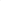
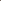
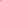

# Neon: Negative Extrapolation From Self-Training Improves Image Generation

<!-- Page 1 -->

Neon: Negative Extrapolation From Self-Training Improves Image Generation

NEON: NEGATIVE EXTRAPOLATION FROM SELF-TRAINING IMPROVES IMAGE GENERATION

Sina Alemohammad†, Zhangyang Wang†, Richard G. Baraniuk∗

†ECE Department, The University of Texas at Austin ∗ECE Department, Rice University

## ABSTRACT

Scaling generative AI models is bottlenecked by the scarcity of high-quality training data. The ease of synthesizing from a generative model suggests using (unverified) synthetic data to augment a limited corpus of real data for the purpose of fine-tuning in the hope of improving performance. Unfortunately, however, the resulting positive feedback loop leads to model autophagy disorder (MAD, aka model collapse) that results in a rapid degradation in sample quality and/or diversity. In this paper, we introduce Neon (for Negative Extrapolation frOm self-traiNing), a new learning method that turns the degradation from self-training into a powerful signal for self-improvement. Given a base model, Neon first fine-tunes it on its own self-synthesized data but then, counterintuitively, reverses its gradient updates to extrapolate away from the degraded weights. We prove that Neon works because typical inference samplers that favor high-probability regions create a predictable anti-alignment between the synthetic and real data population gradients, which negative extrapolation corrects to better align the model with the true data distribution. Neon is remarkably easy to implement via a simple post-hoc merge that requires no new real data, works effectively with as few as 1k synthetic samples, and typically uses less than 1% additional training compute. We demonstrate Neon’s universality across a range of architectures (diffusion, flow matching, autoregressive, and inductive moment matching models) and datasets (ImageNet, CIFAR-10, and FFHQ). In particular, on ImageNet 256x256, Neon elevates the xAR-L model to a new state-of-the-art FID of 1.02 with only 0.36% additional training compute. Code is available at https://github.com/VITA-Group/Neon xAR-L xAR-L + Neon

**Figure 1.** Good to great: Neon’s state-of-the-art performance on ImageNet-256. Neon elevates a powerful baseline generative model (xAR-L, top row) to a new level of sharpness and realism (bottom row) with a simple post-hoc merge. This leap in quality, improving the Fréchet Inception Distance (FID) from 1.28 to a record-breaking 1.02, is accomplished with only 0.36% extra training compute.

Corresponding author: sina.alemohammad@austin.utexas.edu arXiv:2510.03597v3 [cs.GR] 13 Oct 2025

AI-readable visual equivalent, added: Figure extracted from the paper PDF and converted to an SVG wrapper asset. Use the surrounding page text and caption for interpretation.

<!-- Page 2 -->

Neon: Negative Extrapolation From Self-Training Improves Image Generation

## 1 INTRODUCTION

Modern generative models for images have achieved remarkable photorealism through continuous advances in architectures, training methods, and scale. Diffusion models (Ho et al., 2020; Song et al., 2021), flow matching approaches (Lipman et al., 2023; Liu et al., 2023), autoregressive architectures (Ding et al., 2021; Yu et al., 2022), and few-step generators (Song et al., 2023; Zhou et al., 2025a) now form the backbone of large-scale image generation systems. Despite these advances, the most reliable path to state-of-the-art performance remains scaling: ever more parameters, ever larger datasets, and ever increasing compute (Kaplan et al., 2020; Henighan et al., 2020).

Important energy sustainability issues aside, this scaling paradigm faces a fundamental bottleneck: high-quality training data. Curating diverse, rights-cleared image datasets is expensive and timeconsuming, with diminishing returns as existing sources are exhausted (Villalobos et al., 2022; Muennighoff et al., 2023). As the gap between model capacity and available training data widens, the field must explore alternative paths to model improvement that do not rely on ever-larger real datasets.

The ease of synthesizing data from generative models has inspired a range of model improvement approaches to augment a limited real data set. At the simplistic end, one can fine-tune a model on its own generated outputs. However, such naïve self-training has been shown to lead to “model autophagy disorder” (MAD) (Alemohammad et al., 2024a) or model collapse (Shumailov et al., 2024), where diversity and/or quality degrades. At the complicated end, researchers have avoided collapse through sophisticated workarounds like external verifiers for synthetic data quality (Feng et al., 2024), auxiliary discriminator networks (Kim et al., 2023a), negative guidance during inference (Alemohammad et al., 2024b), and likelihood-based discrimination between distributions (Zheng et al., 2025). While effective, these approaches add significant computational overhead, are restricted to specific architectures, or require complex iterative training.

Neon. In this paper, we show that there is hidden promise in directly fine-tuning a model on its own generated data. Our key insight is that the degradation due to self-training is not random noise but rather a powerful signal that is anti-aligned with the real-data population gradient. Neon (Negative Extrapolation from self-traiNing) exploits this anti-alignment through a simple parameter merge. Given a base model with parameters θr trained on real data, we first apply the naïve self-training approach: we generate synthetic samples and briefly fine-tune to obtain the parameters θs that exhibit degraded performance. Then, rather than using θs directly, we perform negative extrapolation:

θNeon = θr −w(θs −θr) = (1 + w)θr −wθs, w > 0, (1)

where w controls the extrapolation strength. The vector θs −θr corresponds to the synthetic gradient direction; because this direction is anti-aligned with the (infinite real data) population gradient, reversing it reduces the true data risk and redistributes probability mass to under-represented modes.

Contributions. [C1] We introduce Neon, a deceptively simple post-processing method that improves generative models by reversing their degradation on self-generated data (Section 3). In contrast to existing methods for synthetic data augmentation, Neon requires no additional real training data, no access to the original training data, no auxiliary models, no likelihood computation, and no inference modifications. [C2] We prove rigorously that mode-seeking inference samplers create a predictable anti-alignment between the synthetic and population gradients that guarantees the effectiveness of negative extrapolation (Section 3.1). [C3] We demonstrate Neon’s universality across diffusion, flow matching (Section 4.1), autoregressive (Section 4.2), and few-step (Section 4.3) models on CIFAR-10, FFHQ, and ImageNet with < 1% additional compute and as few as 1k synthetic samples. For example, on ImageNet-256, Neon elevates xAR-L from an FID of 1.28 to the state-of-the-art 1.02 using only 0.36% additional compute. [C4] We show that Neon’s improvement mechanism operates through a precision-recall trade-off that redistributes probability mass from over- to under-represented modes (Section 4.1). [C5] We demonstrate that the Neon degradation signal is transferable, which enables synthetic data from one model architecture to improve another (Section 4.4).

## BACKGROUND

Notation and definitions. Let D be a training data set drawn from pdata. A training algorithm produces the generative model Gθ, whose output is a score, velocity, or logit depending on the

<!-- Page 3 -->

Neon: Negative Extrapolation From Self-Training Improves Image Generation model family. The training budget B is the cumulative number of images seen (in millions): B = (global steps) × (global batch size). An inference routine I with hyperparameters κ induces a sampling distribution qθ,κ. Denote the idealized distribution without inference-time modifications (e.g., guidance) by pθ:= qθ,∅. We use dist(·, ·) for a generic divergence, | · | for set cardinality, and the shorthand

∥x∥M:= ∥M 1/2x∥2, ⟨x, y⟩M:= x⊤My, ∥A∥op,M:= ∥M 1/2AM −1/2∥op, for any positive-definite matrix M, where ∥· ∥2, ⟨·, ·⟩, and ∥· ∥op are the standard Euclidean norm, inner product, and operator norm. Let k denote 103.

Visual generative models. Many image generators trace a path from noise to data via an affine interpolation xt = α(t)x0 + σ(t)ϵ for t ∈[0, 1], with x0 ∼pdata, ϵ ∼N(0, I), and boundary conditions α(0) = 1, σ(0) = 0, α(1) = 0, σ(1) = 1, inducing p0 = pdata and p1 = N(0, I) (Song et al., 2021; Lipman et al., 2023).

Diffusion models (Ho et al., 2020; Song et al., 2021) train Gθ(x, t) to approximate the score ∇x log pt(x) (or equivalently, predict noise). At inference, the learned score drives the reverse-time SDE or probability-flow ODE.

Flow matching (Lipman et al., 2023; Tong et al., 2024) learns the conditional velocity v⋆(x0, ϵ, t) = α′(t)x0 + σ′(t)ϵ by regressing Gθ(xt, t) with squared error; sampling integrates ˙xt = Gθ(xt, t) from t = 1 to t = 0.

Few-step generators reduce sampling cost by collapsing many steps. Consistency models (Song et al., 2023) predict x0 directly from (xt, t); IMM (Zhou et al., 2025a) learns direct transitions xs = Gθ(xt, t→s) with moment-matching, enabling quality with T≈1–8 steps.

Autoregressive models (Tian et al., 2024; Ren et al., 2025) factorize images into tokens y1:N = T (x) and model p(y1:N) = QN i=1 p(yπ(i) | yπ(<i)), where Gθ(y<i) outputs next-token logits trained via cross-entropy. The ordering π and decoding choices (temperature, top-k) form part of inference hyperparameters κ.

Self-training and collapse. When models iteratively train on their own synthetic outputs, they exhibit what has been termed MADness or model collapse: E[dist(pdata, pθt)] grows over time (Alemohammad et al., 2024a; Shumailov et al., 2024; Dohmatob et al., 2024). Pure self-training diverges, while mixing real and synthetic data converges to degraded equilibria (Bertrand et al., 2023; Gerstgrasser et al., 2024). While external signals beyond the training data can prevent collapse (Feng et al., 2024; Alemohammad et al., 2024b), these methods require additional resources such as verifiers or fresh data.

Related work on synthetic data training. Several recent methods successfully leverage synthetic data for model improvement, but require significant architectural constraints or computational overhead. Discriminator Guidance (Kim et al., 2023a) trains a post-hoc discriminator on real versus generated samples across diffusion timesteps, using its gradients to correct the score function during sampling. While effective, it adds inference overhead and remains diffusion-specific. SIMS (Alemohammad et al., 2024b) employs self-generated data as negative guidance to steer diffusion trajectories away from degraded manifolds, but similarly requires inference-time modifications and is limited to diffusion models. Direct Discriminative Optimization (DDO) (Zheng et al., 2025) reformulates likelihood-based models as implicit discriminators via log-likelihood ratios between target and reference models, enabling strong improvements for diffusion (via ELBO) and autoregressive models, but fundamentally cannot apply to likelihood-free architectures like flow matching (Lipman et al., 2023) or inductive moment matching (Zhou et al., 2025a). Self-Play Fine-Tuning (Yuan et al., 2024) iteratively pits models against earlier checkpoints, surpassing RLHF methods on human preference benchmarks but requiring multiple training rounds and substantial computational overhead. In contrast to these methods, Neon requires no auxiliary models, no inference modifications, no likelihood computations, and works across all architectures with a simple post-hoc parameter merge.

NEON: NEGATIVE EXTRAPOLATION FROM SELF-TRAINING

When models train on synthetic samples produced by their inference procedure I (what we call “self-training”), they predictably degrade. Neon exploits this: by reversing the degradation direction, we can improve a model without additional real data. Starting from a base generator Gθr (typically

<!-- Page 4 -->

Neon: Negative Extrapolation From Self-Training Improves Image Generation

**Figure 2.** Neon’s key idea: synthetic degradation and realdata improvement point in opposite directions. This toy 2D Gaussian example plots as a heat map the log Wasserstein distance to the true data distribution pdata from the generative model Gθ(ws,wo). We see that updating the model’s parameters in the reverse of the direction they would be updated by finetuning on self-synthesized data (increasing ws) achieves similar improvements to fine-tuning the base model with 4× more real data (increasing wo).

trained on real data), we: (i) generate the synthetic dataset S once using test-time inference I(Gθr; κ), (ii) briefly (e.g., using < 1% of the original training budget) fine-tune the generator on S to obtain the degraded Gθs, and (iii) negatively extrapolate via the parameter merge:

θNeon:= θr −w(θs −θr) = (1 + w)θr −wθs, (2)

where w > 0 controls the extrapolation strength. Algorithm 1 provides the full details.

## Algorithm

## 1 Neon: Negative Extrapolation from

Self-Training

Require: Base model Gθr, inference routine I with hyperparameters κ

Hyperparameters: Synthetic dataset size ns = |S|, extrapolation strength w, training budget B 1: S ←{xi}ns i=1 where xi ∼qθr,κ induced by I(Gθr; κ) ▷sample using test-time inference 2: Gθs ←FineTune(Gθr, S, B) ▷briefly fine-tune on synthetic data 3: θNeon ←(1 + w)θr −wθs ▷reverse the degradation Output: Final generator GθNeon

## 3.1 WHY NEON WORKS

Geometric intuition via a toy study. To visualize why negative extrapolation from degradation succeeds, consider a 2D Gaussian example where pdata = N(µtrue, Σtrue). We train a base model Gθr on 1k real samples and then define two directions in parameter space: the degradation direction from fine-tuning the base model on 105 synthetic samples from Gθr to obtain Gθs, and an oracle improvement direction from fine-tuning on 5k real samples (the original 1k real data points plus 4k new ones) to obtain Gθo. We evaluate models in the 2D span of these directions:

θ(ws, wo) = θr + ws (θr −θs) | {z } −degradation direction (Neon)

+ wo (θo −θr) | {z } oracle improvement direction

(3)

where ws controls the amount of negative extrapolation (Neon) and wo adds real-data improvement (oracle baseline). Figure 2 visualizes our key finding: moving backwards along the Neon direction alone (wo = 0) yields substantial improvement, indicating that the opposite of degradation direction and additional real-data improvement direction both point towards a better approximation of the true data distribution.

Theoretical analysis. We now formalize the intuition provided by the toy example. We prove that typical inference samplers cause the synthetic and real data gradients to point in opposite directions, enabling negative extrapolation to reduce the true data risk.

Set-up. Let ℓθ(x) be differentiable loss function and Rdata(θ):= Epdata[ℓθ(X)] the corresponding risk. Let θ∗∈arg minθ Rdata(θ) and write θr = θ∗+ ε with ∥ε∥2

Hd = ε⊤Hd ε. Let qθr,κ denote the fixed sampler constructed once at θr. Define ϕθ(x):= ∇θℓθ(x), Hd:= ∇2Rdata(θ∗) = Epdata

∂θϕθ(X)

θ=θ∗,

Rsyn(θ):= Ex∼qθr,κ[ℓθ(x)], rd:= ∇θRdata(θ)

θr, rs:= ∇θRsyn(θ)

θr.

Let P ≻0 be a preconditioner and set K:= H1/2 d PH1/2 d with mI ⪯K ⪯MI.

We say the synthetic and real data gradients are anti-aligned at θr if their preconditioned inner product is negative s:= ⟨rd, P rs⟩< 0.

AI-readable visual equivalent, added: Figure extracted from the paper PDF and converted to an SVG wrapper asset. Use the surrounding page text and caption for interpretation.

<!-- Page 5 -->

Neon: Negative Extrapolation From Self-Training Improves Image Generation

Neon improves under anti-alignment. Short synthetic fine-tuning yields θs = θr −α P rs+O(α2), which Neon reverses: θNeon = θr + wα Prs + O(wα2). A Taylor expansion of the risk yields

Rdata(θNeon) = Rdata(θr) + wα s + (wα)2

2 r⊤ s P ⊤∇2Rdata(θr) P rs + O

(wα)3

. (4)

When s < 0, the negative linear term dominates for small w > 0, ensuring that Rdata(θNeon) < Rdata(θr). When Rdata is locally convex at θr (i.e., ∇2Rdata(θr) ⪰0), the optimal w∗= −s/(αz) > 0, where z:= r⊤ s P ⊤∇2Rdata(θr)Prs.1 See Appendix B.2 for the proof.

Sampler-induced anti-alignment. Let b:= Eqθr,κ ϕθ∗(X)

, ∆:= Eqθr,κ

Jθ∗(X)

−Epdata

Jθ∗(X)

, Jθ∗(x):= ∂θϕθ(x)

θ∗, (5)

and measure their sizes in the Hd–geometry by η0:= ∥b∥H−1 d, η1:= ∥∆∥op, H−1 d.

Define the angle between the model error ε and the sampler bias b in the Hd–geometry by cos φ:= ⟨ε, H−1 d b⟩Hd ∥ε∥Hd ∥H−1 d b∥Hd

∈[−1, 1]. (6)

Intuitively, cos φ < 0 means that the sampler’s bias points is in a direction opposing the current error, favoring anti-alignment.

Theorem 1 (Anti-alignment under inference mismatch). Let K:= H1/2 d PH1/2 d with spectral bounds mI ⪯K ⪯MI. Then the alignment s = ⟨rd, Prs⟩obeys s ≤M(1 + η1) ∥ε∥2

Hd −m η0 ∥ε∥Hd [−cos φ]+ + O(∥ε∥3

Hd).

Consequently, a sufficient condition for s < 0 is that the leading two terms on the right-hand side be negative. In particular, for cos φ < 0 and sufficiently small ∥ε∥Hd,

∥ε∥Hd < m η0 M(1 + η1) (−cos φ) =⇒s < 0.

See Appendices B.2–B.3 for the proof.

Mode-seeking samplers induce s < 0. The inference routines of many of today’s generative models can be written as a monotone reweighting of the reference model q(x) ∝f log pθr(x)

pθr(x), with f nondecreasing and not a.e. constant.

Such mode-seeking samplers emphasize high-density regions and (to first order near θ∗) produce an obtuse angle with b, i.e., cos φ < 0 in (6). Combining this with Theorem 1 yields a transparent sufficient condition for s < 0 near strong base models (i.e small ∥ε∥Hd); hence, negative extrapolation (w > 0 in (2) reduces the real-data risk Rdata.

Some concrete instances: (i) AR: temperature τ < 1 and top-p/k truncation yield nondecreasing reweighting of log pθr; see Appendix B.4 for the proof for AR models. (ii) Diffusion/flow: finite-step ODE solvers (including classifier-free guidance (CFG) (Ho & Salimans, 2022)) induce monotone terminal reweighting to first order in step size; see Appendix B.5 for the proof for diffusion models.2

When Neon fails. Neon’s success requires s < 0 (negative gradient alignment). If the sampler is not mode-seeking but rather diversity-seeking — meaning that it upweights low-probability regions via q(x) ∝f(log pθr(x))pθr(x) with f nonincreasing — then our theory shows that s > 0 near good models (small |ε|Hd) and assuming modest curvature tilt (i.e., small η1). In this case, standard self-training (moving toward θs, equivalent to negative w) would actually improve the model, while Neon’s prescription (positive w) would harm it. Diversity-seeking samplers are rare in practice: they require temperature τ > 1 for AR models or specialized samplers that decrease contraction near

1Local convexity is sufficient but not necessary. The result holds under the weaker condition of directional smoothness along the step direction d = Prs. See Appendix B.2 for details.

2For the proof of finite-step ODE solvers being mode-seeking, we assume curvature–density coupling: contraction E[P k ∥∇xf(Xtk, tk)∥2

Fr|X0 = x0] increases with log pθr(x0).

<!-- Page 6 -->

Neon: Negative Extrapolation From Self-Training Improves Image Generation

0 2 4 1.2

1.4

1.6

1.8

2

B (Mi)

FID

EDM-VP | CIFAR-10

0 1 2 3 0.5

1

1.5

2

2.5

B (Mi)

FID

EDM-VP | FFHQ 64

0 1 2 3 2

3

4

B (Mi)

FID

Flow Matching | CIFAR-10

|S|

1k 6k 25k 100k

|S|

1k 5k 18k 75k

|S|

1k 6k 25k 100k

**Figure 3.** Neon consistently improves FID with minimal self-training overhead. Minimum FID (optimized over extrapolation strength w) vs. self-training budget B (millions of images seen during fine-tuning on S) for varying synthetic dataset sizes |S|, on EDM-VP (CIFAR-10/FFHQ-64) and flow matching (CIFAR-10). Optimal gains use B ≤3Mi (< 2% of base model training compute for EDM; < 3% for flow), confirming Neon’s efficiency. At B = 0, FID reflects the base model (no Neon).

0 1 2 3 1

1.5

2

2.5

3 w

FID

0 1 2 3

0.6

0.7 w

Precision

0 1 2 3 0.6

0.65

0.7

0.75 w

Recall

|B|

## 3 Mi 4 Mi 5 Mi 6 Mi

|B|

## 3 Mi 4 Mi 5 Mi 6 Mi

|B|

## 3 Mi 4 Mi 5 Mi 6 Mi

**Figure 4.** Neon trades precision for recall, yielding net FID improvement. For the EDM-VP model trained on CIFAR-10, we plot the FID, precision, and recall vs. negative extrapolation strength w for various training budgets B. In each case, |S| = 6k.

modes for diffusion models, both of which are rare design choices. See Appendix B.7 for more details.

Finite |S| effects. Our analysis assumes that the population synthetic gradients rs(θr), but in practice we use finite S with brief fine-tuning from θr. For checkpoint θs after T steps with step size α, the displacement dT:= (θs −θr)/(αT) concentrates on −Pr(S)

s (θr) when T is sufficiently large while αT remains small, yielding stable, low-variance Neon directions despite limited |S|. This produces a U-shaped performance in |S|: very small sets are variance-limited, very large sets amplify curvature effects (inflating the quadratic term in our Taylor expansion), while moderate sizes optimally balance these competing factors. See Appendix B.8 for formal bounds and parameter selection guidance.

## 4 EXPERIMENTS

We evaluate Neon across four model families — diffusion (EDM (Karras et al., 2022)), flow matching (Tong et al., 2024; 2023), autoregressive (VAR (Tian et al., 2024), xAR (Ren et al., 2025)), and few-step (IMM (Zhou et al., 2025a)) — on ImageNet (Deng et al., 2009), CIFAR-10 (Krizhevsky & Hinton, 2009), and FFHQ (Karras et al., 2019).

For each model, starting from a public checkpoint Gθr, we generate synthetic datasets S using the FID-optimal inference settings κ from each paper. We fine-tune on S with the original training recipe at reduced learning rate (see Appendix C for details). We report FID as our primary metric using 10k/50k samples for hyperparameter search/final evaluation (Heusel et al., 2017), with Precision/Recall (Kynkäänniemi et al., 2019) at k = 5 nearest neighbors. For a comprehensive comparison of Neon against state-of-the-art generative models across all benchmarks, please see Table A.1.

## 4.1 DIFFUSION AND FLOW MATCHING MODELS

We evaluate Neon with the EDM-VP (Karras et al., 2022) (CIFAR-10 conditional, FFHQ-64 unconditional) and flow matching (Tong et al., 2024; 2023) (CIFAR-10 unconditional) models using public checkpoints. The synthetic datasets S were generated with default inference settings.

<!-- Page 7 -->

Neon: Negative Extrapolation From Self-Training Improves Image Generation

0 2 4 6

1.4

1.6

B (Mi)

FID xAR-B | ImageNet-256

0 2 4 6

1.1

1.2

1.3

B (Mi)

xAR-L | ImageNet-256

0 2 4 6 2

2.5

3

B (Mi)

VAR-d16 | ImageNet-256

0 1 2 3

2

2.5

B (Mi)

VAR-d30 | ImageNet-512

|S|

1k 10k 90k 750k

**Figure 5.** Neon consistently improves autoregressive models across architectures and resolutions. We plot the minimum FID (optimized over merge weight w and CFG scale γ) versus the fine-tuning budget B for various synthetic dataset sizes |S|. From left: xAR-B and xAR-L on ImageNet-256 (with xAR-L achieving a state-of-the-art 1.02 FID), VAR-d16 on ImageNet-256, and VAR-d30 on ImageNet-512.

FID

0.0 0.2 0.4 0.6 0.8 1.0 1.2 1.4 1.6 w

1.5

2.0

2.5

3.0

3.5

4.0 γ

3

4

5

6

8

9

## 10 Precision

0.0 0.2 0.4 0.6 0.8 1.0 1.2 1.4 1.6 w

1.5

2.0

2.5

3.0

3.5

4.0 γ

0.775

0.800

0.825

0.850

0.875

0.900

0.925

## 0.950 Recall

0.0 0.2 0.4 0.6 0.8 1.0 1.2 1.4 1.6 w

1.5

2.0

2.5

3.0

3.5

4.0 γ

0.55

0.60

0.65

0.70

0.75

Asymptotic Recall-Precision

0 5 10 15

0.2

0.4

0.6

0.8

1 γ w = 0 w = 0.25 w = 0.5 w = 0.75 w = 1

Precision Recall

**Figure 6.** Optimal precision-recall trade-offs for VAR-d16 as a function of w and γ. Left: Heatmaps for FID, precision, and recall on ImageNet-256 (|S|=750k, B=1.25Mi) from a grid search over w and γ. The star marks the best FID (w∗≈1.0, γ∗≈2.7) achieving FID 2.01, unreachable by either parameter alone. Right: Asymptotic precision-recall curves showing expanded behavioral range through joint tuning.

Results. Figure 3 plots the FID vs. the fine-tuning budget B for various |S|. Neon achieves substantial gains with minimal overhead: Neon+EDM-VP trained on CIFAR-10 improves the FID from 1.78 to 1.38 using only 6k synthetic samples and 1.75% extra compute compared to training the base model. Neon+EDM-VP trained on FFHQ-64 improves the FID from 2.39 to 1.12 using only 18k samples and 0.85% additional compute. Neon+Flow matching on CIFAR-10 improves the FID from 3.5 to 2.32 using only 25k samples and 3.2% additional compute. Neon’s performance shows a non-monotonic relationship with the synthetic dataset size |S|, with optimal performance in the range 6k–25k samples. Smaller |S| require more precise w tuning but converge rapidly; larger |S| support a wider range of w’s but slower convergence.

**Figure 4.** dissects Neon’s effect on EDM-VP trained on CIFAR-10 using precision-recall metrics with |S = 6k. The FID vs. weight relationship (left panel) exhibits the unimodal shape predicted by our Taylor series analysis. As fine-tuning progresses, the optimal w∗decreases, which is consistent with w∗≈−s/(αz), where α increases with training steps. The precision-recall trade-off (middle/right panels) reveals Neon’s mechanism: precision monotonically decreases with w, while recall follows an inverted-U peaking near the FID-optimal weight. This aligns with our analysis: fine-tuning on synthetic data concentrates probability mass on well-captured modes, degrading coverage. By reversing this direction, Neon redistributes mass from over-represented to under-represented regions, trading precision for improved recall and yielding net FID improvement. These dynamics intensify with longer fine-tuning, with later checkpoints showing sharper recall peaks and steeper precision drops. (See Appendix D for all models.)

## 4.2 AUTOREGRESSIVE MODELS

We evaluate Neon’s impact on xAR-B and xAR-L (Ren et al., 2025) (ImageNet-256), VAR-d16 (Tian et al., 2024) (ImageNet-256), and VAR-d30 (ImageNet-512). Both model families use CFG, with VAR adding top-k/top-p sampling; these are mode-seeking samplers, and so our theory predicts Neon benefits. At evaluation, we jointly optimize both the merge weight w and CFG scale γ. Cooptimization is crucial to reaching the best FID: w increases recall at precision’s expense, while γ does the opposite.

AI-readable visual equivalent, added: Figure extracted from the paper PDF and converted to an SVG wrapper asset. Use the surrounding page text and caption for interpretation.

AI-readable visual equivalent, added: Figure extracted from the paper PDF and converted to an SVG wrapper asset. Use the surrounding page text and caption for interpretation.

AI-readable visual equivalent, added: Figure extracted from the paper PDF and converted to an SVG wrapper asset. Use the surrounding page text and caption for interpretation.

AI-readable visual equivalent, added: Figure extracted from the paper PDF and converted to an SVG wrapper asset. Use the surrounding page text and caption for interpretation.

AI-readable visual equivalent, added: Figure extracted from the paper PDF and converted to an SVG wrapper asset. Use the surrounding page text and caption for interpretation.

AI-readable visual equivalent, added: Figure extracted from the paper PDF and converted to an SVG wrapper asset. Use the surrounding page text and caption for interpretation.

<!-- Page 8 -->

Neon: Negative Extrapolation From Self-Training Improves Image Generation

0 2 4 6

7

7.5

B (Mi)

FID

IMM | T = 1

0 2 4 6

3

3.5

4

B (Mi)

IMM | T = 2

0 2 4 6

1.8

2

2.2

2.4

B (Mi)

IMM | T = 4

0 2 4 6 1.4

1.6

1.8

2

B (Mi)

IMM | T=8

|S|

1k 30k 150k 750k

**Figure 7.** Neon dramatically improves few-step inference for IMM on ImageNet-256. Minimum FID (optimized over w and γ) vs. fine-tuning budget B for different |S|. Synthetic data were generated using T=8, γ=1.5. From left: T=1, 2, 4, 8 inference steps. Neon achieves substantial FID reductions with near-zero additional compute (< 0.005% of IMM’s training), with Neon improved model with 4-step nearly matching base model with 8-step generation quality.

Results. Figure 5 depicts the best FID after (γ, w) grid search versus fine-tuning budget B, testing up to |S| = 750k synthetic samples. The xAR family FID improves monotonically: xAR-B from 1.72 to 1.31 (750k synthetic samples, 0.41% additional compute); xAR-L from 1.28 to the state-of-the-art FID 1.02 (750k samples, 0.36% additional compute), surpassing UCGM’s 1.06 (Sun et al., 2025). Even with just 1k samples, the xAR models achieve near-optimal performance (xAR-L: 1.05, xAR-B: 1.36), indicating that the degradation direction stabilizes quickly and requires minimal synthetic data to identify. VAR-d16 improves from 3.30 to 2.01 (750k samples, 0.64% additional compute) but requires larger synthetic datasets—performance degrades with |S| < 90k. VAR-d30 achieves its best FID of 1.69 with just 90k samples; adding more synthetic data provides no further meaningful improvement, suggesting the model has reached its capacity for Neon-based enhancement at this checkpoint.

**Figure 6.** visualizes the (w, γ) interaction for VAR-d16. The FID landscape’s diagonal valley with optimum (w∗≈1.0, γ∗≈2.7) yields FID 2.01. Independent optimization (γ=1.25) yields FID 3.01 — far worse. Joint tuning enables precision-recall trade-offs unreachable by either parameter alone: at the optimum, precision drops to ∼0.87 while recall rises to ∼0.63. The rightmost panel reveals the asymptotic behavior: as γ increases, the models converge to high precision (> 0.95) but severely degraded recall (< 0.45), leading to mode collapse. Higher w values provide partial protection — at w = 2, the low-recall limit rises to ∼0.55 vs. ∼0.40 at w = 0, demonstrating how negative

extrapolation counteracts CFG’s mode-seeking tendency even at extreme guidance scales.

## 4.3 FEW-STEP GENERATORS

We investigate Neon paired with Inductive Moment Matching (IMM) (Zhou et al., 2025a) on ImageNet-256. We generated S using T=8 steps with CFG scale γ=1.5. At evaluation, we tested the models across inference steps T∈{1, 2, 4, 8} and jointly searched over (w, γ).

Results. Figure 7 plots the FID vs. the fine-tuning budget B. Neon delivers dramatic improvements across all step counts with minimal overhead relative to IMM’s 40,960Mi training budget. Performance scales inversely with the number of inference steps. Neon improves T=1 (single-step) inference to an FID of 6.67. T=2 reaches 2.89; T=4 reaches 1.69; and T=8 reaches 1.46. Remarkably, 4-step inference nearly matches base model with 8-step quality (1.69 vs. 1.98), effectively halving the inference cost. Unlike IMM’s tens of thousands of million-image steps, Neon achieves optimal performance within 2Mi in all experiments for different |S|, demonstrating rapid degradation direction stabilization for few-step models. The 30k sample sweet spot across all T suggests that few-step generators are particularly well-suited for Neon, as their training already distills multi-step dynamics into compact transitions, making the synthetic degradation signal especially informative.

## 4.4 ABLATION STUDIES

Neon is transferable across different architectures. A key advantage of Neon is that the degradation signal is transferable across different model architectures. We confirm

<!-- Page 9 -->

Neon: Negative Extrapolation From Self-Training Improves Image Generation this empirically in Figure 8, by improving a baseline unconditional EDM-VP model (FID = 1.97) using synthetic data from different sources. While data from the model itself yields the strongest improvement (FID = 1.38), cross-architecture transfer is highly effective.

0 2 4 6 8 10

1.4

1.6

1.8

2

B (Mi)

FID

EDM (self)

Flow IMM

**Figure 8.** Neon supports crossarchitecture synthetic data transfer. We illustrate by using synthetic data from an IMM and a Flow model to improve EDM-VP on CIFAR-10.

Data from a flow matching model achieves an FID of 1.59, and from an IMM model reaches 1.80. The theory expounded in Appendix B.6 formalizes why Neon is transferable. Consider models A and B that minimize the same objective with Hessians H(A)

d and H(B)

d. If these Hessians are spectrally close (equivalent norms up to constants c, C) and the architectures induce similar sampler biases (small mismatch ζ in the terms b, ∆defined in (5), then antialignment transfers from one model to the other. That is, when model (A) satisfies s(A) ≤−µ < 0, any nearby model (B) inherits s(B) ≤−µ/2 < 0. Intuitively, models learning similar representations exhibit similar overconfidence patterns, and so one model’s degradation direction corrects another’s biases. This makes Neon practical when generating samples from the target model is costly.

To test if any out-of-distribution dataset provides a useful signal, we replaced the synthetic data with CIFAR-10C (Hendrycks & Dietterich, 2019), a dataset of corrupted real images. Neon resulted in no FID improvement. This null result confirms that Neon specifically leverages the anti-alignment from a model overemphasizing its own modes — a bias absent in structured corruptions like CIFAR-10C.

10 20 30 40 50 100

100.5

101

|D| (k)

FID

EDM EDM + Neon

**Figure 9.** Neon does not require a nearoptimal base model to succeed.

How good must the base model be? A key question is whether Neon’s benefits are limited to nearly optimal models, since our theory guarantees anti-alignment only when the model error ∥ε∥F is small. To test this condition’s robustness, we applied Neon to a spectrum of EDM-VP base models trained on CIFAR-10 subsets of varying sizes. Figure 9 shows that Neon offers substantial improvements across the entire quality spectrum. Strikingly, a model trained on only 30k real samples (FID 1.87) and improved with Neon nearly matches the baseline model trained on the full 50k dataset (FID 1.85). This demonstrates that Neon can compensate for a 40% reduction in real training data, confirming the anti-alignment condition (s < 0) is not fragile but holds across a wide range of model qualities. This bodes well for data-scarce applications.

0 2 4 6 1.3

1.35

1.4 γ

FID

**Figure 10.** Neon does not require highquality synthetic data to succeed.

Sensitivity to synthetic data quality. Our main experiments generated synthetic datasets using optimal inference settings for FID (e.g., γ = 2.7 for xAR-B). To test the sensitivity to the quality of S, we trained Neon+xAR-B on ImageNet-256 with |S| = 90k and varied the CFG scale used during generation. We generated synthetic datasets with γ ∈[0, 6.2], fine-tuned on each S, and then optimized the final Neon model. Figure 10 demonstrates Neon’s remarkable robustness: despite training on synthetic data of varying quality, the final FID remains near-optimal (1.30–1.31) for any γ ∈[1, 3]. Even suboptimal synthetic datasets yield performance within 3% of optimal. This suggests that Neon captures the fundamental mode-seeking bias rather than requiring precisely tuned synthetic data. Only at extreme values (e.g., γ ≥6) does performance degrade significantly, likely due to excessive mode collapse in S.

<!-- Page 10 -->

Neon: Negative Extrapolation From Self-Training Improves Image Generation

## 5 CONCLUSIONS

We have introduced Neon, a simple and efficient post-processing method that improves generative models by inverting the degradation caused by self-training. Neon is grounded in a key insight: common mode-seeking inference samplers induce a predictable anti-alignment between gradients from synthetic and population data, explaining both the failure of naïve self-training and Neon’s success. By extrapolating away from this degradation direction, Neon corrects the sampler’s inherent bias, redistributing probability mass from over-represented modes to under-represented ones, thereby enhancing recall and overall generation fidelity. Neon’s effectiveness across diverse model architectures and training datasets suggests that we can reframe model degradation not as a failure, but as a structured, harnessable signal for improvement in an increasingly data-scarce field. Our work also positions inference samplers as valuable diagnostic tools for uncovering and remedying a model’s distributional flaws.

Neon opens several promising avenues for future work. First, can the degradation direction be estimated reliably without any self-training? Second, can we actively synthesize “optimal bad” datasets that elicit a stronger, more stable corrective signal? Third, in diversity-seeking regimes where self-training potentially aligns positively with the population gradient (assuming small η1), the forward step should help; identifying diversity-promoting samplers that induce positive alignment would enable direct self-improvement without inversion. In the meantime, a bi-directional update that blends the forward diversity-seeking direction with the reversed mode-seeking degradation direction is a practical hybrid to explore.

As the demand for more capable generative models outpaces the availability of high-quality training data, progress will depend on new methods that extract more value from models and their training data. Neon demonstrates that even seemingly harmful procedures, when properly understood and corrected, can guide us toward better models, showing that sometimes, the path forward requires a deliberate step backward.

## ACKNOWLEDGMENTS

This work was supported in part by NSF Awards 2145346 (CAREER), 02133861 (DMS), 2113904 (CCSS), and the NSF AI Institute for Foundations of Machine Learning (IFML); ONR N00014-23-1- 2714; ONR MURI N00014-20-1-2787; DOE DE-SC0020345; and DOI 140D0423C0076. Thanks to Predrag Neskovic for pushing us down the path towards understanding negative extrapolation and to Ahmed Imtiaz Humayun for early discussions and for suggesting Algorithm 1 for model self-improvement with synthetic data.

<!-- Page 11 -->

Neon: Negative Extrapolation From Self-Training Improves Image Generation

## REFERENCES

Sina Alemohammad, Josue Casco-Rodriguez, Lorenzo Luzi, Ahmed Imtiaz Humayun, Hossein

Babaei, Daniel LeJeune, Ali Siahkoohi, and Richard Baraniuk. Self-consuming generative models go MAD. In International Conference on Learning Representations, 2024a. URL https: //openreview.net/forum?id=ShjMHfmPs0.

Sina Alemohammad, Ahmed Imtiaz Humayun, Shruti Agarwal, John Collomosse, and Richard

Baraniuk. Self-improving diffusion models with synthetic data. arXiv preprint arXiv:2408.16333, 2024b.

Fan Bao et al. All are worth words: A vit backbone for diffusion models. arXiv preprint arXiv:2209.12152, 2023.

Quentin Bertrand, Avishek Joey Bose, Alexandre Duplessis, Marco Jiralerspong, and Gauthier Gidel.

On the stability of iterative retraining of generative models on their own data. arXiv preprint arXiv:2310.00429, 2023.

Richard P. Brent. Algorithms for Minimization without Derivatives. Prentice-Hall, 1973.

Andrew Brock, Jeff Donahue, and Karen Simonyan. Large scale gan training for high fidelity natural image synthesis. In International Conference on Learning Representations, 2019.

Huiwen Chang et al. Maskgit: Masked generative image transformer. In Proceedings of the IEEE/CVF

Conference on Computer Vision and Pattern Recognition, 2022.

Jia Deng, Wei Dong, Richard Socher, Li-Jia Li, Kai Li, and Li Fei-Fei. Imagenet: A large-scale hierarchical image database. In IEEE Conference on Computer Vision and Pattern Recognition, pp. 248–255, 2009. doi: 10.1109/CVPR.2009.5206848.

Prafulla Dhariwal and Alexander Quinn Nichol. Diffusion models beat GANs on image synthesis.

In Advances in Neural Information Processing Systems, 2021. URL https://openreview. net/forum?id=AAWuCvzaVt.

Ming Ding, Zhuoyi Yang, Wenyi Hong, Wendi Zheng, Chang Zhou, Da Yin, Junyang Lin, Xu Zou,

Zhou Shao, Hongxia Yang, et al. Cogview: Mastering text-to-image generation via transformers. Advances in Neural Information Processing Systems, 34:19822–19835, 2021.

Elvis Dohmatob, Yunzhen Feng, Pu Yang, Francois Charton, and Julia Kempe. A tale of tails: Model collapse as a change of scaling laws. In International Conference on Machine Learning, 2024. URL https://openreview.net/forum?id=KVvku47shW.

Yunzhen Feng, Elvis Dohmatob, Pu Yang, Francois Charton, and Julia Kempe. Beyond model col- lapse: Scaling up with synthesized data requires reinforcement. arXiv preprint arXiv:2406.07515, 2024.

Kevin Frans et al. One-step image synthesis via iterative refinement. arXiv preprint, 2024.

Shanghua Gao, Pan Zhou, Ming-Ming Cheng, and Shuicheng Yan. Masked diffusion transformer is a strong image synthesizer. arXiv preprint arXiv:2303.14389, 2023.

Matthias Gerstgrasser, Rylan Schaeffer, Apratim Dey, Rafael Rafailov, Henry Sleight, John Hughes,

Tomasz Korbak, Rajashree Agrawal, Dhruv Pai, Andrey Gromov, et al. Is model collapse inevitable? Breaking the curse of recursion by accumulating real and synthetic data. arXiv preprint arXiv:2404.01413, 2024.

Dan Hendrycks and Thomas Dietterich. Benchmarking neural network robustness to common corrup- tions and perturbations. Proceedings of the International Conference on Learning Representations, 2019.

Tom Henighan, Jared Kaplan, Mor Katz, Mark Chen, Christopher Hesse, Jacob Jackson, Heewoo

Jun, Tom B Brown, Prafulla Dhariwal, Scott Gray, et al. Scaling laws for autoregressive generative modeling. arXiv preprint arXiv:2010.14701, 2020.

<!-- Page 12 -->

Neon: Negative Extrapolation From Self-Training Improves Image Generation

Martin Heusel, Hubert Ramsauer, Thomas Unterthiner, Bernhard Nessler, and Sepp Hochreiter. Gans trained by a two time-scale update rule converge to a local nash equilibrium. In Advances in Neural Information Processing Systems, pp. 6626–6637, 2017.

Jonathan Ho and Tim Salimans. Classifier-free diffusion guidance. arXiv preprint arXiv:2207.12598,

2022.

Jonathan Ho, Ajay Jain, and Pieter Abbeel. Denoising diffusion probabilistic models. arXiv preprint arXiv:2006.11239, 2020.

Allan Jabri, David J. Fleet, and Ting Chen. Scalable adaptive computation for iterative generation. In

International Conference on Machine Learning, volume 202 of Proceedings of Machine Learning Research, pp. 5941–5963, 2023.

Minguk Kang et al. Scaling up gans for text-to-image synthesis. arXiv preprint arXiv:2303.05511,

2023.

Jared Kaplan, Sam McCandlish, Tom Henighan, Tom B Brown, Benjamin Chess, Rewon Child, Scott

Gray, Alec Radford, Jeffrey Wu, and Dario Amodei. Scaling laws for neural language models. arXiv preprint arXiv:2001.08361, 2020.

Animesh Karnewar and Oliver Wang. Msg-gan: Multi-scale gradients for generative adversarial networks. arXiv preprint arXiv:1903.06048, 2019.

Tero Karras, Samuli Laine, and Timo Aila. A style-based generator architecture for generative adversarial networks. In Proceedings of the IEEE/CVF Conference on Computer Vision and Pattern Recognition, pp. 4401–4410, 2019.

Tero Karras, Miika Aittala, Janne Hellsten, Samuli Laine, Jaakko Lehtinen, and Timo Aila. Training generative adversarial networks with limited data. Advances in Neural Information Processing Systems, 33:12104–12114, 2020.

Tero Karras, Miika Aittala, Timo Aila, and Samuli Laine. Elucidating the design space of diffusion- based generative models. In S. Koyejo, S. Mohamed, A. Agarwal, D. Belgrave, K. Cho, and A. Oh (eds.), Advances in Neural Information Processing Systems, volume 35, pp. 26565–26577. Curran Associates, Inc., 2022.

Tero Karras, Miika Aittala, Tuomas Kynkäänniemi, Jaakko Lehtinen, Timo Aila, and Samuli Laine.

Guiding a diffusion model with a bad version of itself. arXiv preprint arXiv:2406.02507, 2024a.

Tero Karras, Miika Aittala, Jaakko Lehtinen, Janne Hellsten, Timo Aila, and Samuli Laine. Analyzing and improving the training dynamics of diffusion models. In Proceedings of the IEEE/CVF Conference on Computer Vision and Pattern Recognition, pp. 24174–24184, 2024b.

Dongjun Kim, Yeongmin Kim, Se Jung Kwon, Wanmo Kang, and Il-Chul Moon. Refining gen- erative process with discriminator guidance in score-based diffusion models. In International Conference on Machine Learning, volume 202 of Proceedings of Machine Learning Research, pp. 16567–16598. PMLR, 2023a. URL https://proceedings.mlr.press/v202/kim23i. html.

Dongjun Kim et al. Consistency trajectory models: Learning probability flow ode trajectory of diffusion. arXiv preprint arXiv:2310.02279, 2023b.

Diederik P Kingma and Ruiqi Gao. Understanding diffusion objectives as weighted elbo. arXiv preprint arXiv:2303.18103, 2024.

Alex Krizhevsky and Geoffrey Hinton. Learning multiple layers of features from tiny images.

Technical report, University of Toronto, Toronto, Ontario, 2009.

Tuomas Kynkäänniemi, Tero Karras, Samuli Laine, Jaakko Lehtinen, and Timo Aila. Improved precision and recall metric for assessing generative models. In Advances in Neural Information Processing Systems, pp. 3927–3936, 2019.

<!-- Page 13 -->

Neon: Negative Extrapolation From Self-Training Improves Image Generation

Tuomas Kynkäänniemi, Miika Aittala, Tero Karras, Samuli Laine, Timo Aila, and Jaakko Lehtinen.

Applying guidance in a limited interval improves sample and distribution quality in diffusion models. arXiv preprint arXiv:2404.07724, 2024.

Seungkwan Lee, Kwanghee Ko, Hyunseung Lee, and Hyunjun Cho. Anycost gans for interactive image synthesis and editing. Proceedings of the IEEE/CVF Conference on Computer Vision and Pattern Recognition, pp. 14986–14996, 2021.

Tianhong Li et al. Autoregressive image generation without vector quantization. arXiv preprint arXiv:2406.11838, 2024.

Yaron Lipman, Ricky T. Q. Chen, Heli Ben-Hamu, Maximilian Nickel, and Matthew Le. Flow matching for generative modeling. In International Conference on Learning Representations, 2023. URL https://openreview.net/forum?id=PqvMRDCJT9t.

Xingchao Liu, Chengyue Gong, and Qiang Liu. Flow straight and fast: Learning to generate and transfer data with rectified flow. arXiv preprint arXiv:2209.03003, 2023.

Cheng Lu, Yuhao Zhou, Fan Bao, Jianfei Chen, Chongxuan Li, and Jun Zhu. Dpm-solver: A fast ode solver for diffusion probabilistic model sampling in around 10 steps. arXiv preprint arXiv:2206.00927, 2022.

Nanye Ma et al. Sit: Exploring flow and diffusion transformers. arXiv preprint arXiv:2401.08740,

2024.

Niklas Muennighoff, Alexander Rush, Boaz Barak, Teven Le Scao, Aleksandra Piktus, Nouamane

Tazi, Sampo Pyysalo, Thomas Wolf, and Colin A Raffel. Scaling data-constrained language models. Advances in Neural Information Processing Systems, 36, 2023.

Alexander Quinn Nichol and Prafulla Dhariwal. Improved denoising diffusion probabilistic models.

arXiv preprint arXiv:2102.09672, 2021.

Dogyun Park et al. Caf: Constant acceleration flow matching. arXiv preprint, 2024.

William Peebles and Saining Xie. Scalable diffusion models with transformers. In Proceedings of the IEEE/CVF International Conference on Computer Vision, pp. 4195–4205, 2023.

Sucheng Ren, Qihang Yu, Ju He, Xiaohui Shen, Alan Yuille, and Liang-Chieh Chen. Beyond next- token: Next-x prediction for autoregressive visual generation. arXiv preprint arXiv:2502.20388, 2025.

Robin Rombach, Andreas Blattmann, Dominik Lorenz, Patrick Esser, and Björn Ommer. High- resolution image synthesis with latent diffusion models. In Proceedings of the IEEE/CVF Conference on Computer Vision and Pattern Recognition, pp. 10684–10695, 2022.

Axel Sauer, Katja Schwarz, and Andreas Geiger. StyleGAN-XL: Scaling StyleGAN to large diverse datasets. In ACM SIGGRAPH 2022 Conference Proceedings, SIGGRAPH ’22, pp. 1–10, New York, NY, USA, 2022.

Ilia Shumailov, Zakhar Shumaylov, Yiren Zhao, Nicolas Papernot, Ross Anderson, and Yarin Gal. AI models collapse when trained on recursively generated data. Nature, 631(8022):755–759, 2024.

Yang Song and Stefano Ermon. Improved techniques for training score-based generative models.

Advances in Neural Information Processing Systems, 33:12438–12448, 2020.

Yang Song, Jascha Sohl-Dickstein, Diederik P Kingma, Abhishek Kumar, Stefano Ermon, and Ben

Poole. Score-based generative modeling through stochastic differential equations. arXiv preprint arXiv:2011.13456, 2021.

Yang Song, Prafulla Dhariwal, Mark Chen, and Ilya Sutskever. Consistency models. In International

Conference on Machine Learning, pp. 32211–32252. PMLR, 2023.

Peng Sun, Yi Jiang, and Tao Lin. Unified continuous generative models. arXiv preprint arXiv:2505.07447, 2025. URL https://arxiv.org/abs/2505.07447.

<!-- Page 14 -->

Neon: Negative Extrapolation From Self-Training Improves Image Generation

Yuhta Takida, Masaaki Imaizumi, Takashi Shibuya, Chieh-Hsin Lai, Toshimitsu Uesaka, Naoki

Murata, and Yuki Mitsufuji. SAN: Inducing metrizability of GAN with discriminative normalized linear layer. In The Twelfth International Conference on Learning Representations, 2024. URL https://openreview.net/forum?id=eiF7TU1E8E.

Yi Tang, Peng Sun, Zhenglin Cheng, and Tao Lin. Gmem: A modular approach for ultra-efficient generative models. arXiv preprint arXiv:2412.08781, 2024.

Keyu Tian, Yi Jiang, Zehuan Yuan, Bingyue Peng, and Liwei Wang. Visual autoregressive modeling:

Scalable image generation via next-scale prediction. In Advances in Neural Information Processing Systems, 2024. URL https://openreview.net/forum?id=gojL67CfS8.

Alexander Tong, Nikolay Malkin, Kilian Fatras, Lazar Atanackovic, Yanlei Zhang, Guillaume Huguet,

Guy Wolf, and Yoshua Bengio. Simulation-free schrödinger bridges via score and flow matching. arXiv preprint arXiv:2307.03672, 2023.

Alexander Tong, Kilian Fatras, Nikolay Malkin, Guillaume Huguet, Yanlei Zhang, Jarrid Rector-

Brooks, Guy Wolf, and Yoshua Bengio. Improving and generalizing flow-based generative models with minibatch optimal transport. Transactions on Machine Learning Research, 2024. URL https://openreview.net/forum?id=CD9Snc73AW.

Arash Vahdat, Karsten Kreis, and Jan Kautz. Score-based generative modeling in latent space. In

Advances in Neural Information Processing Systems, 2021. URL https://openreview.

net/forum?id=P9TYG0j-wtG.

Pablo Villalobos, Jaime Sevilla, Lennart Heim, Tamay Besiroglu, Marius Hobbhahn, and Anson Ho.

Will we run out of data? an analysis of the limits of scaling datasets in machine learning. arXiv preprint arXiv:2211.04325, 2022.

Zhendong Wang, Yi Gu, Huangjie Zheng, Mingyuan Zhou, and Hai Huang. R3gan: Robust regularized recurrent gans for high-fidelity image generation. arXiv preprint arXiv:2501.09876, 2025.

Mark Weber, Lijun Yu, Qihang Yu, Xiang Deng, Xiaohui Shen, Daniel Cremers, and Liang-Chieh

Chen. Maskbit: Embedding-free image generation via bit tokens. arXiv preprint arXiv:2409.16211, 2024.

Jiahui Yu, Yuanzhong Xu, Jing Yu Koh, Thang Luong, Gunjan Baid, Zirui Wang, Vijay Vasudevan,

Alexander Ku, Yinfei Yang, Burcu Karagol Ayan, et al. Scaling autoregressive models for contentrich text-to-image generation. arXiv preprint arXiv:2206.10789, 2022.

Jiahui Yu et al. Vector-quantized image modeling with improved vqgan. arXiv preprint arXiv:2110.04627, 2021.

Lijun Yu et al. Magvit-v2: Language model beats diffusion–tokenizer is key to visual generation.

arXiv preprint arXiv:2310.05737, 2024.

Huizhuo Yuan, Zixiang Chen, Kaixuan Ji, and Quanquan Gu. Self-play fine-tuning of diffusion models for text-to-image generation. In Advances in Neural Information Processing Systems, volume 37, 2024.

Bowen Zheng and Tianming Yang. Revisiting diffusion models: From generative pre-training to one-step generation. arXiv preprint arXiv:2506.09376, 2025.

Kaiwen Zheng, Yongxin Chen, Huayu Chen, Guande He, Ming-Yu Liu, Jun Zhu, and Qinsheng

Zhang. Direct discriminative optimization: Your likelihood-based visual generative model is secretly a GAN discriminator. In International Conference on Machine Learning, 2025. Spotlight.

Linqi Zhou, Stefano Ermon, and Jiaming Song. Inductive moment matching. In International

Conference on Machine Learning, 2025a. URL https://openreview.net/forum?id= pwNSUo7yUb.

Mingyuan Zhou, Huangjie Zheng, Yi Gu, Zhendong Wang, and Hai Huang. Adversarial score identity distillation: Rapidly surpassing the teacher in one step. In International Conference on Learning Representations, 2025b. URL https://openreview.net/forum?id=lS2SGfWizd.

<!-- Page 15 -->

Neon: Negative Extrapolation From Self-Training Improves Image Generation

A STATE OF THE ART COMPARISON

Table A.1: Comprehensive comparison of generative models across four standard benchmarks. Best results are highlighted in blue.

(a) Results on CIFAR-10.

Type Model NFE Uncond Cond

GAN

StyleGAN2-ADA (Karras et al., 2020) 1 2.92 2.42 StyleGAN-XL (Sauer et al., 2022) 1 – 1.85 SAN (Takida et al., 2024) 1 1.85 1.36 CAF (Park et al., 2024) 1 1.48 1.39

Diff. & Flow

DDPM (Ho et al., 2020) 3.17 – iDDPM (Nichol & Dhariwal, 2021) 2.90 – NCSN++ (Song & Ermon, 2020) 2.20 – DPM-Solver (Lu et al., 2022) 10 4.70 – LSGM (Vahdat et al., 2021) 138 2.10 – EDM-VP (Karras et al., 2024b) 35 1.97 1.79 GMem-XL (Tang et al., 2024) 35 – 1.22 Flow Matching (Lipman et al., 2023) 100 3.50 – Rectified Flow (Liu et al., 2023) 127 2.58 –

Few-step

CTM (Kim et al., 2023b) 2 1.87 – sCT (Song et al., 2023) 2 2.06 – IMM (Zhou et al., 2025a) 1 3.20 –

Post-hoc

EDM + DG (Kynkäänniemi et al., 2024) 53 1.77 1.64 EDM + DDO (Zheng et al., 2025) 35 1.38 1.30 EDM + SIMS (Alemohammad et al., 2024b) 70 1.33 – EDM + SiD2A (Zhou et al., 2025b) 1 1.49 1.39

Ours

EDM + Neon 35 1.38 1.38 Flow + Neon 100 2.32 –

(b) Results on FFHQ-64×64.

Type Model NFE FID

GAN

R3GAN (Wang et al., 2025) 1 1.95 Anycost GAN (Lee et al., 2021) 1 2.52 MSG-GAN (Karnewar & Wang, 2019) 1 2.70 StyleGAN2 (Karras et al., 2019) 1 3.32

Diffusion

EDM-G++ (Karras et al., 2024b) 71 1.98 EDM-VE (Karras et al., 2024b) 79 2.53 EDM-VP (Karras et al., 2024b) 79 2.39

Post-hoc.

SiD2A (Zhou et al., 2025b) 1 1.04 EDM + SIMS (Alemohammad et al., 2024b) 158 1.04 EDM + D2O (Zheng & Yang, 2025) 1 1.08 EDM + D2O-F (Zheng & Yang, 2025) 1 0.85

Ours EDM + Neon 79 1.12

(c) Results on ImageNet-256×256.

Type Model NFE FID

GAN GigaGAN (Kang et al., 2023) 1 3.45 StyleGAN-XL (Sauer et al., 2022) 1 2.30

Diffusion

ADM (Dhariwal & Nichol, 2021) 250 10.94 LDM-4 (Rombach et al., 2022) 250 10.56 DiT-XL/2 (Peebles & Xie, 2023) 250 9.62 U-ViT (Bao et al., 2023) 50 2.29 MDT (Gao et al., 2023) 250 6.23 REPA-UCGM (Sun et al., 2025) 80 1.06

Masked

MaskGIT (Chang et al., 2022) 8 6.18 MAR (Li et al., 2024) 100 1.98 MaskBit (Weber et al., 2024) 256 1.52

AR

VQGAN (Yu et al., 2021) 256 15.78 VAR-d16 (Tian et al., 2024) 10 3.30 VAR-d30 (Tian et al., 2024) 10 1.92 xAR-B (Ren et al., 2025) 40 1.72 xAR-L (Ren et al., 2025) 50 1.28

Few-step

Shortcut (Frans et al., 2024) 1 10.60 IMM (T=1) (Zhou et al., 2025a) 1 7.77 IMM (T=8) (Zhou et al., 2025a) 8 1.99

Post-hoc VAR-d16 + DDO (Zheng et al., 2025) 10 2.54 VAR-d30 + DDO (Zheng et al., 2025) 10 1.79

Ours

VAR-d16 + Neon 10 2.01 xAR-B + Neon 40 1.31 xAR-L + Neon 50 1.02 IMM (T=8) + Neon 8 1.46 IMM (T=4) + Neon 4 1.68 IMM (T=2) + Neon 2 2.88 IMM (T=1) + Neon 1 6.67

(d) Results on ImageNet-512×512.

Type Model NFE FID

GAN

BigGAN-deep (Brock et al., 2019) 1 8.43 StyleGAN-XL (Sauer et al., 2022) 1 2.41 SiD2A (Zhou et al., 2025b) 1 1.37

Diffusion

ADM (Dhariwal & Nichol, 2021) 250 23.24 ADM-U (Dhariwal & Nichol, 2021) 500 9.96 DiT-XL/2 (Peebles & Xie, 2023) 250 12.03 SiT-XL (Ma et al., 2024) 250 8.30 RiN (Jabri et al., 2023) 3.95 U-ViT-L (Bao et al., 2023) 512 3.54 VDM++ (Kingma & Gao, 2024) 512 2.99 EDM2-S (Karras et al., 2024b) 63 1.73 EDM2-XXL (Karras et al., 2024b) 63 1.91

Masked

MAGVIT-v2 (Yu et al., 2024) 64 3.07 MAR-L (Li et al., 2024) 2.74

AR VAR-d36-s (Tian et al., 2024) 10 2.63 xAR-L (Ren et al., 2025) 50 1.70

Post-hoc

EDM2-S + SIMS (Alemohammad et al., 2024b) 63 1.73 EDM2-L + DDO (Zheng et al., 2025) 63 1.21 EDM2 + AG (Karras et al., 2024a) 63 1.25 EDM2 + SiD2A (Zhou et al., 2025b) 1 1.37

Ours VAR-d30-s + Neon 10 1.70

<!-- Page 16 -->

Neon: Negative Extrapolation From Self-Training Improves Image Generation

We summarize our results and provide a comprehensive comparison with state-of-the-art generative models in Table A.1. The following section discusses Neon’s performance on each benchmark in more detail, highlighting its standing relative to top-performing models and other post-hoc methods.

CIFAR-10 On both conditional and unconditional CIFAR-10, Neon improves the EDM-VP baseline to a 1.38 FID while maintaining its 35 NFE (Karras et al., 2024b). In the conditional setting, this is competitive with DDO, which achieves a 1.30 FID from the same base model but requires significantly more training compute (12% extra vs. Neon’s 1.75%) (Zheng et al., 2025). In the unconditional setting, Neon’s 1.38 FID is identical to DDO’s and close to the SOTA held by SIMS at 1.33 FID (Alemohammad et al., 2024b). Notably, SIMS requires doubling the NFE to 70, making Neon a more sampling-efficient alternative. Neon also demonstrates versatility by improving a Flow Matching model to a 2.32 FID (Lipman et al., 2023).

FFHQ-64x64 On FFHQ, Neon significantly enhances the unconditional EDM-VP model, lowering its FID from 2.39 to 1.12 with 79 NFE. While the state-of-the-art is held by the one-step D2O-F at 0.85 FID (Zheng & Yang, 2025), Neon’s performance is highly competitive. It stands against other post-hoc methods like SIMS (1.04 FID, 158 NFE) (Alemohammad et al., 2024b) and the one-step distilled SiD2A (1.04 FID, 1 NFE) (Zhou et al., 2025b). Neon achieves its strong result with a simple parameter merge that preserves the base sampler’s structure, offering a distinct trade-off between FID and NFE.

ImageNet-256x256 On ImageNet-256, Neon sets a new state-of-the-art, improving the xAR-L model from an already strong 1.28 FID to 1.02 FID (Ren et al., 2025). This surpasses the previous best result of 1.06 FID from REPA-UCGM (Sun et al., 2025). Neon also demonstrates its superiority over DDO on this benchmark; when applied to the same VAR-d16 base model (Tian et al., 2024), Neon achieves a 2.01 FID, which is a significant improvement over DDO’s 2.54 FID (Zheng et al., 2025). Furthermore, Neon consistently improves other architectures, including xAR-B (1.31 FID) and IMM (1.46 FID).

ImageNet-512x512 On ImageNet-512, Neon improves the VAR-d30 model to a 1.70 FID with 10 NFE (Tian et al., 2024). While the state-of-the-art belongs to EDM2-L+DDO at 1.21 FID (Zheng et al., 2025), Neon’s result is competitive with other post-hoc methods applied to different base models, such as EDM2-S+SIMS (1.73 FID) (Alemohammad et al., 2024b). It showcases Neon’s ability to enhance autoregressive models at higher resolutions with its characteristic low compute overhead.

Summary Across all benchmarks, Neon proves to be a simple, efficient, and broadly applicable post-hoc method for improving generative models. It achieves a new state-of-the-art on ImageNet-256 and delivers highly competitive results elsewhere, often with superior sampling efficiency compared to other post-hoc techniques. A key finding is that Neon’s effectiveness corresponds directly to the quality of the base model it enhances; applying it to a stronger foundation like xAR-L yields a greater improvement and the best overall performance. This positions Neon as a reliable tool for adding a final layer of polish to strong, pre-existing generative models with minimal computational effort. Crucially, since Neon improves the base diffusion model itself, its benefits are potentially orthogonal to distillation methods; one could apply SiD2A or D2O-F to the Neon-enhanced model for further gains.

<!-- Page 17 -->

Neon: Negative Extrapolation From Self-Training Improves Image Generation

B PROOFS AND DETAILED EXPLANATIONS

B.1 ASSUMPTIONS, NOTATION, AND IDENTITIES

Assumptions. Let ℓθ(x) be a differentiable per-example loss and Rdata(θ):= Epdata[ℓθ(X)].

(A1) Data risk minimizer. θ∗∈arg minθ Rdata(θ), hence Epdata[ϕθ∗(X)] = 0, where ϕθ(x):=

∇θℓθ(x). (A2) Regularity. Common support; dominated convergence/interchange of limits and expectations;

local Lipschitz of ϕθ and Hθ(x):= ∂θϕθ(x) near θ∗. (A3) Local neighborhood. θr = θ∗+ ε with small ∥ε∥Hd; all remainders are O(∥ε∥2

Hd).

(A4) Rank. If Hd:= ∇2Rdata(θ∗) is not full rank, interpret all statements on Im(Hd).

Metric and basic objects. The data Hessian is Hd = ∇2Rdata(θ∗) = Epdata[Hθ∗(X)]. We use the M-induced geometry

⟨x, y⟩M:= x⊤My, ∥x∥M:= ∥M 1/2x∥2, ∥A∥op,M:= ∥M 1/2AM −1/2∥op, and write ∥· ∥Hd, ⟨·, ·⟩Hd for M = Hd. For a preconditioner P ≻0, set K:= H1/2 d PH1/2 d with bounds mI ⪯K ⪯MI.

B.2 NEON IMPROVES UNDER ANTI-ALIGNMENT

Alignment scalar and synthetic objective. Let rd:= ∇θRdata(θ)

θr, Rsyn(θ):= Eqθr,κ[ℓθ(X)], rs:= ∇θRsyn(θ)

θr.

Define the alignment scalar s:= ⟨rd, P rs⟩. (B.1)

Theorem B.1 (One-step Neon improvement). A short synthetic fine-tune produces θs = θr −α Prs + O(α2) for some α > 0. For w > 0, the Neon merge is θNeon = (1 + w)θr −wθs = θr + wα Prs + O(wα2).

Let bHd:= ∇2Rdata(θr). Then

Rdata(θNeon) = Rdata(θr) + wα s + (wα)2

2 r⊤ s P ⊤bHd P rs + O

(wα)3

. (B.2)

In particular, if s < 0 then for all sufficiently small w > 0 we have Rdata(θNeon) < Rdata(θr). If moreover bHd ⪰0, writing q:= r⊤ s P ⊤bHdPrs ≥0, any

0 < w < −2s αq guarantees Rdata(θNeon) ≤Rdata(θr) (up to O((wα)3)), and the quadratic proxy is minimized at w∗= −s/(αq) > 0.

Proof. From the short synthetic fine-tune we have θs = θr −αPrs + O(α2).

Therefore θNeon = (1 + w)θr −wθs = θr + wα Prs + O(wα2).

Define the univariate function ψ(τ):= Rdata θr + τ Prs

, and set τ = wα.

A Taylor expansion of ψ at τ = 0 gives ψ(τ) = ψ(0) + τ ψ′(0) + τ 2

2 ψ′′(0) + O(τ 3).

<!-- Page 18 -->

Neon: Negative Extrapolation From Self-Training Improves Image Generation

By the chain rule, ψ′(0) = rd, Prs

= s, ψ′′(0) = r⊤ s P ⊤bHd P rs.

Substituting τ = wα yields

Rdata(θNeon) = Rdata(θr) + wα s + (wα)2

2 r⊤ s P ⊤bHdPrs + O

(wα)3

, which is equation B.2.

If s < 0, the linear term is negative and dominates for sufficiently small w > 0, giving Rdata(θNeon) < Rdata(θr).

If, in addition, bHd ⪰0, then ψ′′(0) ≥0 and the quadratic proxy τ 7→ψ(0) + τs + 1

2τ 2 ψ′′(0) is minimized at τ ∗= − s ψ′′(0) > 0.

Since τ = wα, this gives the safe window 0 < w < − 2s α ψ′′(0) and the minimizer w∗=

− s α ψ′′(0) = − s α r⊤ s P ⊤bHdPrs

.

Remark B.2 (No convexity needed: directional smoothness). The PSD requirement on bHd can be replaced by an upper curvature bound along the step direction d:= Prs. If there is Ldir ≥0 with d⊤∇2Rdata(θr + τd)d ≤Ldir∥d∥2

2 for τ near 0, then the same conclusion holds whenever 0 < w < − 2s α Ldir∥d∥2

2.

B.3 AN UPPER BOUND ON s AND SUFFICIENT CONDITIONS FOR ANTI-ALIGNMENT

Local expansion at θr. Lemma B.3 (First-order expansions of real and synthetic gradients). Let θr = θ∗+ ε with ∥ε∥Hd small and assume (A1)–(A4). Then rd:= ∇θRdata(θ)

θr = Hd ε + O(∥ε∥2

Hd), (B.3)

and, with b:= Eqθr,κ ϕθ∗(X)

, ∆:= Eqθr,κ

Hθ∗(X)

−Epdata

Hθ∗(X)

, rs:= ∇θRsyn(θ)

θr = Hd ε + b + ∆ε

| {z } =:Rκ

+ O(∥ε∥2

Hd), (B.4)

Proof. First-order expansion of the per-example gradient. By (A2) (regularity) and a first-order Taylor expansion at θ∗, ϕθr(x) = ϕθ∗(x) + Hθ∗(x) ε + ρ(x), where the remainder satisfies Epdata

∥ρ(X)∥

= O(∥ε∥2

Hd) and similarly Eqθr,κ

∥ρ(X)∥

= O(∥ε∥2

Hd).

Real-risk gradient. Taking expectation under pdata and using (A1)–(A3), rd = Epdata ϕθr(X)

= Epdata ϕθ∗(X)

| {z } = 0

+Epdata

Hθ∗(X)

ε + Epdata ρ(X)

= Hd ε + O(∥ε∥2

Hd).

Synthetic-risk gradient. Taking expectation under qθr,κ, rs = Eqθr,κ ϕθr(X)

= Eqθr,κ ϕθ∗(X)

| {z } =: b

+ Eqθr,κ

Hθ∗(X)

| {z } = Hd+∆ ε + Eqθr,κ ρ(X)

.

Hence rs = b + (Hd + ∆) ε + O(∥ε∥2

Hd).

<!-- Page 19 -->

Neon: Negative Extrapolation From Self-Training Improves Image Generation

Equivalent residual form used later. It is convenient (and used in subsequent bounds) to rewrite this as rs = Hd ε −Rκ + O(∥ε∥2

Hd), where Rκ:= − b + ∆ε

. Both expressions are identical up to the first-order terms, and the latter isolates the “useful” Hdε part from the sampler-induced mismatch Rκ.

Angle and magnitudes. Define the Hd–whitened magnitudes η0:= ∥b∥H−1 d, η1:= ∥∆∥op, H−1 d, and the angle cos φ:= ε, H−1 d b

Hd ∥ε∥Hd

H−1 d b

Hd

∈[−1, 1]. (B.5)

Equivalently, φ is the Euclidean angle between H1/2 d ε and H−1/2 d b. Set K:= H1/2 d PH1/2 d with spectral bounds mI ⪯K ⪯MI. Theorem B.4 (Directional upper bound for s). With θr = θ∗+ ε and ∥ε∥Hd small, s ≤M(1 + η1) ∥ε∥2

Hd −m η0 ∥ε∥Hd

−cos φ

+ + O(∥ε∥3

Hd).

Consequently, a sufficient condition for s < 0 is

∥ε∥Hd < m η0 M(1 + η1)

−cos φ with cos φ < 0.

Proof. Using Lemma B.3, write s = ε⊤HdPHdε −ε⊤HdPb −ε⊤HdP∆ε + O(∥ε∥3

Hd).

Whiten with a:= H1/2 d ε, ˜b:= H−1/2 d b, ˜∆:= H−1/2 d ∆H−1/2 d, and K:= H1/2 d PH1/2 d to get s = a⊤Ka −a⊤K˜b −a⊤K ˜∆a + O(∥a∥3

2). Now bound the three pieces:

a⊤Ka ≤M∥a∥2

2 = M∥ε∥2 Hd, −a⊤K ˜∆a ≤M η1 ∥ε∥2

Hd.

For the linear term, write a⊤K˜b = ∥K1/2a∥2 ∥K1/2˜b∥2 cos θ, with θ the angle between K1/2a and K1/2˜b. Since ∥K1/2x∥2 ≥√m∥x∥2, a⊤K˜b ≥m ∥a∥2 ∥˜b∥2 [cos θ]+ = m ∥ε∥Hd η0 [cos φ]+.

Thus −a⊤K˜b ≤−m η0 ∥ε∥Hd [cos φ]+. Since [cos φ]+ ≥0 and [ −cos φ ]+ ≥[cos φ]−, we can replace −[cos φ]+ by the slightly looser but sign-robust term −[ −cos φ ]+, yielding the stated bound after collecting terms and absorbing O(∥a∥3

2).

Corollary B.5 (Natural-gradient geometry). If P = H−1 d, then K = I (so m = M = 1) and s ≤(1 + η1) ∥ε∥2

Hd −η0 ∥ε∥Hd

−cos φ

+ + O(∥ε∥3

Hd).

Thus it suffices that ∥ε∥Hd < η0 1 + η1

−cos φ with cos φ < 0 to guarantee s < 0.

Interpretation. η0 captures the sampler’s linear bias (whitened by Hd); η1 its curvature tilt. From Theorem B.4, the leading terms obey s ≲M(1 + η1) ∥ε∥2

Hd −m η0 ∥ε∥Hd (−cos φ), so whenever the angle is obtuse (cos φ < 0, i.e., H−1 d b points mostly against ε), the subtractive linear term eventually dominates as ∥ε∥Hd →0. Equivalently: there exists a threshold ε0 > 0 (depending on m, M, η0, η1 and −cos φ) such that if the model is sufficiently close to optimal, ∥ε∥Hd < ε0, then s < 0. In this small-error regime, Neon reduces the real-data risk by Theorem B.1.

What remains. The next subsections show that under the common inference rules we study, the angle condition cos φ < 0 holds to first order: for autoregressive models (temperature τ < 1, top-k, top-p), and for diffusion/flow models under finite-step ODE sampling. We therefore avoid restating separate plug-in corollaries and simply point back to the bound above.

<!-- Page 20 -->

Neon: Negative Extrapolation From Self-Training Improves Image Generation

B.4 ACUTE-ANGLE CONDITIONS THAT IMPLY s < 0 (AR MODELS)

Loss and geometry (AR). For autoregressive (AR) models we use negative log-likelihood: ℓθ(x) = −log pθ(x), ϕθ(x) = ∇θℓθ(x) = −uθ(x), so the data Hessian is the Fisher, Hd = F = Epdata[uθ∗u⊤ θ∗]. For a sampler q let b:= Eq ϕθ∗(X)

= −Eq uθ∗(X)

. Our global angle is cos φ:= ⟨ε, F −1b⟩F ∥ε∥F ∥F −1b∥F

∈[−1, 1], so anti-alignment corresponds to cos φ < 0.

Definition (mode-seeking samplers). Fix θr = θ∗+ ε. We call q mode-seeking if it is a monotone reweighting of the reference model:

q(x) ∝w(x) pθr(x), w(x) = f log pθr(x)

, with f: R →R≥0 nondecreasing and not a.e. constant. (For AR decoding applied tokenwise, the overall sequence law inherits a product of such nondecreasing reweights; we write it as f(log pθr(x)) for brevity.)

Common AR samplers are mode-seeking.

• Temperature τ < 1. The sampler draws from q ∝p1/τ θr, so f(z) = exp{(1/τ −1) z} with 1/τ −1 > 0, hence f is strictly increasing (neutral only at τ = 1). • Top-k. Keep only the k largest probabilities: there exists a threshold zk such that f(z) = ⊮{z ≥ zk}, a nondecreasing step function (neutral only at k = vocabulary size). • Top-p (nucleus). Keep the smallest set whose cumulative mass exceeds p; this induces a (contextdependent) threshold zp and f(z) = ⊮{z ≥zp}, again nondecreasing (neutral only at p = 1). Lemma B.6 (Mode-seeking ⇒cos φ < 0 (first order)). Assume q(x) ∝f(log pθr(x)) pθr(x) with f nondecreasing. For θr = θ∗+ ε and small ∥ε∥F, cos φ < 0 + O(∥ε∥F).

Proof. Let B(x):= ε⊤uθ∗(x). Then ε, F −1Eq[uθ∗]

F = ε⊤Eq[uθ∗(X)] = Eq

B(X)

= Epθr [ w B ]

Epθr [ w ].

A first-order expansion around θ∗gives log pθr(x) = log pθ∗(x) + B(x) + O(∥ε∥2

F), hence w(x) = f(log pθr(x)) is (to first order) a nondecreasing function of the scalar B(x).

Replacing pθr by pθ∗in both numerator and denominator incurs only O(∥ε∥F) relative error, so

Eq[B] = Epθ∗[ w B ]

Epθ∗[ w ] + O(∥ε∥2

F).

Now Epθ∗[wB] = Covpθ∗(w, B) because Epθ∗[B] = ε⊤Epθ∗[uθ∗] = 0. Since w and B are nondecreasing (as functions of B), the monotone-covariance inequality yields Covpθ∗(w, B) ≥0, with strict > 0 unless w is a.e. constant or B is degenerate. Therefore Eq[B] ≥0 to first order, i.e.

ε, F −1Eq[uθ∗]

F ≥0 (up to O(∥ε∥2

F)).

Finally, b = −Eq[uθ∗] implies cos φ = ⟨ε, F −1b⟩F ∥ε∥F ∥F −1b∥F

= − ε, F −1Eq[uθ∗]

F ∥ε∥F ∥F −1b∥F

≤0 (strict < 0 generically), up to O(∥ε∥F).

Consequence. Combining Lemma B.6 with Theorem B.4 yields s < 0 for sufficiently small ∥ε∥F (and the explicit window follows by substituting Hd = F).

<!-- Page 21 -->

Neon: Negative Extrapolation From Self-Training Improves Image Generation

B.5 ACUTE-ANGLE CONDITIONS THAT IMPLY s < 0 (DIFFUSION & FLOW)

Loss and geometry. We use standard pathwise quadratic losses. For diffusion score models,

Rdiff(θ) =

Z 1

0 ω(t) Ept h

1 2 ∥sθ(Xt, t) −s⋆(Xt, t)∥2 2 i dt, and for flow matching,

Rflow(θ) =

Z 1

0 ω(t) Ept h

1 2 ∥vθ(Xt, t) −v⋆(Xt, t)∥2 2 i dt.

Let ϕθ,t(x):= ∇θℓ(t)

θ (x) and Jt(x):= ∂θϕθ,t(x)

θ∗. Define the pathwise Fisher

Fpath:=

Z 1

0 ω(t) Ept

Jt(Xt)Jt(Xt)⊤ dt, and the angle (mirroring the AR case)

cos φpath:= ε, F −1 pathbpath

Fpath ∥ε∥Fpath

F −1 pathbpath

Fpath

, bpath:= Eq h Z 1

0 ω(t) ϕθ∗,t(Xt) dt i

.

Anti-alignment corresponds to cos φpath < 0.

Finite-step ODE solvers are mode-seeking. Consider the probability-flow ODE with velocity f: Rd × [0, 1] →Rd; for diffusion, f(x, t) = −σ(t)2 ∇x log pt(x). An explicit one-step scheme with step size h gives xk−1 = xk + h f(xk, tk), Jk:= ∂xk−1

∂xk

= I + h ∇xf(xk, tk).

Using tr log(I + A) = tr(A) −1

2tr(A2) + O(∥A∥3) with A = h ∇xf (and tr(A2) = ∥A∥2 Fr when ∇xf is symmetric; otherwise take its symmetric part), log det Jk = h tr(∇xf) −h2

2 ∥∇xf∥2 Fr + O(h3).

Chaining steps and comparing to the exact ODE yields a terminal reweight of the reference law:

q(x0) ∝exp n h 2 ¯C(x0)+o(h) o pθr(x0), ¯C(x0):= 1

T E h X k

∥∇xf(Xtk, tk)∥2

Fr

X0 = x0 i

, T ≍1/h.

For diffusion, f(x, t) = −σ(t)2 ∇x log pt(x) so that ∇xf(x, t) = −σ(t)2 ∇2 x log pt(x), hence

¯C(x0) = 1

T E h X k σ(tk)4 ∥∇2 x log ptk(Xtk)∥2

Fr

X0 = x0 i

.

Assumption (A-MONO: curvature–density coupling). The map x0 7→¯C(x0) is weakly increasing in log pθr(x0); i.e., if log pθr(x0) ≤log pθr(x′

0) then ¯C(x0) ≤¯C(x′ 0).

Intuition. Finite-step integrators overweight trajectories with stronger contraction (large ∥∇xf∥). Near modes, log pt is more curved, contraction is larger, hence ¯C(x0) grows with local density. As h→0, the bias vanishes and q→pθr (neutral).

Remark B.7 (Step-size scaling). From log det Jk = h tr(∇xf) −h2

2 ∥∇xf∥2 Fr + O(h3), the perstep excess contraction is δk = h2

2 ∥∇xf∥2 Fr + O(h3). Summing over T ≍1/h steps yields the terminal reweight exponent P k δk = h

2 ¯C(x0)+o(h). Consequently, the pathwise linear bias bpath = Eq[

R 1

0 ω(t) ϕθ∗,t(Xt) dt] obeys ∥bpath∥F −1 path = O(h), and the curvature tilt ∥∆path∥op,F −1 path = O(h). Both vanish linearly as h →0, making the sampler neutral in the limit.

<!-- Page 22 -->

Neon: Negative Extrapolation From Self-Training Improves Image Generation

Flow matching. For updates xk−1 = xk + h vθ(xk, tk), log det Jk = h tr(∇xvθ) −h2

2 tr

(∇xvθ)2

+ O(h3), so δk = h2

2 ∥∇xvθ∥2 Fr + O(h3) ≥0 and the same reweight w. With the flow analogue of A-MONO (the conditional expectation of P k ∥∇xvθ∥2

Fr increasing in log pθr(x0)), finite-step flow solvers are likewise mode-seeking.

Classifier-free guidance (CFG) is mode-seeking. CFG modifies the diffusion velocity via a guided score sγ(x, t) = suncond(x, t) + γ scond(x, t) −suncond(x, t)

, γ > 0, so the probability-flow velocity becomes fγ(x, t) = −σ(t)2 sγ(x, t). Repeating the derivation above with f →fγ yields the same reweight form qγ(x0) ∝exp n h2

2 Cγ(x0) + o(h2) o pθr,γ(x0), where pθr,γ is the guided reference law and

Cγ(x0) = E h X k

∥∇xfγ(Xtk, tk)∥2

Fr

X0 = x0 i

.

Because ∇xfγ = −σ2

∇xsuncond + γ ∇x(scond −suncond)

,

∥∇xfγ∥2

Fr = ∥∇xf∥2

Fr + 2γ

∇xf, −σ2∇x(scond−suncond)

Fr + γ2 −σ2∇x(scond−suncond)

2

Fr.

Near condition-relevant modes, the guidance term increases the magnitude (and contraction) of the flow, so Cγ(x0) is larger in higher-density regions of pθr,γ; this is the same curvature–density coupling as A-MONO, now for the guided dynamics. Hence finite-step CFG is mode-seeking in the sense above, and becomes neutral as h→0.

B.6 NEIGHBOR MODELS: STABILITY AND UNIFORM NEON IMPROVEMENT

Setup. Fix the synthetic sampler qθr,κ generated once at the reference θr = θ∗+ ε (so q is frozen). Consider any neighbor checkpoint θn = θr + δ = θ∗+ (ε + δ), ∥δ∥Hd small.

All quantities below (gradients, alignments) are evaluated at θn, but the synthetic law remains qθr,κ.

Local expansions at a neighbor. By the same first-order argument as in Appendix B.2, with εn:= ε + δ, rd(θn) = Hd εn + O(∥εn∥2

Hd), rs(θn) = Hd εn + b + ∆εn + O(∥εn∥2

Hd), (B.6)

where Rκ = b + ∆ε with b:= Eq[ϕθ∗] and ∆:= Eq[Jθ∗] −Epdata[Jθ∗] (as in Appendix B.3). Define s(θ):= ⟨rd(θ), P rs(θ)⟩.

Proposition B.8 (Alignment is locally Lipschitz in a neighborhood). Let K:= H1/2 d PH1/2 d with mI ⪯K ⪯MI, and let η0:= ∥b∥H−1 d, η1:= ∥∆∥op, H−1 d. There exist constants C1, C2 (depending only on M, η0, η1 and the local regularity from (A2)) such that, for all sufficiently small ∥δ∥Hd, s(θn) −s(θr)

≤C1

∥ε∥Hd + η0 + 1

∥δ∥Hd + C2

∥ε∥Hd + 1

∥δ∥2

Hd.

In particular, s(·) is continuous at θr and varies at most linearly with ∥δ∥Hd to first order.

Sketch. Insert equation B.6 into s(θ) = ⟨rd, Prs⟩and whiten with a:= H1/2 d ε, d:= H1/2 d δ, ˜b:= H−1/2 d b, ˜∆:= H−1/2 d ∆H−1/2 d, K:= H1/2 d PH1/2 d to write (cf. Appendix B.3)

s(θ) = a⊤Ka −a⊤K˜b −a⊤K ˜∆a + O(∥a∥3

2), and likewise with a →a + d at θn. Expanding s(a + d) −s(a) and bounding each term with ∥K∥op = M, ∥˜∆∥op ≤η1, ∥˜b∥2 = η0 yields the stated linear-plus-quadratic control in ∥d∥2 = ∥δ∥Hd.

<!-- Page 23 -->

Neon: Negative Extrapolation From Self-Training Improves Image Generation

Corollary B.9 (Uniform anti-alignment in a ball). Assume s(θr) ≤−µ for some margin µ > 0. Choose ρ > 0 such that C1

∥ε∥Hd + η0 + 1 ρ + C2

∥ε∥Hd + 1 ρ2 ≤ µ 2.

Then s(θ) ≤−µ/2 < 0 for every neighbor θ with ∥θ −θr∥Hd ≤ρ.

Uniform Neon improvement for a set of neighbors. Let N ⊆{θ: ∥θ −θr∥Hd ≤ρ} be any finite collection of neighbor checkpoints. Perform one short synthetic fine-tune at each θ ∈N (same frozen q) to obtain θs(θ) = θ−αPrs(θ)+O(α2), and define the Neon merge θNeon(θ) = (1+w)θ−w θs(θ). Theorem B.10 (Single w that safely improves all neighbors). Suppose s(θ) < 0 for all θ ∈N (e.g., by Cor. B.9). Assume either (i) bHd(θ):= ∇2Rdata(θ) ⪰0 for all θ ∈N, or (ii) a uniform directional curvature bound holds:

d(θ)⊤∇2Rdata θ + τd(θ)

d(θ) ≤Ldir ∥d(θ)∥2

2 for all θ ∈N, τ ∈[0, τ0], where d(θ):= Prs(θ). Let smin:= min θ∈N s(θ) < 0, Qmax:= max θ∈N rs(θ)⊤P ⊤bHd(θ) P rs(θ) (or Ldir∥d(θ)∥2

2 under (ii)).

Then any

0 < w < −2 smin α Qmax guarantees Rdata θNeon(θ)

≤Rdata(θ) (up to O((wα)3)) for every θ ∈N.

Proof. Apply the one-step expansion from Thm. B.1 at each θ ∈N and take the worst-case (most conservative) quadratic coefficient and the most negative linear term.

Remark B.11 (Practical takeaway). If a single base checkpoint θr exhibits anti-alignment with margin (negative s(θr)), then all sufficiently close neighbors inherit s(θ) < 0 and thus benefit from the same Neon recipe. In practice, one can either (a) choose a single conservative w that safely improves an entire validation-selected pool of nearby models, or (b) tune w per checkpoint using its local s(θ) and curvature proxy. Remark B.12 (Cross-architecture transfer). The same frozen sampler qθr,κ can safely improve a nearby checkpoint from a different architecture, provided the two models are close in the data-risk geometry.

Concretely, let models (A) and (B) share the same per-example loss ℓθ and data, with H(A)

d:= ∇2Rdata(θ∗) and H(B)

d:= ∇2Rdata(θ∗) their (population) Hessians at the same minimizer θ∗. Generate qθr,κ once at a reference θ(A)

r for model (A), and consider a neighbor θ(B)

n for model (B).

If the Hessians are spectrally close and their norms are equivalent on the relevant subspace, i.e. there exist 0 < c ≤C < ∞and a small ζ > 0 such that c ∥v∥H(A)

d ≤∥v∥H(B)

d ≤C ∥v∥H(A)

d and

H(B)

d −H(A)

d op,

H(A)

d

−1 ≤ζ, and the sampler-induced terms are close,

∥b(B) −b(A)∥(H(A)

d)−1 + ∥∆(B) −∆(A)∥op,

H(A)

d

−1 ≤ζ, then the alignment scalar s transfers continuously:

s(B)(θ(B)

n) −s(A)(θ(A)

r)

≤ O(ζ) |{z} cross-arch mismatch

+ O

∥θ(B)

n −θ(A)

r ∥H(A)

d

| {z } neighbor shift

.

Hence, if s(A)(θ(A)

r) ≤−µ < 0 with margin and the cross-architecture mismatch ζ and neighbor distance are small enough, then s(B)(θ(B)

n) remains negative. In turn, Thm. B.10 provides a single merge weight w that (to second order) reduces Rdata simultaneously for the (A) and (B) neighbors. Practically, using a common preconditioner P defined in a data-geometry (e.g., an empirical Hd estimate) further stabilizes cross-architecture transfer.

<!-- Page 24 -->

Neon: Negative Extrapolation From Self-Training Improves Image Generation

B.7 WHEN SELF-TRAINING HELPS

First-order effect of self-training. A short synthetic fine-tune takes the step θs = θr −αPrs + O(α2). The corresponding first-order change in real-data risk is

Rdata(θs) −Rdata(θr) = −α ⟨rd, Prs⟩ | {z } s

+ O(α2) = −α s + O(α2).

Thus self-training helps (decreases Rdata) when s > 0.

Theorem B.13 (Directional lower bound for s). For θr = θ∗+ ε with ∥ε∥Hd small, s ≥(m −M η1) ∥ε∥2

Hd −M η0 ∥ε∥Hd

−cos φ

+ + O(∥ε∥3

Hd).

Proof. All O(·) are in ∥· ∥Hd. From the local expansions, s = ε⊤HdPHdε −ε⊤HdPb −ε⊤HdP∆ε + O(∥ε∥3

Hd).

Whiten with a:= H1/2 d ε, ˜b:= H−1/2 d b, ˜∆:= H−1/2 d ∆H−1/2 d and K:= H1/2 d PH1/2 d to obtain s = a⊤Ka −a⊤K˜b −a⊤K ˜∆a + O(∥a∥3

2).

Lower bound each term: (i) a⊤Ka ≥ m ∥a∥2

2 = m ∥ε∥2

Hd. (ii) Write a⊤K˜b = ∥K1/2a∥∥K1/2˜b∥cos θ, with θ the Euclidean angle between K1/2a and K1/2˜b. Then

−a⊤K˜b ≥−∥K1/2a∥∥K1/2˜b∥[−cos θ]+ ≥−M ∥a∥2 ∥˜b∥2

−cos φ

+, where we used ∥K1/2x∥≤

√

M∥x∥and identify φ (the Hd–angle between ε and H−1 d b) with θ up to whitening. This gives −a⊤K˜b ≥−M η0 ∥ε∥Hd [−cos φ]+. (iii) −a⊤K ˜∆a ≥ −∥K∥op∥˜∆∥op∥a∥2

2 ≥−M η1 ∥ε∥2 Hd. Combine (i)–(iii) and absorb O(∥a∥3

2).

Corollary B.14 (Natural-gradient geometry). If P = H−1 d, then K = I (so m=M=1) and s ≥(1 −η1) ∥ε∥2

Hd −η0 ∥ε∥Hd

−cos φ

+ + O(∥ε∥3

Hd).

Diversity-seeking samplers make s positive (locally). We say q is diversity-seeking if q(x) ∝ f(log pθr(x)) pθr(x) with f nonincreasing and not a.e. constant.

Lemma B.15 (Diversity-seeking ⇒cos φ ≥0 (first order)). In the NLL specialization (ϕθ = −uθ, Hd = F, b = −Eq[uθ∗]), if f is nonincreasing then, for θr = θ∗+ ε and small ∥ε∥F, cos φ ≥0 + O(∥ε∥F).

Proof. Let B(x):= ε⊤uθ∗(x). As in Appendix B.4, log pθr(x) = log pθ∗(x) + B(x) + O(∥ε∥2

F), so w(x) = f(log pθr(x)) is (to first order) a nonincreasing function of B(x). Replacing pθr by pθ∗in Eq[B] =

Epθr [wB]

Epθr [w] incurs only O(∥ε∥F) relative error, hence Eq[B] =

Epθ∗[wB]

Epθ∗[w] + O(∥ε∥2

F).

Monotone covariance with opposite monotonicities gives Covpθ∗(w, B) ≤0; since Epθ∗[B] = 0, we have Epθ∗[wB] ≤0, so Eq[B] ≤0 to first order. Therefore ⟨ε, F −1Eq[uθ∗]⟩F = Eq[B] ≤0, and with b = −Eq[uθ∗] we obtain cos φ = ⟨ε, F −1b⟩F ∥ε∥F ∥F −1b∥F ≥0 up to O(∥ε∥F).

Proposition B.16 (Self-training helps near good models under diversity seeking). Suppose f is nonincreasing (diversity seeking) so that Lemma B.15 gives cos φ ≥0 to first order. Then, for sufficiently small ∥ε∥Hd and η1 < m/M, s ≥(m −Mη1) ∥ε∥2

Hd + O(∥ε∥3

Hd) > 0, and the self-training step θr 7→θs = θr −αPrs decreases Rdata to first order. In the natural-gradient case (P = H−1 d), it suffices that η1 < 1.

<!-- Page 25 -->

Neon: Negative Extrapolation From Self-Training Improves Image Generation

Interpretation. The lower bound in Thm. B.13 is a “quadratic minus linear” form: the curvaturecontrolled term (m −Mη1)∥ε∥2

Hd pushes s positive, while the bias term subtracts only when cos φ < 0. Diversity-seeking samplers have cos φ≥0 (Lemma B.15), so their leading behavior is s≳(m −Mη1)∥ε∥2

Hd. Hence, close to a good model (small ∥ε∥Hd) and with modest curvature tilt (η1 small), self-training helps whereas Neon’s reversal would not.

Examples.

• High temperature in AR (τ > 1): q ∝p1/τ θr (f(z) = e(1/τ−1)z is nonincreasing) ⇒diversityseeking, cos φ ≥0 to first order.

• Anti-mode truncations: procedures that downweight peaks and upweight tails (e.g., sampling after complementary filtering of top-p mass) are nonincreasing transforms of log pθr; the same conclusion applies.

B.8 NOTES ON FINITE SYNTHETIC SET AND EFFECT OF SHORT FINE-TUNING

The main analysis assumes an infinite synthetic pool and uses the population synthetic gradient. In practice, we generate one fixed synthetic set S and perform a brief fine-tune before Neon. This subsection formalizes the effect of finite S and short fine-tuning on the direction used by Neon and on its dependence on |S|.

Setup. Fix a synthetic dataset S = {xi}n i=1 drawn once from qθr,κ and then kept fixed. Let g(x, ζ; θ) ∈Rp be the per-example gradient of the synthetic loss (with internal randomness ζ, e.g., diffusion time/noise), and

¯g(x; θ):= Eζ g(x, ζ; θ)

, rs(θ):= Ex∼qθr,κ

¯g(x; θ)

, r(S)

s (θ):= 1 n n X i=1

¯g(xi; θ).

Short fine-tuning (FT) from θr uses step size α > 0, T steps, and a positive-definite preconditioner P:

θk+1 = θk −α P brk, brk:= 1 n n X i=1 g xi, ζi,k; θk

, k = 0,..., T −1, (B.7)

where {ζi,k} are fresh draws each time the fixed examples are reused. Let θs:= θT and define the scaled displacement dT:= θs −θr αT ∈Rp.

Two finite-sample errors. Dataset error (finite |S|): at θr,

E r(S)

s (θr)

= rs(θr), Cov r(S)

s (θr)

= 1 n Σdata, with Σdata:= Covx∼qθr,κ

¯g(x; θr)

. This is O(n−1/2) and irreducible unless n grows.

Monte Carlo (MC) error in time/noise: write brk = r(S)

s (θk) + ξk, E[ξk | θk] = 0, Cov(ξk | θk) = Σmc(θk).

Local smoothness. Let Hs(θ):= ∇θr(S)

s (θ). Assume there exists Ldir ≥0 such that for all v and τ ∈[0, 1], r(S)

s (θr + τv) −r(S)

s (θr) −τ Hs(θr)v

2 ≤ 1 2 Ldir τ 2 ∥v∥2 2. (B.8)

Lemma B.17 (Short-FT displacement). Under equation B.7 and equation B.8, if αT ≤c/Ldir for a small absolute constant c, then dT = −P r(S)

s (θr) + 1

T

T −1 X k=0 ξk

!

+ O αT ∥PHs(θr)∥op ∥r(S)

s (θr)∥2

.

<!-- Page 26 -->

Neon: Negative Extrapolation From Self-Training Improves Image Generation

Proposition B.18 (Direction concentration). Suppose λmax

Σmc(θ)

≤σ2 in a neighborhood of θr. Then for any unit vector u,

E

D u, dT + P r(S)

s (θr)

E2

≤∥P∥2 op σ2

T + C2 (αT)2, where C depends only on Ldir, ∥PHs(θr)∥op and ∥r(S)

s (θr)∥2. Hence, if T →∞and αT →0, dT

P −−→−P r(S)

s (θr).

Learning-rate note (why “small” helps). Lemma B.17 and Proposition B.18 show the curvature bias of dT scales like O(αT), while the MC variance shrinks like 1/T. Thus decreasing α reduces bias (keeps the trajectory in the local linear region) but does not change the 1/T variance term; increasing T averages MC noise but increases bias unless α is reduced so that αT stays small. A practical regime is αT ≤ c Ldir and T large enough that ∥P∥opσ √

T

≪∥P r(S)

s (θr)∥2.

Quadratic proxy for Neon and finite |S|. Let rd(θr):= ∇θRdata(θ)

θr and Hd:= ∇2 θRdata(θ)

θr. Define sS:= rd(θr), P r(S)

s (θr)

, zS:= r(S)

s (θr)

⊤P ⊤Hd P r(S)

s (θr).

For the Neon merge θNeon = (1 + w)θr −wθs and short FT, the real-risk change admits the local expansion

∆R(w) ≈wα sS + 1 2 (wα)2 zS, with minimizer and minimum wS = −sS αzS

, ∆RS ≈−s2

S 2 zS.

Using dT as a plug-in estimate for −P r(S)

s (θr), set bsT:= ⟨rd(θr), −dT ⟩and bzT:= ⟨dT, HddT ⟩. Then bsT = sS + OP

T −1/2 + αT

, bzT = zS + OP

T −1/2 + αT

, so bw ≈−bsT /(αbzT) concentrates on wS as T →∞and αT →0.

Remark B.19 (Why performance vs. |S| is U-shaped). Write r(S)

s = rs + εS with εS = OP(n−1/2). Then sS = ⟨rd, Prs⟩+ ⟨rd, PεS⟩, zS = r⊤ s P ⊤HdPrs + (cross/εS terms). For very small |S|, variance dominates: sS and zS are noisy and the attainable improvement ∆RS ≈−s2

S/(2zS) is weak. For very large |S|, variance vanishes (εS →0) but the synthetic direction Prs tends to align with high-curvature eigenvectors of Hd induced by mode-seeking samplers, increasing zS faster than |sS| grows; consequently | ∆RS | shrinks slightly. A moderate |S| balances these effects: variance is small enough to stabilize sS while the direction has not collapsed onto the sharpest curvature, keeping zS moderate. This yields the empirically observed U-shaped curve in Neon performance as a function of |S|.

Takeaway. With a fixed, finite synthetic set generated once, short fine-tuning (small α, modest T so that αT is small) produces a variance-reduced and reliable estimate of the synthetic gradient direction P r(S)

s (θr), stabilizing the empirical coefficients (sS, zS) and the merge weight w. Very small |S| is variance-limited; very large |S| inflates zS via curvature, so a broad, moderate |S| is typically best.

B.9 TOY EXPERIMENT

Now we present a toy experiment to empirically validate and provide deeper intuition for the theoretical results presented in the paper. The goal is to create a controlled environment where we can directly observe the effects of sampler behavior on self-training and measure the key theoretical quantity: the directional alignment between gradients.

<!-- Page 27 -->

Neon: Negative Extrapolation From Self-Training Improves Image Generation

Setup. The task is to learn a 2D Gaussian distribution, N(µref, Σref), where the mean is µref = [0, 0]⊤and the covariance is Σref = [2, 1; 1, 2]⊤. We use a small Denoising Diffusion Probabilistic Model (DDPM) with an MLP backbone, trained over a short diffusion process of T = 20 steps with a cosine noise schedule. A base model, θr, is trained for a long duration (10, 000 epochs) on a small dataset of Nbase = 103 real samples with a learning rate of 10−4 to ensure it has converged.

To control the sampler’s behavior during synthetic data generation, we introduce a scalar hyperparameter, ζ, which directly scales the model’s score. The standard score is defined as sθ(xt, t) = −ϵθ(xt, t)/√1 −¯αt, where ϵθ is the model’s noise prediction. During sampling, we use a modified score, ˜sθ(xt, t) = ζ · sθ(xt, t), to generate samples. This allows us to precisely control the sampler’s characteristics:

• ζ > 1: The sampler becomes mode-seeking. • ζ < 1: The sampler becomes diversity-seeking. • ζ = 1: The sampler is neutral.

## Experiment

1: FID vs. Merge Weight. In our first experiment, we validate the main prediction of our paper. We generate synthetic datasets using a mode-seeking sampler (ζ = 1.1) and a diversityseeking sampler (ζ = 0.9). We then fine-tune θr on each of these datasets to obtain a self-trained model θs. We form a merged model via the one-parameter extrapolation formula:

θw = (1 + w)θr −wθs = θr −w(θs −θr)

A positive weight (w > 0) corresponds to Neon’s negative extrapolation, moving away from the self-trained model. A negative weight (w < 0) corresponds to positive extrapolation (interpolation). Letting w = −α for α > 0, the formula becomes θw = (1 −α)θr + αθs, which is standard interpolation and equivalent to a step of self-training.

The results, shown in Figure B.1, perfectly match our theory. For the mode-seeking sampler, the optimal FID is achieved at w∗> 0, demonstrating that negative extrapolation (Neon) helps. Conversely, for the diversity-seeking sampler, the optimal FID is achieved at w∗< 0, showing that positive extrapolation (self-training) is beneficial.

−1 −0.5 0 0.5 1 −2

−1.5

−1

−0.5

0

Merge Weight (w)

log10(FID)

FID vs. w after 50 FT Epochs ζ = 0.9 (Diversity-seeking)

ζ = 1.1 (Mode-seeking)

−1 −0.5 0 0.5 1 −2

−1.5

−1

−0.5

0

Merge Weight (w)

log10(FID)

FID vs. w after 250 FT Epochs ζ = 0.9 (Diversity-seeking)

ζ = 1.1 (Mode-seeking)

Figure B.1: FID vs. Merge Weight (w) validation. For the mode-seeking sampler (ζ = 1.1), the optimal FID is at w > 0 (Neon helps). For the diversity-seeking sampler (ζ = 0.9), the optimum is at w < 0 (self-training helps).

## Experiment

2: Gradient Alignment vs. Sampler Type. In our second experiment, we directly measure the directional alignment between the real and synthetic gradients by computing their cosine similarity, cos(ϑ) = ⟨rd,PAdamrs⟩ ∥rd∥PAdam∥rs∥PAdam. We estimate the population real-data gradient rd and the

Adam preconditioner PAdam from a large set of Npop = 105 real samples. We then sweep the score scale ζ across the range [0.8, 1.25] and compute the cosine similarity for each value.

The results in Figure B.2 provide a clear visualization of the alignment direction. The cosine similarity is positive for diversity-seeking samplers (ζ < 1), corresponding to an acute angle between the gradients. This confirms they are aligned, and self-training should help. The similarity becomes

<!-- Page 28 -->

Neon: Negative Extrapolation From Self-Training Improves Image Generation negative for mode-seeking samplers (ζ > 1), corresponding to an obtuse angle. This confirms they are anti-aligned, and negative extrapolation (Neon) is the correct approach. Furthermore, we note that at the neutral point ζ = 1, the cosine similarity is still negative. This provides a powerful validation of our theoretical finding (Appendix B.5) that any practical, finite-step ODE solver—which our DDPM sampler is an instance of—introduces a small discretization error that is inherently mode-seeking, thus producing a negative alignment even without explicit score scaling.

0.8 0.9 1 1.1 1.2

−0.5

0

0.5

Sampler Score Scale (ζ)

Cosine Similarity cos(ϑ)

Gradient Cosine Similarity vs. Sampler Type

Figure B.2: Direct measurement of the gradient alignment direction. The cosine similarity cos(ϑ) is positive for diversity-seeking samplers (ζ < 1) and negative for mode-seeking samplers (ζ > 1), crossing zero at the neutral point ζ = 1.

<!-- Page 29 -->

Neon: Negative Extrapolation From Self-Training Improves Image Generation

C EXPERIMENTS DETAILS

A key advantage of Neon is its implementation simplicity. Given an existing training and generation script for a base model, Neon requires only a minimal add on script that takes two model checkpoints and a weight w to construct the final model parameters. To ensure reproducibility and build directly on prior work, all our experiments start from official public codebases and use publicly available pre trained checkpoints as our base models. The repositories we used for each model family are listed below:

• Diffusion Models (EDM): NVlabs/edm • Flow Matching: atong01/conditional-flow-matching • Autoregressive Models (VAR, xAR): FoundationVision/VAR and OliverRensu/xAR • Few Step Models (IMM): lumalabs/imm

For the fine tuning stage, we adhere closely to the default training configurations proposed by the original authors for each model. Our primary modification involves adapting the learning rate policy for the fine tuning context. This typically means using a small target learning rate, which in some cases is reached via a linear warmup schedule. All other settings, such as the optimizer and batch size, remain unchanged. During this process, we save model checkpoints periodically (typically every 250k or 500k images seen) to evaluate performance over the course of training.

Our evaluation procedure is as follows. For each saved checkpoint, we perform a hyperparameter search to find the optimal merge weight w (and CFG scale γ, where applicable). This search is conducted by generating 10k samples per setting to calculate a preliminary FID score. Once the optimal hyperparameters are identified, we generate a final set of 50k samples to compute the final FID score reported in this paper.

Below, we detail the specific configurations for each experiment.

EDM-VP on CIFAR-10.

• S Generation: Generated with -steps=18 -rho=7 -S_churn=0. • Fine tuning: Default script of -cond=1 -arch=ddpmpp with a modified -lr=1e-4. For the unconditional experiment, the script used -cond=0. • Neon Evaluation: Grid search over merge weight w ∈[0, 3.0].

EDM-VP on FFHQ-64.

• S Generation: Generated with -steps=40 -rho=7 -S_churn=0. • Fine tuning: Default script of -cond=0 -arch=ddpmpp -batch=256 -cres=1,2,2,2 -dropout=0.05 -augment=0.15 with a modified -lr=4e-6. • Neon Evaluation: Grid search over merge weight w ∈[0, 3.0].

Flow Matching on CIFAR-10.

• S Generation: Generated using the dopri5 ODE solver with -integration-steps=100. • Fine tuning: Default script of -ema_decay=0.9999 with a modified learning rate of -lr=2e-4. • Neon Evaluation: Grid search over merge weight w ∈[0, 3.0].

xAR-B on ImageNet-256.

• S Generation: Generated with -cfg=2.7 -flow_steps=40 -num_iter=256. • Fine tuning: Default script of -model=xar_base -vae_embed_dim=16 -vae_stride=16 with a modified -blr=1e-6, using a linear warmup schedule over the 7 Mi images seen. • Neon Evaluation: Joint grid search over merge weight w ∈[0, 3.0] and CFG scale γ ∈[2.7, 5.0].

<!-- Page 30 -->

Neon: Negative Extrapolation From Self-Training Improves Image Generation xAR-L on ImageNet-256.

• S Generation: Generated with -cfg=2.3 -flow_steps=50 -num_iter=256. • Fine tuning: Default script of -model=xar_large -vae_embed_dim=16 -vae_stride=16 with a modified -blr=1e-6, using a linear warmup schedule over the 7 Mi images seen. • Neon Evaluation: Joint grid search over merge weight w ∈[0, 3.0] and CFG scale γ ∈[2.3, 5.0].

VAR-d16 on ImageNet-256.

• S Generation: Generated with -cfg=1.25 -top_k=900 -top_p=0.95 -model_depth=16. • Fine tuning: Default script of -depth=16 -bs=786 -fp16=1 -alng=1e-4, modified to use a linear warmup to a target learning rate of 1e-5 over 7.5 Mi images seen. • Neon Evaluation: Joint grid search over merge weight w ∈[0, 2.0] and CFG scale γ ∈ [1.25, 4.0].

VAR-d30 on ImageNet-512.

• S Generation: Generated with -cfg=2.0 -top_k=900 -top_p=0.95 -model_depth=16. • Fine tuning: Default script of -depth=36 -bs=24 -fp16=1 -alng=5e-6 -saln=1 -pn=512, modified to use a linear warmup to a target learning rate of 1e-5 over 3 Mi images seen. • Neon Evaluation: Joint grid search over merge weight w ∈[0, 2.0] and CFG scale γ ∈[2.0, 4.5].

IMM on ImageNet-256.

• S Generation: Generated using the imagenet256_ts_a2.pkl model with -T=8 -cfg_scale=1.5. • Fine tuning: Default training script with a modified learning rate of -lr=1e-6. • Neon Evaluation: For each T ∈{1, 2, 4, 8}, a joint grid search over w ∈[0, 5.0] and γ ∈ [1.0, 3.0].

Metric Calculation Details. For the EDM and flow matching models, we used the official FID calculation script from the NVlabs/edm repository. The pre computed reference statistics were downloaded from the URL provided by the authors. For all autoregressive (xAR, VAR) and few step (IMM) models, we used the torch-fidelity library. The reference statistics for ImageNet were sourced from the openai/guided-diffusion repository. For Precision and Recall, we extracted InceptionV3 features and computed the metrics using the prdc library with k = 5.

Practical Note on Normalization Layers. The Neon merge, θNeon = (1 + w)θr −wθs, is applied directly to model parameters. The architectures in our experiments use LayerNorm, GroupNorm, or RMSNorm; since these do not have running statistics, no special handling (e.g., recomputing statistics with a forward pass) is required.

Practical Note on Mask Buffers. The Neon merge applies only to the learned parameters (θ) of a model. Architectures like xAR may use fixed buffers for attention masks containing infinity values. These buffers are not parameters and should be excluded from the merge. We follow the standard practice of copying all buffers directly from the base model θr.

Practical Note on Numerical Precision. Some models use half precision (fp16). Performing the merge directly in fp16 using (1 + w)θr −wθs can cause numerical overflow. To ensure stability, we recommend one of two approaches:

1. Perform the merge in fp16 using the more stable formula: θr −w(θs −θr).

<!-- Page 31 -->

Neon: Negative Extrapolation From Self-Training Improves Image Generation

2. Cast weights to a higher precision (e.g., fp32) before merging, then cast back to fp16.

We use the first approach in our implementation for its stability and efficiency.

Practical Note on Efficient Hyperparameter Search. While we performed a full grid search for thoroughness, a more efficient search is possible in practice. The relationship between the merge weight w and FID is strongly unimodal and locally quadratic. For finding an optimal w, one can use standard 1D optimization algorithms like Brent’s Method (Brent, 1973). For jointly optimizing w and γ, this extends to fitting a 2D quadratic surface, which we found requires only six well-distributed points to find a near-optimal configuration.

<!-- Page 32 -->

Neon: Negative Extrapolation From Self-Training Improves Image Generation

D ADDITIONAL EXPERIMENTS FOR DIFFUSION AND FLOW MATCHING MODELS

We extend the precision-recall analysis from Section 4.1 to additional diffusion and flow matching experiments. Figure D.1 presents the complete FID, precision, and recall curves as a function of merge weight w for EDM-VP on FFHQ-64 and Flow Matching on CIFAR-10.

For EDM-VP on FFHQ-64 (top row), we observe similar dynamics to those discussed in the main text. The FID curves exhibit the characteristic U-shape with optimal values around w ≈1.0–1.5, achieving FID as low as 1.12 from a baseline of 2.39. The precision monotonically decreases with increasing w, dropping from approximately 0.78 to 0.40 as w increases from 0 to 3. The recall shows the expected inverted-U pattern, peaking near the FID-optimal weight and demonstrating that Neon’s improvement stems from recovering under-represented modes. As the fine-tuning budget increases from 1.5 Mi to 3 Mi, the effects become more pronounced: the FID improvement deepens, the precision drop steepens, and the recall peak sharpens.

For Flow Matching on CIFAR-10 (bottom row), the pattern is consistent but with model-specific characteristics. The baseline FID of 3.5 improves to 2.32 at optimal w ≈1.0. The precision-recall trade-off is less extreme than for EDM-VP, with precision declining from approximately 0.73 to 0.55 and recall peaking around 0.72. This suggests that flow matching models may have a different mode coverage profile compared to diffusion models, but still benefit from Neon’s redistribution mechanism. The optimal merge weight remains relatively stable across different fine-tuning budgets, indicating robust degradation directions for this architecture.

0 1 2 3 1

1.5

2

2.5

3 w

FID

EDM-VP | FFHQ-64

0 1 2 3

0.4

0.6

0.8 w

Precision

EDM-VP | FFHQ-64

0 1 2 3 0.6

0.65

0.7

0.75

0.8 w

Recall

EDM-VP | FFHQ-64

0 1 2 3 2

2.5

3

3.5

4 w

FID

Flow Matching | CIFAR-10

0 1 2 3 0.55

0.6

0.65

0.7

0.75 w

Precision

Flow Matching | CIFAR-10

0 1 2 3

0.6

0.65

0.7 w

Recall

Flow Matching | CIFAR-10

|B|

## 1.5 Mi 2

Mi 2.5 Mi 3 Mi

|B|

## 1.5 Mi 2

Mi 2.5 Mi 3 Mi

|B|

## 1.5 Mi 2

Mi 2.5 Mi 3 Mi

|B|

1.5 Mi 2.25 Mi 3 Mi 3.75 Mi

|B|

1.5 Mi 2.25 Mi 3 Mi 3.75 Mi

|B|

1.5 Mi 2.25 Mi 3 Mi 3.75 Mi

Figure D.1: Neon’s precision-recall trade-off across diffusion and flow matching architectures. FID, precision, and recall as functions of merge weight w for EDM-VP on FFHQ-64 with |S| = 18k (top row) and Flow Matching on CIFAR-10 with |S| = 25k (bottom row), shown across different fine-tuning budgets B. Both architectures exhibit the characteristic pattern: FID reaches a minimum at intermediate w values, precision monotonically decreases, and recall follows an inverted-U curve peaking near the FID optimum.

<!-- Page 33 -->

Neon: Negative Extrapolation From Self-Training Improves Image Generation

E XAR-B ON IMAGENET-256 SYNTHESIZED IMAGES

Figure E.1: Neon with B = 4.25 (Mi), w = 1.4, γ = 3.8,|S| = 750k, FID = 1.31

AI-readable visual equivalent, added: Figure extracted from the paper PDF and converted to an SVG wrapper asset. Use the surrounding page text and caption for interpretation.

<!-- Page 34 -->

Neon: Negative Extrapolation From Self-Training Improves Image Generation

F XAR-L ON IMAGENET-256 SYNTHESIZED IMAGES

Figure F.1: Neon with B = 3.75 (Mi), w = 1.6, γ = 2.7, |S| = 750k,FID = 1.02

AI-readable visual equivalent, added: Figure extracted from the paper PDF and converted to an SVG wrapper asset. Use the surrounding page text and caption for interpretation.

<!-- Page 35 -->

Neon: Negative Extrapolation From Self-Training Improves Image Generation

G VAR-D16 ON IMAGENET-256 SYNTHESIZED IMAGES

Figure G.1: Neon with B = 1.25 (Mi), w = 1, γ = 2.9, |S| = 750k, FID = 2.01

AI-readable visual equivalent, added: Figure extracted from the paper PDF and converted to an SVG wrapper asset. Use the surrounding page text and caption for interpretation.

<!-- Page 36 -->

Neon: Negative Extrapolation From Self-Training Improves Image Generation

H IMM ON IMAGENET-256 SYNTHESIZED IMAGES

Figure H.1: Neon with B = 1.95(Mi), w = 3.6, γ = 1.8, |S| = 30k, FID = 1.45

<!-- Page 37 -->

Neon: Negative Extrapolation From Self-Training Improves Image Generation

I VAR-D36-S ON IMAGENET-512 SYNTHESIZED IMAGES

Figure I.1: Neon with B = 1.20 (Mi), w = 0.6, γ = 3.2, |S| = 90k, FID = 1.69

AI-readable visual equivalent, added: Figure extracted from the paper PDF and converted to an SVG wrapper asset. Use the surrounding page text and caption for interpretation.
