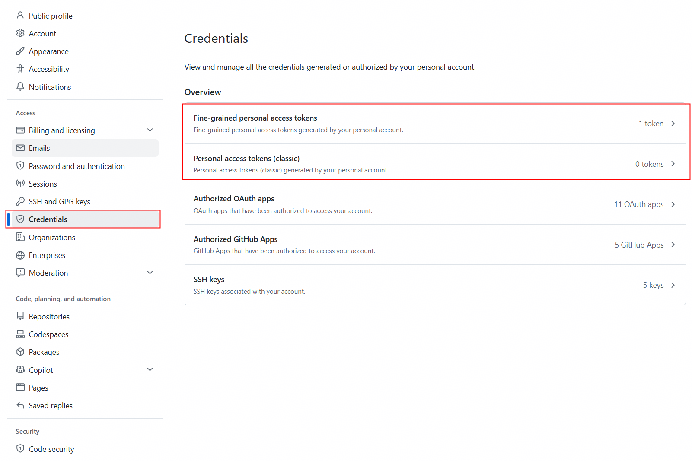

# huawei-auto-evolve 配置指南

本文件说明如何安装 auto-evolve 所依赖的 CLI 工具，以及如何获取 `.env` 中各凭据变量。

## 快速开始

```bash
# 1. 安装 CLI 工具（见下方"CLI 工具安装"）
# 2. 复制凭据模板
cp skills/huawei-auto-evolve/.env.example skills/huawei-auto-evolve/.env
# 3. 按下方说明填入真实凭据
# 4. 使用前加载凭据
set -a; source skills/huawei-auto-evolve/.env; set +a
```

---

## CLI 工具安装

auto-evolve 依赖以下 CLI 工具。均为华为内部 npm 包，需从 `product_npm` 制品库安装。

### 前置条件

- **Node.js ≥ v18**：`node -v` 验证。未安装参考 https://3ms.huawei.com/km/blogs/details/22148443
- **公司代理**：安装内网 npm 包需绕过代理（`NO_PROXY=cmc.centralrepo.rnd.huawei.com`），因公司代理做 TLS 拦截需 `--strict-ssl=false`

### welink-cli — WeLink 消息/会议/日历/邮件

```bash
NO_PROXY=cmc.centralrepo.rnd.huawei.com \
  npm install -g @welink/welink-cli \
  --@welink:registry=https://cmc.centralrepo.rnd.huawei.com/artifactory/api/npm/product_npm/ \
  --strict-ssl=false
```

验证：`welink-cli --version`
登录：`welink-cli auth login`（连接 WeLink PC 客户端，非交互刷新，token 有效期约 30 分钟）

### agentcenter — Skill 市场管理

```bash
NO_PROXY=cmc.centralrepo.rnd.huawei.com \
  npm install -g @aimarket/agentcenter \
  --@aimarket:registry=https://cmc.centralrepo.rnd.huawei.com/artifactory/api/npm/product_npm/ \
  --strict-ssl=false
```

验证：`agentcenter --version`

> 如果 `agentcenter --version` 报 `Cannot find module .../src/bin/index.js`（shim 存在但包丢失，常见于 node_modules 被清理后），重新执行上述安装命令即可修复。

### uvx (uv) — CodeHub MCP 服务器运行环境

CodeHub MCP 工具通过 `uvx` 启动一个本地 Python MCP 服务器。uv/uvx 不是华为内部工具，从官方安装：

- 官网：https://github.com/astral-sh/uv
- Windows：`winget install astral-sh.uv` 或从 [releases 页面](https://github.com/astral-sh/uv/releases) 下载
- 验证：`uvx --version`
- **PATH 注意**：Git Bash 的 `which` 可能找不到 uvx（常见于安装在非标准路径如 `D:/CodingAgentCLI/uv/uvx.exe`）。auto-evolve 会自动检测常见位置，也可通过 `CODEHUB_UVX_ARGS` 环境变量指定完整路径

### nga.cmd — AI 辅助研发 Token 统计（可选）

nga.cmd 是 CodeAgent CLI 套件的一部分，通常随 CodingAgentCLI 安装在 `D:/CodingAgentCLI/`。

验证：`/d/CodingAgentCLI/nga.cmd --help`
**PATH 注意**：Git Bash 的 `which` 不识别 `.cmd` 扩展名，auto-evolve 会用 `command -v nga.cmd || ls /d/CodingAgentCLI/nga.cmd` 检测。

---

## 凭据配置

`.env` 已被 gitignore，不会提交到仓库。以下说明每个变量的获取方式。

### CODEHUB_TOKEN — CodeHub 个人访问令牌

**用途**：CodeHub MCP 工具（`huawei-codehub`）访问华为内部 Git 仓库的 MR、检视意见、Issue 数据。

**获取方式**：

1. 登录 CodeHub（`https://codehub-g.huawei.com/`）
2. 点击右上角头像 → **设置**

   

3. 进入 **访问令牌**（Access Tokens）页面

   

4. 创建新令牌，勾选所需权限（`api` 或 `read_api` 最小权限）

   

5. 复制生成的令牌（格式如 `xxxxxxxxxxxxxxxx...`）

**填入 `.env`**：
```
CODEHUB_TOKEN=你的CodeHub令牌
CODEHUB_HOST=https://codehub-g.huawei.com/
```

**CODEHUB_HOST 说明**：
- `codehub-g.huawei.com`：大多数华为网络可直接访问（推荐）
- `codehub-y.huawei.com`：部分网络段不可达，如遇到超时请切换为 `-g`
- 验证可达性：`NO_PROXY=*.huawei.com curl -sS -o /dev/null -w "%{http_code}\n" https://codehub-g.huawei.com/`

**网络注意**：CodeHub 是华为内网主机，**必须绕过**公司代理。`codehub.py` wrapper 自动处理（`ProxyHandler({})`）。

### GITHUB_TOKEN — GitHub 个人访问令牌

**用途**：GitHub MCP 工具（`github`）访问 GitHub 托管仓库的 PR、review、issue、commit 数据。

**获取方式**：

1. 登录 GitHub（`https://github.com`）
2. 点击右上角头像 → **Settings** → **Developer settings** → **Personal access tokens**

   

3. 选择令牌类型：
   - **Fine-grained（推荐）**：权限更细，可限定仓库
     - Repository access → 选择 `Public Repositories` 或指定仓库
     - Permissions → Repository permissions：
       - Contents: Read（读取文件、提交）
       - Pull requests: Read（读取 PR、review）
       - Issues: Read（读取 issue）
       - Metadata: Read（必选）
     - 生成后令牌格式如 `github_pat_11AA...`
   - **Classic（更简单）**：勾选 `repo` scope 即可覆盖所有操作
     - 生成后令牌格式如 `ghp_xxxxx...`
4. 复制生成的令牌

**填入 `.env`**：
```
GITHUB_TOKEN=你的GitHub令牌
```

**网络注意**：GitHub 是外部主机，**必须通过**公司代理（`proxyuk.huawei.com:8080`），与 CodeHub 相反。`github_mcp.py` wrapper 自动处理（`ProxyHandler` + `ssl.CERT_NONE` 应对 TLS 拦截）。

### WIKI_X_AUTH_TOKEN — CloudDevOps Wiki 用户令牌（可选）

**用途**：Wiki MCP 工具（`huawei-wiki`）的用户级查询（如 `list-my-pending-wiki-countersigns`）和写操作。读操作（搜索、获取文档内容）**无需此令牌**。

**获取方式**：从 CloudDevOps 平台获取 X-Auth-Token（通常通过浏览器登录后的 Cookie 或平台设置页面）。

**填入 `.env`（可选）**：
```
WIKI_X_AUTH_TOKEN=你的Wiki令牌
```

> auto-evolve 只读取 Wiki 文档（搜索、获取内容），无需此令牌。仅当需要用户级查询或写操作时才配置。

---

## 安全须知

- `.env` 已被 `.gitignore` 忽略，**永远不会被提交**
- 不要在任何 skill、记忆 skill 或报告中写入真实 token 值
- 如果 token 泄露（如意外粘贴到聊天中），立即在对应平台撤销并重新生成
- 定期轮换 token（建议 90 天）
