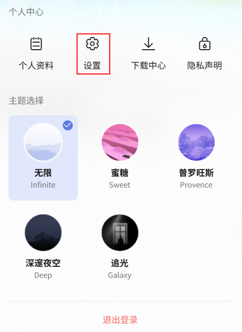
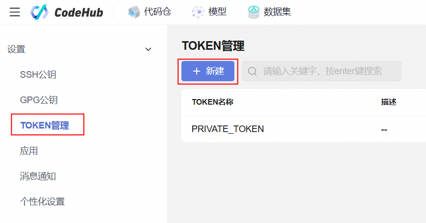
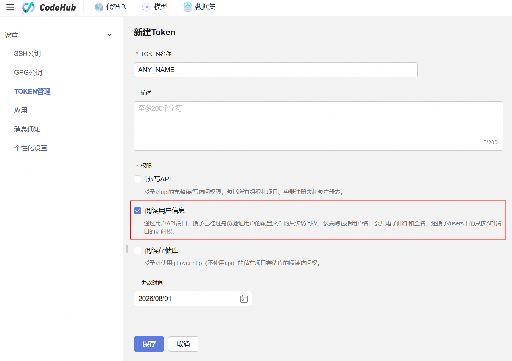

# huawei-auto-pal Setup / 配置指南

This guide helps a new user set up huawei-auto-pal. The core skill works with
**zero configuration** — optional tools enhance the analysis but are not required.
本指南帮助新用户配置 huawei-auto-pal。核心功能**零配置**即可使用，可选工具增强分析能力。

---

## What works out of the box / 开箱即用

Retro-scope (the diagnosis phase) runs on Python 3.9+ with no credentials, no
CLI tools, and no `.env` file. It automatically detects:

retro-scope（诊断阶段）仅需 Python 3.9+，无需凭据、CLI 工具或 `.env` 文件，自动检测：

| Source / 数据源 | What it captures / 捕获内容 | Requirement / 要求 |
|---|---|---|
| Claude Code | AI session prompts, tool calls, errors | Claude Code installed |
| Codeagent (new) | AI session JSONL records | Codeagent installed |
| Codeagent (legacy) | AI session SQLite records | nga.db exists |
| Git | Commits, checkouts | git on PATH |
| Chrome | Browser history, searches, downloads | Chrome installed |
| Edge | Browser history, searches, downloads | Edge installed |
| VS Code History | Per-file edit timestamps | VS Code used |
| Windows Recent | .lnk file shortcuts | Windows |
| Jump Lists | App+doc pairs | Windows |
| WeLink recordings | Meeting recording metadata | `WELINK_RECORDINGS_DIR` set |

To check which sources are available on your machine:
检查你的机器上有哪些数据源可用：

```bash
python retro-scope/scripts/run.py --check
```

`--check` reports four statuses: `READY` (detected and working), `NOT
AUTHENTICATED` (detected but needs auth/config — e.g. welink-cli token
expired or git `user.email` not set), `DETECTOR-ONLY` (tool detected but
no collection yet), and `NOT DETECTED` (source absent). For sources that
show `NOT AUTHENTICATED` or `NOT DETECTED`, you can auto-provision
welink-cli and git identity with a single command (requires Node.js ≥ 18
for welink-cli):

`--check` 报告四种状态：`READY`（已检测且可用）、`NOT AUTHENTICATED`（已检测但
需认证/配置——如 welink-cli token 过期或 git `user.email` 未设置）、
`DETECTOR-ONLY`（工具已检测但尚无数据收集）、`NOT DETECTED`（数据源不存在）。
对于显示 `NOT AUTHENTICATED` 或 `NOT DETECTED` 的数据源，可以用一条命令自动
配置 welink-cli 和 git 身份（welink-cli 需要 Node.js ≥ 18）：

```bash
python retro-scope/scripts/run.py --provision --git-email your_email@huawei.com
```

This installs welink-cli (from the approved Huawei intranet registry), runs
`welink-cli auth login` (scan QR code or approve in WeLink PC client), and
sets `git config --global user.email` / `user.name`. Use `--dry-run` to
preview, `--only welink` or `--only git` to scope, or `--git-name "Your
Name"` to pre-supply your git display name.

该命令会从华为内网 registry 安装 welink-cli，运行 `welink-cli auth login`
（扫码或在 WeLink PC 客户端确认），并设置 `git config --global user.email` /
`user.name`。使用 `--dry-run` 预览、`--only welink` 或 `--only git` 单独配置、
或 `--git-name "你的名字"` 预设 git 显示名。

---

## Deep browser analysis / 深度浏览分析

By default, retro-scope analyzes browser history using page titles and visit
counts. For deeper analysis, add `--enrich-pages` to fetch and analyze the
actual content of top-visited external web pages:

```bash
python retro-scope/scripts/run.py --enrich-pages
```

This produces richer narratives for browser-heavy sessions: what each page was
about (from content, not just title), how pages relate (shared US tickets, MR
numbers, project names), and why the user spent time cross-referencing them.
Huawei internal pages (CloudDevOps, CodeHub, W3, etc.) require SSO and are
skipped gracefully — only external pages are fetched. Fetched content is cached
in `output/page_cache/` and rate-limited (1s between fetches).

默认情况下，retro-scope 仅根据页面标题和访问次数分析浏览历史。添加
`--enrich-pages` 可抓取并分析高频访问的外部网页的实际内容，生成更深入的叙述：
每个页面的内容主题、页面之间的关联（共享需求号、MR 号、项目名）、以及用户为何
花时间交叉查阅。华为内网页面（CloudDevOps、CodeHub、W3 等）需要 SSO 登录，
会被自动跳过——仅抓取外部页面。抓取内容缓存在 `output/page_cache/`，
请求间隔 1 秒。

---

## Optional tools / 可选工具

These tools enhance the analysis but are **not required**. Install them only if
you want the additional data. The skill detects each tool and skips it with a
coverage note if missing — it never blocks the pipeline.

这些工具增强分析能力但**非必需**。仅在需要额外数据时安装。技能会自动检测每个工具，缺失时跳过并说明影响——不会阻塞流程。

### welink-cli — WeLink messages/meetings/calendar/mail

**Adds / 增加数据**: WeLink chat history, meeting records, calendar events, email.
**Prerequisite / 前置条件**: Node.js ≥ v18 (`node -v`), WeLink PC client installed.

**Easy way / 简易方式**: Run `python retro-scope/scripts/run.py --provision` —
it installs welink-cli and starts `auth login` automatically. You just scan
the QR code. See the `--provision` section above.

**简易方式**：运行 `python retro-scope/scripts/run.py --provision`——
自动安装 welink-cli 并启动 `auth login`，你只需扫码。见上方 `--provision` 说明。

**Manual way / 手动方式**:

```bash
NO_PROXY=cmc.centralrepo.rnd.huawei.com \
  npm install -g @welink/welink-cli \
  --strict-ssl=false \
  --ignore-scripts \
  --@welink:registry=https://cmc.centralrepo.rnd.huawei.com/artifactory/api/npm/product_npm/
```

> **`--ignore-scripts`**: The welink-cli npm package has a postinstall
> PowerShell script that crashes on some Windows machines (a type-cast bug
> in the installer). `--ignore-scripts` skips it — the `welink-cli` CLI
> itself works fine without it. This flag is automatically passed by
> `--provision`.

- Verify / 验证: `welink-cli --version`
- Login / 登录: `welink-cli auth login` (connects to WeLink PC client, non-interactive refresh, token valid ~30 min)

**Proxy note / 代理说明**: The intranet npm registry must bypass the corporate
proxy (`NO_PROXY=cmc.centralrepo.rnd.huawei.com`). Prefer the trusted corporate
CA; if TLS interception still blocks the approved Huawei intranet registry,
`--strict-ssl=false` is permitted for this single command only. Do not write it
to global config or use it for public registries.

内网 npm registry 必须绕过公司代理。优先配置可信 CA；若 TLS 拦截仍阻断华为内网
registry，可对单次安装使用 `--strict-ssl=false`，不要写入全局配置，也不要用于公网。

### agentcenter — Skill market management

**Adds / 增加数据**: Skill market search, version checking, skill installation.
**Prerequisite / 前置条件**: Node.js ≥ v18.

```bash
NO_PROXY=cmc.centralrepo.rnd.huawei.com \
  npm install -g @aimarket/agentcenter \
  --strict-ssl=false \
  --@aimarket:registry=https://cmc.centralrepo.rnd.huawei.com/artifactory/api/npm/product_npm/
```

- Verify / 验证: `agentcenter --version`
- If `agentcenter --version` reports `Cannot find module .../src/bin/index.js`
  (shim exists but package missing, common after node_modules cleanup), rerun
  the install command above.

### uvx (uv) — CodeHub MCP server runtime

**Adds / 增加数据**: CodeHub MR reviews, issues (via local MCP server).
**Prerequisite / 前置条件**: uv/uvx (not a Huawei internal tool).

- Install / 安装: `winget install astral-sh.uv` (Windows) or see
  [astral-sh/uv](https://github.com/astral-sh/uv/releases)
- Verify / 验证: `uvx --version`
- If `uvx` is not on PATH, see
  [`../../mcp-tools/huawei-codehub/README.md`](../../mcp-tools/huawei-codehub/README.md)
  to configure `CODEHUB_UVX_ARGS`.

### nga.cmd — AI dev token statistics (optional)

**Adds / 增加数据**: AI-assisted development token consumption stats.
**Prerequisite / 前置条件**: CodeAgent CLI suite installed.

Verify with `nga.cmd --help`. If not on PATH, follow your CodeAgent CLI install
docs — do not hardcode a drive path.

---

## Credential setup / 凭据配置

Some supplementary data sources (used by skill-forge) require credentials.
Copy the template and fill in your values:

skill-forge 的部分补充数据源需要凭据。复制模板并填入真实值：

```bash
# 1. Copy the template / 复制模板
cp env.example .env

# 2. Edit .env and fill in your real tokens / 编辑 .env 填入真实 token

# 3. Load credentials before running / 运行前加载凭据
set -a; source .env; set +a

# 4. Verify .env is gitignored and not tracked / 验证 .env 未被跟踪
git check-ignore .env    # should print: .env
git ls-files .env        # should print nothing
```

> **Important / 重要**: `.gitignore` prevents new files from being tracked, but
> it does **not** untrack a file that is already committed. Always verify with
> `git ls-files`. If a credentials file was accidentally committed, remove it
> with `git rm --cached .env` and commit the removal.
>
> `.gitignore` 只能阻止新文件被跟踪，**不能**取消已跟踪的文件。务必用
> `git ls-files` 验证。如果凭据文件已被意外提交，用 `git rm --cached .env` 移除。

### CODEHUB_TOKEN — CodeHub personal access token

**Used for / 用于**: Reading MR reviews and issues from Huawei internal Git repos.

**How to get it / 获取方式**:

1. Login to CodeHub (`https://codehub-g.huawei.com/`)
2. Click your avatar → **Settings / 设置**

   

3. Go to **Access Tokens / 访问令牌**

   

4. Create a new token with `api` or `read_api` scope (minimum)

   

5. Copy the generated token

**Add to `.env` / 填入 `.env`**:
```
CODEHUB_TOKEN=your_codehub_token_here
CODEHUB_HOST=https://codehub-g.huawei.com/
```

**CODEHUB_HOST**:
- `codehub-g.huawei.com`: reachable from most Huawei networks (recommended / 推荐)
- `codehub-y.huawei.com`: may be unreachable on some segments — switch to `-g` if timeouts occur
- Test reachability: `NO_PROXY=*.huawei.com curl -sS -o /dev/null -w "%{http_code}\n" https://codehub-g.huawei.com/`

**Network / 网络**: CodeHub is an intranet host — bypass the corporate proxy
(`NO_PROXY=*.huawei.com`). The wrapper is at
[`../../mcp-tools/huawei-codehub/codehub.py`](../../mcp-tools/huawei-codehub/codehub.py).

**Verify readiness / 验证可用性** (after uvx + token + host are set):
```bash
python3 mcp-tools/huawei-codehub/codehub.py --list-tools
```
This confirms the wrapper starts, the server launches via uvx, credentials
are accepted, and tools can be enumerated — without making a real API call.
If it fails, see
[`../../mcp-tools/huawei-codehub/README.md`](../../mcp-tools/huawei-codehub/README.md)
for the three execution paths (wrapper, Claude Code MCP, opencode MCP) and
troubleshooting.

验证（uvx + 令牌 + 地址配置完成后）：运行上面的 `--list-tools` 命令确认封装启动、
uvx 拉起服务、凭据被接受且工具可枚举。失败时请查阅 CodeHub MCP 文档。

### GITHUB_TOKEN — GitHub personal access token (currently disabled)

**Status / 状态**: ⚠️ **Disabled / 已禁用**

The current GitHub wrapper (`mcp-tools/github/github_mcp.py`) uses
`ssl.CERT_NONE`, which disables TLS verification. Until that is independently
fixed and validated against the corporate proxy, this skill does **not** call
the GitHub MCP tool and does **not** ask you to create or store a
`GITHUB_TOKEN`.

当前的 GitHub 封装使用了 `ssl.CERT_NONE`（禁用 TLS 验证）。在该问题被独立修复并通过
企业代理验证之前，本技能**不会**调用 GitHub MCP 工具，也**不会**要求你创建或保存
`GITHUB_TOKEN`。

No setup action is needed for GitHub. CodeHub covers internal repo review.
GitHub 暂无需任何配置。内部仓库的审查由 CodeHub 覆盖。

### WIKI_X_AUTH_TOKEN — CloudDevOps Wiki token (optional)

**Used for / 用于**: User-level Wiki queries and write operations. Read operations
(search, fetch content) need **no token**.

**How to get it / 获取方式**: Obtain X-Auth-Token from CloudDevOps platform (browser
cookie or settings page).

**Add to `.env` (optional / 可选)**:
```
WIKI_X_AUTH_TOKEN=your_wiki_token_here
```

> skill-forge only reads Wiki documents (search, fetch content) — no token needed
> unless you want user-level queries or write operations.
>
> skill-forge 只读取 Wiki 文档（搜索、获取内容），无需此 token。仅在需要用户级查询或写操作时配置。

---

## Security / 安全须知

- `.env` is gitignored — always verify with `git ls-files .env` that it's not tracked
- Never write real token values into skills, memories, prompts, or reports
- If a token is leaked (e.g. accidentally pasted in chat), revoke it immediately
  on the platform and generate a new one
- Rotate tokens regularly (recommended: 90 days)
- This skill never installs, authenticates, or modifies configuration without
  explicit user approval for each action

- `.env` 已被 gitignore — 务必用 `git ls-files .env` 确认未被跟踪
- 不要在任何 skill、记忆或报告中写入真实 token 值
- 如果 token 泄露，立即在平台撤销并重新生成
- 定期轮换 token（建议 90 天）
- 本技能不会在未经用户明确批准的情况下安装、登录或修改配置
