# Graph Engineering with Claude: 14-Step roadmap from 0 to graph architect (Full Course)

## Source Metadata

- Source URL: https://x.com/0xCodez/article/2079165300625330317
- Author: [Codez (@0xCodez)](https://x.com/0xCodez)
- Published: Jul 20, 2026 (as shown on page)
- Fetched at: 2026-07-23T07:39:07+00:00
- Extraction method: stdlib-html-parser on JS-rendered HTML fetched via the opencli browser bridge (authenticated session). The page is client-side rendered and login-gated, so the script's direct fetch returned only the app shell; rendered DOM was captured through a live Chrome session and re-extracted with `--html`.

## Page Content

Graph Engineering with Claude: 14-Step roadmap from 0 to graph architect (Full Course)

[Codez](https://x.com/0xCodez)

[@0xCodez](https://x.com/0xCodez)

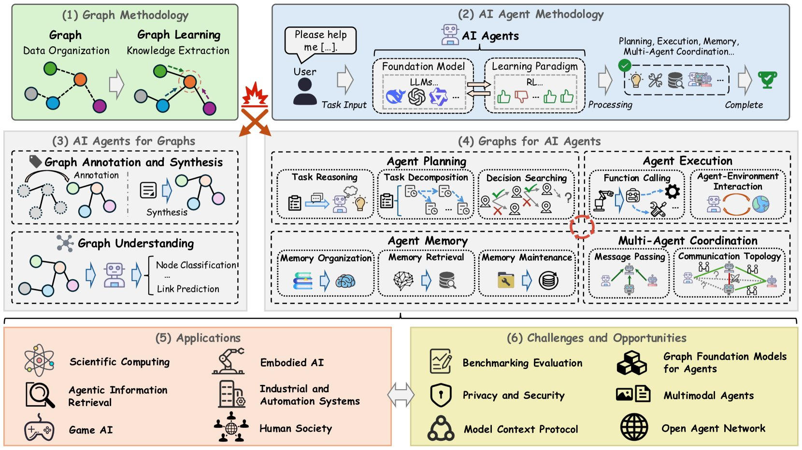

<!-- visual-asset
Asset: 20260723-0xcodez-x-article_assets/to-view-keyboard-shortcuts-press-questi-4ec16d1446ed.svg
Source: https://pbs.twimg.com/media/HNqdriNXYAAJlBB?format=jpg&name=large
Original page embedding: CSS background-image on a <div> (x.com renders section images this way, not via ); fetched at name=large.
Type: image/jpeg wrapped in svg
Extracted size: 1660x933; 316815 bytes
Alt text: Intro diagram: the shift from prompt to loop to harness to graph
Transcription status: Text-transcribed as Mermaid diagram below.
-->

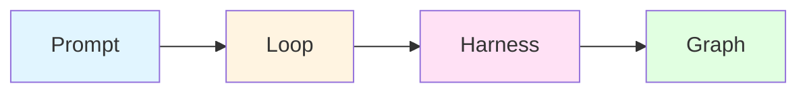
```mermaid
graph LR
    A[Prompt] --> B[Loop]
    B --> C[Harness]
    C --> D[Graph]
    style A fill:#e1f5ff
    style B fill:#fff4e1
    style C fill:#ffe1f5
    style D fill:#e1ffe1
```

**Concept**: The progression from simple to complex agent architectures. A **prompt** is a single instruction. A **loop** adds iteration. A **harness** provides the execution environment. A **graph** orchestrates multiple nodes with dependencies and parallelism.

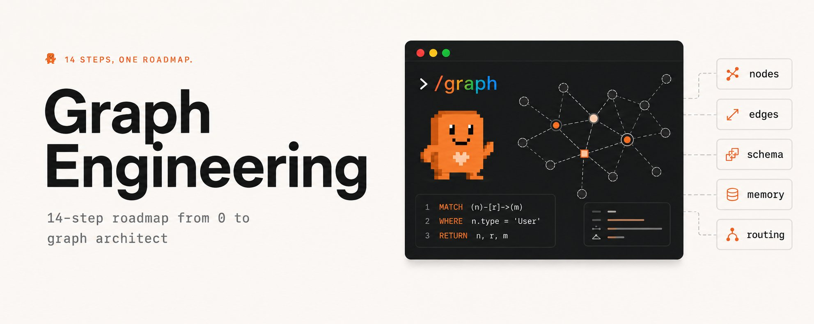

<!-- visual-asset
Asset: 20260723-0xcodez-x-article_assets/to-view-keyboard-shortcuts-press-questi-9a565023854c.svg
Source: https://pbs.twimg.com/media/HNqZMWeWYAAqsw-?format=jpg&name=large
Original page embedding: CSS background-image on a <div> (x.com renders section images this way, not via ); fetched at name=large.
Type: image/jpeg wrapped in svg
Extracted size: 1983x793; 112452 bytes
Alt text: Intro diagram: linear vs graph agent topology
Transcription status: Text-transcribed as Mermaid diagram below.
-->

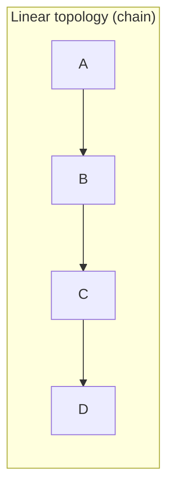
```mermaid
graph LR
    subgraph "Linear topology (chain)"
        A1[A] --> B1[B] --> C1[C] --> D1[D]
    end
```

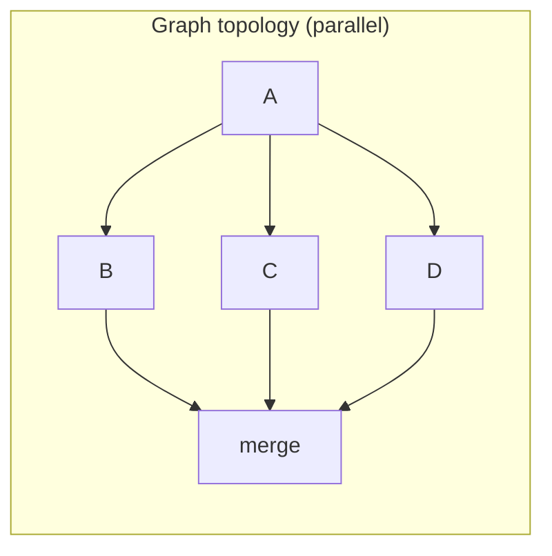
```mermaid
graph LR
    subgraph "Graph topology (parallel)"
        A2[A] --> B2[B]
        A2 --> C2[C]
        A2 --> D2[D]
        B2 --> E[merge]
        C2 --> E
        D2 --> E
    end
```

**Concept**: Linear topology chains steps sequentially — every step waits for the previous. Graph topology fans out independent work in parallel and merges results — faster, more resilient, and scalable.

Most people who try to build a multi-step agent end up with a straight line. Step one, step two,
step three - each waiting politely for the last to finish before it starts.

9/10 notice that half those steps never needed to wait at all.

They don’t route. They don’t branch. They don’t parallelize. They just queue - one head, one
context, one thing at a time, until the window fills up and the agent forgets what it was doing.

Follow my Substack to get fresh AI alpha:

[movez.substack.com](https://movez.substack.com/)

This is the 14-step roadmap that turns that single-file line into a graph: one that fans out across
a fleet, verifies its own findings, and converges on a result a lone agent could never hold.

Here’s the shift nobody spells out. A prompt is a sentence. A loop is a cycle. A harness is the
floor the agent stands on.

But the shape of the work itself - what runs before what, what can run at the same time, what has to
wait for everything else - that shape is a graph. Nodes do the thinking. Edges carry the results.

Claude Code shipped the tooling to build these graphs directly: dynamic workflows.

Claude writes a plain JavaScript orchestration script, then spawns a coordinated fleet of subagents
to execute it - and the coordination itself costs zero model tokens, because it’s code, not a
conversation.

### 01. Nodes are jobs. Edges are what flows.
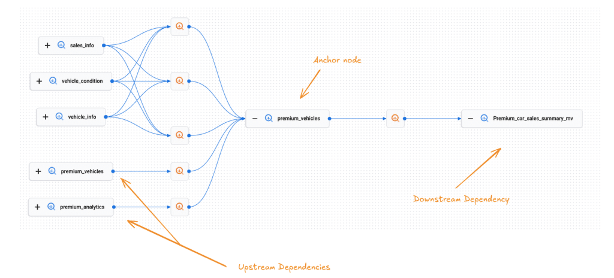

<!-- visual-asset
Asset: 20260723-0xcodez-x-article_assets/01-nodes-are-jobs-edges-are-what-flows-becab192aa8c.svg
Source: https://pbs.twimg.com/media/HNqlJ68XUAAe-PB?format=png&name=large
Original page embedding: CSS background-image on a <div> (x.com renders section images this way, not via ); fetched at name=large.
Type: image/png wrapped in svg
Extracted size: 1024x464; 66093 bytes
Alt text: 01. Nodes are jobs. Edges are what flows.
Transcription status: Text-transcribed as Mermaid diagram below.
-->

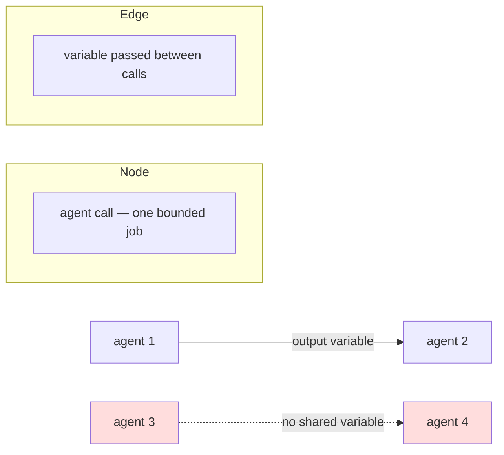
```mermaid
graph LR
    subgraph Node
        N[agent call — one bounded job]
    end
    subgraph Edge
        E[variable passed between calls]
    end
    A[agent 1] -- "output variable" --> B[agent 2]
    C[agent 3] -. "no shared variable" .-> D[agent 4]
    style C fill:#fdd
    style D fill:#fdd
```

**Concept**: A node is a unit of work (one agent, one input, one output). An edge is a data dependency — a variable passed from one call's return into another's prompt. If no variable crosses between two steps, there is no edge — they are independent and can run in parallel.

A graph has exactly two things, and getting them straight fixes most of the confusion. A node is a
unit of work - one agent, one bounded job, one input in and one output out.

An edge is a dependency: it says this node’s output feeds that node’s input. Nothing more.

The mistake is treating “and then” as an edge. “Summarize the file and then tell me the weather” has
no edge between the two - the weather doesn’t consume the summary.

That’s two disconnected nodes that a linear script needlessly chains. The edge only exists when data
actually moves across it.

Learn to ask, for every “and then” in your agent: does the next step read the last step’s output? If
not, there is no edge, and the wait is wasted.

python

```
Draw it as boxes and arrows. A box is an agent() call.
An arrow is a variable passed from one call’s return into another’s
prompt. If you can’t draw the arrow - if no variable crosses - the two
boxes are independent, and independence is the thing you’ll exploit
for the rest of this course.
```

### 02. Your linear script is a degenerate graph
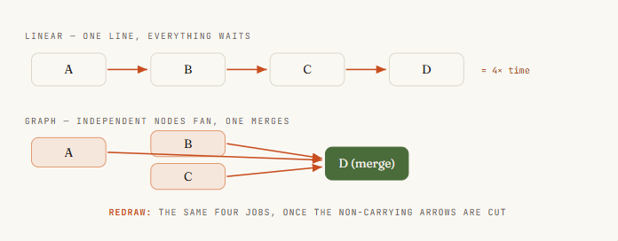

<!-- visual-asset
Asset: 20260723-0xcodez-x-article_assets/02-your-linear-script-is-a-degenerate-g-e7d0473b3aba.svg
Source: https://pbs.twimg.com/media/HNql8XpXcAA5-2h?format=png&name=large
Original page embedding: CSS background-image on a <div> (x.com renders section images this way, not via ); fetched at name=large.
Type: image/png wrapped in svg
Extracted size: 696x272; 20849 bytes
Alt text: 02. Your linear script is a degenerate graph
Transcription status: Text-transcribed as Mermaid diagram below.
-->

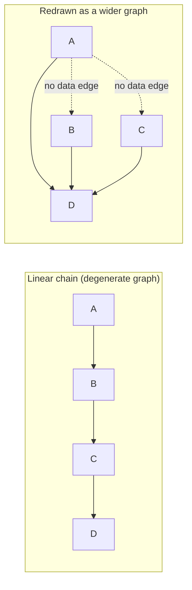
```mermaid
graph LR
    subgraph "Linear chain (degenerate graph)"
        A --> B --> C --> D
    end
    subgraph "Redrawn as a wider graph"
        A2[A] --> D2[D]
        B2[B] --> D2
        C2[C] --> D2
        A2 -. "no data edge" .-> B2
        A2 -. "no data edge" .-> C2
    end
```

**Concept**: A linear chain A→B→C→D is a graph where every node has exactly one edge in and one edge out. Cut the arrows that don't carry data and the chain collapses into something wider — independent nodes running in parallel, feeding a single node that needs them all.

When you write an agent as “do A, then B, then C, then D,” you’ve drawn a graph - a single
unbranching chain. Every node has exactly one edge in and one edge out.

It runs correctly. It also runs slowly and fragile, because a chain has no redundancy: if C stalls,
D never happens, and A’s work is trapped upstream with nowhere to go.

The first real skill of graph engineering is redrawing the chain. Take your linear agent and, for
each arrow, ask the Step 1 question.

Most chains have two or three arrows that don’t carry data - they’re just the order you happened to
type things in.

Cut those arrows and the chain collapses into something wider: a few independent nodes that could
all run at once, feeding a single node that needs them all.

### 03. Give every node a contract
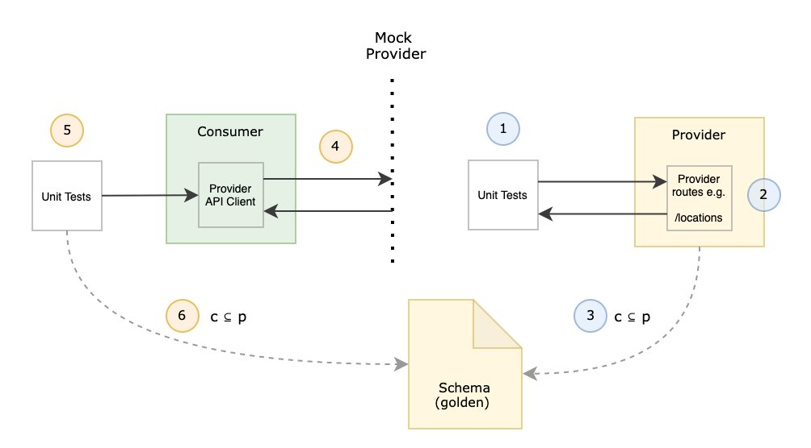

<!-- visual-asset
Asset: 20260723-0xcodez-x-article_assets/03-give-every-node-a-contract-5192f4dcd803.svg
Source: https://pbs.twimg.com/media/HNqmfUhXIAA_Y70?format=jpg&name=large
Original page embedding: CSS background-image on a <div> (x.com renders section images this way, not via ); fetched at name=large.
Type: image/jpeg wrapped in svg
Extracted size: 1004x556; 29211 bytes
Alt text: 03. Give every node a contract
Transcription status: Text-transcribed as Mermaid diagram below.
-->

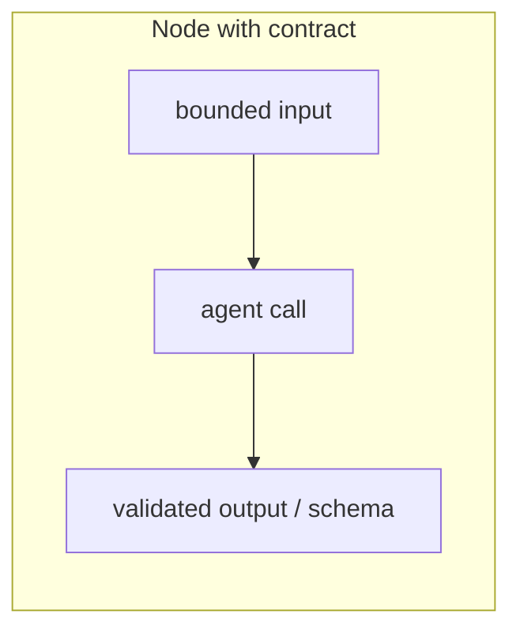
```mermaid
graph LR
    subgraph "Node with contract"
        Input[bounded input] --> Node[agent call] --> Output[validated output / schema]
    end
```

**Concept**: Every node needs a contract: bounded input (explicit, never assumed from shared state), bounded output (defined shape, ideally validated with a JSON schema), and exactly one job. The schema forces the subagent to return validated structured data — the difference between a node that can be wired into a graph and one that only works when a human reads its output.

A node you can’t reason about is a node you can’t parallelize. The fix is a contract: bounded input,
bounded output, exactly one job.

The input is whatever the node reads - passed in explicitly, never assumed from a shared window. The
output is a defined shape, ideally validated, so the next node can consume it without guessing.

In a workflow this contract is enforced with a schema. When you hand Claude an agent() call with a
JSON schema, the subagent Claude spawns is forced to return validated structured data - validation
happens at the tool-call layer, so Claude retries on mismatch instead of handing you free text you
have to parse and pray over.

This is the difference between a node Claude can wire into a graph and a node that only works when a
human reads its output.

```
// A node with a real contract: bounded in, validated out, one job.
const ITEM = {
  type: 'object', additionalProperties: false,
  properties: {
    title:   { type: 'string' },
    url:     { type: 'string' },
    impact:  { type: 'string', enum: ['high', 'medium', 'low'] },
  },
  required: ['title', 'url', 'impact'],
};

const result = await agent(source.prompt, {
  label:  `research:${source.key}`,
  schema: ITEM,           // forces validated structured output
  agentType: 'general-purpose',
});
// result is now a shape the next node can trust — not free text.
```

### 04. Treat the edge as a data contract
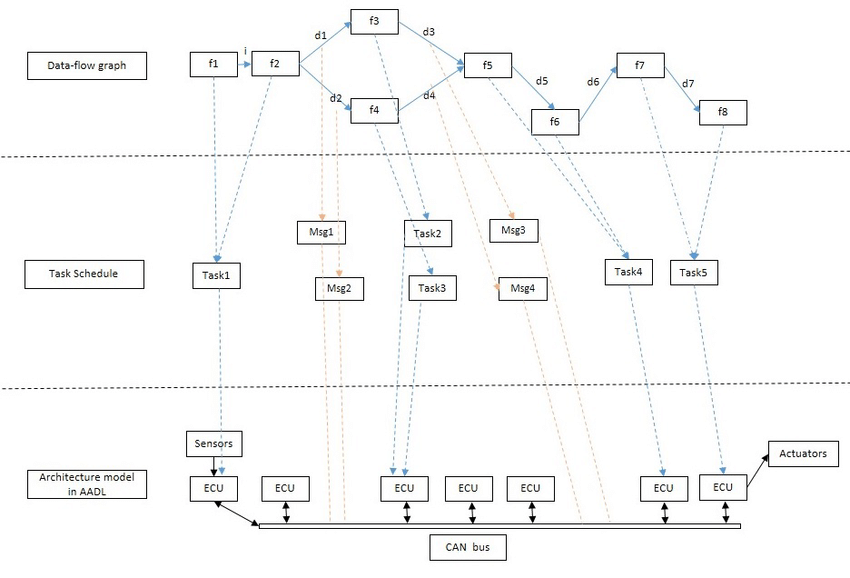

<!-- visual-asset
Asset: 20260723-0xcodez-x-article_assets/04-treat-the-edge-as-a-data-contract-8bf9de51f8ce.svg
Source: https://pbs.twimg.com/media/HNqnSStWIAAPvab?format=png&name=large
Original page embedding: CSS background-image on a <div> (x.com renders section images this way, not via ); fetched at name=large.
Type: image/png wrapped in svg
Extracted size: 850x578; 107070 bytes
Alt text: 04. Treat the edge as a data contract
Transcription status: Text-transcribed as Mermaid diagram below.
-->

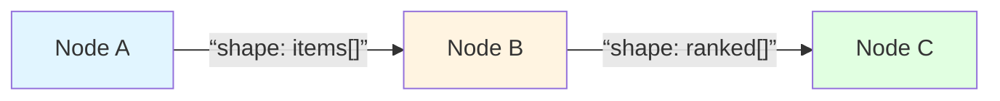
```mermaid
graph LR
    A[Node A] -- “shape: items[]” --> B[Node B]
    B -- “shape: ranked[]” --> C[Node C]
    style A fill:#e1f5ff
    style B fill:#fff4e1
    style C fill:#e1ffe1
```

**Concept**: An edge is a promise about what data shape crosses: A produces this shape, B consumes this shape. Name the edge by its data, not its order. When combining results is just flatten-and-dedupe, that’s `results.flatMap(...)` and a `Set` — deterministic, instant, zero tokens. Save agents for judgment, not plumbing.

An edge isn’t just “B comes after A.” It’s a promise about what crosses: A produces this shape, and
B is built to consume this shape. When you name the edge by its data - not its order - two things
get easier.

You can see instantly whether the edge is real (does data actually move?), and you can swap the node
on either end without breaking the graph, as long as the shape holds.

In practice, the edge lives in plain JavaScript. The reduce step between fan-out and synthesis -
flatten, dedupe, filter - is just code operating on the shapes your nodes returned.

No agent needed. One of the quiet wins of graph thinking: a huge amount of what people burn model
tokens on is really an edge, and edges are free.

```
The temptation is to spawn an agent to “combine the results.” Resist
it. If combining means flatten-and-dedupe, that’s results.flatMap(...)
and a Set — deterministic, instant, zero tokens. Save agents for
judgment, not for plumbing. A graph where every edge is an agent is a
graph paying rent on its own wiring.
```

### 05. Fan out with parallel()
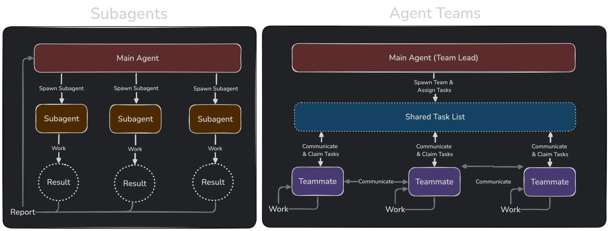

<!-- visual-asset
Asset: 20260723-0xcodez-x-article_assets/05-fan-out-with-parallel-32d19921aeee.svg
Source: https://pbs.twimg.com/media/HNqn3q8XoAAXCdJ?format=jpg&name=large
Original page embedding: CSS background-image on a <div> (x.com renders section images this way, not via ); fetched at name=large.
Type: image/jpeg wrapped in svg
Extracted size: 2048x779; 114588 bytes
Alt text: 05. Fan out with parallel()
Transcription status: Text-transcribed as Mermaid diagram below.
-->

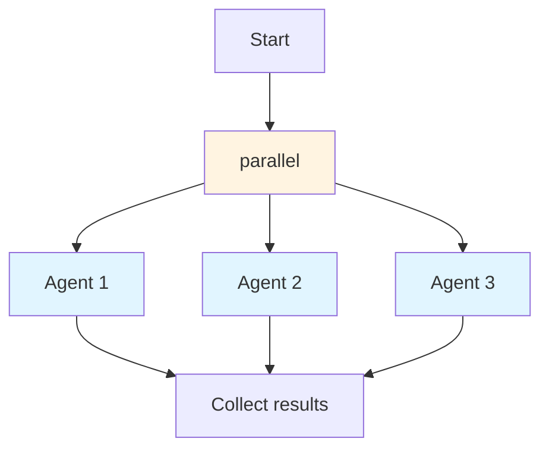
```mermaid
graph TD
    Start[Start] --> FanOut[parallel]
    FanOut --> A[Agent 1]
    FanOut --> B[Agent 2]
    FanOut --> C[Agent 3]
    A --> Merge[Collect results]
    B --> Merge
    C --> Merge
    style FanOut fill:#fff4e1
    style A fill:#e1f5ff
    style B fill:#e1f5ff
    style C fill:#e1f5ff
```

**Concept**: When you have N independent nodes, don't chain them—fan them out with `parallel()`. Claude spawns one subagent per thunk, all executing concurrently. The barrier waits for every thunk before returning. A thunk that throws resolves to `null`, so one failure doesn't sink the run. Always `.filter(Boolean)` the results.

This is the move that pays for everything. When you have N independent nodes - N sources to check, N
files to review, N routes to audit - you don’t chain them.

You tell Claude to fan them out and run them at once. In a workflow that’s parallel(): Claude takes
an array of thunks and spawns one subagent per thunk, all executing concurrently, then hands you
back the array of results.

Two details make it robust. First, parallel() is a barrier - it waits for every thunk before it
returns, so the next stage sees the complete set. Second, a thunk that throws resolves to null
instead of rejecting the whole batch, so one flaky agent can’t sink the run.

Always .filter(Boolean) the results. Concurrency is capped around your core count and the excess
queues, so you can pass a hundred thunks and they’ll all finish - just a handful at a time.

```
phase('Research');

// Nine sources, nine agents, all at once.
const raw = await parallel(
  SOURCES.map((s) => () =>
    agent(s.prompt, {
      label: `research:${s.key}`,
      phase: 'Research',
      schema: ITEM_SCHEMA,     // each node returns validated JSON
      agentType: 'general-purpose',
    }),
  ),
);

const collected = raw.filter(Boolean);  // drop the nulls from failed agents
```

The fan-out lives in code Claude wrote, not in a model conversation. Claude’s own context never
holds nine sources at once - each subagent carries its own, and only the final answer comes back.

That’s what lets Claude scale a workflow to dozens or hundreds of subagents without drowning the
session. The orchestration layer costs zero tokens because it isn’t another turn of Claude thinking.

### 06. Fan in at a barrier
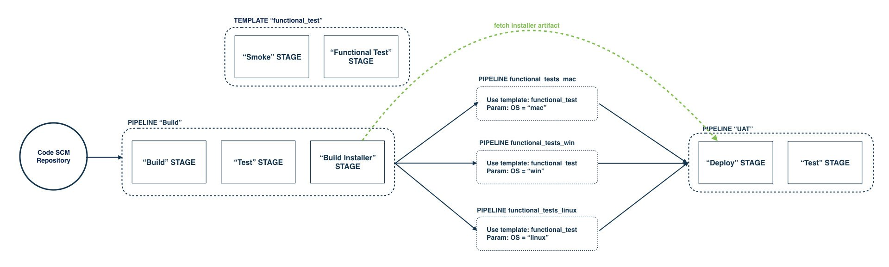

<!-- visual-asset
Asset: 20260723-0xcodez-x-article_assets/06-fan-in-at-a-barrier-c8dc59b61989.svg
Source: https://pbs.twimg.com/media/HNqoqYPWcAEYbIc?format=jpg&name=large
Original page embedding: CSS background-image on a <div> (x.com renders section images this way, not via ); fetched at name=large.
Type: image/jpeg wrapped in svg
Extracted size: 1920x578; 84573 bytes
Alt text: 06. Fan in at a barrier
Transcription status: Text-transcribed as Mermaid diagram below.
-->

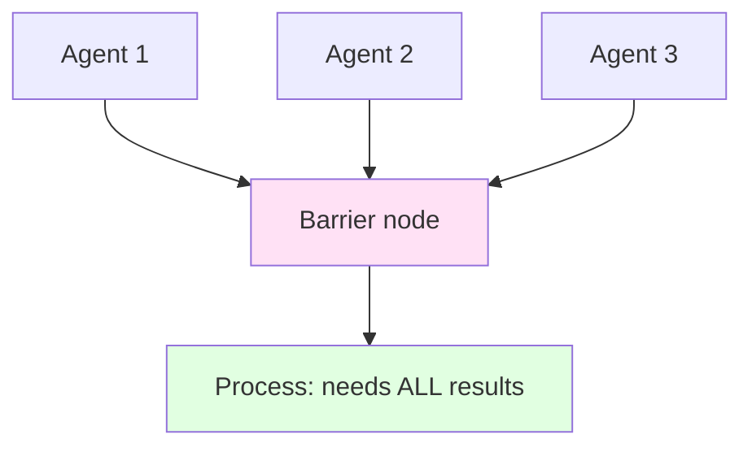
```mermaid
graph TD
    A[Agent 1] --> Barrier[Barrier node]
    B[Agent 2] --> Barrier
    C[Agent 3] --> Barrier
    Barrier --> Process[Process: needs ALL results]
    style Barrier fill:#ffe1f5
    style Process fill:#e1ffe1
```

**Concept**: A fan-in barrier is where edges converge—one node sees all upstream results at once and does something requiring the whole set: dedupe across sources, rank by impact, early-exit if empty. Use a barrier only when a stage genuinely needs every prior result together. If you're just flattening a list, that's an edge—do it inline.

A fan-out is only useful if something gathers it. The fan-in is the node where edges converge -
where one agent (or one piece of code) sees all the upstream results at once and does something that
requires the whole set: dedupe across sources, rank by impact, early-exit if the total came back
empty. This is the one place a barrier earns its wall-clock cost.

The rule that keeps graphs fast: use a barrier only when a stage genuinely needs every prior result
together. Deduping across all sources? Barrier - correct.

```
// The edge: plain JS, no agent, zero tokens.
const flat = collected.flatMap((c) => c.items);
log(`Collected ${flat.length} items`);

phase('Curate');
// The barrier node: needs the WHOLE set to dedupe + rank.
const curated = await agent(
  `Dedupe and rank these by impact:\n${JSON.stringify(flat)}`,
  { phase: 'Curate', schema: CURATED_SCHEMA },
);
```

Just flattening a list? That’s an edge, do it inline. The smell test is brutal and simple: if you
wrote parallel → transform → parallel, and that middle transform has no cross-item dependency, you
should have used a pipeline and skipped the barrier entirely.

### 07. The diamond: split → work → merge
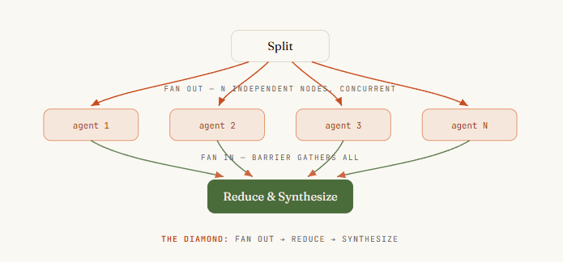

<!-- visual-asset
Asset: 20260723-0xcodez-x-article_assets/07-the-diamond-split-work-merge-e48e8afd7fd3.svg
Source: https://pbs.twimg.com/media/HNqpB0FWgAAM74x?format=png&name=large
Original page embedding: CSS background-image on a <div> (x.com renders section images this way, not via ); fetched at name=large.
Type: image/png wrapped in svg
Extracted size: 695x324; 22827 bytes
Alt text: 07. The diamond: split → work → merge
Transcription status: Text-transcribed as Mermaid diagram below.
-->

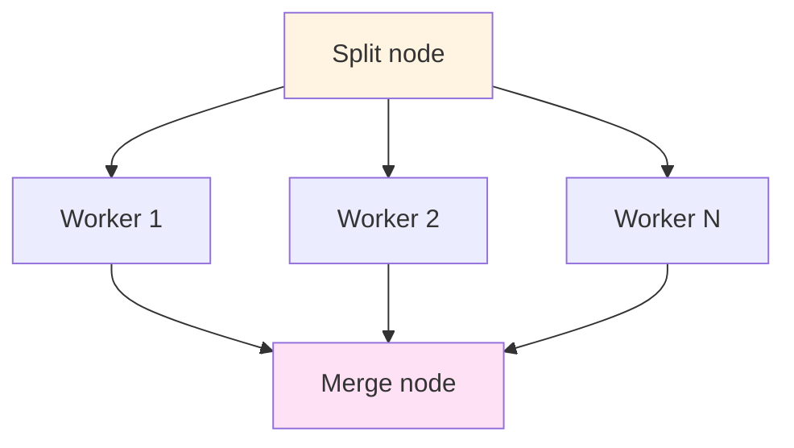
```mermaid
graph TD
    Split[Split node] --> W1[Worker 1]
    Split --> W2[Worker 2]
    Split --> W3[Worker N]
    W1 --> Merge[Merge node]
    W2 --> Merge
    W3 --> Merge
    style Split fill:#fff4e1
    style Merge fill:#ffe1f5
```

**Concept**: The diamond topology: one node splits the job, many nodes do work in parallel, one node merges. Canonical form: fan out → reduce → synthesize. Fan out to gather breadth, reduce with plain code to compress it, synthesize with a final agent to write the answer.

Put fan-out and fan-in together and you get the workhorse topology of every serious agent graph: the
diamond.

One node splits the job, many nodes do the work in parallel, one node merges. It’s the shape behind
a market scan, a dependency audit, a code review, a research report - swap the sources and prompts
and the same skeleton adapts.

The canonical form has a name worth memorizing: fan out → reduce → synthesize. Fan out to gather
breadth, reduce with plain code to compress it, synthesize with a final agent to write the answer.

Once you see the diamond, you stop asking “how do I make my agent do more steps” and start asking
“where’s the split, where’s the merge” - which is the question that actually scales.

### 08. Route the edge at runtime with a conditional
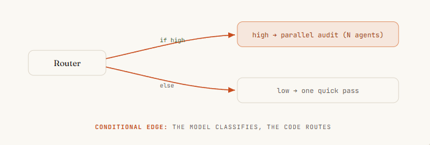

<!-- visual-asset
Asset: 20260723-0xcodez-x-article_assets/08-route-the-edge-at-runtime-with-a-con-dc8795ff85a6.svg
Source: https://pbs.twimg.com/media/HNqpYomX0AAPw7z?format=png&name=large
Original page embedding: CSS background-image on a <div> (x.com renders section images this way, not via ); fetched at name=large.
Type: image/png wrapped in svg
Extracted size: 701x237; 14285 bytes
Alt text: 08. Route the edge at runtime with a conditional
Transcription status: Text-transcribed as Mermaid diagram below.
-->

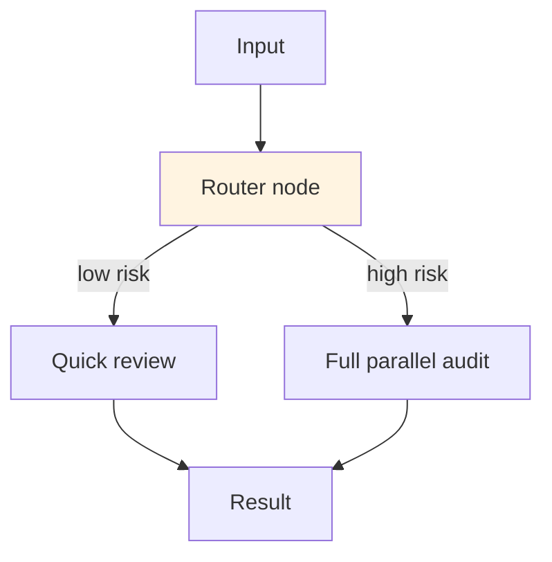
```mermaid
graph TD
    Input[Input] --> Router[Router node]
    Router -->|low risk| Quick[Quick review]
    Router -->|high risk| Full[Full parallel audit]
    Quick --> Output[Result]
    Full --> Output
    style Router fill:#fff4e1
```

**Concept**: Not every graph is fixed. A router node inspects a result and decides which downstream path fires—classify the ticket, then branch to the right handler; check the diff size, then either do a quick review or spin up a full audit. In a workflow this is just a JavaScript `if` or `switch` on a node's validated output. You get Claude's judgment at the node and the script's reliability at the edge.

Not every graph is fixed. Sometimes the edge to take depends on what a node found. A router node
inspects a result and decides which downstream path fires - classify the ticket, then branch to the
right handler; check the diff size, then either do a quick review or spin up a full audit.

In a workflow this is just a JavaScript if or switch on a node’s validated output, because control
flow lives in code.

This is where determinism becomes a feature, not a limitation. The router’s decision can be
Claude-powered (a subagent classifies), but the routing is code Claude wrote - so it runs the same
way every time for the same classification.

You get Claude’s judgment at the node and the script’s reliability at the edge. No emergent “Claude
decided to skip the audit” surprises - because the skip would have to be written into the graph, and
it isn’t.

```
// Router node: an agent classifies, code picks the edge.
const { severity } = await agent(
  `Classify this diff's risk:\n${diff}`,
  { schema: { type: 'object',
      properties: { severity: { enum: ['low', 'high'] } },
      required: ['severity'] } },
);

let review;
if (severity === 'high') {
  // heavy path: full parallel audit
  review = await parallel(FILES.map((f) => () => agent(`Audit ${f}`)));
} else {
  // light path: one quick pass
  review = await agent(`Quick review of ${diff}`);
}
```

### 09. Put a verifier on the edge
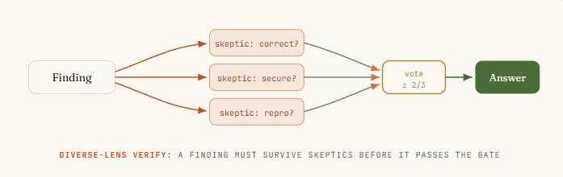

<!-- visual-asset
Asset: 20260723-0xcodez-x-article_assets/09-put-a-verifier-on-the-edge-c2112ad54a88.svg
Source: https://pbs.twimg.com/media/HNqp1zkW8AA4fhg?format=png&name=large
Original page embedding: CSS background-image on a <div> (x.com renders section images this way, not via ); fetched at name=large.
Type: image/png wrapped in svg
Extracted size: 697x220; 19114 bytes
Alt text: 09. Put a verifier on the edge
Transcription status: Text-transcribed as Mermaid diagram below.
-->

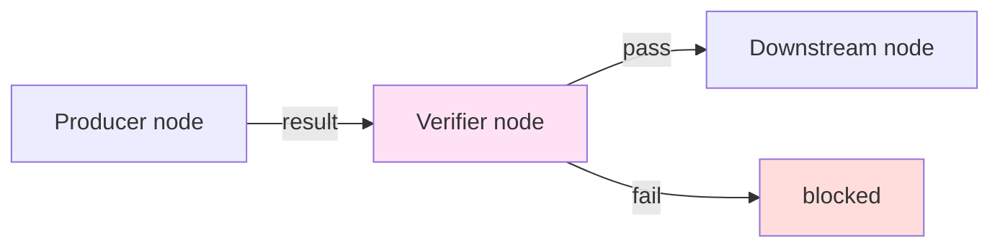
```mermaid
graph LR
    Producer[Producer node] -->|result| Verifier[Verifier node]
    Verifier -->|pass| Downstream[Downstream node]
    Verifier -->|fail| Blocked[blocked]
    style Verifier fill:#ffe1f5
    style Blocked fill:#fdd
```

**Concept**: A verifier node sits on the edge before a result is allowed downstream. Its only job is to try to kill the finding. Three patterns: (1) adversarial verify — spawn N skeptics per finding, keep only if majority survive; (2) perspective-diverse verify — each verifier uses a distinct lens (correctness, security, reproducibility); (3) judge panel — generate N attempts, score with parallel judges, synthesize from the winner.

The real leverage of a graph isn’t more agents - it’s the structure you can wrap around them to
produce confidence.

A verifier node sits on the edge before a result is allowed downstream, and its only job is to try
to kill the finding. If it survives, it passes. If not, it never reaches the answer.

Three patterns are worth having in your hands.

- Adversarial verify: for each finding, spawn N independent skeptics prompted to refute it; keep it only if a majority survive.
- Perspective-diverse verify: give each verifier a distinct lens - correctness, security, does-it-reproduce - because diversity catches failure modes that N identical checks never will.
- Judge panel: generate N attempts from different angles, score them with parallel judges, synthesize from the winner while grafting the best of the runners-up.
This is exactly the pattern that let a real team port the Bun runtime with adversarial code review
baked into the loop.

### 10. Isolate nodes so one failure can’t poison the graph
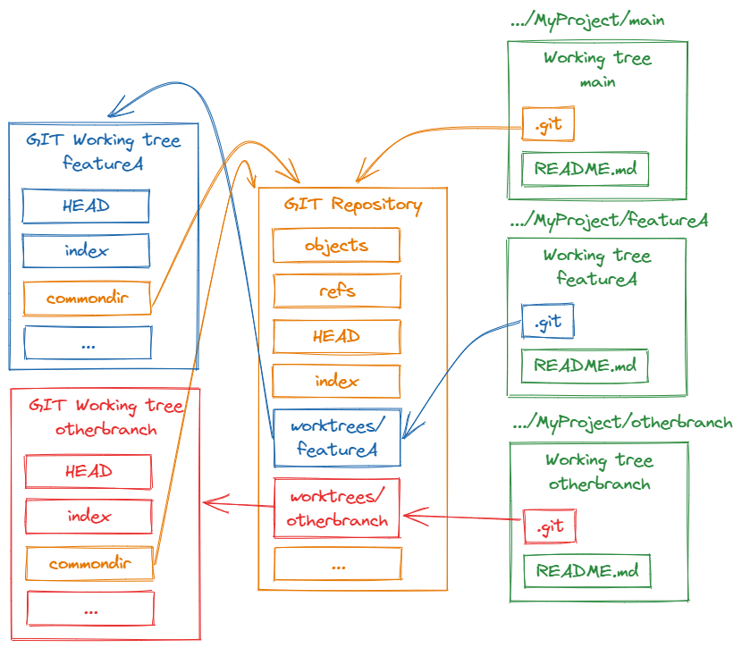

<!-- visual-asset
Asset: 20260723-0xcodez-x-article_assets/10-isolate-nodes-so-one-failure-can-t-p-8ebac5456219.svg
Source: https://pbs.twimg.com/media/HNqqdlGXcAAYFV3?format=png&name=large
Original page embedding: CSS background-image on a <div> (x.com renders section images this way, not via ); fetched at name=large.
Type: image/png wrapped in svg
Extracted size: 830x725; 276126 bytes
Alt text: 10. Isolate nodes so one failure can’t poison the graph
Transcription status: Text-transcribed as Mermaid diagram below.
-->

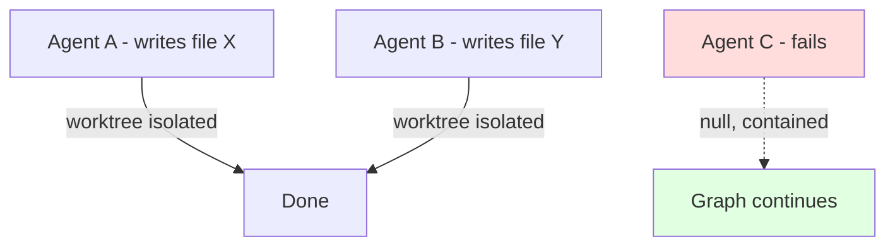
```mermaid
graph TD
    A[Agent A - writes file X] -->|worktree isolated| Done[Done]
    B[Agent B - writes file Y] -->|worktree isolated| Done
    C[Agent C - fails] -. "null, contained" .-> X[Graph continues]
    style C fill:#fdd
    style X fill:#e1ffe1
```

**Concept**: In a chain, failure cascades. In a graph, failure should be contained to its node. `parallel()` already resolves thrown thunks to `null` — `.filter(Boolean)` is the containment. Design every fan-in to tolerate missing inputs. When agents write files in parallel, use worktree isolation so they can't collide.

In a chain, a failure cascades - C dies, D never runs, the whole thing halts. In a graph, failure
should be contained to its node.

That’s already partly true: a thunk that throws inside parallel() resolves to null, so eight good
agents still return while one bad one drops out. Your .filter(Boolean) is the containment. Design
every fan-in to tolerate missing inputs rather than assume a full set.

The subtler failure is nodes stepping on each other. When agents write files in parallel, they can
collide. The fix is isolation: "worktree" - each agent runs in its own git worktree, does its work
in a sandbox, and merges cleanly. Reach for it only when nodes actually write in parallel. it’s the
seatbelt for the one topology that needs it, not a default tax on every run.

### 11. Add a cycle - but make it converge
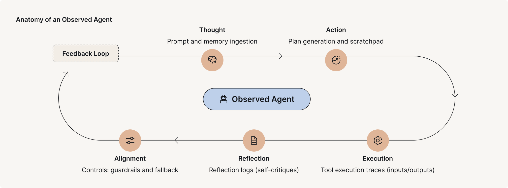

<!-- visual-asset
Asset: 20260723-0xcodez-x-article_assets/11-add-a-cycle-but-make-it-converge-a7c79a9d7b73.svg
Source: https://pbs.twimg.com/media/HNqrFflXAAEGQxk?format=png&name=large
Original page embedding: CSS background-image on a <div> (x.com renders section images this way, not via ); fetched at name=large.
Type: image/png wrapped in svg
Extracted size: 2048x760; 56709 bytes
Alt text: 11. Add a cycle - but make it converge
Transcription status: Text-transcribed as Mermaid diagram below.
-->

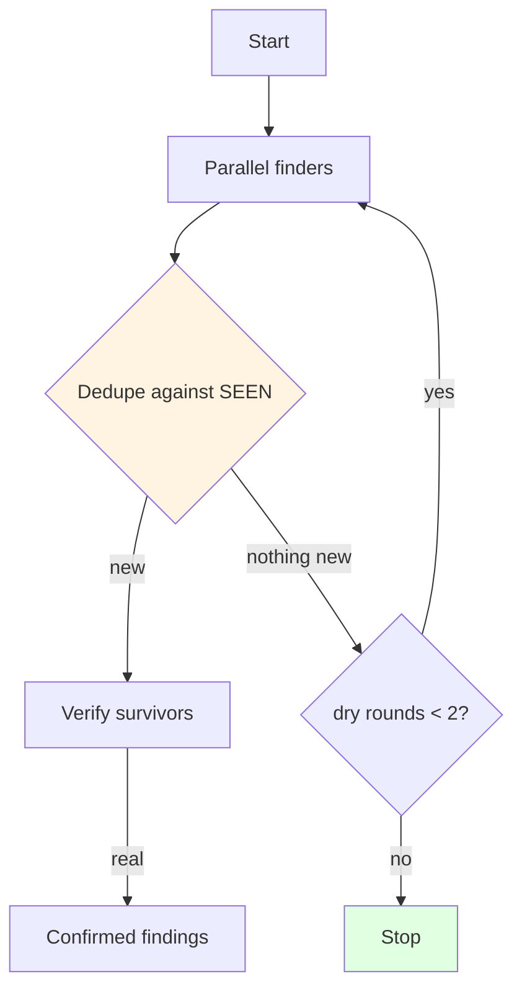
```mermaid
graph TD
    Start[Start] --> Finders[Parallel finders]
    Finders --> Dedupe{Dedupe against SEEN}
    Dedupe -->|new| Verify[Verify survivors]
    Dedupe -->|nothing new| DryCount{dry rounds < 2?}
    DryCount -->|yes| Finders
    DryCount -->|no| Stop[Stop]
    Verify -->|real| Confirmed[Confirmed findings]
    style Dedupe fill:#fff4e1
    style Stop fill:#e1ffe1
```

**Concept**: A cycle that doesn’t converge is an infinite loop that burns budget. The pattern that converges is loop-until-dry: keep spawning finders until K consecutive rounds surface nothing new. Critical detail: dedupe against everything **seen**, not just confirmed results — otherwise rejected findings reappear every round and the loop never runs dry.

Sometimes you don’t know how big the job is until you’re in it: unknown-size discovery, a bug sweep
where finding one bug reveals three more. That needs a cycle - a controlled edge back to an earlier
node.

The danger is obvious: a cycle that doesn’t converge is an infinite loop that spawns agents until
your budget is gone.

The pattern that converges is loop-until-dry: keep spawning finders until K consecutive rounds
surface nothing new, then stop. The one detail that makes or breaks it - and the mistake almost
everyone makes the first time - is what you dedupe against.

Dedupe against everything seen, not just against confirmed results. Otherwise rejected findings
reappear every round, the loop never runs dry, and you’ve built a machine that pays to rediscover
the same dead ends forever.

```
const seen = new Set(); const confirmed = []; let dry = 0;

while (dry < 2) {                       // stop after 2 empty rounds
  const found = (await parallel(
    FINDERS.map((f) => () => agent(f.prompt, { schema: BUGS }))
  )).filter(Boolean).flatMap((r) => r.bugs);

  const fresh = found.filter((b) => !seen.has(key(b)));
  if (!fresh.length) { dry++; continue; } // nothing new → toward dry
  dry = 0;
  fresh.forEach((b) => seen.add(key(b))); // dedupe vs SEEN, not confirmed

  // diverse-lens verify each fresh finding before it counts
  const judged = await parallel(fresh.map((b) => () =>
    parallel(['correctness', 'security', 'repro'].map((lens) => () =>
      agent(`Judge "${b.desc}" via ${lens} — real?`, { schema: VERDICT })))
    .then((v) => ({ b, real: v.filter(Boolean).filter((x) => x.real).length >= 2 }))));

  confirmed.push(...judged.filter((v) => v.real).map((v) => v.b));
}
```

### 12. Tier the models across the nodes
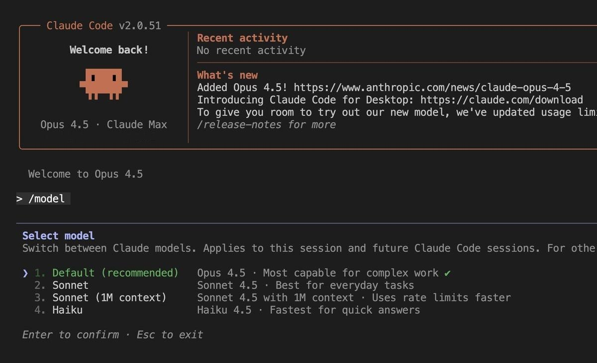

<!-- visual-asset
Asset: 20260723-0xcodez-x-article_assets/12-tier-the-models-across-the-nodes-d54a3acc6c8d.svg
Source: https://pbs.twimg.com/media/HNqrj4UWYAAvHC0?format=jpg&name=large
Original page embedding: CSS background-image on a <div> (x.com renders section images this way, not via ); fetched at name=large.
Type: image/jpeg wrapped in svg
Extracted size: 1200x730; 82644 bytes
Alt text: 12. Tier the models across the nodes
Transcription status: Text-transcribed as Mermaid diagram below.
-->

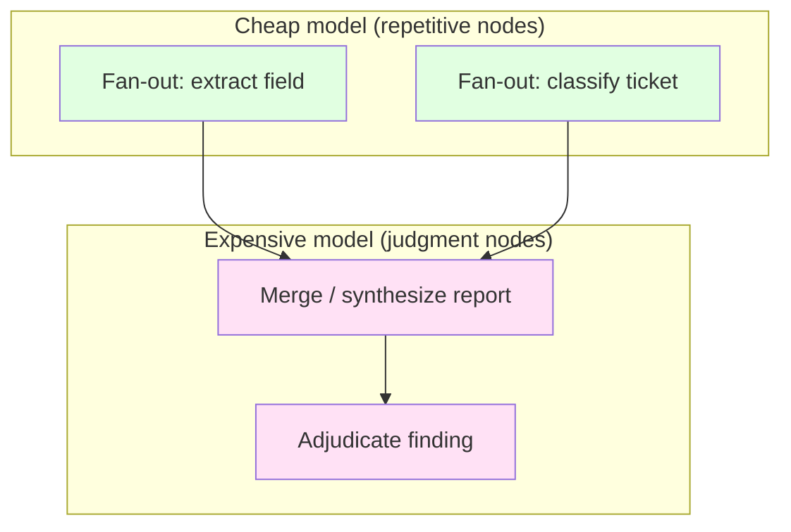
```mermaid
graph TD
    subgraph "Cheap model (repetitive nodes)"
        FanOut1[Fan-out: extract field]
        FanOut2[Fan-out: classify ticket]
    end
    subgraph "Expensive model (judgment nodes)"
        Merge[Merge / synthesize report]
        Adjudicate[Adjudicate finding]
    end
    FanOut1 --> Merge
    FanOut2 --> Merge
    Merge --> Adjudicate
    style FanOut1 fill:#e1ffe1
    style FanOut2 fill:#e1ffe1
    style Merge fill:#ffe1f5
    style Adjudicate fill:#ffe1f5
```

**Concept**: Not every node needs your best model. A graph makes it obvious: some nodes are bounded and repetitive (extract a field, classify a ticket), and some carry real judgment (synthesize a report, adjudicate a finding). Run boring nodes on a cheaper model and spend expensive tokens where judgment lives. Use the `model` option on `agent()` to route individual nodes.

Not every node needs your best model. A graph makes this obvious in a way a single agent never does:
some nodes are bounded and repetitive (extract this field, classify this ticket), and some carry the
real judgment (synthesize the report, adjudicate the finding).

Run the boring nodes on a cheaper model and spend your expensive tokens where judgment actually
lives.

In a workflow every subagent Claude spawns inherits your session model unless the script overrides
it - so by default a big run bills entirely at your session tier. The model option on a single
agent() call tells Claude to route just that node elsewhere.

Check /model before a large run, then have Claude route the fan-out’s repetitive nodes down to a
cheaper model and keep the merge node up. This is the lever that turns a token-hungry graph from
expensive into economical without touching its shape.

### 13. Topology is your cost and latency
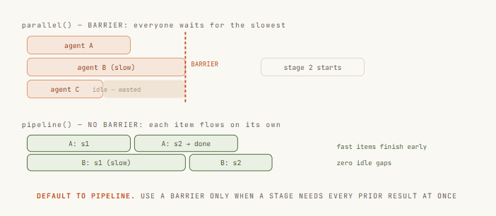

<!-- visual-asset
Asset: 20260723-0xcodez-x-article_assets/13-topology-is-your-cost-and-latency-3ebebc040648.svg
Source: https://pbs.twimg.com/media/HNqr10sW0AAFINc?format=png&name=large
Original page embedding: CSS background-image on a <div> (x.com renders section images this way, not via ); fetched at name=large.
Type: image/png wrapped in svg
Extracted size: 702x306; 26898 bytes
Alt text: 13. Topology is your cost and latency
Transcription status: Text-transcribed as Mermaid diagram below.
-->

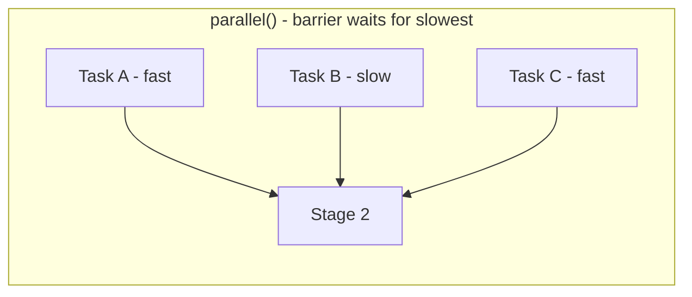
```mermaid
graph LR
    subgraph "parallel() - barrier waits for slowest"
        A1[Task A - fast] --> S1[Stage 2]
        B1[Task B - slow] --> S1
        C1[Task C - fast] --> S1
    end
```

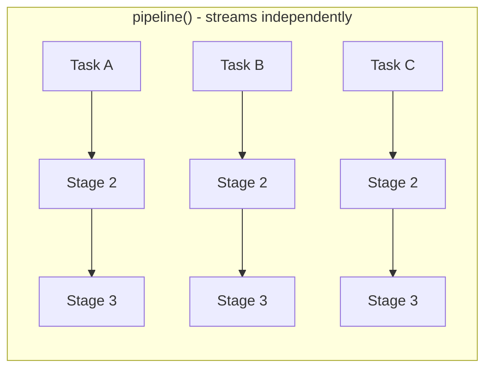
```mermaid
graph LR
    subgraph "pipeline() - streams independently"
        A2[Task A] --> A3[Stage 2] --> A4[Stage 3]
        B2[Task B] --> B3[Stage 2] --> B4[Stage 3]
        C2[Task C] --> C3[Stage 2] --> C4[Stage 3]
    end
```

**Concept**: `parallel()` makes everything wait for the slowest node. `pipeline()` streams each item through all stages independently — fast items finish early instead of idling behind slow ones. Default to `pipeline()`. Reach for a barrier only when a stage truly needs every prior result at once (cross-set dedupe, early-exit on total).

The shape of the graph isn’t cosmetic - it’s the single biggest lever on wall-clock time. The choice
that trips everyone up: parallel() versus pipeline(). A parallel() barrier makes everything wait for
the slowest node before the next stage starts.

A pipeline() streams each item through all stages independently, with no barrier - item A can be in
stage 3 while item B is still in stage 1. Fast items finish early instead of idling behind slow
ones.

Default to pipeline(). Reach for a barrier only when a stage truly needs every prior result at once
- a cross-set dedupe, an early-exit on the total, a prompt that compares against “the other
findings.” “It’s cleaner code” and “the stages feel separate” are not reasons; barrier latency is
real, measurable, wasted time. Separate is not the same as synchronized.

### 14. Let Claude draw the graph - self-routing
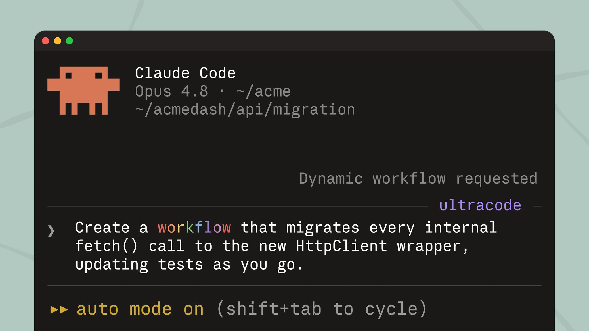

<!-- visual-asset
Asset: 20260723-0xcodez-x-article_assets/14-let-claude-draw-the-graph-self-rou-601bce38ebbe.svg
Source: https://pbs.twimg.com/media/HNqsMKpXMAAB09_?format=jpg&name=large
Original page embedding: CSS background-image on a <div> (x.com renders section images this way, not via ); fetched at name=large.
Type: image/jpeg wrapped in svg
Extracted size: 2048x1152; 120970 bytes
Alt text: 14. Let Claude draw the graph - self-routing
Transcription status: Text-transcribed as Mermaid diagram below.
-->

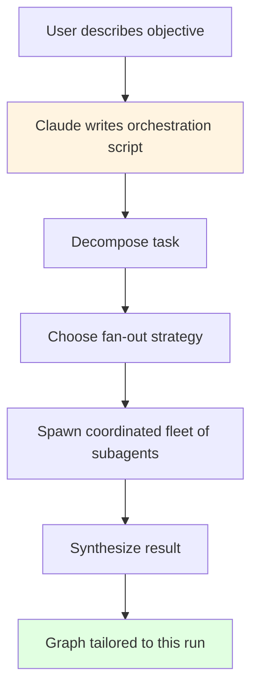
```mermaid
graph TD
    User[User describes objective] --> Claude[Claude writes orchestration script]
    Claude --> Decompose[Decompose task]
    Decompose --> Fanout[Choose fan-out strategy]
    Fanout --> Spawn[Spawn coordinated fleet of subagents]
    Spawn --> Synthesize[Synthesize result]
    Synthesize --> Graph[Graph tailored to this run]
    style Claude fill:#fff4e1
    style Graph fill:#e1ffe1
```

**Concept**: Stop drawing the graph by hand for jobs you can't plan in advance. With dynamic workflows, describe the objective and Claude writes the orchestration script itself — decomposing the task, choosing the fan-out, spawning a coordinated fleet of subagents, and synthesizing the result. Three ways in: (1) say "workflow" in your prompt; (2) run a saved workflow like `/deep-research` (scope → parallel search → fetch → adversarial verify → synthesize); (3) turn on ultracode and Claude plans a workflow for every substantial task.

The final move is to stop drawing the graph by hand for jobs you can’t plan in advance.

With dynamic workflows, you describe the objective and Claude writes the orchestration script
itself- decomposing the task, choosing the fan-out, spawning a coordinated fleet of subagents, and
synthesizing the result. You get a graph tailored to this run instead of a fixed one you hoped would
fit.

There are three ways in. Say the word “workflow” in your prompt and Claude writes one for the task.
Run a saved or bundled one - /deep-research is a real graph shipping in production: scope → parallel
search → fetch → adversarial verify → synthesize, the exact skeleton from this course.

Or turn on ultracode and Claude plans a workflow for every substantial task in the session. When a
run is good, press s to save its script into .claude/workflows/ - version-controlled, re-runnable by
name, a graph anyone who clones the repo can launch.

```
› Run a workflow to audit every route under src/routes/ for missing
auth. Spawn one agent per route file, then verify each finding before
reporting. ● Claude wrote an orchestration script · launching in
background… /workflows — auth-audit · running ✓ Scope 1/1 2.1k tok ·
4s ✓ Fan-out 18/18 one agent per route file ◯ Verify 11/18 3-vote
skeptics per finding… ○ Synthesize 0/1 waiting on verify session stays
responsive — keep working while the fleet runs
```

### Six graphs to build with Claude this week
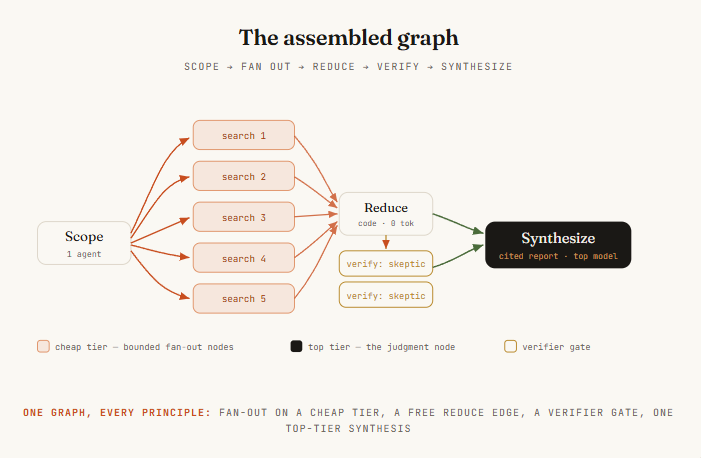

<!-- visual-asset
Asset: 20260723-0xcodez-x-article_assets/six-graphs-to-build-with-claude-this-wee-60a36253eb8b.svg
Source: https://pbs.twimg.com/media/HNqtS-UXkAAAKzv?format=png&name=large
Original page embedding: CSS background-image on a <div> (x.com renders section images this way, not via ); fetched at name=large.
Type: image/png wrapped in svg
Extracted size: 701x458; 44119 bytes
Alt text: Six graphs to build with Claude this week
Transcription status: Text-transcribed as Mermaid diagrams below; prose descriptions follow in article body.
-->

**Concept**: A 2x3 grid of miniature graph diagrams, each captioned with one of the six patterns. Each cell shows the shape (fan-out, sequential gates, parallel-verify, tiered routing, scheduled barrier, loop-until-dry) as nodes and edges. The six patterns are enumerated and described in the article body immediately below.


```mermaid
graph TB
    subgraph "Pattern 1: Security sweep"
        S1[route files] --> S2[fan-out: 1 agent per file]
        S2 --> S3[verifier pass]
        S3 --> S4[report]
    end
    subgraph "Pattern 2: Cited report"
        C1[question] --> C2[decompose into angles]
        C2 --> C3[parallel searches]
        C3 --> C4[dedupe sources]
        C4 --> C5[3-vote skeptics]
        C5 --> C6[write]
    end
    subgraph "Pattern 3: Port a module"
        P1[files] --> P2[parallel translation]
        P2 --> P3[test suite gate]
        P3 --> P4[loop failures back]
        P4 --> P5[adversarial review]
    end
    subgraph "Pattern 4: Adversarial diff review"
        D1[diff] --> D2{size?}
        D2 -->|small| D3[one quick pass]
        D2 -->|large| D4[parallel audit: correctness/security/performance]
        D4 --> D5[judge panel synthesizes]
    end
    subgraph "Pattern 5: Ecosystem scan"
        E1[schedule trigger] --> E2[parallel sources: releases/blogs/discussion]
        E2 --> E3[rank by impact]
        E3 --> E4[write digest]
    end
    subgraph "Pattern 6: Discovery loop"
        L1[finders in parallel] --> L2[dedupe vs seen]
        L2 --> L3[verify survivors]
        L3 --> L4{two dry rounds?}
        L4 -->|no| L1
        L4 -->|yes| L5[stop]
    end
```

**Six graph patterns to build:**

- Security sweep across every route. Claude spawns one subagent per route file, each hunting for missing auth checks, then a verifier pass confirms every finding before it reaches the report. Breadth no single context could hold.
- Cited report with /deep-research. A graph that ships in Claude Code already. Claude decomposes your question into distinct angles, runs parallel searches, dedupes sources, then adversarially verifies every claim with three-vote skeptics before writing.
- Port a module, file by file. The Bun ceiling, scaled to your repo. Claude fans out translation across files, runs the test suite as a gate on each, and loops the failures back - adversarial review catching what a single pass would ship broken.
- Adversarial review of a diff. Claude routes on diff size: a small change gets one quick pass, a large one triggers a full parallel audit with reviewers on distinct lenses - correctness, security, performance - then a judge panel synthesizes.
- Ecosystem scan on a schedule. Save it once, re-run it forever. Claude checks many sources in parallel - eleases, blogs, discussion - ranks by impact at a barrier, and writes the digest. Version-controlled in .claude/workflows/, launchable by name.
- Discovery of unknown size. You don’t know how many bugs are there. Claude runs finders in parallel, dedupes each new find against everything seen, verifies survivors, and keeps looping until two rounds turn up nothing new - then stops.

### Conclusion:

A prompter asks a question. An architect draws a graph.

The linear agent was never the ceiling - it was just the first shape, the one everyone reaches for
because it matches how we type. One line, one head, one thing at a time.

Once you can see the nodes and the edges, you stop asking the agent to do more and start asking the
graph to do it wider: fan out where the work is independent, gate the edges where confidence
matters, tier the models where judgment doesn’t.

Most people will keep queueing steps in a line. The ones who learn to draw the graph will run a
fleet - and never notice the ceiling the rest are stuck under.

---

**Author:** [Codez (@0xCodez)](https://x.com/0xCodez) — Content creator | AI researcher & builder | AI insights from 2030 | [@zscdao](https://x.com/zscdao)

<!-- extraction-note: Trailing page chrome removed (premium upsell, verified-account badge SVGs, and a doubleclick.net tracking pixel that failed to fetch). The two inline-svg assets preserved earlier are the x.com "verified account" badge icon, not article content. -->

