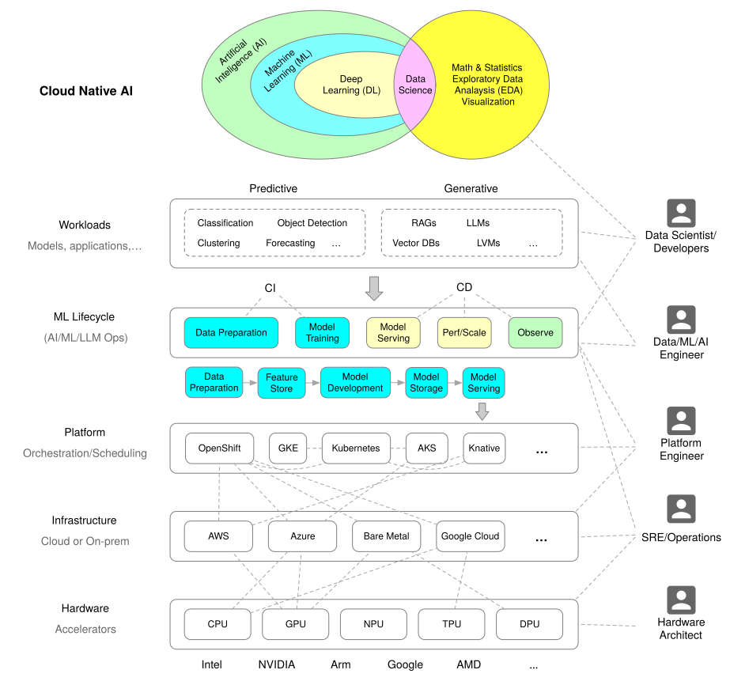

# Kubernetes 在 AI Native 时代的挑战与转型 | Jimmy Song

> 探讨 Kubernetes 在 AI Native 时代面临的挑战，以及如何从 Cloud Native 迈向 AI Native，实现平台的持续相关性。

## Source Metadata

- Source URL: https://jimmysong.io/zh/blog/kubernetes-ai-native/
- Canonical URL: https://jimmysong.io/zh/blog/kubernetes-ai-native/
- Fetched at: 2026-07-25T06:30:56+00:00
- Extraction method: stdlib-html-parser

## Page Content

[跳转到主要内容](https://jimmysong.io/zh/blog/kubernetes-ai-native/#main-content)[跳转到导航](https://jimmysong.io/zh/blog/kubernetes-ai-native/#navigation)[跳转到分享](https://jimmysong.io/zh/blog/kubernetes-ai-native/#social-share)[跳转到页脚](https://jimmysong.io/zh/blog/kubernetes-ai-native/#site-footer)

## Kubernetes 在 AI Native 时代的挑战与转型

探讨 Kubernetes 在 AI Native 时代面临的挑战，以及如何从 Cloud Native 迈向 AI Native，实现平台的持续相关性。

2025/09/03
•
[云原生](https://jimmysong.io/zh/categories/cloud-native)
•
21 分钟
•
7318 字
•
今年更新

Kubernetes 正如 Linux，已从“明星技术”转型成为云原生

##### 云原生（Cloud Native）

充分利用云计算优势的应用程序开发和部署方法。

的底层基础设施。它正在前台“消失”，却依然是混合算力和智能调度的核心。唯有持续进化并深度融入 AI 生态，Kubernetes 才能在新技术浪潮中保持关键地位。

随着 AI 技术的爆发式发展，基础设施被提出了前所未有的高要求。Kubernetes 作为 Cloud Native（云原生）时代的事实标准，在 AI Native
时代正面临全新的挑战：更高级的算力调度、异构资源管理、数据安全与合规，以及更加自动化和智能化的运维等。传统的云原生实践已无法完全满足 AI 工作负载的需求，Kubernetes
若想保持自身的相关性，就必须与时俱进地演化。这对于已经走过近十年发展的 Kubernetes 来说是一个重要命题——笔者自 2015 年 Kubernetes 开源伊始就开始关注并在社区布道
Kubernetes，转眼间它已经成为基础设施领域的“常青树”，如今在 AI 浪潮下是时候重新审视它的角色与前景了。

Kubernetes 在 AI Native 时代的角色正在发生转变。从前它是微服务时代的明星，被誉为“云端的操作系统”，负责在多样环境中可靠地编排容器化

##### 容器化（Containerization）

将应用程序及其依赖打包到容器中的技术。

工作负载。但 AI 原生的工作负载（尤其是生成式 AI 时代之后）有着本质的不同，可能让 Kubernetes 退居幕后成为“隐形的基础设施”——重要但不再是显性创新发生的舞台。具体而言，大型 AI
模型的训练和托管常常发生在超大规模云厂商（Hyperscaler）的专有基础设施上，很少离开那些深度集成的环境；模型推理服务则越来越多地通过 API
形式对外提供，而不是作为传统应用容器部署。此外，训练任务的调度对 GPU 感知、高吞吐的需求远超以往，往往需要借助 Kubernetes 之外的专门框架来实现。因此，AI Native
软件栈的分层方式也与云原生时代有所不同：在新的架构中，最上层是 AI Agent 和 AI 应用，其下是上下文数据管道和向量数据库等数据层，再下层是模型及其推理 API
接口，底层则是加速计算基础设施。在这样分层的体系中，如果不做出改变，Kubernetes 可能沦为背后的“底层支撑”——依然重要，但不再是创新的前台舞台。

### Kubernetes 在 AI Native 时代的挑战

什么是 Run:ai？

Run:ai 是 NVIDIA 提供的一款 Kubernetes 原生 GPU

##### GPU（图形处理器）

并行计算利器，常用于深度学习训练。

编排与优化平台，专为 AI 工作负载设计。它通过智能调度、动态分配与“GPU 分片”（fractional GPU）功能，极大提升 GPU 利用率；支持跨本地、云端与混合场景的统一管理，并可通过 API、CLI、UI 与 Kubeflow、Ray、ML-tools 等主流 AI 工具链无缝集成。详见 [NVIDIA 网站](https://www.nvidia.com/en-us/software/run-ai/)。

即使在 AI 时代，Kubernetes 仍不可或缺，尤其在混合部署（本地数据中心 + 云）、统一运维以及 AI 与传统应用混合工作负载等场景下，Kubernetes
依然是理想的控制平面。然而，要避免退居幕后，Kubernetes 必须正视并解决 AI 工作负载带来的特殊挑战，包括：

1. 高级 GPU 调度：提供对 GPU 等加速硬件的感知调度能力，匹配或集成诸如 Run:ai 之类框架的功能。AI 模型训练训练（Training）使用数据集调整模型参数的过程，使模型能够学习数据中的模式。常涉及大量 GPU 任务调度，Kubernetes 需要更智能地分配这些昂贵资源，以提高利用率。
1. 深度 AI 框架集成：与分布式 AI 计算框架深度融合，确保在 Kubernetes 上无缝编排像 Ray、PyTorchPyTorch主流深度学习框架，提供灵活易用的模型开发接口。 等分布式训练/推理作业。这意味着 Kubernetes 应该为这些框架提供原生支持或接口，使其可以借助 Kubernetes 的调度和编排能力，同时满足高速通信和跨节点协同的需求。
1. 优化数据管道处理：支持低延迟、高吞吐的数据管道，方便 AI 工作负载高效地访问海量数据集。模型训练和推理对数据依赖极强，Kubernetes 需要在存储编排、数据本地性、缓存机制等方面提供优化，以减少数据瓶颈。
1. 推理服务弹性扩缩：将模型推理 API 视为一等公民，实现对推理服务的自动扩缩和编排管理。随着越来越多的 AI 模型以服务形式对外提供接口，Kubernetes 需要能够根据流量自动伸缩这些模型推理服务，并处理版本更新、流量灰度发布灰度发布（Canary Release）逐步将新版本发布给部分用户，以验证新版本的稳定性和性能。等需求。
上述这些正是 Kubernetes 在 AI 原生时代必须直面的课题。如果不能在这些方面有所突破，Kubernetes 的地位可能会从战略核心变为背景中的基础设施管道——有用但不再举足轻重。

### Cloud Native 与 AI Native 技术栈的不同

云原生技术栈主要围绕微服务架构、容器化部署和持续交付

##### 持续交付（Continuous Delivery）

保持代码随时可以部署到生产状态的开发实践。

来构建，核心包括容器、Kubernetes 编排、服务网格、CI/CD

##### CI/CD（持续集成/持续部署）

一种通过在应用开发阶段引入自动化来频繁向客户交付应用的方法。

流水线等，重视应用的快速迭代部署、弹性伸缩和可观测性。而 AI 原生技术栈在此基础上向更深层次扩展，侧重于异构算力调度、分布式训练以及高效推理优化等方面。换言之，在云原生的基础设施之上，AI 原生场景引入了许多专门针对 AI 工作负载的组件：包括分布式训练框架（如 PyTorch DDP、TensorFlow MultiWorker）、模型服务化框架（如 KServe、Seldon）、高速数据管道和消息系统（如 Kafka、Pulsar）、新的数据库类型如向量数据库（Milvus、Chroma 等）以及用于追踪模型性能的观测工具等。CNCF 于 2024 年发布的[云原生 AI 白皮书](https://www.cncf.io/reports/cloud-native-artificial-intelligence-whitepaper/)中给出了一张技术景观图，清晰地展示了 AI Native 如何扩展了 Cloud Native 的边界，在原有技术栈上叠加了诸多 AI 特定的工具和框架。

<!-- visual-asset
Asset: 20260725-kubernetes-ai-native-jimmy-song_assets/cloud-native-ai-e63b67916fbf.svg
Source: https://assets.jimmysong.io/images/blog/cloud-native-ai-whitepaper/cloud-native-ai.svg
Type: svg
Extracted size: 923x866
Alt text: 图 1: 云原生 AI 景观图（根据 CNCF 云原生 AI 白皮书绘制）
Transcription status: preserved as local SVG asset
Multimodal status: local SVG asset is available when Asset is a relative path; inspect it directly for visual details.
Text-only fallback: use alt text, source URL, dimensions, nearby page text, and any explicit caption; visual content is not fully transcribed unless Mermaid or a human/agent note is added.
Mermaid: not inferred automatically; add only after visual inspection confirms a diagram, flowchart, graph, or timeline.
-->

图 1: 云原生 AI 景观图（根据 CNCF

##### CNCF（云原生计算基金会）

Cloud Native Computing Foundation，致力于推广云原生技术的非营利组织。

云原生 AI 白皮书绘制）

下面我们按照领域列举云原生/Kubernetes 生态中与 AI 密切相关的一些典型开源项目，来体现 Cloud Native 与 AI Native 技术栈的异同。

#### 通用调度与编排（General Orchestration）

Kubernetes 本身依然是底座，但为更好地支持 AI 任务，出现了诸多在 Kubernetes 之上增强调度能力的项目。例如，Volcano
提供面向批处理和机器学习作业的调度优化，支持任务依赖和公平调度；KubeRay 则通过 Kubernetes 原生控制器来部署和管理 Ray 集群，使大规模分布式计算框架 Ray 可以在
Kubernetes 上弹性伸缩

##### 弹性伸缩（Elastic Scaling）

根据负载自动调整资源的能力，包括水平和垂直伸缩。

。这些工具强化了 Kubernetes 对 AI 工作负载（尤其是需要占用大量 GPU 的任务）的调度治理能力。

#### 分布式训练（Distributed Training）

针对大规模模型的分布式训练，社区也提供了成熟的解决方案。Kubeflow 的 Training Operator

##### Operator（运算器）

用于封装和管理 Kubernetes 应用运维知识的控制器，实现应用的自动化部署和运维。

就是典型代表，它为 Kubernetes 提供自定义资源来定义训练作业（如 TensorFlow Job、PyTorch Job），自动创建相应的 Master/Worker
容器以在集群中并行训练模型。此外，像 Horovod、DeepSpeed、Megatron 等分布式训练框架也能在 Kubernetes 环境下运行，通过 Kubernetes
来管理跨节点的训练进程和资源配置，以实现线性扩展的模型训练能力。

#### 模型服务化（ML Serving）

在模型训练完成后，如何将模型部署为在线服务也是 AI Native 技术栈的重要组成部分。在 Kubernetes 生态中，KServe（前身为 KFServing）和 Seldon Core
是两大常用的模型服务框架，提供了将训练后的模型打包成容器并部署为可自动扩缩的服务的能力。它们支持流量路由、滚动升级和多模型管理，方便地在 Kubernetes 上实现 AB 测试和 Canary
发布等。近年兴起的 vLLM 则是专注于大语言模型（LLM

##### LLM（大语言模型）

一种能够理解和生成人类语言的深度学习算法。

）高性能推理的开源引擎，采用高效的键值缓存架构以提升吞吐，并支持在 Kubernetes 集群上横向扩展部署。例如，vLLM 项目已经从单机版发展出面向集群的“vLLM
production-stack”方案，可以在多 GPU 节点上无缝运行，通过共享缓存和智能路由实现比传统推理服务高数量级的性能提升。

#### 机器学习管道与 CI/CD

在模型从开发到部署的生命周期中，涉及数据准备、特征工程、模型训练、模型评估到上线部署的一系列步骤。Kubeflow Pipelines 等工具在 Kubernetes
上提供了端到端的机器学习工作流编排机制，允许将上述步骤定义为流水线并运行在容器之中，实现一键式的训练到部署流程。同时，诸如 MLflow
等工具与这些流水线集成，用于追踪实验指标、管理模型版本和注册模型，结合 BentoML 等模型打包工具，可以方便地将模型以一致的方式打包部署到 Kubernetes 集群。

#### 数据科学交互环境（Data Science Environments）

数据科学家常用的 Jupyter Notebook 等交互式开发环境也可以通过 Kubernetes 来提供。像 Kubeflow Notebooks 或 JupyterHub on
Kubernetes 让每位用户在集群中获得独立的容器化开发环境，既方便调用大规模数据集和 GPU 资源，又保证不同用户/团队的隔离。这实质上将云原生的多租户能力应用到数据科学场景，使 AI
研发能够在共享的基础设施上进行而不彼此干扰。

#### 工作负载可观测性（Workload Observability）

在 AI 场景下，系统监控和性能追踪同样不可或缺。云原生领域成熟的监控工具如 Prometheus

##### Prometheus

开源监控告警系统，采用拉取模型采集时序数据。

和 Grafana 仍然大显身手，可以收集 GPU 利用率、模型响应延迟等指标，为 AI 工作负载提供监控报警。同时，OpenTelemetry
等开放标准为分布式跟踪提供了基础，使跨服务的调用链路分析也适用于模型推理请求的诊断。另外，Weights &
Biases（W&B）等机器学习实验跟踪平台在模型训练阶段广泛应用，用于记录模型指标、超参数和评估结果。而面对大语言模型的新挑战，一些新兴工具（如 Langfuse、OpenLLMetry
等）开始专注于模型层面的观测，提供对生成内容质量、模型行为的监控手段。这些工具与 Kubernetes 的集成，使运维团队能够像监控传统微服务那样监控 AI 模型的表现。

#### 自动机器学习（AutoML）

为提高模型开发效率，许多团队会使用超参数调优和自动机器学习工具来自动搜索模型的最佳配置。Kubeflow Katib 是一个 Kubernetes 原生的 AutoML
工具，它通过在集群中并行运行大量实验（每个实验跑一个模型训练作业）来试验不同的超参数组合，最终找到最优解。Katib 将每个实验封装为 Kubernetes Pod 并由 Kubernetes
调度，从而充分利用集群空闲资源。类似的还有微软的 NNI (Neural Network

##### Neural Network（神经网络）

受到生物神经网络启发的计算模型。

Intelligence) 等，也支持在 Kubernetes 上运行实验以进行自动调参和模型结构搜索。

#### 数据架构与向量数据库（Data Architecture & Vector Databases）

AI 应用对数据的需求促使传统的大数据技术与云原生结合得更加紧密。一方面，像 Apache Spark、Flink 这类批处理和流处理引擎已经可以在 Kubernetes 上运行，通过
Kubernetes 来管理它们的分布式执行和资源分配。同时，Kafka 和 Pulsar 等消息队列、HDFS、Alluxio 等分布式存储也都可以以 Operator 形式部署在
Kubernetes 集群中，为 AI 工作负载提供弹性的数据管道和存储服务。另一方面，新兴的向量数据库（如 Milvus、Chroma、Weaviate 等）成为 AI
技术栈中特有的组件，用于存储和检索向量化

##### 向量化（Vectorization）

将数据转换为向量表示的过程，用于机器学习和信息检索。

的特征表示，在实现相似度搜索、语义检索等功能时不可或缺。这些向量数据库同样能够部署在 Kubernetes 上运行，有些还提供 Operator 来简化部署管理。通过 Kubernetes
来托管这些数据基础设施，团队可以在同一套集群上同时管理计算（模型推理/训练）和数据服务，实现计算与数据的一体化调度。

#### Service Mesh 与 AI Gateway

在 AI Native 场景中，服务网格不仅仅是传统的东西南北流量治理工具，还逐渐演化为 AI 流量网关。例如：

- Istio / Envoy：通过 Filter 扩展机制支持 AI 流量治理，Envoy 甚至出现了 AI Gateway 原型（[Envoy AI Gateway](https://aigateway.envoyproxy.io/)），能够为推理流量提供统一入口、流量路由和安全策略。
- kgateway：基于 Envoy proxy 的网关，支持 PromptPrompt（提示词）输入给 AI 模型的指令或文本。 Guard 提示词防护、推理服务编排、多模型调度与故障转移。
- kagent：Kubernetes 原生的 Agentic AIAgentic AI（智能体式 AI）具备自主规划、行动与工具调用能力的 AI 形态。 框架，通过 CRD 声明式管理 AI Agent，结合 MCP 协议实现多智能体协作，用于智能诊断和自动化运维。
- agentgateway：专为 AI AgentAI Agent（智能体）一个能够感知环境并采取行动以实现目标的智能体。 通信设计的新型代理（已捐赠给 Linux Foundation），支持 A2A（Agent-to-Agent）通信和 MCP 协议，具备安全治理、可观测性、跨团队工具共享等功能。
- kmcp：面向 MCPMCP（模型上下文协议）用于在模型与外部工具或数据源之间传递上下文的协议标准，定义交互与数据格式。 Server 开发与运维的工具集，提供从 init、build、deploy 到 CRD 控制的全生命周期支持，简化 AI 工具的原生化运行和治理。
这些项目的出现表明，Service Mesh 技术正从 “微服务的流量治理” 扩展为 “AI 应用的智能流量与 Agent

##### Agent（智能体）

能够感知环境并执行动作以达成目标的实体或软件组件。

协作底座”。在 AI Native 架构中，服务网关 + 网格化治理将成为连接 LLM、Agent 与传统微服务的重要桥梁。

通过以上概览可以看出，Cloud Native 生态正在快速扩展以拥抱 AI 场景，各类开源项目让 Kubernetes 成为了承载 AI 工作负载的平台底座。Kubernetes
社区和周边生态正积极将云原生领域的成熟经验（如可扩展的控制平面、声明式 API 管理等）应用到 AI 领域，从而在 Cloud Native 与 AI Native 之间架起桥梁。这种融合既帮助 AI
基础设施继承了云原生的优良基因（弹性、可移植、标准化），也让 Kubernetes 通过扩展和集成保持在 AI 浪潮中的生命力。

### 易用性与未来展望

需要注意的是，Kubernetes 本身的易用性和抽象层次也在受到新的审视。随着 Kubernetes 成为“底座”，开发者希望与之交互的方式变得更简单高效。社区中不乏关于“[Kubernetes 2.0](https://aws.plainenglish.io/kubernetes-2-0-just-killed-yaml-heres-what-google-s-sres-are-really-using-2025-b99960fa614c)”的探讨，有观点认为当前繁琐的 YAML 配置已经成为生产实践中的痛点：据报道称多达 79% 的 Kubernetes 生产故障可追溯到 YAML 配置错误（例如缩进、冒号错漏等）。“YAML 疲劳”引发了对更高级别、更智能的操作界面的呼声，一些人畅想未来的 Kubernetes 将弱化对手工编写 YAML 的依赖，转而采用更自动化、声明意图更简洁的方式来部署应用。例如，有传闻中的“Kubernetes 2.0”雏形展示了不再需要 Helm Chart

##### Helm Chart

用于定义、安装和升级 Kubernetes 应用的一组模板与配置包。

和成百上千行 YAML，仅用一条类似 k8s2 deploy --predict-traffic=5m 的指令即可完成部署的设想。尽管这些还停留在设想或早期尝试阶段，但折射出业界对
Kubernetes 易用性的期待：即在保证强大灵活的同时，尽量降低认知和操作负担。这对于支持复杂的 AI 工作负载尤为重要，因为用户更关心模型本身的迭代，而不希望被底层繁琐的配置细节绊住手脚。

### 技术的“消失”与新机遇

最后，正如 Kubernetes 项目主席（名誉）Kelsey Hightower 所言，如果基础设施的演进符合预期，那么 Kubernetes 终将“消失”在前台，变成像今天的 Linux
一样稳定而无处不在的底层支撑。这并不是说 Kubernetes 会被弃用，而是说当 Kubernetes
足够成熟并被更高层的抽象所封装后，开发者无需感知其中细节，但它依然默默地提供核心能力。这种“淡出视野”恰恰意味着技术的进一步进化。面对 AI 原生时代，Kubernetes
也许不会以原来的样子出现于每个开发者面前，但它很可能以内嵌于各种 AI 平台和工具的形式继续发挥作用——从云到边缘，无处不在地提供统一的资源调度与运行时支持。Kubernetes
一方面需要保持内核的稳定与通用性，另一方面也应该鼓励在其之上构建面向特定领域的上层平台，就如同早期云原生生态中出现的 Heroku、Cloud Foundry 那样，在 Kubernetes
之上为不同场景提供更简化的用户体验。

综上所述，Kubernetes 在 AI Native 时代既面临挑战又充满机遇。只要社区能够顺应潮流，不断演进 Kubernetes 的能力边界并改进易用性，我们有理由相信 Kubernetes
会成为 AI 时代混合计算基础设施的核心支柱，继续在新的十年里发挥不可替代的作用。

### Cloud Native 开源 vs. AI Native 开源

在 Cloud Native 时代，Kubernetes
等基础设施工具的开源不仅意味着源代码开放，更意味着开发者可以在本地完整编译、重构、定制和运行这些工具。社区拥有高度的可控性和创新空间，任何人都能基于开源项目进行深度二次开发，推动生态繁荣。

而在 AI Native 时代，虽然许多大模型

##### 大模型（Large Language Model）

参数规模巨大的深度学习模型，通常指具有数十亿到数万亿参数的语言模型。

（如 Llama、Qwen 等）以“开源”名义发布，甚至开放了模型权重和部分代码，但实际可重构性和可复现性远低于 Cloud Native 工具。主要原因包括：

1. 数据不可得与复现门槛高：根据 OSIOSI（开源促进会）维护开源定义与许可标准的组织。（Open Source Initiative）最新定义，真正的开源 AI 模型不仅要开放权重和代码，还需详细描述训练数据集。但现实中，绝大多数大模型的训练数据无法公开，开发者难以复现原始模型。
1. 工具链复杂且资源门槛高：AI 模型的训练依赖庞大的算力、复杂的数据管道和专有工具链，普通开发者即使获得全部代码和权重，也难以在本地重构或修改模型。
1. 法律与治理障碍：数据版权、隐私保护等法律问题使得开源 AI 的数据流通受限，模型的“开源”更多停留在权重和 API 层面，缺乏 Cloud Native 那样的完整开放。
1. 生态协作模式不同：Cloud Native 项目强调社区驱动、标准化和可插拔架构，而 AI Native 开源更多依赖企业主导和“部分开放”，社区参与度和创新空间有限。
这种差异导致 AI Native 时代的“开源”更多是一种有限开放：开发者可以使用和微调模型，但很难像重构 Kubernetes 那样深度定制和创新。真正的开源 AI
仍在探索阶段，未来需要解决数据开放、工具链标准化和法律治理等多重挑战，才能实现 Cloud Native 式的开放协作。

### AI 领域的开源基金会现状与挑战

在云原生领域，CNCF（Cloud Native Computing Foundation）等基金会通过统一治理、项目孵化和社区协作，极大推动了 Kubernetes 及相关生态的繁荣。然而，AI
领域至今尚未出现类似 CNCF 的统一开源基金会来统筹 AI 基础设施和生态发展。究其原因，主要有以下几点：

1. 技术分散与生态碎片化：AI 技术栈高度分散，涵盖模型、框架、数据、硬件、工具链等多个层面，不同领域（如深度学习、推理、数据管道、Agent 框架等）各自为政，难以像云原生那样形成统一的标准和治理模式。
1. 商业利益与专有壁垒：主流 AI 技术（如大模型、推理 API、Agent 平台）往往由大型科技公司主导，开源项目与商业闭源产品高度交织，企业间缺乏足够的动力推动“中立基金会”统一治理。
1. 治理模式尚未成熟：Linux Foundation 虽然设有 LF AI & Data、PyTorch Foundation 等子基金会，但它们多聚焦于特定项目或领域，缺乏 CNCF 那样的“技术景观图”和统一孵化机制。AI 领域的快速演进和多样化需求，使得基金会难以制定通用的治理框架。
1. 行业观点分歧：如 Linux Foundation CEO [Jim Zemlin 所言](https://thenewstack.io/the-linux-foundation-in-the-age-of-ai/)，AI 领域的开源治理尚处于探索阶段，基金会更倾向于支持具体项目而非打造统一大伞。部分业界人士认为，AI 的创新速度和商业化压力远高于云原生，基金会模式需要新的适应和演化。
目前，AI 领域的开源基金会主要以“项目孵化 + 社区支持”为主，例如 LF AI & Data 支持 ONNX、PyTorch、Milvus 等项目，但尚未形成 CNCF
式的统一技术景观和治理体系。未来，随着 AI 技术标准化和生态成熟，或许会出现类似 CNCF 的统一基金会，但短期内仍以分散治理和多元协作为主。

这一现状也反映在 Kubernetes 与 AI 的融合路径上：Kubernetes 作为云原生的底座，依赖 CNCF 的治理和生态推动，而 AI 领域则更多依靠各自项目和社区的自发协作。只有当 AI
技术栈趋于标准化、行业需求趋同，才有可能诞生类似 CNCF 的统一基金会，推动 AI 基础设施的开放创新。

Kubernetes 在 AI Native 时代正从云原生的“明星”转型为 AI 应用背后的基础平台。面对异构算力、海量数据和智能运维等新需求，Kubernetes 需主动与 AI
生态深度融合，通过插件扩展和框架集成，成为统一承载传统应用与 AI 系统的混合算力底座。无论在混合云还是企业数据中心，Kubernetes 依然是 AI
工作负载不可或缺的核心基础设施，只要持续演进，其在 AI 时代的关键地位将得以巩固。

### 参考资料

- [Kubernetes and beyond: a year-end reflection with Kelsey Hightower - cncf.io](https://www.cncf.io/blog/2024/01/22/kubernetes-and-beyond-a-year-end-reflection-with-kelsey-hightower)
- [Cloud Native Artificial Intelligence Whitepaper – cncf.io](https://www.cncf.io/reports/cloud-native-artificial-intelligence-whitepaper/)
- [Kubernetes in an AI-Native World: Can It Stay Relevant? - clouddon.ai](https://clouddon.ai/kubernetes-in-an-ai-native-world-can-it-stay-relevant-a23a06b26397)
- [Kubernetes 2.0 Might Kill YAML — Here’s the Private Beta That Changed Everything (2025) - aws.plainenglish.io](https://aws.plainenglish.io/kubernetes-2-0-just-killed-yaml-heres-what-google-s-sres-are-really-using-2025-b99960fa614c)
- [The Linux Foundation in the Age of AI - thenewstack.io](https://thenewstack.io/the-linux-foundation-in-the-age-of-ai/)
- [What Is Open Source AI Anyway? - thenewstack.io](https://thenewstack.io/what-is-open-source-ai-anyway/)

<!-- visual-asset
Asset: 20260725-kubernetes-ai-native-jimmy-song_assets/jimmysong-974a4d6f464e.svg
Source: https://jimmysong.io/images/jimmysong.jpg
Type: image/jpeg wrapped in svg
Extracted size: 600x600; 42488 bytes
Alt text: 宋净超（Jimmy Song）
Transcription status: preserved as local SVG asset
Multimodal status: local SVG asset is available when Asset is a relative path; inspect it directly for visual details.
Text-only fallback: use alt text, source URL, dimensions, nearby page text, and any explicit caption; visual content is not fully transcribed unless Mermaid or a human/agent note is added.
Mermaid: not inferred automatically; add only after visual inspection confirms a diagram, flowchart, graph, or timeline.
-->

#### 宋净超（Jimmy Song）

专注于 AI 原生基础设施与云原生应用架构的研究与开源实践。

更新于 2025/09/05

[Kubernetes](https://jimmysong.io/zh/tags/kubernetes)
[AI](https://jimmysong.io/zh/tags/ai)
[AI Agent](https://jimmysong.io/zh/tags/ai-agent)
[Cloud Native](https://jimmysong.io/zh/tags/cloud-native)

##### 微信分享

使用微信扫描二维码分享

文章导航

[上一篇](https://jimmysong.io/zh/blog/e2b-browserbase-report/)
[云端智能体基础设施新纪元：E2B 与 Browserbase 深度调研与全球趋势分析](https://jimmysong.io/zh/blog/e2b-browserbase-report/)

[下一篇](https://jimmysong.io/zh/blog/vibe-coding-tools-comparison/)

[氛围编程工具全景对比：从插件到 IDE、从终端到 Agent](https://jimmysong.io/zh/blog/vibe-coding-tools-comparison/)

延伸阅读

#### [Kubernetes AI 应用基础设施开源实践与创新：Solo.io 开源项目研究](https://jimmysong.io/zh/blog/kubernetes-ai-oss-solo/)

[2025-09-01](https://jimmysong.io/zh/blog/kubernetes-ai-oss-solo/)

[云原生](https://jimmysong.io/zh/blog/kubernetes-ai-oss-solo/)

[24min](https://jimmysong.io/zh/blog/kubernetes-ai-oss-solo/)

#### [什么样的 AI 平台算得上 Kubernetes 原生？](https://jimmysong.io/zh/blog/k8s-ai-conformance/)

[2025-11-12](https://jimmysong.io/zh/blog/k8s-ai-conformance/)

[云原生](https://jimmysong.io/zh/blog/k8s-ai-conformance/)

[4min](https://jimmysong.io/zh/blog/k8s-ai-conformance/)

#### [Kubernetes 在 AI 浪潮下的“焦虑”与新生](https://jimmysong.io/zh/blog/kubernetes-in-ai-wave-anxiety-and-rebirth/)

[2026-04-03](https://jimmysong.io/zh/blog/kubernetes-in-ai-wave-anxiety-and-rebirth/)

[云原生](https://jimmysong.io/zh/blog/kubernetes-in-ai-wave-anxiety-and-rebirth/)

[6min](https://jimmysong.io/zh/blog/kubernetes-in-ai-wave-anxiety-and-rebirth/)

评论区
